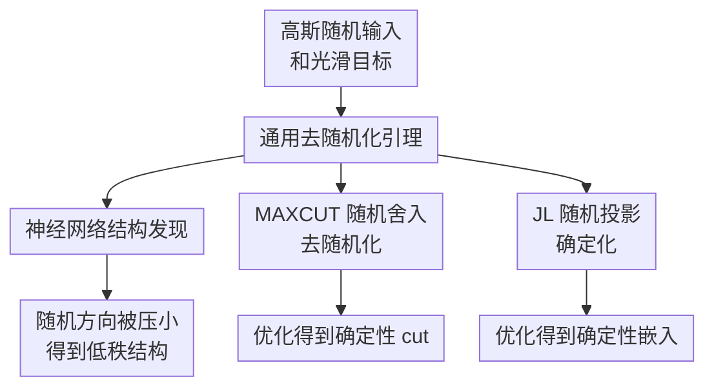

# A Derandomization Framework for Structure Discovery: Applications in Neural Networks and Beyond

**会议**: ICLR2026  
**OpenReview**: [https://openreview.net/forum?id=dtIf5HsOIn](https://openreview.net/forum?id=dtIf5HsOIn)  
**代码**: https://github.com/TPMT26/StructureDiscovery  
**领域**: learning theory  
**关键词**: 结构发现, 去随机化, 二阶驻点, 隐式正则化, Johnson-Lindenstrauss

## 一句话总结
这篇论文提出一个基于 $\rho$-SOSP 的通用去随机化引理，证明在高斯输入、光滑目标和极小权重正则下，二阶驻点会自动压低随机线性部分，从而解释神经网络第一层权重的低秩结构发现，并推广到 MAXCUT 舍入和 Johnson-Lindenstrauss 嵌入的确定性构造。

## 研究背景与动机
**领域现状**：神经网络理论里，一个长期问题是解释模型为什么会从高维随机输入中学到低维有效结构。teacher-student setting 是研究这个问题的常见形式：标签只依赖某个低维 teacher 子空间，而 student 网络从高维输入开始训练；如果训练后的第一层权重主要落在 teacher 子空间里，就说明网络发现了隐藏结构。

**现有痛点**：Mousavi-Hosseini et al. 这类工作已经证明过两层网络在 SGD 和强正则下会出现低秩结构，但条件较重：网络结构受限、部分参数被冻结、损失和训练动态需要特殊处理，而且常依赖强正则把无关方向压掉。这使得结论看起来更像某个训练算法和某个模型族的性质，而不是结构发现本身的普遍机制。

**核心矛盾**：真正想解释的是“为什么到达合理驻点后，无关随机方向会消失”，而不是“某个特定 SGD 轨迹为什么在强正则下消失”。如果只看一阶驻点，高秩鞍点和坏驻点仍可能存在；如果正则太强，又很难区分结构发现来自目标几何，还是来自人为把权重压小。

**本文目标**：作者把问题改写成一个更抽象的去随机化问题：给定形如 $\mathbb{E}_x[g_\theta(Wx+b)]+\lambda\|W\|_F^2$ 的目标，只要优化到近似二阶驻点，能否推出 $W$ 必须很小？在神经网络中，$W$ 对应 teacher 子空间正交方向的第一层权重；在 MAXCUT 和 JL 中，$W$ 对应随机舍入或随机投影里的方差/随机矩阵部分。

**切入角度**：本文的关键观察是，二阶驻点不仅要求梯度小，还要求 Hessian 没有明显负曲率。这一点能排除很多一阶条件无法排除的鞍点。作者进一步利用 Stein 引理，把关于随机输入 $x$ 的一阶条件和关于 bias $b$ 的二阶曲率联系起来，得到“随机线性项在二阶驻点处会被压小”的统一结论。

**核心 idea**：用 $\rho$-SOSP 和一个极小的 $\lambda\|W\|_F^2$ 正则，把“结构发现”从具体 SGD 轨迹中抽出来，证明任何足够二阶稳定的解都会自动去随机化，即让目标中的随机方向权重接近零。

## 方法详解

### 整体框架
整篇论文的技术路线不是设计一个新网络，而是证明一个可迁移的理论模板。先证明一个通用去随机化引理：对高斯随机变量 $x$ 和目标 $f(W,b;\theta)=\mathbb{E}_x[g_\theta(Wx+b)]+\lambda\|W\|_F^2$，任意 $\rho$-SOSP 都会让 $\|W\|_F$ 变小；再把神经网络的无关子空间、MAXCUT 的随机舍入、JL 的随机投影都改写成这个形式。

这里的“去随机化”不是简单把随机数种子固定住，而是通过优化一个带均值和方差/权重参数的分布，让解在二阶稳定时自然坍缩到确定性或低随机性的状态。对神经网络而言，这表现为第一层权重在 teacher 子空间的正交部分趋近于零；对组合优化和降维而言，这表现为原本依赖随机舍入/随机投影的构造可以由优化出的确定性对象替代。

### 关键设计
**1. $\rho$-SOSP 去随机化引理：用二阶稳定性压掉随机线性项**

论文的核心对象是
$$
f(W,b;\theta)=\mathbb{E}_x[g_\theta(Wx+b)]+\lambda\|W\|_F^2,
$$
其中 $x\sim\mathcal{N}(0,I_d)$，$W\in\mathbb{R}^{k\times d}$，$b\in\mathbb{R}^k$，$g_\theta$ 是光滑且 Hessian Lipschitz 的函数。作者定义 $\rho$-SOSP 为满足 $\|\nabla f(x^*)\|_2\le \rho$ 且 $\lambda_{\min}(\nabla^2 f(x^*))\ge -\sqrt{K\rho}$ 的点，其中 $K$ 是 Hessian Lipschitz 常数。这个定义比一阶驻点更强，因为它同时要求没有明显的下降曲率方向。

Key Lemma 3.1 给出的结论是：只要 $\lambda>\sqrt{K\rho}/2$，任意 $\rho$-SOSP 都满足
$$
\|W\|_F \le \frac{\rho}{2\lambda-\sqrt{K\rho}}.
$$
当 $\rho=0$ 时，完美二阶驻点直接给出 $W=0$。证明的直觉是，Stein 引理把高斯输入下的 $W$ 方向一阶导数和 $b$ 方向二阶导数联系起来；如果 $W$ 还很大，要么梯度不够小，要么 Hessian 会出现足够负的曲率，于是违反 $\rho$-SOSP 条件。极小正则项的作用不是靠大惩罚强行压权重，而是打破 $g_\theta(Wx+b)$ 对某些 $W$ 完全不敏感时的退化解，让二阶条件能选出低随机性的解。

**2. 可训练 bias：让弱正则也能解释结构发现**

过去一些分析为了简化会冻结 bias，但本文认为这会把问题变得不自然。论文用一个一维 toy example 说明：若目标是拟合常数 $1$，模型为 $\mathrm{ReLU}^3(wx+b)$，冻结 $b=0$ 时想让 $w\to0$ 需要很强正则；可一旦允许 $b$ 训练，模型可以通过 $b\to1$ 解释输出，同时让 $w$ 在很小正则下也收缩到零。

这个例子背后的含义很重要：结构发现并不是“所有参数都被压小”，而是“与随机输入耦合的无关方向被压小”。bias 不携带输入随机性，允许它训练后，模型仍能表达必要的常量或低维信号，正则只需要针对 $W$ 中的随机方向做轻微选择。也正因为本文的 $\rho$-SOSP 是对所有参数联合定义的，作者能允许任意深度、任意宽度、所有参数可训练，而不是只分析第一层权重的孤立优化。

**3. 神经网络结构发现：把无关子空间改写成去随机化目标**

在 teacher-student setting 中，标签由 $y=h(Ux;\epsilon)$ 生成，只依赖 $U=\mathrm{span}(u_1,\ldots,u_k)$ 这个低维 teacher 子空间。对 student 网络第一层权重 $W$，作者把每一行分解成平行分量 $W_\parallel$ 和正交分量 $W_\perp$，于是
$$
Wx+b = W_\parallel x_\parallel + W_\perp x_\perp + b.
$$
因为标签只依赖 $x_\parallel$，真正带来无关随机扰动的是 $W_\perp x_\perp$。作者把正则化风险改写成
$$
R(W_\perp,b;\theta')=\mathbb{E}_{x_\perp}[\ell'_{\theta'}(W_\perp x_\perp+b)]+\lambda\|W_\perp\|_F^2,
$$
这就完全落入 Lemma 3.1 的形式。

由此 Theorem 4.1 说明，在光滑网络、光滑损失、高斯输入下，任意 $\rho$-SOSP 都满足
$$
\|W_\perp\|_F \le \frac{\rho}{2\lambda-\sqrt{K\rho}}.
$$
换句话说，只要训练到足够好的二阶驻点，第一层权重会接近 teacher 子空间，形成低秩结构。Theorem 4.2 进一步把这个结论和 PGD 连接起来：选择 $\lambda=(\sqrt{K\rho}+\Delta)/2$ 后，PGD 以多项式步数到达使 $\|W_\perp\|_F<\varepsilon$ 的点。对非光滑 ReLU，论文采用 smooth approximation $\mathrm{ReLU}_\iota(x)=\frac{1}{\iota}\log(1+e^{\iota x})$，在保留 ReLU 行为的同时满足光滑性假设。

**4. 跨领域应用：把随机算法的“方差部分”变成可优化变量**

这篇论文最有意思的地方是，Lemma 3.1 不只服务神经网络。对 MAXCUT，Goemans-Williamson 算法先解 SDP，再采样高斯向量 $z$ 做随机超平面舍入。本文引入均值 $\mu$，优化带平滑 indicator 的期望 cut 目标，并让随机舍入部分在二阶驻点附近坍缩；Theorem 5.2 说明得到的确定性 cut 仍达到 $\mathrm{OPT}(\alpha-O(\epsilon))$，其中 $\alpha=0.878$ 是经典 Goemans-Williamson 近似因子。

对 Johnson-Lindenstrauss embedding，传统做法从随机高斯矩阵中采样投影。本文改为优化一个矩阵分布 $A\sim\mathcal{N}(M,\Sigma)$，目标惩罚最大 distortion 超过阈值的概率，并加上让 $\Sigma\to0$ 的正则项。Theorem 5.5 说明优化后得到的均值矩阵 $M$ 满足 JL guarantee，distortion 为 $O(\epsilon)$。这两部分共同说明：只要随机算法能写成“随机线性项 + 平滑期望目标 + 微弱正则”的形式，二阶驻点就可能给出一种优化式去随机化路径。

### 损失函数 / 训练策略
本文不是提出新的训练 loss，而是分析一类正则化期望目标。核心正则项始终是 $\lambda\|W\|_F^2$ 或应用中的方差/随机部分正则，关键要求是 $\lambda>\sqrt{K\rho}/2$。这意味着若想用更小正则，就需要到达更精确的 $\rho$-SOSP；论文也强调可以把 $\rho$ 作为优化前设定的精度参数，用更多优化步数换取更弱正则。

优化算法层面，论文主要引用 perturbed gradient descent (PGD)：当梯度范数很小但可能停在鞍点附近时加入噪声，从而逃离负曲率区域，并以高概率收敛到 $\rho$-SOSP。附录中还提到 Hessian descent 可确定性地到达 $\rho$-SOSP，但需要 Hessian access。神经网络实验里，作者使用 PGD，梯度小于 $10^{-6}$ 时对 $W$ 和 $b$ 注入高斯扰动，训练 $10,000$ 步，第一层权重正则系数为 $10^{-5}$。

## 实验关键数据

### 主实验
论文的主贡献是理论保证，实验主要作为现象验证。下面把最核心的理论/应用结果按“任务-保证”整理，而不是虚构不存在的大规模数值 benchmark。

| 场景 | 设置 | 本文结论 | 对比基线 / 旧结果 | 意义 |
|------|------|----------|-------------------|------|
| 通用去随机化 | $\mathbb{E}_x[g_\theta(Wx+b)]+\lambda\|W\|_F^2$，$x\sim\mathcal{N}(0,I)$ | 任意 $\rho$-SOSP 满足 $\|W\|_F\le \rho/(2\lambda-\sqrt{K\rho})$ | 一阶驻点无法排除高随机性鞍点 | 给出全篇统一引理 |
| 神经网络结构发现 | 任意大小/深度光滑 NN，所有参数可训练 | $\|W_\perp\|_F<\varepsilon$，第一层权重接近 teacher 子空间 | 旧工作多限于两层 NN、强正则、部分参数冻结 | 放宽结构发现条件 |
| MAXCUT | SDP 后的随机舍入去随机化 | 确定性 cut 至少为 $\mathrm{OPT}(0.878-O(\epsilon))$ | Goemans-Williamson 随机舍入保证 $0.878$ | 匹配经典近似因子到平滑误差 |
| JL embedding | 优化 $A\sim\mathcal{N}(M,\Sigma)$ 的投影分布 | 返回满足 JL guarantee 的确定性 $M$，distortion $O(\epsilon)$ | 标准随机高斯投影给高概率保证 | 从随机存在性走向可学习构造 |

### 消融实验
论文没有给传统模块消融，而是通过 toy example 和附录实验展示关键条件的作用。以下表格按“条件/现象”总结。

| 配置 | 关键指标 | 说明 |
|------|----------|------|
| bias 冻结，toy 常数目标 | 需要较大 $\lambda$ 才能让 $w^*\to0$ | 冻结 bias 会把可由 bias 表达的常量也压到 $w$ 上，弱正则难以解释结构发现 |
| bias 可训练，toy 常数目标 | 很小 $\lambda$ 下 $w^*\to0$，$b$ 吸收常量 | 支持“随机方向消失、非随机表达保留”的分析视角 |
| NN 单指标实验 | $d=2$，宽度 $h=1000$，$T=10000$，$\lambda=10^{-5}$ | 第一层权重行从随机初始化对齐到 $\theta=\frac{1}{\sqrt{2}}(1,1)^\top$ 所张成的主子空间 |
| MAXCUT 附录实验 | 随机图 $m=15$，边概率 $0.6$，精确最优 cut 为 41 | 优化过程收敛到 brute-force 最优 cut；经典随机 baseline 约为 36 |
| JL 附录实验 | $n=100,d=500,k=30$，优化 $M,\Sigma$ | 最大 distortion 稳定下降，优于 1000 次标准高斯随机投影的平均和最小 distortion |

### 关键发现
- 最关键的理论发现是，结构发现可以从“具体训练动态”中解耦出来：只要优化结果是足够好的 $\rho$-SOSP，随机方向权重就会被压小。
- bias 可训练不是技术细节，而是弱正则成立的关键；冻结 bias 会把结构发现误写成强正则现象。
- 神经网络应用中，本文只证明结构发现，不证明最终泛化误差；低秩结构和泛化之间的联系主要借助既有文献解释。
- MAXCUT 和 JL 实验都显示优化过程会让方差/随机性逐步下降，和“二阶驻点导致去随机化”的理论图景一致。

## 亮点与洞察
- 用 $\rho$-SOSP 解释结构发现很干净：一阶驻点只能说“梯度小”，二阶驻点还能排除明显鞍点，因此更适合描述梯度方法最终可能停留的稳定解。
- Stein 引理在这里起到了桥梁作用：它把高斯输入带来的随机线性项和 bias 方向的二阶曲率连起来，使“随机性消失”不再只是直觉，而可以变成 $\|W\|_F$ 的显式上界。
- 论文把“强正则导致低秩”改成“微弱正则 + 二阶稳定导致低秩”，这个转向很有启发。它提示我们分析隐式正则化时，可能不该只盯训练算法本身，也要看目标 landscape 的稳定点集合。
- MAXCUT 和 JL 两个应用虽然不是神经网络主线，但展示了一个统一视角：许多随机算法都可以看成在一个分布族里采样，若把分布参数作为可训练变量，优化可能自动把分布推向确定性好解。

## 局限与展望
- 论文核心假设依赖高斯输入。Stein 引理正是证明的关键工具，因此把结论推广到非高斯、重尾、离散或真实数据分布并不直接。
- 神经网络结论需要光滑性和 Hessian Lipschitz 条件。虽然 GELU、softplus/smoothed ReLU 等激活可满足理论需求，但现代网络里大量组件并不完全落在这个假设内。
- 本文证明的是结构发现，而不是端到端泛化保证。$W_\perp$ 小通常意味着有效维度下降，但如何转成有限样本泛化界仍需要额外假设。
- 实验规模偏验证性质：NN 是 $d=2$ 的单指标 toy setting，MAXCUT 是 $15$ 节点随机图，JL 是合成数据。它们很好地说明理论现象，但还不足以证明该框架在大规模实际训练中可直接作为算法工具。
- 未来方向可以沿两条线推进：一是把高斯假设替换为更一般的 score-function 或近似 Stein 条件；二是把结构发现界和具体学习保证接起来，说明低秩结构何时真正带来样本复杂度下降。

## 相关工作与启发
- **vs Mousavi-Hosseini et al. 2023**: 旧工作在 multiple-index teacher-student setting 中证明两层网络 SGD 加强正则会发现低秩结构。本文保留“结构发现”主题，但把条件放宽到任意大小/深度光滑 NN、所有参数可训练、任意光滑损失、极小正则和任意能到达 $\rho$-SOSP 的方法。
- **vs 隐式正则化理论**: 传统隐式正则化常分析 GD/SGD 轨迹偏向最小范数或最大 margin 解。本文更像 landscape-level 结果：它不证明某条具体轨迹的全部过程，而是证明二阶稳定点本身必然具有低随机性结构。
- **vs Goemans-Williamson 随机舍入**: GW 算法用随机超平面把 SDP 解转成 cut。本文不改变 SDP relax 的核心，而是把舍入阶段的随机性参数化后优化，得到第一个优化式去随机化视角，并匹配 $0.878$ 近似因子的平滑误差版本。
- **vs Johnson-Lindenstrauss 随机投影**: JL 传统结果强调随机矩阵以高概率保持距离。本文通过优化投影分布的均值和方差，让方差收缩到零，得到数据相关的确定性投影构造，与 learned JL embedding 的方向相呼应。

## 评分
- 新颖性: ⭐⭐⭐⭐⭐ 用一个二阶驻点去随机化引理统一解释 NN 结构发现、MAXCUT 舍入和 JL 嵌入，视角相当新。
- 实验充分度: ⭐⭐⭐ 理论证明扎实，但实验主要是小规模现象验证，缺少更大模型和真实数据上的检验。
- 写作质量: ⭐⭐⭐⭐ 主线清楚，定理之间的关系明确；不过附录实验与正文理论之间仍需要读者自己做一些连接。
- 价值: ⭐⭐⭐⭐⭐ 对学习理论和随机算法去随机化都有启发，尤其适合继续发展成“二阶稳定性解释隐式结构发现”的通用框架。

<!-- RELATED:START -->

## 相关论文

- [\[ICLR 2026\] Some Neural Networks Inherently Preserve Subspace Clustering Structure](some_neural_networks_inherently_preserve_subspace_clustering_structure.md)
- [\[ICLR 2026\] Proper Velocity Neural Networks](proper_velocity_neural_networks.md)
- [\[ICLR 2026\] From Neural Networks to Logical Theories: The Correspondence between Fibring Modal Logics and Fibring Neural Networks](from_neural_networks_to_logical_theories_the_correspondence_between_fibring_moda.md)
- [\[ICLR 2026\] The Logical Expressiveness of Topological Neural Networks](the_logical_expressiveness_of_topological_neural_networks.md)
- [\[ICLR 2026\] Reducing Symmetry Increase in Equivariant Neural Networks](reducing_symmetry_increase_in_equivariant_neural_networks.md)

<!-- RELATED:END -->
