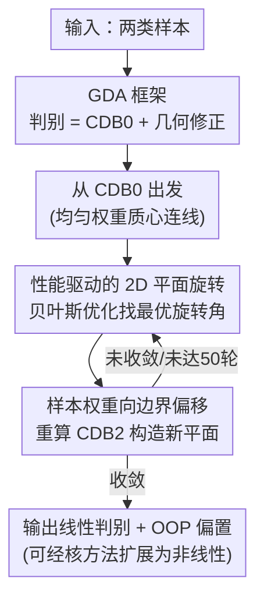

# A Generalized Geometric Theoretical Framework of Centroid Discriminant Analysis for Linear Classification of Multi-dimensional Data

**会议**: ICLR 2026  
**OpenReview**: [https://openreview.net/forum?id=bp9DOHb1mk](https://openreview.net/forum?id=bp9DOHb1mk)  
**代码**: 待确认  
**领域**: 学习理论 / 线性分类器 / 判别分析  
**关键词**: 几何判别分析、质心判别基、线性分类、贝叶斯优化、可扩展性

## 一句话总结
本文提出几何判别分析（GDA）这一统一理论框架，把一类线性分类器都看成"两类质心连线 CDB0 + 不同约束下的几何修正"，证明 MDC、LDA 都是它的特例；并据此设计出新分类器 CDA——从 CDB0 出发、用贝叶斯优化在一系列 2D 平面上做"性能驱动的旋转"，把训练复杂度从 LDA/SVM 的立方级降到平方级，在 27 个真实数据集上同时取得了比 LDA/SVM/LR 更好的性能、可扩展性与稳定性。

## 研究背景与动机
**领域现状**：在神经网络主导的今天，线性分类器在很多场景仍被偏爱——它们在高维数据上性能不输 CNN（例如从脑 MRI 预测阿尔茨海默病）、训练快、不易过拟合、且决策边界可解释。主流线性分类器各有原理：最小距离分类器（MDC）用两类质心的垂直平分面，训练复杂度最低 $O(NM)$；Fisher 线性判别（LDA）最大化类间/类内方差比，复杂度 $O(NM^2+M^3)$；线性 SVM 求最大间隔，原始版本 $O(N^3)$；逻辑回归（LR）基于统计似然。

**现有痛点**：性能强的 LDA、SVM 计算昂贵（立方级复杂度），在大规模数据上慢得不实用；而复杂度最低的 MDC 又因决策边界过于简陋而性能受限。各方法虽然形式各异，却缺少一个统一的视角去理解"它们到底在对什么做修正"。

**核心矛盾**：可扩展性（scalability）与预测性能之间存在长期的 trade-off——便宜的不准、准的不便宜。

**本文目标**：(1) 建立一个能把多种线性分类器统一起来的几何理论框架；(2) 在该框架下设计出一个同时兼顾性能与可扩展性的新分类器。

**切入角度**：作者注意到，任何二分类线性判别都可以分解为一个"基"加若干"修正"。这个最自然的基就是两类质心的连线方向——本文称之为质心判别基 CDB0。从这个基出发，不同分类器无非是在它上面叠加不同约束下的几何修正（可直观理解为对 CDB0 的旋转）。

**核心 idea**：用"CDB0 + 几何修正"统一描述线性分类器（GDA 框架），再用"性能驱动的 2D 平面旋转 + 贝叶斯优化"把这个修正过程做成一个高效、可解释、平方复杂度的具体算法（CDA）。

## 方法详解

### 整体框架
本文分两层：先是理论框架 GDA，再是其中的具体算法 CDA。

GDA 的核心论断是：对二分类问题，任何线性判别 $w$ 都能写成质心判别基 $w_{\text{CDB0}}$ 与若干几何修正项之和

$$w_{\text{GD}} = \gamma\,(w_{\text{CDB0}} + C_1 w_{\text{CDB0}} + C_2 w_{\text{CDB0}} + \cdots + C_n w_{\text{CDB0}})$$

其中 $w_{\text{CDB0}}=[\Delta\mu_x,\Delta\mu_y]^T$ 是从负类质心指向正类质心的单位向量（用均匀样本权重、即算术均值算出），$\gamma\neq 0$ 是与缩放无关的归一化常数（判别方向在 GDA 中是缩放不变的），$C_i$ 是各阶几何修正算子。不同分类器对应给 $C_i$ 施加不同约束：MDC 把所有修正项设为 0（判别就是 CDB0 本身）；LDA 只保留一阶基项和二阶协方差修正 $C_1$，更高阶项为 0。

CDA 则是在 GDA 框架内构造的一个具体算法：它从 CDB0 出发，迭代地在一系列 2D 平面上旋转判别方向，每次都朝"性能分数最高"的方向转，最终判别可写回 GDA 的标准形 $w^{(n)}_{\text{CDA}}=\gamma(w_{\text{CDB0}}+C_1 w_{\text{CDB0}})$，其中 $C_1=\prod_n A_{\text{cda}}-I$ 是 $n$ 次单步旋转算子 $A_{\text{cda}}$ 累积而成的修正算子。

### 关键设计

**1. GDA 理论框架：把线性分类器统一成"质心连线 + 几何修正"**

这一设计针对的痛点是：线性分类器形式五花八门，缺乏统一视角理解它们的内在联系。作者以 LDA 为切入做了一个干净的代数推导。LDA 最大化投影后的类间/类内方差比 $S=\sigma_b^2/\sigma_w^2=(w^T\nu_1-w^T\nu_0)^2/\big(w^T(\Sigma_0+\Sigma_1)w\big)$，其最优解满足 $N\Sigma\gamma w_{\text{LD}}=\nu_1-\nu_0$，即 $w_{\text{LD}}=\gamma\Sigma^{-1}(\mu_1-\mu_0)$。把 $2\times2$ 协方差 $\Sigma=\Sigma_0+\Sigma_1$ 的逆代入、并令 $c_{xy}=\sigma_{xy}^2/\sigma_{yy}^2$、$c_{xx/yy}=\sigma_{xx}^2/\sigma_{yy}^2-1$，方差比的解可压缩成

$$w_{\text{GD}}=w_{\text{LD}}=\gamma\Big(\begin{bmatrix}\Delta\mu_x\\\Delta\mu_y\end{bmatrix}+\begin{bmatrix}0 & -c_{xy}\\ -c_{xy} & c_{xx/yy}\end{bmatrix}\begin{bmatrix}\Delta\mu_x\\\Delta\mu_y\end{bmatrix}\Big)=\gamma(w_{\text{CDB0}}+C_{\text{correction}}\,w_{\text{CDB0}})$$

也就是说，LDA 的判别 = CDB0 + 一个由协方差决定的几何修正，这个修正可直观理解为对 CDB0 的旋转。沿着这个式子退化各种假设就能看到其它分类器：当两变量方差相等（$c_{xx/yy}=0$）、两类协方差相同时，$c_{xy}$ 退化为类内 $x,y$ 的 Pearson 相关系数 $r_{xy}$；进一步若 $r_{xy}=0$（或两类关于某变量对称使 $c_{xy}=0$），则 $w_{\text{LD}}=[\Delta\mu_x,\Delta\mu_y]^T=w_{\text{CDB0}}$，恰好就是 MDC（除偏置外）。这套推导的价值在于：它把"为什么 LDA 比 MDC 更准"具体化为"LDA 在 CDB0 上多施加了一个协方差相关的旋转修正"，并据此推广出可叠加任意多个、任意约束的修正项的广义框架（式 10）。GDA 本身只是框架、不提供全局收敛保证，具体保证需对每个实例化分类器单独证明。

**2. CDA：性能驱动的 2D 平面连续旋转**

GDA 给了"修正 = 旋转"的视角，但没说怎么找好的旋转。CDA 的做法是把判别方向从 CDB0 开始，沿着"有较高概率获得更好性能"的方向，在一连串 2D 平面上连续旋转。这里 CDB 被推广为带权质心之差的单位向量（权重可任意，CDB0 是均匀权重的特例），所有可能权重张成 CDB 的搜索空间。每次旋转都在由两个向量张成的 2D 平面内进行：第一个向量记为 CDB1（首轮等于 CDB0），第二个向量 CDB2 由偏移后的样本权重重算得到；平面内的最优旋转角用贝叶斯优化（BO）搜索，搜出的最优判别记为 CDA，并作为下一轮的 CDB1。关键在于每一步旋转都显式选取使性能分数最大的方向并持续细化，因此优化目标在每一步都是透明的——这赋予 CDA 内在的可解释性。训练在满足以下任一条件时停止：达到最多 50 轮迭代；或最近 10 次性能分数的变异系数（CV）低于阈值（视为收敛）。BO 单参数搜索为 $O(Z^3)$（$Z$ 为采样评估次数），CDA 让 BO 采样次数随迭代从 4 增长到最多 10；作者也指出对追求速度的大规模数据，Fibonacci 搜索是更快的替代（CDA-Fibonacci）。

**3. 性能分数与最优操作点（OOP）偏置搜索**

有了判别方向还需要偏置才能定下决策边界，而旋转又依赖"哪个方向更好"的评判标准，二者都落在同一个性能分数上。CDA 把样本投影到判别线后排序，取每相邻两个投影的中点作为候选边界，$N$ 个样本即 $N-1$ 个候选，其中最优者称为最优操作点（OOP）。评判用性能分数 $(\text{Fscore}_{\text{pos}}+\text{Fscore}_{\text{neg}}+\text{AC}_{\text{score}})/3$，同时兼顾敏感度、召回与特异度，并借更保守的 AC-score 对类别不平衡下的偏置模型给出更公允的评价。OOP 搜索可在 $O(N\log N)$ 时间完成，于是 CDB 空间里任一向量都能被赋一个性能分数，使"按性能旋转"成为可操作的目标。

**4. 样本权重偏移策略**

要构造下一个旋转平面（即第二个向量 CDB2），关键观察是：投影落在决策边界（OOP）附近的样本最容易与另一类重叠、最易被误分，应当获得更大权重。于是在每轮里先算各投影到 OOP 的距离 $d_i=|q_i-\text{oop}|$，再反转为 $d^r=|d-\min(d)-\max(d)|$ 让靠近边界的点权重更大；因只有相对权重重要，再做 L2 归一化并让权重相对上一轮平滑衰减：$\alpha=\alpha\odot d^r/\lVert\alpha\odot d^r\rVert_2$（$\odot$ 为逐元素积）。用这套偏移后的权重重算质心之差即得 CDB2，与当前 CDB1 张成新的 2D 旋转平面。直觉上，这让 CDA 持续把注意力放在难分的边界样本上，逐步把判别朝能改善这些样本分类的方向旋转——这正是它在大数据上既比 CDB0 准、又保持相近可扩展性的来源。

### 损失函数 / 训练策略
- **收尾（Finalization）**：在最优平面上，CDA 用 100 条随机 CDB 线做零模型统计检验来精修判别方向。
- **多分类**：采用纠错输出码（ECOC）配 one-versus-one 编码（更易线性可分），损失用 hinge-loss。
- **复杂度**：CDA 整体为平方时间复杂度，低于 LDA/SVM 的立方级；每数据集平均仅需约 29.33 次迭代（小常数，不计入复杂度量级）。
- **非线性扩展**：CDA 可经核方法自然扩展为非线性版（nCDA），主要计算瓶颈是核矩阵构造（所有核方法共有），核心 CDA 算法本身仍高效。

## 实验关键数据

### 主实验（27 个真实数据集）
对比对象为 LDA、5 种 SVM 变体（原始 SVM、Liblinear 的 dual/primal 快速 SVM、SVM-SGD、带 BO 调参的快速 SVM）、快速 LR，以及基线 CDB0（等价于带 OOP 偏置的 MDC）。数据涵盖标准图像（MNIST/CIFAR/SVHN 等）、医学图像与化学性质预测，按 4:1 划分训练/测试，最终模型为 5 折交叉验证模型的无权集成。

| 评测维度 | 指标 | CDA 表现 | 对照 |
|--------|------|------|------|
| 多分类 AUROC Top-2 出现次数 | 越多越稳 | **17 / 27** 数据集进入前二 | 优于所有其它线性分类器 |
| 多分类 AUROC 平均排名 | 越小越好 | **≈3.3（最佳）** | 其次为快速 SVM-BO、SVM |
| 大数据集训练速度排名 | 越小越好 | CDA 领先 | SVM 类在大数据上排名极低、不实用 |
| 可扩展性（训练时间 vs 数据量，log-log 斜率） | 越平越好 | 与 CDB0 相近 | 大数据上反超 SVM-primal/SGD |

在 130 万细胞的小鼠脑单细胞数据上（取最大两类），随训练样本增大，CDA-Fibonacci 在分类 AUROC 与训练速度上均超过快速 SVM，显示其比旗舰 SVM 更高效、更可扩展。

### 非线性核 CDA（3 个困难数据集）

| 数据集 | 方法 | AUROC | ACscore |
|--------|------|-------|---------|
| SVHN 子集（图像） | CDA | 0.615 | 0.423 |
|  | **nCDA** | **0.777** | **0.731** |
|  | nLDA | 0.786 | 0.743 |
| ClinTox（化学，二分类） | CDA | 0.567 | 0.351 |
|  | **nCDA** | **0.625** | **0.460** |
|  | nLDA | 0.605 | 0.409 |
| Fracture 3D（医学图像） | CDA | 0.518 | 0.279 |
|  | **nCDA** | **0.625** | **0.577** |

核 CDA 在 3 个数据集中 2 个取得最佳（与最佳的 nLDA 差距很小），且相比线性 CDA 提升显著，说明核化对复杂数据有效。

### 关键发现
- CDA 相比 CDB0 的性能提升来自三个组件协同：非均匀权重的广义质心、样本权重偏移策略、贝叶斯优化旋转；同时几乎不牺牲可扩展性。
- **收敛性**：对 50 轮内收敛的任务，停止迭代数与性能呈显著负相关（Pearson $R=-0.48$，越难越需更多轮），说明至少给 50 轮是必要的；超过 50 轮后相关性弱（$R=0.184$）。50 轮上限与 150 轮上限下的 ps-score 分布几乎一致（Wilcoxon 符号秩检验 $p=0.398$），证明放宽到 150 轮没有系统性收益。
- CDA 还能用来初始化神经网络的线性层/末端 MLP，优于随机初始化版本。

## 亮点与洞察
- **"CDB0 + 几何修正"的统一视角很优雅**：把 LDA 的方差比解一步步代数压缩成"质心连线 + 协方差旋转"，让 MDC/LDA 自然落成同一框架的退化特例，这种把"统计准则"翻译成"几何旋转"的视角本身就有启发性。
- **性能驱动旋转 + BO 是把框架变算法的关键一招**：GDA 只说"修正=旋转"，CDA 用每步显式最大化性能分数的 2D 平面旋转把抽象框架做成了可执行、可解释、平方复杂度的算法，每一步优化目标透明这点对"可解释线性分类器"很有价值。
- **"边界样本加权"思想可迁移**：把靠近决策边界的样本赋更大权重来构造下一旋转方向，和 boosting/SVM 关注难样本的直觉相通，可迁移到其它需要迭代精修边界的几何方法。

## 局限与展望
- **核 CDA 仍受核矩阵瓶颈限制**：作者承认核化版本继承了所有核方法共有的核矩阵构造开销，非线性版只做了"初步测试"（preliminary test），3 个数据集且 SVHN 还因时间限制只用了 24,000 子集。
- **理论保证是分类器级、非框架级**：GDA 框架本身不提供全局性能/收敛保证，需对每个实例化分类器单独证明（CDA 的收敛证明在附录），框架的"普适性"更多是描述性而非保证性。
- **依赖 1D 旋转优化器的选择**：主文用 BO（且需对数据做 log 变换以稳定），大规模时又改用 Fibonacci 搜索，不同优化器的性能/速度权衡较多，实际使用需按场景挑选。
- **核 CDA 未必最优**：在测试的 3 个困难数据集上 nCDA 并非全面最佳（SVHN 上略逊 nLDA），非线性扩展更多是"可行性验证"。

## 相关工作与启发
- **vs MDC**：MDC 用两质心垂直平分边界（CDB0 不加任何修正），复杂度最低但边界过简、性能受限；CDA 在 CDB0 基础上做性能驱动旋转，显著提升性能同时保持相近的可扩展性。
- **vs LDA**：LDA 是 GDA 框架中"只施加一个协方差方差比修正"的特例，复杂度立方级；CDA 用迭代旋转近似/超越其性能，但只需平方复杂度。
- **vs SVM**：SVM 求最大间隔、立方级复杂度（快速实现可近二次），在大数据上迭代数随难度激增而变慢；CDA 平均仅约 29 轮迭代收敛，大规模数据上性能与速度均反超快速 SVM。
- **vs PLSDA/LR**：作者另在附录与 PLSDA（化学计量/基因组常用的强线性方法）及快速 LR 做了对比，CDA 在性能、可扩展性、稳定性的综合表现更优。

## 评分
- 新颖性: ⭐⭐⭐⭐⭐ 用"质心连线 + 几何修正"统一线性分类器并据此设计新算法，视角新且自洽
- 实验充分度: ⭐⭐⭐⭐ 27 个真实数据集 + 百万级单细胞 + 多优化器/收敛性分析很扎实，但核 CDA 仅初步测试
- 写作质量: ⭐⭐⭐⭐ 理论推导清晰、图示丰富，但符号与附录引用密集、对读者门槛较高
- 价值: ⭐⭐⭐⭐ 在"可解释线性分类器"重新被重视的背景下，提供了兼顾性能与可扩展性的实用工具与理论视角

<!-- RELATED:START -->

## 相关论文

- [\[ICLR 2026\] Larger Datasets Can Be Repeated More: A Theoretical Analysis of Multi-Epoch Scaling in Linear Regression](larger_datasets_can_be_repeated_more_a_theoretical_analysis_of_multi-epoch_scali.md)
- [\[ICLR 2026\] High-dimensional Analysis of Synthetic Data Selection](high-dimensional_analysis_of_synthetic_data_selection.md)
- [\[ICLR 2026\] High-Dimensional Analysis of Single-Layer Attention for Sparse-Token Classification](high-dimensional_analysis_of_single-layer_attention_for_sparse-token_classificat.md)
- [\[ICLR 2026\] Robustness of Probabilistic Models to Low-Quality Data: A Multi-Perspective Analysis](robustness_of_probabilistic_models_to_low-quality_data_a_multi-perspective_analy.md)
- [\[ICLR 2026\] Learning under Quantization for High-Dimensional Linear Regression](learning_under_quantization_for_high-dimensional_linear_regression.md)

<!-- RELATED:END -->
