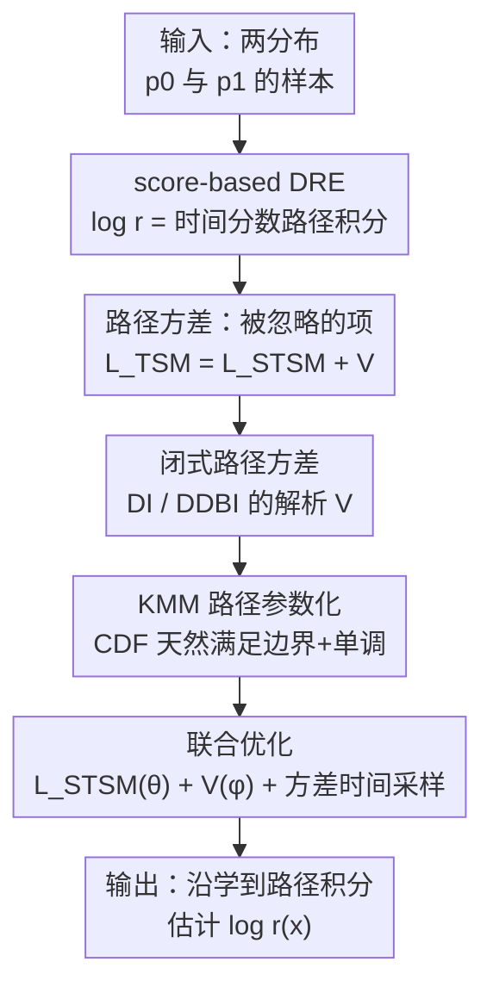

# A Minimum Variance Path Principle for Accurate and Stable Score-Based Density Ratio Estimation

**会议**: ICLR2026  
**OpenReview**: [https://openreview.net/forum?id=vf16PZJWD1](https://openreview.net/forum?id=vf16PZJWD1)  
**代码**: 待确认（论文称已开源 "code for MVP"）  
**领域**: 学习理论 / 概率方法 / 密度比估计  
**关键词**: 密度比估计, 评分匹配, 路径方差, 可学习插值路径, Kumaraswamy 混合模型

## 一句话总结
本文指出 score-based 密度比估计在理论上"路径无关"、实践中却"路径敏感"的悖论根源是一个被忽略的项——评分函数的**路径方差**，提出最小方差路径（MVP）原则把它显式写进目标，并用 Kumaraswamy 混合模型把路径参数化为可学习函数，在多个困难基准上做到更准更稳的密度比估计。

## 研究背景与动机
**领域现状**：密度比估计（DRE，估计 $r(x)=p_1(x)/p_0(x)$）是 $f$-散度估计、互信息估计、因果推断、域适应、LLM 对齐等任务的底层基石。当两个分布几乎不重叠（"density-chasm"，密度鸿沟问题）时，KLIEP、噪声对比等经典方法会失效。近年的突破是连续的 **score-based 方法**：把对数密度比写成沿一条从 $p_0$ 平滑插值到 $p_1$ 的路径上、时间评分函数的路径积分 $\log r(x)=\int_0^1 s^{(t)}(x,t)\,dt$。

**现有痛点**：理论上这类方法是**路径不变**的——沿任意光滑路径积分都能恢复精确目标。但实践中用神经网络逼近评分时，性能对路径选择**高度敏感**（论文 Fig.1a 的预备实验显示线性、Föllmer、三角、VP 等路径给出差异巨大的估计）。这就形成一个悖论：理论说"随便选路径都行"，实践却"换条路径结果就崩"。现有工作只能靠启发式地手挑路径，没有原则性的选路依据。

**核心矛盾**：作者把矛头指向"理想目标"与"可计算目标"之间一个被当成常数忽略的差。理想目标是真分数与模型分数的均方误差（时间评分匹配损失 $L_{\text{TSM}}$），但它不可计算；实践中用分部积分得到的可计算替代——切片时间评分匹配 $L_{\text{STSM}}$。两者相差一个路径相关项，过去因为路径固定就把它当常数扔掉了。作者证明：这个被扔掉的项恰恰是驱动不同路径性能差异的**主导因素**。

**本文目标**：(1) 形式化地辨认出这个缺失项到底是什么；(2) 给它推出可计算的闭式表达；(3) 把路径变成可学习对象，直接最小化这个项，消除手工选路。

**核心 idea**：缺失项 = 真分数的**路径方差** $V=\int_0^1 \mathrm{Var}_{p_t}(\partial_t \log p_t)\,dt$；用 KMM 把路径参数化，把"在函数空间里搜最优路径"这个不可解问题，转成"在 KMM 几个参数上做低维优化"，让路径自适应数据分布。

## 方法详解

### 整体框架
MVP（Minimum Variance Path）要解决的核心问题是：score-based DRE 训练时只优化了可计算损失 $L_{\text{STSM}}$，却漏掉了理想损失 $L_{\text{TSM}}$ 里的另一半——路径方差 $V$。MVP 的做法是把这一半补回来：先从误差上界出发证明理想目标 = 可计算损失 + 路径方差，再为两类常用插值（DI、DDBI）推出 $V$ 的闭式解，然后用 Kumaraswamy 混合模型把路径 $\alpha(t),\beta(t)$ 参数化成天然满足边界与单调性的可学习函数，最后把分数模型参数 $\theta$ 和路径参数 $\phi$ 用联合目标 $\mathcal{L}_{\text{total}}=\lambda_1 L_{\text{STSM}}(\theta)+\lambda_2 V[\alpha_\phi,\beta_\phi]$ 一起优化。推理阶段与普通 DRE 完全一致：沿学到的路径把时间分数积分一遍得到 $\log\hat r(x)$。

### 关键设计

**1. 路径方差：被评分匹配损失漏掉的那一半**

这针对的是"理论路径无关、实践路径敏感"的悖论根因。作者先给出估计误差 $\Delta(x)=|\log r(x)-\log\hat r(x)|^2$ 的上界（Lemma 4.1），在 $n=\infty,m=1$ 的特例下，该上界正比于积分平方误差，也就是理想的时间评分匹配损失 $L_{\text{TSM}}(\theta)=\mathbb{E}_{p(t)p_t(x)}|\epsilon(x,t)|^2$。但 $L_{\text{TSM}}$ 不可优化，实践用可计算的 $L_{\text{STSM}}$ 代替，两者之间存在一个**精确的代数恒等式**：

$$L_{\text{TSM}}(\theta)=L_{\text{STSM}}(\theta)+\int_0^1 \mathbb{E}_{p_t(x)}\,|\partial_t \log p_t(x)|^2\,dt.$$

Theorem 4.2 进一步证明：右边第二项里的二阶矩**恰好就是路径方差** $V\triangleq\int_0^1 \mathrm{Var}_{p_t(x)}(\partial_t \log p_t(x))\,dt$，于是估计误差被 $\mathbb{E}_{p_1}[\Delta(x)]\le e^L\big(L_{\text{STSM}}(\theta)+V\big)$ 界住。这一步是全文的"啊哈"：路径方差不是可有可无的正则项，而是理想目标里被固定路径假设当成常数丢掉的核心成分。只优化 $L_{\text{STSM}}$ 而不管 $V$，就解释了为什么换条路径结果会天差地别。⚠️ 作者诚实地强调，他们把最小化 $V$ 当作一个**有原则的启发式**（鼓励路径平滑、间接压低 Lipschitz 常数 $L$），而非严格保证误差下界更紧。

**2. 闭式路径方差：把不可解的泛函变成可算的积分**

直接最小化 $V$ 很难，因为它依赖未知的真时间分数 $\partial_t\log p_t$。本设计的贡献是为两类标准插值推出**只依赖路径系数和数据分布矩**的解析形式（Proposition 4.3）。对确定性插值（DI）$x_t=\alpha(t)x_0+\beta(t)x_1$、且 $p_0$ 取标准高斯时，

$$V_{\text{DI}}[\alpha,\beta]=\int_0^1\!\Big(\tfrac{2d\,\dot\alpha(t)^2}{\alpha(t)^2}+\tfrac{\dot\beta(t)^2}{\alpha(t)^2}\,\mathbb{E}_{p_1}\|x_1\|^2\Big)dt.$$

对去量化扩散桥插值（DDBI，引入噪声项放宽对 $p_0$ 的高斯假设、更适合互信息/$f$-散度估计），在噪声调度 $\sigma_t^2=t(1-t)\gamma^2+(\alpha^2+\beta^2)\varepsilon$ 下也给出对应的 $V_{\text{DDBI}}$ 闭式解。这些解析式只含 $\alpha,\beta$ 及其导数和数据二阶矩，可用蒙特卡洛直接估计，是整套方法能落地的关键技术贡献——它把"在路径函数空间里搜最优"这件事变成了"对一个可微目标做梯度下降"。

**3. KMM 路径参数化：让边界与单调性"长在结构里"**

有了可算的 $V$，还需要一个既灵活又自动满足约束的路径函数族。合法调度 $\alpha(t)$ 必须满足 $\alpha(0)=1,\alpha(1)=0$ 且单调递减。作者不用外部约束去硬卡，而是选一个**天生满足这些性质**的函数类：任何定义在 $[0,1]$ 上分布的 CDF $F(t)$ 都从 0 单调升到 1，于是 $\alpha(t)=1-F(t)$ 自动从 1 单调降到 0。为获得足够表达力（单个分布只能单峰），用 **Kumaraswamy 混合模型（KMM）**：

$$F_\phi(t)=\sum_{k=1}^K w_k\big(1-(1-t^{a_k})^{b_k}\big),\qquad \alpha_\phi(t)=1-F_\phi(t),\ \dot\alpha_\phi(t)=-p_\phi(t).$$

选 Kumaraswamy 而非更常见的 Beta，是因为它的 CDF 是简单闭式、导数计算高效稳定。这样构造出的 $\alpha_\phi$ 同时保证边界条件、单调性和无穷可微（光滑概率流），耦合的 $\beta_\phi$ 按仿射约束 $\alpha+\beta=1$ 或球面约束 $\alpha^2+\beta^2=1$ 推出。参数 $\phi=\{w_k,a_k,b_k\}$ 上的约束（权重和为 1、形状参数为正）通过 softmax/softplus 重参数化映射成无约束隐变量 $\hat\phi$，从而能直接做基于梯度的优化。结果是：原本无限维的泛函搜索被压成 KMM 的低维参数优化，稳定且可解。

**4. 联合优化与方差感知的时间采样：稳住整个训练**

路径参数 $\phi$ 与分数模型参数 $\theta$ 通过总目标 $\mathcal{L}_{\text{total}}=\lambda_1 L_{\text{STSM}}(\theta)+\lambda_2 V[\alpha_\phi,\beta_\phi]$ 联合优化。但有个隐患：$L_{\text{STSM}}$ 的经验估计依赖当前路径 $p_t$ 采到的样本 $x_t$，路径若引起分数不稳，估计就抖。作者用一个**交替方案**化解：每次按最小化 $V$ 更新完路径参数后，就刷新一个方差感知的时间采样器 $p(t)\propto 1/(\mathrm{Var}_{p_t}(\partial_t\log p_t)+\varepsilon)$，把采样偏向分数方差低的时间步，从而降低梯度噪声、提高 $L_{\text{STSM}}$ 随机估计的可靠性。这一步不直接对路径最小化 $L_{\text{STSM}}$，但通过控制它对 $p_t$ 的方差依赖来稳住其优化——也就是说，最小化 $V$ 既补上了理想目标的缺失项，又顺带稳住了模型损失的优化。

### 损失函数 / 训练策略
总目标为 $\mathcal{L}_{\text{total}}=\lambda_1 L_{\text{STSM}}(\theta)+\lambda_2 V[\alpha_\phi,\beta_\phi]$，$\theta$（分数模型）与 $\phi$（KMM 路径）联合训练；路径侧用 Algorithm 2：采一批时间步 → 重参数化得 KMM 参数 → 算 $\alpha,\beta$ 及导数 → 蒙特卡洛估 $V$ → 自动微分回传更新 $\hat\phi$。推理用 Algorithm 1：把时间分数沿 $I$ 个积分步平均，$\log\hat r(x)=\frac1I\sum_{i=0}^I s^{(t)}_{\theta^\star}(x,t_i)$。

## 实验关键数据

### 主实验
评测覆盖 $f$-散度/互信息估计与密度估计两大类，基线为一组固定路径调度（Linear / VP / Cosine / Föllmer / Trigonometric）。

| 任务 | 数据/设置 | 指标 | 最佳固定路径 | MVP (ours) |
|------|-----------|------|-------------|-----------|
| 互信息（高维高差异） | $d=160$, MI=40 | MSE↓ | 4.18 (Trigonometric) | **1.02** (affine) |
| $f$-散度（病态几何） | Gamma–Exp，corr=1.8 | MSE↓ | 0.0066 (Linear) | **0.0004** (spherical) |
| 密度估计（表格） | BSDS300 | NLL↓ | −131.90 (VP) | **−143.97** (spherical) |
| 密度估计（表格） | MINIBOONE | NLL↓ | 18.25 (VP) | **17.81** (spherical) |

在高维高差异的互信息任务上，Föllmer、Cosine 等固定路径随 $d$、MI 增大而崩溃（$d=160$ 时 MSE 飙到几十），MVP 仍保持 MSE=1.02；在 BSDS300 上 MVP 把 NLL 较强基线再压低 10 分以上。

### 消融实验

| 配置 | 关键指标 | 说明 |
|------|---------|------|
| KMM 分量 $K=1$ | MI MSE 1.32 / BSDS NLL −48.51 | 单峰太死板，明显最差 |
| $K=2$ | 1.09 / −145.44 | 大幅改善 |
| $K=5$（推荐） | **1.02** / −143.97 | 综合最佳权衡 |
| $K=8$ | 2.32 / −143.60 | 过拟合路径方差目标，反而变差 |

路径约束（仿射 vs 球面）被当作数据相关超参：低维/高差异但几何简单（POWER、GAS、高斯 MI）用仿射更好；高维/复杂/非高斯（HEPMASS、MINIBOONE、BSDS300、含间断的 Additive Noise）用球面更稳健。

### 关键发现
- 路径方差 $V$ 是性能差异的主导因素：固定路径忽略它，所以换路径就崩；显式最小化它即可消除路径敏感性。
- KMM 分量数有"甜区"，$K\in[2,5]$ 稳健，过多（$K=8$）反而过拟合方差目标。
- 学到的路径在边界 $t\in\{0,1\}$ 附近变化更平缓，抑制时间分数的瞬时速度尖峰，从而提升数值稳定性——这是 MVP 又"准"又"稳"的直观机制。

## 亮点与洞察
- **把"经验悖论"还原成一个精确恒等式**：$L_{\text{TSM}}=L_{\text{STSM}}+V$ 一步把"理论路径无关、实践路径敏感"这件含糊的事钉死成可证明、可计算的缺失项，理论叙事非常干净。
- **闭式路径方差是真正的落地点**：很多"应该最小化某个量"的理论卡在不可计算上，本文为 DI/DDBI 推出只含路径系数与数据矩的解析 $V$，让原则可被实际优化。
- **用 CDF 把约束"长进"函数族**：以 $1-F(t)$ 构造 $\alpha$，边界、单调、光滑天然满足，避免拉格朗日乘子或投影这类不稳定约束手段——这个"用分布 CDF 造调度函数"的技巧可迁移到扩散噪声调度、流匹配的时间重参数化等任何需要单调边界函数的场景。
- **可学习路径 ← 生成式建模的成熟思想迁移到 DRE**：生成式建模早已从固定 VP/cosine 调度走向可学习调度，本文是把这条"路径应自适应数据"的原则首次系统引入密度比估计。

## 局限与展望
- 作者自承最小化 $V$ 只是**启发式代理**，不严格等价于最小化真实估计误差，且 Lipschitz 常数 $L$ 的控制是经验性的而非保证性的。
- DI 的闭式 $V$ 依赖 $p_0$ 为标准高斯的假设；虽用 DDBI 放宽，但闭式解仍只覆盖这两类插值，换更一般的插值结构需重新推导。
- 路径约束（仿射/球面）需按任务当超参挑，目前靠经验规则（高差异简单几何用仿射、复杂高维用球面），尚无自动选择机制。
- 评测集中在中低维表格、互信息与合成几何数据集上，缺少图像等高维感知数据上的密度比/散度估计验证。

## 相关工作与启发
- **vs DRE-∞ (Choi et al., 2022)**：DRE-∞ 把 TRE 的离散比连续化、引入沿固定光滑路径的时间评分匹配，但把 $L_{\text{TSM}}$ 与 $L_{\text{STSM}}$ 之差当常数忽略；本文证明这个差就是路径方差并显式优化它。
- **vs DDBI (Chen et al., 2025c)**：DDBI 用去量化扩散桥放宽对 $p_0$ 的高斯假设、提升稳定性，但路径仍是固定手工的；MVP 直接学路径，并复用 DDBI 作为可学习路径的载体之一。
- **vs 条件概率路径 (Yu et al., 2025)**：他们用路径光滑性（Lipschitz）界住散度形式的估计误差以激发 LCTSM 损失；本文的 Lemma 4.1 给出的是对数比平方误差的直接上界，并用它来分解总误差、专门优化此前未被处理的路径方差项 $V$。
- **vs 可学习扩散调度 (Kingma et al., 2021; 神经扩散模型 Bartosh et al., 2024)**：生成式建模里学调度多为最大化变分下界；MVP 的优化目标是密度比误差上界中的路径方差，针对的是 DRE 而非生成。

## 评分
- 新颖性: ⭐⭐⭐⭐⭐ 把路径敏感悖论还原为可证明的缺失项（路径方差），并首次在 DRE 里学最优路径，理论与方法都新。
- 实验充分度: ⭐⭐⭐⭐ 覆盖互信息/$f$-散度/密度估计多类任务并做了 $K$ 与约束的消融，但缺高维感知数据验证。
- 写作质量: ⭐⭐⭐⭐⭐ 从悖论到恒等式到闭式解到参数化层层递进，并诚实区分"保证"与"启发式"。
- 价值: ⭐⭐⭐⭐ 为 score-based 估计提供了通用的选路原则，可迁移到散度估计、对齐、生成式调度等多个方向。

<!-- RELATED:START -->

## 相关论文

- [\[ICLR 2026\] Score-Based Density Estimation from Pairwise Comparisons](score-based_density_estimation_from_pairwise_comparisons.md)
- [\[ICLR 2026\] Minimax-Optimal Aggregation for Density Ratio Estimation](minimax-optimal_aggregation_for_density_ratio_estimation.md)
- [\[ICLR 2026\] Convergence Dynamics of Over-Parameterized Score Matching for a Single Gaussian](convergence_dynamics_of_over-parameterized_score_matching_for_a_single_gaussian.md)
- [\[ICLR 2026\] Variance-Dependent Regret Lower Bounds for Contextual Bandits](variance-dependent_regret_lower_bounds_for_contextual_bandits.md)
- [\[ICLR 2026\] Stable Coresets: Unleashing the Power of Uniform Sampling](stable_coresets_unleashing_the_power_of_uniform_sampling.md)

<!-- RELATED:END -->
