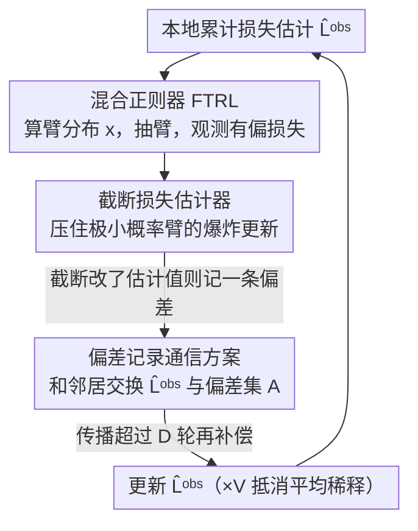

# A Near-Optimal Best-of-Both-Worlds Algorithm for Federated Bandits

**会议**: ICLR2026  
**OpenReview**: [https://openreview.net/forum?id=Lkndkxeemx](https://openreview.net/forum?id=Lkndkxeemx)  
**代码**: 待确认（补充材料含源码）  
**领域**: 在线学习理论 / 多臂赌博机  
**关键词**: 联邦赌博机, Best-of-Both-Worlds, FTRL, 延迟反馈, 遗憾界

## 一句话总结
本文提出 FEDFTRL——首个在联邦多臂赌博机里同时对随机环境和对抗环境都拿到近最优个体遗憾界的算法，核心做法是把"去中心化通信带来的信息延迟"重新解释成"延迟反馈赌博机"，再用混合正则器的 FTRL 配上截断损失估计器与偏差记录通信方案，把对抗环境下的遗憾从此前最好的 $O(T^{2/3})$ 压到 $O(T^{1/2})$。

## 研究背景与动机
**领域现状**：多臂赌博机（MAB）是在线学习里最基础的设定。受联邦学习"多个异构 agent 不共享原始数据、协作训练一个模型"范式的启发，近年大量工作把 MAB 搬到联邦环境：有 $V$ 个 agent，每轮各自从 $K$ 个臂里选一个，每个 agent 只能观测到带本地偏置（heterogeneity-induced）的奖励，并且只能和图 $G$ 上的邻居通信，目标是协作识别出"全局最优臂"$k^\ast$（按全体 agent 平均损失定义）并最大化群体累计奖励。注意这里的异构性很强：同一时刻、同一个臂，不同 agent 拿到的奖励可以不一样，任何单个 agent 仅凭本地有偏观测都没法直接认出全局最优臂。

**现有痛点**：以往联邦赌博机的研究严格沿用"随机 vs 对抗"的传统二分法，各做各的。随机侧（Zhu et al. 2021 的 Gossip UCB、Zhang et al. 2025 的 DRBB-bandit 等）能做到接近最优的 $O\!\big(\sum_{k\neq k^\ast}\frac{\log T}{V\Delta_k}\big)$；对抗侧只有 Yi & Vojnovic (2023) 的 FEDEXP3，它把 doubly-adversarial 联邦赌博机形式化，但遗憾界只到 $O(T^{2/3})$，离单机对抗赌博机标准的 $O(T^{1/2})$ 差了一截。

**核心矛盾**：现实环境很少是纯随机或纯对抗的，而且具体属于哪一种事先往往未知。你不可能先验地知道该挑随机算法还是对抗算法。这正是单机赌博机里 Best-of-Both-Worlds（BOBW）路线要解决的问题——一套算法、不调参，在两种环境里都近最优。但联邦设定下还没有人做到 BOBW，难点在于联邦特有的两个东西：(i) 只能和邻居通信，远处 agent 的信息要好几轮才传到，本质是一种**反馈延迟**；(ii) 本地观测**有偏**，单机 BOBW 的损失估计器直接搬过来会让各 agent 的动作分布发散。

**本文目标**：在联邦异构赌博机里设计一个 anytime（无需预知 $T$）的算法，同时拿到随机与对抗两个 regime 的近最优个体遗憾界，并把对抗界从 $O(T^{2/3})$ 改进到 $O(T^{1/2})$。

**切入角度 / 核心 idea**：把去中心化通信的延迟当成"延迟反馈赌博机"来处理——这样就能复用延迟反馈 FTRL 那套混合正则器与学习率调度的成熟分析（Zimmert & Seldin 2020；Masoudian et al. 2022）；再额外设计一个**截断损失估计器**压住异构偏置带来的分布发散，配一个**偏差记录通信方案**把截断引入的偏差事后补回来。一句话：用"延迟反馈视角 + 截断估计器 + 偏差补偿通信"把联邦异构性收拾成一个能上 BOBW-FTRL 的标准问题。

## 方法详解

### 整体框架
FEDFTRL 是一个**每个 agent 本地运行的去中心化例程**（Algorithm 1）：输入是 doubly-stochastic 通信矩阵 $P$ 和图直径 $D$，每一轮 agent $v$ 做"算分布 → 抽臂 → 观测损失 → 构造两种损失估计器 → 和邻居交换消息 → 更新累计损失估计 → 处理延迟补偿"这一串动作。整套设计围绕一个统一观点展开：**把"邻居才能通信导致的信息延迟"看作延迟反馈赌博机**，于是就能套用延迟反馈 FTRL 的混合正则器。

具体地，每个 agent 用如下 FTRL 子问题在单纯形 $\Delta^{K-1}$ 上算当前的臂分布：

$$x_{v,t} = \arg\min_{x\in\Delta^{K-1}}\big\{\langle x, \hat L^{\mathrm{obs}}_{v,t}\rangle + F_t(x)\big\},$$

其中正则器是 $1/2$-Tsallis 熵（$-2\eta_t^{-1}\sum_k\sqrt{x_k}$）和负熵（$\gamma_t^{-1}\sum_k x_k(\log x_k-1)$）的**混合正则器**：

$$F_t(x) = -2\eta_t^{-1}\sum_{k=1}^K\sqrt{x_k} + \gamma_t^{-1}\sum_{k=1}^K x_k(\log x_k - 1).$$

两路学习率分别走"随机最优"和"对抗/延迟最优"的角色——$\eta_t^{-1}=4\sqrt{Vt}+169V^2D$ 负责 Tsallis 项（给出随机 regime 的 $\log T$ 自适应），$\gamma_t^{-1}=8V\sqrt{C^P_t\, t/\log K}+\dots$ 负责负熵项并把通信拓扑带来的延迟量 $C^P_t$ 吃进调度里，这是 BOBW 的关键。这里 $C^P_t$ 是本文定义的**拓扑延迟量**：

$$C^P_t = \frac{\min\{\log(Vt),\sqrt{V}\}}{1-\sigma_2(P)} + 2 + D,$$

$\sigma_2(P)$ 是通信矩阵的第二大奇异值（混合速度），$D$ 是图直径，整体刻画"信息在网络里扩散一遍要多久"。

下面这张图给出每一轮的本地流程；其中标了"设计 N"的三个环节就是后面关键设计要展开的贡献点：

### 关键设计

**1. 延迟反馈视角下的混合正则器 FTRL：把"邻居通信延迟"变成可分析的延迟反馈**

联邦设定最难处理的就是去中心化通信：agent $v$ 此刻拿到的累计损失估计 $\hat L^{\mathrm{obs}}_{v,t}$ 里，远处 agent 的信息要经过多轮 gossip 平均才传到，等价于这些反馈是"延迟到达"的。本文不把延迟当成需要单独修补的麻烦，而是直接复用延迟反馈赌博机的混合正则器框架：Tsallis 项负责在随机 regime 自动逼近 $\log T$ 量级的实例相关界，负熵项负责吸收延迟与对抗，两路学习率 $\eta_t,\gamma_t$ 各自调度。关键巧思是把拓扑延迟量 $C^P_t$（见上式）显式写进 $\gamma_t^{-1}=8V\sqrt{C^P_t t/\log K}+36D^2(K-1)^{2/3}+4(C^P_t)^2$，让正则强度随"网络混合得多慢"自适应——网络连得越密（$\sigma_2(P)$ 越小、$D$ 越小）延迟越小、正则越弱。正因为延迟被显式建模进学习率，对抗 regime 才能从 FEDEXP3 的 $O(T^{2/3})$ 收紧到 $O(T^{1/2})$。

**2. 截断损失估计器：用一个分母下界阻止极小概率臂引爆更新、把各 agent 分布钉在一起**

本地观测有偏会让标准的逆概率加权（IPW）无偏估计器 $\hat\ell_{v,t}(k)=\frac{\ell_{v,t}(k_{v,t})\mathbb I(k=k_{v,t})}{x_{v,t}(k)}$ 在 $x_{v,t}(k)$ 极小时爆炸，进而把各 agent 的动作分布越推越远。本文构造一个**截断变体**，给分母加一个下界：

$$\tilde\ell_{v,t}(k) = \frac{\ell_{v,t}(k_{v,t})\,\mathbb I(k=k_{v,t})}{\max\{x_{v,t}(k),\, 12V C^P_t \gamma_t\}}.$$

更新累计损失估计时用 $\tilde\ell$ 而非 $\hat\ell$，于是任何一次稀有的抽臂都不会触发过大的更新，各 agent 的概率分布因此保持近似对齐。这个对齐性是整套分析的基石——它直接支撑了后面"任意两 agent 的臂概率最多差 $3/2$ 倍"的 Lemma 1，从而能把群体遗憾翻译成个体遗憾。代价是截断会让本地损失估计相对群体平均损失产生系统偏差，这个偏差交给设计 3 补偿。

**3. 偏差记录通信方案 + ×V 抵消：在不泄露原始观测的前提下把截断偏差事后补回来**

联邦约束下不能共享原始观测，但截断引入的偏差必须修正，否则估计会偏离群体平均损失。做法是：每当截断真的改变了估计值（$\hat\ell_{v,t}(k_{v,t})\neq\tilde\ell_{v,t}(k_{v,t})$），agent 就把一条偏差记录 $\langle v,t,k_{v,t},w_{v,t}\rangle$（$w_{v,t}=\hat\ell-\tilde\ell$）加进偏差集 $A_v$，随消息一起在网络里传播。等某条记录传播超过图直径 $D$ 轮（$t-s>D$，意味着所有 agent 都已收到）后，再把修正量 $w_{u,s}$ 补进 $\hat L^{\mathrm{obs}}_{v,t+1}(k)$——这样补偏才不会重新造成 agent 间的分布错位。此外累计损失更新 $\hat L^{\mathrm{obs}}_{v,t+1}=\sum_{u:(u,v)\in E}P_{u,v}\hat L^{\mathrm{obs}}_{u,t}+V\tilde\ell_{v,t}$ 里那个 $\times V$ 因子，是用来抵消 gossip 平均对反馈的稀释，保证信息量不被一致性平均"摊薄"。这套方案每轮每 agent 的期望通信开销只有 $O(K)$。

### 损失函数 / 训练策略
本文是理论算法，没有训练损失，核心是遗憾界（Theorem 1）。对抗 regime 下每个 agent $v$ 的个体遗憾满足

$$R_T(v)\le 13\sqrt{KT/V} + 13\sqrt{C^P_T T\log K} + 156\sqrt{D} + 72D(K-1)^{1/3}\log K + 24C^P_T\log K,$$

主项即 $O\!\big(\sqrt{KT/V}+\sqrt{C^P_T T\log K}\big)=O(T^{1/2})$。随机 regime 下则是实例相关的对数界

$$R_T(v)\le \sum_{k\neq k^\ast}\frac{51\log T}{V\Delta_k} + \sum_{k\neq k^\ast}\frac{90C^P_T}{\Delta_k\log K} + 56D\sqrt{(K-1)\log K} + 11C^P_T\log K.$$

两个界都与对应的下界只差低阶多项式因子（Remark 1 用 max-degree trick 构造 $P$ 时给出 $C^P_T$ 的下界匹配）。证明的核心技巧（Section 5）是个体遗憾分析的新做法：先用 Lemma 1 证明任意两 agent 的臂分布满足 $x_{u,t}(k)\le\frac32 x_{v,t}(k)$（双向），从而 $R_T(v)\le\frac{3}{2V}\sum_u R_T(u)$，把个体遗憾约化到群体遗憾；再把联邦问题"摊平"成单 agent 在 $VT$ 轮里的交互（引入位移累计损失 $\hat L_{v,t}=\sum_{s<t}Vm_s+(v-1)m_t$，让瞬时估计 $m_t$ 像被一个 agent 顺序产生），把群体遗憾拆成三项 (A) Bregman 散度项 / (B) 延迟反馈项（套 Zimmert & Seldin 2020）/ (C) 望远镜项，分别界住后除以 $V$ 得到个体界。这个"群体先于个体"的路线是相对以往直接分析单 agent 遗憾的关键技术贡献。

## 实验关键数据

实验在合成与真实数据集（MovieLens）、三种网络拓扑（全连接图、$\sqrt V\times\sqrt V$ 网格图、随机几何图 RGG-0.5）下，对比 FEDEXP3、Gossip UCB、DRBB-bandit、IND-FTRL（各 agent 独立跑 Tsallis-FTRL、不通信）。所有结果 50 次重复取平均，实跑学习率取 $\eta_t^{-1}=0.1\sqrt{Vt}$、$\gamma_t^{-1}=8V\sqrt{C^P_t t/\log K}$。

### 主实验

| 数据集 | 设置 | 对比对象 | 结果 |
|--------|------|---------|------|
| 合成（$T{=}3000,V{=}16,K{=}20$，$\mu_{v,k}\!\sim\!U[0,1]$，反馈 $\mathcal N(\mu,0.01)$ 截到 $[0,1]$） | 三种拓扑 | FEDEXP3 / Gossip UCB / DRBB-bandit / IND-FTRL | FEDFTRL 平均遗憾全面最低（Figure 1）；IND-FTRL 只看本地有偏反馈无法做到 sublinear 遗憾 |
| MovieLens（$T{=}3000,V{=}3963,K{=}20$，每个 genre 当一个臂，损失 $\ell_{v,t}(k){=}(5.5-r^j_v(k))/5$） | 三种拓扑 | 同上 | FEDFTRL 显著优于所有 baseline（Figure 2） |

### 消融实验

| 配置 | 变化 | 说明 |
|------|------|------|
| FEDFTRL（$\varepsilon{=}1.0$） | $C^P_t$ 默认 | 完整方法 |
| FEDFTRL-$\varepsilon$（$\varepsilon\in\{0.1,0.5,5,10\}$） | 把 $C^P_t$ 乘 $\varepsilon$ | 即使 $C^P_t$ 被错估，方法依旧 sublinear，遗憾几乎不受影响（Figure 3/4） |

### 关键发现
- **通信是 sublinear 的前提**：IND-FTRL（不通信）在异构本地反馈下根本拿不到 sublinear 遗憾，凸显本文通信方案的必要性。
- **对拓扑参数 $C^P_t$ 鲁棒**：在 $0.1\sim10$ 倍区间内错误指定 $C^P_t$，FEDFTRL 仍保持 sublinear 遗憾，说明拓扑延迟量不需要精确估计也能用。
- **跨拓扑稳定**：全连接 / 网格 / RGG 三种连通性差异很大的图上结论一致，验证了 $C^P_t$ 把拓扑影响吸收进学习率的设计。

## 亮点与洞察
- **把通信延迟"翻译"成延迟反馈**：最漂亮的一步是观点转换——去中心化通信的固有延迟被重新表述成延迟反馈赌博机，从而能直接嫁接延迟反馈 FTRL 的成熟工具链，对抗界一步从 $T^{2/3}$ 收到 $T^{1/2}$。这个"换个视角就接上已有理论"的思路可迁移到其他带通信延迟的多 agent 在线学习问题。
- **截断 + 事后补偿的解耦设计**：截断负责"保对齐"（让各 agent 分布钉在一起，便于群体↔个体翻译），延迟 $D$ 轮的偏差记录负责"补无偏"，两件事拆开做、各自简单又互不破坏，是处理"异构偏置 + 隐私约束"的巧妙组合拳。
- **群体遗憾先行的分析范式**：先界群体遗憾再借分布对齐除以 $V$ 翻译到个体，比逐 agent 直接分析更干净，给同类多 agent 赌博机的遗憾分析提供了可复用模板。
- **$\times V$ 反稀释**：用一个简单常数因子抵消 gossip 一致性平均对信息量的稀释，是个容易被忽视却关键的工程化细节。

## 局限与展望
- **对抗界仍有 polylog 间隙**：作者自承上界与下界之间在对抗 regime 还差低阶多项式因子，缩小这个 gap 是明确的 future work。
- **唯一最优臂假设**：为简化呈现假设存在唯一 $k^\ast$，多最优臂需借 Ito (2021b) 的技巧推广，本文未展开。
- **依赖已知的 $P$ 与 $D$**：算法把 doubly-stochastic 矩阵 $P$ 和图直径 $D$ 当输入，现实中拓扑动态变化、$D$ 难精确获取时如何适配未讨论（虽然实验显示对 $C^P_t$ 误估鲁棒，但 $D$ 进入了通信补偿的判定条件 $t-s>D$）。
- **通信开销随 $K$ 线性**：每轮 $O(K)$ 通信在臂数巨大（如大规模推荐）时可能成为瓶颈，可探索稀疏化偏差记录。

## 相关工作与启发
- **vs FEDEXP3 (Yi & Vojnovic, 2023)**：FEDEXP3 首次形式化 doubly-adversarial 联邦赌博机，但只针对对抗、且遗憾 $O(T^{2/3})$；本文用混合正则器 FTRL + 延迟反馈视角把对抗界收到 $O(T^{1/2})$，且**同时**覆盖随机 regime，是首个联邦 BOBW。
- **vs Gossip UCB / DRBB-bandit（随机侧）**：它们在随机 regime 拿到近最优/最优对数界，但完全不处理对抗环境；FEDFTRL 在随机 regime 匹配同量级 $O\!\big(\sum_{k\neq k^\ast}\frac{\log T}{V\Delta_k}\big)$ 的同时还保住对抗保证，做到"不调参两头通吃"。
- **vs 单机 BOBW（Zimmert & Seldin 2021 等 Tsallis-INF / FTRL 路线）**：本文把单机 BOBW-FTRL 扩展到"异构反馈 + 去中心化通信"双重困难，核心增量是截断估计器、偏差补偿通信与群体先行的个体遗憾分析。
- **vs 延迟反馈赌博机（Zimmert & Seldin 2020；Masoudian et al. 2022）**：本文借用其混合正则器与学习率调度思想，创新在于把"网络通信延迟"建模为延迟来源并定义拓扑延迟量 $C^P_t$ 接入调度。

## 评分
- 新颖性: ⭐⭐⭐⭐⭐ 首个联邦 BOBW 算法，延迟反馈视角 + 群体先行分析都是有分量的新思路
- 实验充分度: ⭐⭐⭐⭐ 合成 + 真实数据 + 三拓扑 + 对 $C^P_t$ 的敏感性消融，作为理论论文足够；但只报平均遗憾曲线、无方差/置信区间
- 写作质量: ⭐⭐⭐⭐⭐ 动机、算法、证明 sketch 层次清晰，遗憾界与下界对照表一目了然
- 价值: ⭐⭐⭐⭐ 给联邦/去中心化在线学习的理论打开 BOBW 这条线，方法组件可迁移；实际系统落地受已知拓扑假设制约

<!-- RELATED:START -->

## 相关论文

- [\[ICLR 2026\] Near Optimal Robust Federated Learning Against Data Poisoning Attack](near_optimal_robust_federated_learning_against_data_poisoning_attack.md)
- [\[ICML 2025\] Near Optimal Best Arm Identification for Clustered Bandits](../../ICML2025/learning_theory/near_optimal_best_arm_identification_for_clustered_bandits.md)
- [\[ICLR 2026\] Ads that Stick: Near-Optimal Ad Optimization through Psychological Behavior Models](ads_that_stick_near-optimal_ad_optimization_through_psychological_behavior_model.md)
- [\[ICLR 2026\] Best-of-N through the Smoothing Lens: KL Divergence and Regret Analysis](best-of-n_through_the_smoothing_lens_kl_divergence_and_regret_analysis.md)
- [\[ICLR 2026\] Best-of-Majority: Minimax-Optimal Strategy for Pass@k Inference Scaling](best-of-majority_minimax-optimal_strategy_for_passk_inference_scaling.md)

<!-- RELATED:END -->
