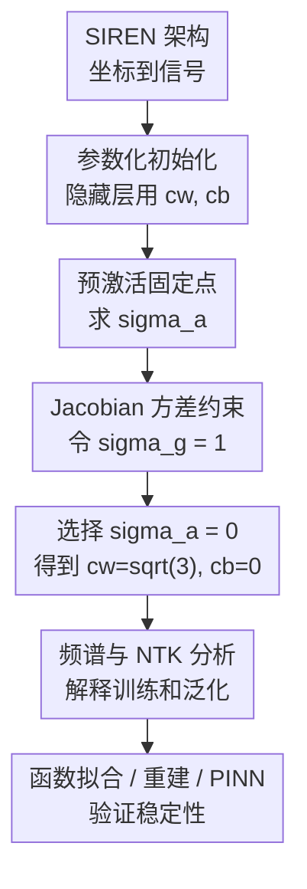

# A New Initialization to Control Gradients in Sinusoidal Neural Networks

**会议**: ICLR 2026  
**OpenReview**: [https://openreview.net/forum?id=92d74WdgtG](https://openreview.net/forum?id=92d74WdgtG)  
**代码**: 有（补充材料提供实验代码）  
**领域**: 学习理论  
**关键词**: SIREN, 隐式神经表示, 初始化, 梯度稳定性, 神经切线核  

## 一句话总结

这篇论文为正弦激活网络 SIREN 推导了一组闭式初始化参数，通过同时控制预激活分布、层间 Jacobian 方差和频谱扩张，让深层 sinusoidal neural networks 在函数拟合、图像/音频/视频重建和 PINN 任务中减少梯度爆炸与伪高频噪声。

## 研究背景与动机

**领域现状**：隐式神经表示（implicit neural representation, INR）通常用神经网络把坐标 $x$ 映射到信号值 $f(x)$，例如图像像素、音频波形、三维场或 PDE 解。普通 MLP 在这类任务上容易先学低频、后学高频，也就是常说的 spectral bias；因此 Fourier features、positional encoding 和 SIREN 这类正弦激活网络被广泛用于提升高频表示能力。

**现有痛点**：SIREN 的优势来自 $\sin(\cdot)$ 激活和首层频率参数 $\omega_0$，但它对初始化非常敏感。原始 SIREN 初始化主要让每层预激活大致保持在一个合适范围内，却没有精确约束反向传播时的 Jacobian 方差。网络一旦变深，梯度可能随深度指数增长，表现为训练很快但插值时出现目标信号中没有的高频纹理；也可能梯度衰减，导致训练慢、频谱塌缩。

**核心矛盾**：INR 需要足够高的频率表达能力，但不能让深层正弦复合把能量无约束地扩散到超过采样 Nyquist 频率的模式。换句话说，初始化既要保证参数梯度和输入梯度不过早消失，也要避免把网络一开始就放到会制造 aliasing 的高频爆炸区间。

**本文目标**：作者把问题拆成三个互相关联的子问题：第一，SIREN 在宽度和深度趋大时，每层预激活 $z_\ell$ 会收敛到什么分布；第二，层间 Jacobian $J_\ell=\partial h_\ell/\partial h_{\ell-1}$ 的方差如何随初始化参数变化；第三，这些统计量如何通过 Fourier spectrum 和 NTK 影响训练速度与泛化。

**切入角度**：论文从 edge of chaos 的视角出发，不再只经验调 $\omega_0$ 或沿用近似的 SIREN 初始化，而是直接解正弦激活下的固定点方程。正弦函数的特殊性在于 $\mathbb{E}[\sin^2 z]$ 和 $\mathbb{E}[\cos^2 z]$ 在高斯输入下有解析形式，这让作者能得到比一般激活函数更明确的初始化曲线。

**核心 idea**：用固定点分析推导满足 $\sigma_g=1$ 的权重-偏置初始化曲线，并选择 $\sigma_a=0$ 的特殊点 $(c_w,c_b)=(\sqrt{3},0)$，让深层 SIREN 同时保持梯度稳定和深度无关的初始频谱截断。

## 方法详解

### 整体框架

这篇论文的方法不是一个新增网络模块，而是一套针对 SIREN 的初始化理论和实践规则。给定标准 SIREN 架构，作者改写隐藏层权重和偏置的采样尺度，用两个参数 $c_w,c_b$ 控制隐藏层分布，然后从预激活固定点、Jacobian 方差和 NTK 训练动力学三个角度说明为什么最终应选 $c_w=\sqrt{3},c_b=0$。

从流程上看，论文先定义一族候选初始化，再在无限宽、无限深的平均场极限下推导预激活方差 $\sigma_a^2$ 的固定点；接着计算层间 Jacobian 条目的归一化方差 $\sigma_g$，把 $\sigma_g=1$ 作为梯度不爆不消的约束；最后用 Fourier spectrum 和 NTK 解释为什么在这条临界曲线上，$\sigma_a=0$ 比 $\sigma_a=1$ 更适合作为默认选择。

### 关键设计

**1. 用预激活固定点替代近似方差守恒**

原始 SIREN 初始化希望每层预激活近似服从 $\mathcal{N}(0,1)$，但这个说法依赖近似计算，尤其没有精确处理偏置项对深层固定点的影响。本文把隐藏层初始化写成 $W_\ell\sim U(-c_w/\sqrt{N},c_w/\sqrt{N})$、$b_\ell\sim\mathcal{N}(0,c_b^2)$，然后直接研究 $z_\ell=W_\ell h_{\ell-1}+b_\ell$ 的极限分布。

由于正弦是奇函数，零均值可以逐层保持；在大宽度下，中心极限定理又让每个预激活分量趋向高斯。关键是当 $z\sim\mathcal{N}(0,\sigma^2)$ 时，$\mathrm{Var}[\sin(z)]=\frac{1}{2}(1-e^{-2\sigma^2})$，于是预激活方差满足递推

$$
\sigma_\ell^2=\frac{c_w^2}{6}(1-e^{-2\sigma_{\ell-1}^2})+c_b^2.
$$

这个递推可以用 Lambert W 函数写出固定点 $\sigma_a^2$。相比“让方差大概等于 1”的经验规则，这个固定点分析把 $(c_w,c_b)$ 对深层预激活分布的影响显式化，也为后续控制梯度留下了可解的约束。

**2. 用 $\sigma_g=1$ 直接约束层间梯度传播**

只稳定前向激活还不够，因为训练真正依赖的是参数梯度和输入梯度如何穿过多层正弦复合。论文计算层间 Jacobian $J_\ell=\mathrm{diag}(\cos z_\ell)W_\ell$ 的条目方差，并得到归一化极限

$$
\sigma_g^2=\frac{c_w^2}{6}(1+e^{-2\sigma_a^2}).
$$

随后作者说明，参数梯度方差近似按 $N^{-1}(\sigma_g^2)^{L-\ell-1}$ 缩放，输入梯度方差近似按 $\omega_0^2(\sigma_g^2)^{L-2}$ 缩放。因此只要 $\sigma_g>1$，深度增加会带来梯度爆炸和输入空间高频噪声；只要 $\sigma_g<1$，梯度会衰减，训练和高频学习都会变慢。把 $\sigma_g=1$ 作为硬约束后，作者得到一条权重-偏置曲线

$$
c_b=\sqrt{1-\frac{c_w^2}{3}-\frac{1}{2}\log\left(\frac{6}{c_w^2}-1\right)}.
$$

这一步是论文的核心：初始化不再是单独调权重尺度或沿用默认 bias，而是用 Jacobian 方差把“临界边界”写成可执行的闭式条件。

**3. 选择 $\sigma_a=0$ 来抑制深度带来的频谱扩张**

在 $\sigma_g=1$ 曲线上，论文讨论了两个代表点：一个是接近原始 SIREN 直觉的 $\sigma_a=1$，另一个是本文最终推荐的 $\sigma_a=0$。后者给出非常简单的初始化 $(c_w,c_b)=(\sqrt{3},0)$。表面上看，让深层预激活方差趋向 0 似乎会降低非线性；但作者的解释是，这让深层的 $\sin(z)$ 更接近线性，能阻止每一层正弦复合继续把能量扩散到更高 Fourier 模式。

这种选择解决的是 SIREN 深层泛化中的关键病灶：原始 Sitzmann 初始化和 $\sigma_a=1$ 虽然能快速拟合训练点，但频谱会随深度明显变宽，超过 $\omega_0$ 的能量容易在离散采样上产生 aliasing；PyTorch 默认初始化则走向相反方向，频谱随深度坍缩。$\sigma_a=0$ 的慢收敛固定点恰好形成一种温和约束：早期层仍有足够表达力，深层又不会无节制制造伪高频。

**4. 用 NTK 把初始化、频率学习和训练速度连起来**

论文没有只停留在“初始化后频谱更干净”的静态观察，而是进一步用神经切线核（NTK）解释训练动力学。在线性化训练近似下，残差沿 NTK 特征向量衰减，衰减速度由对应特征值 $\lambda_i$ 决定；低频模式通常对应较大的特征值，高频模式对应较小的特征值，这就是 spectral bias 的 NTK 解释。

作者发现，原始 SIREN 初始化会让 NTK trace 和输入梯度随深度指数增长，训练速度看起来更快，但低阶 NTK 特征向量会混入越来越高的频率，导致泛化图像出现噪声。PyTorch 初始化则让输入梯度消失，NTK 频率排序也失去意义。相比之下，$\sigma_a=0$ 初始化让 NTK 频率排序在 $\omega_0$ 以下保持更清楚的 Fourier 对齐，使 $\omega_0$ 可以更自然地被选为采样输入的 Nyquist 频率附近，从而把“能学哪些频率”和“不会凭空学出哪些频率”联系起来。

### 损失函数 / 训练策略

论文的训练目标本身仍是 INR 常用的监督拟合损失，例如对坐标-信号数据 $(x_i,y_i)$ 最小化

$$
\mathcal{L}(\theta)=\frac{1}{|I|}\sum_{i\in I}\|\Psi_\theta(x_i)-y_i\|_2^2.
$$

在 PINN 实验中，目标换成 PDE 残差、边界条件和初始条件的加权组合，例如 $\lambda_f\|\mathcal{N}[\Psi_\theta]-f\|^2+\lambda_b\|\mathcal{B}[\Psi_\theta]-g\|^2$。本文重点不在新 loss，而在所有这些任务开始训练前如何初始化 SIREN：首层仍用 $\omega_0$ 控制输入频率范围，隐藏层使用 $U(-\sqrt{3}/\sqrt{N},\sqrt{3}/\sqrt{N})$，偏置设为 0，并把 $\omega_0$ 尽量和输入采样的 Nyquist 频率对齐。

实验中多数函数拟合和重建任务使用 Adam，学习率常见为 $10^{-4}$ 或 $3\times10^{-5}$，训练 5,000 到 10,000 epoch；视频 ERA-5 任务使用 Reduce-on-Plateau、AMP 和时间切片 batch；PINN 实验也保持相同深度、宽度和优化器设置来比较初始化差异。换言之，性能提升主要来自初始化改变，而不是额外训练技巧。

## 实验关键数据

### 主实验

论文实验覆盖合成函数拟合、图像拟合、音频拟合、ERA-5 风场视频重建、图像去噪和 PINN。主文中 Figure 1 汇总了 1D/2D/3D 多尺度函数逼近的平均泛化误差，结论非常一致：本文 $\sigma_a=0$ 初始化在不同深度上泛化误差最低，且方差更小；原始 SIREN 训练误差低但泛化随深度恶化；WIRE、FINER 等方法在深层网络上容易不稳定。

| 任务/场景 | 主要比较对象 | 本文初始化表现 | 之前方法表现 | 关键结论 |
|---|---|---|---|---|
| 1D/2D/3D 多尺度函数拟合 | 原始 SIREN、WIRE、FINER、Tanh+Fourier-Xavier、ReLU+PE | 平均泛化误差最低或并列最低，深度增加时仍稳定 | 原始 SIREN 训练误差低但泛化变差，WIRE/FINER 在深层常失稳 | 控制梯度和频谱比单纯提高高频表达更重要 |
| 深层图像拟合 | $L=10,N=256$ 的多种 INR 架构 | 128×128 拟合和 512×512 插值都更干净 | 原始 SIREN、WIRE、FINER 出现明显噪声或细节伪影 | $\sigma_a=0$ 抑制了离散采样上的伪高频 |
| 音频拟合 | 7 秒音频，降采样训练，$w_0\approx7000$ | SNR/MSE 在泛化任务上更优 | $\sigma_a=1$ 训练强但泛化略差，其它方法泛化误差偏大 | 初始化影响连续信号插值质量 |
| ERA-5 视频重建 | 球面风场时空坐标 INR | 复杂几何和时空数据上泛化更好 | Sitzmann 和 $\sigma_a=1$ 有噪声，FINER/WIRE 深层不稳 | 方法不只适合低维合成函数 |

### 消融实验

消融主要围绕初始化目标、宽度/深度和物理任务展开。论文不是删除网络模块，而是比较 $\sigma_a=0$、$\sigma_a=1$、原始 Sitzmann、PyTorch 默认以及其它 INR 架构的统计行为和下游效果。

| 配置 | 关键指标/现象 | 说明 |
|---|---|---|
| SIREN $\sigma_a=0$（本文） | $\sigma_g=1$，输入梯度随深度保持 $O(1)$，频谱主要限制在 $w_0$ 以下 | 默认推荐点，兼顾梯度稳定和频谱控制 |
| SIREN $\sigma_a=1$ | $\sigma_g=1$，但深层频谱仍明显扩张 | 梯度稳定不等于频谱稳定，泛化略弱于 $\sigma_a=0$ |
| 原始 Sitzmann 初始化 | 经验上 $\sigma_g\approx\sqrt{1.2}$，NTK trace 和输入梯度随深度指数增长 | 训练快但容易产生伪高频和插值噪声 |
| PyTorch 默认初始化 | $\sigma_g<1$，输入梯度随深度消失，频谱塌缩 | 更像欠表达或训练慢的 regime |
| 小宽度 $N=32$ | 本文初始化仍降低噪声，但性能受有限宽度影响明显 | 理论来自无限宽/深，有限宽时仍有偏差 |
| 大深度 $L=40$ | $\sigma_a=0$ 性能可进一步改善并降低噪声 | 支持“深层不必牺牲泛化”的主张 |

### 关键发现

- 最关键的消融结论是：只让 $\sigma_g=1$ 还不够，$\sigma_a=1$ 虽然梯度不爆不消，但高频能量仍会随深度扩张；$\sigma_a=0$ 才更直接地约束初始频谱。
- NTK 分析显示，原始 SIREN 的平均特征值随深度指数增长，这会提升早期训练速度，却把输入梯度也推向爆炸；本文初始化让梯度保持稳定，使深度带来的训练变化更可控。
- 在图像去噪实验中，本文初始化训练 loss 反而更高，但 clean image 上的 SNR/MSE 更好，说明它没有盲目拟合高频噪声，而是起到了频谱正则化作用。
- PINN 实验的结果更细腻：Burgers 1D 中原始 SIREN 也能很好表示尖锐传播前沿；但在 2D Navier-Stokes 和复杂几何热方程中，本文初始化明显减少不稳定噪声，更适合需要可靠导数的 PDE 场景。

## 亮点与洞察

- **把 SIREN 初始化从经验调参变成闭式条件**：论文利用正弦激活在高斯输入下的解析期望，给出 $\sigma_a$ 和 $\sigma_g$ 的明确公式。这个推导让“为什么是 $\sqrt{3}$”不再只是实验选择，而是来自 Jacobian 方差等于 1 的临界约束。
- **区分了梯度稳定和频谱稳定**：很多初始化分析只关心梯度是否爆炸/消失，但 INR 的泛化还取决于频率内容是否超过采样所能支持的范围。本文指出 $\sigma_a=1$ 与 $\sigma_a=0$ 都可满足梯度稳定，却只有后者更好地压住深层正弦复合的频谱扩张。
- **NTK 解释很有说服力**：作者把 NTK 特征值、Fourier mode overlap 和输入梯度放在一起看，说明原始 SIREN 的“学得快”有时是以错误高频为代价。这个视角对理解 neural fields 的 spectral bias 很有迁移价值。
- **对 PINN 和科学计算有实际意义**：SIREN 常用于 PDE 和物理场，因为它的导数表达自然；但如果初始化让输入梯度本身不稳定，PINN 残差中的高阶导数会更容易放大噪声。本文的初始化为“可微表示 + 稳定导数”提供了更稳的默认起点。

## 局限与展望

- 理论主要建立在无限宽、无限深和平均场独立性假设上，有限宽小网络中仍会出现偏差。附录小宽度实验已经显示，$N=32$ 时虽然噪声更低，但整体性能会明显受限。
- 论文主要控制的是方差层面的稳定性，还没有实现完整的 dynamical isometry。作者也承认端到端 Jacobian 的奇异值分布仍有改进空间，未来可能需要约束权重分布或正交结构。
- $\sigma_a=0$ 的慢收敛机制有经验效果，但仍有部分现象没有完全解释。例如为什么在有限深度下它能同时避免非线性塌缩和高频扩张，论文给出了观察和猜测，但还不是完整理论。
- 实验覆盖面广但数字表格在正文中更多以图呈现，很多细节分散在附录。若要作为工程默认初始化，还需要在 NeRF、3D SDF、坐标压缩等更大规模任务上验证。
- 对 PINN 的讨论仍是初步应用。未来可以进一步研究复杂 PDE loss、高阶导数残差、边界条件权重与该初始化之间的耦合，而不只是把初始化替换进现有 benchmark。

## 相关工作与启发

- **vs 原始 SIREN**: Sitzmann 等人用正弦激活和 $\omega_0$ 提升 INR 高频表达，并提出近似保持预激活尺度的初始化；本文保留 SIREN 架构，但重新推导隐藏层权重和偏置，使梯度传播和频谱边界都有理论控制。
- **vs Fourier features / positional encoding**: Fourier features 通过输入端固定频率映射缓解 spectral bias，频率范围主要由编码设计决定；本文则在网络内部的正弦复合中控制频谱扩张，更关注深度带来的梯度和 aliasing 问题。
- **vs Xavier / Kaiming 初始化**: Xavier 和 Kaiming 针对 tanh/ReLU 等激活保持前向或反向方差稳定；本文是同一思想在 sinusoidal activation 上的精确化版本，但额外考虑了 INR 中最重要的输入梯度和频谱含义。
- **vs NTK bandwidth 视角的 SIREN 参数化**: 既有工作讨论 $\omega_0$ 或 kernel bandwidth 如何影响频率学习；本文强调如果层间 Jacobian 已经失控，仅调 $\omega_0$ 不足以解决深层网络的泛化噪声。
- **vs FINER / WIRE 等可调频 INR**: 这些方法通过更灵活的周期激活或 wavelet 表示增强频率建模；本文的启发是，频率表达越强越需要可靠初始化，否则深层模型很容易把表达力花在采样不支持的伪高频上。

## 评分

- 新颖性: ⭐⭐⭐⭐☆ 从 edge-of-chaos 和固定点角度给出 SIREN 闭式初始化，问题切入很准，但仍是在已有 SIREN/NTK/初始化理论脉络上的推进。
- 实验充分度: ⭐⭐⭐⭐☆ 覆盖函数、图像、音频、视频、去噪和 PINN，现象一致；不足是许多关键数值以图和附录呈现，表格式量化总结不够集中。
- 写作质量: ⭐⭐⭐⭐☆ 理论主线清楚，公式和实验互相支撑；但部分推导符号略有不统一，附录信息量较大，读者需要来回对照。
- 价值: ⭐⭐⭐⭐⭐ 对使用 SIREN/INR/PINN 的研究者很实用，提供了一个几乎零成本替换的默认初始化，并解释了为什么深层 sinusoidal networks 常常泛化变差。

<!-- RELATED:START -->

## 相关论文

- [\[ICLR 2026\] Overparametrization bends the landscape: BBP transitions at initialization in simple Neural Networks](overparametrization_bends_the_landscape_bbp_transitions_at_initialization_in_sim.md)
- [\[ICLR 2026\] The Logical Expressiveness of Topological Neural Networks](the_logical_expressiveness_of_topological_neural_networks.md)
- [\[ICLR 2026\] From Neural Networks to Logical Theories: The Correspondence between Fibring Modal Logics and Fibring Neural Networks](from_neural_networks_to_logical_theories_the_correspondence_between_fibring_moda.md)
- [\[ICLR 2026\] Separable Neural Networks: Approximation Theory, NTK Regime, and Preconditioned Gradient Descent](separable_neural_networks_approximation_theory_ntk_regime_and_preconditioned_gra.md)
- [\[ICLR 2026\] Reducing Symmetry Increase in Equivariant Neural Networks](reducing_symmetry_increase_in_equivariant_neural_networks.md)

<!-- RELATED:END -->
