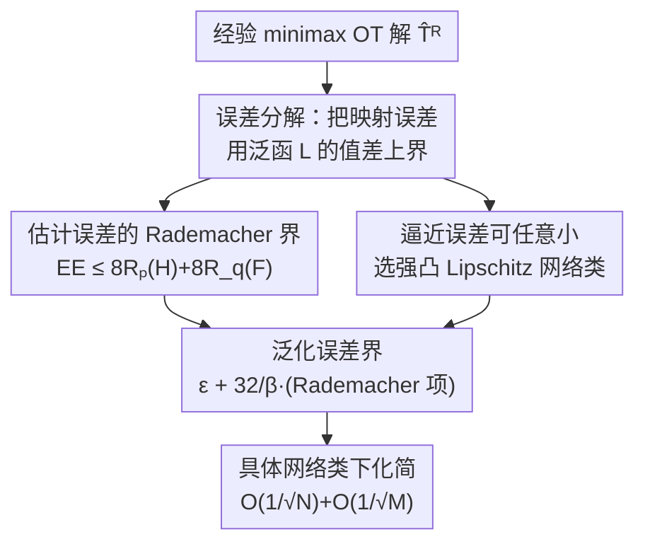

# A Statistical Learning Perspective on Semi-dual Adversarial Neural Optimal Transport Solvers

**会议**: ICLR2026  
**OpenReview**: [https://openreview.net/forum?id=FJTdyG8jeJ](https://openreview.net/forum?id=FJTdyG8jeJ)  
**代码**: https://github.com/milenagazdieva/StatOT (有)  
**领域**: 学习理论 / 最优传输 / 生成模型  
**关键词**: 最优传输, minimax 求解器, 泛化误差, Rademacher 复杂度, 半对偶

## 一句话总结
这篇论文给"用神经网络对抗式 minimax 求解二次最优传输映射"的一类生成式方法补上了缺失的统计学习理论：证明学到的传输映射与真实 OT 映射之间的泛化误差，可被分解为估计误差 + 逼近误差，且估计误差只由网络函数类的 Rademacher 复杂度控制、逼近误差可通过选合适的网络任意小，从而首次给出 $O(1/\sqrt{N})$ 量级的收敛保证。

## 研究背景与动机

**领域现状**：神经最优传输（neural OT）是近年生成建模里很热的一支，被用在域翻译、超分、计算生物等任务。它的主流做法是把 OT 问题写成**半对偶（semi-dual）形式**，再用对抗式 **minimax 求解器**同时学一个对偶势函数 $\varphi$ 和一个传输映射 $T$——形式上很像 GAN 的 min-max。代表工作有 Korotin 等人的 NOT、Rout 等人的 OT-based 生成器等。

**现有痛点**：这些 minimax OT 求解器在实践中跑得很好，但**几乎没有统计学习层面的理论支撑**。人们最关心的问题——"我用有限样本、有限容量网络学出来的映射 $\widehat{T}$，到底离真实 OT 映射 $T^*$ 有多远？样本量加大它会不会收敛？"——一直没有答案。已有的理论分析（Makkuva、Rout 等）只给出"对偶间隙（duality gap）"式的界，即用泛函 $\mathcal{L}(\varphi,T)$ 的值去上界误差，并**不揭示具体的统计收敛率**。

**核心矛盾**：非 minimax 的半对偶求解器（如把映射取成对偶势的梯度 $\nabla\varphi$）已经有人做出了统计率（Hütter & Rigollet、Gunsilius 等），但 minimax 形式**本质上更难**：它的优化目标里有**两个**变量——传输映射 $T$ 和独立的对偶变量 $\varphi$，是一个鞍点问题，比单变量最小化在理论上棘手得多，非 minimax 的结论无法直接搬过来。

**本文目标**：针对二次代价（$c(x,y)=\tfrac12\|x-y\|_2^2$，对应 Wasserstein-2）下的 minimax OT 求解器，把泛化误差 $\mathbb{E}_{X,Y}\|T^*-\widehat{T}\|^2_{L^2(p)}$ 真正"拆开、定界、给率"。

**切入角度**：作者借用统计学习理论的经典拆解套路——任何"经验最优解 vs 真实最优解"的误差都能分成**逼近误差**（函数类容量受限导致表示不了真解）与**估计误差**（用经验测度代替真实测度导致）。难点在于：minimax 目标有内外两层优化（$\min_\varphi\max_T$），每一层都要单独定义并控制这两种误差。

**核心 idea**：把 minimax 泛化误差**用泛函 $\mathcal{L}$ 的值差**来上界（这比直接比映射容易分析），再证明：内外估计误差合起来只由网络类的 **Rademacher 复杂度**控制，内外逼近误差通过选取合适的（强凸 + Lipschitz + ICNN/ReLU）网络类可以任意小——两者一拼，得到泛化误差 $\le \varepsilon + 32/\beta\cdot(\text{Rademacher 项})$，并在具体网络类下化简为 $O(1/\sqrt N)+O(1/\sqrt M)$。

## 方法详解

### 整体框架

这是一篇**纯理论**论文，"方法"即一条环环相扣的证明链。要解决的是：估计学到的映射 $\widehat{T}^R$（$R$ 表示在受限网络类内优化）与真实 OT 映射 $T^*$ 的平均 $L^2$ 误差

$$\mathbb{E}_{X,Y}\big\|\widehat{T}^R-T^*\big\|^2_{L^2(p)}.$$

研究对象是实践中真正在解的经验 minimax 问题

$$\min_{\theta\in\Theta}\max_{\omega\in\Omega}\ \frac1N\sum_{n}\big[\langle x_n,T_\omega(x_n)\rangle-\varphi_\theta(T_\omega(x_n))\big]+\frac1M\sum_m \varphi_\theta(y_m),$$

其中 $\varphi_\theta$ 是对偶势、$T_\omega$ 是传输映射，二者都是神经网络；真实分布 $p,q$ 被经验分布 $\widehat p,\widehat q$ 替代。整条证明分三步走：**(1) 误差分解**——把上面那个映射误差用泛函 $\mathcal L$ 的四个误差项上界；**(2) 逐项定界**——估计误差用 Rademacher 复杂度、逼近误差用网络逼近能力分别控制；**(3) 合并出率**——拼成泛化误差界，并在具体网络类下化简为 $1/\sqrt{N},1/\sqrt{M}$ 的收敛率。

### 关键设计

**1. 误差分解：把映射误差换成更好分析的泛函值差（Theorem 4.1）**

直接分析 $\|\widehat T^R-T^*\|_{L^2(p)}$ 很难，因为它是两个映射的逐点差。作者的关键一步是把它**上界成泛函 $\mathcal L(\varphi,T)$ 的值差**——泛函值是标量、可加可拆，远比映射本身好处理。具体地，先定义四个误差量：内/外**逼近误差** $\mathcal E^A_{\text{In}},\mathcal E^A_{\text{Out}}$（分别刻画受限的内层 $\max_T$、外层 $\min_\varphi$ 与无约束最优之间的差距，如 $\mathcal E^A_{\text{Out}}(\mathcal F)=|\min_{\varphi\in\mathcal F}\mathcal L(\varphi)-\min_\varphi\mathcal L(\varphi)|$），以及内/外**估计误差** $\mathcal E^E_{\text{In}},\mathcal E^E_{\text{Out}}$（用经验最优解 $\widehat\varphi^R,\widehat T^R$ 代入 $\mathcal L$ 后与真实最优值的差，对训练样本取期望）。在"外层函数类 $\mathcal F$ 由 $\beta$-强凸函数组成"的假设下，得到

$$\mathbb{E}_{X,Y}\big\|\widehat T^R-T^*\big\|^2_{L^2(p)}\le \frac{4}{\beta}\Big(\mathcal E^E_{\text{In}}+3\mathcal E^A_{\text{In}}+\mathcal E^E_{\text{Out}}+\mathcal E^A_{\text{Out}}\Big).$$

强凸假设在这里是把"泛函值接近"反推成"映射接近"的杠杆——没有强凸（曲率下界 $\beta$），泛函值差就压不住映射差。这一步把一个鞍点几何问题转化成了四个标量误差的可加分析，是整篇证明的脊梁。

**2. 估计误差的 Rademacher 界：只依赖网络类的容量（Theorem 4.2）**

估计误差源于"用有限样本的经验测度 $\widehat p,\widehat q$ 代替真实 $p,q$"。作者证明内外估计误差之和被两个 **Rademacher 复杂度**控制：

$$\mathcal E^E=\mathcal E^E_{\text{In}}+\mathcal E^E_{\text{Out}}\le 8\,\mathcal R_{p,N}(\mathcal H)+8\,\mathcal R_{q,M}(\mathcal F),$$

其中 $\mathcal H=\{h(x)=\langle x,T(x)\rangle-\varphi(T(x)):T\in\mathcal T,\varphi\in\mathcal F\}$ 是把映射与势"耦合"成的函数类。这个结果的分量在于：**误差只由所用网络函数类的统计容量决定**，与数据分布的具体形态无关——而 Rademacher 复杂度、覆盖数、VC 维这些量对常见网络（ReLU MLP、ICNN）在文献里已被充分研究，因此这个界是"可计算、可代入"的，不是空泛的存在性。它也正式说明了：要让 minimax OT 求解器收敛，关键是控制函数类的容量，这把 minimax OT 的统计性质纳入了一致估计理论的框架。

**3. 逼近误差可任意小：选对网络类就能逼近真解（Theorems 4.3 / 4.6）**

逼近误差源于"只在受限网络类 $\mathcal F,\mathcal T$ 内优化，可能表示不了真鞍点 $(\varphi^*,T^*)$"。作者分内外两路证明它能被压到任意小。**内层**（Theorem 4.3）：当外层类 $\mathcal F$ 取成 Lipschitz $\beta$-强凸、且对 Lipschitz 范数全有界时，对任意 $\varepsilon>0$ 存在一族神经网络（及其向 $Y$ 投影的版本）$\mathcal T$ 使 $\mathcal E^A_{\text{In}}(\mathcal F,\mathcal T)<\varepsilon$；这里的投影算子不是限制性添加项，实践中本来就常用（如图像域投回像素空间）。Proposition 4.4 进一步给出可行的 $\mathcal F$：以 CELU 激活的 $K$ 层 ICNN 加二次项 $\varphi+\beta\|\cdot\|^2/2$ 即满足强凸 + 全有界要求；Remark 4.5 指出对应的映射类 $\mathcal T$ 可取固定宽高、权重有界的 ReLU MLP。**外层**（Theorem 4.6 + Corollary 4.7）：当真实势 $\varphi^*$ 是 $\beta$-强凸时，存在不依赖 $\varphi^*$ 的全有界类 $\mathcal F$ 使 $\mathcal E^A_{\text{Out}}(\mathcal F)\le\varepsilon$。而"$\varphi^*$ 强凸"这一前提并不苛刻——Remark 4.8 借 Caffarelli 正则性理论说明：只要 $p,q$ 在凸紧支集上密度严格正、有界且 Hölder 连续（高斯混合等常用分布都满足），$\varphi^*$ 自动 $\beta$-强凸。这一串构造把"逼近误差可控"从假设落到了具体可实现的网络架构上。

**4. 泛化界与收敛率：拼出 $O(1/\sqrt N)$（Theorem 4.9 / Corollary 4.10）**

把估计误差的 Rademacher 界与逼近误差的"任意小"两块拼回 Theorem 4.1 的分解，得到主定理：当 $\varphi^*$ 为 $\beta$-强凸时，对任意 $\varepsilon>0$ 存在网络类 $\mathcal F,\mathcal T$ 使

$$\mathbb{E}_{X,Y}\big\|T^*-\widehat T^R\big\|^2_{L^2(p)}\le \varepsilon+\frac{32}{\beta}\big(\mathcal R_{p,N}(\mathcal H)+\mathcal R_{q,M}(\mathcal F)\big).$$

这说明实践者**可以通过选合适的函数类把泛化误差做到任意小**，但此时数值收敛率还藏在 Rademacher 项里。Corollary 4.10 再进一步：对前述具体网络类，Rademacher 复杂度可用只依赖样本量的上界替换，于是

$$\mathbb{E}_{X,Y}\big\|T^*-\widehat T^R\big\|^2_{L^2(p)}\le \varepsilon+O\!\Big(\tfrac{1}{\sqrt N}\Big)+O\!\Big(\tfrac{1}{\sqrt M}\Big).$$

这是全文的落点：只要选对网络类、给够样本，minimax OT 求解器的泛化误差就以 $1/\sqrt N$ 量级收敛——这是该类方法**首个**带具体统计率的可学习性（learnability）保证。

## 实验关键数据

本文是理论工作，实验只为"佐证理论界在实践中确实成立"，用的是 Korotin 等人（2021b）提供 ground-truth $T^*,\varphi^*$ 的 Wasserstein-2 benchmark（源为 3 个高斯混合、目标为约 10 个高斯混合，benchmark 数据本身由 ICNN 参数化的 $\varphi^*$ 构造）。作者刻意设计两组实验，分别让泛化误差**主要由估计误差**或**主要由逼近误差**主导，去单独检验 Corollary 4.10。

### 主实验（估计误差，§5.1）

固定势 $\varphi$ 用与 ground-truth 相同的网络架构（使外层逼近误差≈0），$T$ 用 ReLU MLP，维度 $D=2,4$，从 $10^2$ 到 $2\times10^4$ 不等地抽样训练，测量 $\|\widehat T-T^*\|^2_{L^2(p)}$ 并在 log-log 尺度做线性回归。

| 设置 | 变量 | 观测到的收敛行为 | 与理论对照 |
|------|------|------|------|
| 估计误差主导（§5.1） | 样本量 $N,M$：$10^2\!\to\!2\times10^4$ | $\log$ 误差对 $\log N,\log M$ 近似线性，斜率 $\lesssim -0.5$ | 与 Cor. 4.10 的 $O(1/\sqrt N)$ 一致 |
| 逼近误差主导（§5.2） | 网络宽度（$\max H_\varphi$ 4→64、$\max H_T$ 1→8），样本 ≈10M | 宽度增大 → 逼近误差单调下降；势架构追平 $\varphi^*$ 时误差最小 | 符合"容量越大逼近误差越小"的预期 |

### 逼近误差实验（§5.2）

取约 1000 万样本（使估计误差可忽略，泛化误差≈逼近误差），用比 benchmark 更浅的架构（势隐层 $\max H_\varphi$ 从 4 到 64、映射隐层 $\max H_T$ 从 1 到 8，对比此前实验用的 512），观察误差随网络宽度的变化。

### 关键发现
- **估计误差的斜率 $\lesssim-0.5$** 直接对上理论的 $1/\sqrt N$——这是全文最关键的实证证据：理论给的率不是松散上界，实际收敛几乎贴着它走。
- **逼近误差随宽度单调下降**，且当势网络宽度追平 ground-truth 的 64 时误差降到最低，印证 Theorem 4.3/4.6 的"选够容量即可任意逼近"。
- 作者诚实指出：在更复杂的实际场景中，理论界**可能不成立**，因为真实训练里还有特定优化过程带来的优化误差（optimization error），而本文的分析不覆盖优化误差。

## 亮点与洞察
- **把鞍点误差换成标量泛函值差**：Theorem 4.1 用强凸性把"两个映射的 $L^2$ 差"上界成"泛函 $\mathcal L$ 的值差"，绕开了 min-max 几何的直接处理——这是让整套统计学习工具能套进来的关键转换，思路可迁移到其他对抗式（GAN 类）目标的泛化分析。
- **估计/逼近二分法在 minimax 上的完整落地**：第一次把"内层 $\max_T$ + 外层 $\min_\varphi$"各自的逼近与估计误差都单独定义清楚并定界，给后来者一个可复用的分析模板。
- **理论假设落到可实现架构**：不是停在抽象函数类，而是明确"ICNN（CELU）+ 二次项 → 强凸势"、"ReLU MLP → 映射类"，并用 Caffarelli 正则性把"$\varphi^*$ 强凸"还原成对 $p,q$ 的温和条件（密度正、有界、Hölder 连续），让理论与实践对得上。

## 局限与展望
- **仅限二次代价**：所有结论都建立在二次（Wasserstein-2）代价上，一般代价函数与更广的 OT 形式（如非平衡 OT、熵正则 OT）只在 Related Work 里提及，作者自陈推广是未来方向。
- **不含优化误差**：分析假设能取到经验目标的最优解 $\widehat\varphi^R,\widehat T^R$，但实际 min-max 训练用 SGD 类算法，鞍点优化本身的不收敛 / 不稳定（优化误差）没被纳入；作者明确承认复杂场景下理论界可能因此失效。
- **率只到 $1/\sqrt N$ 量级 + 常数依赖 $1/\beta$**：泛化界含 $32/\beta$ 因子，强凸常数 $\beta$ 很小时界会很松；且只给了量级，没有精细常数。实验也仅在低维（$D=2,4$）高斯混合上验证，高维行为放在附录、缺乏大规模图像级实证。

## 相关工作与启发
- **vs 非 minimax 半对偶 OT（Hütter & Rigollet 2021；Gunsilius 2022）**：他们分析的是非 min-max 损失，映射取成对偶势的梯度 $\nabla\varphi$、只有一个优化变量，能直接给统计率；本文处理的是把映射 $T$ 与势 $\varphi$ **分开学**的 minimax 目标，多一个"自由度"导致是鞍点问题，分析显著更难，非 minimax 的结论无法平移——这正是本文要填的空白。
- **vs 对偶间隙式分析（Makkuva 2020；Rout 2022）**：他们用泛函 $\mathcal L(\varphi,T)$ 的值（对偶间隙）去上界映射误差，能验证 minimax 方法论的合理性，但**不给具体统计率**；本文进一步把这些误差落到 Rademacher 复杂度和样本量上，给出 $O(1/\sqrt N)$ 的可学习性保证。
- **vs 其它 OT 形式的统计分析（熵正则 OT、非平衡 OT、动态 OT 等）**：这些工作研究对象与本文（半对偶 minimax 二次 OT）不同，相关但不可直接比较；本文与它们的关系是"补上 minimax 半对偶这一支缺失的统计理论"。

## 评分
- 新颖性: ⭐⭐⭐⭐⭐ 首次为 minimax 半对偶神经 OT 求解器给出带具体统计收敛率的泛化保证，填补了真实空白。
- 实验充分度: ⭐⭐⭐ 实验仅为理论佐证，限于低维高斯混合 benchmark，缺大规模/高维实证。
- 写作质量: ⭐⭐⭐⭐ 误差分解 → 定界 → 合并的逻辑链清晰，假设与适用范围交代诚实。
- 价值: ⭐⭐⭐⭐ 给热门的神经 OT 方法补上理论地基，分析框架可被后续工作复用与推广。

<!-- RELATED:START -->

## 相关论文

- [\[ICLR 2026\] Slicing Wasserstein over Wasserstein via Functional Optimal Transport](slicing_wasserstein_over_wasserstein_via_functional_optimal_transport.md)
- [\[ICLR 2026\] Online Conformal Prediction with Adversarial Semi-bandit Feedback via Regret Minimization](online_conformal_prediction_with_adversarial_semi-bandit_feedback_via_regret_min.md)
- [\[ICLR 2026\] Transformers as Measure-Theoretic Associative Memory: A Statistical Perspective and Minimax Optimality](transformers_as_measure-theoretic_associative_memory_a_statistical_perspective_a.md)
- [\[ICLR 2026\] Test-Time Verification via Optimal Transport: Coverage, ROC, & Sub-Optimality](test-time_verification_via_optimal_transport_coverage_roc_sub-optimality.md)
- [\[ICLR 2026\] Feature Compression is the Root Cause of Adversarial Fragility in Neural Networks](feature_compression_is_the_root_cause_of_adversarial_fragility_in_neural_network.md)

<!-- RELATED:END -->
