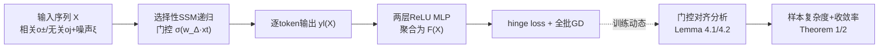

# A Theoretical Analysis of Mamba's Training Dynamics: Filtering Relevant Features for Generalization in State Space Models

**会议**: ICLR 2026  
**OpenReview**: [https://openreview.net/forum?id=hvpKqEYJjj](https://openreview.net/forum?id=hvpKqEYJjj)  
**代码**: 待确认  
**领域**: learning theory  
**关键词**: Mamba, 选择性状态空间模型, 训练动态, 泛化分析, 特征学习, 门控机制  

## 一句话总结
本文首次从特征学习视角刻画 Mamba（带输入相关门控的选择性 SSM）的梯度下降训练动态，证明在两类结构化数据下门控向量 $w_\Delta$ 会自动对齐类别相关特征、抑制无关特征，并给出非渐近的样本复杂度与收敛速率界，从理论上回答了"Mamba 何时、为何能高效学习并泛化"。

## 研究背景与动机
- **领域现状**：Mamba 等选择性状态空间模型（SSM）以线性复杂度在语言、视觉、图、音频等任务上逼近甚至超过 Transformer，引发对非注意力架构的重新关注。但其成功的理论基础仍很薄弱。
- **现有痛点**：已有 SSM 理论几乎全在"逼近论/表达能力"层面打转——证明 SSM+MLP 是万能逼近器、Mamba 比对角 SSM 表达力更强、H3/GLA 在 in-context 时隐式做预条件 GD。这些结果只说明"存在"好的表示，却没回答这些能力**能否真的通过实际训练得到**，更没碰泛化分析。
- **核心矛盾**：Mamba 的门控是**乘性、跨 token 累积、对 token 顺序敏感**的递归结构（不同于注意力的加性加权），这让训练动态分析远比门控线性注意力困难；同时实验上 Mamba 对超参极其敏感，说明"何时收敛、何时泛化"是个真问题。
- **本文目标**：给一个简化但有代表性的 Mamba 块（单层单头选择性 SSM + 两层 MLP，GD 训练）建立首个训练动态 + 泛化保证的理论分析，并讲清门控机制到底起了什么作用。
- **核心 idea（特征学习 + 门控对齐）**：把数据建模成"类别相关特征 + 类别无关填充特征 + token 级噪声"的结构化模型，跟踪门控向量 $w_\Delta$ 在 GD 下沿各特征方向的梯度演化，证明它会自发地"放大相关、压制无关"，从而形式化 Mamba 的选择机制扮演的"类注意力特征选择器"角色。

## 方法详解

### 整体框架
分析对象是一个最小但保留门控本质的模型：输入序列经单层选择性 SSM 递归得到逐 token 输出 $y_l(X)$，再过两层 ReLU MLP 聚合成标量预测 $F(X)$，用 hinge loss 做二分类、全批量 GD 训练。理论刻画分两步走：先在两类典型结构化数据（多数投票 / 局部聚集）上分析门控向量 $w_\Delta$ 沿不同特征方向的对齐动态（Lemma 4.1/4.2），再据此给出达到零泛化误差所需的样本复杂度与迭代数（Theorem 1/2）。

### 关键设计

**1. 结构化数据模型：用"相关/混淆/无关"三类 token 锚定可分析的学习信号。** 取一组正交基 $O=\{o_+, o_-, o_3,\dots,o_d\}$，其中 $o_+, o_-$ 是判别性特征、其余是无关填充特征；每个 token 是某个模式加高斯噪声 $x_l = o + \xi$。论文设计两个互补的标签生成机制：**多数投票数据**中标签由相关 token 占比决定（正样本里 $o_+$ 的噪声变体是相关 token、$o_-$ 是混淆 token，负样本角色互换），对应图像分类里"多个前景 patch 投票决定类别"的直觉；**局部聚集数据**中每条序列含两个 $o_+$、两个 $o_-$，标签由相关 token 的**空间/时间聚集度**决定（正样本两个 $o_+$ 靠得近、两个 $o_-$ 散开，即 $\Delta L^+_{o_+} \ll \Delta L^+_{o_-}$），对应目标检测/captioning 里"决定性内容集中在局部区域"的场景。这套数据模型把抽象的"选择性"翻译成可被梯度精确追踪的几何量。

**2. 门控对齐刻画：证明 $w_\Delta$ 自发放大相关、压制无关。** 核心技术贡献是逐项分解门控向量的梯度更新，追踪它沿各 $o$ 方向的投影演化。在**多数投票**数据下，Lemma 4.1 证明训练后门控与两个判别特征正对齐 $\langle w_\Delta^{(T)}, o_+\rangle \ge \frac{\eta T}{8L^2}\Theta((\alpha_r L - \alpha_c L)^2)$，而与无关特征的对齐被压到 $\tilde O(1/\text{poly}(d))$——即门控显式充当特征选择器。在**局部聚集**数据下情况更微妙：因为相关与混淆 token 数量相当，无法靠多数效应放大相关方向，Lemma 4.2 转而证明门控**主动把无关方向的梯度推向强负**：$\langle w_\Delta^{(T)}, o_j\rangle \le -\frac{\eta T c'_3}{16L}[(\tfrac12)^{\Delta L^+_{o_+}-2}-(\tfrac12)^{\Delta L^-_{o_+}-2}][\cdots]$，而相关方向保持近零。两种机制殊途同归——通过强化信息 token、削弱无信息 token，在激活上诱导出有效稀疏性。

**3. 泛化保证：把数据结构量翻译成样本复杂度与收敛率。** 基于门控对齐结果，Theorem 1/2 给出非渐近界。**多数投票**数据下，只要宽度 $m\ge d^2\log q$、噪声 $\tau < O(1/d)$，当样本数 $N \ge \Omega\big(\frac{d}{\eta^2(\alpha_r-\alpha_c)^2}\big)$ 且迭代数 $T=\Theta\big(\frac{1}{\eta(\alpha_r-\alpha_c)^2}\big)$ 时达到零泛化误差——界随相关/混淆特征占比差 $\alpha_r-\alpha_c$ 增大而改善。**局部聚集**数据下，$N\ge\Omega\big(\frac{L^2 d}{\eta^2((1/2)^{\Delta L^+_{o_+}}-(1/2)^{\Delta L^-_{o_+}})^2}\big)$、$T=\Theta\big(\frac{L^2}{\eta((1/2)^{\Delta L^+_{o_+}}-(1/2)^{\Delta L^-_{o_+}})}\big)$，当相关特征更局部聚集（$\Delta L^+_{o_+}\gg\Delta L^-_{o_+}$）时收敛更快。值得注意的是：多数投票数据 Transformer 也能学（Li et al. 2023a），但局部聚集数据 Transformer 无此保证，凸显 Mamba 利用 token 顺序/局部性的独特优势。

## 实验关键数据
合成数据实验仅用于验证理论，不追求 SOTA。

### 主实验现象

| 图 | 验证对象 | 现象 | 对应理论 |
|----|---------|------|---------|
| Fig.1 | 多数投票收敛 | 增大投票 gap $\alpha_r-\alpha_c$ 一致减少所需 epoch（跨多种样本量） | 公式 (13)(14) |
| Fig.2 | 多数投票门控对齐 | $w_\Delta$ 与相关特征的余弦相似度稳步上升，与无关特征基本不变 | Lemma 4.1 |
| Fig.3 | 局部聚集收敛 | 相关 token 间距 $\Delta L$ 越大收敛越慢 | 公式 (19)(20) |
| Fig.4 | 局部聚集门控对齐 | 两类特征余弦相似度均为负，但相关特征近零、无关特征强负 | Lemma 4.2 |

### 关键发现
- 门控在两种数据下行为不同但目的一致：多数投票靠"放大相关"，局部聚集靠"压制无关"，最终都把模型容量倾斜给最有信息的 token。
- 收敛速度与样本复杂度都由"判别结构强度"（投票 gap 或局部聚集差）和 token 噪声 $\tau$ 共同决定，信号越强、噪声越小学得越快——实验四张图全部与理论界趋势吻合。

## 亮点与洞察
- **首个 Mamba 训练动态 + 泛化分析**：以往 SSM 理论只谈"存在好表示"，本文回答了"训练能否真的得到、需要多少样本/迭代"，把分析从逼近论推进到优化+泛化层面。
- **门控 = 特征选择器的形式化**：用梯度投影动态精确刻画了"Mamba 把容量分配给重要模式"的直觉，给出与注意力对应又有本质区别（乘性 vs 加性）的机制解释。
- **揭示 Mamba 对局部性的独特优势**：构造局部聚集数据模型，证明 Mamba 能利用 token 顺序/聚集度学习，而同等条件下 Transformer 无泛化保证——为"何时该选 SSM"提供理论依据。
- **乘性递归的技术处理**：通过分解对角项 $\beta^{(l)}_{s,s}$ 与离屏项 $\beta^{(l)}_{s,s+1}$、追踪 token 位置对动态的影响，攻克了乘性门控跨 token 累积带来的分析难点。

## 局限与展望
- **模型高度简化**：只分析单层、单头、无残差/无 LayerNorm 的最小 Mamba 块 + 两层 MLP，抽掉了实际架构中的深度、多头、归一化等关键组件。
- **数据模型理想化**：正交特征 + 高斯噪声 + 二分类虽是特征学习理论的标准设定，但与真实序列的复杂依赖结构仍有距离。
- **展望**：把分析推广到多层多头 Mamba、更丰富的数据模型，以及门控 Transformer、Mamba–Transformer 混合架构等设计，是重要后续方向。

## 相关工作与启发
- **SSM 理论**：S4 → Mamba 引入输入相关门控；已有工作集中在逼近能力（Nishikawa & Suzuki 2025; Muca Cirone et al. 2024; Huang et al. 2025）、长程依赖、与 Transformer 对比，本文补上训练动态这一空白。
- **优化/泛化向 SSM 分析**：Honarpisheh et al. (2025) 给 Rademacher 复杂度泛化界、Slutzky et al. (2024) 在 teacher-student 下研究隐式偏置低秩收敛，但都不含 Mamba 的输入相关门控；本文是首个纳入该门控的训练分析。
- **特征学习框架**：延续从 NTK 转向 feature learning 的脉络（Li et al. 2023a/2024b 等对 Transformer 的分析），把结构化数据模型从注意力扩展到门控递归架构。
- **启发**：门控的"乘性选择"机制可能是 SSM 区别于注意力的核心；理解它对设计混合架构、解释 Mamba 超参敏感性都有指导意义。

## 评分
- **新颖性**: ⭐⭐⭐⭐⭐ 首个带输入相关门控的 Mamba 训练动态 + 泛化分析，并提出新的局部聚集数据模型，填补 SSM 理论空白。
- **实验充分度**: ⭐⭐⭐ 纯合成数据，仅用四张图验证理论趋势，无真实任务/真实 Mamba 验证（理论论文定位下可接受）。
- **写作质量**: ⭐⭐⭐⭐ 三大 takeaway（T1-T3）+ 两套数据 + 引理/定理层层递进，技术挑战节交代清楚，可读性好。
- **价值**: ⭐⭐⭐⭐ 为"Mamba 何时/为何高效学习并泛化、相比 Transformer 强在哪"提供了首份原理性答案，对理解和设计选择性 SSM 有指导价值。

<!-- RELATED:START -->

## 相关论文

- [\[ICLR 2026\] Theoretical Analysis of Contrastive Learning under Imbalanced Data: From Training Dynamics to a Pruning Solution](theoretical_analysis_of_contrastive_learning_under_imbalanced_data_from_training.md)
- [\[ICLR 2026\] On the Expressiveness of State Space Models via Temporal Logics](on_the_expressiveness_of_state_space_models_via_temporal_logics.md)
- [\[ICLR 2026\] Reshaping Reasoning in LLMs: A Theoretical Analysis of RL Training Dynamics through Pattern Selection](reshaping_reasoning_in_llms_a_theoretical_analysis_of_rl_training_dynamics_throu.md)
- [\[ICLR 2026\] Quotient-Space Diffusion Models](quotient-space_diffusion_models.md)
- [\[ICLR 2026\] The Expressive Limits of Diagonal SSMs for State-Tracking](the_expressive_limits_of_diagonal_ssms_for_state-tracking.md)

<!-- RELATED:END -->
