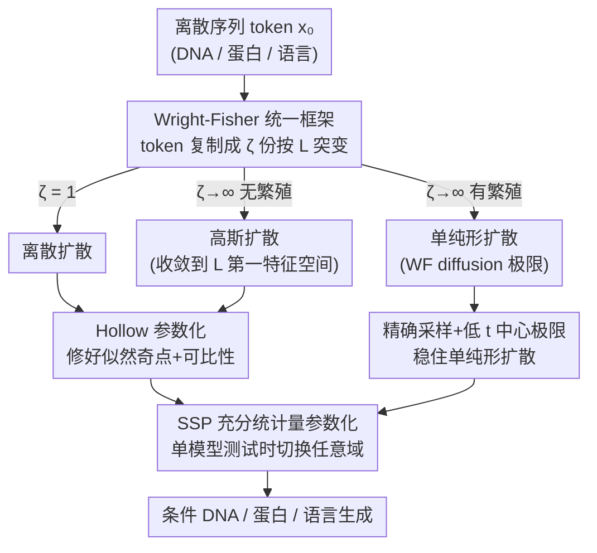

# A Unification of Discrete, Gaussian, and Simplicial Diffusion

**会议**: ICLR2026  
**OpenReview**: [https://openreview.net/forum?id=1taAXRcm21](https://openreview.net/forum?id=1taAXRcm21)  
**代码**: https://github.com/yucenli/unify-diffusion （有）  
**领域**: 扩散模型 / 生成模型理论  
**关键词**: 离散扩散, 高斯扩散, 单纯形扩散, Wright-Fisher 模型, 序列生成

## 一句话总结
这篇论文证明了离散扩散、高斯扩散、单纯形扩散这三套看似互不相干的离散序列生成方法，其实都是群体遗传学里 **Wright-Fisher 模型** 的不同参数化极限，用这套统一理论既稳住了一直数值发散的单纯形扩散（在条件 DNA 生成上刷到 SOTA），又让单个网络在测试时能任意切换三种扩散域。

## 研究背景与动机
**领域现状**：要用扩散模型生成 DNA、蛋白质、自然语言这类离散序列，实践者面前有三条互不兼容的路：(1) **离散扩散**——直接在离散 token 空间上做"突变"加噪，定义域最自然；(2) **高斯扩散**——把 token 嵌入到欧氏空间 $\mathbb{R}^r$ 做布朗运动，采样/训练算法最成熟；(3) **单纯形扩散**——在概率单纯形上做扩散，理论上既保留连续算法又待在自然空间，是前两者的"理想合体"。

**现有痛点**：三种方法各有各的算法、各有各的理论结构，实践者只能凭手感选。两个最基础的比较问题至今没解决：① **似然不可比**——大家普遍相信"连续空间似然和离散空间似然没法直接比"（因为高斯扩散的 ELBO 在 $t\to 0$ 处有奇点、积分发散，必须人为设 $t_{\min}$，比的其实是 $\log p(x_{t_{\min}})$ 这个连续密度，和离散概率 $p(x_0)$ 不是一回事），可偏偏两者算出来的数值又常常很接近；② **超参不可比**——离散扩散用突变率矩阵 $L$、高斯扩散用嵌入函数 $\text{emb}$，两套超参解释完全不同，没法对照设计。更糟的是单纯形扩散在实践中**数值极不稳定**：采样要从昂贵的 Jacobi/CIR 随机微分方程模拟，而损失计算在小 $t$ 时会"爆"。

**核心矛盾**：根子在于学界从没有一个能把三种扩散放进去对比的统一数学框架——既不知道它们为什么似然相近，也不知道怎么把一方的成熟工具搬给另一方。之前的统一尝试只在一维、特例下成立（Winkler et al. 2024 借 Stone 1963 连了一维无偏离散↔一维高斯），还有人（Sahoo et al. 2025）声称"高斯扩散取 argmax 就得到离散扩散"，但本文指出这是数学错误（argmax 后不再是 Markov 过程，证明前提就塌了）。

**切入角度**：作者发现这三种扩散其实对应群体遗传学里一个经典模型——**Wright-Fisher（WF）模型**：一个大小为 $\zeta$ 的种群在世代间突变、繁殖，问 $\zeta$ 取不同值会发生什么。

**核心 idea**：把序列里每个 token 用 $\zeta$ 份拷贝表示，让它们各自按突变矩阵 $L$ 演化——$\zeta=1$ 就是离散扩散，$\zeta\to\infty$ 无繁殖收敛到高斯扩散，$\zeta\to\infty$ 有繁殖收敛到单纯形扩散。三种扩散从此是同一过程的三个极限，似然、超参、算法全部打通。

## 方法详解

### 整体框架
全文是一篇"理论 + 落地"的工作：先用 Wright-Fisher 种群遗传模型搭一个统一框架，把离散/高斯/单纯形三种扩散证明成同一过程的不同极限（第 4、5 节）；再用这个框架回答两个长期悬而未决的比较问题、并借群体遗传学几十年的文献修好单纯形扩散的数值病（第 5 节）；最后提出一种参数化（SSP），让一个网络训练完能在测试时切换任意扩散域（第 6 节）。

核心机制可以这样看：把一个 token $x_0$ 复制成 $\zeta$ 份，每份独立按连续时间 Markov 突变矩阵 $L$ 演化，于是噪声态 $\vec{x}_t$ 是这 $\zeta$ 份的归一化计数向量（落在单纯形上）。调节 $\zeta$ 和"是否繁殖"这两个旋钮，就能在三种扩散之间连续滑动：

### 关键设计

**1. Wright-Fisher 统一框架：把三种扩散收进同一个种群遗传模型**

针对"三种扩散没有共同数学框架、无法对照"的痛点，作者把每个 token 表示成 $\zeta$ 份拷贝（如 $\zeta=4$ 时 $x_0=\texttt{A|C|C|T}$ 表示成 $\texttt{AAAA|CCCC|CCCC|TTTT}$），每份独立按突变矩阵 $L$ 演化，于是 $\vec{x}_t$ 成为归一化计数向量 $\vec{x}_{t,b}=\#\{b\text{ in }x_t\}/\zeta$，天然落在单纯形上。$\zeta=1$ 时这就是标准离散扩散（Alg. 1）。关键定理 4.1 证明：当 $\zeta\to\infty$ 时，由大数定律 $\vec{x}_t$ 趋向平稳分布 $\vec\pi$，再由中心极限定理在 $\vec\pi$ 附近呈高斯——把噪声分解成"信号 + 噪声"两项，$\vec{x}_t-\vec\pi \approx e^{-\tau_t^\zeta}P_1\vec{x}_0 + \tfrac{1}{\sqrt\zeta}\mathcal{N}(0,\Sigma)$，配上正确的时间膨胀 $\tau_t^\zeta=\tfrac12\log(\zeta e^{-2\tau_t}-\zeta+1)$ 和缩放，就**恰好收敛到高斯扩散**，且其 ELBO（Alg. 3）也收敛到高斯扩散的 ELBO（Alg. 2）。一个深刻的副产物：极限高斯扩散只发生在 $L$ **最慢衰减的第一特征空间**里，嵌入维度 $r$ 由该特征空间维数决定——这给出了 $\text{emb}$ 的闭式公式 $\text{emb}(x_0)=Q_1(\vec{x}_0/\sqrt{\vec\pi})$，反过来说明离散扩散的设计空间比高斯扩散更丰富（能指定 $L$ 所有相互作用的特征空间，而不只是主导那个）。

**2. Hollow 参数化：让离散与高斯似然真正可比、并消掉 ELBO 奇点**

定理 4.1 带来一个悖论——理论上用 $\zeta=10^{100}$ 的离散扩散和直接跑高斯扩散在计算机上几乎没差别，可极限高斯 ELBO 却是无穷大。作者解释了原因：$\vec{x}_t$ 的轨迹有"近确定性的低 $t$ 相"和"随机相"两段；逆过程网络在初始化时"永远看不清 $x_0$ 是谁"，导致与确定性路径失配，$\zeta$ 越大路径越确定、奇点越严重。解法出奇简单——用每个 $x_0$ 的证据给网络输出加权：$q_\theta(x_0\mid x_t,t)\propto p(x_t\mid x_0,t)\,q_\theta(x_0)$，让似然项 $p(x_t\mid x_0,t)$ 自动决定"什么时候 $x_0$ 才算明显"。在高维下这等价于 **hollow 预测器** $q_\theta(x_0^d\mid x_t,t)\propto p(x_t^d\mid x_0^d,t)\,q_\theta(x_0^d\mid x_t^{-d},t)$（网络看 $x_t$ 但要学会无视自己那一维 $x_t^d$，不需改架构）。论文形式化证明 hollow 参数化**移除了 ELBO 的奇点**，从而第一次让离散与高斯扩散的似然在同一标尺上可比。这个 trick 本是 Austin et al. (2021) 附录里改进离散扩散的小技巧，在这里被提升为构造"似然可比的新高斯扩散模型"的关键。

**3. 稳定的单纯形扩散：借群体遗传学几十年文献修好数值病**

把繁殖加进 $\zeta$ 份种群、令 $\zeta\to\infty$，就得到 Kimura (1955) 推导的 WF diffusion 极限——它恰是单纯形扩散的前向过程（定理 5.1 进一步推出其 ELBO 极限，且与 Avdeyev et al. 2023 启发式的 score loss 一致、还能直接和别的模型 ELBO 比较）。统一之后，单纯形扩散长期的"采样昂贵 + 小 $t$ 损失爆炸"两大病都能对症下药：**采样**上，不再用昂贵近似的 SDE 模拟，而用 Jenkins & Spanò (2017)《Exact simulation of the Wright-Fisher diffusion》的精确公式——从 $\text{Dirichlet}(\psi\vec\pi+m\vec{x}_0)$ 采 $\vec{x}_t$（$m=0$ 时居中于 $\vec\pi$，$m$ 越大越集中于信号 $x_0$），$m$ 是表示"回溯 $\tau_t$ 时间种群有几个祖先"的整数；**损失**上，把 Avdeyev 那个要对预测器求导、贵到训不动的似然，换成本文从 ELBO 推出的正确缩放 $\tfrac{\dot\tau_t}{2}$ 和度量 $\text{diag}(\vec{x}_t)-\vec{x}_t\vec{x}_t^\top$；**低 $t$ 不稳定**（无穷级数在小 $t$ 收敛失败，Griffiths 1984 直言"会从计算机里产出胡话"）则用一个随 $t$ 减小反而更准的中心极限近似替换级数（阈值取 $\tau_t<0.05$）。

**4. SSP 充分统计量参数化：一个网络测试时切换任意扩散域**

实践者必须在训练前就把扩散域定死，限制了可用的下游算法。作者注意到：扩散网络要预测 $x_0^d$，本质是对未见的 $x_0^{-d}$ 按其产生数据 $x_t^{-d}$ 的似然积分。把这份"证据"归一化成向量 $\vec\phi(x_t^{d'},t)_b\propto p(x_t^{d'}\mid t, x_0^{d'}=b)$，命题 6.1 证明存在一个**只依赖数据分布 $p(x_0)$、不依赖扩散过程也不依赖 $t$** 的函数 $F^d$，使 $p(x_0^d\mid x_t^{-d},t)=F^d(\vec\phi(\vec{x}_t^1,t),\dots,\vec\phi(\vec{x}_t^D,t))$。也就是说 $\vec\phi$ 是充分统计量——它装下了关于扩散过程和 $t$ 的全部相关信息，剩下的回归任务对二者都不变。于是把网络参数化成 $q_\theta(x_0^d\mid x_t^{-d},t)=F_\theta^d(\vec\phi(\cdot),\dots)$，配合"三种域 ELBO 可比"这一结论，就能让网络每个 batch 轮流最小化某一种域的 ELBO，训出一个**测试时能在离散/高斯/单纯形任意域采样**的统一模型。论文指出这还顺带解释并推广了 masking diffusion 著名的"时间不变性"到所有扩散模型（附录 D）。

## 实验关键数据

### 主实验：条件 DNA 生成（修好的单纯形扩散打到 SOTA）
任务为长度 $D=500$、词表 $B=4$ 的 DNA 序列，按目标"染色质可及性 profile"用分类器引导条件生成。ELBO 越低越好（nats/position）：

| 模型 | ELBO (DNA, ↓) | 说明 |
|--------|------|------|
| 平凡均匀模型 | 1.39 | 每位置预测均匀字母 |
| Avdeyev et al. (2023) 旧单纯形扩散 | 8（训练前 12.7）| 数值不稳、拟合差 |
| **本文稳定单纯形扩散** | **1.30** | 拟合优于平凡基线，远超旧法 |

Fig. 5 显示本文模型生成的条件样本可及性 profile 与目标更吻合，平均 RMSE 显著低于旧单纯形扩散、flow matching 和随机基线。

### 分析实验：SSP 统一模型 vs 单域专用模型
用 SSP 训一个统一模型，与每个模态单独训的专用模型对比（相同训练时长）：

| 模态 / 指标 | 维度 | 单域模型 | SSP 统一模型 | 结论 |
|------|------|---------|------|------|
| 蛋白 NLL (↓) | 离散/高斯/单纯形 | 2.41 / 2.29 / 2.46 | 2.41 / 2.30 / 2.47 | 几乎持平 |
| 蛋白 pLDDT (↑) | 折叠性 | 40.7 / 44.4 / 41.1 | 41.8 / 43.8 / 40.7 | 竞争性 |
| 语言 NLL (↓) | 离散/高斯 | 3.46 / 4.57 | 3.55 / 4.18 | 单纯形难扩到大词表 |
| 语言困惑度 (↓) | 离散/高斯 | 100.7 / 144.8 | 122.8 / 105.5 | 竞争性 |

蛋白实验对标 SOTA 蛋白扩散模型 DPLM（似然 2.36、折叠性 45.2）；语言实验用与 SEDD（NLL 3.70）相同数据量训练。附录还在 MNIST 图像上复现了类似结论。

### 关键发现
- **似然只在特定情况下可比**：取决于一个看似无关紧要的参数化选择（hollow parameterization）——这是统一理论给出的、反直觉但精确的回答，纠正了"连续与离散似然天生不可比"的旧信念。
- **单纯形扩散的不稳定不是宿命**：根源是低 $t$ 的无穷级数发散，而群体遗传学早有现成解（精确采样 + 中心极限近似），统一框架把这些工具"免费"搬了过来。
- **统一模型几乎不掉点**：一个 SSP 网络在三种域上都能逼近各自专用模型，省去了训练前选域的负担；单纯形扩散因词表 $B\approx 3\times 10^4$ 太大难扩到语言任务，是当前唯一明显短板。

## 亮点与洞察
- **跨学科的桥**最让人"啊哈"：把机器学习里三套扩散和群体遗传学的 Wright-Fisher 模型对上，等于把遗传学几十年关于 WF diffusion 的稳定采样/级数近似文献整体接到了生成模型上——这种"换个领域找现成答案"的思路极具迁移价值。
- **极限视角统一**很优雅：离散($\zeta=1$)、高斯($\zeta\to\infty$ 无繁殖)、单纯形($\zeta\to\infty$ 有繁殖)被一个种群大小旋钮串起来，还顺手揭示高斯扩散其实只活在 $L$ 第一特征空间里——这个"维度从哪来"的解释本身就很有启发。
- **hollow 参数化**是个可复用 trick：不改架构、只重加权网络输出，就能消掉 ELBO 奇点并让似然可比；任何想对比离散与连续生成模型似然的人都能用。
- **充分统计量 $\vec\phi$** 把"扩散域"从网络里抽离出来，理论上甚至能跨超参、跨没训练过的模态迁移——这为"训一次，到处用"的扩散模型指了条路。

## 局限与展望
- 作者承认：reflected diffusion、flow matching、masking diffusion、带插入删除的扩散都未纳入框架（但提示后两者可借已有理论较易接入）。
- 单纯形扩散难以扩到大词表（语言任务 $B\approx 3\times 10^4$），SSP 统一模型在语言上只能覆盖离散+高斯两域，单纯形缺席——这是当前最实际的工程瓶颈。
- 主实验落在 DNA/蛋白等生物序列与小规模语言/MNIST 上，理论虽通用但大规模语言建模的实证仍偏弱；框架预言的"三种扩散之间的新中间模型"也只作为理解透镜，尚未真正实现，落地价值待验证。
- 多处关键结论依赖大 $\zeta$ 极限与正则性条件（⚠️ 具体证明以原文附录 E 为准），实际有限 $\zeta$ 下的近似误差对下游影响讨论不多。

## 相关工作与启发
- **vs Winkler et al. (2024) / Stone (1963)**：他们只连了一维、无偏的离散↔高斯特例并启发式猜测逆过程收敛；本文给出多维、严格的统一证明，并明确指出高斯极限发生在 $L$ 第一特征空间。
- **vs Sahoo et al. (2025)**：他们用"高斯取 argmax 得离散"来论证离散 ELBO 恒优于连续，但本文指出 argmax 后不再 Markov、证明前提失效；本文转而建立数学严谨的可比框架。
- **vs Avdeyev et al. (2023) / Benton et al. (2024)**：前者的单纯形扩散数值不稳、损失要对网络求导贵到训不动，后者只在玩具设定用 WF；本文把损失认成真正的 ELBO（给出正确缩放与度量）、用精确采样与中心极限近似稳住低 $t$，在条件 DNA 生成上反超 flow matching。
- **vs Stark et al. (2024) 等 flow matching**：flow matching 更稳但牺牲了闭式 ELBO 与分类器引导等扩散算法；本文在保留这些能力的同时把稳定性补齐。

## 评分
- 新颖性: ⭐⭐⭐⭐⭐ 用群体遗传学 Wright-Fisher 模型统一三种扩散，是真正打通框架的原创理论，跨学科桥极漂亮。
- 实验充分度: ⭐⭐⭐⭐ DNA/蛋白/语言/MNIST 多模态验证，DNA 刷到 SOTA；但大规模语言与单纯形扩展仍偏弱。
- 写作质量: ⭐⭐⭐⭐⭐ 理论推导严谨、把抽象极限讲得有画面，比较问题的来龙去脉交代清楚。
- 价值: ⭐⭐⭐⭐⭐ 既给出可复用的 hollow trick 与 SSP，又把遗传学工具引入生成模型，打开"训一次切任意域"的新空间。

<!-- RELATED:START -->

## 相关论文

- [\[ICLR 2026\] Information Estimation with Discrete Diffusion](information_estimation_with_discrete_diffusion.md)
- [\[ICLR 2026\] Diffusion Bridge Variational Inference for Deep Gaussian Processes](diffusion_bridge_variational_inference_for_deep_gaussian_processes.md)
- [\[ICLR 2026\] Quotient-Space Diffusion Models](quotient-space_diffusion_models.md)
- [\[ICLR 2026\] Characterizing the Discrete Geometry of ReLU Networks](characterizing_the_discrete_geometry_of_relu_networks.md)
- [\[ICLR 2026\] Transformers as Unsupervised Learning Algorithms: A study on Gaussian Mixtures](transformers_as_unsupervised_learning_algorithms_a_study_on_gaussian_mixtures.md)

<!-- RELATED:END -->
