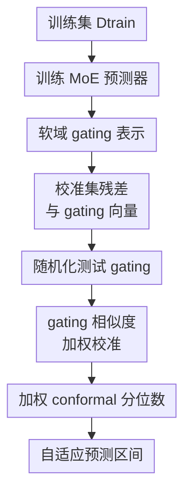

# Adaptive Conformal Prediction via Mixture-of-Experts Gating Similarity

**会议**: ICLR2026  
**OpenReview**: [https://openreview.net/forum?id=vCmnu4q8C3](https://openreview.net/forum?id=vCmnu4q8C3)  
**代码**: 待确认  
**领域**: 学习理论 / 不确定性估计  
**关键词**: 保形预测, Mixture-of-Experts, 不确定性估计, 加权校准, 潜在域自适应

## 一句话总结
这篇论文提出 MoE-CP，把 Mixture-of-Experts 的 gating 概率当作软域归属，用 gating 相似度给校准残差加权，从而在保持保形预测边际覆盖保证的同时，让预测区间随潜在子群体的噪声与残差分布自适应变宽或变窄。

## 研究背景与动机
**领域现状**：保形预测（conformal prediction, CP）的核心吸引力在于分布无关的覆盖保证：只要训练、校准和测试样本满足交换性，就可以用校准集上的 nonconformity score 分位数构造预测区间，使新样本标签以至少 $1-\alpha$ 的概率落入区间。标准 split conformal prediction 通常把所有校准残差放在一起取一个全局分位数，因此实现简单、理论干净，也已经被广泛用于回归不确定性估计。

**现有痛点**：真实数据往往不是一个均质总体。医疗场景里不同医院、不同病人群体的噪声不同；自动驾驶或传感器数据里，不同天气、道路和模态会带来不同误差模式；多模态或大模型系统中，数据还可能隐含多个没有显式标签的子域。标准 CP 只保证平均意义上的覆盖，可能在低噪声域给出过宽区间，在高噪声域又给出过窄区间。换句话说，它在总体上看似合格，但对具体子群体并不一定可靠。

**核心矛盾**：想要更接近条件覆盖，就应该让测试点主要参考“和自己处在同一残差机制下”的校准样本；但严格的条件覆盖在无假设情形下不可得，而且很多数据根本没有可用的域标签。已有 localized conformal prediction 可以按原始特征空间距离给校准点加权，但高维特征里大量维度可能与误差机制无关，欧氏近邻不一定等价于“同一个预测难度或同一个潜在域”。

**本文目标**：作者希望解决三个相互缠在一起的问题：第一，在没有显式域标签时识别潜在子群体；第二，把这种软域结构转化为校准残差的权重，让区间随局部误差分布变化；第三，不能为了自适应牺牲 conformal prediction 最重要的覆盖保证。

**切入角度**：论文观察到 Mixture-of-Experts（MoE）模型天然会把输入分配给不同专家，gating network 输出的概率向量 $\pi(x)$ 可以解释为样本属于各个潜在专家/域的软归属。相比直接在原始特征空间里算距离，gating 概率来自预测模型内部，对任务误差和专家分工更敏感，因此更适合作为“哪些校准样本与测试样本同类”的度量。

**核心 idea**：用 MoE 的 gating 概率向量替代显式域标签或原始特征距离，在 gating 空间里对校准残差做相似度加权，构造既有边际有效性又能适应潜在异质域的保形预测区间。

## 方法详解
### 整体框架
MoE-CP 先在训练集上训练一个 MoE 回归器，让每个输入同时得到点预测 $\hat{\mu}(x)$ 和 gating 概率 $\pi(x)$。随后在校准集上计算绝对残差，并在测试时把测试点的 gating 概率与每个校准点的 gating 概率比较：越接近的校准点，其残差在加权分位数中占比越高。最终区间仍然是以点预测为中心、以加权 conformal 分位数为半径的预测区间。

从实现上看，MoE-CP 的 conformal score 在主实验中采用最直接的绝对残差 $S_i=|Y_i-\hat{\mu}(X_i)|$，但框架并不绑定这一种 score。只要把 residual score 换成 conformalized quantile score 或 distributional conformity score，gating 加权这层仍然可以保留。论文的理论与实验重点则放在最清晰的回归区间版本上。

### 关键设计
**1. 软域 gating 表示：用 MoE 内部路由替代人工域标签**

MoE 模型包含 $K$ 个专家函数 $\mu_k(x)$ 和一个 gating network。对输入 $x$，gating network 输出 logits $\ell_k(x)$，再通过 softmax 得到专家概率

$$
\pi_k(x)=\frac{\exp(\ell_k(x))}{\sum_{j=1}^{K}\exp(\ell_j(x))},\quad \sum_{k=1}^{K}\pi_k(x)=1.
$$

最终点预测是专家输出的加权平均：$\hat{\mu}(x)=\sum_{k=1}^{K}\pi_k(x)\mu_k(x)$。这里的关键不是 MoE 本身能拟合复杂函数，而是 $\pi(x)$ 给每个样本附带了一个可解释的软域坐标：如果两个样本都强烈路由到同一批专家，它们很可能处在相似的残差机制下；如果 routing 分布差异很大，就不应该让它们在 conformal 校准里拥有同等影响力。

这个设计把“域识别”从外部标注问题变成了模型内部表示问题。传统按已知 group 做 Mondrian conformal 或 group-conditional calibration，需要先知道域标签；localized CP 按原始特征距离找邻居，又可能被无关维度稀释。MoE gating 处在两者之间：它不是硬标签，而是连续概率向量；它也不是原始输入距离，而是由预测任务训练出来的 latent regime 表示。

**2. 随机化测试 gating：为局部加权保留 conformal 有效性**

如果直接用测试点的确定性 gating 向量 $\pi(X_{n+1})$ 给校准点加权，直觉上很自然，但理论上不一定自动满足 weighted conformal 所需的对称性。论文借鉴 randomized localized conformal prediction 的思想，对测试点 gating 做一次多项分布随机化：

$$
\tilde{L}\sim \mathrm{Multinomial}(\tau,\pi(X_{n+1})),\quad \tilde{\pi}(X_{n+1})=\frac{\tilde{L}}{\tau}.
$$

温度参数 $\tau$ 控制随机化强度。$\tau$ 小时，采样噪声更大，权重更接近保守、分散的局部化；$\tau$ 大时，$\tilde{\pi}$ 更接近原始 $\pi$，方法更相信 MoE 学到的域结构。论文特别指出两个极端：$\tau\to 0$ 时近似退化为普通 split CP 的均匀权重；$\tau\to\infty$ 时权重会过度集中，甚至导致有效校准样本数过小、区间变宽。

这一步的价值在于，它不是为了增加随机性而随机，而是为了让“测试点可能是谁”在交换性证明里有一个可处理的概率形式。对于 KL divergence 或 cross-entropy 权重，条件在 $\tilde{\pi}(X_{n+1})$ 上时，某个样本成为测试点的后验概率正好可以写成归一化权重，这使得 weighted conformal 的覆盖证明能够接上。

**3. gating 相似度加权校准：让残差分位数跟着潜在域移动**

有了校准点 gating $\pi(X_i)$ 和随机化测试 gating $\tilde{\pi}(X_{n+1})$ 后，MoE-CP 用概率向量之间的 divergence 定义权重：

$$
w_i=\exp\{-\tau D(\tilde{\pi}(X_{n+1}),\pi(X_i))\},
$$

再在 $n$ 个校准点和测试点自身的 $+\infty$ 占位质量之间归一化：

$$
\tilde{w}_i=\frac{w_i}{\sum_{j=1}^{n+1}w_j}.
$$

如果某个校准点的 gating 分布接近测试点，它的 divergence 小、权重大；如果它被 MoE 分配到完全不同的专家组合，它对测试点区间的影响就会被压低。最后构造加权经验分布 $\sum_{i=1}^{n}\tilde{w}_i\delta_{S_i}+\tilde{w}_{n+1}\delta_{+\infty}$，取其中的 $(1-\alpha)$ 分位数 $Q_{1-\alpha}$，预测区间为

$$
\hat{C}^{\mathrm{MoE}}_n(X_{n+1})=\{y\in\mathbb{R}: |y-\hat{\mu}(X_{n+1})|\le Q_{1-\alpha}\}.
$$

这使区间长度能随 latent domain 的误差尺度变化：低噪声子域主要参考低残差校准点，区间更短；高噪声子域主要参考高残差校准点，区间更宽。相比 PCP 这类需要为候选 $y$ 反复拟合或更新混合模型的做法，MoE-CP 的 gating network 只训练一次，测试时只需计算一次 gating forward 和 $O(n)$ 个 divergence，因此校准阶段更轻。

**4. 有效性与条件自适应分析：把保证分成“底线有效”和“接近条件覆盖”两层**

理论部分先给出最重要的底线：在样本交换、使用 KL divergence 或 cross-entropy divergence 的情况下，MoE-CP 条件在随机化 gating 上满足

$$
\mathbb{P}\{Y_{n+1}\in \hat{C}^{\mathrm{MoE}}_n(X_{n+1})\mid \tilde{\pi}(X_{n+1})\}\ge 1-\alpha,
$$

因此边际化后仍有标准 conformal coverage。KL 与 cross-entropy 在归一化后给出相同权重，因为两者只差与校准点无关的熵项。对于 Jeffreys、Hellinger、Euclidean、Cosine 等其他 divergence，论文证明在与 KL 共享唯一最小点、且非一致性分数连续等条件下，可以得到 $1-\alpha+o(1)$ 的渐近有效性。

另一层分析解释为什么这种加权能更接近条件覆盖。若 nonconformity score 的条件分布可以表示成潜在域混合 $S_i\mid X_i\sim\sum_{k=1}^{K}\pi_k^*(X_i)f_k^*$，并且真实 gating 概率可得，那么条件在 $X_{n+1}$ 上的覆盖等价于条件在 $\pi^*(X_{n+1})$ 上的覆盖。实际中 MoE 学到的是 $\hat{\pi}$，所以结论不是无条件承诺精确条件覆盖，而是说：MoE 越能捕捉真实域结构，MoE-CP 越接近按域自适应校准。

### 一个完整示例
假设一个回归任务中隐含三个子域：线性低噪声域、二次中噪声域和三次高波动域。普通 split CP 会把所有校准残差混在一起，例如得到一个全局半径 12；对线性域样本来说这可能太宽，对高波动域样本来说又可能仍不够稳。

MoE-CP 的流程会不同。对一个测试点 $x_*$，MoE gating 可能输出 $\pi(x_*)=(0.05,0.10,0.85)$，说明模型认为它主要属于第三个专家负责的高波动子域。随机化后得到的 $\tilde{\pi}(x_*)$ 仍大致集中在第三个专家，于是校准集中 gating 类似 $(0.02,0.15,0.83)$、$(0.10,0.05,0.85)$ 的样本残差会被赋予高权重，而 $(0.90,0.05,0.05)$ 这类线性域样本即使数量很多，也不会主导分位数。最终加权分位数可能给出较宽半径 18。

换一个测试点，若 $\pi(x_*)=(0.88,0.08,0.04)$，它主要参考线性低噪声域的校准残差，半径可能只有 6。两者的目标覆盖水平均是 $1-\alpha$，区别在于区间宽度不再由全局平均噪声决定，而是由测试点在 MoE gating 空间里的软邻域决定。

### 损失函数 / 训练策略
MoE 预测器在训练集 $D_{\mathrm{train}}$ 上端到端训练，专家网络和 gating network 共同优化回归损失，论文实现中使用均方误差类目标。合成实验使用 $K=3$、$\tau=150$，专家和 gate 都是三层隐藏层大小为 $(32,32,32)$ 的前馈网络，dropout 为 0.1，最多训练 600 epochs。真实数据实验使用 $K=2$、$\tau=100$，隐藏层大小为 $(64,64,64)$，最多训练 2000 epochs。

超参数选择上，作者建议默认使用 KL divergence，因为它在理论上给出精确边际有效性，实验上也稳定。专家数 $K$ 需要结合样本量：校准样本较少时用 $K=2$ 或 $K=3$，否则每个专家分到的有效样本太少会让区间变宽；样本量足够大时可增大 $K$ 或用稀疏正则自动剪枝。温度 $\tau$ 推荐在 $100$ 到 $300$ 之间，兼顾域自适应和有效校准样本数。

## 实验关键数据

### 主实验
论文做了合成数据和两个真实数据集实验。合成数据由三个函数域混合生成：$Y=X+\epsilon$、$Y=X^2+\epsilon$、$Y=X^3+\epsilon$，并测试不平衡比例 $(0.2,0.3,0.5)$ 与平衡比例 $(1/3,1/3,1/3)$ 两种设置。真实数据包括 Bike-sharing 和 Temperature，训练、校准、测试各取 $n=1500$，目标误覆盖率为 $\alpha=0.1$。

| 数据集 / 设置 | 指标 | MoECP | 对比方法整体表现 | 结论 |
|--------|------|------|----------|------|
| 合成数据，不平衡三域 | Marginal coverage | 达到约 $0.90$ | 所有方法基本满足覆盖，PCP 更保守 | MoECP 保持目标覆盖 |
| 合成数据，不平衡三域 | Interval length | 最短 | SCP+CC、RLCP、PCP 明显更宽，CQR/CHR 接近但局部适应差 | MoECP 在覆盖相同前提下效率最好 |
| 合成数据，平衡三域 | Marginal / local coverage | 可靠且接近目标 | 对比方法总体覆盖合格，但局部区域波动更明显 | 域比例变化后 MoECP 仍稳定 |
| Bike-sharing | Marginal coverage / worst-slice coverage | 均接近 $0.90$ | RLCP、PCP 略保守，其余接近名义覆盖 | MoECP 没有牺牲可靠性 |
| Bike-sharing | Interval length | 最短，约在 $1.0$ 附近 | 多数方法更宽 | 对异质真实数据更高效 |
| Temperature | Marginal coverage / worst-slice coverage | 均接近 $0.90$ | 各方法 worst-slice coverage 约 $0.90$ | 条件覆盖近似表现合格 |
| Temperature | Interval length | 最短，约在 $1.0$ 到 $1.1$ 区间 | 对比方法区间更长 | MoE gating 加权提升区间效率 |

更直观的合成图显示，在 $X\in[-3,-2]\cup[2,3]$ 这类域变化剧烈的区域，CQR 和 CHR 虽然平均长度不差，但区间没有充分跟随 domain shift；SCP+CC、RLCP、PCP 则偏宽。MoECP 的局部覆盖更贴近名义水平，预测区间也能在不同区域自动调整宽窄。

### 消融实验
| 配置 | 关键指标 | 说明 |
|------|---------|------|
| Divergence: KL / Renyi / Jeffreys / Hellinger / Euclidean / Cosine | Marginal coverage 均接近 $0.90$ | 不同相似度选择下覆盖率稳定，说明框架不依赖某个脆弱距离 |
| Divergence: 多种选择 | Interval length 变化较小 | KL 有最强理论保证，其他 divergence 主要影响效率细节 |
| Temperature $\tau=50$ 到 $300$ | Coverage 和 worst-slice coverage 稳定 | 温度不是敏感旋钮，实验中区间长度只随 $\tau$ 略有上升 |
| Experts $K=2,3,4,5$ | 样本量小时 $K$ 小区间更短 | $K$ 大会降低每个专家的有效校准样本数，样本少时容易变宽 |
| 训练/校准样本量 $500$ 到 $2500$ | Interval length 随样本量增加下降 | 样本越多，每个潜在域的校准残差越充分，加权分位数更稳定 |
| Multinomial sampling 重复 500 次 | 变异度指标 $D(\tau)$ 稳定且很小 | 随机化 gating 没有让区间宽度出现明显不稳定 |

### 关键发现
- MoECP 的主要优势不是“覆盖率更高”，因为保形预测方法本来都应该接近名义覆盖；它的优势是用更短、更随域变化的区间达到同样覆盖目标。
- gating 相似度比原始特征距离更贴合残差机制，尤其在合成三域中能看出：当函数形态和噪声区域变化时，MoECP 的局部覆盖曲线更接近 $0.90$。
- 消融显示 KL divergence 是推荐默认值，但不是唯一可用选择；温度在 $50$ 到 $300$ 范围内鲁棒，专家数则更依赖样本量。
- MoECP 的计算开销主要在 MoE 训练阶段，论文报告真实数据上总运行时间约 $153$ 到 $156$ 秒，和 CHR、PCP 同量级；校准和测试阶段只需一次 gate forward 加 $O(n)$ divergence 计算。

## 亮点与洞察
- 把 MoE gating 概率解释为 latent domain coordinate 是这篇论文最自然也最有效的连接点。它让“不知道域标签但又想做域自适应 conformal calibration”这个问题变得可操作。
- 论文没有直接追求不可实现的精确条件覆盖，而是保留 conformal 的边际有效性底线，再用 gating similarity 提升条件层面的适应性。这个取舍比较务实，也符合保形预测理论中的限制。
- 随机化 gating 是方法里最容易被忽略但很关键的一步。它把直觉上的局部加权变成了可证明的 weighted conformal 机制，尤其解释了为什么 KL 和 cross-entropy 有特殊地位。
- 这个思路可以迁移到很多带路由或专家分工的模型：例如多任务学习中的 task router、多模态模型中的 modality router、时间序列中的 regime-switching MoE，都可以把 routing 表示作为 conformal calibration 的相似度空间。
- 相比在原始高维输入上找近邻，gating 空间通常维度只有 $K$，还被监督信号塑造过，因此既更紧凑，也更容易解释哪个专家或潜在域导致区间变宽。

## 局限与展望
- 方法依赖 MoE gating 是否真的捕捉了与残差分布相关的潜在域。如果 gate 学到的只是预测均值上的粗分工，而不是不确定性或噪声机制，区间自适应就可能不明显。
- 当前理论的精确有限样本保证主要给 KL / cross-entropy 权重；其他 divergence 的有效性需要渐近条件。实践中虽然鲁棒，但理论层面仍有分层。
- 论文实验规模相对中等，真实数据只覆盖两个表格型回归数据集。对于大规模稀疏 MoE、LLM MoE 或高维多模态系统，训练稳定性、专家塌缩、gate 校准误差都会更复杂。
- 方法假设观测样本来自一个可交换总体，并在结论中也承认扩展到已知域标签、非交换数据或更一般分布漂移仍是未来工作。
- 当前主实验使用绝对残差 score，尚未系统验证与 conformalized quantile regression、分布式 score 或分类预测集 score 结合后的表现。后续可以把 MoE-CP 作为一层通用加权校准器，接到更丰富的 conformity score 上。

## 相关工作与启发
- **vs 标准 split conformal prediction**: 标准 CP 用全体校准残差的统一分位数，优点是简单和分布无关，缺点是只保证边际覆盖。MoE-CP 保留 conformal 分位数框架，但用 gating 相似度让不同测试点看到不同的校准残差分布。
- **vs Mondrian / group-conditional conformal**: group-conditional 方法按已知属性或标签分组校准，适合域标签明确的场景。MoE-CP 面向域标签不可见的情形，用软 gating 概率替代硬 group id，也避免了硬切分导致的小样本问题。
- **vs localized conformal prediction / RLCP**: localized CP 按输入特征距离加权，能做局部适应，但高维输入空间的距离未必反映残差机制。MoE-CP 在 learned gating space 中加权，维度更低且更贴近模型内部的专家分工。
- **vs posterior conformal prediction (PCP)**: PCP 通过 conformity score 的混合模型获得局部权重，但可能需要对候选 $y$ 重复拟合或更新，计算更重。MoE-CP 训练一次 MoE 后即可复用 gating，测试时只计算相似度和加权分位数。
- **vs conformalized quantile regression (CQR)**: CQR 通过分位数回归学习异方差区间，通常比均值回归 CP 更自适应。MoE-CP 即使用均值残差 score，在实验中也能通过 gating 权重获得很强适应性；未来两者还可以结合，用 MoE quantile experts 产生更强的 score。

## 评分
- 新颖性: ⭐⭐⭐⭐ MoE gating 与 weighted conformal 的连接很顺，但把随机化局部加权、潜在域解释和理论保证组合起来有清晰贡献。
- 实验充分度: ⭐⭐⭐⭐ 有合成域、真实数据和超参消融，能支撑主张；但大规模多模态或真实 MoE 应用还没有展开。
- 写作质量: ⭐⭐⭐⭐ 方法动机清楚，理论与算法对应较好；部分公式和附录符号有小瑕疵，需要读者自己对齐。
- 价值: ⭐⭐⭐⭐ 对不确定性估计、异质数据校准和带路由模型的可靠性评估都很有启发，尤其适合作为局部 conformal calibration 的通用插件。

<!-- RELATED:START -->

## 相关论文

- [\[ICLR 2026\] Conformal Prediction for Long-Tailed Classification](conformal_prediction_for_long-tailed_classification.md)
- [\[ICML 2026\] Enhancing Conformal Prediction via Class Similarity](../../ICML2026/learning_theory/enhancing_conformal_prediction_via_class_similarity.md)
- [\[ICLR 2026\] Distribution-informed Online Conformal Prediction](distribution-informed_online_conformal_prediction.md)
- [\[ICLR 2026\] Softmax is not Enough (for Adaptive Conformal Classification)](softmax_is_not_enough_for_adaptive_conformal_classification.md)
- [\[ICLR 2026\] Conformal Prediction with Corrupted Labels: Uncertain Imputation and Robust Re-weighting](conformal_prediction_with_corrupted_labels_uncertain_imputation_and_robust_re-we.md)

<!-- RELATED:END -->
