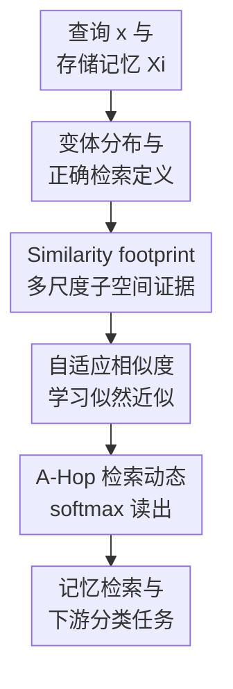

# Adaptive Hopfield Network: Rethinking Similarities in Associative Memory

**会议**: ICLR2026  
**OpenReview**: [https://openreview.net/forum?id=HKSp4U69dy](https://openreview.net/forum?id=HKSp4U69dy)  
**代码**: https://anonymous.4open.science/r/Adaptive-Hopfield-Network-C137/  
**领域**: 学习理论 / 关联记忆 / Hopfield 网络  
**关键词**: 关联记忆、Hopfield 网络、自适应相似度、变体分布、正确检索  

## 一句话总结
这篇论文把关联记忆检索从“离某个存储模式足够近”重新定义为“找到最可能生成当前查询的记忆来源”，并用可学习的 similarity footprint 构造自适应 Hopfield 网络 A-Hop，在混合噪声、遮挡、偏置和多类分类任务上显著优于固定相似度的 Hopfield 变体。

## 研究背景与动机
**领域现状**：Hopfield 网络是典型的内容寻址记忆系统：系统存储一组模式 $\Xi=[\xi_1,\ldots,\xi_N]$，给定一个带噪或残缺的查询 $x$，模型通过相似度打分、分离函数和读出步骤返回一个记忆模式。现代 Hopfield 网络进一步和 attention 机制建立联系，用内积相似度和 softmax 分离函数把检索写成 $T(x)=\Xi\operatorname{softmax}(\Xi^\top x)$，后续工作又引入 sparsemax、kernel modulation 等方式提升容量或稀疏性。

**现有痛点**：已有理论常用 $\epsilon$-retrieval 评价检索是否成功，也就是检索结果 $y$ 是否靠近某个存储模式 $\xi$。这个标准能说明结果落在记忆集合附近，却不能说明它是“正确的那一个”。如果查询 $x$ 是某个记忆在特定上下文下生成的变体，那么正确答案应该是最可能生成 $x$ 的源记忆，而不一定是欧氏距离或内积上最近的记忆。

**核心矛盾**：问题的根源在于“相似”本身是上下文相关的。论文举了一个直观例子：click 可以在语义上接近 tap，在发音上接近 clique，在拼写上接近 clock。固定的内积或欧氏距离相当于预先规定了唯一的相似性，却无法知道当前任务需要语义、声音、形状、遮挡鲁棒性还是偏置校正。

**本文目标**：作者希望先给出一个更严格的正确检索定义，再设计一种能从上下文样本中学习相似性的 Hopfield 网络。具体来说，它要回答三个问题：查询如何由存储记忆生成；什么叫检索到正确来源；在不知道真实生成分布解析式的情况下，模型如何逼近这个来源判别。

**切入角度**：论文把查询看作某个存储模式 $\xi_k$ 的生成变体，并引入变体分布 $V(\Xi)$ 描述 $(\xi,x)$ 的联合分布。这样，正确检索不再是“离谁近”，而是“谁最大化后验 $p_V(\xi\mid x)$”。在先验均匀或可估计时，这进一步转化为比较似然 $p_V(x\mid \xi)$。

**核心 idea**：用可学习的自适应相似度去近似未知的生成似然 $p_V(x\mid\xi)$，再把这个相似度接入 Hopfield 检索动态，从而让关联记忆面向正确来源而不是固定几何距离进行检索。

## 方法详解

### 整体框架
A-Hop 的整体逻辑可以分成两层：理论层先用变体分布定义“正确检索”，模型层再用 similarity footprint 从查询和记忆的各维子空间关系中提取证据，学习一个能适配当前变体类型的相似度函数。最终，A-Hop 仍保留 Hopfield 网络“相似度打分 → 分离函数 → 读出”的可解释框架，但把固定的 $\xi^\top x$ 替换成了由样本训练出来的 $s(\xi,x)$。

从输入输出看，模型输入是一组存储模式 $\Xi$ 和一个查询 $x$，输出是加权读出的记忆表示 $y$。与现代 Hopfield 网络的关键差别不在分离函数，而在相似度：A-Hop 对每个候选记忆 $\xi_k$ 计算多种 base similarity 的 footprint，再通过可学习权重组合成 logits，最后用 softmax 得到每个记忆是查询来源的预测概率。

### 关键设计
**1. 变体分布与正确检索：把“近邻”改写成“最可能的来源”**

传统 $\epsilon$-retrieval 只检查 $\|y-\xi\|_2\leq\epsilon$，容易把“检索到某个合法记忆”误当成“检索到正确记忆”。本文的第一个关键设计是把查询 $x$ 建模为某个存储模式 $\xi$ 在上下文机制下生成的变体，并用 $V(\Xi)$ 表示 $(\xi,x)$ 的联合分布。于是，正确检索要求检索结果最近的存储模式等于后验最大的来源：$\arg\min_{\xi'\in\Xi}\|y-\xi'\|_2=\arg\max_{\xi'\in\Xi}p_V(\xi'\mid x)$。

这个定义的好处是把“相似度应该是什么”推回到生成机制本身。由贝叶斯分解可得，在先验 $p_V(\xi)$ 均匀或容易估计时，比较 $p_V(\xi\mid x)$ 基本等价于比较 $p_V(x\mid\xi)$。因此，理想相似度不应该固定为内积或欧氏距离，而应该模仿“给定这个记忆，它生成当前查询的可能性”。论文进一步用 noisy、masked、biased 三类变体说明：不同上下文下的似然形状完全不同，固定相似度不可能同时处理好这些场景。

**2. Similarity footprint：用子空间证据替代单一标量相似度**

真实的 $p_V(x\mid\xi)$ 通常未知，论文用 similarity footprint 构造可学习的替代证据。给定一个可分解的 base similarity，例如负平方欧氏距离或点积，先计算每一维的相似度 $q_i=\operatorname{sim}(\xi_i,x_i)$，再把这些维度相似度按从大到小排序为 $\tilde q$，最后取累积和得到一个 $d$ 维向量 $\operatorname{ftpt}_{\operatorname{sim}}(\xi,x)=U\tilde q$。

这个 footprint 的直觉很清楚：单一内积只能告诉模型“整体像不像”，但不知道哪些维度可信、哪些维度被遮挡或污染。排序后的 $k$-optimal similarity 相当于问“如果只看最一致的 $k$ 个维度，$x$ 和 $\xi$ 有多像”。当查询存在遮挡时，受损维度会自然落到排序尾部；当查询有噪声时，模型可以学习看更全局的维度组合；当存在偏置时，权重和 base similarity 的组合可以学习偏置后的匹配规律。这样，A-Hop 用一个向量描述多尺度关系，而不是用一个标量提前把所有证据压扁。

**3. 自适应相似度与 A-Hop：学习哪些 footprint 维度最可靠**

有了 footprint 后，论文把相似度写成可学习的线性组合 $s_{\operatorname{sim}}(\xi,x)=w^\top\operatorname{ftpt}_{\operatorname{sim}}(\xi,x)$。主模型同时使用负平方距离 footprint 和点积 footprint，并用可学习标量 $\beta_{\operatorname{dis}},\beta_{\operatorname{dot}}$ 聚合：$s(\xi,x)=\beta_{\operatorname{dis}}s_{\operatorname{dis}}(\xi,x)+\beta_{\operatorname{dot}}s_{\operatorname{dot}}(\xi,x)$。这个设计刻意保持参数量小，只让模型学习“哪些子空间尺度更可信”和“哪种 base similarity 更适合当前上下文”。

接入 Hopfield 网络后，A-Hop 的检索动态是 $y=T(x)=\Xi\operatorname{softmax}(s(\Xi,x))$。训练时，作者从变体分布中采样 $(\xi_k,x)$，把 softmax 后第 $k$ 个概率看作模型预测的 $\tilde p_V(x\mid\xi_k)$，并最小化交叉熵式损失 $\mathcal L=\mathbb E_{(\xi_k,x)\sim V(\Xi)}[-\log \tilde p_V(x\mid\xi_k)]$。这让 A-Hop 不必知道变体类型的解析式，只要能看到同一上下文下的样本，就能把相似度调到更接近真实来源判别。

**4. 理论保证与能量函数：保留 Hopfield 的可解释动态**

论文没有只停留在经验 trick，而是证明 A-Hop 在三类经典变体上可以达到 optimal correct retrieval。对 noisy variant，理想相似度退化为带方差权重的负距离；对 masked variant，排序和 footprint 能把未损坏维度放在前面，并用特定权重忽略尾部损坏维度；对 biased variant，模型可以学习偏置向量对应的相似性校正。这个理论结果说明 footprint 不是任意特征工程，而是从正确检索定义推出来的近似工具。

同时，论文还给出能量函数 $E(x)=-\operatorname{lse}(s(\Xi,x))$ 的分析。在 isotropic noisy 和 biased 变体下，配合特定形式的统一相似度，能量沿离散检索过程单调下降、收敛且有下界。这里的意义在于：A-Hop 虽然改变了相似度定义，但没有完全丢掉 Hopfield 网络作为能量模型的解释性。它仍然可以被理解为在一个由自适应相似度塑造的能量景观中做检索。

### 一个完整示例
假设存储记忆里有两张 16×16 的像素图案，查询 $x$ 是第一张图案经过遮挡和噪声污染后的版本。固定负欧氏距离会把所有维度一视同仁：遮挡区域的巨大差异和未遮挡区域的真实匹配混在一起，可能导致第二张图案在整体距离上看起来更近。

A-Hop 的处理方式不同。它先对第一张候选记忆和查询逐维计算 $q_i=-(\xi_i-x_i)^2$，再排序得到 $\tilde q$。未遮挡、噪声较小的维度会排在前面，被遮挡或严重污染的维度排在后面。若当前训练样本显示“遮挡是主要变体”，学习到的 $w$ 就会更重视前若干个累积 footprint，等价于让模型主要根据可信子空间判断来源。这样，即使全局距离受到遮挡干扰，第一张图案仍能得到更高的自适应相似度。

如果场景换成全局亮度偏移，模型会学习另一套权重和 base similarity 组合：不再简单惩罚每一维都发生一致偏移，而是把这种系统性偏置当作可解释的生成过程。这也解释了为什么同一个 A-Hop 框架能覆盖 noisy、masked、biased 及其混合版本。

### 损失函数 / 训练策略
A-Hop 的核心训练目标是让相似度输出的 softmax 分布接近真实来源标签。对每个从变体分布采样的样本 $(\xi_k,x)$，模型计算所有候选记忆的 logits $s(\Xi,x)$，并用第 $k$ 个 softmax 概率作为“$x$ 来自 $\xi_k$”的预测概率：$\tilde p_V(x\mid\xi_k)=\operatorname{softmax}(s(\Xi,x))_k$。

训练损失为 $\mathcal L(\Xi,V)=\mathbb E_{(\xi_k,x)\sim V(\Xi)}[-\log \tilde p_V(x\mid\xi_k)]$。在 memory retrieval 实验中，作者用 Adam 训练 200 epochs，学习率为 0.1；在下游分类任务中，A-Hop 被嵌入分类网络，相关权重直接由分类损失更新。论文还在附录中讨论了 similarity footprint 的效率：排序使单次相似度复杂度从固定相似度的 $O(d)$ 变为 $O(d\log d)$，但 GPU 实测推理只慢约 15% 到 30%。

## 实验关键数据

### 主实验
论文覆盖四类任务：合成与 MNIST 记忆检索、表格分类、图像分类、多实例学习。最能说明问题的是高强度混合变体检索：当遮挡、噪声、偏置同时存在时，固定相似度的 Hopfield 变体明显崩塌，而 A-Hop 仍能保持更高的正确检索率。

| 数据集 / 设置 | 指标 | A-Hop | 最强 Hopfield 基线 | 提升 |
|--------|------|------|----------|------|
| Synthetic, difficulty 0.4 | Accuracy ↑ | 0.724±0.02 | 0.521±0.02 (U2-Hop) | +0.203 |
| Synthetic, difficulty 0.5 | Accuracy ↑ | 0.360±0.02 | 0.195±0.03 (M-Hop / U2-Hop) | +0.165 |
| MNIST, difficulty 0.6 | Accuracy ↑ | 0.939±0.01 | 0.878±0.01 (U2-Hop) | +0.061 |
| MNIST, difficulty 0.7 | Accuracy ↑ | 0.849±0.01 | 0.661±0.02 (M-Hop) | +0.188 |
| Synthetic, difficulty 0.4 | Error ↓ | 0.106±0.01 | 0.176±0.01 (M-Hop / U2-Hop) | -0.070 |
| MNIST, difficulty 0.7 | Error ↓ | 0.015±0.01 | 0.068±0.00 (M-Hop / U2-Hop) | -0.053 |

表格分类中，A-Hop 作为 memory-based classifier 也稳定优于 M-Hop 和 U2-Hop，并接近树模型和 XGBoost。尤其在 Adult 和 Heart 上，A-Hop 相对其他关联记忆模型的差距很大，说明异构表格特征里“哪些维度可信”本身就是需要学习的。

| 数据集 | 指标 | A-Hop | M-Hop | U2-Hop | 备注 |
|--------|------|------|------|--------|------|
| Adult | Accuracy ↑ | 0.8634±0.002 | 0.8080±0.001 | 0.8172±0.003 | 接近 XGBoost 0.8640 |
| Bank | Accuracy ↑ | 0.9139±0.002 | 0.9085±0.003 | 0.9092±0.002 | 略低于 XGBoost 0.9152 |
| Vaccine | Accuracy / AUC ↑ | 0.8042±0.002 | 0.7975±0.001 | 0.7971±0.003 | 高于 XGBoost 0.8034 |
| Purchase | Accuracy ↑ | 0.9007±0.001 | 0.8822±0.001 | 0.8825±0.002 | 接近 XGBoost 0.9032 |
| Heart | Accuracy / AUC ↑ | 0.7315±0.002 | 0.6325±0.002 | 0.6473±0.002 | 明显优于关联记忆基线 |

### 消融实验
消融主要验证 footprint 的结构是否真的重要。第一组实验比较是否排序 $q$ 以及是否使用三角矩阵 $U$；结果显示二者一起使用最好，说明“按可信维度排序”和“累积子空间证据”都不是可有可无。

| 配置 | Synthetic d=0.4 Accuracy ↑ | Synthetic d=0.4 Error ↓ | Synthetic d=0.5 Accuracy ↑ | 说明 |
|------|---------|---------|---------|------|
| 不排序，不用 $U$ | 0.5172±0.034 | 0.1900±0.017 | 0.2094±0.022 | 接近普通逐维相似度 |
| 不排序，用 $U$ | 0.5444±0.007 | 0.1665±0.007 | 0.1888±0.015 | 只有累积但缺少可信维度重排 |
| 排序，不用 $U$ | 0.6928±0.034 | 0.1173±0.010 | 0.3374±0.025 | 排序本身已经很关键 |
| 排序，用 $U$ | 0.7280±0.034 | 0.1033±0.011 | 0.3634±0.040 | 完整 footprint 最好 |

另一组实验比较不同 base similarity footprint。单独使用距离或点积都能超过传统 Hopfield，但两者组合最好，支持论文关于“不同 base similarity 像不同基向量，组合后适应性更强”的解释。

| 使用 ftptdis | 使用 ftptdot | Synthetic d=0.4 Accuracy ↑ | Synthetic d=0.5 Accuracy ↑ | 说明 |
|------|------|---------|---------|------|
| 否 | 是 | 0.5926±0.016 | 0.2520±0.027 | 点积 footprint 有效但较弱 |
| 是 | 否 | 0.6458±0.042 | 0.3286±0.023 | 距离 footprint 更适合混合变体 |
| 是 | 是 | 0.7242±0.016 | 0.3600±0.024 | 双 footprint 聚合最好 |

### 关键发现
- A-Hop 的最大优势出现在 masked 和 biased 成分明显的场景，因为固定距离无法区分“这个维度不相关/被遮挡”和“这个维度真的说明不是同一来源”。
- 在 Synthetic 和 MNIST 的高难度混合变体上，A-Hop 同时提升 accuracy 并降低 error，说明它不是只把 softmax 权重变尖，而是真正更接近正确来源。
- 消融显示排序比单纯使用三角累积更重要，但完整 footprint 最稳；这与论文的解释一致：先把可信维度排到前面，再让权重决定看多少维。
- 在图像分类和多实例学习中，A-Hop 的绝对提升较小，但在所有数据集上都优于对应 Hopfield 变体，说明它可以作为通用可微 memory layer 嵌入更大模型。
- 附录的多模态检索实验里，A-Hop + A-Hop 在 1024 concepts 时仍有 0.988 accuracy，而其他组合明显随概念数增加而衰减，进一步支持其跨表示空间的检索鲁棒性。

## 亮点与洞察
- 最大亮点是把关联记忆的评价标准从几何邻近推进到概率来源判别。这个视角非常重要，因为它解释了为什么一些“看起来合理”的固定相似度在遮挡、偏置、异构特征里会系统性失败。
- Similarity footprint 是一个简洁但有力度的设计：它没有训练一个大 MLP 去吞掉 $(\xi,x)$，而是保留 Hopfield 相似度可解释性，只增加“排序后的多尺度子空间证据”。这让方法既有理论分析空间，也有较低参数成本。
- 论文把 noisy、masked、biased 三类变体统一到同一个正确检索框架下，读起来比单纯报性能更有说服力。尤其 masked variant 的分析说明，正确相似度有时需要主动忽略一部分维度，而不是对所有维度平均惩罚。
- 对 attention 和 memory layer 的启发很直接：如果 query-key similarity 固定为 dot product，那么模型默认所有任务共享同一种匹配语义；A-Hop 提示我们可以让 similarity 自身成为可学习、可解释、由上下文样本约束的对象。
- 这篇论文也提醒下游原型分类、检索增强和多模态对齐任务：检索失败未必来自记忆容量不足，可能来自相似度定义不对。先明确“query 是怎样的 variant”，再设计相似度，可能比盲目扩大记忆库更有效。

## 局限与展望
- 论文的理论最强保证集中在 noisy、masked、biased 三类相对规范的变体上。真实任务中的变体分布可能同时包含非线性变换、语义漂移、类别不均衡和样本依赖的局部规则，线性 footprint 权重是否足够表达仍需要更多验证。
- A-Hop 需要来自当前变体分布的训练样本。如果部署场景的变体机制不断变化，或者只有极少标注来源样本，模型可能学不到稳定的自适应相似度。未来可以考虑元学习、在线更新或无监督估计 variant distribution。
- 排序 footprint 虽然在实测中开销不大，但时间复杂度仍从 $O(Nd)$ 变为 $O(Nd\log d)$。当记忆库极大、维度极高或需要低延迟检索时，仍需要近似排序、候选预筛或分块计算。
- 实验中的下游任务证明了通用性，但很多结果仍是把 A-Hop 替换进既有 Hopfield layer。更有意思的下一步是把自适应相似度系统接入 Transformer attention、RAG 检索、原型网络或持续学习记忆模块，观察它是否能改善真实语义检索。
- 论文使用 OpenReview 匿名代码链接，后续若正式开源仓库更新，笔记中的代码地址需要同步替换。

## 相关工作与启发
- **vs 原始 Hopfield / Dense Hopfield**: 早期 Hopfield 网络强调能量下降和记忆容量，常用内积及高阶能量函数区分记忆。A-Hop 继承“能量景观 + 检索动态”的解释框架，但把重点从容量推进到正确来源判别。
- **vs Modern Hopfield Network**: Modern Hopfield 用 softmax 内积检索建立与 attention 的联系，核心相似度仍是固定的 $\Xi^\top x$。A-Hop 保留 softmax 读出，却让 logits 来自可学习 footprint，因此更适合遮挡和偏置等非标准变体。
- **vs Sparse / Universal / Kernelized Hopfield**: 这些方法主要改 separation 或 modulation，例如 sparsemax、entmax、kernel projection 等。A-Hop 直接改 similarity，论文实验也显示即使用同样基于 variant loss 优化的 U2-Hop，固定 kernel 仍不如自适应 footprint。
- **vs metric learning / prototype learning**: 传统 metric learning 也学习距离，但通常目标是分类或对比学习，不一定保留关联记忆的能量动态和正确检索定义。A-Hop 的价值在于把 metric learning 的自适应性嵌回 Hopfield 理论框架。
- **启发**: 在任何检索系统里，都应该先问“查询是候选对象的哪种变体”。如果变体是遮挡、噪声、偏置、风格迁移或模态转换，相似度就应该围绕这个生成过程设计，而不是默认内积相似度足够。

## 评分
- 新颖性: ⭐⭐⭐⭐⭐ 从变体分布重新定义 Hopfield 正确检索，并据此设计 adaptive similarity，理论视角很鲜明。
- 实验充分度: ⭐⭐⭐⭐ 覆盖检索、表格、图像、多实例学习和多模态附录实验，消融也完整；但真实大规模语义检索场景还不多。
- 写作质量: ⭐⭐⭐⭐ 主线清楚，理论动机强；个别符号和附录推导存在小笔误或表述不够顺滑的地方。
- 价值: ⭐⭐⭐⭐⭐ 对关联记忆、attention similarity、原型检索和可解释 memory layer 都有启发，尤其适合推动“相似度可学习且可解释”的后续工作。

<!-- RELATED:START -->

## 相关论文

- [\[ICLR 2026\] Dynamical properties of dense associative memory](dynamical_properties_of_dense_associative_memory.md)
- [\[ICLR 2026\] A Biologically Plausible Dense Associative Memory with Exponential Capacity](a_biologically_plausible_dense_associative_memory_with_exponential_capacity.md)
- [\[ICLR 2026\] Transformers as Measure-Theoretic Associative Memory: A Statistical Perspective and Minimax Optimality](transformers_as_measure-theoretic_associative_memory_a_statistical_perspective_a.md)
- [\[ICLR 2026\] Softmax is not Enough (for Adaptive Conformal Classification)](softmax_is_not_enough_for_adaptive_conformal_classification.md)
- [\[ICLR 2026\] Adaptive Conformal Prediction via Mixture-of-Experts Gating Similarity](adaptive_conformal_prediction_via_mixture-of-experts_gating_similarity.md)

<!-- RELATED:END -->
