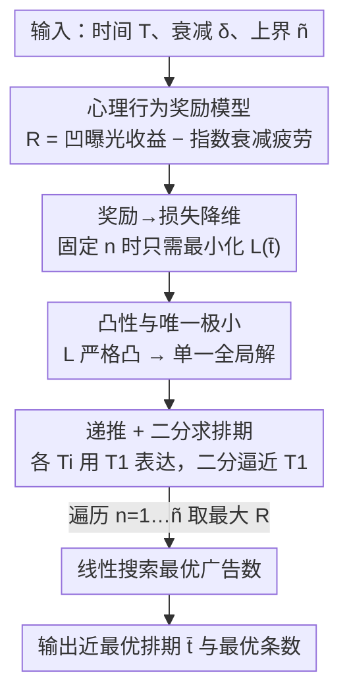

# Ads that Stick: Near-Optimal Ad Optimization through Psychological Behavior Models

**会议**: ICLR2026  
**OpenReview**: [https://openreview.net/forum?id=A8wfXZkoMs](https://openreview.net/forum?id=A8wfXZkoMs)  
**代码**: https://anonymous.4open.science/r/Ads-that-Stick-5E13  
**领域**: 学习理论 / 在线优化 / 计算广告  
**关键词**: 广告调度, 心理行为模型, 近最优算法, 凸优化, 算子条件作用

## 一句话总结
本文把"mere exposure / hedonic adaptation / operant conditioning"三种心理学效应写进一个连续时间的广告奖励模型，证明在广告数固定时最优排期只由"算子条件作用"的衰减损失决定，并给出一个拟线性时间、误差指数级小的近最优排期算法，揭示了"均匀间隔"这种常用启发式在很多场景下其实并非最优。

## 研究背景与动机
**领域现状**：数字广告决定了在视频/音频流、推送通知、会话内赞助内容里"什么时候、放几条广告"。但工业界主流排期仍靠简单启发式——均匀间隔（uniform spacing）、前置加载（front-loading）、频次封顶（frequency cap），或者把每次曝光当作彼此独立的短视策略。

**现有痛点**：这些启发式忽略了用户**长期**兴趣的动态演化。行为心理学早有大量实证（Singh 1994；Sahni 2015；Curmei 2022）表明，广告的时间间隔和频率会显著影响记忆留存与疲劳；可现有方法既没有一个能解释这些现象的奖励模型，也无法回答"到底应该在什么时刻放广告"。少数试图超越启发式的工作（如把排期建成强化学习问题）又得到难以解释、难以落地的策略。

**核心矛盾**：重复曝光对用户兴趣是**双刃剑**——前几次曝光带来正向的"新鲜感提升"（mere exposure），但很快趋于饱和（hedonic adaptation 边际递减）；而过密的曝光又会因记忆/注意力耗损带来负向的疲劳（operant conditioning）。正负两股力量随时间和次数此消彼长，使得"放在哪儿"成了一个真正的优化问题，而非拍脑袋的间隔规则。

**本文目标**：拆成两个子问题——(Q1) 能否设计一个**理论奖励模型**刻画用户的心理行为，且其最优策略与实证一致、参数可调？(Q2) 在该模型下，能否**高效计算**最优广告排期？

**切入角度**：作者沿用 Curmei 等人对三种心理效应的归纳，用"曝光次数的凹函数"建模前两种正向效应，用"时间指数衰减"建模负向的算子条件作用（动机来自 Ebbinghaus 遗忘曲线）。关键观察是：当广告条数固定时，正向项是个与时刻无关的常数，于是排期问题坍缩成一个只含衰减损失的凸优化。

**核心 idea**：把广告排期写成"凹的曝光收益 − 指数衰减的疲劳损失"，证明损失严格凸、有唯一极小，并用递推 + 二分搜索在拟线性时间内逼近这个极小，得到误差指数级小的近最优排期。

## 方法详解

### 整体框架
给定时间区间 $[0,T]$，要在其中投放 $n+1$ 条同质广告，时刻为 $\bar t=(t_0,t_1,\dots,t_n)$，约定 $t_0=0$、$t_n=T$ 且 $t_i\le t_{i+1}$。第 $i$ 条广告的奖励拆成两部分：

$$R(\bar t,i)=B(i)-\gamma\sum_{j<i}\delta^{\,t_i-t_j}.$$

其中 $B(i)$ 是"已展示次数"的**凹函数**（如 sigmoid $B(i)=\tfrac{1}{1+e^{-ci}}$），捕捉 mere exposure 的正向提升与 hedonic adaptation 的边际递减；后一项是**时间指数衰减**，$\delta\in[0,1]$ 控制 operant conditioning 的强度——之前在 $t_j$ 投的广告，会让当前 $t_i$ 的奖励衰减 $\delta^{t_i-t_j}$，$\gamma>0$ 是缩放常数。总奖励 $R(\bar t)=\sum_i R(\bar t,i)$。

整个解法是一条"先降维、再递推、再二分"的流水线：先证明固定 $n$ 时最大化奖励等价于最小化只含衰减项的损失 $L$；再证 $L$ 严格凸、有唯一极小；然后把所有时刻都用第一个内部时刻 $T_1$ 表达出来，对 $T_1$ 做二分搜索即可恢复整张排期；最后对广告条数做一次线性搜索取最优。

### 关键设计

**1. 三效应奖励模型：把心理学写成"凹收益 − 指数衰减"**

针对"现有方法没有可解释奖励模型"的痛点，作者把三种被反复验证的心理效应压进一个紧凑表达式。正向的 mere exposure（重复曝光提升好感）与 hedonic adaptation（很快饱和）合并成关于曝光次数的凹函数 $B(i)$——凹性正好对应"边际递减"，这与近期把动作动态效应建模成凹函数的工作一致。负向的 operant conditioning（过密曝光导致疲劳）用 $\delta^{t_i-t_j}$ 的指数衰减刻画，动机直接来自 Ebbinghaus 遗忘曲线对记忆指数衰退的假设，也和经典 goodwill-stock 模型、控制论里的指数贴现一脉相承。妙处在于单一参数 $\delta$ 就能编码用户的不同心理状态：$\delta$ 小表示过往曝光影响微弱、加广告不太掉好感；$\delta$ 大表示长期记忆强、容易迅速产生厌烦或被打扰感。这让模型既可解释（实证里"开头放广告比中间好"对应大 $\delta$），又可调（不同场景换 $\delta$）。

**2. 奖励→损失的降维：固定广告数后最优排期只由衰减项决定**

这是全文的杠杆支点。把总奖励展开：

$$R(\bar t)=\Big(\sum_{i=0}^{n}B(i)\Big)-\gamma\sum_{j<i}\delta^{\,t_i-t_j}.$$

第一项 $\sum_i B(i)$ 只跟广告**条数**有关、跟投放**时刻**完全无关；$\gamma$ 又只是缩放因子。所以一旦把 $n$ 固定下来，"在什么时刻放"这件事就只剩最小化损失 $L(\bar t)=\sum_{j<i}\delta^{\,t_i-t_j}$。这个观察把一个看似纠缠"次数 × 时刻"的二维优化，干净地切成"外层枚举条数 + 内层优化时刻"，而内层只依赖 operant conditioning。这正是"放在哪儿"这个直觉问题第一次被严格地与"放几条"解耦。

**3. 严格凸性与唯一极小：把全局最优变成可求的局部条件**

针对"如何保证找到的是全局最优"，作者证明损失 $L$ 在可行域 $D=\{t_i:0\le t_i\le T,\ t_i\le t_{i+1},\ t_0=0,\ t_n=T\}$ 上**严格凸**，因而至多一个极小，局部极小即全局极小（Theorem 4.2）。证明走了一条变量替换的路：先证任意最优解必有 $t_0=0$、$t_n=T$（Lemma 4.1），再把问题映射到以两两时差 $a_{ij}=t_i-t_j$ 为变量的等价问题 $L'$，证明 $L'$ 在紧致域 $D'$ 上严格凸、$D$ 与 $D'$ 间存在双射且极小一一对应。凸性这一步是后面所有"用 $\nabla L=0$ 求解"的合法性来源——否则递推求出的驻点未必是最优。

**4. 递推 + 二分的近最优算法：误差指数级小的排期恢复**

针对"如何在不解高维方程组的前提下高效求排期"，作者引入变量 $T_i:=\delta^{t_i}$ 并证明所有时刻可被**第一个内部时刻** $T_1$ 闭式表达：

$$T_i=\frac{T_1^{\,i}}{(1+T_1)^{\,i-1}},\qquad \frac{T_1^{\,n}}{(1+T_1)^{\,n-2}}=T_n=\delta^T.$$

于是整张排期的自由度坍缩到一个标量 $T_1$，而上式右端给出关于 $T_1$ 的单调方程，可用**二分搜索**在区间 $[\delta^T,1]$ 上逼近。这套机制由四个洞察支撑：(1) 衰减损失严格凸 → 单一全局解；(2) 该解有递推结构，$t_i$ 可由 $t_1,\dots,t_{i-1}$ 逐步算出；(3) $t_1$ 可二分搜索、误差有界；(4) 递推中的误差传播可控。最终主结果（Corollary 4.8）给出每个时刻的逼近精度：取 $\epsilon=\tfrac{1}{2^n}\cdot\tfrac{\log(1/\delta)}{2\ln 2}$，则

$$t_i^{*}-\frac{1}{2^n}\le t_i\le t_i^{*}+\frac{1}{2^n},$$

即与最优排期之差**随 $n$ 指数级缩小**。算法分三步落地：Algorithm 1 先定端点处堆叠的广告数 $a$ 与 $T_a$（多条广告可在同一瞬时投放）；Algorithm 2 在已知 $a,T_a$ 后铺满整张排期；Algorithm 3 对条数 $n+1\le\tilde n$ 做线性搜索、取使 $R$ 最大者。主分析聚焦 $a=1$（即 $T>n\log_{1/\delta}2$，端点各只放一条），一般 $a$ 的情形（极小落在边界）用 Lemma 6.1 的递推 $T_{a+i}=\tfrac1a\cdot\tfrac{(aT_a)^{i+1}}{(aT_a+1)^i}$ 同法处理。

### 一个完整示例
设 $T=20$、要放 7 条广告，扫 $\delta$ 从 0 到 1 看排期怎么变（对应论文 Figure 1a）：当 $\delta\le 0.4$ 时算法把 7 条广告**几乎等距**铺在 $[0,20]$ 上——此时疲劳衰减弱，均匀间隔接近最优；当 $\delta$ 越过 0.4 继续增大，广告开始**两端分叉**：一半向 $t=0$ 聚拢、一半向 $t=20$ 聚拢，只留少数均匀散在中间；$\delta\to 1$ 时大多数广告挤在 0 和 $T$ 两端。这条"随 $\delta$ 从均匀走向两端聚集"的轨迹（Observation 5.1）恰好从理论上解释了实证文献反复观察到的"开头和结尾放广告比中间更有效"，并把它限定在"用户记忆强（大 $\delta$）"这一可量化前提下，而不是当成普适规律。

## 实验关键数据

### 主实验
作者在视频流场景下设定 $n+1=15$、$T=100$、$\delta>0.9$（按 Curmei 等人，真实场景 $\delta\approx0.98$），对比三种基线：

| 配置 | δ 区间 | 表现 | 说明 |
|------|--------|------|------|
| Uniform（均匀间隔） | 小 δ | 较好 | δ 小时疲劳弱，均匀接近最优 |
| Corner（一半放 0、一半放 T） | δ→1 | 较好 | 大 δ 时两端聚集占优 |
| Random（首尾固定、中间随机） | 任意 | 较差 | 无结构 |
| **本文近最优策略** | 全 δ | **始终最优** | δ≈0.98 时领先所有基线 ≥10% |

核心结论是：没有哪个固定启发式在所有 $\delta$ 下都好——均匀只在小 $\delta$ 好、Corner 只在大 $\delta$ 好，而本文策略会**随 $\delta$ 自适应**，在 $\delta\approx0.98$ 这个真实区间至少领先 10%。

### 消融 / 分析实验

| 实验 | 关键发现 | 说明 |
|------|---------|------|
| 损失 vs 广告数 | $L^\#(2(n+1))\approx 2L^\#(n+1)$ | 损失近似随广告数线性增长 |
| 损失 vs δ 敏感性 | δ 从 0.9→0.99 时损失陡增 | 高 δ 区对算子条件作用极敏感；δ≈0.7 时损失基本平稳 |
| 最优广告数 | 奖励曲线先升后降、有峰 | sigmoid $B(i)=k\cdot\tfrac{1}{1+e^{-ci}}$ 下，曝光收益先主导、随后疲劳压过，峰值即最优条数 |

### 关键发现
- **启发式的最优性依赖 $\delta$**：均匀间隔并非普适最优，它只在记忆衰减弱（小 $\delta$）时才好；这是对工业界常用规则的一记直接反驳。
- **高 $\delta$ 区最危险**：$\delta$ 从 0.9 升到 0.99 损失急剧上升，说明真实场景（$\delta\approx0.98$）正落在对排期最敏感的区间，更需要自适应策略。
- **最优广告数存在且可搜**：奖励随条数先升后降，峰值唯一，线性搜索即可定位，给"到底放几条"提供了可操作答案。

## 亮点与洞察
- **把模糊的心理学实证翻译成可优化的数学对象**：mere exposure / hedonic adaptation 写成凹函数、operant conditioning 写成指数衰减，单参数 $\delta$ 就编码了"用户多容易厌烦"，既可解释又可调，这种"实证现象 → 紧凑奖励模型"的建模手法可迁移到推荐、推送疲劳等任何"重复曝光有正负双效"的场景。
- **降维洞察四两拨千斤**：发现"固定条数后正向项是常数"从而把二维优化拆成"外层枚举 + 内层凸优化"，是全文最关键的一步——它让原本纠缠的问题瞬间可解。
- **理论解释了工业直觉**："开头和结尾放广告更好"长期被当经验法则，本文证明它其实是大 $\delta$ 下的最优解，并指出小 $\delta$ 时反而该均匀，给了经验法则一个精确的适用边界。
- **误差指数级小的保证**：$|t_i-t_i^*|\le 1/2^n$ 这种随规模指数收紧的精度，在排期类问题里相当漂亮，且算法只是拟线性时间。

## 局限与展望
- **奖励近似平稳的假设**：模型假定奖励大体平稳（适合连续视频流插播），对**季节性 / 非平稳**奖励（节假日、热点波动）不直接适用，作者在局限里承认这点。
- **同质广告假设**：全篇假设 $n+1$ 条广告同质、且（基本款）投放瞬时；异质广告（不同价值/时长）只在附录的等时长扩展里部分处理，真实广告交易里的异质性、预算约束、竞价机制都未建模。
- **$\delta$ 的获取**：整套策略的效果高度依赖 $\delta$，而真实用户的 $\delta$ 如何在线估计、是否随时间漂移，本文取自既有文献的经验值（0.7–0.99），没有给出估计算法。
- **仿真而非真实投放**：实验全是基于自身奖励模型的仿真对比，缺少真实平台 A/B 验证；模型是否真能逼近真实用户行为仍待检验。
- **可改进方向**：把 $\delta$ 做成可在线学习的、扩展到多类型广告与预算约束、引入非平稳奖励下的滚动重排，都是自然的下一步。

## 相关工作与启发
- **vs Nerlove & Arrow（goodwill-stock 模型）**: 经典模型把广告当作积累"商誉存量"的投资并随时间折旧，转成最优控制问题；但它**不建模记忆/饱和效应**，最优策略退化成"把广告全堆在开头"。本文显式加入 operant conditioning 的疲劳项，得到随 $\delta$ 变化的两端聚集结构，更贴近实证。
- **vs 强化学习排期（Rafieian 2023; Theocharous 2015）**: RL 方法通用但解**难以解释、难落地**（广告交易复杂）。本文走相反路线——用结构化的凸模型换来闭式递推与可解释的排期规律（何时均匀、何时两端聚集）。
- **vs Leqi 2021（satiation bandit / restless bandit）**: 他们用线性动力系统建模满足度衰减、证明贪心在同质臂下最优；本文不在 bandit 框架内，而是连续时间的确定性排期优化，关注的是给定行为模型下的**最优时刻分布**及其随 $\delta$ 的相变。
- **vs 实证心理学研究（Freeman 2022; Ritter & Cho 2009; Goldstein 2011）**: 这些工作用真人实验得出"开头放广告比中间好"，但样本有限、无法证明普适。本文提供的理论框架既复现了这一结论，又指明它只在大 $\delta$ 成立，把零散实证统一进一个可调模型。

## 评分
- 新颖性: ⭐⭐⭐⭐⭐ 首次把三种心理效应写进可优化的连续时间广告奖励模型，并给出带相变规律的近最优算法。
- 实验充分度: ⭐⭐⭐ 四组仿真清晰验证了理论，但全是自身模型内的仿真，缺真实平台 A/B。
- 写作质量: ⭐⭐⭐⭐ 从建模到降维到算法的逻辑链干净，定理与直觉穿插得当。
- 价值: ⭐⭐⭐⭐ 给"广告/推送排期"提供了可解释、可调、有理论保证的框架，并精确划定了均匀间隔等启发式的适用边界。

<!-- RELATED:START -->

## 相关论文

- [\[ICLR 2026\] A Near-Optimal Best-of-Both-Worlds Algorithm for Federated Bandits](a_near-optimal_best-of-both-worlds_algorithm_for_federated_bandits.md)
- [\[ICLR 2026\] Near Optimal Robust Federated Learning Against Data Poisoning Attack](near_optimal_robust_federated_learning_against_data_poisoning_attack.md)
- [\[ICLR 2026\] Near-Optimal Sample Complexity Bounds for Constrained Average-Reward MDPs](near-optimal_sample_complexity_bounds_for_constrained_average-reward_mdps.md)
- [\[ICLR 2026\] Diffusion Language Models are Provably Optimal Parallel Samplers](diffusion_language_models_are_provably_optimal_parallel_samplers.md)
- [\[ICLR 2026\] Best-of-N through the Smoothing Lens: KL Divergence and Regret Analysis](best-of-n_through_the_smoothing_lens_kl_divergence_and_regret_analysis.md)

<!-- RELATED:END -->
