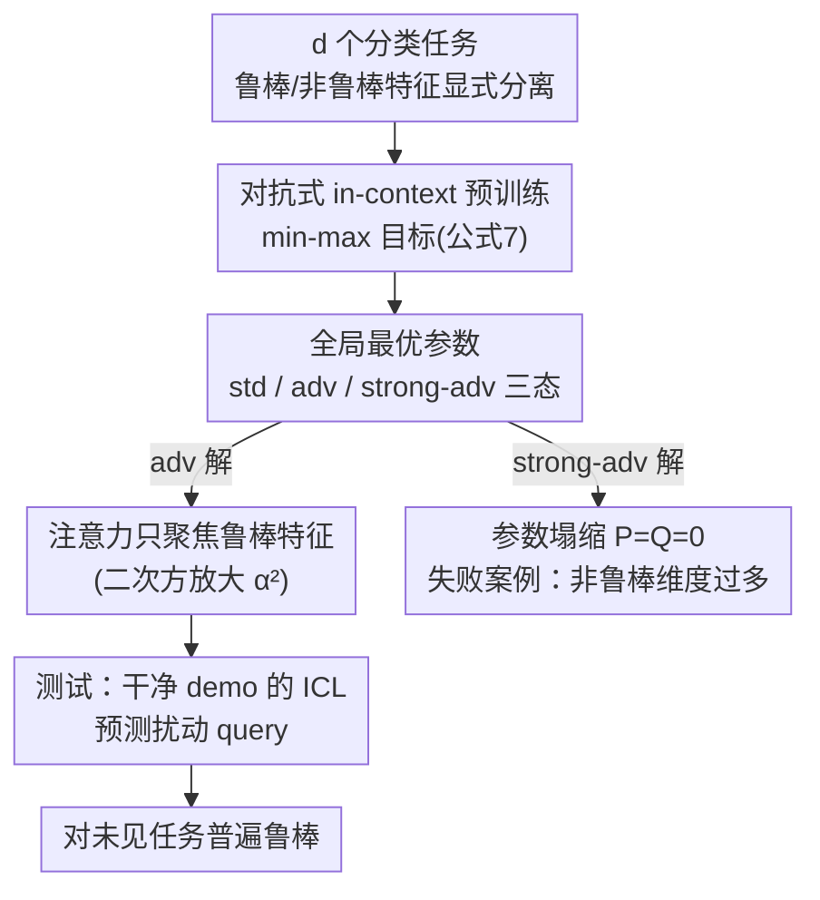

# Adversarially Pretrained Transformers May Be Universally Robust In-Context Learners

**会议**: ICLR 2026  
**OpenReview**: [https://openreview.net/forum?id=11eHIPnWDx](https://openreview.net/forum?id=11eHIPnWDx)  
**代码**: https://github.com/s-kumano/universally-robust-in-context-learner  
**领域**: 学习理论 / 对抗鲁棒性 / 上下文学习  
**关键词**: 对抗训练, 上下文学习, 线性 Transformer, 鲁棒特征, 普遍鲁棒性

## 一句话总结
本文给出第一份理论分析：在多个分类任务上做过对抗预训练的单层线性 Transformer，可以仅凭干净示例的上下文学习（in-context learning），就对未见过的新分类任务获得对抗鲁棒性——无需任何额外的对抗训练或对抗样本，因为模型学会了自适应地聚焦"鲁棒特征"。

## 研究背景与动机
**领域现状**：对抗训练（adversarial training）是目前对抗攻击最有效、也几乎是唯一站得住脚的防御手段——它在最坏情况扰动下最小化分类损失（min–max 优化）。但它带来的代价是计算成本极高，而且必须针对每个具体任务各做一遍。同时，"用基础模型 + 轻量微调适配下游任务"已经成了标准范式。

**现有痛点**：两条线没有合到一起。对抗训练是"按任务定制"的：你为任务 A 训出的鲁棒模型，换到任务 B 上就不再鲁棒。于是每个想要鲁棒性的下游任务都得自己再付一次昂贵的对抗训练账单。而绝大多数想绕开这笔成本的"替代防御"，后来都被证明只是虚假鲁棒（spurious robustness）。

**核心矛盾**：能不能有一个"普遍鲁棒（universally robust）的基础模型"——预训练时一次性把对抗训练的钱花掉，之后任意下游任务都能"免费"继承鲁棒性？这个方向很诱人，但因为对抗预训练太贵、多次实证评估不现实，它的可行性几乎无人触碰。

**本文目标**：从理论上回答"对抗预训练的 Transformer 能否充当普遍鲁棒的基础模型"，并刻画它成立的条件、揭示鲁棒性从何而来、以及还剩哪些根本难题。

**切入角度**：作者借用了"鲁棒特征 vs 非鲁棒特征"这一经典框架（Ilyas/Tsipras 等）——鲁棒特征是类别可判别、人类可理解的（如形状），非鲁棒特征是人眼不可察觉但统计上与标签相关、因而有预测性的（如纹理）。对抗脆弱性被认为正是源于模型依赖非鲁棒特征。作者把这套区分显式写进数据分布假设，再去分析一个**可解析**的最小模型：单层线性 Transformer 的上下文学习。

**核心 idea**：用一句话概括——对抗预训练会把单层线性 Transformer 的注意力参数推向"只看每个任务里的鲁棒特征"的解，于是它在测试时仅凭干净示例做 ICL，就能对扰动 query 给出鲁棒预测，这种鲁棒性对所有任务通用。

## 方法详解

### 整体框架
这篇论文不是提出一个新网络，而是搭一个**可解析的理论沙盘**，把"对抗预训练 → 上下文学习 → 普遍鲁棒"这条因果链算清楚。设定是：在 $d$ 个不同的二分类任务分布 $\{D^{tr}_c\}_{c=1}^d$ 上，用带对抗扰动的 in-context 损失训练**单层线性 Transformer**；测试时面对一个可能结构完全不同的新分布 $D^{te}$，模型只拿到 $N$ 个**干净**示例 $\{(x_n,y_n)\}$ 作为 prompt，去预测一个被 $\ell_\infty$ 扰动过的 query $x_{N+1}+\Delta$。整篇方法围绕三个问题展开：(1) 用什么数据模型才能把鲁棒/非鲁棒特征分开；(2) 对抗预训练的全局最优参数长什么样；(3) 这组参数为什么会带来普遍鲁棒、又在什么时候会失效。

输入序列被排成一个矩阵，把示例的特征、标签和 query 拼在一起：

$$Z_\Delta := \begin{pmatrix} x_1 & \cdots & x_N & x_{N+1}+\Delta \\ y_1 & \cdots & y_N & 0 \end{pmatrix} \in \mathbb{R}^{(d+1)\times(N+1)}$$

单层线性 Transformer 定义为 $f(Z_\Delta;P,Q) = \frac{1}{N} P Z_\Delta M Z_\Delta^\top Q Z_\Delta$，其中 $P$ 是 value 矩阵、$Q$ 是 key·query 的乘积矩阵，掩码 $M$ 防止 token 关注 query 自身。最终读出右下角元素 $[f]_{d+1,N+1}$ 作为对 query 的预测。整条机制的概念流如下：

### 关键设计

**1. 把"鲁棒/非鲁棒特征"显式写进数据分布**

要从理论上谈"模型该看哪种特征"，前提是数据里这两种特征本来就分得开。作者据此构造训练分布（Assumption 3.1）：在第 $c$ 个任务里，第 $c$ 维是**鲁棒特征**，直接等于标签 $x_c=y$；其余每一维是**非鲁棒特征**，与标签的相关性被一个小常数 $\lambda<1$ 卡住（$y=1$ 时 $x_i\sim U([0,\lambda])$）。这样每个任务都有"一维强信号 + 多维弱信号"的结构，模仿真实图像里"形状（鲁棒）+ 纹理（非鲁棒）"的对立。测试分布（Assumption 3.2）更一般：允许 $d_{rob}$ 个鲁棒特征、$d_{vul}$ 个非鲁棒特征，外加 $d_{irr}$ 个与标签独立的**无关特征**（模拟 MNIST 里恒为零的角落像素），并只对各特征的尺度（$\alpha,\beta,\gamma$）和高阶矩做温和约束。作者验证 MNIST/Fashion-MNIST/CIFAR-10 在预处理后近似满足这些假设，让纯理论结论有了现实落点。

**2. 对抗式 in-context 预训练目标**

光有数据还不够，关键是训练目标如何把"对抗"和"上下文学习"绑在一起。作者用的 min–max 目标（公式 7）是：

$$\min_{P,Q\in[0,1]^{(d+1)\times(d+1)}} \mathbb{E}_{c,\,\{(x_n,y_n)\}\sim D^{tr}_c}\Big[\max_{\|\Delta\|_\infty\le\epsilon} -y_{N+1}\,[f(Z_\Delta;P,Q)]_{d+1,N+1}\Big]$$

内层 $\max$ 是对 query 施加最坏扰动 $\Delta$（预算 $\epsilon$，通常取 $\epsilon\approx\lambda$，即恰好够动非鲁棒特征、却动不了鲁棒特征也不被人眼察觉）；外层 $\min$ 是在这种最坏情况下学好参数。关键在于：示例 $\{(x_n,y_n)\}$ 全是**干净**的，只有 query 被攻击——这逼着 Transformer 学会"从干净示例里抽取可泛化的结构，再去抗住对扰动 query 的攻击"，而不是死记某个具体任务。参数被约束在 $[0,1]$ 区间以避免问题病态。

**3. 对抗预训练全局最优参数的闭式刻画，以及"失败案例"**

由于自注意力的非线性 + 内层 max，目标 (7) 既非线性也非凸。作者先用 Lemma 3.3 把它等价转写成一个对二值向量 $b\in\{0,1\}^{d+1}$ 的最大化问题，再利用对称性求出全局最优解（Theorem 3.4），按扰动预算 $\epsilon$ 分三态：**标准态**（$\epsilon=0$）学到的 $Q_{std}=[1_{d+1,d}\;0]$ 会用上所有特征；**对抗态**（$\epsilon=\frac{1+(d-1)\lambda/2}{d}$）学到 $Q_{adv}=\begin{pmatrix}I_d&0\\0&0\end{pmatrix}$，这个对角结构意味着注意力**只挑出每个任务里的鲁棒特征**、忽略其余；**强对抗态**（$\epsilon$ 很大）则塌缩成 $P=Q=0$。最优参数与任务索引 $c$ 无关，说明 Transformer 学到的是"从示例学习"的能力而非记忆单个任务，gradient descent 的实验热力图也与之吻合（Fig. 1）。最后一态就是**失败案例**：当扰动很大时唯一全局最优是恒输出零的废模型——即"普遍鲁棒的分类器存在，但普遍鲁棒的单层线性 Transformer 不存在"。它发生在非鲁棒维度 $d-1$ 远多于那一维鲁棒特征时（$d\gtrsim 1/\lambda^2$），此时只需 $\epsilon\gtrsim\lambda$ 的不可察觉扰动就能击垮鲁棒性。

**4. 普遍鲁棒性的来源：从线性提取到二次方聚焦鲁棒特征**

这是全文的"啊哈"点。作者对比两种预训练在测试分布上的表现。标准模型（Theorem 3.5）按尺度 $d_{rob}\alpha$ 和 $d_{vul}\beta$ **线性地**同时提取鲁棒和非鲁棒特征，因此当非鲁棒维度够多时（非正式地 $d_{vul}\gtrsim\frac{\alpha}{\beta}d_{rob}$）就会被扰动击垮；无关特征 $d_{irr}$ 更糟，它不贡献精度却以 $d_{irr}\epsilon$ 的速率加剧脆弱性。对抗模型（Theorem 3.6）则给出一个**下界**：它按**二次方尺度** $d_{rob}\alpha^2$ 和 $d_{vul}\beta^2$ 提取特征。因为鲁棒特征尺度更大（$\alpha^2\gg\beta^2$），二次方放大等于**自动把权重压到鲁棒特征上、抑制非鲁棒特征**——鲁棒条件随之松到 $d_{vul}\lesssim(\frac{\alpha}{\beta})^2 d_{rob}$。一个直观对比：取 $\alpha=160/255,\beta=8/255$，标准模型只能撑到 $d_{vul}\lesssim 20\,d_{rob}$，对抗模型能撑到 $d_{vul}\lesssim 400\,d_{rob}$，鲁棒裕度扩大约 20 倍。这就是"普遍鲁棒"的机制：不是模型记住了某种攻击，而是它学会了**自适应地只信任每个新任务里的鲁棒特征**。

**5. 两个仍然存在的根本难题：精度-鲁棒权衡与样本饥渴**

作者诚实地指出，对抗预训练并非免费午餐，鲁棒分类领域两个老大难在这套设定里依然成立。其一是**精度-鲁棒权衡**（Theorem 3.7）：当鲁棒特征只以概率 $p>0.5$ 与标签相关、而非鲁棒特征总是相关时，对抗模型因为丢掉了非鲁棒但有预测性的特征，会以 $1-p$ 的概率在干净样本上预测错——干净精度天然低于标准模型。其二是**样本饥渴**（Theorem H.1）：在小样本、$p\to0.5$ 的低信噪场景里，对抗模型要达到与标准模型相当的干净精度，需要**多得多的上下文示例**，因为它依赖的鲁棒特征在小样本里统计上被低估了。这两点和 Table 1 的实测一致：对抗模型鲁棒精度碾压标准模型，但干净精度普遍低几个点。

## 实验关键数据

实验目的不是刷 SOTA，而是**验证理论预测**。作者用 SGD 在 $[0,1]^d$ 上优化 in-context 损失 (7)，$d=20,\lambda=0.1$，学到的参数热力图（Fig. 1）与 Theorem 3.4 预测的 std/adv/strong-adv 三种结构吻合。

### 主实验：标准 vs 对抗预训练的单层线性 Transformer 干净/鲁棒精度（%）

直接用理论预测的参数（Theorem 3.4 的 std 与 adv 解）在合成分布与真实数据上评测，"左值=干净精度 / 右值=鲁棒精度"，真实数据为 10 类里全部 45 个二分类对的平均：

| 模型 | $D^{tr}$ | $D^{te}$ | MNIST | F-MNIST | CIFAR-10 |
|------|----------|----------|-------|---------|----------|
| 标准预训练 | 100 / 0 | 100 / 0 | 94 / 4 | 91 / 20 | 68 / 21 |
| 对抗预训练 | 100 / **100** | 99 / **95** | 93 / **72** | 89 / **62** | 64 / **34** |

### 分析表：理论 ↔ 实测对应关系

| 现象 | 对应理论 | 实测证据 |
|------|---------|---------|
| 标准模型干净高、鲁棒近乎归零 | Theorem 3.5（线性提取→脆弱） | $D^{tr}/D^{te}$ 鲁棒精度 0 |
| 对抗模型在**未见**分布上仍鲁棒 | Theorem 3.6（二次方聚焦鲁棒特征） | $D^{te}$ 鲁棒 95、MNIST 72 |
| 对抗模型干净精度更低 | Theorem 3.7（精度-鲁棒权衡） | CIFAR-10 干净 64 vs 68 |

### 关键发现
- **普遍鲁棒最有说服力的证据**：对抗模型仅用干净示例的 ICL，就能把从未在训练分布里出现过的 $D^{te}$、乃至 MNIST/CIFAR-10 的鲁棒精度从个位数拉到 34–95，且无需任何下游对抗训练。
- **二次方 vs 线性的尺度差**是机制核心：$\alpha^2\gg\beta^2$ 让对抗模型的鲁棒裕度比标准模型扩大约 20 倍（$20d_{rob}\to400d_{rob}$）。
- **权衡真实存在**：对抗模型干净精度在每个数据集上都略低，CIFAR-10 上掉到 64%，印证理论 Theorem 3.7 而非被掩盖。

## 亮点与洞察
- **把"对抗预训练能否当普遍鲁棒基础模型"第一次做成了可证明的命题**：用单层线性 Transformer + 上下文学习这个最小可解析模型，给出了闭式全局最优解，而不是靠跑实验猜结论——对一个实证代价极高的问题，这是更可信的第一步。
- **"二次方放大鲁棒特征"是个可迁移的直觉**：对抗训练之所以鲁棒，被精确解释为它把特征提取从线性 $d_{rob}\alpha$ 变成二次 $d_{rob}\alpha^2$，从而自动加权大尺度的鲁棒特征。这个"min–max 训练等于隐式特征加权"的视角，可能推广到更复杂模型的鲁棒性分析。
- **诚实地保留了失败案例和两个 open challenge**：明确指出强扰动下唯一最优是塌缩成零模型、以及精度-鲁棒权衡与样本饥渴不会消失，没有把好结论包装成万能解。

## 局限与展望
- **作者承认的局限**：数据假设把鲁棒/非鲁棒特征**硬性二分**，真实数据是渐变的；模型限定为单层线性 Transformer，缺少多层和 softmax 注意力的实际特性；任务限定为分类、扰动限定为 $\ell_\infty$。
- **自己发现的局限**：实验只在合成分布和三个小数据集（且都是二分类对）上验证，没有也无法在真正的大规模基础模型上检验"普遍鲁棒"；对抗预训练的成本问题被推给"大机构靠 API 收费摊销"这一假设，本身没有解决。
- **改进思路**：把分析推广到多层/softmax 注意力、回归等非分类任务、$\ell_2$ 等其他扰动模型；以及在样本饥渴问题上，探索能否用更聪明的示例选择或加权来缓解小样本下鲁棒特征被低估的问题。

## 相关工作与启发
- **vs 经典对抗训练（Madry et al.）**：他们针对单个任务做 min–max 训练得到"特定鲁棒"模型，换任务即失效；本文证明在多任务上对抗预训练 + ICL 能得到"普遍鲁棒"，下游任务免费继承，区别在于鲁棒性被搬到了示例驱动的适配层而非参数微调。
- **vs 鲁棒/非鲁棒特征假说（Ilyas/Tsipras et al.）**：他们提出并实证了对抗脆弱来自非鲁棒特征、对抗训练偏好鲁棒特征；本文把这套假说**写进可解析的数据模型并给出闭式证明**，量化出"二次方放大"这一机制。
- **vs 线性 Transformer 的 ICL 理论（Ahn/Bai/Mahankali et al.）**：他们分析单层线性 Transformer 如何通过 ICL 实现（预条件）梯度下降等算法；本文沿用同一可解析框架，但首次把**对抗鲁棒性**这一维度引入，揭示对抗预训练如何改变学到的最优参数结构。

## 评分
- 新颖性: ⭐⭐⭐⭐⭐ 首个证明对抗预训练 Transformer 可作普遍鲁棒基础模型的理论分析，问题与切入都新。
- 实验充分度: ⭐⭐⭐ 实验仅为验证理论、规模很小（合成 + 三个二分类数据集），但对纯理论论文是恰当的。
- 写作质量: ⭐⭐⭐⭐ 假设、定理、失败案例与权衡交代清楚，理论↔实测对应明确。
- 价值: ⭐⭐⭐⭐ 为"普遍鲁棒基础模型"这一昂贵方向提供了可信的第一步与清晰机制解释。

<!-- RELATED:START -->

## 相关论文

- [\[ICLR 2026\] In-Context Algorithm Emulation in Fixed-Weight Transformers](in-context_algorithm_emulation_in_fixed-weight_transformers.md)
- [\[ICLR 2026\] Transformers with Endogenous In-Context Learning: Bias Characterization and Mitigation](transformers_with_endogenous_in-context_learning_bias_characterization_and_mitig.md)
- [\[ICLR 2026\] Continuum Transformers Perform In-Context Learning by Operator Gradient Descent](continuum_transformers_perform_in-context_learning_by_operator_gradient_descent.md)
- [\[ICLR 2026\] Critical Attention Scaling in Long-Context Transformers](critical_attention_scaling_in_long-context_transformers.md)
- [\[ICLR 2026\] Transformers Learn Latent Mixture Models In-Context via Mirror Descent](transformers_learn_latent_mixture_models_in-context_via_mirror_descent.md)

<!-- RELATED:END -->
