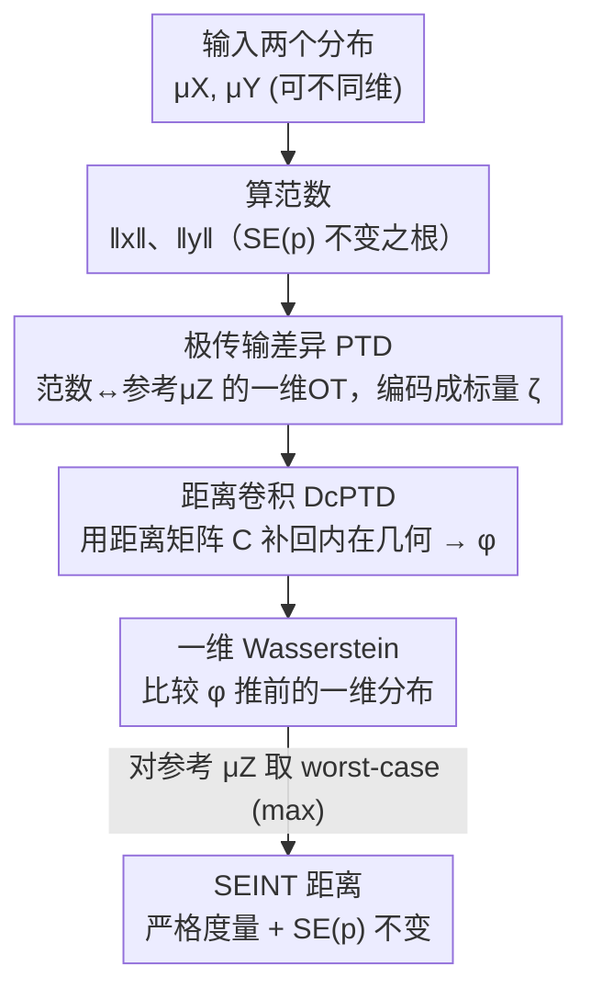

# SEINT: An Efficient SE(p)-Invariant Transport Metric Driven by Polar Transport Discrepancy-based Representation

**会议**: ICLR 2026  
**OpenReview**: [https://openreview.net/forum?id=oyxExc7TEl](https://openreview.net/forum?id=oyxExc7TEl)  
**代码**: https://github.com/junyilin559/SEINT  
**领域**: 学习理论 / 最优传输 / 几何不变度量  
**关键词**: 最优传输、SE(p) 不变性、度量学习、点云、分子生成

## 一句话总结
本文提出 SEINT —— 一个对平移+旋转（特殊欧氏群 SE(p)）严格不变、且被证明是真正度量（满足三角不等式）的分布距离：它先用免训练的「极传输差异（PTD）」把高维分布编码成一维标量特征，再用「距离卷积（DcPTD）」补回内在几何信息，最后在一维上算 Wasserstein 距离，把复杂度从 GW 的 $O(n^3)\sim O(n^4)$ 压到 $O(n\log n)\sim O(n^2)$，并在点云分类（100% 准确率）和 3D 分子生成（SOTA 稳定性）上验证有效。

## 研究背景与动机

**领域现状**：最优传输（OT）和 Wasserstein 距离是比较概率分布的强力工具，但标准 Wasserstein 距离**没有几何不变性**。对于分子、3D 点云这类「形状才重要、绝对坐标无所谓」的对象，我们希望度量对刚体变换——即特殊欧氏群 $SE(p) = SO(p)\ltimes\mathbb{R}^p$（旋转 + 平移）——保持不变：同一个分子转个角度、挪个位置，距离不应该变。

**现有痛点**：作者把已有的 SE(p) 不变 OT 方法归成三类，每一类都按下葫芦浮起瓢（见原文 Table 1）：

- **外在策略（Extrinsic）**：联合优化一个正交矩阵把两个分布对齐（如 EMDG、Wasserstein Procrustes）。要反复求解 OT，复杂度高到 $O(n^3\log n)$；想加速（如 RISGW 投影到一维）就**丢掉了度量性质**（不再满足三角不等式）。
- **内在策略（Intrinsic）**：直接比较度量空间结构（Gromov–Hausdorff、Gromov–Wasserstein）。天然 SE(p) 不变、还能跨空间比较，但 GW 复杂度 $O(n^3)\sim O(n^4)$ 甚至 NP-hard；快速近似版（Quantized/Sampled GW）又**损失度量性质**。
- **表示策略（Representation）**：先抽 SE(p) 不变特征再比（如球谐表示 SHR、旋转不变 Transformer RIT）。经验效果好，但表示过程会**丢几何信息**，只能得到伪度量（pseudometric）而非真度量。

**核心矛盾**：三条路线没有一条能**同时**做到「计算高效 + 严格度量 + 可跨等距类比较」。表示类方法之所以只能给伪度量，是因为单纯抽特征会把内在距离信息丢掉——而 Gromov 系列的理论早就指出，**内在距离信息是构造真正等距不变度量不可或缺的**。

**本文目标**：设计一个 SE(p) 不变度量，三者兼得：(1) 复杂度低到能大规模用；(2) 严格满足度量公理（尤其三角不等式）；(3) 还能比较不同维度空间里的分布（cross-space）。

**切入角度**：作者从「极坐标下的最优传输」获得灵感——既然旋转平移不改变点到原点的范数（先把分布中心化），那么**范数**本身就是一个天然的 SE(p) 不变量。围绕范数构造一维特征，就能把高维不变性问题降到一维 OT 这种又快又有度量保证的设定上；但光靠范数会丢信息，所以再用样本间的**距离矩阵**做一次卷积，把内在几何「补」回来。

**核心 idea**：用「极传输差异 PTD（范数侧的一维 OT 特征）+ 距离卷积 DcPTD（补回内在距离）」把分布编码成一维标量场，再在一维上算 Wasserstein 距离——既拿到 SE(p) 不变性和真度量保证，又把复杂度压到近线性。

## 方法详解

### 整体框架

SEINT 处理的对象是「测度 Banach 空间」三元组 $(X,\|\cdot\|_X,\mu_X)$：$X$ 是带范数的完备向量空间，$\mu_X$ 是上面的概率测度。先做一个标准化假设——分布已中心化、等距映射把基点 0 映到 0——从而**屏蔽掉纯平移的差异**，剩下要对付的就是旋转/等距。

给定两个这样的空间，SEINT 的计算流水线是四步串行（对应原文 Fig. 2）：

1. **算范数**：对每个样本 $x_i$ 算 $\|x_i\|_X$。范数在旋转平移下不变，这是整个不变性的根。
2. **PTD（极传输差异）**：在一维参考分布 $\mu_Z$ 和「范数分布 ↔ $\mu_Z$」的最优传输耦合下，把每个样本编码成一个一维标量 $\zeta(x_i)$。
3. **DcPTD（距离卷积）**：用样本间的距离矩阵 $C_X$ 对 PTD 特征做一次卷积/矩阵乘，得到 $\phi(x_i)$，把被范数丢掉的内在几何补回来——这一步是「伪度量 → 真度量」的关键。
4. **一维 Wasserstein**：把两侧的 DcPTD 特征推前成一维分布，算它们的一维 Wasserstein 距离（有闭式排序解，极快）。再对参考分布 $\mu_Z$ 取 worst-case（取 max），得到 SEINT 距离。

### 关键设计

**1. 极传输差异 PTD：用「范数到参考分布的一维 OT」把高维点编码成不变标量**

痛点是高维分布直接比既贵又难保证旋转不变。PTD 的做法是只盯住**范数**这个天然不变量：取一个一维参考概率测度 $\mu_Z\in\mathcal{P}(\mathbb{R})$，定义代价 $c(x,z)=\big|\,\|x\|_X-z\,\big|$，这等价于在「范数分布 $\|X\|_X$」和「$\mu_Z$」之间求一维最优传输，最优耦合集合记为 $\Pi^*_{X,Z}$。把最优耦合按 $x$ 分解（disintegrate）成条件测度 $\pi^*_{Z|X=x}$ 后，PTD 把每个样本编码成一个非负标量：

$$\zeta_{\pi^*_{X,Z}}(x):=\int_{\mathbb{R}}\big|\,\|x\|_X-z\,\big|\,d\pi^*_{Z|X=x}(z).$$

它有两个好处：**免训练**（纯靠 OT 求解，不需要学神经网络）；**可生成多个特征**（换不同的 $\mu_Z$ 或不同最优耦合就得到不同视角的表示，灵活度高）。但 PTD 单独用只能给伪度量——因为它只看了范数，**丢掉了样本之间的相对几何**。

**2. 距离卷积 DcPTD：用距离矩阵把内在几何补回来，从伪度量升级到真度量**

这一步直击 PTD 的硬伤。Gromov 系列理论指出，真正的等距不变度量离不开内在距离信息。DcPTD 因此把 PTD 特征和样本间距离 $d_X(x,x')$ 做一次「卷积」：

$$\phi_{\pi^*_{X,Z}}(x):=\int_X d_X(x,x')\,\zeta_{\pi^*_{X,Z}}(x')\,d\mu_X(x').$$

DcPTD 有两个被证明的关键性质：**(1) 等距一致性**——对任意等距映射 $f:X\to Y$，有 $\phi_{\pi^*_{X,Z}}(x)=\phi_{\pi^*_{Y,Z}}(f(x))$，所以表示在刚体变换下严格不变；**(2) 维度无关**——输出恒为实数轴上的非负标量，不管输入空间维度是多少。正是这第二条让**跨空间比较**成为可能：把 2D 投影点云和 3D 点云都编码到同一个一维域 $(\mathbb{R},|\cdot|)$，于是「异维空间比分布」被转化成「同一空间里的一维 OT」（原文式 4）。

**3. SEINT 度量：inf-sup 的 worst-case 参考分布选择，换来真度量 + SE(p) 不变**

剩下的问题是「参考分布 $\mu_Z$ 怎么选」。作者不拍一个固定的 $\mu_Z$，而是把它当成对抗变量取最不利（least favorable）的那个，从而得到对参考选择鲁棒的距离。先把候选参考集 $\mathcal{P}_{X,Y}(\mathbb{R})$ 约束成「与数据测度直接关联、保证两侧都有对应最优耦合」的形式（原文式 5、式 6），SEINT 距离定义为一个 inf-sup：

$$L_{\text{SEINT}}(X,Y,\mu_X,\mu_Y):=\inf_{\pi\in\Pi(\mu_X,\mu_Y)}\ \sup_{\mu_Z\in\mathcal{P}_{X,Y}(\mathbb{R})}\Big(\mathbb{E}_\pi\big[|\phi_{\pi^*_{X,Z}}(x)-\phi_{\pi^*_{Y,Z}}(y)|^p\big]\Big)^{1/p}.$$

外层 $\inf$ 在两分布的耦合上找最优传输计划，内层 $\sup$ 在参考分布上取最坏情况。论文的核心理论（Theorem 1）证明：$L_{\text{SEINT}}$ 是**等距类空间上的真度量**——非负且当且仅当两空间等距时为 0（同一性）、对称、满足三角不等式。再由 Corollary 1，对嵌入欧氏空间的数据，SEINT 在任意 $g=(R,t)\in SE(p)$ 下严格不变：$L_{\text{SEINT}}(X,Y,\cdot)=L_{\text{SEINT}}(g(X),Y,\cdot)$。这就同时拿到了表 1 里别人凑不齐的「度量 ✓ + 等距 ✓」两栏。论文还给了一个把 $\sup$/max 换成平均的积分变体 **ISEINT**（类比 Sliced-Wasserstein 之于 Max-Sliced-Wasserstein）。

**4. 高效数值实现：离散化 + 排序闭式解，复杂度压到 $O(n\log n)\sim O(n^2)$**

离散设定下，参考测度取自有限支撑的均匀分布族 $\hat{\mathcal{P}}(\mathbb{R})$，在「范数值互不相同」（经验分布几乎总成立）的条件下，最优传输计划 $\Pi^\star$ 唯一，PTD 退化成可显式计算的求和（原文式 9）：$\zeta^X_{Z_i}=\frac{1}{p_{x_i}}\sum_j \Pi^\star_{ij}|\,\|x_i\|_X-z_j|$。整个 Algorithm 1 的开销来自两处：算距离矩阵 $C_X,C_Y$ 是 $O(n^2+m^2)$，矩阵-向量乘 $C_X\zeta$ 也是 $O(n^2)$；PTD 本身和最后的一维 Wasserstein 都只要排序级的 $O(n\log n)$。所以一般情况是 $O(n^2)$。更妙的是，当地距离是**可分解**的结构（如平方欧氏距离 $\|x-y\|_2^2$ 可拆成内积形式）时，矩阵乘能用分解技巧加速，在 $n\gg p$ 时整体降到 $O(n\log n)$（Algorithm 2），这才让它能上大规模数据。对比 GW 的 $O(n^3\sim n^4)$，这是数量级的提速。

### 损失函数 / 训练策略
SEINT 本身免训练（纯 OT 计算）。作为正则项用时，把它加到生成模型的去噪损失上：$L=\alpha L_{\text{SEINT}}+(1-\alpha)L_{\text{MSE}}$，其中 $L_{\text{MSE}}$ 是坐标去噪的标准 $L_2$ 损失，$\alpha$ 控制 SEINT 的占比（实验扫了 0.1/0.2/0.3），两项权重靠简单的尺度对齐平衡。

## 实验关键数据

### 主实验：作为距离度量（ModelNet40-SE(3) 点云分类）

把 ModelNet40 每类取一个模型，做 25 次随机 SE(3) 变换 + 加高斯噪声，构成 1000 个模型的不变性测试集，用 kNN 分类。SEINT 既准又快：

| 方法 | Acc (k=1) | Acc (k=10) | 时间 (h) | SE(p) 不变 |
|------|-----------|-----------|----------|-----------|
| GW | — | — | 2655.9 | ✓ |
| EGW | — | — | 2644.3 | ✓ |
| RISGW | 74.9 | 50.0 | 400.6 | ✓ |
| W2 | 52.5 | 31.3 | 113.4 | ✗ |
| SGW | 59.1 | 40.9 | 20.2 | ✗ |
| SW | 56.7 | 37.2 | 16.6 | ✗ |
| **SEINT** | **100.0** | **100.0** | **9.01** | ✓ |
| **ISEINT** | **100.0** | **100.0** | **8.29** | ✓ |

SEINT/ISEINT 在所有 k 上都是 100% 准确率（佐证严格 SE(p) 不变），而且**还是最快的**——比号称旋转不变的 RISGW 快约 44 倍，比 GW/EGW 快两个数量级（后者贵到结果没法报）。声称不变的 W2/SW/SGW 准确率掉到 60% 以下，说明它们的「不变」并不严格。

### 跨空间与高维稳定性
- **跨空间（horse-gallop）**：把参考马点云投影到 XY/XZ/YZ 三个 2D 平面，再和奔跑序列比距离。SEINT 的损失曲线出现与马步态对应的**三个清晰峰**，且随分布发散单调递增（佐证三角不等式在跨 2D/3D 比较时仍成立）；GW/RISGW 的波动模式偏离生物力学序列。
- **高维曲线（d=50 高斯）**：随参数 $\theta$ 变化，SEINT/ISEINT 的距离平滑单调，而 GW/RISGW/SW 等出现参数不敏感或不规则抖动（维度灾难）。
- **效率曲线**：CPU 时间随 $n$ 增长的斜率确认了 $n\log n$ 复杂度，$n$ 越大优势越明显。

### 作为正则项：3D 分子生成（QM9 / GEOM-Drugs）

把 SEINT 当正则项加进 EDM 和 UniGEM 两个扩散骨干。预训练结果（抽 1 万样本）：

| 骨干 | 配置 | 原子稳定 Atom.(%) | 分子稳定 Mol.(%) | 有效性 Val.(%) |
|------|------|------|------|------|
| EDM | Baseline | 98.7 | 87.2 | 93.4 |
| EDM | L2-Norm0.3 | 98.7 | 86.0 | 93.8 |
| EDM | **SEINT0.3** | **99.1** | **91.5** | **96.5** |
| UniGEM | Baseline | 98.9 | 89.4 | 94.6 |
| UniGEM | **SEINT0.3** | **99.3** | **93.5** | **96.9** |

关键对比是 **SEINT vs. L2-Norm**：两者都加在坐标上，但单纯的 L2 范数正则几乎没提升甚至掉点，而 SEINT 把分子稳定性从 87~89% 拉到 91~93%、有效性提到 96%+，在 UniGEM 上达到 SOTA。微调实验（QM9/GEOM-Drugs）趋势一致，SEINT0.3 把 GEOM-Drugs 的分子稳定性从基线 1.2% 大幅提到 13.0%。

### 关键发现
- **DcPTD 的距离卷积是「真度量」的命门**：去掉它退回纯 PTD 就只剩伪度量，点云分类的完美准确率正是建立在这一步补回内在几何之上。
- **SEINT 占比越高（α 0.1→0.3）稳定性/有效性越好，但唯一性略降**——是一个可接受的 trade-off，作者认为有效性比唯一性更关键。
- **不变性不是「号称」就有**：W2/SW/SGW 在严格 SE(3) 测试下掉到 60% 以下，凸显了「可证明不变」的价值。

## 亮点与洞察
- **「降到一维再比」是核心巧思**：范数是 SE(p) 天然不变量，把分布投到范数轴上就能用又快又有闭式解的一维 OT——这把高维不变性这个硬问题转化成了一维排序问题，是复杂度暴降的根源。
- **PTD 给「不变性」、DcPTD 给「真度量」，职责分得很干净**：先用范数侧 OT 拿到不变标量，再用距离矩阵卷积补回内在几何，正好对症「表示类方法只能给伪度量」的病根，这个两段式拆解可复用到其他「想要不变又怕丢信息」的表示设计里。
- **维度无关 → 跨空间比较**：DcPTD 输出恒为实数轴标量，使得 2D 与 3D 分布能在同一域里比，这是 GW 之外少见的、还能保持度量性质的跨空间能力。
- **inf-sup 的 worst-case 参考选择**类比 Max-Sliced-Wasserstein，是一个把「超参数（参考分布）」消解成「对抗鲁棒性」的优雅手法。

## 局限与展望
- **依赖中心化 + 基点对齐假设**：方法先假设分布已中心化、等距把 0 映到 0，靠这点屏蔽平移；真实数据若中心化不准，不变性可能打折。
- **范数主导的信息瓶颈**：不变性的根是范数，DcPTD 虽补回部分内在几何，但对「范数分布相同、细节结构不同」的分布判别力有多强，论文未深入压力测试。
- **离散度量性依赖「范数值互不相同 + k 足够大」**：经验上几乎成立，但属于条件性结论，极端退化分布下需谨慎。
- **实验以 CPU 计时为主**：虽展示了复杂度优势，但与现代 GPU 加速的 Sinkhorn 类方法的实际墙钟对比还可更充分。
- 作者展望把这一正则推广到更广的生成/视觉/多模态任务，并设计专门利用其特性的网络架构。

## 相关工作与启发
- **vs GW / EGW（内在策略）**：GW 直接比度量空间结构，天然不变且是真度量，但 $O(n^3\sim n^4)$ 贵到分类实验都跑不出结果；SEINT 用一维降维拿到同样的「度量 ✓ + 等距 ✓」，却快两个数量级。
- **vs RISGW（外在/切片加速）**：RISGW 用一维投影换速度，但牺牲了三角不等式（非度量），SE(3) 分类只有 75%；SEINT 又快又保度量，准确率 100%。
- **vs SHR / RIT（表示策略）**：它们抽不变特征但会丢几何信息、只得伪度量；SEINT 用 DcPTD 的距离卷积把内在几何补回，是表示路线里少有的真度量。
- **vs L2-Norm 正则**：分子生成里两者都约束坐标，但纯 L2 几乎无效，SEINT 因为编码了 SE(p) 不变的几何结构而带来实质提升，说明「正则项里塞对几何先验」比塞普通范数有用得多。

## 评分
- 新颖性: ⭐⭐⭐⭐⭐ PTD+DcPTD 的免训练一维不变表示是全新路线，首次在表示类方法里拿到真度量。
- 实验充分度: ⭐⭐⭐⭐ 从点云分类、跨空间、高维稳定到分子生成正则覆盖面广，但 GPU 墙钟对比与判别力压力测试可再加强。
- 写作质量: ⭐⭐⭐⭐ 理论严谨、三类方法对比表清晰；定义偏密集，对非 OT 背景读者门槛较高。
- 价值: ⭐⭐⭐⭐⭐ 同时解决效率/度量/跨空间三难，且即插即用作正则提升生成模型，理论与应用价值兼具。

<!-- RELATED:START -->

## 相关论文

- [\[ICLR 2026\] Slicing Wasserstein over Wasserstein via Functional Optimal Transport](slicing_wasserstein_over_wasserstein_via_functional_optimal_transport.md)
- [\[ICLR 2026\] Test-Time Verification via Optimal Transport: Coverage, ROC, & Sub-Optimality](test-time_verification_via_optimal_transport_coverage_roc_sub-optimality.md)
- [\[ICLR 2026\] A Statistical Learning Perspective on Semi-dual Adversarial Neural Optimal Transport Solvers](a_statistical_learning_perspective_on_semi-dual_adversarial_neural_optimal_trans.md)
- [\[ICLR 2026\] On the Bayes Inconsistency of Disagreement Discrepancy Surrogates](on_the_bayes_inconsistency_of_disagreement_discrepancy_surrogates.md)
- [\[ICLR 2026\] Statistical and Structural Identifiability in Representation Learning](statistical_and_structural_identifiability_in_representation_learning.md)

<!-- RELATED:END -->
