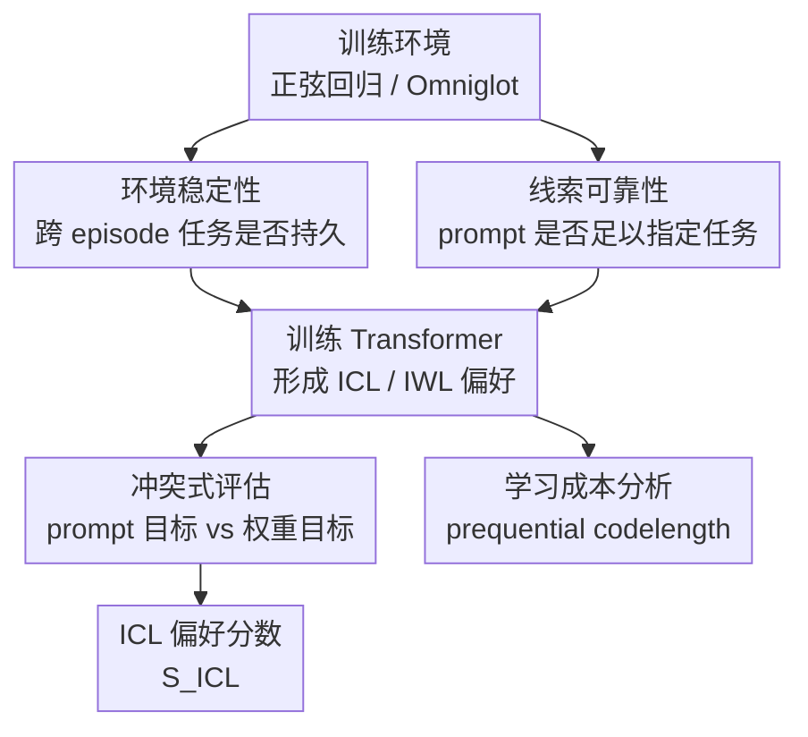

# An evolutionary perspective on modes of learning in Transformers

**会议**: ICLR 2026  
**OpenReview**: [https://openreview.net/forum?id=5ubZyHPhnK](https://openreview.net/forum?id=5ubZyHPhnK)  
**代码**: 待公开  
**领域**: 学习理论 / Transformer 学习动力学  
**关键词**: 上下文学习, 权重内学习, 环境稳定性, 线索可靠性, 学习成本

## 一句话总结
这篇论文借用演化生物学中“可塑性 vs 遗传同化”的视角，把 Transformer 在上下文学习（ICL）与权重内学习（IWL）之间的选择解释为由环境稳定性、提示线索可靠性和策略学习成本共同决定的学习动力学问题。

## 研究背景与动机
**领域现状**：Transformer 的一个核心能力是 in-context learning：模型不更新参数，只靠 prompt 里的少量样例就能在当前输入上调整推断；与之相对，in-weight learning 则是在训练过程中把规律慢慢写进参数。已有研究已经从 induction head、隐式梯度下降、贝叶斯推断、训练数据分布等角度解释 ICL 为什么会出现，但大多更关注“最终应该学成什么策略”。

**现有痛点**：真实训练过程中，ICL 和 IWL 并不是静态二选一。有些实验里 ICL 会先出现、随后被 IWL 取代；也有些任务里模型一开始更像在靠权重拟合，之后才逐渐学会利用上下文。只用“最终最优策略”解释不了这些中途转向，因为它没有回答：为什么某个策略先被学到？为什么另一个策略后来才接管？

**核心矛盾**：论文把矛盾归结为两个时间尺度上的可预测性。若任务环境长期稳定，跨训练步的信息很可靠，那么把规律固化进权重通常更划算；若环境经常变，但单个 prompt 里的线索足够可靠，那么临时根据上下文调整输出更合理。与此同时，模型不是直接跳到长期最优策略，而是会先采用更容易被当前架构和任务结构学到的低成本策略。

**本文目标**：作者希望系统操控“环境稳定性”和“线索可靠性”这两个变量，观察 Transformer 的 ICL/IWL 偏好如何变化；进一步，他们还要解释训练早期到后期的策略转移方向，即为什么有的任务呈现 ICL → IWL，有的任务呈现 IWL → ICL。

**切入角度**：论文从演化生物学中的两类适应机制出发。表型可塑性对应 ICL：同一个基因型在不同环境线索下表现出不同表型；遗传演化对应 IWL：稳定选择压力经过多代积累后被写入基因。遗传同化则对应“ICL 被 IWL 取代”：原先需要环境线索诱发的反应，后来在稳定条件下固定下来，不再依赖线索。

**核心 idea**：用演化论里的“环境波动、线索可靠性、可塑性成本”来重写 Transformer 学习动力学的解释框架：环境决定长期该偏向 ICL 还是 IWL，学习成本决定训练过程中哪个策略先出现。

## 方法详解
### 整体框架
论文不是提出一个新的大模型训练算法，而是构造两个可控的 Transformer 学习环境，专门用来拆解 ICL 与 IWL 的竞争关系。整体流程是：先把环境可预测性拆成稳定性与线索可靠性，再在正弦回归和 Omniglot 二分类中分别参数化这两个变量，最后用冲突式评估 prompt 测量模型到底更听上下文还是更信权重。

核心实验逻辑可以概括为三步。第一步，生成一系列训练 episode，每个 episode 都有 prompt 样例和 query；第二步，通过参数控制“当前任务和上一步任务是否相似”以及“prompt 标签是否可信”；第三步，在评估时故意让 prompt 暗示的任务和当前训练环境中的任务冲突，从模型预测更接近哪一边来计算 ICL 偏好分数。

### 关键设计
**1. 双时间尺度环境可预测性：把演化直觉变成可调实验变量**

论文最重要的建模选择，是把“环境是否可预测”拆成两个不等价的维度。环境稳定性描述跨训练步的目标任务是否保持不变，它对应演化中的跨世代稳定选择压力；线索可靠性描述单个 prompt 里的样例是否能准确指示当前任务，它对应生物个体一生中能否依靠环境 cue 做可塑性调整。这一拆分很关键，因为稳定环境和可靠线索都会让预测变容易，但它们支持的是不同策略：前者鼓励 IWL，后者鼓励 ICL。

在正弦回归中，每个任务是 $f_t(x)=A_t\sin(x+\phi_t)$，任务参数 $\theta_t=[A_t,\phi_t]^\top$ 通过 AR(1) 过程演化：$\theta_t=\alpha\theta_{t-1}+(1-\alpha)\tilde{\theta}_t$。这里 $\alpha$ 越接近 1，说明相邻训练步的目标函数越相似，环境越稳定；prompt 标签上的高斯噪声方差 $\sigma^2$ 越小，说明线索越可靠。在 Omniglot 中，稳定性由字符到二元标签的全局映射 $M_t$ 的持久概率控制，线索可靠性则由 prompt 标签正确概率 $\rho$ 控制。

**2. 冲突式评估：用同一个 query 同时拷问 ICL 与 IWL**

如果只看普通测试误差，很难判断模型是靠 prompt 解决任务，还是靠训练中写入参数的规律解决任务。作者因此构造了一个“让两种策略互相打架”的评估协议：评估时从先验中采样一个与当前训练任务无关的 evaluation task $f_e$，用它生成 prompt；但 query 同时也有当前训练环境对应的目标 $f_t$。这样，同一个 query 产生两个互斥答案：$y_{ICL}=f_e(x_q)$ 表示听 prompt，$y_{IWL}=f_t(x_q)$ 表示信权重。

模型输出后，作者分别计算它相对于两个目标的误差 $E_{ICL}$ 和 $E_{IWL}$，再定义 $S_{ICL}=E_{IWL}/(E_{ICL}+E_{IWL})$。这个分数接近 1，说明模型输出更靠近 prompt 指定的目标，也就是偏向 ICL；接近 0，说明输出更靠近当前训练环境中的权重目标，也就是偏向 IWL。这个指标让“学习模式”从直觉描述变成了可以跨稳定性、可靠性、训练步数作图的连续量。

**3. 两个任务域：用连续函数拟合和离散匹配制造相反的学习成本**

正弦回归和 Omniglot 不是随便选的两个 benchmark，而是分别给 ICL/IWL 设置了不同的学习难度。在正弦回归里，IWL 可以先学到一个全局正弦函数近似，哪怕它不能完美适应每个 episode；但 ICL 要在前向传播里根据 10 个样例做类似回归推断，这需要更复杂的上下文算法。因此在这个任务上，IWL 是更便宜的初始策略，ICL 往往较晚出现。

Omniglot 则反过来。每个 episode 的 query 类别会在 prompt 中出现一个匹配样例，ICL 只需要用注意力完成局部匹配并复制标签；但 IWL 要把 1623 个字符类别到二元标签的全局映射记进参数，而且映射还可能随时间改变。这让 ICL 成为更便宜的策略，IWL 的样本复杂度更高。两个任务恰好帮助作者检验同一个理论：早期策略由学习成本决定，而不是简单由长期最优性决定。

**4. 学习成本度量：用 prequential codelength 解释策略先后顺序**

为了不只停留在“某个策略看起来更难”的口头解释，论文引入 minimum description length 视角下的 prequential codelength。直观上，一个策略如果更符合任务和模型的归纳偏置，就会在训练早期更快降低负对数似然，累计损失更短；反之，即使它长期更优，也可能先付出较高学习成本。形式上，prequential codelength 是按时间顺序累积 $-\log P(y_t|x_t;\theta_{t-1})$。

作者分别构造强烈偏向 ICL 的环境和强烈偏向 IWL 的环境，计算不同策略在两个任务上的累计损失。结果与理论一致：Omniglot 中 ICL 的累计 BCE 远低于 IWL，正弦回归中 IWL 的累计 MSE 低于 ICL。更进一步，作者通过缩小 Omniglot 字符表大小降低 IWL 的记忆成本，发现学习轨迹会从原本的 ICL-first 变成 IWL-first，说明策略转移方向确实能被学习成本因果操控。

### 一个完整示例
可以把 Omniglot 任务想成一个动态的“字符暗号表”。在某个训练步 $t$，系统有一个隐藏映射 $M_t$：某个字符类别可能被标成 0，另一个类别可能被标成 1。一个 episode 给模型两个图像-标签样例，再给一个 query 图像；其中一个 prompt 图像与 query 属于同一字符类别。

若 prompt 中与 query 同类的样例标签是 0，而当前全局映射 $M_t$ 也说这个字符是 0，那么 ICL 和 IWL 会给出相同答案，无法区分策略。论文评估时会故意换成独立采样的 evaluation mapping：prompt 暗示 query 应该是 0，但训练环境当前映射可能说它应该是 1。此时模型若输出更接近 0，就说明它在复制 prompt 的局部线索；若输出更接近 1，就说明它在使用已经写进权重的全局映射。

再看训练动态。在完整 Omniglot 字符表 $|C|=1623$ 时，记住所有字符的当前标签很费样本，模型早期自然学会“找 prompt 里同类图像并复制标签”。当环境极稳定时，长时间训练后全局映射越来越值得被写入权重，于是会出现 ICL → IWL 的遗传同化式转移。若把字符表缩到 $|C|=100$，记忆成本大幅降低，模型一开始就更容易靠 IWL，轨迹也会反转。

### 损失函数 / 训练策略
模型是 4 层 decoder-only Transformer，每层 4 个注意力头，embedding 维度为 128，并使用可学习位置编码。正弦回归中，标量输入和输出用线性层投到 embedding 空间；Omniglot 中，图像先经过一个浅层 ResNet，再接 Transformer，ResNet 与 Transformer 端到端联合训练。

训练目标按任务不同设置。正弦回归使用 query 预测上的均方误差 MSE；Omniglot 二分类使用 query 标签上的 binary cross-entropy。优化器为 AdamW，峰值学习率 $1\times 10^{-4}$，前 1000 步 warmup，之后 cosine decay；每个模型训练 50000 步，batch size 为 128。参数扫描结果通常报告 3 个随机种子的均值和标准误。

## 实验关键数据

### 主实验
| 任务 | 被操控变量 | 观察到的 ICL 偏好 | 结论 |
|------|------------|-------------------|------|
| Sinusoid regression | 稳定性 $\alpha$ 从低到高，噪声方差 $\sigma^2$ 从低到高 | $\alpha\to1$ 时 $S_{ICL}$ 急剧下降；低噪声、低稳定性时 $S_{ICL}$ 更高 | 稳定环境促进 IWL，可靠 prompt 促进 ICL |
| Omniglot classification | 映射持久性 $\alpha$ 与标签正确率 $\rho$ | 大部分不稳定环境中，$\rho$ 越高，$S_{ICL}$ 越高；$\alpha\to1$ 时通常转向 IWL | 离散匹配任务同样符合“可靠线索支持 ICL、稳定环境支持 IWL” |
| Omniglot, $\rho=1$ | 环境完全稳定但 cue 完全可靠 | 仍保持较强 ICL 偏好 | 当 ICL 和 IWL 都能解题时，策略偏好会受学习成本影响，而不只受长期最优性影响 |
| 训练轨迹对比 | Omniglot 高稳定 vs Sinusoid 中等稳定 | Omniglot 呈 ICL → IWL；Sinusoid 呈 IWL → ICL | transience 方向依赖任务结构与策略学习成本 |

### 消融实验
| 配置 | 关键指标 | 说明 |
|------|---------|------|
| Sinusoid: ICL-favored 环境 | ICL 的累计 MSE 高于 IWL | 在正弦任务中，前向实现回归算法更难，ICL 学习成本高 |
| Sinusoid: IWL-favored 环境 | IWL 的 prequential codelength 更短 | 解释了为什么正弦任务早期先出现 IWL-like 策略 |
| Omniglot: 完整字符表 $|C|=1623$ | ICL 的累计 BCE 低于 IWL | 局部匹配复制比记忆大词表映射便宜，ICL 先出现 |
| Omniglot: 缩小到 $|C|=100$ | 训练早期 $S_{ICL}<0.2$，随后再转向 ICL | 降低 IWL 记忆成本后，学习轨迹从 ICL-first 反转为 IWL-first |
| Omniglot: $|C|$ 从 100 增至 1623 | 初始 ICL 偏好随词表变大而增强 | 支持“coupon collector 式样本复杂度影响 IWL 成本”的解释 |

### 关键发现
- 环境稳定性决定长期是否值得把规律固化进权重：当 $\alpha$ 接近 1 时，正弦和 Omniglot 都明显转向 IWL。
- 线索可靠性决定上下文是否值得信任：当 $\sigma^2$ 更低或 $\rho$ 更高时，模型更愿意依赖 prompt。
- ICL 并不总是“后期能力”，IWL 也不总是“基础能力”：哪个先出现，取决于任务结构让哪种策略更容易学。
- Omniglot 中完全可靠 cue 让 ICL 在稳定环境下仍能保留，说明 Transformer 的 ICL 维护成本可能不高，真正关键的是替代策略 IWL 是否难学。
- 缩小 Omniglot 字符表是全文最有说服力的因果验证：它没有改变演化解释的变量定义，而是单独降低 IWL 成本，并成功翻转了学习轨迹。

## 亮点与洞察
- 论文把 ICL/IWL 的争论从“模型有没有元学习能力”推进到“训练生态如何选择学习策略”。这个视角更像是在问训练分布对模型施加了什么环境压力，而不是只看架构内部有没有某个电路。
- 演化类比不是装饰性的。可塑性对应 ICL、遗传同化对应 ICL 被 IWL 取代、稳定环境与可靠 cue 对应两个时间尺度的信息可靠性，这些对应关系都被实验变量明确落地。
- 冲突式评估设计很干净。让 prompt 目标和权重目标互相冲突，比普通测试准确率更能揭示模型到底在用哪种策略。
- 学习成本解释了很多看似矛盾的现象。ICL transience、delayed ICL、grokking-like 晚期转变可以被统一为：模型先走便宜路，长期压力再把它推向更优路。
- 这套框架对大模型训练也有启发。如果希望模型更依赖上下文适应，就需要提供足够多变但 cue 可靠的训练环境；如果任务稳定且重复，模型自然会把规律压进参数。

## 局限与展望
- 实验环境仍然很简化。正弦回归和 Omniglot 可以精确操控变量，但与真实语言模型预训练分布之间还有很大差距，不能直接推出 LLM 在复杂文本世界中的全部 ICL/IWL 行为。
- 本文主要停留在 Marr 意义上的计算层解释：它说明“为什么某个策略合理”，但没有直接定位 Transformer 内部具体电路如何实现策略切换。
- ICL 与 IWL 被评估为两个冲突目标，但真实大模型中二者可能更连续、更混合。例如 prompt 可以激活权重中已有的任务表示，而不是简单替代权重知识。
- 论文提出 Baldwin effect 作为未来方向很有意思：早期 ICL 是否会为后续 IWL 提供脚手架，从而加速复杂任务被参数化？这可能连接 meta-learning、curriculum learning 和模型预训练设计。
- 后续工作可以把稳定性与 cue 可靠性的操控迁移到语言、代码、多任务推理或工具使用场景，检验“训练生态”是否能预测更真实的大模型策略偏好。

## 相关工作与启发
- **vs Chan et al. 2022 数据分布解释 ICL**: Chan 等工作强调训练数据分布性质会驱动 ICL 涌现；本文继承这个方向，但把分布性质进一步组织成环境稳定性和线索可靠性两个演化变量，并关注训练过程中的策略转移。
- **vs Singh et al. 2023 ICL transience**: 先前工作发现 ICL 会短暂出现后被 IWL 取代；本文用遗传同化类比解释这一现象，并补充了相反方向的 IWL → ICL，说明 transience 不是单一路径。
- **vs Von Oswald et al. 2023 隐式优化解释**: 隐式优化解释关注 Transformer 如何在前向传播里实现类似梯度下降的算法；本文更关心模型什么时候值得学这种上下文算法，以及它相对权重内解法的成本。
- **vs mechanistic ICL circuit studies**: induction head 和 pattern matching 电路能解释 ICL 的内部机制；本文提供的是生态层面的外部压力解释，两者可以互补：环境决定要不要学电路，机制研究解释电路如何形成。
- **对训练方法的启发**: 如果训练数据长期静态且 prompt cue 不可靠，模型会倾向记忆和固化；若希望模型具备更强 test-time adaptation，训练分布就应制造任务波动，同时让上下文线索足够可信。

## 评分
- 新颖性: ⭐⭐⭐⭐⭐ 演化生物学类比与 ICL/IWL 学习动力学结合得很自然，而且通过可控实验落地，不只是概念包装。
- 实验充分度: ⭐⭐⭐⭐☆ 两个任务、273 个配置、819 次训练和成本操控都很扎实，但距离真实 LLM 预训练环境仍有外推 gap。
- 写作质量: ⭐⭐⭐⭐⭐ 论文主线清楚，从演化现象到实验变量再到 transience 和成本解释，逻辑递进很好。
- 价值: ⭐⭐⭐⭐⭐ 对理解 in-context learning 的出现、消失和训练生态设计都有启发，尤其适合连接学习理论、认知科学和大模型训练研究。

<!-- RELATED:START -->

## 相关论文

- [\[ICLR 2026\] Transformers as Measure-Theoretic Associative Memory: A Statistical Perspective and Minimax Optimality](transformers_as_measure-theoretic_associative_memory_a_statistical_perspective_a.md)
- [\[ICLR 2026\] Two Failure Modes of Deep Transformers and How to Avoid Them: A Unified Theory of Signal Propagation at Initialisation](two_failure_modes_of_deep_transformers_and_how_to_avoid_them_a_unified_theory_of.md)
- [\[ICLR 2026\] Transformers with Endogenous In-Context Learning: Bias Characterization and Mitigation](transformers_with_endogenous_in-context_learning_bias_characterization_and_mitig.md)
- [\[ICLR 2026\] Continuum Transformers Perform In-Context Learning by Operator Gradient Descent](continuum_transformers_perform_in-context_learning_by_operator_gradient_descent.md)
- [\[ICLR 2026\] A Statistical Learning Perspective on Semi-dual Adversarial Neural Optimal Transport Solvers](a_statistical_learning_perspective_on_semi-dual_adversarial_neural_optimal_trans.md)

<!-- RELATED:END -->
