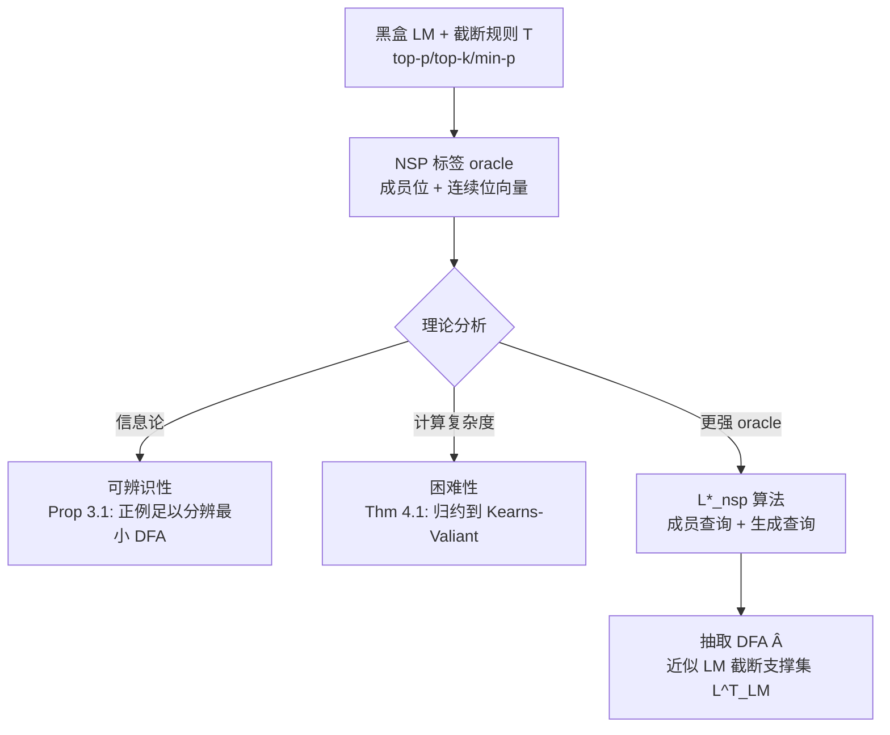

# Automata Learning and Identification of the Support of Language Models

**会议**: ICLR 2026  
**OpenReview**: [https://openreview.net/forum?id=L8SMNWsxfK](https://openreview.net/forum?id=L8SMNWsxfK)  
**代码**: 待确认  
**领域**: 学习理论 / 自动机学习  
**关键词**: DFA 学习, Next Symbol Prediction, 支撑集识别, L* 算法, PAC 学习, 语言模型可解释性  

## 一句话总结
本文在"下一符号预测 (NSP)"监督下系统刻画了正则语言的可学习性，证明 NSP 标签虽能保证可辨识却无法绕过计算困难，并提出 L*_nsp 算法——借助语言模型作为"教师"高效抽取出近似刻画其生成支撑集的 DFA。

## 研究背景与动机
- **领域现状**：语言模型 (LM) 被广泛部署，但其内部计算与"会生成哪些字符串"难以解释。一个基础问题是：能否从黑盒模型中抽取出紧凑、可解释的形式对象（如确定有限自动机 DFA），使其接受的字符串近似等于模型生成支撑集内的字符串？而自动机学习领域早有大量经典结论：从带标签样本推断 DFA 是 NP-hard，即便 (improper) PAC 学习在密码学假设下也不可行；Angluin 的 L* 算法借助成员查询+反例可多项式时间学习。
- **现有痛点**：Next Symbol Prediction (NSP) 设定——学习者对每个前缀获得"前缀本身是否在语言中"以及"哪些下一符号能导向接受串"的监督——长期被用于**实证评估**神经序列模型（LSTM、Transformer 在形式语言上的表现），但这种监督下语言的**可学习性理论**从未被建立，它与传统二分类的关系也不清楚。
- **核心矛盾**：NSP 给出的监督比二分类"更丰富"（每个前缀都有连续位向量），直觉上应该更容易学；但更丰富的监督是否真的能突破学习 DFA 的计算壁垒？另一方面，负例分布在生成模型场景下往往是人为或未定义的，传统 PAC 框架水土不服。
- **本文目标**：在计算学习理论框架内刻画 NSP 设定的可学习性（可辨识性 + 计算复杂度 + oracle 需求），并把它与"识别 LM 的（截断）支撑集"这一实际问题打通。
- **核心 idea**：**(连续位即负信息)** NSP 的连续位 $\varphi(y,\sigma)=0$ 恰恰证明 $y\sigma$ 的任何扩展都不被接受——这是"关于语言外字符串"的信息，使得仅用正例就能区分不同的最小 DFA；**(生成查询即强 oracle)** LM 的前缀条件生成天然可作为强大的查询原语，从而绕过被动学习的困难。

## 方法详解

### 整体框架
论文分三层推进。第一层（可辨识性）证明正例+NSP 标签在信息论意义上足以唯一确定最小 DFA，从而等价查询 oracle 良定义。第二层（困难性）证明即便有 NSP 标签，PAC 学习 DFA 仍是密码学困难，单靠成员查询也无法多项式时间精确辨识。第三层（带 LM 教师的学习）针对困难性提出更强的查询模型——前缀条件生成查询，并把 Angluin 的 L* 扩展为 L*_nsp，给出关于"教师分布"的分布特定 PAC 保证。NSP 学习与"学习 LM 支撑集"通过令 $f^\star=f^T_{LM}$、$D=D^T_{LM}$ 直接互通。

### 关键设计

**1. NSP 与截断支撑集的等价转换：把"抽取 LM 支撑集"形式化为可学习性问题。** 论文把字母表设为 $\Sigma=V\cup\{[\text{EOS}]\}$，截断规则 $T$（如 top-p/min-p）将前缀 $y$ 映射到可接受的下一符号集 $C_T(y)$，其中 $[\text{EOS}]\in C_T(y)$ 当且仅当 $y$ 可终止。LM 在 $T$ 下能生成的全部字符串构成截断支撑集 $L^T_{LM}$，而 NSP oracle 自然定义为 $L^T_{LM}(y)=\mathbb{I}[[\text{EOS}]\in C_T(y)]$、$\varphi_T(y,\sigma)=\mathbb{I}[\sigma\in C_T(y)]$。这一对应的妙处在于：任何能从 NSP 标签正例学到低误差 $\hat f$ 的 PAC 学习器，代入 $f^\star=f^T_{LM}$、$D=D^T_{LM}$ 后**立刻**给出学习 LM 截断支撑集的过程，且成员查询与典型样本 oracle 都能用黑盒 LM 模拟，让纯理论与实际抽取无缝衔接。

**2. 用连续位实现仅正例可辨识：证明 NSP 标签的信息论充分性。** 仅有正例（即便附带前缀成员位）不足以辨识语言——反例如 $L_A=\Sigma^*$ 与 $L_{A^\star}=1^*$，所有 $1^*$ 中的正例对两者都接受。关键突破是连续位携带"语言外"信息：$\varphi(y,\sigma)=0$ 证明 $y\sigma$ 的所有扩展都被拒。论文据此证明 Proposition 3.1——任意两个不同的最小 DFA $A\neq A^\star$（$L_{A^\star}\neq\varnothing$）必存在某个 $x\in L_{A^\star}$ 使 $f_A(x)\neq f_{A^\star}(x)$。两个直接推论是：存在有限**教学集** $S\subseteq L_{A^\star}$ 唯一确定 $A^\star$；以及 NSP 设定下**等价查询 oracle 良定义**（要么返回"等价"，要么返回一个正反例），这是精确学习可行的前提。

**3. 困难性归约：证明更丰富的监督也无法突破密码学壁垒。** 尽管连续位对某些类（如合取式 Conjunctions，一个正例即可恢复目标单项式）极有信息量，论文却证明对一般 DFA 无济于事。Theorem 4.1 表明：若布尔无环 DFA 类 $\text{ADFA}^N_{p(N)}$ 在 NSP 设定下可高效 PAC 学习，则它在传统二分类下也可高效学习——而后者在密码学假设下已知困难 (Kearns & Valiant 1994)。核心技术构造是：对任意 ADFA，可构造一个仅多 $N+1$ 个状态的 ADFA，使**除一个连续位外全部连续位变得无信息**，于是准确预测那唯一有信息的位就和传统二分类下学 ADFA 一样难。该困难性是 improper 的——连假设无需是 DFA（如神经网络拟合 NSP 标签）也躲不开；且对单纯成员查询 $MQ_{nsp}$，某些自然 DFA 族仍无法多项式时间辨识。

**4. L*_nsp：用连续位反例改造 L* 的反例处理。** 面对困难性，论文转向更强但仍实际可得的查询模型：除成员查询 $MQ(x)$ 外，加入生成查询 $\text{Gen}_{D_{LM}}(x)$——以 $x$ 为提示按 $D_{LM}$ 条件生成带 NSP 标签的有效串，二者都能用黑盒 LM 模拟。L* 维护访问词集 $Q$ 与测试词集 $T$，靠"闭合 + 反例处理"迭代加状态。NSP 设定的难点是反例可能来自连续位而非成员位，经典 Lemma G.3 不适用。L*_nsp 的核心改造（Lemma 5.1）是**把任意 NSP 标签失配转化为普通成员失配**：取首个失配前缀 $x_{:n}$，若是成员位失配则直接用 $x'=x_{:n}$；若连续位失配且目标说 $\sigma$ 永不可达接受而假设说可达，则沿假设找一条到接受态的后缀 $s$，令 $x'=x_{:n}\cdot s$；若目标说 $\sigma$ 可行而假设说禁止，则用**一次生成查询**以 $x_{:n}\sigma$ 为条件取得有效续写 $y$，令 $x'=x_{:n}\sigma y$。两种情形都得到 $\hat A(x')\neq A^\star(x')$ 的普通失配串，再套用经典更新加入新的访问/测试词，每次失配至少加一个状态，因 $|Q|\le|A^\star|$ 算法至多 $|A^\star|$ 次失配后终止。最终 Theorem 5.2 给出关于 $D_{LM}$ 的分布特定 PAC 保证：以概率 $\ge1-\delta$ 输出 $\hat A$ 满足 $\mathbb{E}_{x\sim D_{LM}}[\|f_{\hat A}(x)-f_{A^\star}(x)\|_\infty]\le\epsilon$，运行时间多项式于 $n,1/\epsilon,1/\delta$ 及生成串最大长度。

## 实验关键数据

### 主实验设置与结果
在 11 个正则语言（状态数 2–86）上评估 L*_nsp 从 Transformer 教师抽取 DFA：6 个 Tomita 文法、Parity、4 个有界 Dyck 语言 DYCK-(2,2)/(2,4)/(3,3)/(4,3)。Transformer 为 8 层、宽 512，用 AdamW 训至 40k 步早停；用 min-p 采样（阈值 $p=0.05$）生成长度 ≤80 的训练串，样本量取 {1, 5, 10, 100, 1000}，每个规模 10 次独立试验。

| 任务族 | 目标状态数 | 收敛所需样本 | 关键现象 |
|--------|-----------|-------------|---------|
| Tomita (well-trained) | 2–5 | 1 个正例常已足够 | 通常 1 秒内恢复目标 DFA |
| Bounded Dyck | 8–86 | ≤100 例 | 收敛到目标 DFA，NSP 准确率近乎完美 |
| Parity / Tomita-5 (imperfect) | 较大 | — | 抽出更大 DFA、耗时更长，但状态数始终 $\le$ 教师支撑集 |

### 消融实验
NSP 标签 vs 二分类标签（经典 L*）在 6 个语言上对比，从模型未截断分布采样并按 min-p 截断支撑集打正/负标签（≈99.5% 为负）：

| 设定 | 标签类型 | 在 Dyck（含死状态转移）上的表现 |
|------|---------|------------------------------|
| 经典 L* | 仅二分类 | 状态数随样本增长慢、样本复杂度高 |
| L*_nsp | NSP（含连续位） | 连续位被大量使用，更快识别状态、样本复杂度显著更优 |

### 关键发现
- **连续位在含死状态转移的语言（如有界 Dyck）上被重度使用**，带来相对纯二分类标签的样本复杂度提升（App. H.4 Table 3）。
- **抽取的状态数恒 $\le$ 教师支撑集的目标状态数**——L*_nsp 只在找到区分串后才加状态，因此即使比目标 DFA 多出状态，结果仍忠实于"语言教师的支撑集"。
- 当 $\hat A\neq A^\star$ 时，构造乘积 DFA $B$ 识别对称差 $L(\hat A)\triangle L(A^\star)$，用 BFS 找出 LM 的**系统性错误样本**（Parity、Tomita-5、Dyck 上均给出实例），这些模型并非故意训坏，更长训练可避免此类错误。

## 亮点与洞察
- **把"可解释性抽取"翻译成干净的可学习性问题**：NSP↔截断支撑集的对应让"从 LM 抽 DFA"有了 PAC 框架，且所有 oracle 都能黑盒模拟，理论与工程不脱节。
- **正负结果都讲透了**：连续位带来信息论可辨识（正面）却挡不住计算困难（负面），这种"信息够但算不动"的精细刻画，比单纯报喜或报忧更有洞见。
- **分布特定保证恰好对症生成模型**：传统 L* 需要人造负例分布，而本文以 LM 自身诱导分布为目标，正是"预测 LM 会不会生成错误串"最相关的分布。
- **错误样本挖掘有实用价值**：用对称差 + BFS 把抽取出的 DFA 转化为 LM 的 bug 定位工具，是理论之外的落地点。

## 局限与展望
- **限于正则语言/DFA**：方法假设 LM 支撑集是正则语言，对自然语言这类非正则、上下文相关的真实分布如何推广仍是开放问题。
- **依赖合成小规模语言**：实验在 2–86 状态的合成文法上，Transformer 也是专门训练的；面向真实大模型、大字母表（词表数万）时，生成查询次数与抽取规模能否可控未验证。
- **截断规则强耦合**：支撑集定义依赖具体截断策略 $T$（min-p 阈值等），不同采样设置下抽取结果会变，缺乏对截断超参敏感性的系统分析。
- **困难性仍在**：理论上一般 DFA 在 NSP 下依旧密码学困难，L*_nsp 的高效性靠的是更强的生成查询假设，何时该假设在真实 LM 上"足够强"值得进一步刻画。

## 相关工作与启发
- **DFA 可学习性经典线**：Gold 1978、Angluin 1978、Pitt & Warmuth 1993（NP-hard）、Kearns & Valiant 1994（密码学困难）、Angluin 1987（L* + MAT 框架），本文在"学习 LM 支撑集"这一新设定下刻画可学习性并衔接了对神经网络的实证分析。
- **从神经模型抽自动机**：Giles 1992、Omlin & Giles 1996 开端，Weiss et al. 2018 基于 L* 的白盒抽取，以及加权自动机/PDFA (Weiss 2019, Wei 2024) 与 Transformer 分类器的 L*-like 方法 (Zhang 2024)；本文聚焦**支撑集识别**，给出 L* 的可证明扩展。
- **启发**：连续位作为"负信息"的思想，可迁移到其他"只有正例 + 结构约束"的学习场景；用生成查询作强 oracle 绕过被动学习困难，也是利用现代 LM 能力做形式化分析的可复用范式。

## 评分
- **新颖性**: ⭐⭐⭐⭐⭐ — 首次在 NSP 设定下建立正则语言可学习性理论，并把它与 LM 支撑集识别打通，视角清新。
- **实验充分度**: ⭐⭐⭐⭐ — 11 个语言、多样本量、含消融与错误样本挖掘，论证扎实；但局限于合成小规模语言。
- **写作质量**: ⭐⭐⭐⭐⭐ — 定义清晰、正负结果层次分明、动机与定理衔接顺畅。
- **价值**: ⭐⭐⭐⭐ — 为 LM 可解释性提供了可证明的形式化工具，且抽取-纠错的落地点明确。

<!-- RELATED:START -->

## 相关论文

- [\[ICLR 2026\] Language Identification in the Limit with Computational Trace](language_identification_in_the_limit_with_computational_trace.md)
- [\[ICLR 2026\] Unveiling the Basin-like Loss Landscape in Large Language Models](unveiling_the_basin-like_loss_landscape_in_large_language_models.md)
- [\[ICLR 2026\] FlowNIB: An Information Bottleneck Analysis of Bidirectional vs. Unidirectional Language Models](flownib_an_information_bottleneck_analysis_of_bidirectional_vs_unidirectional_la.md)
- [\[ICLR 2026\] Diffusion Language Models are Provably Optimal Parallel Samplers](diffusion_language_models_are_provably_optimal_parallel_samplers.md)
- [\[ICLR 2026\] Learning Correlated Reward Models: Statistical Barriers and Opportunities](learning_correlated_reward_models_statistical_barriers_and_opportunities.md)

<!-- RELATED:END -->
