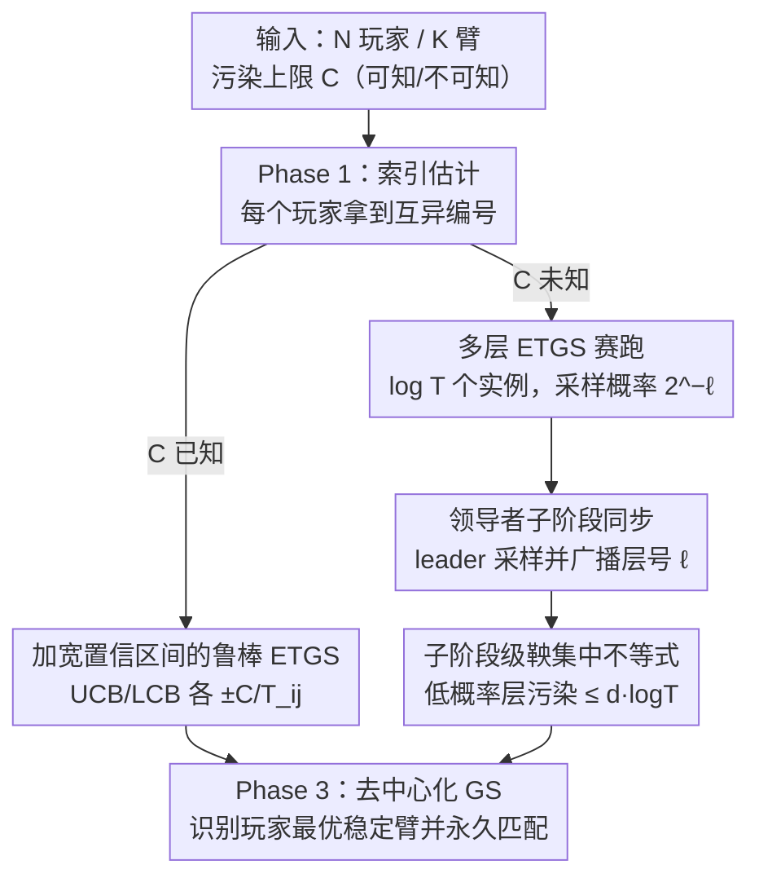

# Bandit Learning in Matching Markets Robust to Adversarial Corruptions

**会议**: ICLR2026  
**OpenReview**: [https://openreview.net/forum?id=CoWJc5ofDO](https://openreview.net/forum?id=CoWJc5ofDO)  
**代码**: 待确认  
**领域**: 学习理论 / 在线学习 / 多臂老虎机  
**关键词**: 匹配市场, 多臂老虎机, 对抗污染, 鲁棒在线学习, 遗憾界

## 一句话总结
这篇论文首次研究"反馈被对手污染"下的去中心化双边匹配市场 bandit 学习问题，分别针对污染总量 $C$ 已知和未知两种情形给出鲁棒算法——已知时把经典 ETGS 的置信区间按 $C$ 加宽，未知时用"多层 ETGS 赛跑 + 子阶段级同步"自适应抵御任意污染，并证明两者的玩家最优稳定遗憾上界与一个匹配的下界。

## 研究背景与动机
**领域现状**：双边匹配市场（雇主-工人、乘客-司机、众包平台等）的核心目标是找到一个**稳定匹配**——没有任何一对玩家-臂愿意背叛当前搭档去配对。现实中玩家（一侧参与者）事先并不知道自己对各个臂（另一侧）的真实偏好，只能通过反复在线匹配、观察随机奖励来学习偏好排序，这正好被建模成多臂老虎机（MAB）：玩家就是 bandit 的学习者，臂的奖励分布对应未知偏好。代表性算法是 Kong & Li (2023) 的 Explore-Then-Gale-Shapley（ETGS）——先用 Round-Robin 充分探索估准偏好，再用离线 Gale-Shapley 算出最优稳定匹配。

**现有痛点**：几乎所有现有匹配市场 bandit 算法都假设玩家收到的反馈忠实地服从真实偏好模型（奖励来自固定分布）。但现实里反馈可能被外部噪声或**蓄意操纵**破坏：服务器资源分配里某些节点在测试期故意表现超常以骗取更多资源；广告里竞争对手用点击农场刷虚假点击率。这些被污染的信号会严重扭曲玩家对真实偏好的估计，而现有算法**完全没有防御机制**——一旦反馈被污染就再也收敛不到真稳定匹配。

**核心矛盾**：作者证明 ETGS 在对抗污染下**极其脆弱**。由于 ETGS 的提臂顺序是确定性的 Round-Robin，一个自适应对手观察到玩家过往的匹配和随机奖励后，可以系统性地只污染 $p_i$ 的最优臂，逼它一直去配次优臂。这种操纵只需 $O(\log T/\Delta^2)$ 轮就能生效，最终造成 $O(T)$ 的线性遗憾。一个自然的补救是引入随机性（随机化是 bandit 抗污染的经典手段），但在去中心化市场里玩家若各自独立随机化，就会**频繁撞臂**（matching conflict），探索效率反而崩溃。于是出现了"确定性→被定点打击 vs 随机化→撞臂"的两难。

**本文目标**：在去中心化、玩家间几乎不能通信的设定下，设计对**任意级别**对抗污染都鲁棒、且随污染量增大性能**优雅退化**的匹配市场 bandit 算法，覆盖污染总量 $C$ 已知和未知两种情形，并给出可证明的遗憾界。

**切入角度**：把匹配市场反馈污染建模成"带对抗污染的随机 MAB"（Lykouris et al. 2018 那条线），然后想办法把单玩家随机 MAB 的抗污染思想（多实例 + 不同采样概率）嫁接到 ETGS 上，同时用一个**领导者同步机制**消解去中心化随机化带来的撞臂。

**核心 idea**：维护 $\log T$ 个学习速率不同的 ETGS 实例"赛跑"——采样概率越低的实例统计上经历的污染越少、越精确；用一个被选出的 leader 在每个子阶段末统一采样并广播该用哪一层，强制所有玩家锁在同一实例上，从而既容忍污染又消除撞臂。

## 方法详解

### 整体框架
算法整体沿用 ETGS 的三相结构：**Phase 1 索引估计**（$N$ 轮迭代，给每个玩家分配一个互异的编号，靠是否被单一偏好臂 $a_1$ 接受来区分，保证后续 Round-Robin 不撞臂）→ **Phase 2 偏好学习**（核心创新所在，估计每个玩家对前 $N$ 个臂的偏好排序）→ **Phase 3 稳定匹配识别**（用去中心化离线 Gale-Shapley 把估好的排序落成最优稳定臂，并在剩余所有轮永久配对）。Phase 1、3 与原 ETGS 基本一致，本文所有改动都集中在 **Phase 2**。

针对污染总量 $C$ 是否已知，Phase 2 有两套设计：$C$ 已知时是"加宽置信区间的鲁棒 ETGS"（热身版，Algorithm 1）；$C$ 未知时是主算法"多层 ETGS 赛跑"（Algorithm 2），后者由"多实例抗污染 + 领导者子阶段同步 + 通信/学习权衡下的最优子阶段长 + 子阶段级鞅集中不等式"四块拼成。

### 关键设计

**1. ETGS 在确定性 Round-Robin 下的脆弱性诊断：先把问题坐实**

方法的出发点是一个负面结论：原始 ETGS 的提臂完全确定，自适应对手能据此精确锁定每个玩家的最优臂施加污染。作者指出对手只需把污染集中在 $p_i$ 当前最优臂上，制造一个"假偏好反转"，就能让 $p_i$ 持续误配次优臂；由于 ETGS 只要 $O(\log T/\Delta^2)$ 轮探索就会"定型"，污染同样只需这个量级即可生效，导致 $O(T)$ 线性遗憾。这条诊断既说明了为什么必须引入随机性，也解释了为什么不能简单照搬单玩家随机化方案——去中心化下独立随机化会撞臂。这一对张力直接决定了后面所有设计。

**2. 加宽置信区间的鲁棒 ETGS：$C$ 已知时按最坏污染撑大置信半径**

当污染总量 $C$ 已知，思路最直接：把被污染奖励拆成真实随机项加污染项 $r_{i,j}(t)=r^S_{i,j}(t)+c_{i,j}(t)$，既然 $\sum_t \max_j |c_{i,j}(t)|\le C$，那么单臂 $a_j$ 上的累计污染至多把均值估计偏移 $C/T_{i,j}$（$T_{i,j}$ 是该臂被观测次数）。于是把置信区间在标准 $\sqrt{6\log T/T_{i,j}}$ 之外再各加宽 $C/T_{i,j}$：

$$\mathrm{UCB}_{i,j}=\hat\mu_{i,j}+\sqrt{\frac{6\log T}{T_{i,j}}}+\frac{C}{T_{i,j}},\qquad \mathrm{LCB}_{i,j}=\hat\mu_{i,j}-\sqrt{\frac{6\log T}{T_{i,j}}}-\frac{C}{T_{i,j}}.$$

当两个臂的置信集不相交（$\mathrm{LCB}_{i,j}>\mathrm{UCB}_{i,j'}$ 或反之）就能判定偏好。Phase 2 仍按子阶段推进、子阶段 $k$ 含 $2^k$ 轮探索加一轮 monitoring（检查偏好是否已估准）。这套加宽保证即使对手把全部预算砸在一处也不会误判，代价是遗憾里多出一个**与 $T$ 无关的可加项** $KC/\Delta$。其玩家最优稳定遗憾上界为

$$\mathrm{Reg}_i(T)=O\!\Big(\frac{K\log T}{\Delta^2}+\frac{KC}{\Delta}\Big),$$

通信开销仍是 $O(\log(\log T/\Delta^2+KC/\Delta))$ 量级，与原 ETGS 同阶。这一节是热身，但它定下了"污染以可加项形式进遗憾"这个理想目标，后面未知 $C$ 的算法就是要逼近它。

**3. 多层 ETGS 赛跑 + 领导者子阶段同步：$C$ 未知时既容忍污染又不撞臂**

$C$ 未知时无法直接定置信半径。作者仿照 Lykouris et al. (2018) 引入 $\log T$ 个 ETGS 实例（层），给第 $\ell$ 层分配采样概率正比于 $2^{-\ell}$，每个子阶段只激活被采样到的那一层来收集反馈、更新它**自己**的统计 $\hat\mu^\ell_{i,j},T^\ell_{i,j}$。直觉是：采样概率越低的层被对手"命中"的机会越少，因而越鲁棒、也越慢越准。称为"赛跑"是因为多层在竞相估准偏好——哪一层先对所有玩家估准就跑离线 GS 算出该层的最优稳定匹配 $\sigma^\ell$；且一旦第 $\ell$ 层定下 $\sigma^\ell$，所有更快的层 $\ell'\le\ell$ 的稳定匹配都被改写成 $\sigma^\ell$（因为低采样概率的层更慢但更精确，用它校正快层）。

但多实例直接落到去中心化市场会撞臂：玩家各自随机选层会导致同一轮选到不同实例、Round-Robin 失效。**核心补丁是子阶段级同步机制**——Phase 1 结束时把第一个拿到索引的玩家（player 1）选为 leader，**只有 leader** 在每个子阶段末按 $2^{-\ell}$ 采样层号 $\ell$，再通过"在预定的未来某轮提某个特定臂" $c_k=\lfloor\ell\rfloor$ 轮把层号广播给其他玩家，保证下一个子阶段全体锁在同一层、按该层 Round-Robin 提臂，彻底消除撞臂。这把"随机化抗污染"和"去中心化不撞臂"两个本来打架的需求同时满足了，是本文相对单玩家方案最关键的工程化创新。

**4. 子阶段级鞅集中不等式 + 通信/学习效率权衡：给未知 $C$ 配出有原则的置信半径与最优子阶段长**

同步机制把"每轮采样"改成了"每子阶段采样一次"，导致 Lykouris et al. (2018) 那个针对逐轮采样的鞅集中不等式**不再适用**。作者新推了一个**子阶段级鞅集中不等式**（Lemma 3.3）：采样概率低于 $1/C$ 的那层，在探索阶段累计经历的污染以高概率（$\ge 1-1/T$）被界为 $d\log T+2$，其中 $d$ 是固定子阶段长。据此可把第 $\ell$ 层的置信半径定为 $\sqrt{6\log T/T^\ell_{i,j}}+(2d\log T)/T^\ell_{i,j}$，对应

$$\mathrm{UCB}^\ell_{i,j}=\hat\mu^\ell_{i,j}+\sqrt{\frac{6\log T}{T^\ell_{i,j}}}+\frac{2d\log T}{T^\ell_{i,j}},\qquad \mathrm{LCB}^\ell_{i,j}=\hat\mu^\ell_{i,j}-\sqrt{\frac{6\log T}{T^\ell_{i,j}}}-\frac{2d\log T}{T^\ell_{i,j}}.$$

这里 $d$ 暴露一个**本质权衡**：$d=1$ 退化成逐轮采样、leader 每轮都得通信，通信开销巨大；增大 $d$ 省通信，但会放大单个子阶段内被选层经历的污染（Lemma 3.4），损害学习效率。作者对遗憾上界关于 $d$ 求极小，得到最优子阶段长 $d=O(\sqrt{\log T})$。

### 损失函数 / 训练策略
理论论文无训练损失，核心是遗憾分析。多层 ETGS 赛跑的玩家最优稳定遗憾上界（Theorem 3.4）为

$$\mathrm{Reg}_i(T)\le O\!\Big(\frac{Kd\log T(\log T+C)}{\Delta}+\frac{K\log^2 T(\log T+C)}{d\Delta^2}+\frac{K\log^2 T(\log T+C)}{\Delta}\Big),$$

代入最优 $d=O(\sqrt{\log T})$ 后化简为 $O\!\big(K\log^{1.5}T(\log T+C)/\Delta^2+K\log^2 T(\log T+C)/\Delta\big)$。上界由三项构成：Term (a) 是 Phase 1/3 与坏集中事件的遗憾；Term (b) 是各子阶段内探索的遗憾；Term (c) 是子阶段间通信开销带来的遗憾。证明思路（proof sketch）抓住一个关键层 $\ell^*=\arg\min_\ell[2^\ell>C]$：采样概率满足 $2^{-r}\le1/C$ 的层 $r$ 经历的污染至多 $O(d\log T)$，可视作"纯随机无污染"；比 $\ell^*$ 快的层 $\ell'<\ell^*$ 一旦 $\ell^*$ 定下 $\sigma^{\ell^*}$ 就被校正、后续不再产生遗憾，其额外多玩次优臂的次数期望上至多比 $\ell^*$ 多 $C$ 次，据此把不鲁棒层的遗憾也界住。特例：$C=0$ 时退化为 $O(K\log^{2.5}T/\Delta^2+K\log^3 T/\Delta)$（多出的 $\log^2 T$ 来自跑 $\log T$ 个实例和同步通信）；$N=1$ 时无需同步，遗憾降到 $O(K\log T(\log T+C)/\Delta)$。

## 实验关键数据

### 仿真设置与主实验
理论验证型仿真：$N=K=5$，偏好排序为随机排列，相邻排名臂的偏好差固定 $0.2$，反馈服从均值 $\mu_{i,j}$、方差 $1$ 的高斯分布，污染策略取自 Wang et al. (2024)，报告所有玩家中**最大累计玩家最优稳定遗憾**，10 次独立运行取平均（带标准误）。在 $C=4000$、$T=500000$ 下对比 Vanilla ETGS、Phased ETC、AETGS-E 三个 baseline（都能在去中心化市场达到玩家最优稳定遗憾）。

| 设定 | 对比对象 | 本文两个算法表现 |
|------|----------|------------------|
| $C=4000,\ T=5\times10^5$ | Vanilla ETGS / Phased ETC / AETGS-E | 加宽 ETGS 与多层 ETGS 赛跑累计遗憾**最低**（Fig. 1(a)） |

直观对照两套算法的阶（Table 1）：

| 设定 | 遗憾界 | 通信开销 |
|------|--------|----------|
| $C$ 已知 | $O(K\log T/\Delta^2+KC/\Delta)$ | $O(\log(K\log T/\Delta^2+KC/\Delta))$ |
| $C$ 未知 | $O\!\big(K(\log T+C)\log^{1.5}T(1/\Delta^2+\sqrt{\log T}/\Delta)\big)$ | 与遗憾同阶（子阶段长为常数） |

### 消融实验

| 配置 | 关键观察 | 说明 |
|------|---------|------|
| 改变 $C\in\{1000,2000,4000\}$（Fig. 1(b)） | 遗憾随 $C$ 增大而增大；同预算下"已知 $C$"优于"未知 $C$" | 验证污染以可加/可控方式进遗憾，先验知识有帮助 |
| 固定 $C=1000$，$d\in\{1,10,50\}$（Fig. 1(c)） | $d=10,50$ 明显变差 | 印证通信/学习效率权衡：$d$ 太大放大子阶段内污染 |
| $d\in\{1,2,4,6,8\}$（Fig. 1(d)） | $d=4$ 最优 | 与理论 $d=O(\sqrt{\log T})\approx4.3$ 吻合 |

### 关键发现
- 两个所提算法在强污染（$C=4000$）下都稳稳压过所有 baseline，说明"加宽置信区间 / 多层赛跑"确实把对手定点打击的伤害压住了。
- 子阶段长 $d$ 的实验最有信息量：实测最优 $d=4$ 几乎正中理论预测 $\sqrt{\log T}\approx4.3$，是理论与仿真互相印证的漂亮一笔。
- "已知 $C$ 优于未知 $C$"量化了先验信息的价值——未知情形为估 $C$ 多付一个 $\log^2 T$ 的乘性代价。

## 亮点与洞察
- **领导者子阶段同步**是把单玩家随机化抗污染思想搬进去中心化匹配市场的关键钥匙：用一个 leader 集中采样 + 通过提臂广播层号，一举消除了"独立随机化必然撞臂"这个老大难，思路可迁移到其他需要在去中心化多智能体里复用单智能体随机化算法的场景。
- **子阶段级鞅集中不等式**是被同步机制"逼"出来的新工具：现有逐轮采样的集中不等式直接失效，作者重新推导后才得到有原则的置信半径——提醒我们换了采样粒度，集中分析往往要重做而非套用。
- **通信开销与学习效率的权衡 + 闭式最优 $d=O(\sqrt{\log T})$** 把一个工程参数纳入理论最优化，且仿真精确命中，是这类"理论指导调参"工作里少见的干净结果。
- 脆弱性诊断"$O(\log T/\Delta^2)$ 轮污染即造成 $O(T)$ 遗憾"很有画面感，清楚说明了确定性 Round-Robin 为何是软肋。

## 局限与展望
- 作者承认未知 $C$ 算法的遗憾上界比下界多一个**乘性 $\log^2 T$ 因子**（来自同时跑 $\log T$ 个实例和每子阶段末至多 $\log T$ 轮同步通信），未来方向是设计通信效率高得多的鲁棒算法。
- 上界与下界之间还存在 $\Delta$ 与 $\tilde\Delta$ 两种偏好间隙定义的失配——作者指出这是匹配市场（即便无污染）的一个**根本性开放问题**，反映了去中心化探索协调的内在代价，本文未解决。
- 仿真规模很小（$N=K=5$），且只用单一污染策略（Wang et al. 2024），更大市场、更强/更多样对手策略下的表现未验证。
- 依赖一个可靠 leader 与无误通信信道（靠提臂广播层号）；若 leader 本身可被攻击或广播被干扰，同步机制的鲁棒性存疑，论文未讨论。

## 相关工作与启发
- **vs Vanilla ETGS (Kong & Li, 2023)**：ETGS 用确定性 Round-Robin + 离线 GS，在无污染下高效，但确定性使它被自适应对手定点打击导致线性遗憾；本文在其上加宽置信区间（已知 $C$）或叠多层随机实例（未知 $C$），用可加的 $C$ 项换来鲁棒性。
- **vs 单玩家随机化抗污染 bandit (Lykouris et al., 2018)**：那条线用多实例 + 不同采样概率抗对抗污染，但针对单玩家逐轮采样；本文把它搬到多玩家去中心化匹配市场，靠领导者同步解决撞臂、靠子阶段级鞅不等式重建集中界，是非平凡的跨设定迁移。
- **vs 匹配市场遗憾下界 (Sankararaman et al., 2021)**：本文沿用其 OSB（Optimally Stable Bandits）构造并结合 Gupta et al. (2019) 的污染下界技术，给出 $\mathrm{Reg}_i(T)\ge\Omega\big(\max\{(i-1)(\log T/\tilde\Delta^2+C/K),\,K\log T/\tilde\Delta+C\}\big)$，从而说明已知 $C$ 算法近最优。

## 评分
- 新颖性: ⭐⭐⭐⭐⭐ 首次把对抗污染引入去中心化匹配市场 bandit，领导者同步 + 子阶段级鞅不等式都是为该设定新造的工具
- 实验充分度: ⭐⭐⭐ 仿真清晰且精准印证理论（尤其最优 $d$），但规模小、污染策略单一，作为理论论文够用但不出彩
- 写作质量: ⭐⭐⭐⭐ 三相结构、两套设定、上下界层层递进，脆弱性诊断与权衡分析讲得清楚
- 价值: ⭐⭐⭐⭐ 为安全攸关的匹配市场（劳动力、资源分配）提供了首个可证明鲁棒的学习框架，并留下 $\Delta/\tilde\Delta$ 失配与通信效率两个明确开放问题

<!-- RELATED:START -->

## 相关论文

- [\[ICLR 2026\] Online Conformal Prediction with Adversarial Semi-bandit Feedback via Regret Minimization](online_conformal_prediction_with_adversarial_semi-bandit_feedback_via_regret_min.md)
- [\[ICLR 2026\] Laplacian Kernelized Bandit](laplacian_kernelized_bandit.md)
- [\[ICML 2026\] Bandit Social Learning with Exploration Episodes](../../ICML2026/learning_theory/bandit_social_learning_with_exploration_episodes.md)
- [\[ICLR 2026\] Noise Tolerance of Distributionally Robust Learning](noise_tolerance_of_distributionally_robust_learning.md)
- [\[ICLR 2026\] A Faster Parameter-Free Regret Matching Algorithm](a_faster_parameter-free_regret_matching_algorithm.md)

<!-- RELATED:END -->
