# Bandits with Single-Peaked Preferences and Limited Resources

**会议**: ICLR 2026  
**OpenReview**: [https://openreview.net/forum?id=0SNfofDIRF](https://openreview.net/forum?id=0SNfofDIRF)  
**代码**: [https://github.com/GurKeinan/code-for-Bandits-with-Single-Peaked-Preferences-and-Limited-Resources-paper](https://github.com/GurKeinan/code-for-Bandits-with-Single-Peaked-Preferences-and-Limited-Resources-paper)  
**领域**: 组合多臂老虎机 / 在线学习理论  
**关键词**: 单峰偏好, 预算约束匹配, 组合 bandit, PQ 树, 后悔界, NP 难  

## 一句话总结
把社会选择理论里的「单峰偏好」结构搬进有预算约束的在线匹配 bandit，绕开一般情形的 NP 难，给出多项式时间且后悔为 $\tilde{O}(UK T^{2/3})$（结构未知）或 $\tilde{O}(U\sqrt{TK})$（结构已知）的高效算法。

## 研究背景与动机
**领域现状**：现代推荐系统要在「学习每个用户偏好」和「满足全局资源约束」之间权衡——比如内容平台每天要在预算内挑选一批创作者（每个有不同成本），再把用户匹配到这些创作者的内容上。这天然落在组合多臂老虎机（combinatorial MAB）框架里：决策者要选一个结构化的动作集合（给每个用户分配一个 arm），最大化累计满意度。

**现有痛点**：一般情形下，即便是离线版本——给定期望奖励矩阵 $\Theta$ 求最优可行匹配——也是 NP 难的（本文 Theorem 1 证明在任何优于 $1-1/e$ 的因子内近似都 NP 难）。这意味着任何能拿到次线性 standard regret 的高效在线算法都不可能存在。于是传统做法退而求其次，用 **$\alpha$-regret**：只跟「最优的可高效计算的近似解」比，而不是跟真正的最优比。这是一个明显更弱的保证，在高风险或高度结构化场景里并不令人满意。

**核心矛盾**：要么坚持 standard regret 但被 NP 难卡死，要么用高效算法但只能拿到弱化的 $\alpha$-regret。能否找到一个既自然又能打破计算壁垒的结构假设，让二者兼得？

**本文目标**：在偏好矩阵 $\Theta$ 上引入单峰（single-peaked, SP）结构——存在某个 arm 的全序，使每个用户的效用沿这个序「先升后降」（unimodal）。SP 是社会选择理论自 Black (1948) 以来研究极透的结构（选民沿意识形态谱、消费者沿单一属性、用户沿内容类型相似度），它历史上多次把投票里的 NP 难问题变成多项式可解。本文要证明：在带预算约束的基数匹配模型里，SP 同样能把计算难题变高效，且不牺牲后悔率。

**核心 idea（计算可解但统计照样难）**：本文一个反直觉的关键洞察是——**SP 结构只简化「计算」不简化「统计」**。即使 SP 序和用户峰位都已知，最坏情形后悔仍是 $\Omega(U\sqrt{TK})$，跟一般偏好的下界一样。所以单峰的价值纯粹在于「让 NP 难变多项式」，探索-利用的本质难度丝毫不减。

## 方法详解

### 整体框架
论文围绕 CBR（Constrained Bandit Recommendation）问题展开：$U$ 个用户、$K$ 个 arm，每个 arm $k$ 有成本 $c_k$，每轮选出的 arm 总成本不超过预算 $B$，然后把每个用户匹配到一个被选 arm 上，最大化 $T$ 轮累计满意度。技术栈分三层递进：先解决**离线**最优匹配（SP-MATCHING，动态规划），再处理**结构已知**的在线情形（MVM，乐观 UCB），最后攻克**结构未知**的在线情形（EMC，explore-then-commit + PQ 树恢复序）。

```mermaid
flowchart TD
    A[CBR 问题: U 用户 / K arms / 预算 B] --> B{单峰 SP 结构?}
    B -->|否, NP 难| Z[只能 α-regret]
    B -->|是| C[SP-MATCHING<br/>离线 DP 最优匹配<br/>O&#40;K²U+K²B&#41;]
    C --> D{SP 序与峰位已知?}
    D -->|已知| E[MVM: 乐观 UCB + 极大矩阵<br/>regret Õ&#40;U√TK&#41;]
    D -->|未知| F[EMC: explore-then-commit]
    F --> G[EXTRACT-ORDER<br/>PQ 树恢复近似 SP 序]
    G --> H[投影到近邻 SP 矩阵<br/>再调 SP-MATCHING]
    H --> I[regret Õ&#40;UK T^2/3&#41;]
```

### 关键设计

**1. SP-MATCHING：用「就近峰位」把 NP 难匹配降成 DP。** 离线最优匹配的突破口是 Lemma 4——给定已选 arm 子集 $S$，最优匹配会把每个用户分到 $S$ 中**离其峰位最近**的 arm（若峰位落在两个被选 arm $k_j, k_{j+1}$ 之间，则二选一）。这个单峰特性让问题具备最优子结构，从而能用动态规划求解：维护表 $F(k,b)$ 表示「以 arm $k$ 为最右被选 arm、预算不超过 $b$、只考虑峰位 $\le k$ 的用户」时的最大奖励，递推为

$$F(k,b)=\max_{\substack{i:0\le i<k,\ b\ge c_i+c_k}}\Big[F(i,b-c_k)+\sum_{u:\,i<p(u)\le k}\max\{P_{u,i},P_{u,k}\}\Big].$$

直觉是：当 $k$ 是最高被选 arm、$i$ 是次高时，峰位在 $i$ 之前的用户不受影响，峰位夹在 $i,k$ 之间的用户取两者中更优的那个。预先用 $O(K^2U)$ 时间算好所有 $(i,k)$ 对的求和项，整张表 $O(K^2B)$ 填完，总复杂度 $O(K^2(U+B))$ 即给出**精确最优**解（Theorem 5）。

**2. 极大矩阵：把乐观 UCB 的组合优化塌缩成单次调用。** 在线 UCB 每轮要解 $\pi^t\in\arg\max_{\pi}\max_{P\in\mathcal{C}_t}V(\pi;P)$——在置信集 $\mathcal{C}_t$（所有与 SP 序、峰位一致且落在每个 $(u,k)$ 置信区间内的矩阵）上同时优化匹配和矩阵，这本身很棘手。Lemma 6 证明：当序 $\prec$ 和峰位 $p(\cdot)$ 已知时，$\mathcal{C}_t$ 存在**唯一的逐元素极大矩阵** $P^t$，其元素为从该位置往峰位方向取 UCB 的最小值：

$$P^t_{u,k}=\begin{cases}\min_{i:\,k\preceq i\preceq p(u)}\mathrm{UCB}_{u,i}(t), & k\preceq p(u)\\[2pt]\min_{i:\,p(u)\preceq i\preceq k}\mathrm{UCB}_{u,i}(t), & p(u)\preceq k\end{cases}$$

这个矩阵逐元素支配置信集里所有矩阵，所以对它跑一次 SP-MATCHING 就等价于解了整个乐观优化。算法 MVM（Match-via-Maximal）每轮构造 $P^t$、调 SP-MATCHING、观测奖励更新历史，借标准 UCB 论证（Hoeffding + union bound）得到 $O(U\sqrt{TK\ln T})$ 后悔，每轮只花 $O(K^2(U+B))$（Theorem 7）。它还能推广到「序与峰位属于一个多项式大小候选集 $S$」的情形，对每个候选构造极大矩阵取最乐观者即可。

**3. EXTRACT-ORDER：用 PQ 树从带噪估计里恢复近似单峰序。** 结构未知时最难——噪声估计 $\bar\Theta$ 一般不再 SP，真矩阵的 SP 序也无法直接读出。本文先放宽定义：$P$ 是 $\delta$-ASP（近似单峰）当对任意 $i\prec j\prec l$ 都有 $P_{u,j}\ge\min\{P_{u,i},P_{u,l}\}-\delta$；并证明 SP 矩阵的 $\delta$-噪声扰动仍是 $2\delta$-ASP，反过来任何 $\delta$-ASP 矩阵都能投影到一个逐元素差不超过 $\delta$ 的精确 SP 矩阵（Lemma 9）。恢复序的核心是「连续性约束」：若某用户把 arm 子集 $A_1$ 整体偏好于 $A_2$（且差距 $>2\varepsilon$，抵御噪声），则任何 SP 序必须把 $A_1$ 排成连续块。EXTRACT-ORDER 对每个用户按偏好排序，遇到相邻偏好值差超过 $2\varepsilon$ 就往 **PQ 树**（Booth & Lueker 1976，专门编码并消解连续性约束的数据结构）里加一条约束，最后输出满足全部约束的序，复杂度 $O(UK^2)$。Lemma 10 保证返回的序使 $\bar\Theta$ 是 $(2K\varepsilon)$-ASP。

**4. EMC：explore-then-commit 把三件工具串成次线性算法。** 算法 EMC（Explore-then-Match-and-Commit）五步走：① 每个 arm 探索 $N$ 轮、收集经验均值 $\bar\Theta$；② 用 EXTRACT-ORDER 提取序 $\prec$（取 $\varepsilon_N=\sqrt{2\ln T/N}$ 使 $\|\Theta-\bar\Theta\|_\infty\le\varepsilon$ 高概率成立）；③ 经 Lemma 9 把 $\bar\Theta$ 投影成 SP 矩阵 $\tilde\Theta$；④ 对 $\tilde\Theta$ 跑 SP-MATCHING 得匹配 $\tilde\pi$；⑤ 剩余 $T-NK$ 轮一直 commit $\tilde\pi$。后悔取决于 $\tilde\Theta$ 与 $\Theta$ 的逼近质量，平衡探索代价与近似误差，取 $N=\Theta(T^{2/3}(\ln T)^{1/3})$ 得到 $\tilde{O}(UK T^{2/3})$ 后悔（Theorem 11），全程多项式时间。论文还用 Theorem 12 给出「为何未知序下做不到 $\sqrt{T}$」的证据：即便只是「给定固定匹配求置信集里最优 SP 矩阵」这个子问题（MAX-SP-WCS），在 $3/4+\delta$ 因子内近似都是 NP 难——因为指数多的 SP 结构可能同时与观测一致，使乐观法失效。

## 实验关键数据
实验为合成数据验证（单 CPU，标准 Python + NumPy/Pandas + SageMath 实现 PQ 树），目的不是和外部 baseline 比，而是验证后悔率的渐近斜率是否吻合理论。设置：$U=100$ 用户、$K=20$ arm、10 个随机 SP 实例 × 10 次独立运行。

### 主实验（log-log 后悔斜率）

| 算法 | 设置 | 理论后悔率 | 理论斜率 | 实测斜率 |
|------|------|-----------|---------|---------|
| EMC（结构未知） | $T=10^5\sim10^6$，列随机置换模拟未知序 | $\tilde{O}(UK T^{2/3})$ | $2/3\approx0.667$ | $\approx0.694$ |
| MVM（结构已知） | 单次跑到 $T=10^5$，直接给真 SP 结构 | $\tilde{O}(U\sqrt{TK})$ | $0.5$ | $0.388\sim0.434$ |

### 关键发现
- **EMC 斜率 0.694**，略高于理论 $2/3$，但论文指出更大时间horizon下经验斜率会进一步逼近 $2/3$，验证渐近预测；偏高源于有限horizon效应（探索轮数相对 commit 轮数占比不可忽略）。
- **MVM 斜率 0.388–0.434**，严格低于理论上界 $0.5$，说明分析对典型实例偏保守；斜率随实例偏好结构难度变化（更难的结构后悔增长更陡）。
- **对比凸显「未知序的代价」**：EMC 的 0.69 vs MVM 的 0.39–0.43——已知单峰结构能带来显著更好的渐近表现，这正是论文 $T^{2/3}$ 与 $\sqrt{T}$ 两档后悔差距的实证体现。
- 两者标准差带都很窄，跨实例和随机种子高度稳定。

## 亮点与洞察
- **「计算可解 ≠ 统计变易」这一分离极漂亮**：本文明确把单峰的红利限定在计算维度，并用匹配一般情形的 $\Omega(U\sqrt{TK})$ 下界证明统计难度不变，纠正了「加了结构就更好学」的朴素直觉。
- **跨学科嫁接**：把社会选择理论的单峰偏好 + PQ 树（计算几何/图论里的经典数据结构）引入 bandit，给「如何绕过组合 bandit 的 NP 难」提供了一条不同于 $\alpha$-regret 的新路径。
- **极大矩阵的优雅**：用一个逐元素支配的矩阵把「在凸集上同时优化矩阵和匹配」塌缩成单次离线调用，是把乐观原理落到组合结构上的干净手法。
- **下界配套完整**：不仅给上界算法，还用 MAX-SP-WCS 的 NP 难近似硬度为「未知序下 $T^{2/3}$ 可能是高效算法的极限」提供了结构性证据。

## 局限与展望
- **上下界仍有 gap**：未知结构下 EMC 是 $T^{2/3}$ 而统计下界是 $\sqrt{T}$（只有低效算法能达到），高效算法能否做到 $\sqrt{T}$ 仍开放；已知结构下 MVM 也比下界多出 $\sqrt{\ln T}\cdot\max\{\sqrt{K},U\}$ 因子。
- **结构假设偏强**：MVM 需要 SP 序与用户峰位都已知，现实中峰位往往要先估计；纯单峰对许多真实偏好（多峰、近似单峰但有深 valley）也是理想化。
- **实验仅合成数据、无真实推荐场景或外部 baseline 对比**，主要服务于斜率验证，对工程落地的指导有限。
- **展望**：把单峰思路推广到更复杂偏好结构（如 Sliwinski & Elkind 2019、Peters & Lackner 2020 的多维/单交叉结构），或用 SP 去简化其他在线学习里的 NP 难问题，是有潜力的方向。

## 相关工作与启发
- **组合 bandit 与 $\alpha$-regret**：Chen et al. (2013) 的 CUCB 与 $\alpha$-regret 框架是本文的直接对照——本文用结构假设换回 standard regret，提供了 $\alpha$-regret 之外的另一种应对计算难的范式。
- **预算/背包约束 bandit**：与 Nie et al. (2022, 2023) 的 cardinality / knapsack 约束一脉相承。
- **bandit 匹配与内容推荐**：与 Liu et al. (2020)、Kong et al. (2022, 2024) 的匹配 bandit，以及 Ben-Porat & Torkan (2023) 的曝光约束推荐相关；后者算法在 $K$ 上指数时间，本文则全程多项式。
- **单峰偏好的计算视角**：承接 Bartholdi III & Trick (1986)、Escoffier et al. 关于单峰序识别/构造的工作，并新增「从近似单峰的基数偏好里提取序」的技术，可反哺社会选择计算文献。
- **二部匹配变体（附录 I）**：论文还讨论了「每个 arm 至多服务一个用户」的一对一匹配版本——此时离线问题可用匈牙利算法或最小费用流多项式求解（Proposition 18），无需单峰结构即可套 COMBUCB1 拿到 $\tilde{O}(\sqrt{UKBT})$ 后悔，并配 $\Omega(\sqrt{UKT})$ 下界（Theorem 20）。这反衬出主模型「同一 arm 可服务多用户」才是引发 NP 难、从而需要单峰结构的关键。
- **启发**：「先用一个结构假设把离线优化变多项式，再把离线 oracle 包进 UCB / explore-then-commit」是一条可复用的在线组合学习设计模板。

## 评分
- **新颖性**: ⭐⭐⭐⭐⭐ 把社会选择的单峰偏好 + PQ 树引入预算约束在线匹配 bandit，并清晰分离「计算可解 vs 统计仍难」，角度新且自洽。
- **实验充分度**: ⭐⭐⭐ 仅合成数据的斜率验证，无真实场景与外部 baseline 对比；但本就是理论论文，实验定位合理。
- **写作质量**: ⭐⭐⭐⭐⭐ 三档算法（离线/已知/未知）层层递进，引理-定理链条完整，上下界与硬度结果配套，叙述清晰。
- **价值**: ⭐⭐⭐⭐ 为「绕过组合 bandit 的 NP 难」提供了 $\alpha$-regret 之外的新路线，理论贡献扎实；落地受限于强结构假设。

<!-- RELATED:START -->

## 相关论文

- [\[ICLR 2026\] Interactive Learning of Single-Index Models via Stochastic Gradient Descent](interactive_learning_of_single-index_models_via_stochastic_gradient_descent.md)
- [\[ICLR 2026\] Convergence Dynamics of Over-Parameterized Score Matching for a Single Gaussian](convergence_dynamics_of_over-parameterized_score_matching_for_a_single_gaussian.md)
- [\[ICLR 2026\] High-Dimensional Analysis of Single-Layer Attention for Sparse-Token Classification](high-dimensional_analysis_of_single-layer_attention_for_sparse-token_classificat.md)
- [\[ICLR 2026\] Diversified Multinomial Logit Contextual Bandits](diversified_multinomial_logit_contextual_bandits.md)
- [\[ICLR 2026\] Lipschitz Bandits with Stochastic Delayed Feedback](lipschitz_bandits_with_stochastic_delayed_feedback.md)

<!-- RELATED:END -->
