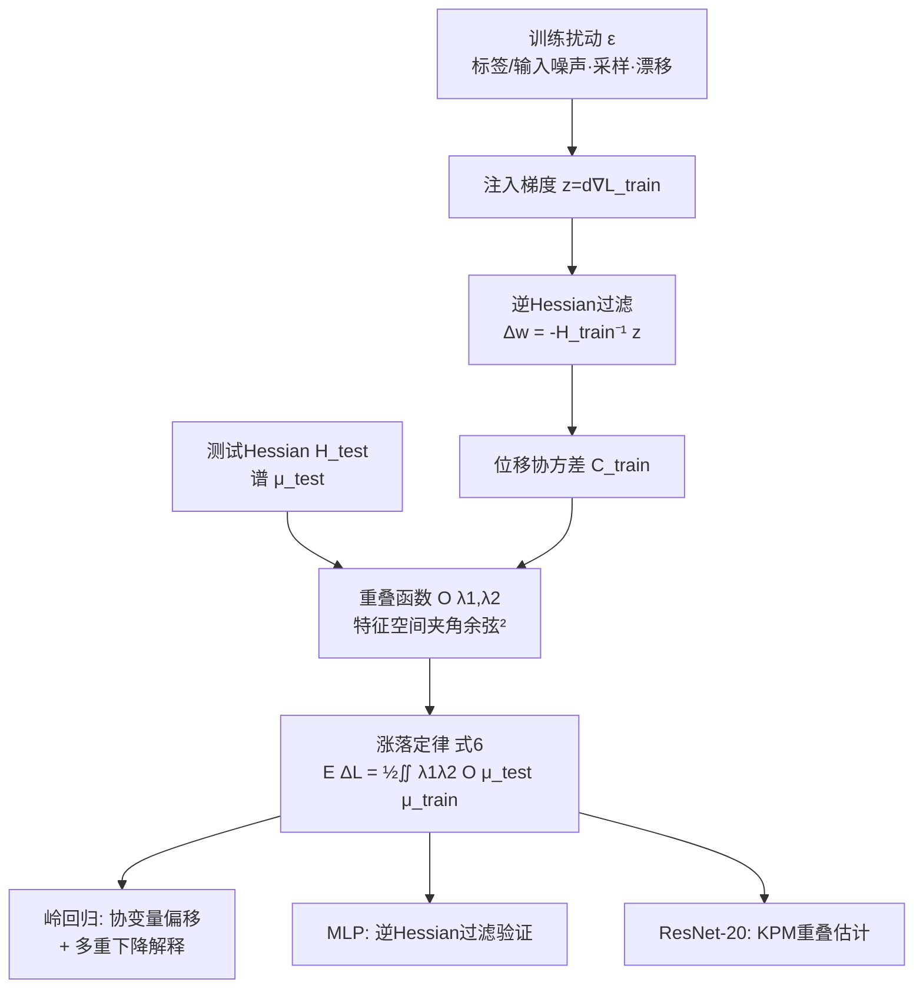

# Beyond Spectra: Eigenvector Overlaps in Loss Geometry

**会议**: ICLR 2026  
**OpenReview**: [https://openreview.net/forum?id=ditBKIciC3](https://openreview.net/forum?id=ditBKIciC3)  
**代码**: 待确认  
**领域**: learning theory / 损失几何 / 随机矩阵理论  
**关键词**: 特征向量重叠, 双损失几何, Hessian, 泛化, 协变量偏移, 多重下降, 随机矩阵  

## 一句话总结
机器学习的局部损失几何本质是"双算子"问题：训练损失和测试损失各有一个 Hessian，单看各自的谱（特征值）不够，真正决定泛化的是两个 Hessian 特征空间之间的**对齐程度（eigenvector overlap）**——本文为此建立了一条普适的涨落定律、一条噪声传递定律，并给出可扩展到 ResNet 的重叠估计算法。

## 研究背景与动机
**领域现状**：大量研究把"损失几何"等同于"Hessian 谱"——测量特征值分布、研究 sharp/flat minima、用 sharpness（最大特征值）解释泛化、SAM 等曲率正则方法都建立在单损失谱之上。随机矩阵理论早已知道"光看特征值不够"：在 spiked model 中风险取决于样本特征向量与总体方向的对齐，而非特征值本身。

**现有痛点**：实际学习至少涉及**两个损失**——训练损失和测试损失。它们的联合几何不可能由各自的谱单独刻画，因为谱只描述"曲率有多大"，却完全丢掉了"两个损失的主方向是否指向同一处"这一关键的方向信息。一旦要比较两个算子，方向信息就变得不可或缺。

**核心矛盾**：泛化误差 = 训练扰动把参数推往何处 × 测试损失在那个方向有多敏感。前者由训练 Hessian 的低曲率方向决定，后者由测试 Hessian 的高曲率方向决定——**两者是否重叠**才是误差大小的真正开关，而纯谱分析对此盲视。论文用一个反例点明：在各向异性岭回归中，最小训练特征值单调下降（谱分析预测误差应升）时，测试误差反而可能下降，因为低训练特征空间恰好对齐了低测试敏感方向。

**本文目标**：建立一个**显式包含 spectra 与 overlaps 两者**的双损失局部几何框架，既给出理论基础（涨落律 + 传递律），又给出能跑在百万参数网络上的实用估计工具。

**核心 idea**：**[两算子视角]** 把局部损失几何重新定义为训练/测试两个二次近似的联合体，引入"重叠函数 $O(\lambda_1,\lambda_2)$"作为缺失的基本量；**[overlap 路由]** 谱设定曲率尺度，重叠决定训练涨落如何被"路由"成测试误差。

## 方法详解

### 整体框架
把模型在某点附近的训练损失和测试损失各做二阶展开，得到两个二次近似（两个 Hessian $H_{\text{train}}, H_{\text{test}}$）。训练扰动（标签噪声、采样、分布漂移等）在最优点 $w_0$ 处注入一个梯度 $z$，被逆 Hessian 过滤成位移 $\Delta w = -H_{\text{train}}^{-1}z$；这个位移代入测试损失得到测试误差增量 $\Delta L$。整套理论围绕"$\Delta L$ 期望如何由两个 Hessian 的谱 + 重叠共同决定"展开，然后在岭回归（理论精确）、MLP（非凸验证）、ResNet-20（大规模算法）三个层级逐级落地。

### 关键设计

**1. 重叠局部涨落定律：把泛化拆成谱×对齐的二重积分。** 这是全文理论核心。先注意到测试误差增量的二阶项期望可写成一个迹 $\frac{1}{2d}\mathrm{tr}[H_{\text{test}}C_{\text{train}}]$，其中 $C_{\text{train}}=\mathbb{E}[\Delta w\,\Delta w^\top]$ 是位移协方差。把这个迹按两个算子的特征分解展开，并定义重叠核 $\frac{1}{d}O(\lambda_1,\lambda_2)$ 为 $H_{\text{test}}$ 与 $C_{\text{train}}$ 在特征值 $\lambda_1,\lambda_2$ 处特征向量的均方余弦夹角，就得到定理 1：
$$\mathbb{E}[\Delta L]=\frac{1}{2}\iint \lambda_1\,\lambda_2\,O(\lambda_1,\lambda_2)\,\mu_{\text{test}}(d\lambda_1)\,\mu_{\text{train}}(d\lambda_2).$$
这条式子的洞察力在于：训练谱、测试谱单独都预测不了泛化，决定性的是"高方差位移方向（大 $\lambda_2$，即低曲率训练方向）"有多少**重叠**到"高敏感测试方向（大 $\lambda_1$）"。误差最大正是当二者强重叠之时。值得一提的是，即便换成噪声梯度下降的稳态协方差，代入后仍服从同一条涨落律，说明结论对优化细节稳健。

**2. 自由概率传递定律：用一条积分把复杂模型的重叠拆成简单模型的乘积。** 实践中往往要算"算子 $A$ 与某算子 $B$ 的带噪变换 $\hat B$"之间的重叠（例如总体测试协方差 vs 样本训练协方差）。定理 2 给出：若 $\hat B=F(B,X)$ 是有理表达式且 $X$ 与 $A,B$ **自由**（free，大随机矩阵的独立性概念），则
$$O_{A,\hat B}(a,\hat b)=\int O_{A,B}(a,b)\,O_{B,\hat B}(b,\hat b)\,\mu_B(db).$$
这等于给出了一套"重叠演算"：复杂矩阵模型的重叠函数可由更简单的成分相乘再积分得到。论文正是靠它从总体协方差快速导出各向异性岭回归中训练-测试 Hessian 的重叠闭式解。

**3. 岭回归中的精确落地：把协变量偏移与多重下降统一成重叠现象。** 在岭回归里上述理论精确成立。标签噪声充当扰动，得位移协方差 $C_{\text{train}}=\sigma^2\alpha^{-1}\hat\Sigma_{\text{train}}(\hat\Sigma_{\text{train}}+\lambda I)^{-2}$（$\alpha=m/d$ 为采样比），代入涨落式得
$$\mathbb{E}[\Delta L]=\frac{\sigma^2}{2\alpha}\iint \frac{\lambda_1\lambda_2}{(\lambda_2+\lambda)^2}\,O_{\Sigma_{\text{test}},\hat\Sigma_{\text{train}}}(\lambda_1,\lambda_2)\,\mu_{\Sigma_{\text{test}}}\,\mu_{\hat\Sigma_{\text{train}}}.$$
用算子值自由概率在比例渐近 $m,d\to\infty$（$\alpha$ 固定）下导出渐近精确解（定理 3 给出等效正则 $\tilde\lambda$ 的自洽方程）。两个推论很漂亮：(i) **协变量偏移**——在保持训练/测试谱不变（等谱变换）下，仅旋转特征空间改变重叠就能让测试风险升降，因此重叠 $O_{\Sigma_{\text{test}},\Sigma_{\text{train}}}$ 是量化"偏移本身"的天然量；(ii) **多重下降**——双尺度协方差下测试误差在 $\alpha=1/2,1$ 出现尖峰，重叠图近似块对角，第一个尖峰发生在近零训练方向重叠尖锐测试子空间时，第二个发生在更小训练分量重叠平坦子空间但方差大到压过其小曲率时。这就纠正了"多重下降源于谱病态"的旧解读。

**4. 大规模重叠估计：subspace iteration + 核多项式法（KPM）只用矩阵-向量积。** 现代网络的 Hessian 维度等于参数量（百万到十亿），显式构造不可行。论文分两路：**离群特征空间**用子空间迭代直接取出特征向量再算重叠；**bulk 体相空间**则把谱密度估计的核多项式法推广到"两算子重叠"。给定平滑核 $G(x;\sigma)$，平滑后的总重叠写成 $\overline{\mathrm{tr}}[G_{A,\lambda_1}G_{B,\lambda_2}]$，为保证迹为正改写成 $\mathbb{E}_v\|G_{B,\lambda_2}^{1/2}G_{A,\lambda_1}^{1/2}v\|^2$（Hutchinson 随机迹估计 + 高斯核 + Chebyshev 截断级数）。这样整个估计只需 $T_i(B)T_j(A)v$ 这类靠 Chebyshev 递推生成的矩阵-向量积，复杂度近似线性于模型规模与样本数，可在商用硬件上数小时内跑完 ResNet-20。

## 实验关键数据

### 主实验（三个层级的验证）

| 设置 | 内容 | 关键结论 |
|------|------|----------|
| 岭回归（理论精确） | 双尺度协方差 $s_1^2,s_2^2$，等谱旋转 $\theta$ | $\theta=0$（对齐）测试误差小，$\theta=\pi/2$（错位）同样位移量误差骤升；理论与模拟（$d=10^2$，叉号）吻合 |
| 多重下降 | 2/3/4 尺度数据，$d=5000$ | 误差在 $\alpha=1/2,1$ 出现尖峰，理论曲线与模拟精确吻合；重叠函数（紫线）与实验叉号高度一致 |
| MLP（非凸验证） | teacher-student，宽度 (5,5,5,1)，tanh，MSE | 跨多个数量级的输入/标签噪声，预测 $\Delta L/L_0$ 与实测对齐；2D 损失切片中二次理论预测的最优点（Y）落在实际扰动最优点（星）附近 |
| ResNet-20 / CIFAR-10 | 预训练 checkpoint，top-1 92.6% | 平衡测试集下 $H_{\text{train}},H_{\text{test}}$ 沿对角强对齐；类不平衡测试集（仅类 0,1,2）后对齐显著消失 |

### 消融 / 机制分析

| 现象 | 观察 |
|------|------|
| 逆 Hessian 过滤 | MLP 中学习沿 $H_{\text{train}}$ 低/高特征方向放大/压缩方差；因 train/test 对齐良好，大位移未转化为大测试误差 |
| 多重下降机制 | $\alpha=1/2$ 时训练谱由单峰分裂为两带，$\alpha=1$ 时低带出现近零分量；在 line 3→4 间最小训练特征值仍下降但误差反降——纯谱分析无法解释 |
| 类不平衡 = 几何错位 | 类不平衡把"训练-测试良好对齐"破坏成"outlier 能量散落到对方 bulk/低离群空间"，从几何上解释了类不平衡为何伤害泛化 |
| 算法可扩展性 | 所有 Hessian-向量积用 PyTorch autograd，运行时间近似线性于模型/样本规模，商用硬件数小时完成 |

### 关键发现
1. **谱设尺度，重叠定路由**：训练谱和测试谱只设定各自曲率大小，特征向量重叠才决定训练涨落如何"路由"成测试误差。
2. **协变量偏移的天然度量是重叠**：等谱条件下仅靠重叠就能预测某个域变化是有益还是有害，这是谱分析或域无关方法做不到的。
3. **多重下降被重叠完全解析**：尖峰由"训练分量何时出现近零特征值"与"它们重叠到尖锐还是平坦测试方向"共同决定，而非 Hessian 病态。

## 亮点与洞察
- **概念纠偏**：明确指出主流文献把"loss geometry = Hessian spectrum"是过度简化，缺的正是方向信息（overlap），这是一个干净有力的视角转变。
- **理论统一性强**：一条涨落律 + 一条传递律，把协变量偏移、多重下降、类不平衡这三个看似无关的现象统一为同一种"train-test 特征空间错位"。经典的 TIC（Takeuchi 信息准则）作为单损失极限自然涌现。
- **理论到工程闭环**：不止停在岭回归解析解，还给出 KPM + Hutchinson + Chebyshev 的可扩展估计器，真的跑到了 ResNet-20，弥合了随机矩阵理论与深度学习实践的鸿沟。
- **反直觉案例点睛**：最小训练特征值下降而测试误差反降这个例子，极有说服力地证明纯谱分析会给出错误结论。

## 局限与展望
- **局部二次近似的适用边界**：整套理论建立在小扰动、局部二次展开上，扰动相对信号较大或强非凸时是否仍准确未充分探讨（MLP 验证规模也较小）。
- **大规模验证仍有限**：ResNet-20 已是亮点，但相对现代百亿参数模型仍小；overlap 估计在超大模型上的数值稳定性与精度有待检验。
- **静态而非动态**：当前是某个最优点处的快照分析，作者把"沿训练时间追踪 Hessian 重叠"列为未来方向。
- **诊断而非干预**：理论目前是解释"为何某些域偏移更有害"的诊断工具，作者展望"对齐感知优化"（鼓励 train/val Hessian 特征向量对齐以改善泛化），但尚未实现。

## 相关工作与启发
- **vs Hessian 谱分析（Sagun/Ghorbani/Yao/Papyan 等）**：这些工作只看特征值分布与 sharpness，本文补上方向维度。
- **vs 随机矩阵 spiked model（Benaych-Georges & Nadakuditi, Bun et al.）**：借鉴"风险取决于特征向量对齐"的思想，迁移到 train-test 学习理论问题。
- **vs SAM / 曲率正则（Foret et al., Kim et al.）**：这些是单损失、偏向训练损失平坦区；本文显式双损失，不假设 train/test 关系。
- **vs 多重下降文献（Chen & Mei, Mel & Ganguli）**：纠正"多重下降源于谱病态"的解读，给出重叠驱动的完整解析。
- **启发**：为"对齐感知优化"、域偏移有害性诊断、训练时几何追踪提供了可操作的量化工具与理论语言。

## 评分
- **新颖性**: ⭐⭐⭐⭐⭐ —— "两算子损失几何 + 重叠是缺失基本量"是一个干净且有分量的概念转变，涨落律与自由概率传递律均为新结果。
- **实验充分度**: ⭐⭐⭐⭐ —— 岭回归（精确）→MLP（非凸）→ResNet-20（大规模）三级验证完整，理论与模拟吻合好；但深网规模偏小、缺更大模型与训练时演化的验证。
- **写作质量**: ⭐⭐⭐⭐ —— 逻辑层层递进、图示直观、贡献清晰；但随机矩阵/自由概率门槛较高，对非理论背景读者不够友好。
- **价值**: ⭐⭐⭐⭐ —— 既纠正主流误解又给出可扩展工具，为泛化分析、域偏移诊断、对齐感知优化打开新方向，理论与潜在应用价值兼具。

<!-- RELATED:START -->

## 相关论文

- [\[ICLR 2026\] Characterizing the Discrete Geometry of ReLU Networks](characterizing_the_discrete_geometry_of_relu_networks.md)
- [\[ICLR 2026\] Scaling Laws and Spectra of Shallow Neural Networks in the Feature Learning Regime](scaling_laws_and_spectra_of_shallow_neural_networks_in_the_feature_learning_regi.md)
- [\[ICLR 2026\] TESSAR: Geometry-Aware Active Regression via Dynamic Voronoi Tessellation](tessar_geometry-aware_active_regression_via_dynamic_voronoi_tessellation.md)
- [\[ICLR 2026\] Learning to Adapt: In-Context Learning Beyond Stationarity](learning_to_adapt_in-context_learning_beyond_stationarity.md)
- [\[ICLR 2026\] On Powerful Ways to Generate: Autoregression, Diffusion, and Beyond](on_powerful_ways_to_generate_autoregression_diffusion_and_beyond.md)

<!-- RELATED:END -->
