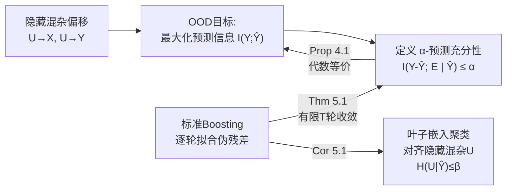

# Boosting for Predictive Sufficiency

**会议**: ICLR 2026  
**OpenReview**: [https://openreview.net/forum?id=1mQT8PXIy8](https://openreview.net/forum?id=1mQT8PXIy8)  
**代码**: [https://github.com/gautam0707/Boosting_for_predictive_sufficiency](https://github.com/gautam0707/Boosting_for_predictive_sufficiency)  
**领域**: learning theory / OOD generalization  
**关键词**: 分布外泛化, 隐藏混杂偏移, 信息论, 梯度提升, 预测充分性, 参考类  

## 一句话总结
本文提出信息论概念 **α-预测充分性 (α-predictive sufficiency)**，从理论上证明 boosting 之所以在隐藏混杂偏移下的表格数据 OOD 任务上打败各种"专门"方法，是因为它能**隐式地把数据划分成与隐藏混杂变量对齐的"参考类/环境"**，并在每个环境内最大化预测信息。

## 研究背景与动机

**领域现状**：分布外 (OOD) 泛化是可信机器学习的核心。学界提出了大量基于"不变性"假设的方法（IRM、REx、GroupDRO、多重校准等），它们都假设分布漂移来自 label shift 或 covariate shift，并依赖事先指定的环境划分（如房价预测里的邮编、医疗诊断里的医院 ID）。

**现有痛点**：现实表格数据上，反复出现的经验现象是——这些精心设计的 OOD 方法常常**打不过** boosting、MoE、MLP 这类"传统"模型（Gulrajani & Lopez-Paz 2021、Nastl & Hardt 2024 等多篇 benchmark 都观察到）。更麻烦的是，真实漂移往往来自**隐藏混杂偏移 (hidden confounding shift)**：一个潜变量 $U$ 同时因果影响协变量 $X$ 和标签 $Y$（即 $U\to X,\ U\to Y$），既非纯 label shift 也非纯 covariate shift，标准不变性假设直接失效。

**核心矛盾**：boosting 为什么能赢？以往解释归因于方差缩减、特征选择、处理缺失协变量、或与多重校准的联系——但这些都没触及 boosting 在**隐藏混杂**这一最难场景下的真正机制。OOD 泛化本质是一个"参考类问题 (reference class problem)"：要给一个个体赋概率，到底该把它归入哪个群体？划错了（比如按医院 ID 而非疾病机制分组）就预测错。

**本文目标**：给"boosting 善于 OOD"这一谜题一个**有理论保证的机制性解释**，并把它形式化为一个可度量的信息论目标。

**核心 idea**：**boosting 隐式地把数据分到与隐藏混杂偏移对齐的参考类里**——具体说，提升树的叶子嵌入 (leaf embeddings) 聚类恰好对齐隐藏混杂变量 $U$ 的取值，从而在每个环境内最大化 $Y$ 与预测 $\hat Y$ 的互信息。作者用 **α-预测充分性**刻画这一点，并证明标准 boosting 在有限轮内一定返回一个 α-预测充分的预测器。

## 方法详解

### 整体框架
全文是一条"定义目标 → 建立目标与 OOD 泛化的等价 → 证明 boosting 达成目标"的理论链条：先把 OOD 性能度量定为预测信息 $I(Y;\hat Y)$，再定义 α-预测充分性并证明它与预测信息的代数等价（Prop 4.1），最后证明标准 boosting 算法在有限轮 $T$ 内返回 α-预测充分预测器（Thm 5.1），且其预测能消解隐藏混杂 $U$ 的不确定性（Cor 5.1）。

### 关键设计

**1. α-预测充分性：用"残差与环境的条件独立"刻画 OOD 可迁移性。** 论文的概念基石是定义 4.3：对 $\alpha\ge 0$，预测 $\hat Y$ 称为跨环境 $E$ **α-预测充分**，当且仅当 $I(Y-\hat Y;\ E\mid \hat Y)\le \alpha$。直觉是：当 $\alpha=0$ 时，预测误差 $Y-\hat Y$ 在给定预测值 $\hat Y$ 后与环境 $E$ 独立——也就是说，无论数据来自哪个环境，模型犯错的方式都一样。由于 $E$ 编码了隐藏混杂 $U$（$Y$ 的直接父节点）的信息，达成预测充分性就意味着预测器已经**通过 $X$ 和训练隐式地把 $U$ 的影响吸收进去了**，这正是能跨环境迁移的条件。这里的"误差"在回归中是 $Y-\hat Y$，在分类中把 $\hat Y$ 当作预测概率、取概率残差——这一选择不是偶然，因为它恰好对应梯度提升每轮拟合的伪残差。

**2. 把 α-充分性翻译成预测信息分解，连上 OOD 目标。** 光有定义不够，作者要证明"小 $\alpha$ ⟺ OOD 性能好"。借助 Reddy et al. (2026) 对预测信息的信息论分解，在隐藏混杂偏移下 $I(Y;\hat Y)=I(Y;\phi(X)\mid E)-I(Y;\phi(X)\mid \hat Y)$——前项是"环境内条件信息量 (conditional informativeness)"，后项是要最小化的残差。命题 4.1 进一步把 α-充分性展开为
$$I(Y-\hat Y;\ E\mid \hat Y)=-I(Y;\phi(X)\mid E,\hat Y)+I(Y;\phi(X)\mid \hat Y)+I(Y;E\mid \phi(X)).$$
对照两式可见：右边第一项是环境内条件信息量的下界（取负，要它大），第二项是残差（要它小），第三项 $I(Y;E\mid\phi(X))$ 正是**概念漂移/不变性度量**（要它为 0）。于是"把 $\alpha$ 压小"在代数上等价于"最大化环境内预测信息 + 达成不变性"，OOD 目标和充分性目标被严丝合缝地焊在一起。

**3. 用信息论刻画弱学习器，证明 boosting 有限轮达成 α-充分。** 这是全文的主结果。作者先给出信息论版的弱学习器定义（5.1）：弱学习器 $h$ 相对常数基线，每轮在预测信息上至少多贡献一个 margin $\gamma$，即 $I(Y;h(X))\ge \gamma$；并配合条件弱学习假设 $I(Y;h_t\mid h_0,\dots,h_{t-1})\ge \gamma$（每个新弱学习器都带来非平凡的增量信息）、重加权分布存在性、以及"强学习器是弱学习器的确定性函数"等温和假设。定理 5.1 给出：存在有限的
$$T=\frac{H(Y)-H(Y\mid X,E)-\alpha-I(Y;\hat Y_0)}{p\cdot\gamma},$$
使得 $t\ge T$ 轮后的 boosting 预测器 $\hat Y_t$ 就是 α-预测充分的（环境 $E$ 未知时令 $H(Y\mid X,E)=0$ 同样成立）。直觉上每轮至少注入 $p\cdot\gamma$ 的信息，把 $\hat Y$ 与 $Y$ 之间的信息缺口逐步填满，因而必在有限步内把残差信息（即 $\alpha$）压到阈值以下。

**4. 叶子嵌入对齐隐藏混杂：从"充分"到"识别环境"。** 达成 α-充分还不直接等于"识别出了隐藏混杂"。推论 5.1 在结构假设 5.4（$\phi(X)$ 和学习过程保留并使用了携带 $U$ 信号的成分，$I(U;\hat Y_t)\ge c\cdot I(Y;\hat Y_t)$）下进一步证明：存在有限 $T=\frac{H(U)-\beta-c\,I(Y;\hat Y_0)}{c\cdot p\cdot\gamma}$，使 $t\ge T$ 后 $H(U\mid\hat Y_t)\le\beta$——即给定 boosting 预测后，隐藏混杂 $U$ 的不确定性被压到很小。这正是"boosting 的叶子嵌入聚类对齐 $U$ 取值"这一经验现象的理论根据：boosting 不需要任何环境标签 $E$、只在 pooled 数据上训练，却隐式地把数据划进了与隐藏混杂对齐的参考类。论文还把上述结论专门推广到梯度提升（附录 B）。

## 实验关键数据

实验目的不是刷 SOTA，而是**验证理论**：boosting 表示是否按隐藏混杂聚类、预测信息高/预测充分性低是否对应性能好。用 CatBoost、XGBoost，叶子嵌入做 t-SNE/PCA 可视化，互信息用 KSG 估计器，聚类质量用 ARI/NMI。

### 主实验表格

真实数据上 XGBoost vs CatBoost（MSE 越低越好、预测信息越高越好、预测充分性越低越好）：

| 方法 | California Housing MSE↓ | Pred. Info.↑ | Pred. Suffi.↓ | 20 Newsgroups Acc↑ | Pred. Info.↑ | Pred. Suffi.↓ |
|------|------|------|------|------|------|------|
| XGBoost | 0.31±0.00 | 0.47±0.03 | 0.00±0.00 | 62.35±0.40 | 0.27±0.10 | 0.03±0.00 |
| CatBoost | **0.29±0.00** | **0.56±0.10** | 0.00±0.00 | **62.61±0.00** | **0.68±0.08** | **0.00±0.00** |

结论：**预测信息越高 → 性能越好；预测充分性越低 → 性能越好**，与理论一致（CatBoost 在两个数据集上预测信息更高、充分性残差更低，性能也更优）。

### 消融/分析实验

| 实验 | 设置 | 关键结果 |
|------|------|------|
| 合成实验 1 | 线性结构方程，10 个环境，$U\sim\mathcal N(\mu_e,\sigma_e)$，CatBoost | 低 MSE 的模型其叶子嵌入聚类**对齐隐藏混杂值**；CatBoost(100树,深10) 达 ARI(U)=0.730, NMI(U)=0.842 |
| 合成实验 2 | 加入额外混杂 $U_2\to S,\ U_2\to Y$（$S$ 不因果影响 $Y$） | 仅用 $X$ 训练时 ARI 低/MSE 高（捕不到 $U_2$ 的漂移）；同时用 $X,S$ 训练则 ARI 高/MSE 低——**任何能代理未观测混杂的协变量都能提升泛化**，解释了 Nastl & Hardt 2024 "加协变量有助泛化" |
| California Housing | 用收入/房龄/房价人工诱导混杂偏移，保证公共混杂支撑 | XGBoost 叶子嵌入 PCA 表示按隐藏混杂值清晰聚类，训练/测试集均成立 |
| 20 Newsgroups | TF-IDF + Truncated SVD 到 200 维，用文档长度/关键词/类别诱导偏移 | 叶子嵌入聚类与隐藏混杂簇明确关联 |

### 关键发现
- boosting 模型**只在 pooled 数据上训练、不用任何环境标签**，叶子嵌入却能自动聚类对齐隐藏混杂 $U$，直接印证 Cor 5.1。
- 性能、预测信息、预测充分性三者高度一致，把抽象的信息论目标与可观测的 MSE/Acc 串起来了。
- "加入一个作为未观测混杂代理的协变量就能改善 OOD"这一经验技巧，在本文框架下获得了机制性解释。

## 亮点与洞察
- **把"boosting 为何强"从经验观察提升为可证明的机制**：α-预测充分性是一个干净、可度量、能落到 KSG 估计的目标，而非又一个含糊的"归纳偏置"叙述。
- **统一了多条线索**：把多重校准、参考类问题、预测信息分解、隐藏混杂偏移这几条原本分散的研究线，用一个充分性概念串到一起。
- **解释力强于以往归因**：方差缩减/特征选择只是部分原因，本文指出"隐式识别环境"才是隐藏混杂场景下的关键，并能解释"加代理协变量有用"这类经验现象。

## 局限与展望
- **共公共混杂支撑假设 (Assumption 3.1)** 较强：测试期出现的混杂值必须在训练期出现过，否则泛化有根本性上界——这在真实开放世界里常被违反。
- **结构假设 5.4**（表示保留并使用 $U$ 信号）难以直接验证，更多是充分条件而非可检验前提。
- 实验局限在**表格数据**与人工诱导的混杂偏移，尚未扩展到图像/文本等高维原生数据。
- 作者展望：设计能估计/正则化 $\alpha$ 的新 OOD 算法、放松公共支撑假设、把预测充分性保证推广到表格之外。

## 相关工作与启发
- **隐藏混杂下的 OOD 泛化**：Alabdulmohsin et al. 2023、Tsai et al. 2024、Prashant et al. 2025（代理变量推断/调整混杂）、Reddy et al. 2026（按混杂区域部署专用预测器）——本文是这条线的理论化补充。
- **boosting 与多重校准**：Globus-Harris et al. 2023、Wu et al. 2024a（level-set boosting 通过多重校准达成不变性）；本文区别在于额外揭示 boosting 与"最大化条件信息量"的联系，并显式处理 $P(X\mid Y)$ 漂移。
- **MoE 与架构-数据对齐**：Li et al. 2023（稀疏 MoE 做域泛化）、Wu et al. 2024b——boosting 与 MoE 都能建模"每区域不变预测 + 路由"的结构，本文为这类结构归纳偏置提供了信息论解释。
- **启发**：α-预测充分性可作为一个通用的 OOD 正则项/诊断指标——任何模型都能算 $I(Y-\hat Y;E\mid\hat Y)$，用来判断它是否"按对环境分组"，而不仅限于 boosting。

## 评分
- **新颖性**: ⭐⭐⭐⭐ 提出 α-预测充分性这一新信息论概念，并给出 boosting 在隐藏混杂下的首个机制性证明，视角新颖。
- **实验充分度**: ⭐⭐⭐ 合成+两个真实数据集验证了理论的每一环，但仅限表格数据、缺与专门 OOD 方法的正面 benchmark 对比。
- **写作质量**: ⭐⭐⭐⭐ 理论链条"目标→等价→达成"层层递进，定义、命题、定理衔接清晰。
- **价值**: ⭐⭐⭐⭐ 为"传统模型为何打败专门 OOD 方法"这一长期困惑给出有理论保证的解答，对可信 ML 的方法设计有指导意义。

<!-- RELATED:START -->

## 相关论文

- [\[NeurIPS 2025\] Revisiting Agnostic Boosting](../../NeurIPS2025/learning_theory/revisiting_agnostic_boosting.md)
- [\[ICLR 2026\] High-Dimensional Analysis of Single-Layer Attention for Sparse-Token Classification](high-dimensional_analysis_of_single-layer_attention_for_sparse-token_classificat.md)
- [\[ICLR 2026\] Escaping Model Collapse via Synthetic Data Verification: Near-term Improvements and Long-term Convergence](escaping_model_collapse_via_synthetic_data_verification_near-term_improvements_a.md)
- [\[ICLR 2026\] Minimax Sample Complexity of Graph Neural Networks: Lower Bounds and Structural Effects](minimax_sample_complexity_of_graph_neural_networks_lower_bounds_and_structural_e.md)
- [\[ICLR 2026\] Learning Shrinks the Hard Tail: Training-Dependent Inference Scaling in a Solvable Linear Model](learning_shrinks_the_hard_tail_trainingdependent_inference_scaling_in_a_solvable.md)

<!-- RELATED:END -->
