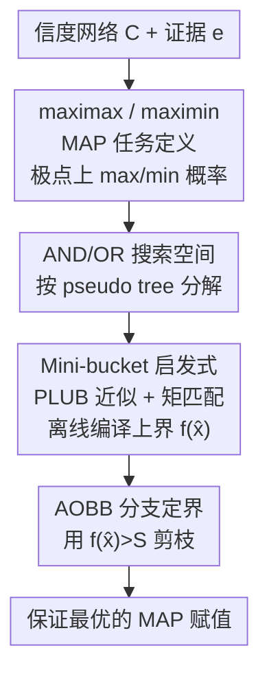

# Branch and Bound Search for Exact MAP Inference in Credal Networks

**会议**: ICLR2026  
**OpenReview**: [https://openreview.net/forum?id=DTqbEtXXP3](https://openreview.net/forum?id=DTqbEtXXP3)  
**代码**: 待确认（论文附录附带）  
**领域**: 概率图模型 / 精确推断 / 启发式搜索  
**关键词**: 信度网络, MAP 推断, 分支定界, AND/OR 搜索, mini-bucket 启发式

## 一句话总结
本文为信度网络（credal network）中的精确 MAP 推断设计了首个深度优先分支定界算法：把问题定义成 maximax / maximin 两类 MAP 任务，在 AND/OR 搜索空间里利用问题分解，再用带 cost-shifting 的 mini-bucket 启发式做剪枝，能在保证最优性的前提下求解超过 3000 个变量的大规模实例，比 OR 搜索和局部搜索快几个数量级。

## 研究背景与动机
**领域现状**：贝叶斯网络（Bayesian network, BN）用精确的条件概率表（CPT）刻画变量间依赖，MAP 推断（给定证据，找后验概率最大的赋值）已被研究了几十年，有成熟的精确算法（变量消元、AND/OR 分支定界等）。信度网络（credal network, CN）是 BN 的推广：它把每个变量在父节点取某配置下的局部模型从"一个分布"放宽成"一个凸的分布集合"（credal set，信度集），从而能表达严重不确定、不可靠数据或互相冲突的信息，也天然地出现在带隐变量的部分可识别因果模型里。

**现有痛点**：过去对信度网络的研究几乎都集中在**边缘推断**（算某个查询变量的上下概率界），而 **MAP 推断**——找一个最可能的整体赋值——被严重忽视。少数已有工作（Marinescu 等 2023 的 Marginal MAP 算法）虽然能"勉强搬过来"做 credal MAP，但要么只能处理很小的模型，要么对解的质量没有任何保证（局部搜索给不出最优性证明）。

**核心矛盾**：credal MAP 和 BN MAP 同属 NP-hard，但 credal MAP 多了一层麻烦——一个赋值的概率不再是唯一值，而要在联合 credal set 的**极点（extreme points）上再做一次 max/min 优化**。这层嵌套的优化让现成的 BN 推断框架无法直接复用，导致领域里"根本没有成熟的精确 credal MAP 算法"。

**本文目标**：把 credal MAP 精确化、规模化，同时给出最优性保证。具体拆成两个子问题——定义清楚要优化的目标（上概率还是下概率），以及设计一个能利用图结构、带强剪枝的搜索框架。

**切入角度**：作者注意到 BN MAP 上最有效的精确方法是 **AND/OR 分支定界**——它沿一棵 pseudo tree 把问题分解成相互独立的子问题，搜索树规模由 pseudo tree 的**深度**而非变量数决定。这个结构利器在信度网络上从未被用过，作者把它整体迁移并改造，使其兼容 credal set 上的 max/min 计算。

**核心 idea**：把 credal MAP 形式化为 **maximax / maximin** 两个任务，在 **AND/OR 搜索空间**里做深度优先分支定界，并用一套**基于划分（mini-bucket）+ cost-shifting** 的新启发式提供紧上界来剪枝。

## 方法详解

### 整体框架
方法要解决的是：给定信度网络 $C=\langle X, D, K, G\rangle$ 和证据 $e$，找一个对剩余变量 $Y=X\setminus E$ 的赋值，使它的**上概率**（maximax）或**下概率**（maximin）最大。整体上分三步走：先把问题的搜索空间组织成一棵 AND/OR 树（OR 节点选变量、AND 节点选取值，并按 credal set 极点给边赋权）；然后用深度优先分支定界（AOBB）在这棵树上搜索，沿途用启发式上界 $f(\hat{x})$ 剪掉没希望的分支；启发式本身由改进版 mini-bucket（带 PLUB 近似与矩匹配 cost-shifting）离线编译得到。

一个赋值 $x=(x_1,\dots,x_n)$ 的上概率定义为各局部 credal set 极点上的最大值之积，下概率为最小值之积：

$$\overline{P}(x)=\prod_{i=1}^{n}\max\,\text{ext}\big(K(x_i\mid\pi_i)\big),\qquad \underline{P}(x)=\prod_{i=1}^{n}\min\,\text{ext}\big(K(x_i\mid\pi_i)\big)$$

### 关键设计

**1. maximax / maximin MAP：把"集合上的概率"变成两个明确的优化目标**

信度网络里一个赋值不再对应单一概率，而是一段区间，所以"最可能赋值"本身是模糊的。作者把它劈成两个语义清晰的任务。**maximax MAP** 找上概率最大的赋值，对应"最乐观"解释：

$$y^*=\arg\max_{y\in\Omega(Y)}\ \max_{P(Y,e)\in K(X)}\ \prod_{i=1}^{n}P(X_i\mid\Pi_i)$$

**maximin MAP** 把内层换成 $\min$，找下概率最大的赋值，对应"最稳健/最坏情况下仍最好"的解释。两者都建立在前面的极点乘积公式上：因为联合 credal set 的强扩张由各局部 credal set 的极点构成，上/下概率可以逐变量取极点的 max/min 再连乘，避免在整个高维联合集合上做优化。这一拆分是后面所有算法的目标函数来源。

**2. AND/OR 搜索空间：用 pseudo tree 把全局搜索拆成独立子问题**

朴素做法是用一棵 OR 搜索树枚举所有赋值，规模随变量数指数爆炸。作者把 BN 上的 AND/OR 思想搬到信度网络：先求图 $G$ 的一棵 **pseudo tree** $T$（一棵生成树，使得原图中所有非树边都是连向祖先的回边），它捕捉了变量间的条件独立结构。搜索树在 OR 层选变量、AND 层选该变量的取值，并交替展开；关键在于 AND 节点把当前子问题**分解成若干互不相干的子问题**——pseudo tree 里同一节点的不同孩子分支彼此独立，可分别求解再合并。每条 OR→AND 边的权 $w(X_i,x_i)$ 取自相关局部 credal set 极点的上概率之积（maximin 则用下概率），节点值 $v(n)$ 递归地由 OR 节点取 max、AND 节点取乘积得到。由此搜索树规模由 pseudo tree 的**深度 $h$** 而非变量数 $n$ 决定，这正是它能扩展到数千变量的根本原因。

**3. AOBB 分支定界 + 启发式剪枝：边搜边砍掉没希望的分支**

有了 AND/OR 空间，作者给出 AOBB（AND/OR Branch-and-Bound）算法。它沿 pseudo tree 静态选下一个变量 $X_k$，遍历其取值 $x_k$（AND 后继）来累计 OR 节点值 $v(X_k)$；核心是用启发式评估函数 $f(\hat{x})$ 给当前部分解的最优 maximax 扩展算一个**上界**，一旦 $f(\hat{x})\le S$（$S$ 是当前已找到的最优解值），就直接剪掉该分支。对每个 $x_k$，由 AND 节点诱导的子问题被分解成 $r$ 个独立子问题分别递归求解，结果连乘到 $v(X_k,x_k)$。证据变量的域被钉死为证据值。算法的时间复杂度为 $O(n\cdot d^h)$、空间复杂度 $O(n)$（$d$ 是最大域大小，$h$ 是 pseudo tree 深度）——空间只线性，是分支定界相对完整编译类方法的优势。maximin 版本只需把边权和 $f$ 的计算换成下概率版本，框架不变。

**4. Mini-bucket 启发式 + PLUB 近似 + 矩匹配 cost-shifting：给出又紧又算得起的上界**

剪枝效果取决于 $f(\hat{x})$ 的上界有多紧。作者把 BN 上的 mini-bucket 方案改造到 credal 设定。难点在于：credal 的变量消元操作在**potential**（一组非负函数的集合，而非单个函数）上进行，乘积和 max-marginal 都是逐元素地对集合做，集合基数会随消元爆炸。为此引入两个机制。其一是 **Pareto Least Upper Bound（PLUB）**：把一个 potential $\phi(Y)$ 里的向量按曼哈顿距离聚成至多 $M$ 个簇，每簇用其逐分量取 max 的 Pareto 上确界替代，从而把基数压到 $\le M$ 且保证仍是原 potential 的上界。mini-bucket 本身把大 bucket 划分成至多含 $i$ 个变量的小桶（$i$-bound），分别消元，控制 scope 规模。其二是 **矩匹配 cost-shifting**：直接拆桶会让上界偏松，作者借助辅助函数 $\lambda_r(A)$（满足 $\prod_r\lambda_r=1$）在各 mini-bucket 间重新分配"代价"。具体取各桶在被消变量上的 max-marginal 的 PLUB 近似 $\mu_r$，令几何均值 $\mu=\big(\prod_r\mu_r\big)^{1/R}$，再用 $\lambda_r=\mu/\mu_r$ 重参数化每个 $\phi_{kr}$。该方案算出的仍是 maximax 最优值的上界，时间空间复杂度 $O(n\cdot M^2\cdot d^i)$。实验显示 $M=1$ 配合较大 $i$-bound 最划算，矩匹配几乎总能进一步收紧界、省时间。

需要诚实指出一个 caveat：对 **maximin** 任务，$\max$ 与 $\min$ 算子不可交换，带 min 剪枝的变量消元不再精确，mini-bucket（即便加了 cost-shifting）只能给出一个**通常松得多**的上界。所以 maximin MAP 的搜索空间更大、求解明显更难，这一点在实验里也清楚体现。

## 实验关键数据

实验在随机/网格信度网络（随机网 $n\in\{100,150,200\}$、网格 $m\times m$，$m\in\{10,14,16\}$）和 15 个由真实贝叶斯网络转成区间概率（区间宽度 $\le 0.3$）的网络上进行，C++ 实现，16 核 3GHz / 128GB，1 小时时限、10GB 内存。报告 CPU 时间与展开节点数。

### 主实验
AND/OR 搜索（AOBB+MBMM(i,M=1)）相对 OR 搜索（BB）和朴素 DFS 的优势是数量级级别的。

| 设定 | 最优算法 | 对照 | 结果 |
|------|---------|------|------|
| 随机网 100 变量（Table 2） | AOBB+MBMM(i,1)：$i{=}8$ 仅 0.15s / 3544 节点 | BB+MB(i)：$i{=}2$ 用 3525s / 4000 万节点 | 快约 4–5 个数量级 |
| 网格 10×10（Table 2） | AOBB+MBMM 在 $i{=}4$ 仅 0.30s | BB 多数超时（"-"） | 提升达 5 个数量级 |
| 真实网 mastermind3（3692 变量，Table 3） | AOBB+MBMM(i,1) 唯一能解（$i{=}6$ 起约 3000s） | 其余全部超时/超内存 | 唯一可扩展到 >3000 变量并证明最优 |

### 消融实验
Table 1 在随机 100 变量网上比较三种启发式（是否做 potential 近似 / 矩匹配）与 $M$ 的取值。

| 配置 | 关键观察 | 说明 |
|------|---------|------|
| AOBB+MB(i) | 仅在最小 $i$-bound 有竞争力，$i{\ge}8$ 超时 | 无近似，大 $i$ 下中间 potential 爆炸 |
| AOBB+MB(i,M) | $M$ 越大开销越大（$M{=}50$，$i{=}10$ 飙到 3284s） | 仅 PLUB 近似 |
| AOBB+MBMM(i,1) | $i{=}8$ 仅 0.15s / 3544 节点，全程最优 | 近似 + 矩匹配，$M{=}1$ 最划算 |

### 关键发现
- **$M=1$ 反而最好**：更大的 $M$ 让中间 potential 规模和编译开销暴涨；$M=1$ 配合较大 $i$-bound 给出足够准、又算得起的界，剪枝最有效。
- **结构是关键**：利用问题分解的 AOBB 比不感知结构的 OR 搜索 BB 普遍快数个数量级，验证了 AND/OR 空间的价值。
- **精确 vs 局部搜索（Table 5）**：在 100 变量随机网上，精确的 AOBB+MBMM(i,1) 仅需 0.10s，而 SLS/TS/SA/GLS 局部搜索分别要 372/189/197/353s，且后者给不出最优性证明——精确算法在速度和保证上双重碾压。
- **maximin 明显更难**：因 max/min 不可交换导致启发式更松，maximin 任务搜索空间更大、性能显著下降（Table 4）。

## 亮点与洞察
- **把 BN 的两大利器一起迁移到 credal 设定**：AND/OR 搜索（结构分解）+ mini-bucket（紧界启发式）原本是贝叶斯 MAP 的经典组合，本文首次把它们整体搬到信度网络，并解决了 potential 是"函数集合"带来的基数爆炸问题——这是迁移的真正难点，PLUB 是关键钥匙。
- **maximax/maximin 的形式化很干净**：把"区间上的 MAP"明确成两个 max-of-max / max-of-min 任务，让目标函数可以逐变量取极点连乘，避免在联合 credal set 上做高维优化，是后续一切算法的支点。
- **诚实区分难易**：作者没有掩饰 maximin 的弱启发式问题，明确指出其上界更松、更难解，这种自洽让结论更可信。
- **可迁移的工程点**：矩匹配 cost-shifting（用几何均值重分配代价收紧 mini-bucket 界）这一招，凡是带 mini-bucket / join-graph 上界的图模型推断都能借鉴。

## 局限与展望
- **maximin 启发式偏松**：由于 max/min 不可交换，maximin MAP 的 mini-bucket 只能给松上界，是当前最大短板；作者把"为 maximin 设计更紧近似"列为首要未来方向。
- **只证最优、未做 anytime**：本文聚焦最优性证明，未提供搜索中途的"当前最优解"。作者指出可按 Otten & Dechter (2011) 的思路扩展成 anytime 算法，但论文未实现验证。
- **域大小受限**：所有实验最大域大小设为 2（二值变量），多值变量下 $d^h$、$d^i$ 的指数因子会更吃力，可扩展性有待检验。
- **未与神经求解器对比**：相关工作提到近期有无保证的神经网络 MPE 求解器（Arya 等 2024/2025），本文未做正面比较，难以判断在"放弃最优性换速度"的场景下的相对位置。
- **可改进方向**：作者建议探索 best-first 或 DFS/BFS 混合搜索策略，以及加 book-keeping 机制枚举全部最优赋值（最优解可能不唯一）。

## 相关工作与启发
- **vs 贝叶斯 MAP 的 AOBB（Marinescu & Dechter 2009）**：本文直接在其 AND/OR 分支定界框架上扩展，核心区别是把单分布的 CPT 计算换成 credal set 极点上的 max/min 优化，并为此重做了 potential 的近似与 cost-shifting。
- **vs credal Marginal MAP 的近似解法（Marinescu 等 2023）**：那套局部搜索/变量消元可"勉强"搬来做 credal MAP，但要么规模受限要么无质量保证；本文给出的是带最优性证明、能上数千变量的精确算法。
- **vs 局部搜索（SLS/TS/SA/GLS）**：局部搜索是无保证的近似方法，实验中被精确算法在时间和最优性上同时超越。
- **vs 神经 MPE 求解器（Arya 等 2024/2025）**：那类方法用神经嵌入做可扩展但无保证的 MPE 推断，与本文"精确 + 保证"的定位互补，代表了 trade-off 谱系的另一端。

## 评分
- 新颖性: ⭐⭐⭐⭐ 首个信度网络精确 MAP 的 AND/OR 分支定界框架，迁移 + 重新设计兼具
- 实验充分度: ⭐⭐⭐⭐ 随机/网格/15 个真实网全覆盖，含启发式质量、规模、精确 vs 局部多角度
- 写作质量: ⭐⭐⭐⭐ 定义—算法—复杂度—实验链条清晰，且诚实暴露 maximin 短板
- 价值: ⭐⭐⭐⭐ 填补 credal MAP 精确算法空白，可扩展到 3000+ 变量，对不确定性推断与因果场景有实用意义

<!-- RELATED:START -->

## 相关论文

- [\[ICLR 2026\] Efficient Credal Prediction through Decalibration](efficient_credal_prediction_through_decalibration.md)
- [\[ICLR 2026\] Achieving Approximate Symmetry Is Exponentially Easier than Exact Symmetry](achieving_approximate_symmetry_is_exponentially_easier_than_exact_symmetry.md)
- [\[ICLR 2026\] Bound by Semanticity: Universal Laws Governing the Generalization-Identification Tradeoff](bound_by_semanticity_universal_laws_governing_the_generalization-identification_.md)
- [\[ICLR 2026\] Variational Inference for Cyclic Learning](variational_inference_for_cyclic_learning.md)
- [\[ICLR 2026\] Multiple-Prediction-Powered Inference](multiple-prediction-powered_inference.md)

<!-- RELATED:END -->
