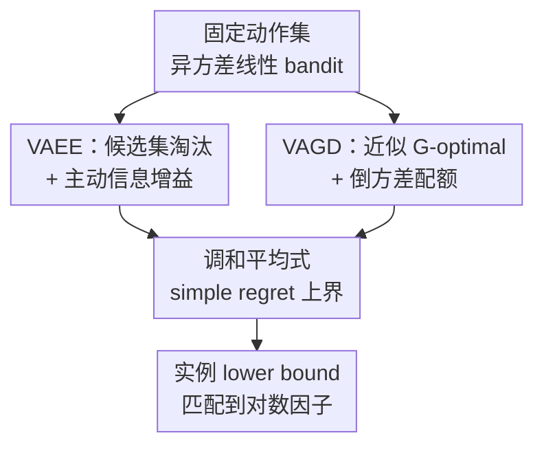

# Breaking the Total Variance Barrier: Sharp Sample Complexity for Linear Heteroscedastic Bandits with Fixed Action Set

**会议**: ICLR2026  
**OpenReview**: [https://openreview.net/forum?id=IkPJocP3ju](https://openreview.net/forum?id=IkPJocP3ju)  
**代码**: 无  
**领域**: 学习理论 / Bandit 理论  
**关键词**: 异方差线性 bandit, 固定动作集, 简单遗憾, 调和平均方差, G-optimal design  

## 一句话总结
本文研究固定动作集下的异方差随机线性 bandit，指出传统总方差 $\Lambda=\sum_{t=1}^T \sigma_t^2$ 不能刻画低噪声轮次带来的信息增益，并用 VAEE / VAGD 两个方差自适应探索算法给出接近调和平均方差依赖的 sharp simple regret 上下界。

## 研究背景与动机
**领域现状**：随机多臂 bandit 和线性 bandit 通常用 regret 或 best-arm identification 来衡量探索效率。在线性 bandit 中，每个动作 $a\in\mathcal A$ 有特征向量，奖励满足 $r_t=\langle \theta^*,a_t\rangle+\eta_t$，算法要在有限轮探索后推荐一个接近最优的动作。已有 OFUL、Weighted OFUL 等方法会维护置信椭球，并根据动作的不确定性选择探索方向。

**现有痛点**：在异方差噪声里，不同轮次的噪声方差 $\sigma_t^2$ 可以差很多。过去不少方差感知线性 bandit 结果用总方差 $\Lambda=\sum_t \sigma_t^2$ 描述统计难度，于是得到类似 $\widetilde O(d\sqrt{\Lambda}/T)$ 或等价 simple regret 形式的界。这个指标有一个很强的盲点：如果前若干轮噪声极低，算法其实可以几乎精确地恢复某些参数方向；但总方差仍会被后面高噪声轮次拖大，界就看不出这批“高质量样本”的价值。

**核心矛盾**：固定动作集和时变动作集的难度并不一样。若动作集每轮都能被对手换掉，低噪声轮次未必落在有用方向上，总方差可能确实是不可避免的复杂度；但若动作集固定，算法可以在低噪声窗口主动拉取最有信息的动作，把小方差转化为参数估计精度。也就是说，真正关键的不是“噪声方差加起来有多大”，而是“倒方差加权的信息量能否覆盖 $d$ 个参数方向”。

**本文目标**：论文聚焦 fixed action set 下的 heteroscedastic stochastic linear bandit，并选择 simple regret 作为主指标：探索 $T$ 轮后推荐动作 $\widehat a_T$，看 $\mathbb E[\max_{a\in\mathcal A}\langle \theta^*,a\rangle-\langle \theta^*,\widehat a_T\rangle]$。作者要回答三个问题：大动作集甚至无限动作集能否打破总方差 barrier；有限动作集能否进一步利用离散结构降低维度因子；这种调和平均式依赖是不是信息论上 unavoidable。

**切入角度**：作者从固定动作集的可复用性出发，把每轮观测的方差 $\sigma_t^2$ 当作信息权重。低方差观测对应更大的 inverse-variance 权重 $1/\sigma_t^2$，因此应当优先用于补齐当前置信椭球里最薄弱的方向；高方差观测即使数量多，也不应像总方差界那样主导复杂度。

**核心 idea**：用“倒方差累计信息量”替代“总方差预算”来刻画 fixed-action heteroscedastic linear bandit 的 simple regret，并设计会在未淘汰候选动作中主动最大化信息增益的探索策略。

## 方法详解

### 整体框架
本文不是提出一个神经网络模型，而是给 fixed action set 的异方差线性 bandit 建立一套算法和上下界。整体上，论文先形式化 fixed-action best-arm identification，随后给出适合大动作集的 VAEE；当动作集有限时，再用近似 G-optimal design 得到 VAGD；最后构造实例相关 lower bound，说明调和平均方差依赖不是分析技巧，而是问题本身的统计难度。

对于大动作集，VAEE 每轮维护加权最小二乘估计 $\widehat\theta_t$、逆方差加权协方差矩阵 $V_t$ 和一个候选动作集 $\mathcal A_t$。它不直接按 reward optimism 拉动作，而是在尚未淘汰的动作里选择椭球范数最大的动作，也就是当前最缺信息的方向；观测奖励和方差后，用 $\sigma_t^{-2}$ 更新 $V_t$ 与估计量，再根据置信集删除已经不可能最优的动作。对于有限动作集，VAGD 先找一个小支撑的近似 G-optimal design，再根据各核心动作已经获得的 inverse-variance 信息量自适应分配拉取次数，最后用同样的加权最小二乘推荐经验最优动作。

### 关键设计
**1. 总方差 barrier 的重写：把统计难度从 $\sum_t\sigma_t^2$ 换成 $\sum_t 1/\sigma_t^2$**

传统分析把 heteroscedastic noise 的累积方差 $\Lambda=\sum_{t=1}^T\sigma_t^2$ 放进 regret bound。本文指出，这相当于把所有低噪声轮次只当作“少贡献一点噪声”的样本，而没有承认它们在估计参数时带来的巨大信息量。在线性回归视角下，若第 $t$ 轮噪声方差是 $\sigma_t^2$，对应的自然权重就是 $1/\sigma_t^2$；低噪声样本应该显著缩小置信椭球，高噪声样本的作用则应被降权。

核心复杂度因此变成类似

$$
\left(\sum_{t=1}^T \frac{1}{\sigma_t^2}-\sum_{i=1}^{\widetilde O(d)}\frac{1}{\sigma_{(i)}^2}\right)^{-1/2},
$$

其中 $\sigma_{(i)}^2$ 表示从小到大排序后的方差。直觉上，$\sum_t1/\sigma_t^2$ 是总 Fisher-information 风格的有效样本量；减去前 $\widetilde O(d)$ 个最小方差项，则反映至少要用若干高质量观测来覆盖 $d$ 维参数空间，不能只靠一两个近似无噪声样本就完成所有方向的估计。这个减项也让结果避免了“只要出现一个极低噪声轮次就 simple regret 接近 0”的错误结论。

**2. VAEE：在未淘汰候选集中拉取最大信息增益动作**

VAEE 面向大动作集或无限动作集。它的状态包括候选集 $\mathcal A_t$、加权协方差矩阵 $V_t=\lambda I+\sum_{s\le t}\sigma_s^{-2}a_sa_s^\top$，以及加权最小二乘估计 $\widehat\theta_t=V_t^{-1}\sum_{s\le t}\sigma_s^{-2}a_sr_s$。每轮选择动作时，算法在当前候选集里找 $\|a\|_{V_{t-1}^{-1}}$ 最大的动作。这个准则不是为了立即拿高奖励，而是为了沿着置信椭球最宽的方向收集信息。

这种选择方式解释了为什么 Weighted OFUL 会在某些低噪声窗口里失效。Weighted OFUL 仍偏向 UCB 高的动作，可能一直采样一个看起来有潜在高回报但对弱坐标贡献很小的动作；而 VAEE 会识别出真正限制 best-arm 判断的是哪个参数方向，并在低噪声时把样本投到该方向上。候选集淘汰步骤保证算法不会永远探索明显劣势动作：若某个动作在置信集最乐观情况下仍不如另一个候选动作的悲观表现，它就被移出 $\mathcal A_t$。于是 VAEE 同时保留了 fixed-confidence elimination 的安全性和 variance-weighted exploration 的效率。

**3. VAGD：有限动作集里用小核心集承接方差自适应探索**

当 $\mathcal A$ 有限时，作者不再需要在全动作空间里逐轮找最大椭球范数动作，而是先求一个近似 G-optimal design。给定分布 $\pi$，定义 $V(\pi)=\sum_{a\in\mathcal A}\pi(a)aa^\top$ 和 $g(\pi)=\max_a\|a\|_{V(\pi)^{-1}}^2$；G-optimal design 让最坏方向的不确定性最小。论文引用 Kiefer-Wolfowitz 等价定理，并使用可得到小支撑集的近似设计，使核心集大小控制在 $4d\log\log d+16$ 量级。

VAGD 的关键不是简单按固定分布 $\pi$ 抽动作，而是看每个核心动作已经累积了多少倒方差信息。若某个动作按设计分布应该占比很高，但历史上获得的 $\sum_{s\in T(a)}1/\sigma_s^2$ 信息不足，算法就优先拉它；若某些低噪声轮次已经让它的信息量足够，后续就不会机械过采样。这使有限动作集的探索从“按次数平衡”变成“按有效信息量平衡”，并把上界里的 $d$ 因子改善为更接近 $\sqrt{d\log|\mathcal A|}$ 的形式。

**4. 匹配 lower bound：调和平均依赖是 fixed action set 的本质难度**

论文最后给出实例相关 lower bound：对任意算法，都存在一个满足假设的 $d$ 维线性 bandit 高斯噪声实例，使 simple regret 至少为

$$
\Omega\left(d\left(\sum_{t=1}^T\frac{1}{\sigma_t^2}\right)^{-1/2}\right).
$$

这个下界的意义在于，它不是只在所有方差相等的 worst-case 序列上成立，而是直接跟给定方差序列的 inverse-variance 总量相关。证明思路可以理解为把 best-arm identification 化成多维符号判别或 Hamming-risk 问题：不同参数实例之间的 KL 距离由 $\sum_t1/\sigma_t^2$ 控制，如果总倒方差信息不够，任何算法都无法可靠区分相邻实例，自然会在推荐动作上产生不可避免的 gap。这样一来，VAEE 的上界和 lower bound 在方差依赖上基本对齐，说明本文所谓“breaking the total variance barrier”不是换了一个松散指标，而是抓住了 fixed-action 场景真正的 sample complexity。

### 损失函数 / 训练策略
本文没有神经网络训练损失，但有清晰的估计与置信集构造。两类算法都使用 inverse-variance weighted least squares：

$$
V_t=\lambda I+\sum_{s=1}^t\sigma_s^{-2}a_sa_s^\top,
\qquad
\widehat\theta_t=V_t^{-1}\sum_{s=1}^t\sigma_s^{-2}a_sr_s.
$$

VAEE 的置信集形如 $\mathcal C_t=\{\theta:\|\theta-\widehat\theta_t\|_{V_t}\le \beta_t\}$，其中 $\beta_t$ 吸收维度、置信度、最小方差等对数因子。每轮观测到奖励和方差后，算法更新 $V_t$ 与 $\widehat\theta_t$，然后依据置信集做动作淘汰。VAGD 则在探索结束后用同一估计器输出 $\arg\max_a\langle\widehat\theta_T,a\rangle$。

需要注意的是，论文默认每轮观测后能看到 $\sigma_t$，且存在已知上下界 $\sigma_{\min}\le\sigma_t\le\sigma_{\max}$。附录讨论了 heavy-tailed noise 的扩展：核心框架不变，但把普通最小二乘换成鲁棒估计器以恢复集中不等式。

## 实验关键数据

### 主实验
这篇论文的“实验”主要是理论结果和复杂度表，而不是在标准环境上跑策略得分。最重要的主结果是 VAEE / VAGD 与已有异方差线性 bandit 界的比较。

| 设置 | 算法 / 结果 | Simple regret 上界 | 动作集 | 关键信息 |
|------|-------------|-------------------|--------|----------|
| 既有方差感知 OFUL 类方法 | Weighted OFUL / VOFUL 等 | 依赖总方差 $\Lambda=\sum_t\sigma_t^2$，典型形态类似 $\widetilde O(d\sqrt{\Lambda}/T)$ | 多为时变或无限动作集 | 能利用方差，但复杂度仍被高噪声轮次主导 |
| 大 / 无限固定动作集 | VAEE | $\widetilde O\left(d\left[\sum_t1/\sigma_t^2-\sum_{i=1}^{\widetilde O(d)}1/\sigma_{(i)}^2\right]^{-1/2}\right)$ | 固定 / 无限 | 用候选集淘汰 + 主动信息增益打破总方差 barrier |
| 有限固定动作集 | VAGD | $\widetilde O\left(\sqrt{d\log|\mathcal A|}\left[\sum_t1/\sigma_t^2-\sum_{i=1}^{4d\log\log d+16}1/\sigma_{(i)}^2\right]^{-1/2}\right)$ | 固定 / 有限 | 用近似 G-optimal design 降低维度与动作集依赖 |
| 信息论下界 | Theorem 6.1 | $\Omega\left(d(\sum_t1/\sigma_t^2)^{-1/2}\right)$ | 固定动作集 | 与 VAEE 的方差依赖匹配到对数因子 |

从表里可以看到，本文真正改掉的是复杂度的“方差坐标”。过去的总方差界在低噪声轮次多时不会充分变小；VAEE / VAGD 则直接把低方差样本转成倒方差信息量，因此在 fast-decaying noise、front-loaded super-precision 这类序列上能给出显著更快的 simple regret 衰减。

### 消融实验
论文没有神经网络式 ablation，但给了一个二维 case study 和若干方差序列对比，等价于分析“是否主动探索弱方向、是否用倒方差信息量”带来的差异。

| 方差序列 / 场景 | VAEE simple regret | Weighted OFUL simple regret | 说明 |
|----------------|-------------------|-----------------------------|------|
| Fast-decaying noise，$\sigma_t^2=1/t^2$ | $\widetilde O(d/T^{3/2})$ | $\widetilde O(d/T)$ | 低噪声后期提供大量倒方差信息，VAEE 能继续转化为参数精度 |
| Flat noise，$\sigma_t^2\equiv1/d$ | $\widetilde O(\sqrt{d/T})$ | $\widetilde O(\sqrt{d/T})$ | 同方差退化到经典情形，本文不会变差 |
| Many moderate spike，前 $\alpha T$ 轮方差 $T^{-1/3}$ 后续为 1 | $\widetilde O(d/T^{2/3})$ | $\widetilde O(d/\sqrt T)$ | 中等低噪声窗口足够长时，倒方差信息量明显优于总方差刻画 |
| Front-loaded super-precision，早期极低噪声后转为常数噪声 | $\widetilde O(d/T^{6/5})$ | $\widetilde O(d/\sqrt T)$ | 早期高精度样本可快速确定关键方向，总方差界几乎看不出来 |
| 二维反例 $\varepsilon=T^{-1/4}$ 的低噪声窗口 | VAEE 失败概率指数项更小 | Weighted OFUL 慢一个多项式因子 | Weighted OFUL 可能采样对弱坐标信息不足的动作，VAEE 会补弱方向 |

### 关键发现
- VAEE 的改进不是只来自更紧分析，而是来自动作选择机制变化：它把低噪声轮次主动分配到当前置信椭球最宽的方向。
- 当所有噪声方差相近时，调和平均依赖不会带来额外优势，但也基本退化到已有总方差界。
- 在固定动作集假设下，低噪声窗口可以被算法反复利用；这是本文和 adversarial time-varying action set 结果的关键分界。
- VAGD 说明有限动作集的离散结构值得单独利用，否则 VAEE 的大动作集分析会多付一个维度相关因子。
- Lower bound 把 story 闭合：任何算法都逃不开 $\sum_t1/\sigma_t^2$ 控制的辨识难度，因此“调和平均方差”不是 heuristic。

## 亮点与洞察
- 最核心的亮点是把异方差 bandit 的复杂度从 total variance 转到 inverse-variance information。这个视角非常自然，但只有在 fixed action set 下才真正成立，论文把适用边界讲得比较清楚。
- VAEE 的设计很简洁：候选集淘汰负责 best-arm identification 的安全性，最大椭球范数选择负责补齐信息薄弱方向，逆方差加权估计负责把低噪声样本的统计价值放大。
- VAGD 把经典最优实验设计接入异方差 bandit。传统 G-optimal design 关心“哪些动作覆盖空间”，本文进一步关心“每个动作获得了多少有效倒方差信息”，这个改动让设计理论和在线反馈自然结合。
- 下界部分很有价值，因为它避免了很多 theory paper 常见的“上界很漂亮但不知道是否 tight”的问题。这里的 lower bound 直接用方差序列写出来，说明结果是 sample complexity 的 sharp characterization。
- 对 RL 的启发是，若某些状态动作转移或回报估计有显著不同的方差，未来算法也许不应只按累计 variance budget 分析，而应考虑哪些低方差样本真正覆盖了价值函数或模型参数的关键方向。

## 局限与展望
- 本文假设动作集固定，这是打破总方差 barrier 的核心条件；如果上下文或动作集由对手随时间改变，已有 lower bound 表明总方差依赖可能仍不可避免。
- 算法默认能观测每轮噪声方差 $\sigma_t$，并知道 $\sigma_{\min},\sigma_{\max}$ 这类范围。现实系统里方差往往需要估计，估计误差会如何影响调和平均界仍需进一步研究。
- VAGD 依赖近似 G-optimal design。虽然理论上支撑集可以控制到 $O(d\log\log d)$，但在非常大规模或结构复杂的动作集里，求设计本身可能成为计算瓶颈。
- 论文主指标是 simple regret，不直接给出同样 sharp 的 cumulative regret 结论。表 2 也提醒读者，simple regret 的改进不一定自动转化为 cumulative regret 的改进。
- 目前结果仍在线性模型内。把 inverse-variance information 的 sharp 刻画扩展到广义线性 bandit、kernel bandit、MDP 或函数逼近 RL，会遇到覆盖维度、估计偏差和方差估计耦合的问题。

## 相关工作与启发
- **vs Weighted OFUL / VOFUL**: 这些方法已经会用方差加权估计或置信界，但 regret 复杂度主要还是通过总方差表达；本文进一步说明 fixed action set 下总方差不是 sharp 指标，并给出主动补方向的 VAEE。
- **vs He & Gu 2025 / Jia et al. 2024 的 lower bound**: 相关工作在时变或 worst-case 方差序列上证明总方差依赖不可避免；本文强调固定动作集允许重用低噪声轮次，因此 lower bound 应该随具体方差序列精细变化。
- **vs 经典 G-optimal design**: 经典最优设计决定“采哪些动作能均匀覆盖线性空间”，VAGD 则把每次采样的噪声方差纳入配额，变成“采哪些动作以及在什么噪声质量下才算采够”。
- **对 bandit / RL 理论的启发**: 方差自适应不应只进入置信半径，还应进入探索分配本身。低噪声数据若集中在无关方向，帮助有限；若被主动投到最缺信息的方向，样本复杂度可以出现量级提升。

## 评分
- 新颖性: ⭐⭐⭐⭐⭐ 用调和平均式 inverse-variance 信息量重刻画 fixed-action heteroscedastic linear bandit，问题切分和结论都很清楚。
- 实验充分度: ⭐⭐⭐⭐ 作为理论论文，上界、case study、方差序列表和 lower bound 构成完整证据链；缺少真实数值实验不是主要短板。
- 写作质量: ⭐⭐⭐⭐ 主线明确，VAEE / VAGD / lower bound 层次清楚；PDF 抽取里的表格较复杂，原文数学细节需要耐心跟附录。
- 价值: ⭐⭐⭐⭐⭐ 对异方差 bandit 的样本复杂度给出更 sharp 的答案，也为方差感知 RL 和主动实验设计提供了可迁移的分析视角。

<!-- RELATED:START -->

## 相关论文

- [\[ICLR 2026\] Variance-Dependent Regret Lower Bounds for Contextual Bandits](variance-dependent_regret_lower_bounds_for_contextual_bandits.md)
- [\[ICLR 2026\] Towards a Sharp Analysis of Offline Policy Learning for f-Divergence-Regularized Contextual Bandits](towards_a_sharp_analysis_of_offline_policy_learning_for_f-divergence-regularized.md)
- [\[ICLR 2026\] Sample Complexity and Representation Ability of Test-time Scaling Paradigms](sample_complexity_and_representation_ability_of_test-time_scaling_paradigms.md)
- [\[ICLR 2026\] How hard is learning to cut? Trade-offs and sample complexity](how_hard_is_learning_to_cut_trade-offs_and_sample_complexity.md)
- [\[ICLR 2026\] Mitigating the Curse of Detail: Scaling Arguments for Feature Learning and Sample Complexity](mitigating_the_curse_of_detail_scaling_arguments_for_feature_learning_and_sample.md)

<!-- RELATED:END -->
