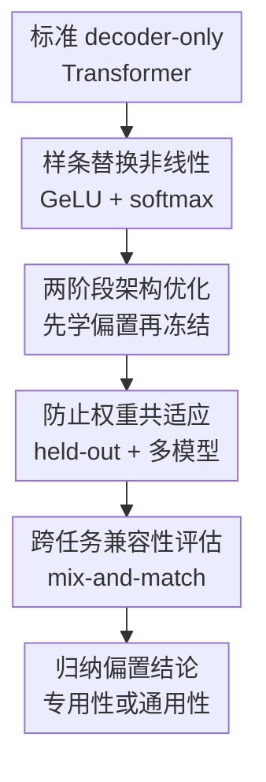

# Can Transformers Really Do It All? On the Compatibility of Inductive Biases Across Tasks

**会议**: ICLR 2026  
**OpenReview**: [https://openreview.net/forum?id=B08MW8oDqN](https://openreview.net/forum?id=B08MW8oDqN)  
**代码**: https://github.com/idiap/lm-afs  
**领域**: 学习理论 / Transformer 归纳偏置  
**关键词**: Transformer归纳偏置、架构搜索、可学习激活函数、算法推理、跨任务迁移

## 一句话总结

这篇论文把 Transformer 中最关键的非线性模块替换为可学习样条函数，用两阶段训练为特定数据集寻找更合适的架构偏置，并发现算法任务需要高度专用的偏置，而语言和代码建模之间的偏置兼容性明显更高。

## 研究背景与动机

**领域现状**：过去几年，Transformer 几乎成了多模态、语言、代码、视觉和语音建模的共同底座。很多系统之间的差别主要体现在规模、数据、tokenizer、训练配方或少量工程细节，核心架构仍然是注意力、MLP、GeLU、softmax 这一套。这种收敛让人自然产生一种直觉：Transformer 可能带有足够通用的归纳偏置，能够覆盖很大范围的真实世界任务。

**现有痛点**：这个直觉并不能解释 Transformer 在一些非常基础的算法任务上表现很差的现象。十进制加法、复制、括号匹配、needle-in-a-haystack 回忆等任务对人类来说很简单，但标准 Transformer 往往学习慢、seed 方差大、长度外推差，甚至在训练集拟合后仍不能稳定泛化。另一方面，很多针对这些 toy task 提出的新位置编码或注意力机制又很少被迁移到真实语言模型里，说明“对某个任务有效”和“能成为通用架构组件”之间可能隔着一层兼容性问题。

**核心矛盾**：论文关心的不是“Transformer 能不能靠更大规模补上这些能力”，而是更底层的问题：标准 Transformer 的架构偏置是不是已经接近某个任务的局部最优？如果某个任务存在一个只需轻微修改 Transformer 就能显著变好的架构，那么标准 Transformer 对这个任务就并非最合适；如果这种修改又不能迁移到别的任务，则说明不同任务所需要的偏置本身并不兼容。

**本文目标**：作者把问题拆成两个可实验化的问题。第一，给定一个数据集，能否自动找到一个比标准 Transformer 更适合它的局部架构变体，从而判断标准设计距离局部最优有多远？第二，把为任务 $D$ 找到的架构固定下来，再拿去训练任务 $D'$，能否用性能变化衡量两类任务所需归纳偏置的兼容性？

**切入角度**：论文没有做离散的神经架构搜索，也没有直接换掉整个 Transformer，而是盯住架构中最决定函数族形状的几个非线性：MLP 里的 GeLU，以及 attention 里的 softmax 核。作者认为，如果只替换这些非线性就能带来显著差异，那么它既足够局部、便于解释，也足以说明标准架构偏置并非唯一或最优。

**核心 idea**：用可学习的一维线性样条替代 GeLU 和 softmax 核，在 held-out 数据上优化这些非线性作为“架构超参数”，再冻结它们并从零训练新模型，用跨任务重训来测量不同任务归纳偏置是否兼容。

## 方法详解

### 整体框架

论文的方法可以看成一个“用可学习非线性探测架构偏置”的两阶段实验框架。第一阶段针对源数据集 $D$ 优化 Transformer 中的非线性函数，得到一个固定的优化架构；第二阶段冻结这些函数，只重新训练普通模型权重，并在同任务或其他任务 $D'$ 上评估训练速度、泛化和稳定性。这样，性能提升代表标准 Transformer 对该任务并非局部最优，跨任务性能则反映源任务偏置能否服务目标任务。

### 关键设计

**1. 样条替换非线性：把“架构偏置”压缩到少数可优化函数上**

标准 Transformer 与线性模型的关键差别集中在非线性操作上：MLP 用 GeLU 改变逐元素激活，attention 用 softmax 把 $QK^\top$ 变成归一化权重。作者因此不去搜索层数、宽度或连接方式，而是把 GeLU 和 softmax 的角色改写成可学习的一维函数。MLP 层原本可写为 $x \leftarrow W'\phi(Wx+b)+b'$，其中 $\phi$ 是 GeLU；本文把它替换成线性样条 $\phi_{\theta_{MLP}}$。样条由一组 keypoint 的函数值参数化，可以表示近似恒等、阶跃、周期波、尖锐转折等不同形状，比手工挑 ReLU、TanH、Swish 更少预设。

attention 侧的处理更细。标准 softmax attention 可以看成核注意力的一个特例：

$$
x_i \leftarrow \frac{\sum_j K(Q_i,K_j)V_j}{\sum_j K(Q_i,K_j)}, \quad K_{smax}(Q,K)=\exp(Q^\top K/\sqrt{d}).
$$

本文引入可学习映射 $\phi'_{\theta_A}:\mathbb{R}\rightarrow\mathbb{R}$，把核写成 $K(Q,K)=\phi'_{\theta_A}(Q)^\top\phi'_{\theta_A}(K)$。这样，作者能在不完全重写 Transformer 的情况下改变注意力相似度的归纳偏置。这个设计的价值在于：如果一个只改非线性的小变体就能在任务上远胜标准架构，那么问题很难再被解释成“模型没调好”或“容量不够”，而更像是标准非线性本身给了不合适的先验。

**2. 两阶段架构优化：先学任务偏置，再用标准训练检验它是否真的可复用**

如果在训练过程中一直同时更新模型权重和激活函数，那么优化出来的非线性可能只是为了配合某一次随机初始化和某组权重，而不一定代表可复用的架构偏置。论文因此采用两阶段设置。Stage I 在源数据集 $D$ 上同时训练模型权重和样条参数 $(\theta_A,\theta_{MLP})$，目的是找到适合该数据集的非线性；Stage II 冻结这些样条，把它们当成预调好的架构超参数，然后从随机初始化开始重新训练模型权重。

这个分离非常关键。Stage II 的模型没有沿用 Stage I 的权重，所以若它仍然比 baseline 学得更快、泛化更好或 seed 更稳定，说明优化出来的确实是架构层面的归纳偏置，而不是某个训练过程的偶然产物。更进一步，当 Stage II 的目标数据集换成 $D'\neq D$ 时，实验就变成了“用为源任务学到的偏置去训练目标任务”。这让跨任务兼容性从抽象概念变成了可测量的性能差异。

**3. 防止权重共适应：held-out 架构损失和多模型共享非线性让偏置更稳**

Stage I 仍然有一个风险：样条和权重可能共适应。比如某个激活形状只对当前 seed 的权重有利，换一个 seed 或数据拆分就失效。作者用两招把这种风险压下去。第一，训练数据被拆成 $D_{wts}$ 和 $D_{arch}$：模型权重在 $D_{wts}$ 上按常规 loss 更新，样条参数则只看 held-out 的 $D_{arch}$。这类似把架构参数放到验证集上优化，迫使它服务更泛化的学习行为，而不是记住训练权重的局部细节。

第二，作者在 Stage I 同时训练 $M$ 个不同随机种子的模型，它们各自有自己的权重 $\theta_m$，但共享同一组非线性参数。形式上，每个模型在自己的小批数据上得到 $L^m_{wts}$ 来更新权重，而架构 loss 则把所有模型在 $D_{arch}$ 上的损失加起来更新 $(\theta_A,\theta_{MLP})$。共享样条必须同时适配多组权重和 seed，因此更像真正的架构偏置。这个设计尤其适合算法任务，因为标准 Transformer 在这些任务上 seed 方差本来就很大，单 seed 的“好架构”很容易只是偶然。

**4. 跨任务兼容性评估：用 mix-and-match 区分“强偏置”和“通用偏置”**

论文最有意思的地方不是单任务提点，而是把学到的架构拿去互换。具体做法是：对每个任务 $D$ 先用 Stage I 优化出一套非线性；然后对每个目标任务 $D'$，都用“为 $D$ 优化的架构”从零训练模型，并与标准 Transformer 比较。这样得到一个任务到任务的矩阵，行表示架构来自哪里，列表示训练在哪个目标任务上。

这个矩阵能区分两种完全不同的情况。如果对角线大幅提升、非对角线经常下降，说明优化架构捕捉到的是高度专用的偏置，它很强但不通用。算法任务正是这种模式：ADD、COPY、MANO 等任务各自可以被显著加速或稳定化，但很多架构换到别的任务会变差。相反，如果自然语言和代码建模之间的矩阵变化很小，且一些优化能跨数据集保持轻微收益，就说明这些数据域所需的偏置更兼容，标准 Transformer 也更接近这一类任务的共同局部最优。

### 一个完整示例

以 COPY 长度外推为例，标准训练只看到长度 $2$ 到 $10$ 的序列，目标是在更长序列上复制输入。baseline Transformer 在长度明显超过训练区间时几乎崩掉；Alibi 位置编码能带来一些非平凡的外推能力，但仍然不是完整解法。论文把 Alibi 架构作为基底，在 Stage I 中让模型权重只在长度 $2$ 到 $10$ 的数据上更新，同时让样条参数在长度 $2$ 到 $15$ 的 held-out / OOD split 上更新。

这相当于给权重和架构分配不同职责：权重学习训练长度内的具体模式，样条则被迫服务稍长序列上的泛化。Stage II 冻结优化后的非线性，再从头训练模型。结果显示，Alibi 加上本文优化的非线性在更长序列上比单独 Alibi 更好，虽然仍不是彻底解决长度泛化。这个例子说明，长度外推失败不只来自位置编码，也和 MLP/attention 非线性带来的函数偏置有关。

### 损失函数 / 训练策略

Stage I 的训练可以概括为一套双 loss、共享架构参数的优化。给定训练序列集合 $D$，先拆成 $D_{arch}$ 与 $D_{wts}$。在每一步中，从 $D_{wts}$ 为每个并行模型采样小批数据，得到各自的权重损失 $L^m_{wts}$ 并更新 $\theta_m$；同时从 $D_{arch}$ 采样一个共享小批，计算所有模型的架构损失之和 $L_{arch}$，用它更新样条参数 $(\theta_A,\theta_{MLP})$。论文的算法任务通常用 $M=8$ 个并行模型，语言任务规模更大时用较少并行模型。

Stage II 则更像标准训练：冻结 Stage I 得到的 $\theta_A^\star,\theta_{MLP}^\star$，随机初始化模型权重，在目标数据集完整训练 split 上训练。论文特意保持 baseline 和优化架构在宽度、深度、学习率、batch size 等超参上可比；算法任务的 baseline 也经过调参，甚至使用 Canon layers 等有利设置，以避免把提升归因于弱 baseline。语言建模中作者还尝试了从 GeLU 初始化样条、只优化 MLP、同时优化 attention 和 MLP 等变体，发现大多数收益来自 MLP 非线性，softmax attention 更接近局部最优也更难优化。

## 实验关键数据

### 主实验

算法任务上的结论非常强：优化架构通常能显著加速收敛、减少 seed 方差，并改善测试或长度外推表现。语言和代码建模上的结论则温和得多：优化 MLP 非线性常有一致收益，但提升幅度小，且更多体现为标准 Transformer 不是唯一局部最优，而不是马上可替代的工程方案。

| 任务 / 数据集 | 评估指标 | 本文优化架构 | 标准 Transformer | 主要提升 |
|---|---|---|---|---|
| ADD / MANO 算法任务 | 测试准确率随训练步数变化 | 约 $2$ 到 $3\times$ 更快收敛，seed 曲线更集中 | 收敛慢且不同 seed 差异大 | 学习速度与稳定性显著提升 |
| COPY 长度外推 | 长度 $>10$ 的 sequence-wise accuracy | Alibi + 本文方法优于单独 Alibi | 标准 Transformer 在未见长度上几乎失败 | 非线性偏置也影响长度泛化 |
| TINYSTORIES | token prediction accuracy / perplexity | 2 层宽 256 时验证准确率 $64.4\%$ | GeLU baseline $63.7\%$ | 小但稳定的语言建模收益 |
| FINEWEB 较大模型 | validation loss | 12 层 spline 为 $3.68$，多项式近似为 $3.69$ | GeLU / ReLU 约 $3.72$ | 在更强 baseline 上仍有一致小收益 |

### 消融实验

| 配置 | 关键指标 | 说明 |
|---|---|---|
| 标准 softmax + GeLU | TINYSTORIES 验证准确率 $63.7\%$ | 主要 baseline，代表常规 GPT-2-style Transformer |
| 标准 softmax + 本文 MLP 样条 | TINYSTORIES 验证准确率 $64.4\%$ | 最清晰的语言建模收益来自替换 MLP 非线性 |
| 本文 attention + GeLU | 多个语言数据集持平或变差 | softmax 很难被简单样条核稳定超越，说明它对语言建模接近局部好解 |
| GLU/Swish vs GLU/Ours | TINYSTORIES 验证准确率 $63.7\%$ vs $64.0\%$ | 学到的样条也能替换 GLU 内部 Swish，收益不是只针对普通 MLP |
| 多模型训练 $M=1$ vs $M=6$ | 2 层宽 256 TINYSTORIES 准确率 $63.8\%$ vs $64.3\%$ | 多 seed 共享非线性让优化出的架构偏置更稳 |
| 样条 vs 多项式近似 | FINEWEB 12 层 validation loss $3.68$ vs $3.69$ | 高阶多项式近似能接近样条效果并显著降低推理/训练开销 |

### 关键发现

- 算法任务上的架构优化收益最大，尤其体现在收敛速度、泛化和 seed 稳定性上；这说明标准 Transformer 对这些任务的偏置明显不合适。
- 算法任务的跨任务矩阵呈现强对角线模式：为某个任务优化的架构往往最适合它自己，迁移到别的算法任务时收益有限甚至变差。
- 自然语言和代码建模上的收益小很多，但更能跨数据集迁移；这说明这些数据域所需的偏置更接近，标准 Transformer 对语言建模本来就比较合适。
- 代码数据相对自然语言获得的改进更大，作者推测这可能来自代码更强的系统结构和组合性，使其更接近算法任务。
- 语言任务中优化 MLP 非线性通常比优化 attention 更有效；softmax attention 不一定全局最优，但在这些实验中更像一个难以局部替换的强组件。
- 学到的样条形状在算法任务上可能很尖锐、很任务化，在语言任务上常像带细节的 wavelet；作者的对称化、周期化等手工清理反而会损害性能，说明细节不是纯噪声。

## 亮点与洞察

- 论文把“归纳偏置是否兼容”做成了可实验的矩阵，而不是停留在哲学讨论。通过先为源任务学架构、再在目标任务从零训练，它避免了直接比较不同任务 loss 的不可比问题。
- 只替换非线性是一个很克制的设计。它没有把问题扩大成庞大的 NAS，而是用少数可学习函数作为探针，因此提升越大，越能说明标准 Transformer 的核心非线性偏置存在错配。
- two-loss 加多模型共享是这篇论文最像“方法论贡献”的地方。它把可学习激活函数从“训练中额外参数”改造成“可冻结、可复用、可跨任务测试的架构超参数”。
- 论文给 Transformer 通用性提供了一个更细的解释：它可能确实适合大量自然语言和代码数据，但这不等价于适合所有需要组合泛化或算法推理的任务。
- 对 LLM 研究的启发是，靠混合数据训练一个统一架构并不一定能自动获得所有能力；如果算法能力和语言流畅性需要的偏置冲突，未来可能需要多任务架构优化或更可组合的架构模块。

## 局限与展望

- 搜索空间仍然很窄。论文只改 MLP 和 attention 中的一维非线性，不能表示更复杂的 attention 形式、GLU 结构变化、路由机制或层间交互，因此“找到的最优”只是这个局部空间里的最优。
- 实验规模相对现代 LLM 很小。附录加入了 FINEWEB 和 NanoGPT Speedrun 风格 baseline，但仍远小于前沿模型规模；架构差异是否会随规模继续保留，需要更大资源验证。
- 优化出的样条在工程上不一定直接划算。作者用多项式近似缓解了成本，但 Stage I 本身仍较贵，且算法任务上的尖锐样条未必有同样高效的通用实现。
- 算法 toy task 是否代表真实 LLM 推理能力仍需谨慎。COPY、ADD、MANO 能暴露某些系统泛化缺陷，但真实推理混合了语言理解、记忆、工具使用和搜索，不能简单等同。
- 未来最自然的方向是多任务架构优化：不只为单个任务找最强偏置，而是显式寻找能同时支持语言、代码、长度泛化和算法推理的折中非线性或模块组合。

## 相关工作与启发

- **vs 可学习激活函数**: 传统 trainable activation 往往把激活函数作为训练时持续更新的额外参数，目标是提高当前模型拟合；本文强调冻结后重训和跨任务复用，目标是研究归纳偏置而不是单纯刷性能。
- **vs 神经架构搜索 NAS**: NAS 通常在预定义离散模块或宏观结构里搜索，本文用梯度直接优化连续的一维函数空间，搜索范围更局部但也更适合解释“非线性偏置”本身。
- **vs Transformer 长度泛化研究**: 很多工作聚焦位置编码或数据构造，本文表明 MLP/attention 非线性也会影响长度外推，因此位置机制不是唯一瓶颈。
- **vs LLM scaling law 观点**: scaling law 常暗示架构差异会在大规模下变小；本文提醒我们，架构偏置变小不等于不存在，某些能力缺陷可能正是靠规模在弥补不合适的偏置。
- **对后续研究的启发**: 可以把本文方法当成诊断工具，用来判断一个新任务是更像语言建模、代码建模，还是更像算法推理；如果任务优化出的非线性与语言域不兼容，就不应期待简单数据混合完全解决。

## 评分

- 新颖性: ⭐⭐⭐⭐☆ 用可学习样条探测 Transformer 归纳偏置并做跨任务兼容性矩阵，问题设定和实验视角很新。
- 实验充分度: ⭐⭐⭐⭐☆ 覆盖算法、语言、代码和附录中的更大语言模型实验，但规模距离现代 LLM 仍有明显差距。
- 写作质量: ⭐⭐⭐⭐☆ 主线清楚，方法动机解释充分，实验图表信息密度高；部分 appendix 细节较多，需要读者有架构和优化背景。
- 价值: ⭐⭐⭐⭐⭐ 它给“Transformer 是否万能”提供了可操作的诊断框架，对理解算法推理、代码建模和未来架构设计都有启发。

<!-- RELATED:START -->

## 相关论文

- [\[ICLR 2026\] Transformers Trained via Gradient Descent Can Provably Learn a Class of Teacher Models](transformers_trained_via_gradient_descent_can_provably_learn_a_class_of_teacher_.md)
- [\[ICLR 2026\] Transformers Are Inherently Succinct](transformers_are_inherently_succinct.md)
- [\[ICLR 2026\] Quantitative Bounds for Length Generalization in Transformers](quantitative_bounds_for_length_generalization_in_transformers.md)
- [\[ICLR 2026\] Probability Distributions Computed by Autoregressive Transformers](probability_distributions_computed_by_autoregressive_transformers.md)
- [\[ICLR 2026\] Efficient Turing Machine Simulation with Transformers](efficient_turing_machine_simulation_with_transformers.md)

<!-- RELATED:END -->
