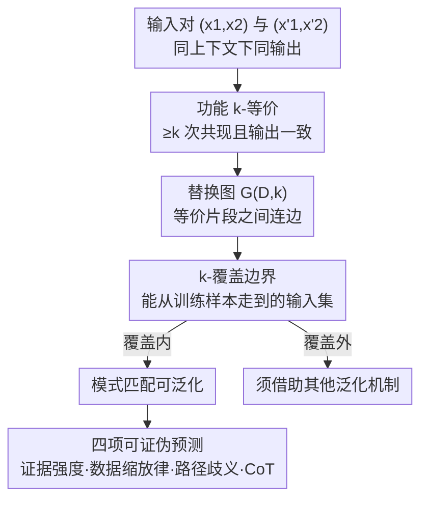

# Characterizing Pattern Matching and Its Limits on Compositional Task Structures

**会议**: ICLR 2026  
**OpenReview**: [https://openreview.net/forum?id=VCjlm003WL](https://openreview.net/forum?id=VCjlm003WL)  
**代码**: https://github.com/kaistAI/coverage-principle  
**领域**: 学习理论 / 组合泛化  
**关键词**: 模式匹配, 功能等价, 覆盖边界, 样本复杂度, 路径歧义

## 一句话总结
本文把 LLM 常被诟病的"模式匹配"严格形式化为**功能等价（functional equivalence）**——只有当两段输入片段在相同上下文里被反复观测到产生相同输出时，模型才能在它们之间安全替换——并据此定义出一条可判定、可证伪的**覆盖边界（coverage）**，进而证明了组合任务的数据缩放律、揭示了"路径歧义"这一结构性失败模式，给模式匹配能做到什么、做不到什么画出了一条精确的界线。

## 研究背景与动机
**领域现状**：大量组合泛化研究都指向同一个观察——LLM 在多跳推理、数学推理、语义解析等需要"组合"的任务上反复栽跟头，主流解释是它们靠的是"模式匹配"（学到输入片段与输出之间的局部统计规律），而不是真正的系统性泛化。

**现有痛点**：可"模式匹配"这个词一直停留在直觉层面。已有的行为学研究往往用允许多种泛化来源混在一起的任务设定（既有代数不变性、又有结构重复），既没有给"模式匹配"一个精确定义，又只能事后（post-hoc）诊断某个失败"看起来像模式匹配"，无法**事前预测**哪些输入靠模式匹配能搞定、哪些一定搞不定。

**核心矛盾**：根本问题是缺一个**数据中心、与模型无关**的定义。如果"模式匹配"不能被形式化成数据集本身的一个性质，就永远无法把它从其他泛化机制里干净地分离出来，也就谈不上刻画它的边界。

**本文目标**：(1) 给"模式匹配"一个可计算、可证伪的定义；(2) 在刻意剔除其他泛化来源的受控任务上，定量刻画模式匹配的成功条件与极限。

**切入角度**：作者的关键直觉是——学习者只有在"两段输入被观测到行为完全一致"时，才有资格去利用它们之间的等价关系做替换泛化。把这个"被观测到一致"的次数当作证据强度，就能把模式匹配的能力量化出来。

**核心 idea**：把模式匹配定义为"在功能等价支持的覆盖范围内做安全替换"，覆盖之外的泛化必然需要别的机制——由此得到一条事前可算的边界 $\mathrm{Cover}_k(D)$。

## 方法详解

### 整体框架
本文不是提一个新模型，而是提一套**诊断框架 + 受控实验**。整条逻辑链是：先把"模式匹配"形式化为功能等价 → 由功能等价构造替换图 → 替换图的连通分量给出覆盖边界 → 在四类合成组合任务（2-HOP、PARALLEL 2-HOP、3-HOP、NON-TREE）上训练 GPT-2 与 Mamba，用覆盖边界去**事前预测**泛化的成败，并验证理论缩放律。任务全部用随机生成的映射构造，刻意去掉交换律等"非组合结构"的泛化来源，让功能等价成为唯一可用的泛化机制。

### 关键设计

**1. 功能等价与覆盖边界：把"模式匹配"变成数据集的可判定性质**

针对"模式匹配无法事前预测"这个痛点，作者给出两个核心定义。设真值映射 $f: X^\ell \to X$，固定一个非空真子集索引 $I \subset [\ell]$。两段子序列 $a, a'$ 在样本集 $S$ 中被称为**功能 $k$-等价**（记作 $a \equiv^{(D,k)}_I a'$），当且仅当：(1) **充分共现**——存在至少 $k$ 对"只在 $I$ 这段不同、其余完全相同"的输入对 $\{x, x'\}$（满足 $x_I=a, x'_I=a', x_{[\ell]\setminus I}=x'_{[\ell]\setminus I}$）；(2) **一致性**——每一对这样的共现都满足 $f(x)=f(x')$。直观说，就是"这两段东西在相同上下文里被看到行为一致至少 $k$ 次"，超参 $k$ 正是**证据强度**：$k=1$ 是最弱证据（一次共现即认等价），$k$ 越大要求越苛刻。

有了等价关系就能造**替换图** $G(D,k)=(V,E)$：顶点是所有可能输入 $X^\ell$，两点之间连边当且仅当它们只在某个功能 $k$-等价的片段上不同。**$k$-覆盖** $\mathrm{Cover}_k(D)$ 定义为替换图中能与某个已观测输入 $x\in D$ 连通的全部输入。作者由此把**模式匹配正式定义为"在 $k$-覆盖内、靠替换功能等价片段实现的泛化"**。这一招的妙处在于：覆盖是**纯数据集的性质**，与模型结构、学习算法无关，且对任意定长离散序列任务都能用算法（Alg. 1）精确判定。它比常规的"随机划分 train/test 得到的 in-domain (ID)"更严格——一个样本可能在常规意义上算 ID，却落在覆盖之外，框架能精确解释它为什么泛化不了。

**2. 证据强度（k-cutoff）预测实例成败，并对应到表示空间的聚类**

针对"哪些 ID 样本真能泛化"这个问题，作者给每个测试输入定义 **$k$-cutoff**：它落入 $k$-覆盖的最小 $k$ 值（覆盖外记为 0）。实验发现 $k$-cutoff 与实例级泛化精度**强正相关**：$k$-cutoff 高的样本很快学会，低的即便训练 50k epoch 仍迟迟不涨，而覆盖外（$k=0$）样本精度始终停在随机水平（$\approx 1/50$）。这同时解释了为什么模型对长尾分布吃力——稀有组合虽技术上属 ID，却只有微弱的功能等价证据（低 $k$），实际被推到了覆盖之外。

机制上，作者用一个自定义指标 **IICG（Intra–Inter Cosine Gap）** 把这件事落到表示空间：$\mathrm{IICG}=\cos_{\text{intra}}-\cos_{\text{inter}}$，即"共享同一中间状态 $b=f_1(x_1,x_2)$ 的隐向量两两余弦相似度均值"减去"不共享的均值"，值越大说明同状态片段聚得越紧。结果显示 $k$-cutoff 越高、IICG 越高（特定层/位置），即**更强的功能等价证据 → 更一致的内部表示**；覆盖外样本无任何聚类。因果追踪（causal tracing）进一步证实这些聚类对预测有因果作用。值得注意的是，这些聚类**不一定对齐词表嵌入**，意味着 logit lens 这类标准可解释性工具可能"看不见"它们。

**3. 数据缩放律：证明覆盖所需的样本量随词表规模多项式增长**

针对"要多少数据才能让全部 ID 都被覆盖"这个问题，作者证明了 2-HOP 任务的**紧样本复杂度界**（Theorem 6.1）：词表大小为 $n$，对均匀采样的训练集 $D$，一个在 $k$-覆盖内泛化的学习器若 $N \gtrsim n^{c}$（其中 $c=2.5-\tfrac{0.5}{k}$），就能高概率实现完美 ID 泛化；反过来当 $k\ge 2$ 且 $n^2 \lesssim N \lesssim n^c$ 时，某些 2-HOP 任务必然无法完美泛化。也就是说指数 $c\in[2,2.5)$，数据需求随 $n$ 多项式增长。

实证完美吻合：测得 2-HOP 指数 $c=2.26$，且越深的结构指数越大（PARALLEL-2-HOP $c=2.43$、3-HOP $c=2.58$）——每加一步计算就多一维需要稳健覆盖的关系，推高缩放陡度。更关键的是，这个指数在 GPT-2 参数量跨 **20 倍（68M→1.5B）**时几乎不变，在 Mamba 上也落在理论区间内，说明缩放律由**数据性质**而非模型容量/架构决定。还观察到随 $N$ 增大存在从"完全失败"到"完全成功"的尖锐相变（约 $N=20\text{k}$）。

**4. 路径歧义：模式匹配的结构性失败模式，CoT 也补不上**

作者用框架预测出一个此前未被刻画的失败模式——**路径歧义（path ambiguity）**。在 NON-TREE 任务里，$x_2$ 同时通过两条路径影响输出（既进 $f_1$、又直接进 $f_2$）。此时即便 $(x_1,x_2)$ 与 $(x'_1,x'_2)$ 产生相同中间状态 $b$，只要 $x_2\neq x'_2$ 就**无法建立功能等价**（它们在不同 $x_3$ 下不保证行为一致）。后果是模型不会形成统一的中间状态表示，而是发展出**以 $x_2$ 为条件的上下文相关表示**：按 $b$ 分组时 IICG 近零，按 $(b,x_2)$ 分组时 IICG 很高。这既损害泛化（即便喂近乎穷举的 ID 组合、扩到 1.5B 参数仍失败），又损害可解释性（logit lens 等线性探针无法可靠读出中间状态）。

链式思维（CoT）能缓解但治不本：让模型先吐中间状态再出最终答案，把多跳"拍平"成单跳序列，显著降低数据需求（3-HOP 指数从 2.58 降到 1.76，2/3/5-HOP 的指数趋于一致）；但路径歧义依旧存在——带 CoT 的 NON-TREE 在 2-HOP 能完美泛化的同等条件下仍失败，表示仍残留上下文依赖。这一发现呼应了"LLM 即便用 CoT + 海量数据仍难做复杂规划"的现实困境。

### 损失函数 / 训练策略
全程为标准下一 token 预测的从零训练（随机初始化 GPT-2，8 层 12 头 768 维为基座；另测 68M–1.5B 多尺度与 Mamba）。CoT 版本把任务改成多 token 预测：如 2-HOP 变为 $(x_1,x_2,x_3)\mapsto(b,t)$，先生成中间状态 $b$ 再生成最终输出 $t$。数据上每个原函数定义域取 $p_{\text{seen}}=0.7$ 标为"seen"，组合后均匀采样 $N$ 条；评测分 ID（原函数应用都见过、仅组合未见）与覆盖外（OOD，至少一个原函数应用从未见过）两套各 2000 例。

## 实验关键数据

### 主实验（数据缩放律指数）

| 任务结构 | 实测指数 $c$ | 说明 |
|--------|------|------|
| 2-HOP | 2.26 | 与理论界 $c=2.5-0.5/k$（$c\in[2,2.5)$）吻合 |
| PARALLEL 2-HOP | 2.43 | 并行两跳，多一维关系 → 指数更高 |
| 3-HOP | 2.58 | 结构越深、数据需求增长越陡 |
| 2-HOP（68M→1.5B GPT-2） | 2.13 / 2.26 / 2.28 | 跨 20× 参数指数几乎不变 |
| Mamba（4 层 256 维） | 2.00 | 落在理论区间内，缩放律与架构无关 |
| 2-HOP-CoT / 3-HOP-CoT / 5-HOP-CoT | 2.09 / 1.76 / 1.80 | CoT 把多跳"拍平"，指数大幅下降且趋同 |

（所有线性拟合 $R^2>0.98$。）

### 路径歧义诊断（IICG 分析）

| 任务 / 分组方式 | IICG | 含义 |
|------|------|------|
| 2-HOP，按 $b$ 分组 | 高 | 形成统一中间状态表示，泛化成功 |
| NON-TREE，按 $b$ 分组 | 近零 | 没有统一中间状态表示 |
| NON-TREE，按 $(b,x_2)$ 分组 | 高 | 退化为上下文相关表示 → 失败根因 |
| 覆盖外（$k=0$）任意分组 | ≈0 | 无功能等价证据，无聚类 |

### 关键发现
- **证据强度 $k$-cutoff 是实例级成败的强预测变量**：高 $k$-cutoff 样本泛化快，低的训练 50k epoch 仍滞后，覆盖外恒为随机水平（$\approx 1/50$）。
- **缩放律由数据决定而非模型**：指数跨 20× 参数与不同架构（Transformer/Mamba）稳定，呼应"堆参数难提升多跳推理"的现实。
- **路径歧义是硬墙**：扩到 1.5B、喂近乎穷举 ID 组合（$N=50\text{k}\approx 0.7^2\times 50^3\approx 61\text{k}$ 的 ID 三元组的绝大部分）、甚至 36k epoch 训到 0.96 精度，仍无统一中间状态表示——精度上去了但机制是错的。
- **CoT 提效不治本**：降数据需求、拉平多跳，但 NON-TREE 的路径歧义照样过不去。

## 亮点与洞察
- **把"模式匹配"从模糊术语变成可计算、可证伪的数据集性质**：功能等价 + 覆盖边界让人能在测试**之前**就判定哪些输入靠模式匹配能搞定，这在以往只能事后归因的领域是质的突破。
- **覆盖严于常规 ID**：揭示了"常规意义算 in-domain 却泛化失败"的精确成因——缺功能等价证据，把长尾失败、reversal curse、逻辑否定难题都统一进同一框架解释。
- **理论与实证罕见地咬合**：先证出 $c=2.5-0.5/k$ 的样本复杂度界，再用跨架构、跨 20× 参数的实验把指数测出来对上，这种"先证后验"的闭环在经验为主的 LLM 分析中很少见。
- **可迁移的诊断工具**：IICG 指标 + 覆盖判定算法（与任务无关）可直接搬到别的合成组合任务上做机制诊断；"以证据强度 $k$ 最大化覆盖"也给定向数据增广提供了量化目标。

## 局限与展望
- **任务高度合成**：用随机映射剔除了交换律、算子复用等自然语言里真实存在的结构，结论能否平移到真实 LLM/自然语言尚需验证（作者承认并把扩展到更真实设定列为未来方向）。
- **理论界只证了 2-HOP**：PARALLEL-2-HOP、3-HOP 的缩放律只有实证、无证明；更深结构的紧界仍是开放问题。
- **只覆盖一类机制**：作者自己指出泛化还有 function property-based（利用交换律等代数不变性）与 shared-operator（跨位置复用同一计算 $f_1=f_2$）两类机制，本文未刻画它们与模式匹配如何交互。
- **改进思路**：把覆盖框架与这两类机制联合建模，或据"最大化 $k$-覆盖"设计定向数据增广，验证能否真把多跳/规划任务的数据需求降下来，是顺理成章的下一步。

## 相关工作与启发
- **vs 行为学组合泛化研究（如 Mirzadeh、Dziri、Wang 等）**：他们在特定 benchmark 上观察到 LLM 组合泛化失败并事后归因"模式匹配"，本文给出形式化定义 + 受控隔离，把"看起来像模式匹配"变成"可事前判定是否在覆盖内"，区别在于从描述性走向预测性。
- **vs 机制可解释性（grokking / 中间状态表示，如 Wang et al. 2024a）**：他们发现 Transformer 内部可形成可识别的中间状态表示，本文进一步指出这种统一表示是由训练数据里的**功能等价证据**驱动（而非显式暴露中间步骤），并解释了 logit lens 在路径歧义任务上为何会失灵。
- **vs CoT 样本效率研究**：本文从覆盖角度解释 CoT 为何降数据需求——它把多跳"拍平"成单跳从而减少复合数据需求，同时点明 CoT 继承了路径歧义这一局限，给"CoT 也救不了复杂规划"提供了机制级解释。

## 评分
- 新颖性: ⭐⭐⭐⭐⭐ 首次把模式匹配形式化为可判定的覆盖边界，并证出组合任务的样本复杂度界
- 实验充分度: ⭐⭐⭐⭐⭐ 四类任务、跨 20× 参数、跨架构、CoT 对照、IICG + 因果追踪，理论实证闭环
- 写作质量: ⭐⭐⭐⭐ 形式化严谨、图表信息量大，但定义与定理较密、上手门槛偏高
- 价值: ⭐⭐⭐⭐⭐ 为组合泛化提供可证伪的诊断框架，对数据增广与失败归因有直接指导意义

<!-- RELATED:START -->

## 相关论文

- [\[ICLR 2026\] Characterizing the Discrete Geometry of ReLU Networks](characterizing_the_discrete_geometry_of_relu_networks.md)
- [\[ICLR 2026\] On the Computational Limits of AI4S-RL：A Unified $\varepsilon$-$N$ Analysis](on_the_computational_limits_of_ai4s-rl_a_unified_varepsilon-n_analysis.md)
- [\[ICLR 2026\] The Expressive Limits of Diagonal SSMs for State-Tracking](the_expressive_limits_of_diagonal_ssms_for_state-tracking.md)
- [\[ICLR 2026\] Sharp Asymptotic Theory for Q-Learning with LD2Z Learning Rate and Its Generalization](sharp_asymptotic_theory_for_q-learning_with_textttld2z_learning_rate_and_its_gen.md)
- [\[ICLR 2026\] Neural Collapse in Multi-Task Learning](neural_collapse_in_multi-task_learning.md)

<!-- RELATED:END -->
