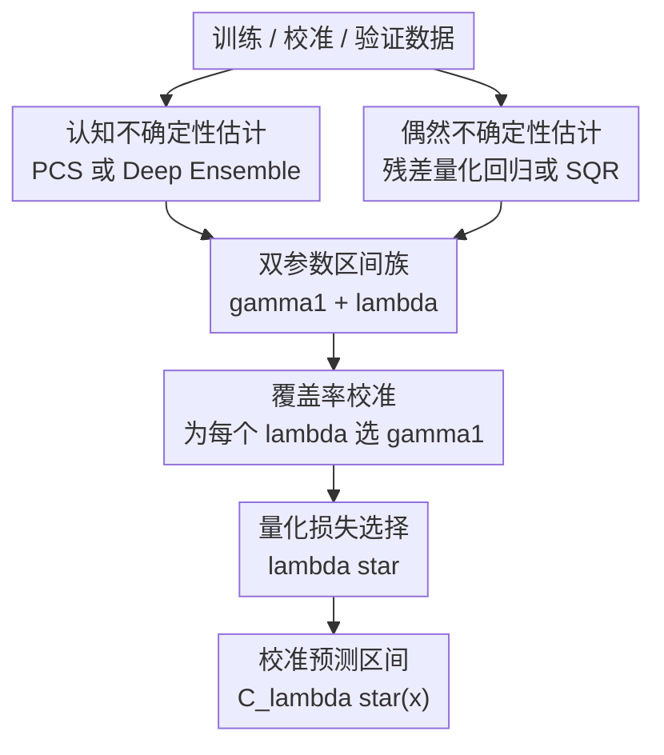

# CLEAR: Calibrated Learning for Epistemic and Aleatoric Risk

**会议**: ICLR2026  
**OpenReview**: [https://openreview.net/forum?id=RY4IHaDLik](https://openreview.net/forum?id=RY4IHaDLik)  
**代码**: https://github.com/Unco3892/clear  
**领域**: 学习理论 / 不确定性校准  
**关键词**: [校准学习, 预测区间, 认知不确定性, 偶然不确定性, 条件覆盖]

## 一句话总结
CLEAR 提出一个双参数校准框架，把回归预测区间里的偶然不确定性和认知不确定性按数据自适应比例合并，在保持名义覆盖率的同时显著缩窄区间并改善条件覆盖。

## 研究背景与动机
**领域现状**：可靠机器学习里，不确定性量化通常希望给每个输入 $x$ 输出一个预测区间 $C(x)$，并让真实标签以至少 $1-\alpha$ 的概率落在区间中。保形预测和校准方法已经能提供边际覆盖率保证，也就是平均意义上覆盖足够多测试样本；量化回归、CQR、深度集成、Bayesian 方法等也都能给出不同形式的不确定性估计。

**现有痛点**：边际覆盖并不等于每个局部区域都可靠。一个方法可能在高密度区域过宽、在外推区域欠覆盖，平均下来仍然满足 $95\%$ 覆盖。尤其在回归任务里，很多方法只建模噪声本身带来的偶然不确定性，却忽略训练样本稀疏、模型选择和数据处理选择带来的认知不确定性；另一些方法能反映认知不确定性，但在数据本身噪声很高的位置又会给出不够合适的区间。

**核心矛盾**：偶然不确定性和认知不确定性不是同一种风险。前者来自观测噪声、缺失协变量或真实随机性，即使多收集同类样本也不一定消失；后者来自有限样本、模型设定和数据处理选择，在外推区域或低样本区域尤其明显。预测区间要同时覆盖这两类风险，但二者的尺度取决于数据集和估计器，简单相加或固定比例合并很容易偏向某一侧。

**本文目标**：作者希望构造一种回归预测区间方法，它既能利用偶然不确定性估计器，也能利用认知不确定性估计器；既保持校准后的名义覆盖率，又通过验证集自动选择两类不确定性的相对权重；同时让选出的权重本身具有解释性，帮助判断当前任务主要受哪类风险支配。

**切入角度**：论文的观察是，许多已有方法的问题不在于没有任何不确定性估计，而在于把两类估计的比例预先写死。例如某些方法相当于默认两类不确定性同等重要，或只调一个整体缩放系数。CLEAR 反过来把“总区间要多宽”和“两类不确定性如何分摊”拆成两个可校准参数，在验证集上用覆盖约束和量化损失共同决定。

**核心 idea**：用两个参数 $\gamma_1$ 和 $\gamma_2$，或者等价地用整体校准尺度 $\gamma_1$ 与比例 $\lambda=\gamma_2/\gamma_1$，自适应合并偶然不确定性与认知不确定性，从而学习出既校准又更锋利的预测区间。

## 方法详解

### 整体框架
CLEAR 面向回归预测区间：给定点预测器 $\hat f(x)$、一个偶然不确定性估计器和一个认知不确定性估计器，方法先分别估计两个方向上的区间扩张量，再对一组候选 $\lambda$ 做搜索。对每个 $\lambda$，CLEAR 先选择最小的 $\gamma_1$ 使校准集达到目标覆盖率，再用验证集上的 quantile loss 选出最优 $\lambda^\star$。

论文强调 CLEAR 不是绑定某个具体模型的架构，而是一个校准层。主实验里，偶然不确定性来自基于残差的量化回归，认知不确定性来自 PCS 框架下的模型扰动集成；额外实验又把同一校准思想迁移到 Deep Ensembles 和 Simultaneous Quantile Regression，说明它更像一个可插拔的组合原则。

### 关键设计
**1. 双参数区间族：把区间总宽度和不确定性比例拆开学**

CLEAR 的核心形式是围绕点预测 $\hat f(x)$ 构造区间。直观写法是 $C(x)=[\hat f(x)\pm \gamma_1\cdot \text{aleatoric}(x) \pm \gamma_2\cdot \text{epistemic}(x)]$，论文进一步令 $\gamma_2=\lambda\gamma_1$，于是 $\gamma_1$ 负责整体缩放，$\lambda$ 负责认知不确定性相对偶然不确定性的权重。这样做的好处是，覆盖率校准和风险来源解释不再混在一个参数里。

更具体地，若偶然不确定性给出上下方向的 $\hat q^{ale}_{\alpha/2}(x),\hat q^{ale}_{1-\alpha/2}(x)$，认知不确定性给出 $\hat q^{epi}_{\alpha/2}(x),\hat q^{epi}_{1-\alpha/2}(x)$，则对每个候选 $\lambda$，区间可写为 $[\hat f-\gamma_1\hat q^{ale}_{\alpha/2}-\lambda\gamma_1\hat q^{epi}_{\alpha/2},\hat f+\gamma_1\hat q^{ale}_{1-\alpha/2}+\lambda\gamma_1\hat q^{epi}_{1-\alpha/2}]$。当 $\lambda=0$ 时，区间基本只信偶然不确定性；当 $\lambda$ 很大而 $\gamma_1$ 很小时，区间主要由认知不确定性支配。这个连续调节机制比固定 $\lambda=1$ 或固定某一个尺度参数更适合数据分布会变化的场景。

**2. 残差量化回归：让偶然不确定性围绕点预测误差而不是原始标签建模**

论文认为，直接对 $Y$ 的条件分位数建模会把均值函数和噪声结构缠在一起，尤其在点预测器已经很强时，区间上下界未必能稳定反映“不可约噪声”。CLEAR 主实验采用 ALEATORIC-R：先得到稳定点预测 $\hat f$，再用残差 $Y_i-\hat f(X_i)$ 训练量化回归模型，估计条件残差分位数。

这个改动看似小，但它让偶然不确定性估计更接近“围绕当前预测的局部误差形状”。如果一个位置的标签本来就噪声大，残差分位数会变宽；如果均值函数难学但噪声不大，残差模型不会把模型无知全都误归因给偶然风险。后续再交给认知不确定性分支去描述外推和模型选择风险，二者的职责更清楚。

**3. PCS / 集成认知不确定性：把有限样本和模型选择风险显式放进区间**

CLEAR 的认知分支可以接任意 epistemic estimator。主实验使用 PCS-UQ 思路：从不同模型、不同扰动或不同可接受数据科学选择中得到一组估计器，再用这些估计器的分散程度构造认知不确定性。论文实现里主要跳过复杂预处理扰动，聚焦模型扰动；variant (a) 使用量化模型集合，variant (b) 限制到 QXGB，variant (c) 使用标准 PCS 均值模型。

这一步解决的是传统 CQR 在外推区域容易欠覆盖的问题。数据稀疏处，残差分位数可能因为校准样本少而看不出危险，但不同模型在该处的预测会更分散；把这部分作为 epistemic 量加入区间后，CLEAR 可以在低密度区域主动变宽，而不是只追求平均覆盖。

**4. 先覆盖校准、再量化损失选 $\lambda$：用两个准则分别管可靠性和锋利度**

对每个候选 $\lambda\in\Lambda$，CLEAR 选择最小 $\gamma_1$，使校准集上至少 $\lceil(1-\alpha)(|D_{cal}|+1)\rceil$ 个点被区间覆盖。这一步继承保形校准的思想：先保证区间不会因为追求窄而失去边际覆盖。随后，方法在验证集上计算区间上下界的 quantile loss，并选择 $\lambda^\star=\arg\min_{\lambda\in\Lambda}\text{QuantileLoss}(D_{val},C_\lambda)$。

Quantile loss 同时惩罚过窄导致的越界和过宽导致的不锋利，比只看 PICP 更能区分两个都达到覆盖率的方法。论文也给出理论讨论：在紧致 $\Lambda$、部分 PCS 基模型一致、偶然分位数估计一致等条件下，CLEAR 可以得到渐近条件有效性；同时，若校准集无限大，联合校准不会劣于单参数基线。实际实现中，$\lambda$ 网格包含 0 到 0.09 的线性网格和 0.1 到 100 的对数网格，共 4000 多个候选，校准搜索成本相对基模型训练很小。

### 一个完整示例
以 Ames Housing 为例，假设目标是给房价预测一个 $90\%$ 区间。只用 2 个特征时，模型可利用的信息少，很多不确定性来自房价本身难以由现有协变量解释；CLEAR 学到 $\lambda=0.64$、$\gamma_1=0.99$，校准后的 epistemic/aleatoric ratio 只有 0.03，说明区间主要靠偶然不确定性扩张。

当使用全部特征但训练样本减到 $20\%$ 时，情形反过来：输入信息更丰富，但样本不足导致模型选择和外推风险变大。CLEAR 将 $\lambda$ 推到 100，$\gamma_1$ 约为 0.01，校准后的 epistemic/aleatoric ratio 达到约 250.5。这个例子说明 $\lambda$ 不只是调参，它还能作为诊断信号：当前预测风险到底是“数据本来吵”，还是“模型还不够知道”。

### 损失函数 / 训练策略
CLEAR 的训练与校准可以分成三层。第一层是在训练集上训练点预测器、偶然不确定性模型和认知不确定性模型；第二层是在校准集上为每个 $\lambda$ 找最小 $\gamma_1$ 以满足覆盖率；第三层是在验证集上用 quantile loss 选 $\lambda^\star$。论文标准设置中常把 $D_{val}$ 也作为 $D_{cal}$ 使用，另在 appendix 提供更保守的 conformalized 设置，将验证部分拆成 $10\%$ 验证集和 $10\%$ 校准集。

量化损失的形式是上下界 pinball loss 的平均：若 $l(x),u(x)$ 是区间上下界，则 $\text{QuantileLoss}(D,C)=\frac{1}{2|D|}\sum_i[QL_{\alpha/2}(Y_i,l(X_i))+QL_{1-\alpha/2}(Y_i,u(X_i))]$。其中 $QL_\tau(y,q)=(y-q)(\tau-\mathbf{1}_{y\le q})$。覆盖率主要由校准步骤管，区间质量主要由 quantile loss 管，这种分工是 CLEAR 稳定性的关键。

## 实验关键数据

### 主实验
论文在合成数据和 17 个真实回归数据集上评估 CLEAR。真实数据来自一个较大的 UQ benchmark，每个数据集做 10 个随机 train/validation/test split，标准划分为 60%/20%/20%，主评估目标是 95% 名义覆盖。主要指标包括 PICP、NIW、NCIW、AISL 和 quantile loss，正文重点讨论 NCIW 和 quantile loss。

| 设置 | 对比对象 | 指标 | CLEAR 相对结果 | 说明 |
|------|----------|------|----------------|------|
| 17 个真实回归数据集 | PCS-UQ | Quantile Loss | 基线比 CLEAR 高 15.8% | CLEAR 区间更锋利且损失更低 |
| 17 个真实回归数据集 | ALEATORIC | Quantile Loss | 基线比 CLEAR 高 34.4% | 单独偶然分支最容易漏掉外推风险 |
| 17 个真实回归数据集 | ALEATORIC-R | Quantile Loss | 基线比 CLEAR 高 9.4% | 残差建模已很强，但缺少认知分支 |
| 17 个真实回归数据集 | PCS-UQ | NCIW | 基线比 CLEAR 高 17.5% | 只用认知不确定性会在部分区域过宽 |
| 17 个真实回归数据集 | ALEATORIC | NCIW | 基线比 CLEAR 高 28.3% | 原始 CQR 类方法区间质量较差 |
| 17 个真实回归数据集 | ALEATORIC-R | NCIW | 基线比 CLEAR 高 3.0% | CLEAR 在强基线之上仍有收益 |

合成实验的核心结论更直观：ALEATORIC-R 在高密度区域覆盖较好，但在低密度/外推区域欠覆盖；PCS 在外推处能变宽，却会在一些区域过宽或略欠覆盖；CLEAR 同时利用两者，在 $x$ 远离训练分布中心时扩张区间，在数据密集处保持相对窄的宽度。

### 消融实验
| 配置 / 场景 | NCIW / 改善 | Quantile Loss / 改善 | 覆盖率或解释 |
|-------------|-------------|----------------------|--------------|
| CLEAR + DE/SQR vs DE | NCIW 改善 28.57% | Quantile Loss 改善 23.98% | PICP 基本持平，说明框架可迁移到深度集成 |
| CLEAR + DE/SQR vs SQR | NCIW 改善 13.36% | Quantile Loss 改善 13.66% | 相比单独 SQR，加入 epistemic 分支仍有稳定收益 |
| CLEAR + conformal DE/SQR vs DE-conformal | NCIW 改善 27.90% | Quantile Loss 改善 24.08% | 即使基线已保形校准，双参数组合仍缩窄区间 |
| CLEAR + conformal DE/SQR vs SQR-conformal | NCIW 改善 13.23% | Quantile Loss 改善 10.12% | 对 aleatoric 深度分位数模型也有效 |
| Ames Housing, 2 features | NCIW 0.171 | Quantile Loss 3,131 | Coverage 0.89，优于 PCS 0.214 / CQR 0.186 的 NCIW |
| Ames Housing, all features | NCIW 0.103 | Quantile Loss 1,923 | Coverage 0.88，平均宽度 $55,910$，略优于 PCS/CQR |

### 关键发现
- CLEAR 在正文主设置中对 PCS、ALEATORIC 和 ALEATORIC-R 都表现更稳，其中 variant (a) 在 17 个数据集中的 15 个上成为最优方法或最稳定方法。这个结果说明收益不是来自单个数据集的偶然优势。
- 与 UACQR 的比较显示，CLEAR variant (c) 在 14/17 个数据集上整体优于两种 UACQR 版本；在 airfoil、energy efficiency、naval propulsion 等数据集上，NCIW/AISL/平均宽度可以有 40%-70% 级别优势，同时覆盖率仍超过约 94.5%。
- $\lambda$ 的取值具有数据依赖性。Ames Housing 中，2 个特征时 $\lambda=0.64$，全部特征且数据更少时 $\lambda$ 可升到 100；这支持论文关于“固定比例合并不够鲁棒”的动机。
- Conformalized 设置下仍有收益，但小校准集可能增加参数过拟合风险。论文因此提醒，在校准样本少于正文实验规模时，可能需要对 $\lambda$ 和 $\gamma_1$ 加先验或更谨慎地选网格。

## 亮点与洞察
- CLEAR 最巧的地方是把“不确定性估计质量”和“不确定性组合比例”分开处理。很多 UQ 方法默认估计器输出的两个尺度已经可比，但现实中 PCS、CQR、SQR、DE 的数值尺度完全可能不同；双参数校准提供了一个简单的尺度对齐层。
- 残差量化回归是一个很实用的 trick。它不需要重新发明 CQR，而是把量化回归的目标从 $Y$ 改成 $Y-\hat f(X)$，使 aleatoric 分支更像局部误差模型，这也解释了 CLEAR 为什么能比直接 CQR 或 ALEATORIC 更稳。
- $\lambda$ 的解释性值得关注。很多校准方法最终只输出一个区间，用户不知道宽度来自哪里；CLEAR 的比例参数可以告诉实践者当前风险更像噪声还是模型无知，这对主动学习、数据采集和特征补充都有价值。
- 方法具有较强的工程可插拔性。论文主线用 PCS+CQR，但 DE+SQR 实验说明只要能提供两类不确定性估计，CLEAR 就能作为后处理/校准模块接上去，这比绑定某一种 Bayesian 或 ensemble 架构更容易复用。

## 局限与展望
- CLEAR 依赖基础不确定性估计器的质量。如果 aleatoric 或 epistemic 分支本身严重失真，双参数校准只能做尺度补偿，不能凭空恢复正确的局部结构。
- 校准样本较小时，$\gamma_1$ 和 $\lambda$ 同时调参可能过拟合。论文实验中的校准集至少约 150 个样本，但在小数据或高维稀疏任务中，网格搜索可能需要正则化、先验或更保守的数据拆分。
- 当前形式采用加性组合，即两类区间扩张量线性相加。这个结构简单可解释，但未必适合所有分布形态，未来可以探索乘性、门控式或输入依赖的 $\lambda(x)$。
- 论文主要聚焦回归预测区间。分类任务、序列预测、时间序列和多输出结构中的不确定性组合更复杂，CLEAR 的思想可以迁移，但覆盖定义和损失函数需要重新设计。
- PCS 式 epistemic 不确定性需要研究者对数据处理和模型扰动做判断。论文主 benchmark 中简化了预处理扰动，真实数据科学流程里哪些扰动应该纳入 epistemic 集合仍然是方法使用者需要负责的部分。

## 相关工作与启发
- **vs CQR**: CQR 通过量化回归和保形校准获得边际覆盖，但主要反映 aleatoric 结构。CLEAR 保留校准思想，同时额外加入 epistemic 分支，因此在外推区域更能避免条件欠覆盖。
- **vs PCS-UQ**: PCS-UQ 通过模型和数据科学选择的稳定性描述认知不确定性，但不显式建模数据噪声。CLEAR 把 PCS 作为 epistemic 组件，再用残差量化回归补上 aleatoric 组件，区间通常更窄也更有针对性。
- **vs Deep Ensembles / SQR**: Deep Ensembles 常被用作 epistemic 估计，SQR 常被用作 aleatoric 分位数估计。CLEAR 的 DE+SQR 实验证明，它不是 PCS 专属方法，而是可以给不同 UQ 估计器加一个统一的校准组合层。
- **vs UACQR**: UACQR 也关注不确定性自适应的 conformal 区间，但 CLEAR 更明确地区分两类不确定性，并通过 $\lambda$ 和 $\gamma_1$ 共同校准。实验中 CLEAR 在多数数据集和指标上更稳定，尤其能避免某些 UACQR-P 出现无限宽区间的情形。

## 评分
- 新颖性: ⭐⭐⭐⭐ 双参数校准形式简单，但把 epistemic/aleatoric 的比例学习、覆盖约束和 quantile loss 选择放在一起很清晰。
- 实验充分度: ⭐⭐⭐⭐⭐ 合成实验、17 个真实回归数据集、PCS/CQR 与 DE/SQR 两套估计器、UACQR 对比和 Ames 案例都覆盖到了。
- 写作质量: ⭐⭐⭐⭐ 主文逻辑清楚，appendix 数据很全；但方法和实验细节分散在正文与附录之间，第一次读需要来回对照。
- 价值: ⭐⭐⭐⭐⭐ 对需要可解释预测区间的回归系统很实用，尤其适合外推风险和观测噪声同时存在的表格数据、科学建模和风险评估场景。

<!-- RELATED:START -->

## 相关论文

- [\[ICLR 2026\] Epistemic Uncertainty Quantification To Improve Decisions From Black-Box Models](epistemic_uncertainty_quantification_to_improve_decisions_from_black-box_models.md)
- [\[ICLR 2026\] Conformalized Decision Risk Assessment](conformalized_decision_risk_assessment.md)
- [\[ICLR 2026\] Robust Decision Making with Partially Calibrated Forecasts](robust_decision-making_with_partially_calibrated_forecasters.md)
- [\[ICLR 2026\] Trained on Tokens, Calibrated on Concepts: The Emergence of Semantic Calibration in LLMs](trained_on_tokens_calibrated_on_concepts_the_emergence_of_semantic_calibration_i.md)
- [\[ICLR 2026\] Risk Phase Transitions in Spiked Regression: Alignment Driven Benign and Catastrophic Overfitting](risk_phase_transitions_in_spiked_regression_alignment_driven_benign_and_catastro.md)

<!-- RELATED:END -->
