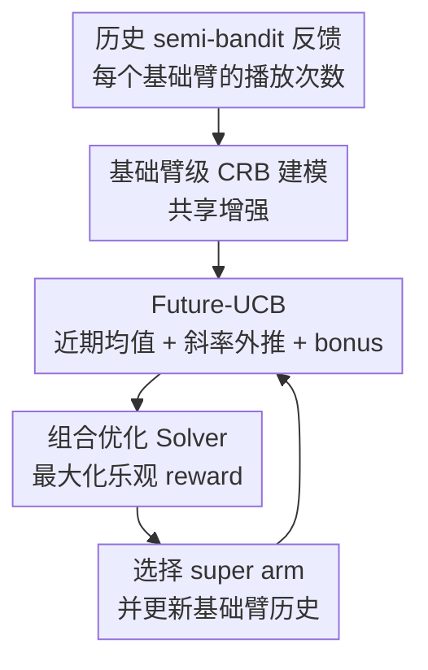

# Combinatorial Rising Bandits

**会议**: ICLR2026  
**OpenReview**: [https://openreview.net/forum?id=S4dg60APOk](https://openreview.net/forum?id=S4dg60APOk)  
**代码**: https://github.com/ml-postech/Combinatorial-Rising-Bandits  
**领域**: 学习理论 / Bandits / 在线学习  
**关键词**: 组合 bandit, rising bandit, 在线学习, regret bound, semi-bandit  

## 一句话总结
本文提出 Combinatorial Rising Bandit 框架来刻画“组合动作由会随使用变强的基础臂组成”的在线学习问题，并给出 CRUCB 算法，用 Future-UCB 在基础臂层面估计长期潜力，从理论上获得接近下界的 regret 保证，在合成最短路和 AntMaze 层次强化学习任务中都优于既有 bandit 方法。

## 研究背景与动机
**领域现状**：组合在线学习通常把一个动作看成若干基础臂的集合，例如一条路由路径由多条边组成、一个推荐包由多个物品组成、一个机器人计划由多个低层技能组成。经典 combinatorial bandit 的重点是利用 semi-bandit feedback 在基础臂层面学习均值，再通过最短路、匹配、生成树这类优化 oracle 选出最优 super arm。

**现有痛点**：许多真实系统并不是“拉一次臂只获得一次静态奖励”。机器人技能会因为反复练习而更熟，网络链路会因为流量历史和估计更新而更可靠，众包标注者会因为做过更多同类任务而提高准确率。这类奖励随使用次数上升的现象在 rising bandit 中已有研究，但已有 rising bandit 多把每个动作当作独立臂，无法处理组合动作之间共享基础臂的结构。

**核心矛盾**：组合结构和 rising 结构叠在一起后，最麻烦的不是“某个 arm 会变好”，而是“一个基础臂变好会同时影响所有包含它的 super arm”。如果把每条路径当作独立 rising arm，就会重复探索大量共享边，误把共享边带来的增益归因到整条路径；如果只用普通 combinatorial bandit，又会把早期 reward 高的 early peaker 误认为长期最优，错过晚熟但最终更好的 late bloomer。

**本文目标**：作者希望形式化一个新的 Combinatorial Rising Bandit (CRB) 问题，说明它与普通 combinatorial bandit、非组合 rising bandit 都不同；进一步设计一个既能利用基础臂共享结构、又能预测未来上升潜力的算法，并给出 regret 上下界来证明算法不是只在实验中有效。

**切入角度**：论文从“基础臂的 expected outcome 是其被播放次数的单调非降函数”出发，把 super arm 的 reward 写成这些基础臂均值的单调函数。这样一来，算法可以继续沿用 combinatorial bandit 中的 optimization oracle，同时把 rising bandit 的滑动窗口外推思想放在基础臂层面，而不是 super arm 层面。

**核心 idea**：用基础臂级别的 Future-UCB 估计每个可复用子动作的未来潜力，再把这些 optimistic 估计交给组合优化 oracle 选 super arm，从而同时处理“组合共享”和“奖励随练习上升”两个结构。

## 方法详解
CRB 的方法贡献可以分成两层：第一层是问题建模，明确 reward 会随着基础臂被使用次数上升；第二层是 CRUCB 算法，在每轮先为每个基础臂估计未来价值，再调用组合优化 Solver 选出当前最乐观的 super arm。理论分析则围绕 CRUCB 的 regret upper bound、CRB 的 lower bound，以及两者在不同增长难度下的接近程度展开。

### 整体框架
在 CRB 中，共有 $K$ 个基础臂，合法 super arm 集合为 $\mathcal{S} \subseteq 2^{[K]}$。第 $t$ 轮算法选择 $S_t \in \mathcal{S}$，其中每个基础臂 $i \in S_t$ 产生 outcome $X_i(t)$；该 outcome 的分布依赖于这个基础臂之前被播放的次数 $N_{i,t-1}$，均值记为 $\mu_i(N_{i,t-1})$。rising 条件要求 $\gamma_i(n)=\mu_i(n+1)-\mu_i(n) \ge 0$，也就是基础臂越练越好；理论部分还假设 $\mu_i$ 凹，即增量 $\gamma_i(n)$ 逐渐变小。

CRUCB 的每轮流程很简洁：用最近窗口估计基础臂当前水平，用有限差分估计它还能上升多少，再加一个比静态 UCB 更保守的探索 bonus，得到 Future-UCB 指数 $\tilde{\mu}_i(t)$；随后用 $\arg\max_{S \in \mathcal{S}} r(S, \tilde{\mu})$ 选 super arm。这个 Solver 是任务相关的 oracle，比如最短路任务里可以是 Dijkstra，最大匹配里可以是 matching solver。

### 关键设计
**1. CRB 建模：把 rising reward 放在基础臂而不是 super arm 上**

普通 rising bandit 会把每个可选动作看成一个独立 arm，于是“这条路径被试过几次”决定它的均值；本文认为在组合任务里真正会被训练、被复用、被改善的是基础臂，例如图上的边、机器人低层技能或候选匹配边。因此它定义 $X_i(t) \sim \mathcal{D}_i(N_{i,t-1})$，让每个基础臂的均值 $\mu_i(n)$ 随其自身播放次数 $n$ 上升，而 super arm reward 由 $r(S, \mu)$ 汇聚得到。

这个建模直接捕捉了 partially shared enhancement：如果两条路径共享同一条边，那么探索其中一条路径会提升这条共享边在另一条路径中的未来表现。它也解释了为什么旧算法会失效。非组合 rising 算法把整条路径当作独立臂，会错过共享边带来的统计效率；普通组合 bandit 能共享基础臂估计，却假设基础臂均值静态，会把“现在高”误读成“长期好”。

**2. Future-UCB：用近期均值、上升斜率和不确定性一起估计长期潜力**

CRUCB 的核心指数是 Future-UCB。对基础臂 $i$，它使用窗口大小 $h_i=\epsilon N_{i,t-1}$ 的最近观测，先计算最近平均 outcome，再用间隔 $h_i$ 的有限差分估计增长斜率，最后把未来还可能被播放的距离乘到斜率上做线性外推。论文的指数形式可以概括为

$$
\tilde{\mu}_i(t)=\underbrace{\text{recent mean}}_{\text{当前水平}}+\underbrace{\text{slope extrapolation}}_{\text{未来上升潜力}}+\underbrace{\beta_i(t)}_{\text{探索不确定性}}.
$$

这里的关键不是简单“加一个趋势项”，而是趋势项在凹性假设下具有乐观性：如果增量 $\gamma_i(n)$ 非增，那么用较早到较近的差分去外推未来增长，不会低估那些仍有上升空间的 late bloomer。探索 bonus 也比静态 bandit 更大，因为算法估计的不是当前均值，而是带未来外推的潜力，噪声会被 $(t-N_{i,t-1})$ 这类预测距离放大。

**3. Solver 解耦：保持组合结构，让算法适配不同在线优化任务**

Future-UCB 只给出基础臂层面的 optimistic value，真正的动作选择仍由 Solver 完成：$\text{Solver}(\tilde{\mu})=\arg\max_{S \in \mathcal{S}} r(S,\tilde{\mu})$。这使 CRUCB 不需要为最短路、最大匹配、最小生成树、$k$-MAX 分别设计完全不同的 bandit 算法，而是把组合结构交给已有优化 oracle。

这种解耦也避免了非组合 rising bandit 的组合爆炸。以 AntMaze-complex 为例，路径级 super arm 有 178 条，但基础边只有 48 条；如果在路径层面估计 rising value，每条路径都要独立积累经验，而 CRUCB 可以把一次路径尝试拆成多个边的 semi-bandit 反馈，直接更新所有相关基础臂的潜力。

**4. 难度自适应 regret 分析：用累计增量刻画什么时候能学快**

论文没有只给一个最坏情况线性 regret 结论，而是引入累计增量 $\Upsilon(M,q)=\sum_{l \in [M-1]} \max_i \{\gamma_i(l)^q\}$ 来刻画 rising 过程的难度。直观上，如果基础臂长期缓慢变化，早期观测很难判断长期最优，问题确实可能需要持续探索；如果 outcome 很快饱和，问题就更接近静态或短期非平稳 bandit，CRUCB 应该能获得次线性 regret。

上界中有两类项：一类来自 rising 难度和 super arm 大小，大致随 $K T^q \Upsilon(LT/K,q)$ 变化；另一类来自随机噪声和置信区间，规模为 $O(KT^{2/3}(\log T)^{1/3})$。论文还给出 general class 下的 $\Omega(LT)$ 下界，以及在 $\gamma_i(n) \le (n+1)^{-c}$、$1<c<2$ 的细粒度实例类中 $\Omega(\max\{L\sqrt{T},LT^{2-c}\})$ 的下界，说明 CRUCB 的上界在重要区间里和下界相当接近。

### 一个完整示例
考虑论文图 1 的在线最短路例子：从起点 $s$ 到终点 $g$ 有两条路径，一条由“共享边 + early peaker”组成，另一条由“共享边 + late bloomer”组成。early peaker 一开始 reward 高，但很快平台化；late bloomer 初始低，却随着更多训练迅速上升，长 horizon 下真正最优。

普通 SW-CUCB 会在基础臂层面共享估计，但因为它按当前窗口均值决策，容易过早相信 early peaker，之后不断 exploit 这条短期看起来好的路径。R-ed-UCB 会考虑 rising 趋势，却把两条路径当作两个独立 super arm；共享边每次被播放都会同时提升两条路径的实际潜力，但 R-ed-UCB 无法正确分摊这种增益，于是会把共享边的累计改善错归因到路径本身，长期在两条路径间摇摆。

CRUCB 的行为不同。它在基础臂层面对共享边、early peaker、late bloomer 分别估计 Future-UCB：共享边的改善会被所有包含它的路径共同使用，late bloomer 的斜率外推会让算法在其当前均值还低时仍保持乐观。Solver 把“共享边 + late bloomer”的长期潜力算成整条路径 reward 后，CRUCB 会较快转向 late bloomer 路径；实验中它的 cumulative regret 随后几乎变平，而两个 baseline 继续近似线性增长。

### 损失函数 / 训练策略
本文没有神经网络意义上的训练损失，核心是在线决策策略和 regret 分析。CRUCB 的可调训练/估计参数主要是滑动窗口比例 $\epsilon$，论文主实验取 $\epsilon=0.125$。窗口越小，估计更关注最近样本，对 rising 变化更敏感但方差更大；窗口越大，估计更稳定，但可能低估 late bloomer 的增长速度。

理论假设包括：每个基础臂的 outcome 分布是 $\sigma^2$-subgaussian，均值在 $[0,1]$ 内；均值函数单调上升且凹；reward function 对基础臂均值单调，并在 regret 上界中满足 Lipschitz 条件。对于 reward 结构，论文还分析了 additive-bounded 条件：若 $B_L\sum_{i\in S}\mu_i \le r(S,\mu) \le B_U\sum_{i\in S}\mu_i$，最优常数策略相对最优策略的累计 reward ratio 不超过 $B_U/B_L$；在纯加性 reward 下，最优常数策略是精确最优。

## 实验关键数据

### 主实验
| 任务 | 规模 / 设置 | 最优结构 | CRUCB 结果 | 主要对比结论 |
|------|-------------|----------|------------|--------------|
| Toy shortest path | 3 个基础臂，2 条路径 | late bloomer 路径长期最优 | regret 很快趋于平坦 | SW-CUCB 偏向 early peaker，R-ed-UCB 在两条路径间分散 |
| Path-easy | $K=12$, $|\mathcal{S}|=6$, $L=4$ | late bloomer 组成的固定路径 | 累积 regret 最低 | 所有 baseline regret 更高，R-ed-UCB 仍受共享增强误判影响 |
| Path-complex | $K=60$, $|\mathcal{S}|=252$, $L=10$ | 复杂图中的 late bloomer 路径 | 优势进一步扩大 | super arm 重叠越多，非组合 rising 方法越吃亏 |
| AntMaze-easy | $K=7$, $|\mathcal{S}|=3$, $L=5$ | 需要发现含 bottleneck edge 的 shortcut | 与 R-ed-UCB 明显优于非 rising 方法 | rising 探索帮助算法越过早期困难边 |
| AntMaze-complex | $K=48$, $|\mathcal{S}|=178$, $L=15$ | 复杂图中聚焦最优路径 | regret 最低，探索热图最接近 oracle | CRUCB 同时避免 impossible edges 和无效广泛探索 |

### 消融实验
| 配置 | 关键指标 | 说明 |
|------|---------|------|
| CRUCB | Path-easy 100K regret 约 8019，300K regret 约 19061；各任务曲线最低 | 基础臂级 Future-UCB + Solver，能同时利用 rising 与组合共享 |
| R-ed-UCB | Toy 和 Path-complex 中明显高于 CRUCB | 有 rising 外推，但在 super arm 层面学习，无法利用 partially shared enhancement |
| SW-CUCB / SW-CTS | Path 和 $k$-MAX 中常偏向 early peaker | 有组合结构，但缺少 rising 预测，会过早 exploit 当前高 reward |
| SW-UCB / SW-TS | 复杂图中有时优于组合非平稳方法，但整体仍落后 | 路径级广泛探索偶尔给 late bloomer 机会，但样本效率差 |
| 窗口比例 $\epsilon \in \{0.05,0.125,0.25,0.4\}$ | Path-easy 的 regret 数值几乎重合 | CRUCB 对窗口比例不敏感，主实验使用 $\epsilon=0.125$ 是稳健选择 |

### 关键发现
- CRUCB 的优势来自两个结构同时成立：基础臂会 rising，且 super arm 之间共享基础臂。只处理其中一个结构的 baseline 在简单图上还能勉强工作，到了 Path-complex 和 AntMaze-complex 就会暴露系统性偏差。
- 理论上，CRB 在完全一般的实例类中无法避免线性 regret；但如果增长斜率受到 $f(n)=(n+1)^{-c}$ 这类约束，CRUCB 的上界能随难度参数 $c$ 自适应变化，而算法本身不需要知道 $c$。
- AntMaze 实验很重要，因为它违反了严格凹性假设：edge outcome 在第一次成功前可能长时间为零，之后才开始上升。CRUCB 仍能胜出，说明算法的机制不只是为理论假设量身定制。
- 额外任务包括 $k$-MAX、maximum weighted matching 和 minimum spanning tree，CRUCB 都持续优于 baseline，支持 Solver 解耦带来的跨组合结构适配性。

## 亮点与洞察
- 把 rising 放在基础臂层面是这篇论文最关键的建模选择。它让“练习一个子技能会提升多个计划”的现象自然进入 bandit 形式化，而不是被粗糙地压成路径级非平稳奖励。
- CRUCB 的 Future-UCB 不是普通滑动窗口 UCB 的小修小补。它显式估计“未来如果继续投入会怎样”，因此能在当前 reward 仍低时给 late bloomer 保留机会。
- 理论分析没有停留在 worst-case 线性 regret，而是用累计增量和斜率衰减参数区分容易/困难实例。这对 rising bandit 很有启发：问题难度不只取决于 gap，也取决于 reward 曲线还会变多久、变多快。
- AntMaze 作为层次强化学习例子很贴切：高层路径选择是组合动作，低层边/技能会随训练提升。这个实验把理论模型和实际 RL 系统之间的连接讲得比较有说服力。
- Solver 接口让方法可迁移到网络路由、匹配、生成树和推荐包选择等任务。只要能拿到基础臂 semi-bandit feedback，并能解对应的组合优化问题，CRUCB 的框架就可复用。

## 局限与展望
- 理论分析依赖固定基础臂集合、固定组合结构、均值凹性和 semi-bandit feedback。真实机器人或推荐系统中，可行动作集合可能随时间出现/消失，低层技能也可能被发现或遗忘，这超出了当前 CRB 设定。
- CRUCB 需要 problem-specific Solver。对于最短路、匹配、生成树这类经典结构问题很自然，但如果 $\mathcal{S}$ 由复杂约束或神经生成器隐式定义，oracle 可能不可得或只可近似求解。
- Future-UCB 的外推基于有限差分和凹性乐观假设。AntMaze 中虽然非凹也有效，但更一般的非单调、阶段性退化、灾难性遗忘场景仍需要新的估计器。
- 实验主要比较 bandit baseline，没有与更完整的 model-based RL、Bayesian optimization 或 learning-to-rank 系统比较。若应用到推荐、路由或自动机器学习，还需要验证 feedback 延迟、非独立噪声和上下文特征带来的影响。
- 当前 regret 定义以 horizon $T$ 下的最优策略为基准，理论很强但也复杂。后续可以研究更易部署的 anytime 版本、未知 $T$ 的参数选择，以及 approximate Solver 下的 regret 退化。

## 相关工作与启发
- **vs combinatorial semi-bandit**: 经典 combinatorial bandit 在基础臂层面共享反馈并调用 Solver，但默认基础臂均值静态或只做一般非平稳窗口估计。CRB 的区别是把“使用导致未来 reward 上升”建成问题核心，CRUCB 因此需要预测未来潜力而不是只估当前均值。
- **vs non-combinatorial rising bandit**: Heidari et al. 和 Metelli et al. 等工作研究 arm 随播放次数改善的问题，但动作之间没有共享基础臂。本文显示在组合结构下常数策略不总是精确最优，路径间共享增强会让最优性刻画更复杂。
- **vs graph-triggered rising bandit**: Graph-triggered rising bandit 也考虑臂之间的依赖，但通常假设邻居受到统一触发增强。CRB 的 partially shared enhancement 更贴近组合动作：增强不是由外部图邻接统一传播，而是由 super arm 中实际包含的基础臂共享出来。
- **对在线强化学习的启发**: 很多层次 RL 或技能库系统可以被看成“高层组合选择 + 低层技能练习”。CRUCB 提醒我们，高层探索策略不应只看当前成功率，还要显式估计低层技能经过练习后的长期潜力。
- **对系统调度和路由的启发**: 如果一个子资源被使用后会变得更可靠或更便宜，短期最优路线可能不是长期最优路线。把子资源的学习曲线纳入组合优化，比简单地给路径做滑动平均更稳。

## 评分
- 新颖性: ⭐⭐⭐⭐⭐ 提出了组合结构与 rising reward 的交叉问题，并指出 partially shared enhancement 会改变最优策略和算法设计。
- 实验充分度: ⭐⭐⭐⭐☆ 覆盖合成图、AntMaze 层次 RL 和多个组合优化任务，baseline 选择有针对性；真实系统级实验还可以更广。
- 写作质量: ⭐⭐⭐⭐☆ 问题定义、算法和理论主线清楚，toy example 很有帮助；证明和实验细节较多，读者需要一定 bandit 背景。
- 价值: ⭐⭐⭐⭐⭐ 对 bandits / online learning 理论有清晰贡献，也给机器人技能学习、路由、推荐等可复用子动作场景提供了很好的建模语言。

<!-- RELATED:START -->

## 相关论文

- [\[ICLR 2026\] Efficient Best-of-Both-Worlds Algorithms for Contextual Combinatorial Semi-Bandits](efficient_best-of-both-worlds_algorithms_for_contextual_combinatorial_semi-bandi.md)
- [\[ICLR 2026\] Diversified Multinomial Logit Contextual Bandits](diversified_multinomial_logit_contextual_bandits.md)
- [\[ICLR 2026\] Variance-Dependent Regret Lower Bounds for Contextual Bandits](variance-dependent_regret_lower_bounds_for_contextual_bandits.md)
- [\[ICLR 2026\] Queue Length Regret Bounds for Contextual Queueing Bandits](queue_length_regret_bounds_for_contextual_queueing_bandits.md)
- [\[ICLR 2026\] Lipschitz Bandits with Stochastic Delayed Feedback](lipschitz_bandits_with_stochastic_delayed_feedback.md)

<!-- RELATED:END -->
