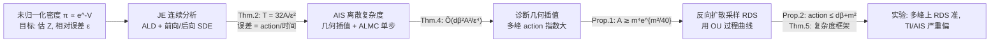

# Complexity Analysis of Normalizing Constant Estimation: from Jarzynski Equality to Annealed Importance Sampling and Beyond

**会议**: ICLR 2026  
**OpenReview**: [https://openreview.net/forum?id=96fJALwotm](https://openreview.net/forum?id=96fJALwotm)  
**代码**: [https://github.com/AlexandreGUO2001/NormConstEst](https://github.com/AlexandreGUO2001/NormConstEst)  
**领域**: 学习理论 / 采样复杂度（probabilistic methods, sampling）  
**关键词**: 归一化常数估计, Jarzynski 等式, 退火重要性采样, 非渐近复杂度, 最优传输, 反向扩散采样

## 一句话总结
本文首次给出 Jarzynski 等式（JE）和退火重要性采样（AIS）估计归一化常数 $Z$ 的**非渐近 oracle 复杂度**界，用「曲线的 action」替代等周不等式刻画难度，并指出几何插值在多峰分布上 action 指数大、进而提出基于反向扩散采样的新算法。

## 研究背景与动机
- **领域现状**：给定未归一化密度 $\pi \propto e^{-V}$，估计归一化常数 $Z = \int_{\mathbb{R}^d} e^{-V(x)}\,dx$（或自由能 $F = -\log Z$）是贝叶斯统计（边际似然）、统计力学（配分函数）、能量模型训练里的核心问题。直接重要性采样在高维或多峰时方差爆炸，于是 JE、AIS、SMC、热力学积分这些**退火类方法**成了主流。
- **现有痛点**：退火方法实证上很成功，但**理论保证几乎空白**。重要性采样的分析只到渐近偏差/方差；JE 的分析通常假设功（work）服从高斯/伽马这类简单分布；现有非渐近复杂度界又**几乎都依赖目标分布的等周性（log-concave / Poincaré）**——而真正难的多峰分布恰恰不满足这些条件。
- **核心矛盾**：要对**非 log-concave** 的目标分布给出 $Z$ 估计的严格非渐近复杂度，等周不等式这套工具用不上；同时几何插值（geometric interpolation）虽然 score 有闭式、用得最广，但在多峰分布上是否高效从未被定量刻画。
- **本文目标**：在对目标分布只加极弱假设（不要求 log-concave）的前提下，给出 JE / AIS 的非渐近 oracle 复杂度，并诊断几何插值的失效机制、给出更优的替代算法。
- **核心 idea**：**用「曲线的 action」当复杂度的核心量纲**——把连接参考分布与目标的概率测度曲线 $(\pi_\theta)$ 的「Wasserstein-2 速度平方积分」$A = \int_0^1 |\dot\pi|_\theta^2\,d\theta$ 作为唯一的几何难度刻画。action 有限是比等周不等式弱得多的条件，借助 Girsanov 定理 + 最优传输即可绕开等周假设。

## 方法详解

### 整体框架
论文沿「连续动力学 → 离散算法 → 诊断与改进」三步推进：先用退火 Langevin 扩散（ALD）把 JE 的估计误差刻画成「曲线 action 除以运行时间」（Thm. 2），从中看清误差来源是前向/后向 SDE 与参考轨迹之间的滞后；再把这套连续分析「离散化」成 AIS 的 oracle 复杂度界（Thm. 4）；最后定量证明几何插值在多峰分布上 action 指数大（Prop. 1），并换用 OU 过程的反向扩散曲线给出 action 仅 $O(d\beta+m^2)$ 的新算法（Prop. 2 + Thm. 5）。

### 关键设计

**1. 用 action 刻画 JE 的非渐近误差：把统计效率翻译成「曲线速度 × 运行时间」。** 退火 Langevin 扩散在时刻 $t$ 以 $\tilde\pi_t = \pi_{t/T}$ 为目标，但样本真实分布 $\mathrm{Law}(X_t)$ 与 $\tilde\pi_t$ 之间始终存在滞后，这个滞后正是估计量 $\hat Z = Z_0 e^{-W(X)}$ 方差的根源。作者不去假设目标满足等周不等式，而是引入一条「完美补偿漂移」的参考路径测度 $\mathbb{P}$（其边际恰好是 $\tilde\pi_t$，对应让 SDE 严格沿曲线走的 Fokker-Planck 解），再用 Girsanov 定理把前向/后向路径测度与 $\mathbb{P}$ 的 KL 散度算出来，并由 Lemma 4 取最优补偿场使该 KL 最小化——最小值恰好等于度量导数 $|\dot{\tilde\pi}|_t$，积分即 action $A$。结论是 Thm. 2：只要运行时间 $T = \tfrac{32A}{\varepsilon^2}$，就能以 $\geq 3/4$ 概率把相对误差控制在 $\varepsilon$ 内。这个界对**任意插值曲线**成立，且和经典的耗散功 $W_{\mathrm{diss}} = \overline{W} - \Delta F = \mathrm{KL}(\mathbb{P}^\rightarrow\|\mathbb{P}^\leftarrow)$ 的热力学第二定律刻画相吻合。

**2. 把连续分析离散化成 AIS 的首个 oracle 复杂度界。** 实际中既不能精确模拟 ALD、也无法精确算功，于是用「几何插值」$\pi_\theta \propto \exp(-V - \tfrac{\lambda(\theta)}{2}\|\cdot\|^2)$（退火 schedule $\lambda(\theta) = 2\beta(1-\theta)^r$）配上单步退火 Langevin（ALMC，指数积分离散）作为转移核 $\hat F_\ell$。作者把估计拆成两阶段——先用热力学积分（TI）估好条件良好的 $Z_0$（耗 $\tilde O(d^{4/3}/\varepsilon^2)$），再用 AIS 估 $Z/Z_0$。证明思路（Fig. 1）是：定义无离散误差的参考路径 $\mathbb{P}$，用链式法则把 $\mathrm{KL}(\mathbb{P}\|\mathbb{P}^\leftarrow)$ 和 $\mathrm{KL}(\mathbb{P}\|\overline{\mathbb{P}}^\rightarrow)$ 分解成逐段转移核间的 KL，再用 Girsanov 控制每一段。最终给出 Thm. 4 的复杂度

$$\tilde O\!\left(\frac{d^{4/3}}{\varepsilon^2} \;\vee\; \frac{m\beta A^{1/(2r)}}{\varepsilon^2} \;\vee\; \frac{d\beta^2 A^2}{\varepsilon^4}\right),$$

三项分别来自「估 $Z_0$」「控制连续动力学误差」「控制离散误差」。这是**首个不假设 log-concave 的归一化常数估计算法复杂度界**；其中 $1/\varepsilon^4$ 来自连续时长 $T = \Theta(1/\varepsilon^2)$ 除以步长 $\tilde\Theta(\varepsilon^2)$。

**3. 诊断几何插值：定量解释「质量瞬移」导致的指数级 action。** 既然复杂度由 action $A$ 主导，作者直接问几何插值的 action 有多大。Prop. 1 取一维高斯混合 $\pi = \tfrac12\mathcal{N}(0,1) + \tfrac12\mathcal{N}(m,1)$，证明其几何插值曲线的 action 满足 $A_r \gtrsim m^4 e^{m^2/40}$——**随峰间距 $m$ 指数爆炸**。技术核心是用逆 CDF 写出一维 $W_2$ 距离的闭式，并在「曲线变化最剧烈的、靠近目标分布处」下界度量导数。直觉是退火末段质量必须在极短时间内从一个峰「瞬移」到另一个分离的峰（靠两峰权重的此消彼长），这正是采样器 torpid mixing 的根源，也给「质量瞬移 / 模式切换」现象一个定量解释。

**4. 反向扩散采样（RDS）：换 OU 曲线把 action 压到多项式级。** 既然几何插值的曲线选得不好，作者改用 OU 过程 $dY_t = -Y_t dt + \sqrt2\,dB_t$ 把目标 $\pi$ 演化到 $\mathcal{N}(0,I)$，并用其时间反演 $(\pi_{T-t})$ 作为 AIS 的插值曲线。Prop. 2 证明这条曲线的 action $\int_0^\infty |\dot\pi|_t^2\,dt \leq d\beta + m^2$——**只与维度/光滑度线性相关**，远好于几何插值。代价是 OU 曲线的漂移项依赖中间分布的 score $\nabla\log\pi_t$，没有闭式、需要估计（可用 RDMC/RSDMC/ZODMC/SNDMC 等 learning-free 方式）。Thm. 5 给出 RDS-based 估计 $\hat Z = e^{-W(X)}$ 的统一复杂度分析框架：只要 $\mathrm{KL}(Q\|Q^\dagger) \lesssim \varepsilon^2$ 且 $\mathrm{TV}(\pi,\pi_\delta) \lesssim \varepsilon$（早停 $\delta \asymp \varepsilon^2/(\beta^2 d^2)$）即满足精度。这揭示了一个根本权衡：**可解析曲线（几何插值）漂移有闭式但 action 差，可优曲线（OU）action 好但漂移要费力估计**。

## 实验关键数据

### 主实验表格
二维多峰目标上对比 TI、AIS 与四种 RDS 方法，报告 $\hat Z/Z$（越接近 1 越好）、MMD、$W_2$（越小越好）：

| Target | Metric | TI | AIS | RDMC | RSDMC | ZODMC | SNDMC |
|--------|--------|----|----|------|-------|-------|-------|
| MMB | $\hat Z/Z$ | 0.753±0.009 | 2.974±7.671 | 0.983±0.212 | 1.289±12.78 | 0.988±0.115 | **1.005±0.119** |
| GM | $\hat Z/Z$ | 0.243±0.002 | 0.204±0.001 | **1.000±0.085** | 0.920±1.028 | 0.977±0.284 | 0.997±0.083 |
| GM | MMD↓ | 2.541±0.028 | 2.462±0.027 | 0.358±0.037 | 0.312±0.040 | 0.259±0.038 | **0.158±0.028** |
| GM | $W_2$↓ | 10.56±0.08 | 10.48±0.09 | 7.02±0.91 | 2.60±0.25 | 2.45±0.30 | **1.55±0.68** |

MMB = 修改版 Müller-Brown 势，GM = 4 分量高斯混合，均在 $\mathbb{R}^2$。

### 关键发现
- **TI / AIS（基于几何退火）在多峰上严重偏**：GM 上 $\hat Z/Z$ 只到 0.20~0.24，因为模式覆盖不全（与 Prop. 1 的 action 指数爆炸一致）。
- **所有 RDS 方法都给出准确的 $Z$ 估计和高质量样本**，SNDMC 综合最稳（$W_2$、MMD 最低）；AIS 偶尔方差极大（MMB 上 std 高达 7.67），说明几何插值下估计极不稳定。
- 理论与实验闭环：action 大 ⇒ 估计偏，action 小（OU 曲线）⇒ 估计准。

## 亮点与洞察
- **用 action 统一刻画难度**，绕开等周不等式，把「采样 vs 归一化常数估计」两个任务的复杂度在连续、非 log-concave 设定下定量联系起来（Thm. 2 的时长与 Guo et al. 2025 的采样时长同阶），呼应了离散设定下 Jerrum-Sinclair-Vigoda 的经典互推结果。
- **首个非 log-concave 的 AIS 复杂度界**，填补了退火方法「实证强、理论空」的缺口。
- **把「质量瞬移」从定性现象变成定量下界**（Prop. 1 的 $e^{m^2/40}$），为「几何插值为何在多峰上失败」给出干净解释，并据此自然导出 RDS 替代方案。
- 揭示「曲线可解析性 ↔ action 优劣」的根本权衡，为后续算法设计指明取舍维度。

## 局限与展望
- **上界紧性未知**：Thm. 2、Thm. 4 是否最优、是否存在匹配下界尚不清楚。
- Prop. 1 的 action 指数下界**并不直接等价于** JE 需要指数时间收敛——action 大是充分非必要的困难信号。
- action 虽给出干净的统计效率刻画，但其**实际可解释性 / 可计算性**仍不清楚。
- 作者猜想证明技术可推广到 underdamped/Hamiltonian Langevin、并行采样器，以及紧支撑分布（凸体体积）与离散分布（Ising、RBM，经 Poisson 随机积分）。
- RDS 的总复杂度仍含 $\exp$ 项（依赖底层 score 估计器），离「多项式时间多峰估计」还有距离。

## 相关工作与启发
- **退火方法谱系**：path sampling、AIS（Neal 2001）、SMC、热力学积分（Kirkwood 1935）、Jarzynski 等式——本文统一在「曲线 action」框架下分析其中两条主线（JE 与 AIS）。
- **等周外采样**：weak Poincaré、扩散去噪采样（RDMC/ZODMC）等是本文 RDS 部分的工具来源；尤其受 Guo et al. (2025) 用 action 刻画退火采样收敛的启发，本文把它从「采样」扩展到「归一化常数估计」这个概念不同的任务，并补上几何插值 action 的下界。
- **方差缩减**：escorted simulation、学习最优控制协议、score-based 反向核等变方差技术，与本文「路径测度差异即复杂度核心」的视角一脉相承。
- **启发**：把估计量的统计效率「翻译」成概率测度曲线上的几何量（action / 度量导数），是一条可迁移到其它蒙特卡洛任务的分析范式；「曲线选择」本身可作为算法设计的优化变量。

## 评分
- **新颖性**: ⭐⭐⭐⭐⭐ 首个非 log-concave 的 JE/AIS 非渐近复杂度界，用 action 替代等周、定量解释质量瞬移，并据此导出新算法，理论贡献扎实且原创。
- **实验充分度**: ⭐⭐⭐ 作为理论论文，实验只在两个二维多峰玩具分布上验证（理论与现象闭环很好），但维度/规模有限，未在高维或真实任务上检验。
- **写作质量**: ⭐⭐⭐⭐ 主线（连续→离散→诊断→改进）清晰，proof sketch 与 Fig. 1 帮助理解；但符号密集、对最优传输/Girsanov 背景要求高，门槛较陡。
- **价值**: ⭐⭐⭐⭐ 为退火类归一化常数估计奠定非渐近理论基础，建立采样与配分函数估计的复杂度联系，对统计力学、贝叶斯计算、生成模型训练都有指导意义。

<!-- RELATED:START -->

## 相关论文

- [\[ICLR 2026\] Sampling Complexity of TD and PPO in RKHS](sampling_complexity_of_td_and_ppo_in_rkhs.md)
- [\[ICLR 2026\] Poisson Midpoint Method for Log-Concave Sampling: Beyond the Strong Error Lower Bounds](poisson_midpoint_method_for_log_concave_sampling_beyond_the_strong_error_lower_b.md)
- [\[ICLR 2026\] Stable Coresets: Unleashing the Power of Uniform Sampling](stable_coresets_unleashing_the_power_of_uniform_sampling.md)
- [\[ICLR 2026\] On Coreset for LASSO Regression Problem with Sensitivity Sampling](on_coreset_for_lasso_regression_problem_with_sensitivity_sampling.md)
- [\[ICLR 2026\] On Powerful Ways to Generate: Autoregression, Diffusion, and Beyond](on_powerful_ways_to_generate_autoregression_diffusion_and_beyond.md)

<!-- RELATED:END -->
