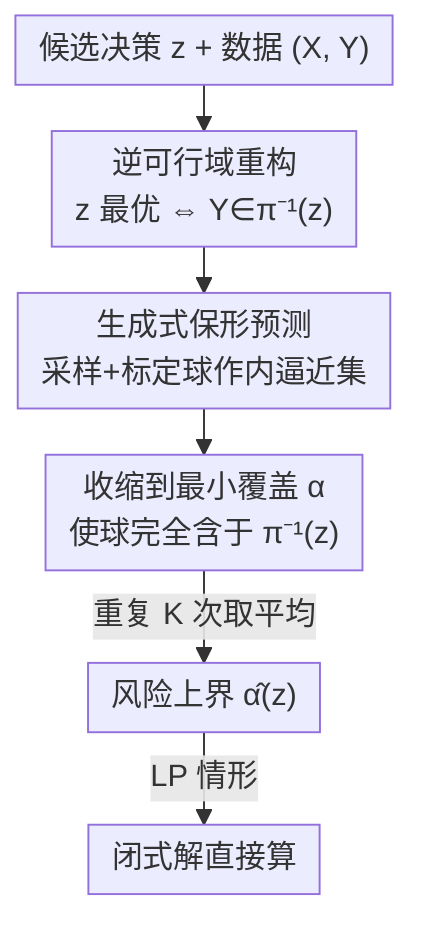

# Conformalized Decision Risk Assessment

**会议**: ICLR 2026  
**OpenReview**: [https://openreview.net/forum?id=xRjOrcj08o](https://openreview.net/forum?id=xRjOrcj08o)  
**代码**: 补充材料含匿名代码库（正式仓库待确认）  
**领域**: 学习理论 / 保形预测 / 不确定性量化 / 决策优化  
**关键词**: 保形预测、逆优化、决策风险、无分布保证、生成式模型

## 一句话总结
CREDO 把"一个候选决策有多大概率是次优的"这个问题，转化为"真实结果落在该决策的逆可行域之外的概率"，再用生成式保形预测构造逆可行域的内逼近集，给出**无分布、有统计保证**的风险上界，让人类专家可以对任意决策（不论来自算法还是经验直觉）做可审计的风险体检。

## 研究背景与动机

**领域现状**：运筹学里处理不确定性的主流范式是 predict-then-optimize（PTO，先预测再优化）——先用机器学习模型估计未知参数（如未来需求、患者结局），再求解一个优化问题给出推荐决策。这套流程已经是医疗、能源、公共政策等数据驱动决策系统的基础。

**现有痛点**：PTO 在高风险场景有两个硬伤。其一，它像黑箱一样直接"开处方"，不告诉你这个决策对不确定性有多敏感、是否还有别的决策表现相当甚至更好，决策者无从判断该不该信任、何时该用自己的经验推翻它。其二，PTO 本质上依赖点预测，无法刻画分布复杂性——当参数是多峰分布时，它会为"期望值"优化，而期望值可能恰好落在两个峰之间、真实参数几乎不会取到的位置，于是给出误导甚至有害的建议。

**核心矛盾**：真实世界的高风险决策很少完全交给算法。有经验的从业者常基于数据之外的领域知识（罕见事件、运营约束、历史记录里没有的风险因子）提出替代方案，但现有优化框架**没有任何原则性手段去评估这些人类生成的决策**，算法工具和专家经验之间存在断层。

**本文目标**：与 PTO 互补，提出 decide-then-assess（先决策再评估）范式。不去用模型处方替代人类判断，而是去**审计**任意候选决策。具体问的是：对一个用户指定的决策 $z$，在不确定性 $Y$ 的真实（未知）实现下，它保持最优的概率有多大？

**切入角度**：作者抓住两个关键观察——(i) 在一大类优化问题中，最优解是目标参数的确定性函数，因此可以**反演**这个映射，刻画出"使决策 $z$ 保持最优"的那组结果（逆可行域）；(ii) 把保形预测和生成式建模结合，可以估计这组结果的概率质量，从而得到对决策风险的有效、数据驱动的上界。

**核心 idea**：用"逆优化几何 + 生成式保形预测"，对任意候选决策给出次优概率的无分布上界——既不依赖生成模型是否精确拟合了真实分布，又能在线性规划下化为闭式解。

## 方法详解

### 整体框架

CREDO 要解决的是：给定协变量 $X$、随机结果 $Y$（不确定的目标参数）和一个候选决策 $z$，输出一个风险度量 $\alpha(z)$，使得

$$P\{z \in \pi(Y;\theta)\} \ge 1 - \alpha(z), \quad \forall z \in \mathcal{Z},$$

其中 $\pi(Y;\theta) = \arg\min_{z\in\mathcal{Z}(\theta)} g(z,Y,\theta)$ 是优化问题的最优解集。整套方法分两步走：第一步做**问题重构**，把"$z$ 是否最优"这件带着复杂 $\arg\min$ 映射的事，等价改写成"$Y$ 是否落在某个固定集合里"；第二步用**生成式保形预测**去保守地估计这个集合的概率质量。

### 关键设计

**1. 逆可行域重构：把"决策最优性"翻译成"结果落在哪"**

直接估计 $P\{z\in\pi(Y;\theta)\}$ 很难，因为随机性藏在 $\arg\min$ 映射 $\pi$ 里。作者注意到：对某个具体实现 $y$，决策 $z$ 最优**当且仅当**它在所有可行决策里目标值最小，即 $g(z,y;\theta)\le g(z',y;\theta),\ \forall z'\in\mathcal{Z}(\theta)$。于是定义**逆可行域**——所有让 $z$ 成为最优解的结果 $y$ 的集合：

$$\pi^{-1}(z;\theta) := \bigcap_{z'\in\mathcal{Z}(\theta)} \{y\in\mathcal{Y} \mid g(z,y;\theta)\le g(z',y;\theta)\}.$$

Proposition 1 给出等价改写 $P\{z\in\pi(Y;\theta)\} \equiv P\{Y\in\pi^{-1}(z;\theta)\}$。这一步的妙处在于把随机变量 $Y$ 和映射 $\pi$ **解耦**了：原本要对一个复杂优化映射做概率推断，现在只剩一个标准的不确定性量化任务——估计 $Y$ 落入一个固定集合 $\pi^{-1}(z;\theta)$ 的概率。在线性目标 $\langle Y,z\rangle$ 下，这个逆可行域是一个由可行域顶点决定的锥（cone），几何上很干净。

**2. 生成式保形预测：用标定球的"内逼近"换来已知覆盖率**

要估计 $P\{Y\in\pi^{-1}(z;\theta)\}$，CREDO 不直接估这个概率，而是构造一个**完全含于** $\pi^{-1}(z;\theta)$ 的集合 $C(X;\alpha)$，且这个集合对 $Y$ 的覆盖率已知。这样就能用一条不等式链把目标夹住：

$$P\{Y\in\pi^{-1}(z;\theta)\} \overset{(a)}{\ge} P\{Y\in C(X;\alpha)\} \overset{(b)}{\ge} 1-\alpha,$$

(a) 来自集合包含关系，(b) 来自保形预测的覆盖保证，于是这个 $\alpha$ 就直接当作风险估计 $\hat\alpha(z)$。具体做法：先在训练集上训一个（条件）生成模型 $\hat f:\mathcal{X}\to\mathcal{Y}$ 近似 $Y\mid X$；对测试输入 $x_{n+1}$ 采一个预测 $\hat y_{n+1}\sim\hat f(x_{n+1})$，以它为球心构造保形球 $C(x_{n+1};\alpha)=\{y:\|y-\hat y_{n+1}\|_2<\hat R(\alpha)\}$，半径 $\hat R(\alpha)$ 用标定集 $\{(x_i,y_i)\}_{i=1}^n$ 校准以保证 $(1-\alpha)$ 覆盖。然后解一个一维优化找**最小的** $\alpha$ 使球恰好被逆可行域包住：

$$\hat\alpha(z) = \min_{\alpha\in[1/(n+1),1]}\{\alpha \mid C(x_{n+1};\alpha)\subseteq\pi^{-1}(z;\theta)\}.$$

为什么非要生成模型而不是点预测？点预测（条件均值）很可能落在逆可行域边界附近甚至外面，一旦球心在外，球无论多小都钻不进去，风险只能取平凡值 1，过度保守。生成模型允许多次采样，K 越大，至少有一个采样落进逆可行域的机会越高，于是能给出小于 1 的更有信息量的风险估计。

**3. K 次采样平均 + 保形权重：兼顾保守性与信息量**

单次采样波动大，CREDO 把上述过程重复 $K$ 次得到 $\{\hat\alpha^{(k)}(z)\}$ 并取平均 $\hat\alpha(z)=\frac1K\sum_k\hat\alpha^{(k)}(z)$。Proposition 2 揭示这个平均估计其实是一个**加权蒙特卡洛概率估计**：

$$\hat\alpha(z) = 1 - \frac1K\sum_{k=1}^K w^{(k)}(z,x_{n+1})\cdot\mathbb{1}\{\hat y^{(k)}_{n+1}\in\pi^{-1}(z;\theta)\},$$

其中保形权重 $w^{(k)}\in[0,1]$ 由标定过程决定。这个统一视角很关键：朴素蒙特卡洛（把权重全设成 1，即 NS 变体）虽然估得更"准"但会丢掉保守性保证；CREDO 的保形权重正是为了把估计**向下压**到满足覆盖保证，这是它和普通 MC 估计的本质区别，也是 Theorem 1 保守性成立的技术核心。

**4. 线性规划下的闭式风险估计：把审计变成一次扫描**

通用 CREDO 对目标函数和可行域不作假设，但在线性规划 $\pi_{LP}(Y;\theta)=\arg\min_{z\in\mathcal{Z}(\theta)}\langle Y,z\rangle,\ \mathcal{Z}(\theta)=\{z:Az\le b\}$ 下，Corollary 1 给出闭式解：风险只依赖采样点到逆可行域边界的距离 $\hat D^{(k)}=\min_{v\in V(\theta)\setminus\{z\}}|\langle\hat y^{(k)}_{n+1},z-v\rangle|/\|z-v\|_2$ 和一组顶点示性项，复杂度 $O(K\cdot n\cdot|V(\theta)|)$，与迭代/训练轮数无关。更实用的加速：当 $z$ 不是可行域顶点时示性项必为零，算法可直接判定其风险为 1，省去计算。这让 CREDO 在大规模 LP 上既高效又好实现。

### 损失函数 / 训练策略

CREDO 没有端到端可训练损失——它是一个**评估/审计**框架而非预测器。唯一需要"训练"的是基础生成模型，实验中用三分量高斯混合模型（EM 算法迭代 100 轮）拟合 $Y\mid X$，这个选择能捕捉多峰性又不像深度模型那样吃数据。训练集与标定集按 split conformal 框架随机均分；半径 $\hat R(\alpha)$ 采用标准 p-value 保形半径。

### 理论保证（三条）

- **保守性（Theorem 1）**：在交换性假设（比 i.i.d. 更弱）下，$P\{z\in\pi(Y_{n+1};\theta)\}\ge 1-\mathbb{E}[\hat\alpha(z)]$，即估计在期望意义下是风险的有效上界。值得注意的是它**不要求生成模型拟合得好**——这保证了对模型误设的鲁棒性，证明依赖 e-value 保形预测的事后有效性。
- **统一视角（Proposition 2）**：估计器等价于加权 MC 概率估计，把保形权重设为 1 即退化为更激进但可能失去保守性的 NS 变体。
- **真正例率单调性（Proposition 3）**：定义 TPR 为"被正确识别出风险小于 1 的决策占全部真实风险小于 1 决策的比例"，证明 TPR 随 $K$ 单调上升。这说明生成式采样越多，越不会把本来可行的决策误判为风险 1 而错杀，从而支撑高质量决策。

## 实验关键数据

实验设置包括两个合成场景（Setting I 三角形可行域=三顶点的基础利润最大化；Setting II 八边形可行域=五顶点的更复杂场景）和一个真实场景（美国印第安纳州某电力公司 2010–2024 太阳能板安装记录，预算约束变电站升级，建模为背包优化）。生成模型为三分量高斯混合，默认 $K=100$、$\sigma=1$，重复 20 次独立试验。

### 主实验：决策质量（经验置信排名，越低越好）

| 方法 | Setting I (σ=1) | Setting II (σ=1) | Real Data |
|------|------|------|------|
| PTO | 2.76 ± 0.59 | 3.36 ± 0.48 | 1.75 ± 1.69 |
| RO | 2.98 ± 0.14 | 6.00 ± 0.00 | 3.00 ± 1.29 |
| SPO+ | 2.68 ± 0.65 | 4.67 ± 1.56 | 2.67 ± 1.43 |
| DFL | 1.83 ± 0.81 | 3.96 ± 2.07 | 1.92 ± 1.04 |
| **CREDO** | **1.61 ± 0.56** | **1.00 ± 0.00** | **1.75 ± 0.92** |

CREDO 在多数数据集上排名最低，平均能选中"最可能最优"的前两名决策。唯一例外是 Setting I 在 $\sigma=0.1$ 时 PTO/RO/SPO+ 更好——因为方差极小时数据高度集中在均值附近、问题近似确定性，点预测基线天然更合适。

### 消融实验（CREDO vs Point vs NS）

| 配置 | 保守率 | TPR 随 K | 说明 |
|------|--------|----------|------|
| CREDO | ~100% | 显著上升 | 保形权重保证保守性，生成采样提升 TPR |
| Point | ~100% | 基本持平 | 点预测保守但识别能力不随 K 改善 |
| NS（权重=1） | ~50% | — | 朴素 MC 失去保守性，后续被剔除 |

### 关键发现

- **保形权重是保守性的命门**：去掉它（NS 变体）保守率从 ~100% 掉到 ~50%，直接验证了 Theorem 1 里加权项的作用。
- **生成式采样换信息量**：K 增大时 CREDO 的 TPR 显著上升而 Point 的曲线持平——在同等保守水平下，CREDO 能识别更多潜在次优决策、不错杀可行替代方案（Proposition 3 的数值证据）。
- **越随机越占优**：随着方差 $\sigma$ 增大，CREDO 的相对精度反超 Point；Setting II 全程领先。说明 CREDO 在 $Y$ 高度随机、点估计难以刻画时尤其有用。

## 亮点与洞察

- **"先决策再评估"是个被忽视的好问题**：主流都在卷"怎么给出最优决策"，CREDO 反过来问"任意给我一个决策，我帮你体检它有多大概率次优"，天然兼容人类专家的经验直觉，把算法工具和人类判断对齐——这个 descriptive（审计）而非 prescriptive（处方）的定位是真正的新意。
- **逆可行域重构把难题降维**：用最优性的充要条件把带 $\arg\min$ 的概率推断变成"点落在固定集合"的标准 UQ 问题，是整篇方法的支点，非常干净。
- **保守性不依赖模型拟合质量**：Theorem 1 只要交换性、不要求生成模型准，这在需要安全保证的高风险场景里极有价值——模型可以错，但风险上界依然有效。
- **可迁移性**：逆可行域 + 保形内逼近的范式可以推广到一般凸优化（解前向优化判断采样点是否在逆可行域内 + 算保形权重），不止 LP。

## 局限与展望

- **作者承认的选择偏差**：一旦用 CREDO 的风险估计去**挑选**决策，再对被选中决策重新评估风险会破坏标定数据的交换性，原保证失效。缓解办法是数据切分（选决策的数据和评风险的数据分开），但作者也呼吁未来研究不依赖切分、直接对数据相关的决策选择做原则性修正。
- **半径选择的 trade-off**：e-value 半径有严格事后有效性但偏保守，p-value 半径更紧但有效性弱，需要在"安全"和"有信息量"之间权衡，没有免费午餐。
- **生成模型的现实约束**：实验用的是高斯混合（低维、好拟合），高维或更复杂分布下生成模型的拟合质量虽然不影响保守性、却会影响 TPR/精度，实际效果如何还需检验。
- **实验规模偏小**：合成场景维度低、真实场景只有单个电网案例，跨领域泛化性有待更多验证。

## 相关工作与启发

- **vs PTO / SPO+ / DFL**: 这些都是 prescriptive 框架——预测参数后求解优化、或让训练直接对齐决策质量，本质是"给出最优决策"。CREDO 是 descriptive——不产生决策，而是反演保形预测去量化"给定决策有多可能最优"，与它们互补而非竞争。
- **vs 鲁棒优化 / 分布鲁棒优化 (RO/DRO)**: RO/DRO 在最坏情况或分布模糊集下保证决策表现，但不显式量化每个决策的风险水平；CREDO 直接给出无分布的次优概率上界。
- **vs 反演式保形预测 (Gauthier et al. 2025a 等)**: 同样利用 e-value 保形预测估计固定预测集的误覆盖率，但 CREDO 聚焦决策风险评估场景而非纯保形预测任务，把它嵌进了逆优化几何里。
- **vs 用保形集做 RO 输入 (Kiyani et al. 2025; Andrews & Chen 2025)**: 他们把保形集当作产生最优决策的输入；CREDO 反过来反演保形预测去审计已有决策，角色和目标都相反。

## 评分
- 新颖性: ⭐⭐⭐⭐⭐ "先决策再评估"范式 + 逆可行域重构 + 生成式保形预测的组合是清晰的新问题与新解法
- 实验充分度: ⭐⭐⭐ 理论扎实，但实验仅两个合成场景 + 单个真实电网案例，规模和领域覆盖偏窄
- 写作质量: ⭐⭐⭐⭐⭐ 动机清楚、理论与方法层层递进、统一视角（MC）讲得很透
- 价值: ⭐⭐⭐⭐ 为高风险决策提供可审计的无分布风险证书，对人机协同决策有实际意义

<!-- RELATED:START -->

## 相关论文

- [\[ICLR 2026\] Online Decision-Focused Learning](online_decision-focused_learning.md)
- [\[ICLR 2026\] Robust Decision Making with Partially Calibrated Forecasts](robust_decision-making_with_partially_calibrated_forecasters.md)
- [\[ICLR 2026\] Decision Aggregation under Quantal Response](decision_aggregation_under_quantal_response.md)
- [\[ICLR 2026\] Data-Aware and Scalable Sensitivity Analysis for Decision Tree Ensembles](data-aware_and_scalable_sensitivity_analysis_for_decision_tree_ensembles.md)
- [\[ICLR 2026\] Online Decision Making with Generative Action Sets](online_decision_making_with_generative_action_sets.md)

<!-- RELATED:END -->
