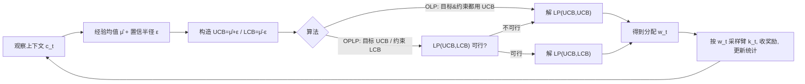

# Contextual Multi-Armed Bandits with Minimum Aggregated Revenue Constraints

**会议**: ICLR 2026  
**OpenReview**: [https://openreview.net/forum?id=qbhPULMkuQ](https://openreview.net/forum?id=qbhPULMkuQ)  
**代码**: 未公开  
**领域**: learning theory  
**关键词**: 多臂老虎机, 上下文老虎机, 约束老虎机, 收益保障, 后悔界, 线性规划  

## 一句话总结
本文研究"上下文老虎机 + 每臂最低聚合收益约束"这一新设定（MAB-ARC），用线性规划刻画最优分配、提出乐观（OLP）与乐观-悲观（OPLP）两套算法，并通过下界证明：一旦上下文出现，前人依赖的"免费探索"性质失效，探索-利用权衡被重新激活。

## 研究背景与动机
**领域现状**：标准多臂老虎机（MAB）只关心最大化累计收益，但现实应用往往附带各种约束——临床试验的安全约束、预算约束（knapsack bandits）、公平性约束等。其中一类重要约束是"每条臂都要拿到最低收益保障"，例如推荐平台要保证每个内容提供方都有最低曝光/收益，否则它们就没有动机继续合作。

**现有痛点**：Baudry et al. (2024) 研究了**无上下文**版本的最低收益约束 MAB，那里最优策略是"按收益保障比例线性地拉每条臂"，所有臂都会被采样，因此约束本身就提供了**免费探索（free exploration）**，能做到常数后悔 + $O(\sqrt{T})$ 约束违反。另一方面，Slivkins et al. (2023)、Guo et al. (2024/2025) 研究了更一般的**上下文 + 通用随机约束**，但用 primal-dual 方法只能给出两个指标都为 $O(\sqrt{T})$ 的界。

**核心矛盾**：把上下文和"聚合（跨上下文求和）的最低收益约束"放到一起，本质上**无法**像普通上下文老虎机那样拆成 $|C|$ 个独立子问题。因为约束是聚合的（只给每条臂一个跨所有上下文的阈值 $\lambda_k$，而非逐 $(k,c)$ 的 $\lambda_{k,c}$），关键不再是"某臂在某上下文是否次优"，而是"它比别人次优多少"，需要一个**全局规划**。这导致标准 MAB 那种封闭形式最优分配消失了。

**本文目标**：填补"无上下文最低收益约束"与"上下文通用约束"之间的空白，给出贴合该问题精细结构、不依赖 primal-dual 的算法与匹配下界。

- **核心 idea**：**用线性规划刻画最优平稳分配 + 围绕"激活约束集合"定义新的次优性 gap**——把难以直接度量的"分配 $w$ 相对 $w^\star$ 有多差"，转化为"猜对了哪些约束被绑定（active set）$I^\star$"这一组合问题，从而恢复出类似经典 MAB 的 gap 概念。

## 方法详解

### 整体框架
学习者每步观察上下文 $c_t$、选臂 $k_t$、收到奖励，目标是最大化累计收益同时保证每条臂的跨上下文聚合收益 $\geq \lambda_k T$。本文先把这个带约束的规划问题写成一个**线性规划** $\mathrm{LP}(\mu,\mu)$，其最优解 $w^\star$ 是一个平稳分配（context→选臂概率）。由于 $\mu$ 未知，算法用经验均值 + 置信区间构造 UCB/LCB，然后在每步把 UCB/LCB 代入 LP 求解得到当前分配，再据此采样。两套算法 OLP 与 OPLP 分别把"乐观/悲观"用在目标与约束的不同位置上，落在性能-违反 Pareto 前沿的两个不同点。

### 关键设计

**1. LP 化的平稳规划：从"无封闭解"到"顶点解"** —— 原始目标是在 $T$ 步上最大化累计收益、且每臂期望聚合收益 $\geq \lambda_k T$。本文指出最优解一般不唯一（存在大量随时间振荡但整体满足约束的时变策略），但总能由时变最优构造出一个**平稳最优** $w^\star = \frac{1}{T}\mathbb{E}[\sum_t w^\star(t)]$，它保证全程均匀满足约束（这对临床试验等需在滑窗内监控约束的场景很关键）。平稳 $w^\star$ 正是线性规划 $\mathrm{LP}(\mu,\mu):\max_w f(\mu,w)$ s.t. $g_k(\mu,w)\geq\lambda_k,\ w_c\in\Delta_K$ 的解，其中 $f=\sum_c p_c\mu_c^\top w_c$ 是期望总收益、$g_k$ 是臂 $k$ 的聚合收益。LP 保留了计算高效性，但牺牲了 Baudry et al. (2024) 赖以做理论分析的封闭形式。

**2. 基于激活约束集合 $I^\star$ 的精细 gap** —— LP 的最优解落在多面体顶点上，由一组**被绑定的约束**决定，记其指标集为 $I^\star$。$k\in I^\star\cap\mathcal{K}$ 意味着臂 $k$ 恰好打满最低收益 $g_k(\mu,w^\star)=\lambda_k$；$(k,c)\in I^\star\cap\mathcal{J}$ 意味着在上下文 $c$ 下永不选臂 $k$（$w^\star_{k,c}=0$）。于是 oracle 等价于在已知 $I^\star$ 下求解等式约束问题 $\mathrm{OPT}(\mu,\mu,I^\star)$。由于直接度量分配次优性很难，本文引入候选集合 $I$ 的次优性度量 $\rho(I)=\max(s(I),P(I))$：其中**可行性 gap** $s(I)$ 是让"绑定 $I$ 中约束"变可行所需的最小松弛；**性能 gap** $P(I)$ 度量在该约束几何下的收益损失（归一化到性能敏感度 $L(I)$ 和 $S_{\gamma^\star}$）。定义最差次优 $\rho^\star=\min_{I\neq I^\star}\rho(I)$，并证明 $\rho(I^\star)=0,\ \rho^\star>0$（Lemma 3.1）。这个 $\rho^\star$ 扮演了经典 MAB 中 gap 的角色，是把次优性"组合化"后才出现的全新量。

**3. OLP（乐观）与 OPLP（乐观-悲观）** —— OLP 在目标和约束**都用 UCB**：$w(t)=\arg\max \mathrm{LP}(\mathrm{UCB}(t),\mathrm{UCB}(t))$，在可行性假设下内层始终可行，它**偏向性能**，拿到多对数后悔但可能有 $O(\sqrt{T})$ 约束违反。OPLP 采用**不对称估计**：目标用乐观 UCB、约束用悲观 LCB，即解 $\mathrm{LP}(\mathrm{UCB},\mathrm{LCB})$；若该问题不可行则回退到双乐观 $\mathrm{LP}(\mathrm{UCB},\mathrm{UCB})$。悲观地处理约束相当于加安全余量，让 OPLP **偏向约束满足**，把约束违反压到多对数、但性能上付出 $O(\sqrt{T})$ 代价。两者由置信集 $\mathcal{S}_t(\hat\mu,\delta)$ 保证有效性（Prop. 4.1），半径 $\epsilon_{k,c}(t)=\sqrt{2\log(2\kappa/\delta)/n_{k,c}(t-1)}$。

**4. 懒更新降算力 + 下界揭示"免费探索消失"** —— 为降低反复解 LP 的开销，采用**懒更新**：只有当某 $(k,c)$ 的拉取次数翻倍时才重解 LP，使全程仅解 $O(\log T)$ 次 LP，且不损后悔界（仅差常数）。更重要的是理论下界（Thm 5.3）：在一个 $K=3,|C|=3$ 的 nominal 实例邻域内，任何策略的 $R+V$ 都至少 $\Omega(\sqrt{T})$，且约束违反 $\Omega(\sqrt{T})$ 时性能后悔仍 $\Omega(\log T)$。这证明 OLP 关于 $T$ 近最优，并**反驳了"免费探索"在上下文设定下的存在性**——Lemma 5.1 进一步说明：只要 $K>2,|C|>1$，最优分配必然给某个 $(k,c)$ 赋零概率，导致该臂在该上下文不会被自然探索到，于是探索-利用权衡被重新激活。

## 实验关键数据
本文是理论工作，实验为合成数据上的数值演示（细节在 Appendix G），主要用于直观说明 $I^\star$ 概念、并与基线对比。

### 主实验（数值演示）

| 对比对象 | 来源 | 与本文关系 |
|----------|------|-----------|
| Optimistic | Guo et al. (2025) | 上下文 + 通用约束的 primal-dual 基线 |
| DOC / SPOC | Baudry et al. (2024) | 无上下文最低收益约束的算法 |
| OLP / OPLP | 本文 | LP + 乐观 / 乐观-悲观 |

实验还考察了 OPLP 对可行性余量 $\gamma^\star$ 变化的敏感性。

### 理论保证对比

| 算法 | 性能后悔 $\mathbb{E}[R_T]$ | 约束违反 $\mathbb{E}[V_T]$ | 关键假设 |
|------|--------------------------|---------------------------|----------|
| OLP | $O(\log^2 T/\rho^\star)$ | $O(\log^2 T/\rho^\star + \sqrt{\lvert\mathcal{K}\cap I^\star\rvert \log T\, T})$ | 可行 + 非退化 (Asm 3) |
| OPLP | $O((\tfrac{1}{\gamma^{\star2}}+\tfrac{1}{\rho^{\star2}})\log^2 T + \sqrt{\lvert\mathcal{K}\cap I^\star\rvert\log T\,T})$ | $O(\tfrac{\lambda}{\gamma^{\star2}}\log^2 T)$ | 严格可行 + 非退化 (Asm 4) |
| 下界 | $\Omega(\log T)$（性能） | —— | $R+V=\Omega(\sqrt{T})$ |

### 关键发现
- **OLP 自适应饱和臂数量**：当没有臂打满约束（$\lvert\mathcal{K}\cap I^\star\rvert=0$）时，后悔和约束违反**同时**退化为多对数。
- **Pareto 前沿两端**：OLP 偏性能（多对数后悔、$\sqrt T$ 违反），OPLP 偏约束（多对数违反、$\sqrt T$ 性能损失）。
- **下界结论**：上下文设定下不可能像无上下文那样做到"常数后悔 + $\sqrt T$ 违反"，免费探索性质消失。

## 亮点与洞察
- **把约束次优性"组合化"**：用激活约束集合 $I$ 及 $\rho(I)$ 把连续的 LP 次优性转成"猜对绑定集"的离散问题，从而恢复经典 MAB 的 gap 框架——这套技术对一般"全局线性约束"的 MAB 都可复用，是可独立成立的贡献。
- **不走 primal-dual**：指出 primal-dual 之所以只能给 $O(\sqrt T)$，是因为它忽略了本问题的精细结构；本文用 LP + 乐观/悲观直接利用该结构拿到多对数。
- **概念性洞察"免费探索的边界"**：清晰指出"约束诱导探索"只在无上下文时成立，一旦上下文+稀疏最优分配出现，约束不再强制采样所有臂，探索必须重新设计。

## 局限与展望
- **上下文先验已知（Asm 2）**：假设 $\{p_c\}$ 已知，放松后估计目标从 $\mu_{k,c}$ 变为 $\mu'_{k,c}=p_c\mu_{k,c}$，需对上下文分布加平滑性假设。
- **可行性假设**：若 $\mathrm{LP}(\mu,\mu)$ 不可行，需启发式地缩放阈值 $\lambda_k\leftarrow\alpha\lambda_k$ 来恢复可行，没有统一的最优纠正流程。
- **有限上下文/动作**：当前限于有限 $C,K$；扩展到无限上下文/动作需引入线性模型 $\mu_{k,c}=\langle\theta^\star,\phi(k,c)\rangle$ 或 RKHS，并解决离散化与近似误差分析，作者将其留作未来工作。
- **贪心策略失效**：无上下文时贪心因约束强制探索而有效，多上下文时贪心不再自动探索（附录给出反例）。
- **算力开销**：每轮解 LP 比 Guo et al. (2025) 的梯度法更贵，靠懒更新 + warm-start + presolve 缓解，本质是"更强理论保证 vs 更高效率"的权衡。

## 相关工作与启发
- **无上下文最低收益约束**：Baudry et al. (2024)（DOC/SPOC）是本文的特例与直接对照，其"免费探索"正是本文要破除的对象。
- **上下文 + 通用约束**：Slivkins et al. (2023)、Guo & Liu (2024)、Guo et al. (2025) 用 primal-dual 给 $O(\sqrt T)$ 双界；本文论证在最低收益约束的精细结构下可做得更好。
- **Bandits with Knapsacks**：Badanidiyuru et al. (2018)、Agrawal et al. (2016) 等；与本文区别在于 BwK 是硬预算累积约束，本文是期望意义下的随机约束，允许后悔与违反间的显式权衡。
- **启发**：把"猜对最优激活约束集"作为学习目标，是处理 LP 型约束决策（监控、子集收益保障等）的通用思路；该框架对任何"全局线性约束 + 上下文"的序贯决策都有借鉴价值。

## 评分
- **新颖性**: ⭐⭐⭐⭐⭐ — 提出全新设定 MAB-ARC，用激活约束集合 $\rho(I)$ 这一非标准 gap 概念绕开 primal-dual，并首次在理论上揭示上下文下免费探索失效。
- **实验充分度**: ⭐⭐⭐ — 纯理论工作，仅合成数据数值演示，无真实应用验证（与该子领域惯例一致）。
- **写作质量**: ⭐⭐⭐⭐ — 问题动机、challenge、贡献层层递进，定义与定理清晰；但 gap/敏感度系数等记号密集，阅读门槛较高。
- **价值**: ⭐⭐⭐⭐ — 填补无上下文与上下文约束老虎机之间的空白，gap 组合化技术与"免费探索边界"洞察对约束老虎机理论有持续启发。

<!-- RELATED:START -->

## 相关论文

- [\[ICLR 2026\] Variance-Dependent Regret Lower Bounds for Contextual Bandits](variance-dependent_regret_lower_bounds_for_contextual_bandits.md)
- [\[ICML 2026\] Online Learning with Recency: Algorithms for Sliding-window Streaming Multi-armed Bandits](../../ICML2026/learning_theory/online_learning_with_recency_algorithms_for_sliding-window_streaming_multi-armed.md)
- [\[ICLR 2026\] Towards a Sharp Analysis of Offline Policy Learning for f-Divergence-Regularized Contextual Bandits](towards_a_sharp_analysis_of_offline_policy_learning_for_f-divergence-regularized.md)
- [\[ICLR 2026\] Diversified Multinomial Logit Contextual Bandits](diversified_multinomial_logit_contextual_bandits.md)
- [\[ICLR 2026\] Queue Length Regret Bounds for Contextual Queueing Bandits](queue_length_regret_bounds_for_contextual_queueing_bandits.md)

<!-- RELATED:END -->
