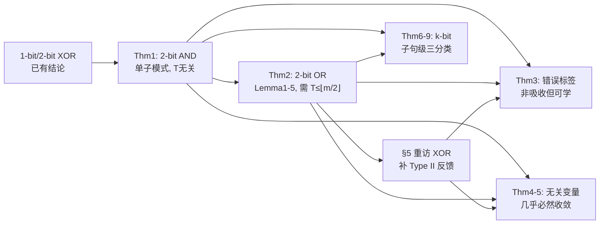

# Convergence Analysis of Tsetlin Machines under Noise-Free and Noisy Training Conditions: From 2 Bits to k Bits

**会议**: ICLR 2026  
**OpenReview**: [https://openreview.net/forum?id=feOrSQdD9Y](https://openreview.net/forum?id=feOrSQdD9Y)  
**代码**: 待确认  
**领域**: 学习理论 / 可解释机器学习 / Tsetlin Machine 收敛性  
**关键词**: Tsetlin Machine, 学习自动机, 收敛性证明, 命题逻辑, 标签噪声, 吸收态  

## 一句话总结
本文把 Tsetlin Machine（TM）的收敛性理论从已有的 1-bit、2-bit XOR 一路推进到 2-bit AND/OR、含噪声训练以及一般的 k-bit 情形，证明了 TM 在无噪声/无关变量下几乎必然收敛到正确逻辑算子、在错误标签下虽不收敛但仍能高效学习，并揭示了超参 $T$ 与 OR 算子「单子句联合表示多个子模式」这一独特机制。

## 研究背景与动机

**领域现状**：Tsetlin Machine 是一种基于命题逻辑的分类器，用一组「子句（clause）」表示某类的不同子模式，每个子句由若干「Tsetlin 自动机（TA）」组成的团队学习——每个 TA 负责决定某个文字（特征或其否定）是否被「包含/排除」进子句，再通过投票完成分类。由于推理过程是纯逻辑表达式、可读且硬件友好低能耗，TM 在文本分类、信号分类、联邦学习等任务上能匹敌甚至超越 SOTA。

**现有痛点**：尽管经验上效果好，TM 的理论保证一直很零碎。此前只证明了 1-bit 的 Identity/NOT 算子（揭示超参 $s$ 的作用，Zhang et al. 2022）和 2-bit 的 XOR 算子（揭示超参 $T$ 的作用，Jiao et al. 2023）的收敛性，且都局限在**无噪声**条件下。AND、OR 这两个最基础的逻辑算子没有被分析，含噪声训练（错误标签、无关变量）完全是空白，而真实应用普遍把数据 booleanize 成 k-bit 表示，2-bit 结论根本覆盖不到实际工作区间。

**核心矛盾**：2-bit 的证明高度依赖对 TA 状态的**穷举**，bit 数一增加立刻组合爆炸，无法直接外推到 k-bit；同时 XOR 的子模式是互斥的（每个子模式必须由完整两文字子句精确表示），而 OR/AND 的子模式之间**共享特征**，学习动力学本质不同，不能照搬 XOR 的证法。

**本文目标**：建立一个覆盖「AND/OR/XOR × 无噪声/错误标签/无关变量 × 2-bit 到 k-bit」的统一收敛理论。

**核心 idea**：**（贡献一）** 用「吸收态（absorbing state）」分析取代此前的平稳分布分析，配合「冻结一部分 TA、只看另一部分 TA 转移」的拟平稳（quasi-stationary）技巧，把 2-bit AND/OR 的收敛性逐情形证清；**（贡献二）** 针对 k-bit 组合爆炸，把分析粒度从「文字级状态」上提到「子句级类别」——把子句归并成「精确匹配/部分匹配/不匹配」三类，只分析这三类之间的转移，从而绕开指数增长完成 k-bit 证明。

## 方法详解

### 整体框架

本文不是算法，而是一套**收敛性证明体系**。它从最简单的单子模式算子（AND）出发建立基础工具，再处理多子模式且特征共享的 OR，回头补全 XOR 中被忽略的 Type II 反馈，接着把无噪声结论扩展到两类噪声（错误标签、无关变量），最后用「子句级聚类」这把钥匙打开 k-bit 的大门。贯穿全程的核心机制是两个超参：$s$ 控制子句粒度，$T$ 通过 Eq.(3)(4) 调控反馈资源分配、决定系统能否进入吸收态。

### 关键设计

**1. 吸收态分析 + 拟平稳冻结技巧：把 AND 的联合 TA 动力学拆成可穷举的局部转移。** TM 收敛被定义为「所有 TA 的状态不再改变」，即系统进入唯一吸收态。对 2-bit AND 只有一个触发正输出的子模式 $x_1{=}1,x_2{=}1$，用单个子句（4 个 TA：管 $x_1,\neg x_1,x_2,\neg x_2$）即可，目标吸收态是 TA 动作 $(I,E,I,E)$ 对应子句 $x_1\wedge x_2$。直接分析四个 TA 的联合转移太复杂，作者**冻结第一比特的两个 TA**、只追踪第二比特 TA 的转移：固定 $x_1$ 的 TA 有 4 种 Case，每个 Case 下又按当前/冻结动作分 4 种 Situation，每个 Situation 有 8 个实例，合计 128 个转移实例。逐一查 Type I/Type II 反馈表得到转移方向（如某实例的整体转移概率为 $u_1\frac{1}{s}$），归并后证明 $(I,E,I,E)$ 是唯一吸收态。**Theorem 1**：当 $u_1>0,u_2>0$（即所有样本类型都不被 $T$ 屏蔽），任意子句在无噪声 AND 样本下无限时间内几乎必然收敛到 $x_1\wedge x_2$。关键结论是 AND 不需要 $T$ 起作用就能吸收。

**2. OR 的「联合表示」与 $T\le\lfloor m/2\rfloor$ 条件：靠 5 个引理证明多子模式必须用 $T$ 才能吸收。** OR 有三个正子模式 $(0,1),(1,0),(1,1)$，且它们**共享特征**——例如 $T$ 个形如 $x_1$ 的子句同时为 $(1,0)$ 和 $(1,1)$ 投票，这是 OR 区别于 XOR 的本质。证明 **Theorem 2** 依赖 Lemma 1–5：Lemma 1 证单子模式样本下子句能收敛到目标；Lemma 2 证当两个及以上子模式同时出现、且 $T$ 未启用（$u_1>0,u_2>0$）时系统**非吸收**——这恰恰说明 $T$ 不可或缺；Lemma 3 给出吸收的充要条件（每个目标子模式的子句数达到 $T$ 且不存在纯否定文字子句）；Lemma 4 推出关键的 $T\le\lfloor m/2\rfloor$：表面看三个子模式各要 $T$ 票需 $3T\le m$，但由于一个子句可联合表示两个子模式，实际 $2T$ 个子句即可让三个子模式各得 $T$ 票，故 $T\le\lfloor m/2\rfloor$；Lemma 5 证未预期子模式 $(0,0)$ 永远凑不齐 $T$ 个子句，避免假阳。最终设 $Th=T$ 即得 OR 逻辑。$T$ 的作用机制是：某子模式攒够 $T$ 个子句后，Eq.(3)(4) 把该子模式后续样本触发反馈的概率压到 0，Type I 反馈被屏蔽、Type II 只剩 inaction，系统冻结进入吸收态。

**3. 重访 XOR 并补 Type II 反馈：解释为何 XOR 子句必须是精确两文字形式。** 此前 XOR 证明省略了 Type II 反馈。本文补上：XOR 子模式互斥、无法合并，即便 $T$ 个子句收敛到单文字 $C=x_1$ 屏蔽了 $([1,0],y{=}1)$ 的 Type I 反馈，来自 $([1,1],y{=}0)$ 的 Type II 反馈仍会以概率 1 惩罚「排除 $\neg x_2$」的 TA，强迫它包含 $\neg x_2$，使 $C=x_1$ 最终变为 $C=x_1\wedge\neg x_2$。这解释了为什么 XOR 吸收态的子句必须是 $x_1\wedge\neg x_2$ 或 $\neg x_1\wedge x_2$ 的精确形式，而 OR 的吸收子句形式可以多样。

**4. 两类噪声的分野：错误标签破坏吸收、无关变量不破坏。** 噪声按「完全随机噪声」建模，分两类。**错误标签**（本应 1 却标 0，反之亦然）会对同一输入产生统计上冲突的标签，使子句在 Type I（学成 1）和 Type II（学成 0）之间来回拉扯——**Theorem 3**：AND/OR/XOR 在含错误标签时均**非吸收**。但 Remark 4 指出，实验上 TM 仍能高效学到算子，契合 PAC 可学习 / $\epsilon$-最优概念（形式证明留作 open）。**无关变量**（不参与分类的比特）则不阻止收敛——**Theorem 4**：AND 含 $q>0$ 个无关变量时 $T\le m$ 即几乎必然收敛；**Theorem 5**：XOR/OR 含无关变量时 $T\le\lfloor m/2\rfloor$ 即收敛。Remark 5 揭示 TM 对无关比特鲁棒的两条途径：资源充足时一组子句含无关比特、另一组含其否定，两者投票相互抵消；资源有限时无关比特直接被排除。

**5. 子句级三分类：用「精确/部分/不匹配」绕开 k-bit 组合爆炸。** 2-bit 证明靠穷举文字状态，k-bit 立刻指数爆炸。作者把分析粒度从文字级提到**子句级**，将子句归为三类：(1) **精确匹配**——子句恰好等于目标子模式（如 AND 的 $x_1\wedge x_2$），目标出现时输出 1；(2) **部分匹配**——子句只匹配目标的子集（如 AND 里的 $x_1$），目标出现时也输出 1；(3) **不匹配**——既不匹配目标也不匹配其子集（如 $\neg x_1$），输出 0。只分析这三类之间的转移即可证明：一旦 TM 到达类型 (1) 系统吸收，(2)(3) 不吸收，故存在唯一吸收子句。由此得到 **Theorem 6**（k-bit 单子模式，$u_1>0,u_2>0$ 即收敛）、**Theorem 7**（k-bit 多子模式，引入「子模式簇」概念——共享公共 1 的子模式归一簇，$e$ 为簇数，$T\le\lfloor m/e\rfloor$ 时收敛）、**Theorem 8/9**（k-bit 含无关变量，单子模式 $T\le m$、多子模式 $T\le\lfloor m/e\rfloor$）。$T\le\lfloor m/e\rfloor$ 正是把 OR 的 $\lfloor m/2\rfloor$（OR 有 2 个簇）推广到一般情形。

## 实验关键数据

本文为纯理论工作，主体定理均为几乎必然收敛的严格证明；实证仅在附录中作为佐证。

### 理论结论汇总

| 算子 / 设置 | 是否吸收（无噪声） | 收敛所需 $T$ 条件 | 关键特性 |
|---|---|---|---|
| 2-bit AND（Thm 1） | 是 | $T$ 无关也吸收 | 单子模式，唯一吸收态 $(I,E,I,E)$ |
| 2-bit OR（Thm 2） | 是 | $T\le\lfloor m/2\rfloor$ | 单子句可联合表示两子模式 |
| 2-bit XOR（§5 重访） | 是 | $T\le\lfloor m/2\rfloor$ | 子模式互斥，子句必为精确两文字 |
| k-bit 单子模式（Thm 6） | 是 | $u_1,u_2>0$ 即可 | 子句级三分类证法 |
| k-bit 多子模式（Thm 7） | 是 | $T\le\lfloor m/e\rfloor$（$e$=簇数） | 子模式簇联合表示 |

### 噪声鲁棒性结论

| 噪声类型 | AND | OR | XOR | 结论 |
|---|---|---|---|---|
| 错误标签（Thm 3） | 非吸收 | 非吸收 | 非吸收 | 冲突标签致来回学习，但实验仍可高效学习 |
| 无关变量（Thm 4/5/8/9） | 收敛（$T\le m$） | 收敛（$T\le\lfloor m/2\rfloor$） | 收敛（$T\le\lfloor m/2\rfloor$） | 几乎必然收敛，k-bit 同理 |

### 关键发现
- $T$ 是多子模式与含无关变量场景下能否进入吸收态的命门：$T$ 失效则非吸收，配置得当则保证收敛到正确子模式。
- OR/k-bit 的「子模式簇联合表示」让子句数下界从 $\lfloor m/(\text{子模式数})\rfloor$ 放宽到 $\lfloor m/e\rfloor$，但也意味着单个子句可能同时编码多个子模式，损害可解释性。
- 附录实验观察到子句确实会在资源充足时吸收无关文字（成对抵消），与 Remark 5 的理论分析一致。

## 亮点与洞察
- **从文字级到子句级的粒度提升**是全文最漂亮的一招：用「精确/部分/不匹配」三分类把指数级状态空间压成三类转移，直接把 2-bit 穷举证法升级到一般 k-bit，覆盖了 TM 真实的 booleanized 工作区间。
- **OR 的联合表示机制**首次被严格刻画：同一子句靠共享特征同时为多个子模式投票，解释了为何 OR 吸收子句形式多样、且子句数下界比朴素估计更松。
- 把抽象证明翻译成**实践指南**：若能估计任务的子模式数与簇结构，就能给 $T$ 选个好初值、减少调参；为可解释性可主动限制子句长度或数量。
- 错误标签 vs 无关变量「一破坏一不破坏」的对照，给出了 TM 噪声鲁棒性的清晰理论边界。

## 局限与展望
- **错误标签下只证了「非吸收」**，对应的「虽不收敛但仍高效学习（PAC / $\epsilon$-最优）」目前只有实验佐证，形式证明仍是 open problem。
- $T>\lfloor m/2\rfloor$（或一般的 $T>\lfloor m/e\rfloor$）时系统无吸收态，作者只给出「仍可能高概率学到算子」的猜想（Remark 2），缺乏定量保证。
- 分析限定**正极性子句、完全随机噪声**，对负极性子句、结构化/相关噪声、回归型 TM 等更复杂设定尚未覆盖。
- 主体结论是「无限时间几乎必然收敛」，没有给出收敛速率 / 样本复杂度的非渐近界，离指导真实训练步数还有距离。

## 相关工作与启发
- **TM 收敛性谱系**：1-bit Identity/NOT（Zhang et al. 2022，揭示 $s$）→ 2-bit XOR（Jiao et al. 2023，揭示 $T$）→ 本文 2-bit AND/OR + 噪声 + k-bit，方法上从平稳分布分析转向吸收态分析。
- **概念学习 / PAC 学习**（Valiant 1984；Mansour & Parnas 1998；Belaid et al. 2025）：学带噪 k-bit 算子是经典问题，但已有的合取/析取学习方法不等于 TM 会以同样方式收敛，TM 的「从样本构造合取表达式 + 跨子模式协调」机制需要专门分析。
- **学习自动机**：TA 本质是处理多臂老虎机的学习自动机，本文的吸收态/拟平稳分析与 $\epsilon$-最优概念（Zhang et al. 2020）一脉相承。
- 对实践者的启发：在需要透明性的应用里，理解「联合表示会让单子句承载多个子模式」「资源过剩会吸入无关文字」这两点，有助于在精度与可解释性之间权衡（限制子句长度/数量）。

## 评分
- **新颖性**: ⭐⭐⭐⭐ 首次给出 2-bit AND/OR、含噪声以及一般 k-bit 的 TM 收敛性证明，「子句级三分类绕过组合爆炸」与「OR 联合表示」均为原创且优雅。
- **实验充分度**: ⭐⭐⭐ 作为理论论文定理严谨、覆盖面全，但实证仅置于附录作佐证，且错误标签下的高效学习缺形式证明。
- **写作质量**: ⭐⭐⭐⭐ 从 AND→OR→XOR→噪声→k-bit 层层递进，引理依赖关系清晰，Remark 把证明洞见翻译成实践指南，可读性好。
- **价值**: ⭐⭐⭐⭐ 为日益活跃的 TM 社区补上了关键理论基石，$T$ 配置与可解释性权衡的结论对真实部署有直接指导意义。

<!-- RELATED:START -->

## 相关论文

- [\[ICLR 2026\] A Sharp KL Convergence Analysis for Diffusion Models under Minimal Assumptions](a_sharp_kl_convergence_analysis_for_diffusion_models_under_minimal_assumptions.md)
- [\[ICLR 2026\] Training-Free Determination of Network Width via Neural Tangent Kernel](training-free_determination_of_network_width_via_neural_tangent_kernel.md)
- [\[ICLR 2026\] Theoretical Analysis of Contrastive Learning under Imbalanced Data: From Training Dynamics to a Pruning Solution](theoretical_analysis_of_contrastive_learning_under_imbalanced_data_from_training.md)
- [\[ICLR 2026\] On the Convergence of Two-Layer Kolmogorov-Arnold Networks with First-Layer Training](on_the_convergence_of_two-layer_kolmogorov-arnold_networks_with_first-layer_trai.md)
- [\[ICLR 2026\] Finite-Time Convergence Analysis of ODE-based Generative Models for Stochastic Interpolants](finite-time_convergence_analysis_of_ode-based_generative_models_for_stochastic_i.md)

<!-- RELATED:END -->
