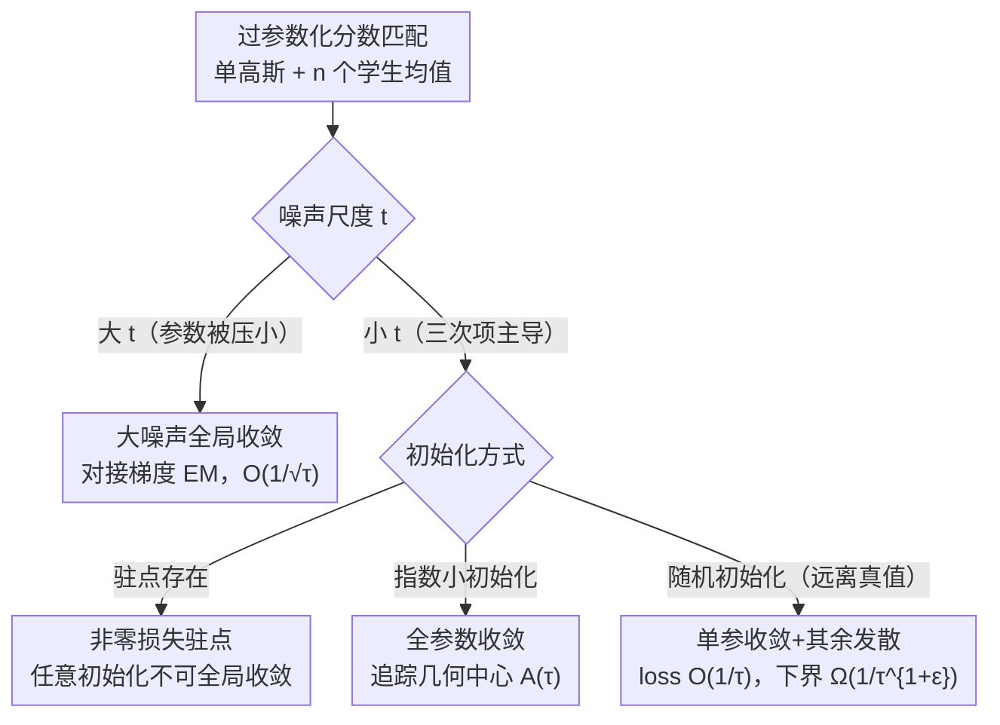

# Convergence Dynamics of Over-Parameterized Score Matching for a Single Gaussian

**会议**: ICLR2026  
**OpenReview**: [https://openreview.net/forum?id=VDIH6L8ANo](https://openreview.net/forum?id=VDIH6L8ANo)  
**代码**: 补充材料中提供（论文未给公开仓库）  
**领域**: 学习理论 / 扩散模型理论 / 优化收敛分析  
**关键词**: 分数匹配, 过参数化, 梯度下降收敛, 高斯混合, 优化动态

## 一句话总结
本文从理论上分析了用过参数化学生模型（$n\ge 2$ 个可学习均值）去学一个真高斯分布时、分数匹配目标上梯度下降的收敛动态：在大噪声尺度下证明全局收敛，在小噪声尺度下揭示出"全部参数收敛"与"只有一个参数收敛、其余发散到无穷但 loss 仍以 $O(1/\tau)$ 趋零"两种截然不同的相变行为，并给出近乎匹配的下界。

## 研究背景与动机

**领域现状**：扩散模型（DDPM、score-based SDE）已成为图像、音频生成的主流框架，其核心是学习"分数函数"——即各噪声尺度下含噪分布对数密度的梯度 $\nabla_x \ln q_t(x)$，训练目标就是分数匹配损失 $L_t(s_t)=\mathbb{E}_{X_t\sim q_t}\big[\,\|s_t(X_t)-\nabla_x\ln q_t(X_t)\|^2\,\big]$。

**现有痛点**：扩散模型的理论大多停在"采样侧"——假设手里已经有一个完美或近似的分数 oracle，去证反向 SDE 采样能逼近真分布。但"训练侧"——梯度下降到底能不能把分数函数学出来——理解还很薄弱。少数训练侧工作（Shah et al. 2023）只覆盖了**恰好参数化（exactly-parameterized）**的情形：学生模型的分量数必须正好等于真高斯混合的分量数（比如真分布是两个高斯，学生就用两个分量）。

**核心矛盾**：真分布的分量数事先根本不知道，实践里扩散模型几乎总是**过参数化**的——用远多于实际需要的参数。而过参数化恰恰是分析最难的地方：参数冗余使得最优解不唯一，且优化动态会出现"慢收敛""部分参数跑飞"等恰好参数化下不存在的现象。已有的过参数化结果（Xu et al. 2024）只针对**梯度 EM** 算法，其更新只含线性项；而分数匹配的梯度里含有**三次项（cubic terms）**，当参数离真值远时三次项主导方向，动态完全不同。

**本文目标**：把问题压缩到最干净的实验室设置——真分布就是**单个**标准高斯 $q=\mathcal{N}(\tilde\mu^*,I_d)$，学生用 $n\ge 2$ 个可学习均值 $\tilde\mu_1,\dots,\tilde\mu_n$ 去拟合——然后问：**过参数化下，分数匹配目标上的梯度下降能否全局收敛？** 子问题按噪声尺度 $t$ 拆：大 $t$ 行不行？小 $t$ 行不行？随机初始化又如何？

**切入角度**：作者发现分数匹配梯度的第一项 $w_i(x)v(x)$ 恰好等于梯度 EM 的梯度，其余都是三次的"高阶修正"。于是大噪声下（参数被强制压得很小）三次项可忽略，可以借用梯度 EM 的分析工具；而小噪声下三次项不可忽略，必须发展新技术（比如追踪参数"几何中心"的演化）。

**核心 idea**：用单高斯这个最简单的过参数化沙盘，按噪声尺度分区刻画梯度下降的相变——证明大噪声全局收敛、小噪声只能在指数小初始化下全参收敛、随机初始化下退化为"单参数收敛 + loss 以 $1/\tau$ 慢速趋零"，并配上近乎匹配的下界。

## 方法详解

### 整体框架

本文不是一个"算法/系统"论文，而是一篇**理论分析**论文，"方法"即问题设定 + 一套按区制（regime）展开的收敛性证明。整体逻辑是：先把扩散训练抽象成一个干净的可分析对象，再沿"噪声尺度 $t$ 从大到小"和"初始化从受控到随机"两条轴，逐区制给出收敛/不收敛的定量刻画。

**问题设定**。真分布是单个高斯，经 OU 前向过程后 $q_t=\mathcal{N}(\mu^*_t,I_d)$，其中 $\mu^*_t=\tilde\mu^*\exp(-t)$，真分数为 $\nabla_x\ln q_t(x)=\mu^*_t-x$。学生模型模仿高斯混合的分数形式：

$$s_t(x)=\sum_{i=1}^n w_{i,t}(x)\,\mu_{i,t}-x,\qquad w_{i,t}(x)=\frac{\exp(-\|x-\mu_{i,t}\|^2/2)}{\sum_{j=1}^n \exp(-\|x-\mu_{j,t}\|^2/2)},$$

即用 $n$ 个 softmax 加权的均值去逼近单个真均值。在固定 $t$ 上对总体损失 $L_t(s_t)=\mathbb{E}_{x\sim\mathcal{N}(\mu^*_t,I_d)}\big[\,\|\sum_i w_{i,t}(x)\mu_{i,t}-\mu^*_t\|^2\,\big]$ 跑梯度下降 $\mu_i^{(\tau+1)}=\mu_i^{(\tau)}-\eta\nabla_{\mu_i}L$。一个关键的化简是：通过平移 $\mu_i\to\mu_i-\mu^*_t$，不失一般性可把真值设为 $\mu^*=0$（式 (1)），把所有分析都归到"参数应当收缩到原点"这个标准化问题上。

整篇的结论可以画成一张"区制相图"：横轴噪声尺度 $t$，纵轴初始化方式——

### 关键设计

**1. 大噪声区制：把分数匹配的梯度下降对接到梯度 EM**

针对"训练侧无收敛保证"这一痛点，作者先攻最容易的大噪声情形。直觉是：当 $t$ 足够大（$t>\log n+\log M+2$，$M=\max_i\|\tilde\mu_i^{(0)}-\mu^*\|$）时，$\|\mu_{i,t}^{(0)}-\mu^*_t\|\le M\exp(-t)\le \tfrac{1}{3n}$，所有参数一开始就被强制压到原点附近的小球里。此时把梯度展开（Lemma 2.2）：

$$\nabla_{\mu_i}L=2\mathbb{E}_x\Big[w_i v + w_i\sum_j w_j\mu_j\mu_j^\top\mu_i - 2w_i v v^\top\mu_i - 2w_i\sum_j w_j(v^\top\mu_j)\mu_j + 3w_i(v^\top v)v\Big],$$

其中 $v(x)=\sum_i w_i(x)\mu_i$。当 $\|\mu_i\|$ 足够小时，第一项 $w_i v$ 主导，其余四项都含三次幂 $\mu$ 的乘积、属于高阶修正可忽略。关键洞察是：**$w_i v$ 恰好就是梯度 EM 的总体损失梯度**（Xu et al. 2024）。于是可沿用梯度 EM 的证明，得到 Theorem 2.1——loss 以 $L_t(s_t^{(\tau)})\le O\big(\tfrac{n^3 d^2}{\sqrt{\eta\tau}}\big)$ 收敛，即 $O(1/\sqrt\tau)$ 速率，与梯度 EM 在过参数化下的最优已知速率一致。这条设计的价值在于：它把"DDPM 训练 ↔ 梯度 EM"的等价关系从恰好参数化推广到了过参数化区制。

**2. 小噪声区制的"拦路虎"：非零损失驻点的存在性**

小 $t$ 下三次项不再可忽略，作者先泼一盆冷水：证明存在一个梯度为零但损失非零的驻点（Theorem 3.1，$n\ge 3$），说明从**任意**初始化出发不可能保证全局收敛，必须对初始化加条件。构造很优雅：取 $\mu_1=se_1,\ \mu_2=-se_1,\ \mu_i=0\,(i\ge 3)$。由对称性 $\nabla_{\mu_i}L=0\,(i\ge 3)$ 且 $\nabla_{\mu_1}L+\nabla_{\mu_2}L=0$，又因为各梯度都是 $\mu_j$ 的线性组合、除第一坐标外都为零。注意到 $s=0$（全在原点）和 $s\to+\infty$（两个分量跑到无穷、贡献可忽略）两端损失都为零，而中间某些 $s$ 损失严格为正，由连续性必存在一个使损失取极大的 $s$，在该点梯度处处消失——这就是一个局部极大型驻点。它直接说明小噪声下的损失曲面比大噪声复杂得多。

**3. 指数小初始化保证全参数收敛——追踪"几何中心"的演化**

既然任意初始化不行，作者问：什么样的初始化能让**所有** $\mu_i$ 都收敛到真值？答案是初始化必须**指数级地**接近 0：当 $\|\mu_i^{(0)}\|\le \tfrac{1}{108nd}\exp(-106ndM_0^3)$（$M_0=\|\mu^*\|$）时，Theorem 3.2 保证每个 $\mu_i$ 都收敛到 $\mu^*$，且参数足够近后 loss 以 $O(1/\sqrt\tau)$ 下降。证明的新技术是**维护一个参考点 $A(\tau)$（参数的几何中心）**：初始化 $A^{(0)}=M_0$，按 $A^{(\tau+1)}=A^{(\tau)}-\tfrac{\eta}{n}A^{(\tau)}$ 演化（自己收缩到 0），并归纳证明只要 $A^{(\tau)}>\tfrac{1}{6n}$ 就始终有 $\|\mu_i^{(\tau)}-A^{(\tau)}e_1\|\le\tfrac{1}{108nd}\exp(106nd(A^{(\tau)})^3)$——即所有参数始终紧贴这个收缩的参考点（Lemma 3.3 给出各 $\mu_i$ 梯度彼此接近 $\tfrac{1}{n}Ae_1$ 的界）。当 $A^{(\tau)}$ 收缩到 $\le\tfrac{1}{6n}$ 时，问题就退回到 Theorem 2.1 的大噪声小球设置，直接套用即可。

**4. 指数小初始化的必要性 + 随机初始化的相变：单参收敛与 $O(1/\tau)$ 慢速率**

作者进一步证明上面那个苛刻的指数条件**不能放松**：Theorem 3.4 给出一个反例，初始化虽然指数接近 0（$\mu_1^{(0)}=(\epsilon_0,0,\dots)$ 取 $\epsilon_0=\exp(-M_0/100)$，其余 $\mu_i^{(0)}=0$），但只有 $\mu_1$ 收敛到真值、其余 $\|\mu_i\|\to\infty$，说明全参收敛对初始化极其敏感。最有意思的是**随机初始化**（Theorem 3.5 / Corollary 3.6）：当每个 $\mu_i$ 独立采自 $\mathcal{N}(\mu,I_d)$、中心 $\mu$ 离真值很远（$M_0=\|\mu-\mu^*\|>10^9\sqrt d\,n^{10}$）时，以至少 $(1-n^2 M_0^{-1/3})$ 的高概率发生这样的相变：**恰好一个参数收敛到真值，其余全部发散到无穷，但训练损失仍以 $O(1/\tau)$ 趋零**。证明分两阶段——阶段一证 $\|\mu_{i_0}\|$ 比其它 $\|\mu_j\|$ 衰减得快、在 $O(\log M_0/\eta)$ 步内降到 $\le\tfrac{1}{8M_0^3}$ 而其余几乎不动；阶段二证一旦 $\mu_{i_0}$ 足够近、其余足够远，则 $\min_{j\ne i_0}\|\mu_j-\mu^*\|$ 随迭代单调增大、$\mu_{i_0}$ 保持贴近真值。最后 Theorem 3.7 给出近乎匹配的**下界** $L_0(s_0^{(\tau)})\ge \tfrac{c}{\tau^{1+\epsilon}}$（任意常数 $\epsilon>0$），说明 $O(1/\tau)$ 几乎最优——这与恰好参数化情形（Shah et al. 2023）的**线性收敛**形成鲜明反差：过参数化在小噪声下把指数/线性收敛"拖慢"成了多项式速率。

### 损失函数 / 训练策略

全文分析的是**总体损失（population loss）**上的纯梯度下降（非 SGD），固定噪声尺度 $t$、对参数 $\mu_{i,t}$ 直接更新 $\mu_i^{(\tau+1)}=\mu_i^{(\tau)}-\eta\nabla_{\mu_i}L_t$。步长在各定理中取 $\eta\le O(1/(n^4 d^2))$ 一类的小常数以保证下降。注意这里没有"训练技巧"，所有结论都来自对梯度动态的精确刻画。

## 实验关键数据

本文是理论论文，实验仅用于**验证理论预言的两种相变行为**，不追求 SOTA。设置：$n=5,\ d=3$，真值 $\mu^*=(0,0,0)$，每个 $\mu_i$ 初始化为 $(M,0,0)+10^{-7}z_i,\ z_i\sim\mathcal{N}(0,I_d)$；学习率 0.01，迭代 20000 步，batch size 20000。

### 主实验（两种相变行为的数值验证）

| 初始尺度 $M$ | 观测到的 $\|\mu_i\|$ 行为 | loss 行为 | 对应理论 |
|--------------|---------------------------|-----------|----------|
| $M=4$ | **所有**参数收敛到真值 | loss 趋零 | §3.2 指数小初始化全参收敛 |
| $M=6$ | **仅一个**参数收敛、其余发散到无穷 | log-log loss 末段斜率 ≈ $-1$，即 $O(1/\tau)$ | §3.3 随机初始化单参收敛 |

### 关键发现
- **同一个 $10^{-7}$ 扰动，$M$ 一变结果质变**：扰动固定为 $10^{-7}$，但当 $M=6$ 时它已超过临界阈值 $\exp(-\mathrm{poly}(M))$，于是从"全参收敛"切换到"单参收敛 + 其余发散"——直观印证了 Theorem 3.4 关于指数小初始化必要性的论断。
- **$1/\tau$ 速率被直接看到**：$M=6$ 的 log-log loss 曲线在热身阶段后逼近斜率 $-1$ 的直线，与 $O(1/\tau)$ 的理论收敛率吻合，也间接佐证了 $\Omega(1/\tau^{1+\epsilon})$ 下界（速率确实卡在多项式而非指数/线性）。
- **大噪声更"听话"**：大噪声把参数压进小球、动态退化为梯度 EM，因而稳定可预测；小噪声三次项主导，动态对初始化高度敏感——这给"为什么扩散训练要跨多噪声尺度平均"提供了一种理论解释。

## 亮点与洞察
- **"第一项就是梯度 EM"这一观察是全文枢纽**：它把含三次项的分数匹配梯度，在大噪声/小参数区制下精确对接到只含线性项的梯度 EM，让现成的 EM 分析工具得以复用——是连接 DDPM 训练与经典统计算法的一座桥。
- **几何中心追踪 $A(\tau)$ 是可迁移的证明技巧**：当一群过参数化参数应当协同收缩到一点时，维护一个"自收缩参考点 + 全体紧贴该点"的不变量，比逐个参数分析干净得多，可能对其它过参数化 teacher-student 分析有用。
- **"loss 收敛 ≠ 参数恢复"的清晰反例**：随机初始化下 loss 漂亮地趋零，但 $n-1$ 个参数其实跑到了无穷——提醒大家在过参数化生成模型里，低训练损失并不意味着学到了正确的解结构。
- **据作者称这是首个在分数匹配框架下、为含 ≥3 分量高斯混合建立全局收敛保证的工作**（⚠️ 此"首个"表述以原文为准）。

## 局限与展望
- **只覆盖单个真高斯**：真分布限定为 $m=1$ 个分量，连两分量混合都还没处理；作者也承认推广到多分量高斯混合是重要且困难的未来方向。
- **固定噪声尺度 $t$ 的分析**：实际扩散训练用的是跨多噪声尺度的时间平均损失，本文只刻画单个 $t$ 的动态，如何把不同 $t$ 的成分在 $t$-平均下耦合起来仍未解决。
- **纯梯度下降 + 总体损失**：没有处理随机/自适应优化器（SGD、Adam）和有限样本噪声，而实践中正是这些在起作用。
- **常数极其悲观**：如 $M_0>10^9\sqrt d\,n^{10}$、指数初始化 $\exp(-106ndM_0^3)$ 这类阈值离实用尺度很远，是"存在性/定性"刻画而非可操作的工程指导。
- **中间区制留白**：介于"指数小初始化全参收敛"与"随机远初始化单参收敛"之间的初始化会怎样，作者明说这是有趣的开放问题。

## 相关工作与启发
- **vs Shah et al. (2023)**：他们分析 DDPM 目标在**恰好参数化**且两分量、良好分离下的梯度下降，证全局恢复且为**线性**收敛；本文做**过参数化**单高斯，揭示小噪声下退化为多项式 $O(1/\tau)$，并去掉了"分量数已知"的强假设——更贴近实践但收敛更慢。
- **vs Xu et al. (2024)**：他们给过参数化**梯度 EM**（更新仅线性项）的全局收敛；本文处理的分数匹配梯度含**三次项**，大噪声下借用其工具、小噪声下必须发展几何中心追踪等新技术。
- **vs 采样侧理论（De Bortoli, Chen et al. 等大量工作）**：那一脉假设已有完美/近似分数 oracle、证采样收敛；本文补的是**训练侧**——分数函数本身能否被梯度学出来。
- **vs 学高斯混合的经典工作（EM / 矩方法 / 谱方法）**：Jin et al. (2016) 指出 EM 在 >2 分量时可能不全局收敛；本文在分数匹配框架下、过参数化单高斯上给出正面的（条件化）收敛刻画，呼应了过参数化"慢收敛"在两层网络、矩阵感知等问题中的普遍现象。

## 评分
- 新颖性: ⭐⭐⭐⭐⭐ 首次在分数匹配框架下刻画过参数化单高斯的梯度下降相变，揭示大/小噪声的质变与多项式慢速率。
- 实验充分度: ⭐⭐⭐ 理论论文，实验只用两条曲线验证相变，足够但规模极小（$n=5,d=3$）。
- 写作质量: ⭐⭐⭐⭐ 区制划分清晰、证明草图直觉到位，但常数与定理叙述偏密，需要一定背景。
- 价值: ⭐⭐⭐⭐ 为扩散训练的优化理论补上"过参数化训练侧"一块，几何中心追踪等技巧可迁移。

<!-- RELATED:START -->

## 相关论文

- [\[ICML 2026\] On the Robustness of Langevin Dynamics to Score Function Error](../../ICML2026/learning_theory/on_the_robustness_of_langevin_dynamics_to_score_function_error.md)
- [\[ICLR 2026\] Score-Based Density Estimation from Pairwise Comparisons](score-based_density_estimation_from_pairwise_comparisons.md)
- [\[ICLR 2026\] Transformers as Unsupervised Learning Algorithms: A study on Gaussian Mixtures](transformers_as_unsupervised_learning_algorithms_a_study_on_gaussian_mixtures.md)
- [\[ICLR 2026\] A Faster Parameter-Free Regret Matching Algorithm](a_faster_parameter-free_regret_matching_algorithm.md)
- [\[ICLR 2026\] Bandit Learning in Matching Markets Robust to Adversarial Corruptions](bandit_learning_in_matching_markets_robust_to_adversarial_corruptions.md)

<!-- RELATED:END -->
