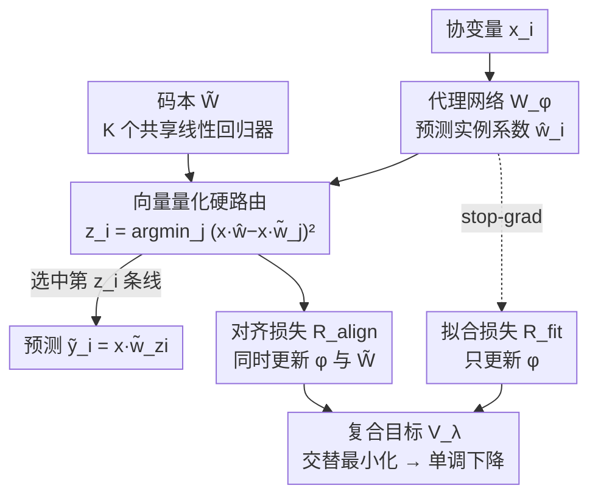

# Covariate-Guided Clusterwise Linear Regression for Generalization to Unseen Data

**会议**: ICLR2026  
**OpenReview**: [https://openreview.net/forum?id=1XowCDuqSM](https://openreview.net/forum?id=1XowCDuqSM)  
**代码**: 待确认  
**领域**: 学习理论 / 表格回归 / 聚类线性回归  
**关键词**: clusterwise 回归、协变量引导路由、向量量化、收敛性分析、PAC 泛化界

## 一句话总结
针对"表格数据只在局部呈线性"的回归任务，本文提出 CG-CLR：用一个代理网络（proxy network）为每个样本生成局部系数、再以**硬向量量化**把它路由到 $K$ 个共享线性回归器之一，从而在一个梯度循环里**同时学到"怎么分配新样本"和"每个簇的线性模型"**，并配套给出收敛性证明、PAC 泛化界和用 F-检验选簇数 $K$ 的方法。

## 研究背景与动机
**领域现状**：很多表格回归问题里，协变量 $x_i\in\mathbb{R}^p$ 和响应 $y_i\in\mathbb{R}$ 的关系**只在输入空间的局部区域近似线性**，全局一条线拟合不了这种异质性。经典的聚类线性回归（Clusterwise Linear Regression, CLR）走的是折中路线：学 $K$ 个局部线性回归器 $\{\tilde w_j\}_{j=1}^K$ 加上 $N\times K$ 个 0/1 指示变量 $\alpha_{i,j}$（每个样本只归一个簇），目标是最小化 $\frac1N\sum_i\big(y_i-x_i^\top\sum_j\alpha_{i,j}\tilde w_j\big)^2$。它既保留了局部线性模型的可解释性，又能用聚类容纳异质性。

**现有痛点**：CLR 系方法在"单点预测"任务（来了一个新协变量 $x_{i'}$，没有真实响应 $y_{i'}$，要直接给出预测）上有两个根本毛病。一是**大多数算法把聚类和回归解耦**——混合整数规划、列生成、交替算法等只把样本拟合到 $K$ 条线上，**对未见样本没有显式的分配规则**，测试时只能事后启发式地"最近邻"挂一个簇，造成 assignment bias、过拟合训练集、泛化掉点。二是 **Sparse MoE / 树切分这类方案**虽然把门控和回归整合了，但**收敛不稳定、重度依赖启发式**，而且轴对齐（axis-aligned）的切分画不出真正的斜向分配边界。

**核心矛盾**：CLR 想要的"既会拟合 $K$ 条局部线、又会把新样本路由到正确的线"这两件事，在已有框架里**要么不可兼得、要么没有收敛保证**。更尖锐的是，理想目标里那个"选误差最小的回归器"的内层 min 是**看了 $y_i$ 才能选**（response-dependent），而单点预测时根本没有 $y_{i'}$——这个目标本质上"测试时不可行"。

**本文目标**：在**不假设数据由某 $K$ 个线性模型生成**（agnostic / 非可实现 non-realizable 设定）的前提下，端到端地同时学到 (i) 一个**只依赖协变量、与响应无关**的路由规则，和 (ii) 对应的 $K$ 个线性回归器，并且要有收敛性和泛化的理论保证。

**切入角度**：作者从 VQ-VAE 的"码本 + 向量量化"机制借力——既然测试时不能看响应来选回归器，那就让一个网络**先为样本预测一个"它最适合的系数向量"**，再把样本路由到码本里"预测最接近"的那条线。这样路由只看 $x$，天然满足单点预测约束。

**核心 idea**：用"代理网络预测系数 + 硬向量量化路由到码本回归器 + 双损失（拟合 + 对齐）"把分配规则和局部回归器塞进同一个可微的梯度循环里联合学习。

## 方法详解

### 整体框架
CG-CLR（Covariate-Guided CLR）维护两个可学习组件：一个 $K$ 列的**码本** $\tilde W=[\tilde w_1,\dots,\tilde w_K]\in\mathbb{R}^{(p+1)\times K}$（每列是一条增广后的局部线性回归器，最后一行是偏置），和一个 $M$ 层 ReLU MLP 的**代理网络** $W_\phi$。前向时，代理网络把协变量 $x_i$ 映射成一个**实例专属的系数向量** $\hat w_i:=W_\phi(x_i)\in\mathbb{R}^{p+1}$；向量量化器拿代理预测 $\hat y_i=x_i^\top\hat w_i$ 和码本里 $K$ 条线的预测 $\{x_i^\top\tilde w_j\}$ 逐一比对，把样本**硬路由**到预测最接近的那条线（索引 $z_i$），最终预测就是 $\tilde y_i=x_i^\top\tilde w_{z_i}$。训练时算两个损失——拟合损失 $R_{\text{fit}}$ 和对齐损失 $R_{\text{align}}$，用 stop-gradient 控制梯度只流向该流向的部分，整体在一个**交替最小化**（assignment → 更新代理 → 更新码本）的循环里优化。

随 $K$ 变化，CG-CLR 平滑地横跨"一条全局线（$K=1$）"到"几乎每个样本一条线（$K\approx N/(p+1)$）"的整个谱系，相当于给用户一个在"模型简单度↔预测灵活度"之间连续调节的旋钮。

### 关键设计

**1. 协变量引导的"代理网络 + 码本"双轨结构：把无响应可用的路由变成可微操作**

CLR 的死结在于"测试时没有 $y_{i'}$ 就没法选回归器"。理想的 oracle 风险 $L^\star(\tilde W)=\mathbb{E}\big[\min_j(y_i-x_i^\top\tilde w_j)^2\big]$ 内层 min 要看响应才能选，既 NP-hard 又测试时不可行。CG-CLR 的破法是引入一个**响应无关的代理** $\hat w_{i'}=W_\phi(x_{i'})$：代理网络专门预测"这个样本最像哪条线的系数"，路由规则

$$z_{i'}:=\arg\min_{j\in[K]}\big(x_{i'}^\top\hat w_{i'}-x_{i'}^\top\tilde w_j\big)^2$$

**只依赖 $x_{i'}$**，因此测试时完全合法。这一步就是一次向量量化：把代理空间和码本紧紧耦合，让下游目标的梯度能同时更新代理网络参数 $\phi$ 和码本 $\tilde W$。代理网络末层留作线性、不加激活，保证 $\hat w_i$ 的每个坐标可取任意实值。和"事后最近邻挂簇"的旧 CLR 相比，这里的分配规则是**和回归器一起学出来的**，从根上消掉了 assignment bias。

**2. 双损失 + stop-gradient：让"拟合"和"对齐"各管一摊、互不打架**

直接拿一个损失同时训代理和码本会互相拉扯：更新代理时可能把当前簇的拟合搞坏。作者借 VQ-VAE 的思路设计了两个角色互补的损失。**拟合损失** $R_{\text{fit}}$ 用 stop-gradient 冻住码本，只让梯度流回代理：

$$R_{\text{fit}}(\phi,\tilde W^{\text{stop}}):=\frac1N\sum_i\Big(y_i-x_i^\top\big(\hat w_i-\hat w_i^{\text{stop}}+\tilde w_{z_i}^{\text{stop}}\big)\Big)^2$$

由于 $\hat w_i-\hat w_i^{\text{stop}}$ 在前向时抵消为 0，它前向上**就等于冻结预测 $x_i^\top\tilde w_{z_i}$ 的平方误差**，但反向时 $\nabla_{\tilde W}R_{\text{fit}}=0$、$\nabla_\phi R_{\text{fit}}\neq 0$——代理拿到了常规回归梯度，却**不会抬高当前簇内损失**。**对齐损失** $R_{\text{align}}(\phi,\tilde W):=\frac1N\sum_i\big(x_i^\top(\hat w_i-\tilde w_{z_i})\big)^2$ 的梯度同时流向 $\phi$ 和 $\tilde W$，逼代理预测和被路由到的码本线在预测值上靠拢，从而改善后续分配。复合目标按权重 $\lambda\ge0$ 混合：

$$V_\lambda(\phi,\tilde W):=R_{\text{fit}}(\phi,\tilde W^{\text{stop}})+(1+\lambda)\,R_{\text{align}}(\phi,\tilde W)$$

$\lambda$ 越大越强调闭合代理–码本的间隙（换取更快的长期收敛），$\lambda=0$ 则拟合与对齐等权。一个关键观察是：当 $R_{\text{align}}\to0$ 时每个代理预测都收敛到其码本线预测，$R_{\text{fit}}$ 退化回式 (1) 的 response-aware min-loss——也就是说**最小化 $V_\lambda$ 是在朝 oracle 目标走，同时全程保持路由 response-free**。

**3. 交替最小化训练：块坐标更新 + 全可微 pipeline**

训练按 epoch 做两步块坐标更新（类比 VQ-VAE）。**Assignment 步**：对 mini-batch 每个样本算 $\hat w_i=W_{\phi^{(t)}}(x_i)$ 并按式 (2) 算 $z_i$，缓存分区 $\{S_j\}$。**代理更新步**：固定分配，反传 $V_\lambda$，stop-gradient 保证只更新 $\phi$，码本冻结，$\phi^{(t+1)}=\phi^{(t)}-\eta\nabla_\phi V_\lambda$。**码本更新步**：固定代理，因为 $R_{\text{fit}}$ 对 $\tilde W$ 带 stop-gradient，更新退化为纯对齐步 $\tilde W^{(t+1)}=\tilde W^{(t)}-\eta\nabla_{\tilde W}R_{\text{align}}$。码本初始化为 $\mathrm{Unif}(-1/K,1/K)$ 逐元素采样，特征做标准化让斜率和偏置尺度可比。测试时给新 $x_{i'}$，代理出系数→式 (2) 路由→用码本系数 $\tilde y(x_{i'})=x_{i'}^\top\tilde w_{z_{i'}}$ 预测；也可换一种推理模式直接用代理系数 $\hat y(x_{i'})=x_{i'}^\top W_\phi(x_{i'})$。

**4. F-检验选簇数 $K$：把"该不该再加一条线"变成统计显著性检验**

CG-CLR 把所有 $K$ 个回归器的协变量拼成一个大设计矩阵，于是整套模型可看作一个嵌套线性模型，能直接套经典 F-统计量来量化**有效模型复杂度**。是否再加一个簇用嵌套模型 F-检验顺序判定：

$$F_{K\to K+1}=\frac{(\text{SSE}_K-\text{SSE}_{K+1})/(p+1)}{\text{SSE}_{K+1}/\big(N-(K+1)(p+1)\big)}\sim F_{p+1,\,N-(K+1)(p+1)}$$

在给定显著性水平 $\alpha$ 下，选**最小的、能通过检验**的 $K$。这给了选簇数一个有统计学依据的标准，而不是拍脑袋或纯靠验证集网格搜。

### 损失函数 / 训练策略
核心目标即复合损失 $V_\lambda=R_{\text{fit}}+(1+\lambda)R_{\text{align}}$（式 5）。实践中真实数据上固定 $\lambda=1$、跨数据集共用同一套代理网络结构/优化器/正则，唯一随数据集变的是覆盖预算 $K=\lfloor N_{\text{tr}}/(10p+10)\rfloor$（"large-coverage"组）。论文还以 $V_\lambda$ 作为 Lyapunov 函数证明单调下降与线性收敛（见下）。

### 理论保证
- **单调下降（Prop. 3.1）**：在 Assumption 1（代理网络 Lipschitz 且 Jacobian 有下界）与 Assumption 2（对齐损失关于码本强凸光滑）下，固定分配时只要步长 $0<\eta\le1/L_V$，每个 epoch 的 $V_\lambda$ 严格下降，$V_\lambda$ 充当合法的 Lyapunov 函数。
- **线性收敛（Thm. 3.2）**：再加 Assumption 3（不同最优回归器的预测有最小间隔 $\Delta>0$，分配最终稳定）和 Assumption 4（代理网络伪维度 $\ge CK(p+1)$，表达力够）后，参数以速率 $q=\frac{L_V-\mu_V}{L_V+\mu_V}$ 线性收敛。
- **PAC 风格泛化界（Thm. 3.3）**：以高概率 $R_{\text{test}}\le R_{\text{train}}+O\big(\max_j\|\tilde w_j\|\sqrt{dM\log d\,\log 2N/N}\big)+\dots$，给出 agnostic 单点预测下的超额风险界。

## 实验关键数据

### 主实验（真实表格数据，Test RMSE，越低越好）
在 7 个标准表格回归基准上做嵌套 5 折交叉验证（每个数据集 20 次独立估计）。按"覆盖度"分组：small-coverage（RF/XGBoost/CatBoost/DNN/DC/CG-CLR(PROXY)）与 large-coverage（MLR*/EM-MLR*/CART/PILOT/LDT/S-IMEd/CG-CLR(CODEBOOK)）。同覆盖预算下，CG-CLR(CODEBOOK) 在 large-coverage 组里全面最优，并在 BIKE、ELECTRICAL 上拿下**总榜最佳**。

| 数据集 | CG-CLR (CODEBOOK) | 同组最佳对手 | 最强黑盒(CatBoost等) |
|--------|-------------------|--------------|----------------------|
| BIKE | **[40.77, 41.71]** ✅总榜最佳 | S-IMEd [56.13, 58.01] | CatBoost [44.69, 45.29] |
| ELECTRICAL | **[0.006, 0.006]** ✅总榜最佳 | S-IMEd [0.010] | CatBoost [0.007] |
| CONDUCT | [10.50, 10.62] | S-IMEd [12.68, 13.04] | CatBoost [9.62, 9.76] |
| HOUSING | [0.485, 0.497] | S-IMEd [0.560, 0.570] | CatBoost [0.440, 0.446] |
| WINE | [0.652, 0.676] | LDT [0.698, 0.718] | XGBoost [0.622, 0.646] |

可见：CG-CLR 只用 $K$ 个共享回归器，就把 RMSE 压到逼近上千棵树的梯度提升集成，且**稳定击败所有 CLR / MoE 同类**。MLR* 印证了事后分配的危害——局部专家拟合训练集够好，但缺学到的分配规则，泛化全组垫底。

### 合成数据：能否精确重建分片线性面
在三条真实线性规则拼成的分片线性面上（含一个被另两区完全隔开的难区），$K=3$ 训练。**只有 CG-CLR 在整面达到（近）零误差**：码本预测精确，仅在无数据的簇边界有一条细伪影；代理预测因噪声有轻微波动。对手里 LDT 受轴对齐切分所限错失斜向边界、产生大片偏置区，S-IMEd 错误合并东北两楔形成大片高误差区。

### 关键发现
- **码本 vs 代理两种推理模式**：两者预测误差几乎一样，但**系数恢复差别大**——码本仅 3 条共享线几乎完美恢复真值系数（误差热图近乎全白），代理逐点生成系数虽均值无偏但有可见抖动（斑点状误差图）。要稳定、可解释的局部线性规则就用码本。
- **F-检验选 $K$ 与真值吻合**：$K=2\to3$ 在 $\alpha=0.01$ 显著（p<0.001），$K=3\to4$ 不显著（p=0.038>0.01），于是选中 $K=3$，定量对上 ground truth 的三个区。

## 亮点与洞察
- **把"测试时不可见响应"这个死结用 VQ 化解**：代理网络预测系数、再硬路由到码本，让路由天然 response-free——这是整篇最巧的一步，单点预测约束和可微优化在这里同时满足。
- **stop-gradient 实现干净的角色分离**：$R_{\text{fit}}$ 只更新代理、$R_{\text{align}}$ 同时更新两者，避免"训代理时砸坏当前簇拟合"，这套机制可迁移到任何"路由 + 专家"的联合训练。
- **罕见地把方法、收敛证明、PAC 界、模型选择四件事打通**：尤其用嵌套线性模型 F-检验选簇数，给了 CLR 一个久缺的、统计意义明确的复杂度刻度。
- **一个 $K$ 旋钮横跨全局线性到实例级拟合**：复杂度连续可调，且小 $K$ 时码本就是几条人能读懂的局部线性规则，兼顾精度与可解释性。

## 局限与展望
- **依赖较强的理论假设**：线性收敛要 Assumption 3 的"最小预测间隔 $\Delta>0$"，当真实局部规则在输入空间靠得很近、边界模糊时该假设易被破坏；作者也把"用输入空间分离准则或自适应间隔放松 Assumption 3"列为未来方向。
- **仍是分片线性**：每个簇内只能线性，强非线性局部结构需要靠加大 $K$ 硬切，作者提到可扩展到核/样条等浅非线性专家来捕捉更丰富的局部结构。
- **代理系数抖动**：代理推理模式系数逐点波动，不适合直接当可解释模型用；想要稳定可解释只能退回码本，高维下还需配合簇级特征选择/稀疏约束。
- **场景偏表格**：方法围绕表格回归设计，对图像/序列等高维结构化数据的适用性未验证。

## 相关工作与启发
- **vs 传统 CLR（混合整数规划 / 列生成）**：它们只在 realizable 设定下拟合 $K$ 条线、对未见样本无显式分配规则，靠事后聚类挂簇导致泛化掉点；CG-CLR 在 agnostic 设定下把分配规则和回归器**联合学**，自带单点预测器。
- **vs MLR / EM-MLR（agnostic min-loss）**：它们的"min-loss"保证只在 list-decoding（拿到 $y_{i'}$ 后回溯选误差最小的线）下成立，本质仍是 response-dependent；CG-CLR 的路由 response-free，真正能单点预测。
- **vs 树/DC 分片线性（LDT、PILOT、CART、DC）**：受轴对齐或局部连续切分所限，画不出斜向分配边界，几何灵活度低；CG-CLR 的 VQ 路由不受这种约束。
- **vs Sparse MoE / 超网络（S-IMEd、contextual lasso、TabNet 系）**：软门控训练但硬选择预测、收敛不稳，或实例级系数抖动大、近乎黑盒；CG-CLR 用 VQ 对齐给出稳定的全局目标 + 内建单点预测器，精度匹配或超过黑盒的同时保持紧凑可控的码本。

## 评分
- 新颖性: ⭐⭐⭐⭐⭐ 用 VQ 化解 CLR 的"测试无响应"死结，并首次把端到端分配学习 + 收敛证明 + PAC 界 + F-检验选 $K$ 一并打通
- 实验充分度: ⭐⭐⭐⭐ 合成面精确重建 + 7 个真实基准嵌套交叉验证，覆盖度分组对比清晰；但多为中小规模表格、未涉高维/大规模
- 写作质量: ⭐⭐⭐⭐⭐ 问题定义、surrogate 推导、理论假设与定理层层递进，动机和方法都讲得透
- 价值: ⭐⭐⭐⭐ 给"想要可解释局部线性 + 黑盒级精度"的表格回归提供了一个有理论保证、复杂度可调的实用框架

<!-- RELATED:START -->

## 相关论文

- [\[ICLR 2026\] Closed-form $\ell_r$ norm scaling with data for overparameterized linear regression and diagonal linear networks under $\ell_p$ bias](closed-form_ell_r_norm_scaling_with_data_for_overparameterized_linear_regression.md)
- [\[ICLR 2026\] Learning under Quantization for High-Dimensional Linear Regression](learning_under_quantization_for_high-dimensional_linear_regression.md)
- [\[ICLR 2026\] Two-Layer Convolutional Autoencoders Trained on Normal Data Provably Detect Unseen Anomalies](two-layer_convolutional_autoencoders_trained_on_normal_data_provably_detect_unse.md)
- [\[ICLR 2026\] Memorizing Long-tail Data Can Help Generalization Through Composition](memorizing_long-tail_data_can_help_generalization_through_composition.md)
- [\[ICLR 2026\] Pseudo-Non-Linear Data Augmentation: A Constrained Energy Minimization Viewpoint](pseudo-non-linear_data_augmentation_a_constrained_energy_minimization_viewpoint.md)

<!-- RELATED:END -->
