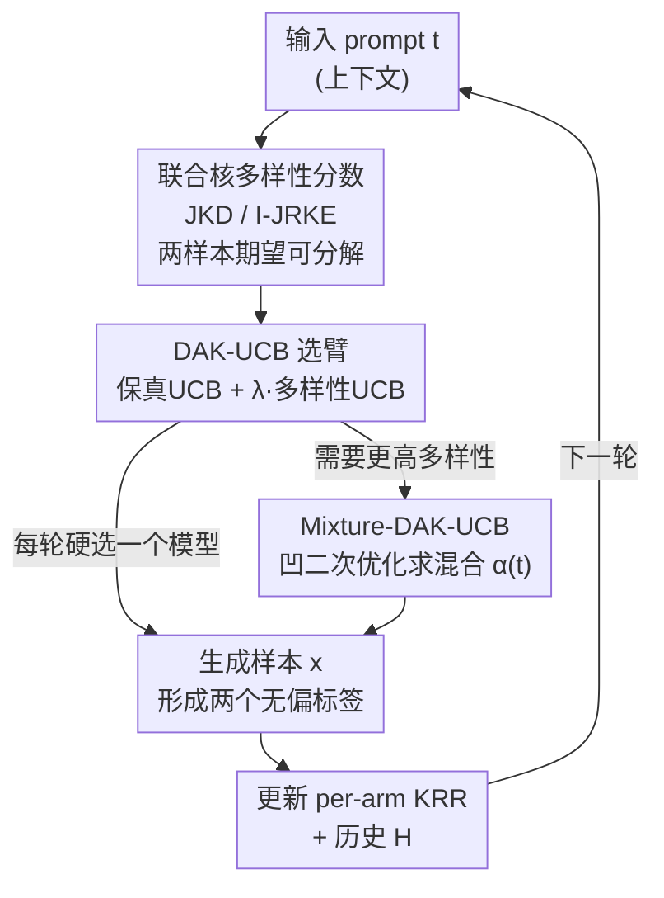

# DAK-UCB: Diversity-Aware Prompt Routing for LLMs and Generative Models

**会议**: ICLR 2026  
**OpenReview**: [https://openreview.net/forum?id=nnN2TKlS5C](https://openreview.net/forum?id=nnN2TKlS5C)  
**代码**: https://github.com/Donya-Jafari/DAK-UCB  
**领域**: 学习理论 / 上下文老虎机 / 生成模型选择  
**关键词**: 上下文老虎机, 核化UCB, 多样性度量, prompt路由, 生成模型选择

## 一句话总结
本文提出 DAK-UCB——一个把"多样性"显式塞进核化 UCB 上下文老虎机的在线模型选择算法，用可分解成两样本期望的联合核分数（JKD / I-JRKE）作为多样性奖励，在为一连串 prompt 路由生成模型时同时兼顾保真度和多样性，并给出后悔界保证。

## 研究背景与动机

**领域现状**：随着 LLM、文生图、视频生成等服务越来越多，"给定一个 prompt，该调用哪个模型"成了核心问题。主流做法分两类：离线学习先用一批"模型对 prompt 的响应"训练一个选择器；在线学习则把它建模成上下文老虎机（prompt 当 context），代表方法是 Hu et al. 2025 的 PAK-UCB，用核化 UCB 根据历史观测到的模型表现来选臂。

**现有痛点**：所有现有方法都只盯着**保真度分数**（如文生图里的 CLIP-Score），完全忽略生成结果的**多样性**。后果是：单看每个样本都和 prompt 对得很齐，但整体上输出高度同质——比如总生成"年轻男性"的人像，敏感属性（性别、族裔）的表示被压窄。论文 Figure 1 给了个直观例子：一个无条件、更多样的模型 G2 和一个被条件化到"young male"、更单调的 G1，基线核化 UCB 因为只看 CLIP-Score，对两者几乎五五开，根本不会偏向更多样的那个。

**核心矛盾**：多样性本质上是一个**群体级（group-level）属性**——它由多个样本的相对分布决定，而标准上下文老虎机的奖励是**样本级分数的均值**。把一组样本的多样性塞进"逐样本求平均"的老虎机框架里，在数学结构上是不兼容的：平均个体奖励永远表达不出"这组样本彼此有多不同"。

**本文目标**：设计一个在线选择算法，既能利用历史生成数据，又能在保真度和多样性之间取得最优平衡，并且要可证明（有后悔界）。

**切入角度**：作者发现并不是任意多样性分数都能塞进老虎机框架——关键是要找到一族**能写成 (prompt, output) 两样本二次型期望**的多样性分数。一旦多样性分数能分解成"对单个生成样本求期望"的形式，每轮和模型交互拿到的单个样本就是该多样性函数的一个无偏随机标签，于是就能像处理保真度分数一样跑核岭回归（KRR）并得到 UCB 置信界。

**核心 idea**：把核距离（KD）和 Rényi 核熵（RKE）扩展成 prompt 条件版的"联合核分数"（JKD、I-JRKE），它们都能分解成两样本期望，从而无缝接入核化 UCB——用一个保真项的上置信界 + 一个多样性项的置信界组合成选择目标。

## 方法详解

### 整体框架
DAK-UCB 把"为每个到来的 prompt 选一个生成模型"建模成 per-arm 的核化上下文老虎机：prompt $t$ 是 context，$G$ 个候选生成模型是臂。每个臂维护两套核岭回归估计器——一套预测**保真度** $s_g(t)$（实验里实例化为 CLIP-Score），一套预测**多样性** $D_g(t)$（实例化为联合核分数）。每一轮，对每个臂同时算出两个量的预测值和置信半径，组合成一个综合 UCB 分数 $J_g(t)=s_g(t)+\lambda D_g(t)$，选分数最高的臂去生成；拿到样本后形成两个无偏标签反过来更新这两套 KRR 估计器和历史 $H$。这样多样性就和保真度一样，被"在线学到"并影响选择。

之所以这套流程能跑起来，关键前提是多样性分数能分解成两样本期望（Proposition 1），从而每轮单个样本就能当无偏标签。除了"每轮硬选一个模型"，论文还给出一个**混合**版本：把"选哪个模型"放松成一个 prompt 相关的概率分布 $\alpha(t)\in\Delta_G$（相当于掷一个有偏的多面骰子），通过凹二次优化求每个 prompt 下的最优混合，进一步提升多样性。

### 关键设计

**1. 联合核多样性分数：让"群体级多样性"能被两样本期望表达**

这是全文的结构性基石，直接解决"多样性是群体属性、塞不进逐样本平均老虎机"这个核心矛盾。作者把无条件的核距离 KD 和 Rényi 核熵 RKE 扩展到条件生成场景，关键手法是用**乘积核** $k_{\text{joint}}([t,x],[t',x'])=k_T(t,t')\cdot k_X(x,x')$ 把 prompt 和输出绑在一起。由此得到两个分数：联合核距离 JKD（衡量分布匹配/正确性）
$$\mathrm{JKD}(P_{X|T},Q_{X|T}):=\mathrm{KD}(P_T\cdot P_{X|T},\,P_T\cdot Q_{X|T})$$
和逆联合 RKE（衡量多样性）
$$\text{I-JRKE}(P_{X|T}):=\mathbb{E}_{t,t'\sim P_T,\,x,x'}\big[k_T(t,t')^2 k_X(x,x')^2\big].$$
它们的妙处在于（Proposition 1）：都能写成 $\mathbb{E}_{t,x}[\phi(t,x)]$ 这种"对单个生成样本求期望"的两样本形式。也就是说，虽然多样性原本定义在 prompt-输出**成对**上，但每个 prompt 只需生成**一个**样本就能得到对应多样性函数的无偏随机标签。正是这个分解让多样性分数获得了和保真度分数同等的"可在线估计性"——没有它，后面的 UCB 机制无从谈起。

**2. DAK-UCB 选择规则：双置信界组合，多样性也享受乐观探索**

有了可分解的多样性标签，作者把它接进 per-arm 核化 UCB。对每个臂 $g$ 定义两个 prompt 级目标函数 $s_g(t)$（保真，期望是 CLIP-Score）和 $D_g(t)$（多样性，期望是 I-JRKE 或 JKD 的负值），各自用一套 KRR 在线拟合。选臂时用乐观估计
$$\hat J^{\text{UCB}}_g(t_i)=\big(\hat s_g(t_i)+\beta^{(s)}\hat\sigma^{(s)}_g(t_i)\big)+\lambda\big(\hat D_g(t_i)+\beta^{(D)}\hat\sigma^{(D)}_g(t_i)\big),$$
即保真项取上界、多样性项也按 KRR-UCB 标准形式给置信半径（$D_g$ 是带符号的多样性奖励，等于底层惩罚的负值）。$\lambda$ 是保真-多样性的权衡系数。拿到样本 $x_i$ 后形成两个无偏标签 $y^{(s)}_i=\phi_{\text{fid}}(t_i,x_i)$、$y^{(D)}_i=\psi_{g_i}(t_i,x_i;H_i)$，更新对应臂的两套 KRR。和只看保真度的 PAK-UCB 相比，DAK-UCB 把多样性也纳入了"乐观面对不确定性"的探索逻辑，因此能主动去试那些可能更多样的臂。作者还在附录证明了一个分阶段变体 Sup-DAK-UCB 的后悔界 $\tilde O(\sqrt{GT\Gamma^{(s)}_T}+\lambda\sqrt{GT\Gamma^{(D)}_T})$，把核化 UCB 已有的后悔保证系统性地推广到了多样性目标——这条理论结果之所以成立，正依赖于设计 1 的两样本期望结构。

**3. Mixture-DAK-UCB：用凹二次优化把"选一个"放松成"prompt 相关的混合"**

单点选择有个理论局限：要让多样性最大，最优策略本身可能是一个**非退化的模型混合**（Rezaei et al. 在无条件场景已指出这点）。本文把它推广到 prompt 条件场景——每个 prompt $t$ 配一个混合概率 $\alpha(t)\in\Delta_G$，得到 $P_\alpha(\cdot|t)=\sum_g\alpha_g(t)P_g(\cdot|t)$。借助乘积核，I-JRKE 在混合下呈二次型 $\mathbb{E}_t[\alpha(t)^\top M(t)\alpha(t)]$，其中 $M(t)$ 收集了跨模型的交叉核期望。为保证相邻 prompt 给出相近混合（稳定性），作者把可行混合限制在一个核-Lipschitz 竞争集 $A_\epsilon$ 内（只带来 $O(\epsilon)$ 近似误差），于是每个 prompt 下的决策退化为一个**凹二次最大化**
$$\alpha^*_t=\arg\max_{\alpha\in\Delta_G}\langle\alpha,\hat s_{\text{UCB}}(t)\rangle-\lambda\,\alpha^\top\widehat M_{\text{UCB}}(t)\alpha,$$
其中 $\widehat M_{\text{UCB}}(t)$ 把核化 UCB 估计投影到 PSD 矩阵（清零负特征值）。这套混合版尤其适合"单个模型各自塌缩、但塌缩模式互补"的场景：实验里 Llama 总写 New Orleans、Gemma 总写 Chicago、Qwen2 总写 New York，单独都很单调，混合起来多样性显著提升。

### 损失函数 / 训练策略
没有传统意义的训练损失：DAK-UCB 是在线老虎机算法，核心是每轮用 KRR 在线拟合 $s_g$、$D_g$ 两个目标函数，并用各自的置信半径驱动探索。可调项是权衡系数 $\lambda$（保真 vs 多样性）、核函数选择（如 RBF 核、乘积核）、以及置信半径系数 $\beta^{(s)},\beta^{(D)}$。文本嵌入用 CLIP，图像嵌入用 DINOv2。

## 实验关键数据

### 主实验
在 MS-COCO 验证集上采样含 cat/dog/car/cake/bike/tree 等词的 prompt，用 Kandinsky、SDXL、GigaGAN 三个文生图模型作候选臂，跑 2000 轮、10 次试验取平均。对比 One-Arm Oracle（已知各模型聚合分数、永远选最优单模型）、Random、PAK-UCB（只看 CLIP-Score 的多样性无感基线）。

| 指标 | 含义 | 最优方法 | 说明 |
|------|------|---------|------|
| Joint-RKE Score | 多样性（越高越好） | Mixture-DAK-UCB | 三方法中多样性最高 |
| KD Score (×10³) | 与参考集的分布匹配（含多样性+质量） | Mixture-DAK-UCB | 取得最优 KD 分数 |
| CLIP Score | 保真度 | 各方法接近 | DAK-UCB 在提升多样性同时保住保真度 |

在"动物图像"模拟实验里设三个臂：前两个分别只出 SDXL 的"cat""dog"（低多样性），第三个从 10 种动物里均匀采样（高多样性）。结果 DAK-UCB 明显偏向更多样的第三臂，而 CLIP-Score 驱动的 PAK-UCB 反而更频繁选了低多样性的第二臂。

### 消融实验
| 配置 / 设定 | 关键现象 | 说明 |
|------|---------|------|
| DAK-UCB（JKD 多样性项） | 不靠生成无关内容刷多样性 | 专家臂实验中正确避免 prompt-irrelevant 输出 |
| DAK-UCB（CLIP+I-JRKE） | 同上 | 两种多样性分数都能保持 prompt 相关性 |
| Mixture-DAK-UCB vs 单模型 (LLM) | Cond-Vendi 显著更高 | 三个 LLM 各自地理塌缩、混合后多样性大涨 |
| 图像嵌入 / 多样性项系数 λ | 附录 C.4 给敏感性分析 | 验证对嵌入选择和 λ 的鲁棒性 |

### 关键发现
- **多样性项是核心增益来源**：去掉多样性项（退化成 PAK-UCB）后，算法对更多样的模型不再有偏好，在 Figure 1/3 中表现为对高/低多样性模型几乎五五开。
- **"专家臂"实验验证了 prompt 相关性**：DAK-UCB 不会用"生成无关但更花哨的内容"这种作弊方式刷多样性——它在每个 prompt 簇上仍选对应的专家臂，说明多样性奖励是 prompt-aware 的。
- **混合版在 LLM 塌缩互补时收益最大**：当各模型失败模式不同（不同城市偏好）时，Mixture-DAK-UCB 的混合多样性远超任一单模型，印证了"最优多样性策略可能是非退化混合"这一理论动机。

## 亮点与洞察
- **把"群体级多样性"翻译成"两样本期望"是最关键的一步**：它让一个看似和老虎机框架不兼容的量（多样性）变得可在线无偏估计，从而能复用全套核化 UCB 机制（含置信界、后悔界）。这种"找到能分解的度量形式"的思路可迁移到其它群体级目标（公平性、覆盖度）的在线优化。
- **乘积核 $k_T\cdot k_X$ 的巧用**：用张量积 Hilbert 空间把 prompt 和输出联合编码，既保留了 prompt 条件性，又让 JKD/I-JRKE 自然写成二次型，为混合版的凹二次优化铺路。
- **混合选择的理论动机很有画面感**：单个 LLM 各有"地理塌缩"，但塌缩方向互补，混合即多样——这个 LLM 实验把"为什么需要混合"讲得非常直观。

## 局限与展望
- **作者承认的方向**：目前只在文生图、LLM、图像描述上验证，扩展到蛋白质、分子、图等生成模型是未来工作；把这套联合核分数用于更一般的老虎机问题（不限于模型选择）也值得探索。
- **自己发现的局限**：核方法计算开销大，虽然作者引用了核近似工作，但论文本身未深入讨论大规模候选模型 / 长 horizon 下的可扩展性；后悔界是针对分阶段变体 Sup-DAK-UCB（而非实际跑的 Algorithm 1）证明的，理论与实现之间有一道常见的 gap。
- **多样性度量依赖嵌入器**（CLIP / DINOv2），多样性的"语义"实际由嵌入空间决定，换嵌入可能改变结论（附录有敏感性分析，但仍是一个隐含假设）。

## 相关工作与启发
- **vs PAK-UCB (Hu et al. 2025)**：同样是核化 UCB 上下文老虎机做 prompt 路由，但 PAK-UCB 只用保真度（CLIP-Score）当奖励，对多样性无感；本文增加了一个可分解的多样性项和对应置信界，是 PAK-UCB 的直接多样性扩展。
- **vs Mixture-UCB (Rezaei et al. 2025)**：Mixture-UCB 也做"选模型混合以最大化多样性"，但它是**prompt 无关**的（无条件设定），无法用于 prompt 引导生成；本文把它推广到条件、prompt-aware 的混合，得到 Mixture-DAK-UCB。
- **vs 多样性引导的扩散方法（Vendi/RKE Score Guidance、MMD Guidance 等）**：那些工作在**生成过程内部**改采样以增多样性；本文不动模型，只在**预训练模型之间做在线选择**，是正交的另一层。

## 评分
- 新颖性: ⭐⭐⭐⭐⭐ 首次把群体级多样性以可分解两样本期望的形式塞进核化 UCB，并给出后悔界
- 实验充分度: ⭐⭐⭐⭐ 覆盖文生图/LLM/图像描述，但候选模型数量和规模偏小
- 写作质量: ⭐⭐⭐⭐ 理论动机清晰，但核心算法细节较密，需要对老虎机有背景才好读
- 价值: ⭐⭐⭐⭐ 为"多模型路由要不要管多样性"提供了一个有理论支撑的肯定答案和可落地框架

<!-- RELATED:START -->

## 相关论文

- [\[ICLR 2026\] Finite-Time Convergence Analysis of ODE-based Generative Models for Stochastic Interpolants](finite-time_convergence_analysis_of_ode-based_generative_models_for_stochastic_i.md)
- [\[ICLR 2026\] Data-Aware and Scalable Sensitivity Analysis for Decision Tree Ensembles](data-aware_and_scalable_sensitivity_analysis_for_decision_tree_ensembles.md)
- [\[ICLR 2026\] Online Decision Making with Generative Action Sets](online_decision_making_with_generative_action_sets.md)
- [\[ICLR 2026\] Trained on Tokens, Calibrated on Concepts: The Emergence of Semantic Calibration in LLMs](trained_on_tokens_calibrated_on_concepts_the_emergence_of_semantic_calibration_i.md)
- [\[ICLR 2026\] Intrinsic Entropy of Context Length Scaling in LLMs](intrinsic_entropy_of_context_length_scaling_in_llms.md)

<!-- RELATED:END -->
