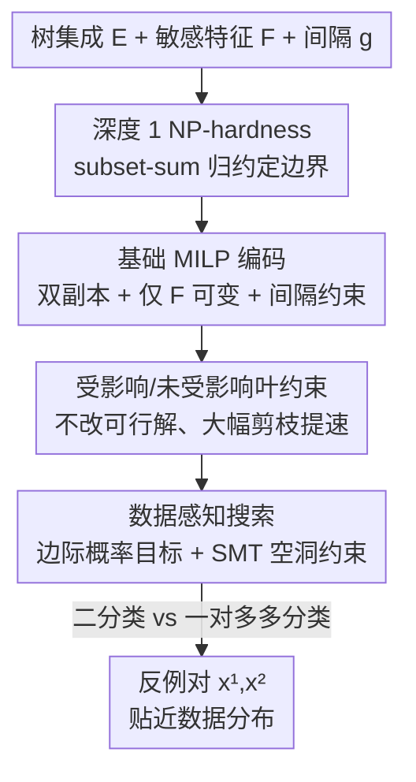

# Data-Aware and Scalable Sensitivity Analysis for Decision Tree Ensembles

**会议**: ICLR 2026  
**OpenReview**: [https://openreview.net/forum?id=q8KqAvdfZK](https://openreview.net/forum?id=q8KqAvdfZK)
**代码**: https://github.com/formal-trust-AI/ensense  
**领域**: 形式化验证 / 学习理论 / 可信机器学习  
**关键词**: 决策树集成, 敏感性验证, MILP 编码, SMT 求解, 数据感知

## 一句话总结
这篇论文研究"决策树集成对某些（如受保护）特征是否敏感"的形式化验证问题，证明了即使深度为 1 的树集成该问题也是 NP-hard，并提出一套带新优化的 MILP/SMT 编码 ENSENSE，不仅把验证速度比此前 SOTA 提升约 5×（二分类）/15×（多分类），还首次让反例对落在训练数据分布附近，从而给出更有意义的敏感性证据。

## 研究背景与动机
**领域现状**：决策树集成（XGBoost、随机森林等）因为简单、强大、相对可解释，被广泛用在银行信贷、医疗、电信等高风险决策场景。为了"信得过"这些模型，过去十年里出现了大量对树集成做安全属性形式化验证的工作，其中一个核心问题就是**特征敏感性（feature sensitivity）**：给定一个特征子集 $F$（比如性别、种族这类受保护属性），是否存在两个输入，它们在 $F$ 之外的所有特征上完全相同、只在 $F$ 上不同，却让模型给出**不同的预测标签**？如果存在这样一对"反例对（counterexample pair）"，就说明模型对 $F$ 敏感，这直接关系到个体公平性与因果歧视。

**现有痛点**：现有方法有两个硬伤。其一，最近的 Ahmad et al. (2025) 用伪布尔（pseudo-Boolean）编码证明了敏感性验证在树深 $\ge 3$ 时 NP-hard，但他们基于 3-SAT 的归约**对深度 1、2 的树失效**，而深度 1 的树（决策桩 decision stump）在很多场景里恰恰是重要对象，复杂度问题悬而未决。其二，也是更致命的：找到的反例对**可能离真实数据分布任意远**。论文用 MNIST 上训练的树集成举例——左边那对反例虽然让标签从 3 翻到 8，但两张图都是毫无意义的噪声团，根本不会出现在训练集里，因此并不能揭示模型真正的弱点；只有右边那种"看起来像真实的 3、却被改 20/786 个像素就误分成 8 且仍贴近数据分布"的反例，才是有用的敏感性证据。

**核心矛盾**：敏感性的定义本身**只依赖训练好的模型、与数据无关**，所以求解器随便找到一个满足约束的反例对就交差，完全不在乎它是否"现实"。要让反例对落在数据附近，就得在搜索里额外注入数据分布信息，而这恰恰是原来高效的伪布尔编码很难承载的——它难以挂上一个"靠近数据"的目标函数。

**本文目标**：分解为三个子问题——(1) 补全复杂度版图，搞清深度 1 时到底难不难；(2) 设计一套既快又能扩展到大规模集成、还能处理多分类的验证编码；(3) 把"数据感知"嵌进搜索，让反例对贴近训练分布。

**切入角度**：作者放弃伪布尔路线，**回到混合整数线性规划（MILP）**。虽然朴素 MILP 编码（源自 Kantchelian et al. 2016）一开始比伪布尔还慢，但 MILP 求解器天生擅长在目标函数引导下搜索，这给"把靠近数据写成目标函数"留出了空间。

**核心 idea**：用"带新优化的 MILP 编码 + 把数据似然写进目标函数/用 SMT 学数据空洞约束"取代伪布尔编码，同时拿下"更快"和"反例更现实"两件事。

## 方法详解

### 整体框架
ENSENSE 接收一个训练好的树集成 $E$、一个敏感特征子集 $F$ 和一个间隔参数 $g$，输出一对反例 $x^{(1)}, x^{(2)}$：它们在 $F$ 之外的特征上完全一致，但模型对二者的预测置信度被拉开到 $E^{prob}_1(x^{(1)})\ge 0.5+g$、$E^{prob}_1(x^{(2)})\le 0.5-g$（即一个高置信正例、一个高置信负例）。整个 pipeline 分两层：底层是把"找这样一对输入"编码成 MILP 约束并用 Gurobi 求解；上层是把"反例要贴近数据"通过两条互补策略注入——一条改 MILP 的目标函数（边际概率乘积），一条用 SMT 求解器预先学出数据中的"空洞"区域并加成约束。

整篇论文的脉络是：先把复杂度边界钉死（深度 1 也 NP-hard），再把朴素 MILP 编码逐步优化到超过原 SOTA，最后给优化后的编码挂上数据感知目标，并把整套机制推广到多分类。

### 关键设计

**1. 深度 1 的 NP-hardness：用 subset-sum 把硬度边界推到极致**

针对"深度 1 时复杂度未知"这个缺口，作者用一个**从 subset-sum（子集和）问题的归约**证明：即便集成里全是深度 1 的决策桩、且只允许变动一个特征（$|F|=1$），敏感性验证依然 NP-hard（定理 3.2）。构造很优雅：给 subset-sum 实例（整数集合 $U$、目标值 $k$），为每个整数 $u_i$ 造一个布尔特征 $f_i$ 和一棵深度 1 的树——$f_i$ 为假输出 0、为真输出 $u_i$；再造一个特征 $f'$ 和一棵树——$f'$ 为假输出 $-k-0.5$、为真输出 $-k+0.5$。于是整个集成 $\{f'\}$-敏感当且仅当存在子集 $U\subseteq U$ 使 $\sum_{l\in U} l = k$。这一结果把敏感性问题的复杂度版图补完整：深度 $\ge 1$ 全是 NP-hard，仅当 $|F\setminus F|$ 有界时深度 1 才能多项式求解。它的意义在于**否定了"用浅树就能逃开计算困难"的幻想**，反过来论证了后续设计高效求解器的必要性。

**2. 基础 MILP 编码：用双副本变量把"两个输入只差 F"写成线性约束**

针对"如何把敏感性这个对两个输入的存在性问题交给求解器"，作者在 Kantchelian et al. (2016) 的单输入 MILP 编码上做双副本扩展。每个内部节点的守卫谓词 $X_f<\tau$ 用二元变量 $p_{fk}$ 表示，叶子用连续变量 $0\le l_n\le 1$ 表示。同一特征的谓词要满足单调一致性 $p_{f1}\le p_{f2}\le\cdots\le p_{fK_f}$（因为 $\tau_1<\tau_2$ 时 $X_f<\tau_1$ 蕴含 $X_f<\tau_2$）；每棵树恰好一个叶子被激活 $\sum_n l_n=1$，且叶子激活要和路径上的谓词取值一致（式 4、5）。为了表达"两个输入"，作者把所有变量复制成上标 $(1),(2)$ 两份，并加上**只在 $F$ 上可不同**的约束：对所有守卫不含 $F$ 特征的谓词，强制 $p^{(1)}_{fk}=p^{(2)}_{fk}$。最后把置信度间隔转成对原始输出的线性约束——令 $\delta=\text{SIGMOID}^{-1}(0.5+g)$，利用 sigmoid 关于 0.5 的对称性得到 $\sum_n l^{(1)}_n\, n.val\ge\delta$ 且 $\sum_n l^{(2)}_n\, n.val\le-\delta$。任何可行解都对应一对合法反例。这一步本身只是把问题"翻译"成 MILP，性能甚至不如伪布尔，真正的加速来自下面的优化。

**3. 受影响/未受影响叶约束：识别"敏感特征够不到的叶子"来大幅剪枝**

针对"朴素 MILP 太慢"，作者观察到一个结构性事实：**敏感特征往往只影响一小部分叶子**。把一片叶子从根到它的路径上所有守卫称为它的 ancestry；如果 ancestry 里没有任何守卫涉及可变特征 $F$，这片叶子就叫"未受影响（unaffected）"。对每片未受影响的叶子，两份副本必然走到同一个叶子，于是直接加约束 $l^{(1)}_n=l^{(2)}_n$（式 UnAff）。实践中绝大多数叶子都属于这一类，显式加上这条能让求解器快速收敛。更进一步，把两条间隔约束（式 Gap-bin）相减、再用 UnAff 消掉未受影响叶子的项，得到一条**只涉及"受影响"叶子、项数大大减少**的等价约束 $\sum_{l_n\notin U}(l^{(1)}_n\,n.val - l^{(2)}_n\,n.val)\ge 2\delta$（式 Aff-bin）。关键是定理 5.1 证明：加上 UnAff 和 Aff-bin **不改变可行解集合**，纯粹是加速。这是 ENSENSE 反超伪布尔的核心引擎。此外，作者还把"两个输出要不同"这件事的差值直接写成 MILP 的最大化目标 $\text{MAX}\sum_n(l^{(1)}_n\,n.val - l^{(2)}_n\,n.val)$（式 Obj-bin），让求解器在 simplex 过程面对多个候选边时有方向可循，而不是任意乱选——尽管我们只要一个可行解，给个"对的方向"也能显著提速。

**4. 数据感知搜索：边际概率目标 + SMT 学数据空洞，让反例落在分布里**

针对"反例离数据太远没意义"，作者把"贴近数据"形式化为效用函数 $u(x^{(1)},x^{(2)})$（定义 4.1），并给出两条互补策略。**其一是边际概率乘积目标（Prob）**：假设特征独立，对每个特征 $f$，用训练集落在相邻阈值区间 $[\tau_{f(k-1)},\tau_{fk})$ 的点数占比估计边际概率 $\pi_f$，再令 $\pi(x)=\prod_f\pi_f(x_f)$，效用 $u(x^{(1)},x^{(2)})=\pi(x^{(1)})\cdot\pi(x^{(2)})$。由于 MILP 只能处理加性目标，作者取对数把乘积转成和，得到式 (7) 的目标 $\text{MAX}\sum_{f}\sum_k(\log\pi_f(\tau_{f(k-1)})-\log\pi_f(\tau_{fk}))(p^{(1)}_{fk}+p^{(2)}_{fk})$，并用引理 5.2 证明它确实在最大化 $u$。**其二是子句摘要（Clause）**：当特征高度相关时独立假设失效，于是改用 SMT 求解器（z3）从数据里学出"空洞（cavity）"——输入空间里没有任何训练点的盒状区域。对每个数据点要求它不落进某个由特征边界 $lb_i,ub_i$ 围成的盒子里（式 1 的否定是一个可被约束求解器处理的子句），再配一个最小化目标学出尽量紧的盒子，迭代地一次学一个子句、把已学子句加进约束以排除重复。这些子句相当于一份"数据在输入空间怎么分布"的摘要，强制反例搜索绕开空数据区。两条策略合起来就是 ENSENSE 用的 **Probclause**。

### 损失函数 / 训练策略
本文不训练神经网络，无传统损失函数。求解端的"目标函数"已在关键设计 3、4 中给出：基础版最大化两输出差（式 Obj-bin），数据感知版替换为对数边际概率之和（式 7）；SMT 端用最小化子句宽度的目标学紧致空洞。多分类的推广只需改 Gap-bin、Aff-bin、Obj-bin 三条约束——把树集成按类划成 $C$ 份一对多分类器，输出 $E^{prob}_c(x)=\text{SOFTMAX}_c(E^{raw}_0,\dots,E^{raw}_{C-1})$，并要求最可能类与次可能类的概率差足够大（定义 6.1）。

## 实验关键数据

实现用 XGBoost v1.7.1 训练模型，Gurobi 作 MILP 求解器，z3 学子句，单 CPU 核、每实例超时 3600 秒。基准覆盖 18 个数据集、36 个树集成，规模可达 800 棵树、深度 8。

### 主实验

| 设置 | 对比对象 | 平均加速 | 超时情况 |
|------|---------|---------|---------|
| 二分类（1103 个 ≥1s 实例） | KANT（朴素 MILP） | ≈8× | KANT 超时 153，ENSENSE 0 |
| 二分类 | SENSPB（伪布尔，2025 SOTA） | ≈5× | SENSPB 超时 205，ENSENSE 0 |
| 多分类（521 个 ≥1s 实例） | KANT | ≈15× | KANT 超时 256，ENSENSE 0 |

多分类还对比了把鲁棒性验证工具 VERITAS 改造来解敏感性，结果它**除 2 个实例外全部超时**，说明敏感性（对两个输入的全称量化）确实比局部鲁棒性更难。

### 数据感知质量对比

衡量指标是反例区域到数据的 $\ell_2$ 距离（在不敏感特征上），距离越小越贴近数据。这里特意用"反例区域"而非单点：树集成把空间切成轴对齐多胞形，同一多胞形内输出不变，若最近数据点就在同一区域则正确距离应为 0。

| 方法 | 平均 $\ell_2$ 距离 | vs 基线胜率 |
|------|-----------------|-----------|
| None（无数据感知，基线） | 0.57 | — |
| Prob（边际概率目标） | 0.26 | 76.7%（败 22.1%，平 1.2%） |
| Clause（子句摘要） | 0.306 | 80.6%（败 16.1%，平 3.3%） |
| Probclause（两者结合，ENSENSE） | 0.17 | 86.0%（败 12.1%，平 1.1%） |

### 关键发现
- **两条数据感知策略互补且可叠加**：Prob 在特征近似独立时有效，Clause 在特征高度相关时补位，合起来的 Probclause 平均距离最低（0.17，比基线 0.57 降近 70%），且对基线胜率最高（86%），胜时平均优势 0.47、败时仅落后 0.06。
- **结构优化（受影响/未受影响叶约束）是提速主力**：把朴素 MILP 从"慢于伪布尔"拉到"快 5×"靠的就是定理 5.1 保证的剪枝，而非求解器本身。
- **多分类提速更猛（15×）**：因为一对多结构里大量叶子对单个敏感特征"未受影响"，剪枝收益更大；这也是首个能处理多分类树集成敏感性的工具。

## 亮点与洞察
- **把"不改变可行解"的优化和"改变搜索方向"的目标函数分开用**：UnAff/Aff-bin 是严格等价的剪枝（定理 5.1 背书），Obj-bin 是给求解器指方向的启发——明确区分"哪些是逻辑等价、哪些是引导"，让加速既安全又有效，这种拆分思路可迁移到任何"只要一个可行解但想更快"的 MILP/SAT 问题。
- **用 SMT 学"数据空洞"是个反直觉但聪明的招**：大多数数据感知方法是去拟合"数据在哪"，这里反过来学"数据不在哪"（cavity），其否定天然是约束求解器爱吃的子句形式，正好嵌进搜索去剪掉不现实的反例。
- **复杂度结果服务于工程动机**：深度 1 也 NP-hard 这个定理不是为证而证，它直接否掉"用浅树规避计算困难"的偷懒路线，反衬出做高效求解器的价值——理论和系统在同一篇里互相支撑。
- **"反例区域"而非"反例点"的距离度量**很值得借鉴：在分段常值模型上，用单点距离会把"其实落在同一决策区域"的情形误判为非零距离，改用区域距离更诚实。

## 局限与展望
- **只做"识别"不做"修复"**：作者明确说本文只解决找到敏感反例对，retraining/加固模型留作未来工作；类比鲁棒性领域已有大量"训练出鲁棒树"的工具，敏感性方向还缺"训练出低敏感树"的方法。
- **从"找点"到"量化区域"仍未解决**：当前给的是一对反例，未来希望能量化整个输入空间里敏感区域的大小/比例，这才是更完整的可信度刻画。
- **边际概率策略依赖特征独立假设**：作者自己承认在高特征相关数据上 Prob 效果会退化，所以才补 Clause；但 Clause 受限于学到的盒状空洞数量（实验里限 1500 个子句、每子句最多 3 个文字），对复杂分布的刻画能力有上限。
- **可扩展性虽强但仍受 MILP 求解器制约**：800 棵树深度 8 已是上界附近，更大规模或更高维（如全 784 像素而非 100 个高频特征）时多分类被迫降采样特征，说明完整高维敏感性仍吃力。

## 相关工作与启发
- **vs SENSPB (Ahmad et al. 2025)**：同样做树集成敏感性验证，但他们用伪布尔编码、只证了深度 $\ge 3$ NP-hard、只支持二分类、且难挂数据感知目标。本文用 MILP 取而代之，补全深度 1 的硬度、首次支持多分类、并把数据感知写进目标函数，速度还快 5×（二分类）。
- **vs Kantchelian et al. (2016)**：本文的基础 MILP 编码直接源自它（原本是为局部鲁棒性设计），但作者指出朴素照搬反而慢于伪布尔，真正贡献是受影响/未受影响叶约束等新优化把它救活并反超。
- **vs 局部鲁棒性验证（VERITAS, Devos et al. 2021/2024 等）**：鲁棒性是给定一个输入找对抗扰动，敏感性是对两个输入做全称量化，后者更难——实验里把 VERITAS 改造去解敏感性几乎全超时。鲁棒性里"已知一个输入"带来的简化优化在敏感性里用不上，这是两类问题的本质区别。

<!-- RELATED:START -->

## 相关论文

- [\[ICLR 2026\] High-dimensional Analysis of Synthetic Data Selection](high-dimensional_analysis_of_synthetic_data_selection.md)
- [\[ICLR 2026\] On Coreset for LASSO Regression Problem with Sensitivity Sampling](on_coreset_for_lasso_regression_problem_with_sensitivity_sampling.md)
- [\[ICLR 2026\] Robustness of Probabilistic Models to Low-Quality Data: A Multi-Perspective Analysis](robustness_of_probabilistic_models_to_low-quality_data_a_multi-perspective_analy.md)
- [\[ICLR 2026\] Online Decision-Focused Learning](online_decision-focused_learning.md)
- [\[ICLR 2026\] Conformalized Decision Risk Assessment](conformalized_decision_risk_assessment.md)

<!-- RELATED:END -->
