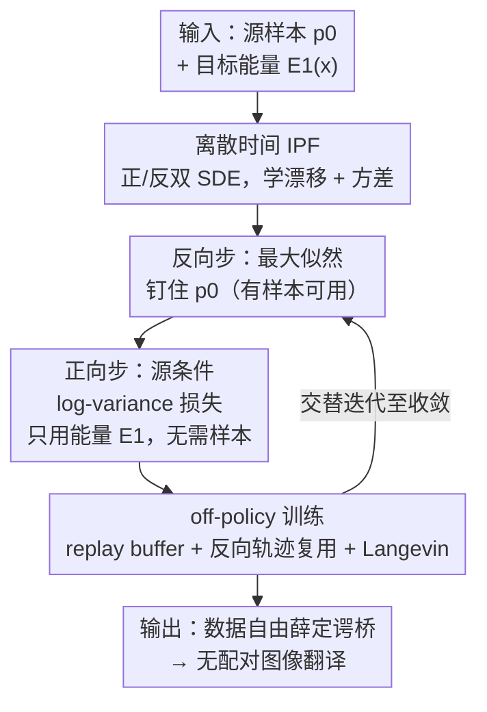

# Data-to-Energy Stochastic Dynamics

**会议**: ICLR2026  
**OpenReview**: [https://openreview.net/forum?id=S1JJyWg1VG](https://openreview.net/forum?id=S1JJyWg1VG)  
**代码**: [mmacosha/d2e-stochastic-dynamics](https://github.com/mmacosha/d2e-stochastic-dynamics)  
**领域**: 概率方法 / 生成建模 / 随机最优传输  
**关键词**: 薛定谔桥, 迭代比例拟合, 扩散采样器, off-policy 强化学习, 数据自由

## 一句话总结
本文提出第一个"数据到能量"（data-to-energy）的薛定谔桥求解算法：当目标分布只给出未归一化密度（能量函数）、拿不到任何样本时，把经典的迭代比例拟合（IPF）推广到无数据情形——用扩散采样器里的 off-policy 强化学习损失（log-variance loss）替换掉原本需要样本的最大似然步，从而在两个分布之间学出最优随机动力学，并落地为一种"无需配对数据的图像到图像翻译"方法。

## 研究背景与动机
**领域现状**：扩散模型和 flow matching 是当前高保真生成的两大主流范式，它们本质上都是"在两个分布之间学一条随机动力学轨迹"的特例。把这件事一般化，就是薛定谔桥（Schrödinger bridge, SB）问题：在所有能把分布 $p_0$ 输运到 $p_1$ 的随机过程里，找一条与参考过程 $\mathbb{Q}_t$（通常是 Wiener / OU 过程）KL 散度最小的桥。SB 是带熵正则的最优传输的动力学版本，求解它的经典工具是迭代比例拟合（IPF）：维护一对正向/反向时间的过程，交替求解"半桥"问题，收敛时两个过程互为时间反演，即为 SB 的解。

**现有痛点**：所有现存的 IPF 变体（DSB、DSBM、SF²M 等）都有一个硬性前提——**必须能从 $p_0$ 和 $p_1$ 两端都采到样本**。IPF 的偶数步（把过程钉在 $p_1$ 上）是通过"从 $p_1$ 采样、反向 rollout 轨迹、最大化轨迹似然"实现的，没有 $p_1$ 的样本这一步就做不了。

**核心矛盾**：但在很多自然科学和贝叶斯推断场景里，目标分布只以**未归一化密度**给出：$p(x) = e^{-\mathcal{E}(x)}/Z$，其中能量 $\mathcal{E}$ 可查询，但配分函数 $Z$ 未知、也没有任何现成样本。需要样本的 IPF 在这里完全失效。

**切入角度**：作者注意到，另一条平行的研究线——"扩散采样器"（diffusion sampler，专门学从未归一化密度里采样）——已经发展出一整套**不需要样本、只靠能量函数**的训练损失（off-policy RL 损失，如 log-variance / VarGrad loss）。如果能把 IPF 中"需要 $p_1$ 样本"的那一步，换成扩散采样器那套"只需能量"的损失，IPF 就能在数据自由情形下跑起来。

**核心 idea**：把 IPF 的最大似然步替换为一个**源条件版的 log-variance 损失**，用 off-policy RL 的方式训练正向过程，从而得到第一个通用的 data-to-energy（乃至 energy-to-energy）薛定谔桥算法；顺带还发现：把这套时间离散化框架用回有数据的情形，**额外学习扩散系数**（而不只是漂移项）能显著改善已有 IPF 算法。

## 方法详解

### 整体框架
方法建立在离散时间的 IPF 之上。先把参考 SDE 用 Euler-Maruyama 在 $K$ 步上离散化（步长 $\Delta t = 1/K$），得到正向过程 $\overrightarrow{p}_\theta$ 和反向过程 $\overleftarrow{p}_\varphi$ 两条离散马尔可夫链，各自的转移核是高斯：

$$\overrightarrow{p}_\theta(x_{(k+1)\Delta t}\mid x_{k\Delta t}) = \mathcal{N}\big(x_{k\Delta t} + \overrightarrow{F}_\theta(x_{k\Delta t}, k\Delta t)\Delta t,\ \sigma^2_{k\Delta t}\Delta t\big)$$

IPF 就是交替优化这两条链：**反向步**把过程钉在 $p_0$ 上（训 $\varphi$），**正向步**把过程钉在 $p_1$ 上（训 $\theta$），收敛时两者互为时间反演即解出 SB。

经典 data-to-data IPF 里，两步都用最大似然：从一端采样、rollout 轨迹、在反方向上最大化轨迹对数似然。本文的关键转折在于：当 $p_1$ 只给能量 $\mathcal{E}_1$ 时，正向步无法采样 $p_1$，于是把它换成一个只依赖能量的方差型损失；同时为了让这个数据自由的损失在高维下真正学得动，引入一整套 off-policy 训练技巧（replay buffer、反向轨迹复用、Langevin 修正）。整个 pipeline 如下：

### 关键设计

**1. 源条件 log-variance 损失：把"需要样本"的 IPF 步替换为"只需能量"**

这是全文的核心。IPF 正向步要求强制比例关系 $\overrightarrow{p}_\theta(\tau\mid x_0) \propto \overleftarrow{p}_\varphi(\tau\mid x_1)\, p_1(x_1)$ 对每条从 $x_0$ 出发的轨迹 $\tau$ 成立——但有了 $p_1(x_1)=e^{-\mathcal{E}_1(x_1)}/Z$ 就够了，因为可以构造一个**对 $Z$ 不敏感**的损失。作者借用扩散采样器里的 log-variance（VarGrad）损失，定义其源条件变体：

$$\mathcal{L}_{\mathrm{LV}}(x_0, \theta) = \mathrm{Var}\left(\sum_{k=1}^{K}\log\frac{\overrightarrow{p}_\theta(x_{k\Delta t}\mid x_{(k-1)\Delta t})}{\overleftarrow{p}_\varphi(x_{(k-1)\Delta t}\mid x_{k\Delta t})} + \mathcal{E}_1(x_1)\right)$$

方差对一批共享同一 $x_0$ 的轨迹来取。妙处在于：**未知的归一化常数 $Z$ 是个常数，对方差没有任何影响**，于是 $Z$ 被自动消掉；而且也不需要知道被学过程在 $t=0$ 处的边际密度。再把该损失对 $x_0 \sim p_0^{\mathrm{train}}$ 求平均，就得到正向 IPF 步的完整目标。这一替换把"必须采样 $p_1$"的硬约束彻底拆掉，使 IPF 第一次能在数据自由情形下运转。

值得注意它与扩散采样器场景的差别：在标准扩散采样器里，被学过程在 $t=0$ 的密度恰好是 $p_0$，可以把 $p_0(x_0)$ 放进损失分子、对 $x_0$ 和 $\tau$ 同时取方差；但在 SB 里，只有 IPF 收敛后 $t=0$ 边际才等于 $p_0$，所以这里只能对 $\tau$ 取方差、再对 $x_0$ 外层平均。作者也指出可以改用 trajectory balance（TB）型损失去拟合 $x_0$ 处密度，是一条备选路线。

**2. off-policy 训练三件套：让数据自由损失在高维下真正学得动**

光有损失不够——朴素的 on-policy 选择（$p^{\mathrm{train}}_0 = p_0$、轨迹直接从 $\overrightarrow{p}_\theta$ 采）在高维复杂分布上会失败，因为采样器没探索到的模式几乎永远不会被发现。作者把扩散采样文献里的探索技巧成套搬过来，把训练变成一个 off-policy 强化学习过程：

- **Replay buffer**：缓存正向过程产出的终点样本 $x_1$。训练时从 buffer 采一个 $x_1$，再反向 rollout 得到 $\tilde{x}_0 \sim \overleftarrow{p}_\varphi(\cdot\mid x_1)$ 作为训练起点。随着模型变好，buffer 会逐渐积累 $p_1$ 下高概率的样本，把采样器引向目标分布的高密度区，并保留已发现模式的记忆。
- **反向轨迹复用**：对每个 $x_0$，把"产生它的那条反向轨迹"和 $N-1$ 条 on-policy 正向轨迹拼成一批共享起点的 $N$ 条轨迹（实验固定 $N=2$）。复用反向轨迹让算法能在那些已经触达 $p_1$ 高密度区的轨迹上学习，但纯用反向轨迹又会损害探索，因此需要在探索/利用间权衡。
- **Langevin 修正**：周期性地用几步未调整 Langevin 在密度 $p_1$ 上更新 buffer 样本，纠正采样器对目标的拟合偏差。

最终训练策略是把 on-policy 与"Langevin 更新过的 buffer + 反向轨迹复用"按一个 **off-policy ratio**（多数实验取 0.8，也尝试退火）混合。消融（见下文 Table 3）显示这套组合主要改善 Path KL，让学到的桥更接近最优。

**3. 可学习扩散系数：把数据自由框架反哺有数据的 IPF**

大多数已有工作只训练漂移项 $\overrightarrow{F}_\theta, \overleftarrow{F}_\varphi$，把扩散系数 $\sigma_{k\Delta t}$ 固定。本文受扩散采样器结果启发，提议把式中的方差 $\sigma^2_{k\Delta t}$ 也换成可学函数 $\overrightarrow{\sigma}^2_\theta(x_k, k\Delta t)$、$\overleftarrow{\sigma}^2_\varphi(x_k, k\Delta t)$，让优化同时作用于漂移和扩散系数。动机很具体：时间离散化会引入误差，离散过程未必对应一个一致的连续时间过程，而**学习方差正好能补偿这种离散化误差**——尤其在离散步数 $K$ 较小时收益明显。这是一个"副产物"贡献：它不依赖 data-to-energy 设定，把它用回有数据的 data-to-data IPF，也能让已有算法更准（Table 1 验证）。

**4. 外包采样（outsourced sampling）：把 data-to-energy SB 落地为无配对图像翻译**

最后把算法应用到生成模型潜空间里的贝叶斯后验采样。给定后验 $p(x\mid y)\propto p(x)\,r(x,y)$（$p(x)$ 是图像先验，$r$ 是类别似然/文本匹配等约束），若预训练生成器是噪声变量 $z$ 的确定函数 $f$，则可把采样问题拉回到噪声空间：后验 $p(z\mid y)\propto p(z)\,r(f(z), y)$。本文不像 Venkatraman 等人那样用扩散采样器，而是**在 $p(z)$ 与 $p(z\mid y)$ 之间建一条薛定谔桥**——由于后者既无归一化常数也无样本，正好用 §3.1 的 data-to-energy 算法求解。建桥而非单纯采样的好处是：它把先验样本输运到**潜空间里邻近的**后验样本，从而保留 $y$ 没约束到的语义内容（背景、全局结构），天然得到一个保风格的、无需配对数据的图像到图像翻译方法。

### 损失函数 / 训练策略
完整 data-to-energy IPF（Algorithm 2）交替执行：反向步用最大似然目标 (6a) 把 $\varphi$ 训到收敛（用 $p_0$ 样本 + $\overrightarrow{p}_\theta$ 正向轨迹）；正向步用方差损失 (8) 把 $\theta$ 训到收敛（用上面的 off-policy 轨迹），并在反向步过程中持续往 buffer 写入终点样本 $x_1$。跨 IPF 步复用模型权重和 buffer 状态（外包实验中会随机重置一部分 buffer 样本）。energy-to-energy 推广只需两端都用方差损失 (7)、各维护一个 buffer。2D 实验用参考过程 $\mathrm{d}X_t=\sqrt{2}\,\mathrm{d}W_t$，正反过程各训 4000 步、共 20 个 IPF 步、$K=20$ 离散步。评估用三个指标：ELBO、path KL、以及到 oracle 目标样本的 Wasserstein 距离（既测约束满足、又测与参考过程的偏离）。

## 实验关键数据

### 主实验
在 2D 合成基准（Gauss↔GMM、Gauss↔Two Moons、Two Moons↔GMM）上比较 data-to-data IPF 各方法，$K=20$。重点是验证"学习方差"的收益：

| 配置 | Gauss↔GMM $W_2^2$↓ | Two Moons↔GMM $W_2^2$↓ | Gauss↔Two Moons $W_2^2$↓ |
|--------|------|------|------|
| DSB score (De Bortoli 2021) | 0.052 | 0.066 | 0.171 |
| SDE (Chen 2021b) | 0.037 | 0.025 | 0.033 |
| LL fixed var.（≈Vargas 2021） | 0.037 | 0.031 | 0.033 |
| **LL learnt var.（本文）** | 0.042 | **0.023** | **0.022** |

可学方差在 Two Moons 相关的两组上取得最优 $W_2^2$；图 2 进一步显示**离散步数越少，学方差的优势越明显**——正契合"补偿离散化误差"的动机。data-to-energy 版本在 Gauss↔GMM 上与能看到样本的 data-to-data 版本表现相当（Table 4），证明数据自由训练可行；energy-to-energy 也给出可行的初步结果。

外包采样（CIFAR-10，GAN 先验 + 分类器 reward）的 FID：

| 方法 | Car (SN-GAN) | Dog (SN-GAN) | Truck (StyleGAN) |
|------|------|------|------|
| Same class（同类真实图） | 10.4 | 15.0 | 9.3 |
| Rejection sampling（真后验） | 31.3 | 43.7 | 76.4 |
| Diffusion sampler | 83.9 | 60.5 | — |
| **Outsourced SB（本文）** | **22.3** | **37.3** | **55.3** |

本文 SB **显著优于扩散采样器**，FID 甚至常低于拒绝采样得到的"真后验样本"——因为 SB 把先验图像输运到邻近后验，保留背景/全局结构，本身已属目标类的图几乎不变。

### 消融实验
off-policy 技巧在 SN-GAN 外包采样（学单类 dog）上的消融（Table 3）：

| 配置 | Path KL↓ | mean log-reward↑ | 说明 |
|------|---------|------|------|
| on-policy | 1506.4 | −0.233 | 朴素基线 |
| + buffer | 622.9 | −0.125 | replay buffer |
| + Langevin | 383.5 | −0.286 | Langevin 修正 buffer |
| + 反向轨迹复用 | **206.1** | −0.657 | Path KL 最优 |
| + 退火 off-policy ratio | 244.3 | −0.149 | 平衡模式与代价 |

### 关键发现
- **反向轨迹复用对 Path KL 贡献最大**（1506→206），但会拉低 mean log-reward——作者推测它**抑制了模式坍塌**，因此在"低传输代价"和"覆盖模式"之间存在张力，需要靠调小或退火 off-policy ratio 来平衡。
- **学习扩散系数在小离散步数下收益最大**，离散步数大时与固定方差趋同，印证其作用是补偿离散化误差而非改变连续极限。
- 在 Gauss↔Gauss 这种有解析解的设定（Table/Fig 5）上，本文算法在每个时间步的 $W_2$ 距离都贴近解析 SB，验证了正确性。

## 亮点与洞察
- **用"方差损失对常数不敏感"这一性质消掉未知配分函数 $Z$**：这是把 IPF 推到数据自由情形的钥匙，思路干净——不需要估 $Z$、不需要 $t=0$ 边际，只要能量可查询即可。这个 trick 可迁移到任何"目标只给未归一化密度"的桥/传输问题。
- **打通了"薛定谔桥"和"扩散采样器"两条研究线**：把 off-policy RL 的探索机制（buffer / Langevin / 轨迹复用）整套嫁接到 IPF 上，相当于给经典 IPF 装上了高维可扩展的引擎。
- **"建桥优于建采样器"的实证洞察**：在潜空间做 SB 而非纯采样，能保留无关语义、得到保风格翻译，FID 甚至低于真后验样本——提示这类方法在高维图像风格迁移上有潜力。
- **可学习扩散系数是一个能独立使用的小贡献**：即便不碰 data-to-energy，把它加进任何离散时间 IPF 都能补偿离散化误差、提升精度。

## 局限与展望
- **维度仍偏低、先验受限**：合成实验是 2D，图像实验跑在 GAN/VAE 的低维潜空间（128/512 维）且先验固定为高斯；作者明确把"扩展到更高维、任意先验分布"列为未来工作。
- **模式坍塌倾向**：训练出的采样器容易模式坍塌，消融也显示提升传输代价与覆盖模式相互掣肘，需要更强的模式覆盖技巧。
- **每个条件训一个模型**：当前对每个类别/约束都要单独训一条桥，作者建议未来在条件分布上做摊销（amortize）以提升实用性。
- **off-policy 超参敏感**：off-policy ratio、$N$、Langevin 频率等需要细调才能平衡探索与利用，这部分鲁棒性尚未充分验证。
- 与"直接联合优化 $\theta,\varphi$ 的 bridge sampling"路线（Blessing 等）的系统比较留作未来工作——后者不一定解出 SB（未最小化到参考过程的 KL），本文的 IPF 路线在这点上更"正"，但缺乏正面实证对比。

## 相关工作与启发
- **vs 经典 IPF / DSB / DSBM（De Bortoli 2021, Shi 2023）**：它们用最大似然、两端都需样本；本文把正向步换成只需能量的方差损失，首次支持 data-to-energy 与 energy-to-energy，并额外学方差补偿离散化误差。
- **vs 扩散采样器（Sendera 2024, Richter 2020, Gritsaev 2025）**：扩散采样器只学"从能量采样"（单边），本文把它的 off-policy 损失和探索技巧搬进 IPF 的双边桥框架，并指出关键差别——SB 中 $t=0$ 边际只有收敛后才等于 $p_0$，故方差只能对 $\tau$ 取、对 $x_0$ 外层平均。
- **vs 外包扩散采样（Venkatraman 2025）**：他们用扩散采样器在潜空间采后验；本文改成建一条 SB，从而把先验样本输运到邻近后验、保留无关语义，得到数据自由的图像翻译。
- **vs bridge sampling（Blessing 2025a/b, Gritsaev 2025）**：那类方法联合优化、用 VarGrad/TB 约束端点比例，但不保证最小化到参考过程的 KL，故得到的桥未必是 SB 解；本文坚持 IPF 路线以求真正的 SB 解。

## 评分
- 新颖性: ⭐⭐⭐⭐⭐ 首个数据自由的薛定谔桥求解器，"方差消 $Z$" + IPF×off-policy RL 的嫁接思路漂亮且填补空白。
- 实验充分度: ⭐⭐⭐⭐ 合成基准 + 解析解验证 + GAN/VAE 潜空间应用 + 完整消融齐全，但维度偏低、缺与 bridge sampling 的正面对比。
- 写作质量: ⭐⭐⭐⭐ 推导清晰、动机层层递进，公式较密，对非该子领域读者门槛偏高。
- 价值: ⭐⭐⭐⭐ 把 SB 推广到"只有能量"的广阔场景（自然科学、贝叶斯推断、无配对图像翻译），方法论可迁移性强。

<!-- RELATED:START -->

## 相关论文

- [\[ICLR 2026\] Pseudo-Non-Linear Data Augmentation: A Constrained Energy Minimization Viewpoint](pseudo-non-linear_data_augmentation_a_constrained_energy_minimization_viewpoint.md)
- [\[ICLR 2026\] Improved High-Dimensional Estimation with Langevin Dynamics and Stochastic Weight Averaging](improved_high-dimensional_estimation_with_langevin_dynamics_and_stochastic_weigh.md)
- [\[ICLR 2026\] Theoretical Analysis of Contrastive Learning under Imbalanced Data: From Training Dynamics to a Pruning Solution](theoretical_analysis_of_contrastive_learning_under_imbalanced_data_from_training.md)
- [\[ICLR 2026\] Fast Escape, Slow Convergence: Learning Dynamics of Phase Retrieval under Power-Law Data](fast_escape_slow_convergence_learning_dynamics_of_phase_retrieval_under_power-la.md)
- [\[ICLR 2026\] Lipschitz Bandits with Stochastic Delayed Feedback](lipschitz_bandits_with_stochastic_delayed_feedback.md)

<!-- RELATED:END -->
