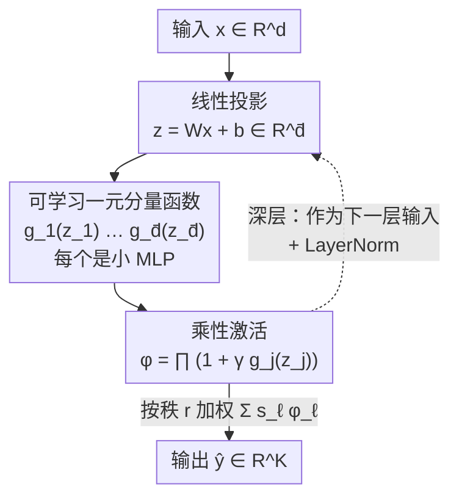

# Deep Learning with Learnable Product-Structured Activations

**会议**: ICLR2026  
**OpenReview**: [https://openreview.net/forum?id=EB2Qgp5Vb0](https://openreview.net/forum?id=EB2Qgp5Vb0)  
**代码**: https://github.com/dacelab/lrnn  
**领域**: 神经网络架构 / 表示学习 / 学习理论  
**关键词**: 可学习激活函数, 低秩分离, 乘性交互, 隐式神经表示, 谱偏置

## 一句话总结
本文提出 LRNN（deep low-rank separated neural networks），把每个神经元的激活从"固定的标量非线性"换成"若干可学习一元函数的乘积"，让神经元天然捕捉高阶乘性交互、并能自适应调节谱偏置，从而在图像/音频/PDE/稀疏视角 CT 等表示任务上用更少参数刷新精度。

## 研究背景与动机
**领域现状**：现代神经网络几乎都建立在 ReLU、Tanh、Sigmoid 这类**固定**激活函数之上，表达能力靠"堆深度"获得。为了表示高保真连续信号（图像、3D 形状、PDE 解），隐式神经表示（INR）这条线发展出一批精心设计的激活——SIREN 的正弦、Gaussian、WIRE 的小波、SPDER 的半周期阻尼、HOSC、sinc、FINER 等，每一种都针对某类信号特性（周期性、多尺度）手工定制。

**现有痛点**：固定激活有两个根本短板。其一是**谱偏置**——ReLU 之类的激活很难表示信号里的高频细节（Rahaman 等指出的现象）；为不同信号挑/设计合适的激活基本靠人工先验。其二是**加性合成**——标准神经元把特征线性加权后过一个标量非线性，本质上是"加法式"组合，要表达变量之间的**乘性交互**（如 $x_1 x_2$ 这类项）非常低效，只能靠深度硬凑。最近的 KAN 把可学习激活放到边上、表达力更强，但训练慢、网格变大时优化不稳。

**核心矛盾**：既想要**高表达力 + 自适应非线性**（不靠人手设计激活），又想要**计算高效 + 优化稳定**——固定激活满足后者牺牲前者，KAN 改善前者却恶化后者。

**本文目标**：设计一种新的神经元/网络架构，让每个神经元能**自己学**一个高度灵活、数据依赖的激活函数，同时把乘性交互内建进结构里，且保持可训练性。

**切入角度**：作者借用了**连续低秩分离表示**（separated rank decomposition, SRD）的思想——把多元函数近似成"若干一元基函数乘积之和" $\hat y(x)=\sum_{i=1}^r s_i\prod_{j=1}^d g_{i,j}(x_j)$。这正是张量 CP 分解的连续版。把它从"近似一个固定函数"提升到"深度学习的可学习层"，乘积结构天然就编码了乘性交互。

**核心 idea**：用"可学习一元函数的乘积" $\prod_j(1+\gamma g_j(z_j))$ 替换神经元里"固定标量激活" $\sigma(\cdot)$，让每个神经元学出自己的向量→标量乘性激活，把 SRD/CP 分解推广成可堆叠的深度网络。

## 方法详解

### 整体框架
LRNN 是 MLP 的严格推广。输入 $x\in\mathbb R^d$，输出 $K$ 维的回归目标或类别。标准 MLP 的浅层写成 $y_{\text{mlp}}(x)=\sum_{\ell=1}^r v_\ell\,\sigma(w_\ell^\top x+b_\ell)$——每个神经元把输入投影成一个**标量** $z_\ell$ 再过**共享的固定**激活 $\sigma$。LRNN 把这一步换成：先把输入投影成一个 $\bar d$ 维向量 $z^\ell=W^\ell x+b^\ell$，再让 $\bar d$ 个**各自可学习**的一元函数 $g_j^\ell$ 作用后**连乘**，得到一个标量激活，最后按秩 $r$ 加权求和。深层 LRNN 则把这种"投影 + 乘性激活"的层 $\varphi^{(k)}$ 一层层堆起来（$x^{(0)}\!\to\!x^{(1)}\!\to\cdots\to\!\hat y$），并在每层乘性计算后加 LayerNorm 稳定训练。

下图给出单个 LRNN 神经元（浅层）的数据流——它把 MLP 的"标量激活"撑成"向量进、乘积出"：

### 关键设计

**1. 乘性结构激活：把"加法神经元"换成"乘积神经元"**

这是全文的根基，直接针对"加性合成难表达乘性交互"这个痛点。浅层 LRNN 写成

$$\hat y_{\text{lrnn}}(x)=\sum_{\ell=1}^r s_\ell\prod_{j=1}^{\bar d}\bigl(1+\gamma\,g_j^\ell(z_j^\ell)\bigr),\qquad z^\ell=W^\ell x+b^\ell,$$

其中 $r$ 是分离秩（控制表达力），$\bar d$ 是投影维度，$s_\ell\in\mathbb R^K$ 是输出权重，$g_j^\ell:\mathbb R\to\mathbb R$ 是一元分量函数。关键在那个**连乘** $\prod_j$：展开后会自然产生 $g_1g_2$、$g_1g_2g_3$ 这类交叉项，等于把高阶乘性交互"免费"编码进了单个神经元的激活里，而标准神经元要表达同样的交互得靠多层叠加。这也让 LRNN 成为 CP/SRD 分解的推广——若令 $K=1$、投影取恒等、并把 $(1+\gamma g_j)$ 换回 $g_j$，就退化回 Beylkin 等的 SRD 模型；若令 $\bar d=1$ 且把 $g_j$ 换成固定激活，就退化回普通浅层 MLP。和同样做向量→标量映射的 Maxout 不同，LRNN 用的是"乘积"而非"取最大"。

**2. 可学习一元分量函数：每个神经元学自己的激活**

痛点是固定激活靠人手挑、谱偏置写死。LRNN 让每个一元分量 $g_j^\ell$ 都是一个**小 MLP**，其参数和输出权重 $s_\ell$ 一起端到端训练。于是每个 LRNN 神经元的等效激活 $\varphi_\ell(z^\ell)=\prod_j(1+\gamma g_j^\ell(z_j^\ell))$ 都是一条**数据依赖、各自不同**的灵活非线性曲线——而 MLP 里所有神经元共用同一个 $\sigma$。这些内嵌小 MLP 仍然用标准标量激活：做 INR 任务时用 SIREN 的 $\sin(x)$ 或 SPDER 的 $\sin(x)\sqrt{|x|}$、$\sin(x)\arctan(x)$。一个有意思的结果是：用 SPDER 激活喂进 LRNN 组件（记作 LRNN-SPDER），最终表现**反超**纯 SPDER baseline 本身——说明增益来自乘性结构而非激活选择。

**3. 方差受控初始化：那个 $1+\gamma g$ 与 $\gamma=\bar d^{-1/2}$ 为何必不可少**

朴素地连乘 $\bar d$ 个函数，方差会随 $\bar d$ 指数爆/塌，深网根本训不动。作者引入两件套来根治：把每个分量包成 $(1+\gamma g_j)$ 的"恒等 + 扰动"形式，并取缩放因子 $\gamma=\bar d^{-1/2}$（作用类比 Xavier/He 初始化与 LoRA 里的缩放）。Lemma 1 证明，在分量函数初始化为零均值有限方差的温和假设下，激活方差有界 $\mathrm{Var}[\varphi(z)]\le e^{\sigma_g^2}-1$，且梯度方差之和 $\sum_k\mathrm{Var}[\partial\varphi/\partial z_k]\le\sigma_{g'}^2 e^{\sigma_g^2}$——**两个界都与投影宽度 $\bar d$ 无关**。这带来两个好处：一是前向/反向传播在任意宽的乘积结构里都稳定；二是天然实现**自动相关性判定（ARD）**——单个坐标的梯度贡献 $\mathrm{Var}[\partial\varphi/\partial z_k]=O(1/\bar d)$ 随 $\bar d$ 增大而衰减，但整体合力保持常数，所以模型能在高维投影里自动甄别哪些坐标重要。

**4. 深层堆叠与参数共享：从神经元到可训练的深网**

把上面的乘性层 $\varphi^{(k)}:\mathbb R^{r_{k-1}}\to\mathbb R^{r_k}$ 复合 $L$ 层，$\hat y(x)=S_{\text{out}}(\varphi^{(L)}\circ\cdots\circ\varphi^{(1)})(x)$，逐层把输入变换到便于低秩近似的潜表示，同时享受深度学习的层次组合力。乘性结构会改变激活统计量，因此**每层乘性计算后接 LayerNorm** 是收敛的关键（消融证实）。参数复杂度可通过共享降低：让同一层内所有神经元共享一元分量 $g_j^{(k)}$，可把可学习一元函数从 $r_k\bar d_k$ 降到 $\bar d_k$；但作者发现，共享激活在低参数量下更省、追求高频复杂信号的极致保真时仍需"每神经元独立激活"，而共享投影层则会显著掉表达力。

### 损失函数 / 训练策略
PyTorch 实现，Adam 优化，单张 NVIDIA 4090 训练。任务相关损失（INR 用重建 MSE，分类用交叉熵）。超参主要是分离秩 $r$、投影维 $\bar d$（实践中各层取相同）、内嵌组件 MLP 的频率因子 $\omega_0$。PDE 任务用前向模式自动微分高效算 Laplacian。

## 理论分析（本文核心卖点之一）
- **通用逼近（Theorem 1）**：任意 $[0,1]^d$ 上连续函数都能被合适分离秩 $r$ 的 LRNN 以任意精度逼近（由 Stone-Weierstrass 定理 + LRNN 能表示任意多项式展开得到）。但"通用"不保证 $r$ 小——只有目标函数本身有低秩/近可分结构时 $r$ 才小。
- **缓解维度灾难（Theorem 2）**：若函数的 ANOVA 分解由至多 $m\ll d$ 个变量的项主导，LRNN 达到误差 $\varepsilon$ 的参数复杂度是 $O(\mathrm{poly}(d)/\varepsilon)$ 而非随 $d$ 指数增长。原因是 LRNN 的"和-积"结构天然契合 ANOVA 分解，物理系统的函数常有这种交互阶衰减，所以特别适合科学计算。
- **自适应谱偏置（Lemma 2）**：配周期激活（SIREN/SPDER）且 $\bar d>1$ 时，单个 LRNN 神经元通过**组合频率合成**不仅产生 $\bar d$ 个基频，还产生全部 $2^{\bar d}-1$ 个和频/差频组合。这与 MLP 的"加性合成（每神经元只贡献一对频率）"形成对比，解释了 LRNN 为何能用更少参数表示富含谐波/互调的音频与图像高频细节。

## 实验关键数据

### 主实验

| 任务 / 数据 | 指标 | LRNN | 最优 baseline | 提升 |
|------|------|------|----------|------|
| Cameraman 图像（~197k 参数） | PSNR | **107.9 dB** | SPDER 49.0 dB | +58.9 dB |
| ImageNet 1000 图，40 dB 目标 | 成功率 | **100%** | SPDER 26.4% / SIREN 1.8% | 余者大量失败 |
| 音频 bach | MSE($\times10^{-4}$) | **0.10** | SPDER 1.12 | ~11× 更低 |
| 音频 counting/reggae/reading | MSE | 见下 | SIREN/SPDER | 3–11× 更低 |
| 高频 Poisson PDE | 参数效率 | 16k 参数 2 层 LRNN | 132k 参数 SIREN | 8× 参数压缩 |
| PDE vs KAN | MSE | — | KAN | 低 100–1000× |
| 稀疏视角 CT（~180k 参数） | PSNR / SSIM | **29.13 / 0.7455** | WIRE 28.83 / 0.6413 | 最高且无伪影 |

音频 MSE 明细（$\times10^{-4}$，10 次均值）：

| 方法 | bach | counting | reggae | reading |
|------|------|----------|--------|---------|
| SIREN | 1.21 | 2.77 | 21.5 | 9.98 |
| SPDER | 1.12 | 2.29 | 24.8 | 8.88 |
| LRNN-SPDER | **0.10** | **0.72** | **7.93** | **1.86** |

LRNN-SPDER 在频率相似度 $\rho_{AG}$ 上也全面领先（如 reading 0.9862 vs SPDER 0.9324），且收敛更快。

### 消融实验

| 配置 | 影响 | 说明 |
|------|------|------|
| w/o LayerNorm | 深层不收敛 | 乘性结构改变激活统计量，LayerNorm 为收敛必需（Appendix C.2） |
| 组件用非周期激活 | 高频任务谱偏置严重 | 高频任务必须用 SIREN/SPDER 等周期激活做组件（C.3） |
| 共享激活 vs 独立激活 | 低参数省、高保真需独立 | 参数共享提效率，但复杂高频信号需每神经元独立激活 |
| 共享投影层 | 表达力显著下降 | 不推荐 |
| 2 层 LRNN vs 3/5 层 SPDER/MLP | LRNN 更浅却更优 | 跨所有参数量持续领先，验证参数效率 |

### 关键发现
- LRNN-SPDER 在 cameraman 上把 PSNR 推到 107.9 dB，超出视觉可分辨上限，说明它**避开了限制标准架构的谱饱和**。
- 用同样的 SPDER/SIREN 组件激活，LRNN 反超对应的纯 SPDER/SIREN baseline——增益确实来自**乘性结构**而非激活选择。
- 稀疏视角 CT 中，LRNN 训练损失收敛与次优的 WIRE 相近，但重建**无 WIRE 那样的高频伪影**，更贴合感知准确的图像特征，对降低患者辐射剂量有直接临床意义。

## 亮点与洞察
- **"乘性激活"是真正的新原语**：把神经元从"加权求和 + 标量非线性"换成"投影 + 一元函数连乘"，一步就把高阶乘性交互内建进激活，且能严格退化回 MLP 和 SRD/CP 分解——理论站位干净。
- **$1+\gamma g$ 加 $\gamma=\bar d^{-1/2}$ 这个小设计撑起整套可训练性**：用一条与宽度无关的方差界，把"连乘容易数值爆炸"这个老大难一次解决，还顺手得到 ARD，是最值得复用的 trick。
- **组合频率合成给谱偏置一个可调旋钮**：$\bar d$ 个基频自动生成 $2^{\bar d}-1$ 个和差频，解释了音频/图像高频任务的优势——这个视角可迁移到任何需要丰富频谱的表示任务（如 NeRF）。
- **跨域通吃**：同一架构在图像、音频、PDE、CT 四类差异极大的任务上都 SOTA，且常以更浅、更少参数取胜，说明它是个通用 building block 而非某任务的专用 trick。

## 局限与展望
- 作者承认：通用反向传播因需存储中间乘积，**显存占用高于标准 MLP**；缓解靠 kernel fusion 与混合精度（Appendix B.2）。
- "通用逼近"不保证分离秩 $r$ 小，只有目标函数确有低秩/近可分结构时才高效——对一般非结构化函数优势未必存在。
- 主战场是连续信号表示（INR 类）；分类等离散监督任务仅在附录给了初步证据，泛化范围还需更系统验证。
- 作者把 3D 场景重建（NeRF）、视频建模、非定常 PDE 列为最有前景的下一步——猜测乘性结构特别适合捕捉视角依赖的高频效应。

## 相关工作与启发
- **vs 固定/手工激活（SIREN、Gaussian、WIRE、SPDER、HOSC、sinc、FINER）**：它们为特定信号特性手工设计单一激活；LRNN 让每个神经元**自己学**激活，且用同样的组件激活就能反超它们，把"挑激活"变成"学激活"。
- **vs KAN**：两者都用可学习激活，但 KAN 把激活放到边上、训练慢且大网格易不稳；LRNN 把可学习一元函数放进神经元内部做乘积，配 LayerNorm 与方差受控初始化更稳，PDE 上误差低 100–1000×。
- **vs Maxout**：同样做向量→标量映射，但 Maxout 用 max、LRNN 用乘积，后者才能编码乘性交互。
- **vs 低秩用于压缩（TT-decomposition、LoRA）**：以往低秩分解多用于压缩权重/省显存；本文反其道，利用低秩函数分解的**乘性结构来增强表达力**。
- **vs SRD / 投影追踪回归 / NAM / 树张量网络**：LRNN 是 SRD 的深度可学习推广，避开了 SRD 交替最小二乘的慢收敛/病态，也避开了树张量网络学最优树结构的组合难题。

## 评分
- 新颖性: ⭐⭐⭐⭐⭐ 把激活从"固定标量"升级为"可学习一元函数之积"，是少见的真·新原语，且理论自洽。
- 实验充分度: ⭐⭐⭐⭐⭐ 图像/音频/PDE/CT 四域 + 大规模 3000 次 ImageNet 鲁棒性 + 多组消融，覆盖很全。
- 写作质量: ⭐⭐⭐⭐ 理论与实验衔接清晰；少数极端数值（107.9 dB）虽自圆其说但略超直觉。
- 价值: ⭐⭐⭐⭐⭐ 通用 building block，方差受控初始化与组合频率合成两个洞察可广泛迁移。

<!-- RELATED:START -->

## 相关论文

- [\[ICLR 2026\] Variational Deep Learning via Implicit Regularization](variational_deep_learning_via_implicit_regularization.md)
- [\[ICLR 2026\] Understanding In-Context Learning on Structured Manifolds: Bridging Attention to Kernel Methods](understanding_in-context_learning_on_structured_manifolds_bridging_attention_to_.md)
- [\[ICLR 2026\] Deep FlexQP: Accelerated Nonlinear Programming via Deep Unfolding](deep_flexqp_accelerated_nonlinear_programming_via_deep_unfolding.md)
- [\[ICML 2026\] Is Spurious Correlation Removal Always Learnable?](../../ICML2026/learning_theory/is_spurious_correlation_removal_always_learnable.md)
- [\[NeurIPS 2025\] Product Distribution Learning with Imperfect Advice](../../NeurIPS2025/learning_theory/product_distribution_learning_with_imperfect_advice.md)

<!-- RELATED:END -->
