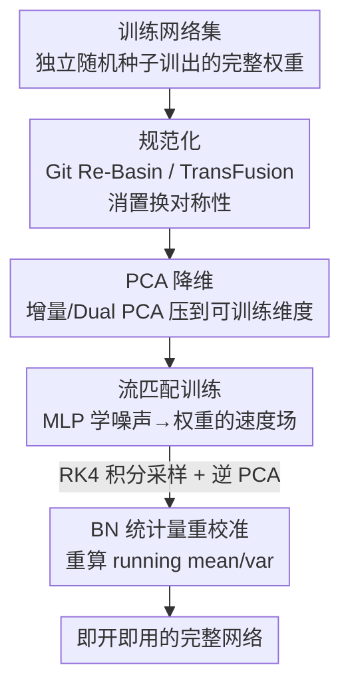

# DeepWeightFlow: Re-Basined Flow Matching for Generating Neural Network Weights

**会议**: ICLR2026  
**OpenReview**: [https://openreview.net/forum?id=fOwsr1VTi8](https://openreview.net/forum?id=fOwsr1VTi8)  
**代码**: https://github.com/NNeuralDynamics/DeepWeightFlow  
**领域**: 权重生成 / 超网络 / 生成模型  
**关键词**: 流匹配, 神经网络权重生成, 置换对称性, Git Re-Basin, 超网络

## 一句话总结
DeepWeightFlow 用一个简单 MLP 的流匹配模型直接在"权重空间"里学一个速度场，把高斯噪声一次性流向训练好的完整网络权重；它先用 Git Re-Basin / TransFusion 把训练集网络规范化（消掉置换对称性），再配合 PCA 把维度压到可训练规模，从而能在几分钟内生成上百个无需微调、即开即用的高精度网络（覆盖 MLP / ResNet / ViT / BERT，最大到 O(100M) 参数），速度远超扩散类方法。

## 研究背景与动机
**领域现状**：把"训练好的网络权重"当成一种高维数据来生成，是近年的一个有趣方向——一旦能从权重分布里采样，就能加速迁移学习、做集成、不确定性估计、神经架构搜索。主流做法是用扩散模型（P-diff、RPG、D2NWG）或条件流匹配（FLoWN）来建模权重分布。

**现有痛点**：这些方法各有硬伤。一类（P-diff、FLoWN）只能生成**部分权重**（通常只生成 BatchNorm 参数，因为扩不到大模型的全部参数），生成出来的网络不完整；另一类能生成完整权重的，要么生成速度极慢（RPG 用循环扩散，生成一组网络要几个小时），要么生成后还得**微调**才能用（SANE）；还有一类（D2NWG、FLoWN）需要额外训练一个 VAE / 图自编码器来降维，多了一个模型、且有损压缩会伤害权重质量。

**核心矛盾**：权重生成同时被三件事卡住——**置换对称性**（相邻层隐藏神经元的联合置换不改变网络功能，导致损失面高度多模态，生成模型很难学这种"等价但散落各处"的分布）、**超高维**（一个小 ResNet 都有上千万参数）、以及**效率与完整性的两难**（要完整、要快、不微调，三者很难同时满足）。

**本文目标**：造一个能**直接在权重空间**操作、生成**完整**权重、**无需微调即可用**、且**生成极快**的模型，同时能扩到 O(100M) 参数、覆盖多种架构（MLP / ResNet / ViT / BERT）与多种数据模态。

**切入角度**：作者押注两个判断。其一，**流匹配（Flow Matching）比扩散更适合权重生成**——它直接回归一个把噪声送到目标的速度场，采样路径是直线、可用高阶积分器一步到位，天然适合高维且采样快。其二，**与其用等变架构去"扛"置换对称性，不如在数据侧用规范化（canonicalization）把对称性直接消掉**——把训练集里每个网络都对齐到同一个参考表示，让生成模型面对一个"被压扁"的、模态更单一的分布。

**核心 idea**：用"规范化后的训练数据 + 简单 MLP 流匹配 + PCA 降维"组合，直接在权重空间里学速度场，把消对称性这件难事甩给预处理，把扩规模这件难事甩给 PCA，从而让生成模型本体保持极简极快。

## 方法详解

### 整体框架
DeepWeightFlow 的输入是"在某个目标任务上独立训练好的一批完整网络权重"$\{W_1,\dots,W_L\}$，输出是"从同一权重分布里新采样出来、即开即用的完整网络权重"。整条流程分三步走：先把这批训练网络做**规范化**（可选但对大模型关键），把置换对称性引起的散乱模态对齐到同一参考；再（对大网络）用**PCA**把展平后的权重向量压到可训练维度；最后训练一个**时间条件的 MLP 流匹配模型**，学一个从高斯噪声指向目标权重的速度场，生成时用 RK4 积分把噪声"流"成一个完整网络，并对含 BatchNorm 的网络做一次统计量**重校准**即可使用。整个生成模型本体就是个带 LayerNorm / GELU / Dropout 的浅层 MLP，没有任何等变结构，所有"对称性"的脏活都在数据预处理里解决掉了。

### 关键设计

**1. 直接在权重空间做流匹配：用一个浅 MLP 学噪声到权重的速度场**

针对"扩散慢、且要额外 VAE 降维"的痛点，DeepWeightFlow 把流匹配直接搬到展平的权重空间。源分布是与目标同维的高斯噪声 $x_0 \sim \mathcal{N}(0,\sigma^2 I)$，目标是训练好的权重分布 $x_1 \sim p_{\text{target}}$。给定均匀采样的时间 $t\in[0,1]$，沿直线轨迹取插值点 $\mu_t=(1-t)x_0+tx_1$，并加噪 $x_t=\mu_t+\epsilon$ 来稳定训练；这条直线的瞬时速度是常数 $u_t=x_1-x_0$（因为 $\frac{d\mu_t}{dt}=x_1-x_0$）。模型 $v_\theta(x_t,t)$ 把当前点和时间嵌入映射到速度，优化目标就是经典的流匹配回归损失

$$\mathcal{L}_{\text{FM}}(\theta)=\mathbb{E}_{t\sim U[0,1],\,x\sim p_t(x)}\big[\lVert v_\theta(x,t)-u(x,t)\rVert^2\big].$$

时间 $t$ 先经一个小 MLP 嵌成 $t_{\text{embed}}\in\mathbb{R}^{d_{\text{time}}}$，与 $x_t$ 拼接后送进主网络（全连接 + LayerNorm + GELU + Dropout，末层线性映回权重维度）。生成时从高斯噪声出发，用**四阶 Runge–Kutta（RK4）** 积分学到的速度场得到新权重。相比扩散需要多步去噪、且常配 latent 编码器，这里训练是直接的向量场回归、采样是直线积分，因此又简单又快——这是"几分钟生成上百个网络"的根本来源。

**2. 规范化消除置换对称性：把对称性甩给预处理，而非等变架构**

这是全文最核心的赌注。MLP 相邻层的隐藏神经元做联合置换 $P$（$P^TP=I$）时网络功能不变：$z_{\ell+1}=P^T\sigma(PW_\ell z_\ell+Pb_\ell)$，卷积通道、Transformer 注意力头也有类似对称性。后果是同一个函数对应权重空间里大量等价但散落的点，损失面高度多模态，生成模型若直接去学这种分布会非常吃力。DeepWeightFlow 不去设计昂贵的等变网络，而是在**数据侧**把每个训练网络对齐到同一参考：对 MLP / ResNet 用 **Git Re-Basin**（权重匹配，把对齐写成一串双线性指派问题 SOBLAP，用坐标下降近似求解，跑 100 次迭代），对 Transformer（ViT）用 **TransFusion**（把对齐推广到注意力头内部与头之间的置换，因含谱分解更慢，跑 10 次迭代）。规范化把"等价权重"折叠成单一规范代表，让流匹配面对一个模态更单一的分布。论文实证发现这件事**容量相关**：当流模型容量受限时，规范化让生成网络精度更高、方差更小；当容量充足时，规范化与否趋于一致——也就是说规范化对**大模型 / 小流模型**特别有用，对中等维度权重收益有限。

**3. 增量 / Dual PCA 降维：让生成模型扩到 O(100M) 参数而不靠自编码器**

直接在原始展平权重上训练，对大网络会被 GPU 显存卡死。DeepWeightFlow 用 PCA 做无需训练的降维：权重维度在 O(10M) 量级时用**增量 PCA**（Incremental PCA），在 O(100M) 量级时用 **Dual PCA / Gram PCA**（在样本数远小于维度时对协方差的对偶形式做分解，避免显式构造超大协方差矩阵），生成后再用逆 PCA 变换回原权重空间。这条路相对扩散类常用的 VAE 降维有两个好处：一是**不需要额外训练一个自编码器**（少一个模型、少一处有损压缩），二是 PCA 是线性可逆变换、保真度可控。消融显示 PCA 在保住精度的同时大幅降低训练时间，作者据此估计 O(1B) 参数也有望生成。

**4. BatchNorm 统计量重校准：补上权重生成对不上 running stats 的最后一公里**

含 BN 的网络（如 ResNet-18/20）有个隐患——哪怕权重生成得很完美，若 BN 的 running mean / variance 对不上，网络仍会崩。原因是流匹配能学好 BN 的可学习参数 $\gamma,\beta$，但 running 统计量是和训练数据分布强绑定的"非参数"量，直接从参考模型搬过来效果很差（论文 Table 7 证实）。DeepWeightFlow 的做法是生成完权重后，用训练集的一个小子集**重新前向跑一遍、重算每个生成网络的 BN running 统计量**（算法 1）。而 LayerNorm 因为本身对置换不变、也不依赖 running 统计，无需校准。正是这一步让生成的 ResNet / 迁移到新数据集的模型能"零微调"直接达到训练集水平。

### 训练策略
训练数据全部是**从随机初始化独立训练**出来的终态网络（每个数据集默认 100 个、各用唯一随机种子），而非从单次训练里截取的 checkpoint 序列——这点是对此前工作（如 P-diff 用单次训练 checkpoint）多样性不足质疑的直接回应，保证训练集本身就是多样的。源分布的标准差选择很关键：当源分布标准差**匹配或略小于**目标权重分布标准差时效果最佳，且高斯噪声一致优于 Kaiming 等初始化，这种敏感性在小流模型上尤其明显。所有 DeepWeightFlow 模型默认按架构专门训练（探究类别条件时除外）。

## 实验关键数据

### 主实验
跨架构完整权重生成（无微调，生成网络精度 vs 训练集"原始"网络）：

| 架构 / 任务 | 原始网络 | DeepWeightFlow 生成（完整） | 对照 SOTA |
|--------|------|------|------|
| 3 层 MLP / MNIST | 96.32 ± 0.20 | 96.17 ± 0.31 (w/ Re-Basin) | FLoWN 仅 83.58；WeightFlow 仅 78.6 |
| ResNet-18 / CIFAR-10 | 94.45 ± 0.14 | 93.55 ± 0.13 (完整) | RPG 95.1（需自回归多次生成）；SANE 仅 68.6 |
| ResNet-18 / STL-10 | 62.30 ± 0.77 | 62.46 ± 0.79 | P-diff 62.24；FLoWN 62.00 |
| ViT-Small-192 / CIFAR-10 | 83.30 ± 0.29 | 83.07 ± 0.42 (w/ TransFusion) | P-diff(ViT-mini) 73.6 |
| BERT-118M / Yelp（Spearman） | 0.7902 ± 0.061 | 0.7909 ± 0.005（Dual PCA） | — |

关键点：DeepWeightFlow 生成的是**完整**权重，精度与训练集几乎持平；而 FLoWN / P-diff 多为部分权重生成，RPG / SANE 要么自回归多趟要么需微调。BERT-118M 这一行证明了 Dual PCA 能把方法扩到 O(100M) 参数。

### 消融实验
规范化的容量依赖性（Re-Basin 有无对比，$d_h$ 为流模型隐藏维度）：

| 任务 / 架构 | $d_h$ | w/ Re-Basin | w/o Re-Basin | 说明 |
|------|------|---------|---------|------|
| MNIST / MLP | 512 | 96.17 ± 0.31 | 96.19 ± 0.27 | 大容量下几乎无差 |
| MNIST / MLP | 64 | 57.80 ± 9.85 | 25.54 ± 12.90 | 小容量下规范化大幅领先且方差更小 |
| Fashion-MNIST / MLP | 64 | 77.76 ± 3.72 | 53.35 ± 30.49 | 同上，方差差距悬殊 |
| ViT-Small-192 / CIFAR-10 | 128 | 69.09 ± 25.20 | 41.15 ± 25.26 | Transformer 上规范化收益明显 |

迁移学习（ResNet-18 在 CIFAR-10 上生成，零样本 / 微调迁到 STL-10、SVHN）：DeepWeightFlow 生成网络一致优于 FLoWN 与随机初始化，且与训练集预训练网络持平（如 STL-10 zero-shot：生成 48.32 vs FLoWN 35.16 vs 随机 11.18）。

### 关键发现
- **规范化是"容量保险"**：流模型容量足够大时，规范化、噪声调度等设计选择都无所谓，容量能补偿次优设计；容量受限或权重维度极高（大模型）时，规范化显著提精度、降方差。
- **源分布标准差最关键**：略小于或匹配目标分布标准差时最好，高斯优于 Kaiming，敏感性在小流模型上被放大。
- **效率碾压扩散**：生成上百个网络只需几分钟，而 RPG 等扩散/循环方法常需数小时。
- **多样性真实**：用 mIoU（生成网络与训练网络错误预测集合的交并比，$\text{IoU}=|P_1^{\text{wrong}}\cap P_2^{\text{wrong}}|/|P_1^{\text{wrong}}\cup P_2^{\text{wrong}}|$）衡量，训练集本身（独立种子终态网络）就很多样，生成网络在保持高精度的同时维持多样性。

## 亮点与洞察
- **"把对称性甩给数据预处理"是个干净的解耦**：与其设计复杂等变网络去硬扛置换对称性，不如用 Git Re-Basin / TransFusion 在数据侧把对称性消掉，让生成模型本体退化成一个普通 MLP。这种"难点前置到预处理"的思路可迁移到任何带强对称性的生成任务。
- **PCA 代替 VAE 降维**：用线性、可逆、无需训练的 PCA（尤其 Dual PCA 利用"样本数 ≪ 维度"）替掉需要额外训练且有损的自编码器，既省一个模型又少一处质量损耗——这是它能干净扩到 O(100M) 的关键。
- **BN 重校准这步很实在**：点破了"权重生成对不上 running statistics"这个容易被忽略的坑，并给出零成本（小子集前向一遍）的修法，是让生成网络"零微调即用"的临门一脚。
- **流匹配 + RK4 直线积分**：把采样从扩散的多步去噪变成直线场积分，是几分钟生成上百网络的速度根源。

## 局限与展望
- **按架构专门训练**：每个 DeepWeightFlow 模型基本绑定一种架构（类别条件实验除外），不是一个能跨架构通吃的统一生成器，泛化到任意新架构仍需重训。
- **规模仍止于 O(100M)**：O(1B) 只是基于 Dual PCA 资源估计的推断，尚未真正验证；现代 LLM 的百亿/千亿参数仍是未触及的区域。
- **PCA 是线性降维**：对高度非线性的权重流形可能有信息损失，论文也承认压缩有损时会伤生成质量——只是 PCA 比 VAE 损失更可控，并非无损。
- **规范化对中等维度收益有限**：对小/中网络，规范化几乎不带来增益却仍有计算开销（TransFusion 含谱分解还偏慢），需要按容量/规模判断是否值得开。
- **数据集尚未公开**：训练数据生成代码已开源，但成套权重数据集"未来才公开"，复现完整规模实验有门槛。

## 相关工作与启发
- **vs P-diff / FLoWN（部分权重生成）**：它们主要只生成 BN 等部分参数（受限于扩不到大模型全参数），本文生成**完整**权重且精度持平训练集，覆盖到 ViT / BERT。
- **vs RPG（循环扩散，完整权重）**：RPG 用自回归/循环扩散生成完整权重但极慢（小时级），本文用流匹配直线积分，分钟级生成，效率碾压。
- **vs SANE（规范化 + 超网络自回归）**：SANE 同样用 Git Re-Basin 规范化，但它把权重按层 tokenize、自回归逐层填充，且生成后需微调；本文一次性整体生成、无需微调。
- **vs D2NWG（VAE 降维 + 扩散）**：D2NWG 训练 VAE 做降维与去对称，本文用 PCA 替代 VAE（不训额外模型、有损更可控），并把规范化扩展到 Transformer（TransFusion）。

## 评分
- 新颖性: ⭐⭐⭐⭐ 组合既有部件（流匹配 + Re-Basin/TransFusion + PCA）而非全新原理，但"规范化前置 + PCA 替 VAE + BN 重校准"的组合解决了完整/快速/免微调三难，工程与思路均有新意。
- 实验充分度: ⭐⭐⭐⭐ 覆盖 MLP/ResNet/ViT/BERT 四类架构、多数据集、迁移学习、多样性、容量与初始化消融，较全面；缺真实 O(1B) 验证。
- 写作质量: ⭐⭐⭐⭐ 动机、对称性背景与方法推导清晰，图表对照充分。
- 价值: ⭐⭐⭐⭐ 把"完整权重生成"做到分钟级且免微调、可扩到百兆参数，对集成、迁移学习、权重空间研究有实际推动。

<!-- RELATED:START -->

## 相关论文

- [\[ICLR 2026\] Parameterized Hardness of Zonotope Containment and Neural Network Verification](parameterized_hardness_of_zonotope_containment_and_neural_network_verification.md)
- [\[ICLR 2026\] Training-Free Determination of Network Width via Neural Tangent Kernel](training-free_determination_of_network_width_via_neural_tangent_kernel.md)
- [\[ICLR 2026\] Diffusion and Flow-based Copulas: Forgetting and Remembering Dependencies](diffusion_and_flow-based_copulas_forgetting_and_remembering_dependencies.md)
- [\[ICLR 2026\] Toward Practical Equilibrium Propagation: Brain-Inspired Recurrent Neural Network with Feedback Regulation and Residual Connections](toward_practical_equilibrium_propagation_brain-inspired_recurrent_neural_network.md)
- [\[ICLR 2026\] Conformal Prediction with Corrupted Labels: Uncertain Imputation and Robust Re-weighting](conformal_prediction_with_corrupted_labels_uncertain_imputation_and_robust_re-we.md)

<!-- RELATED:END -->
