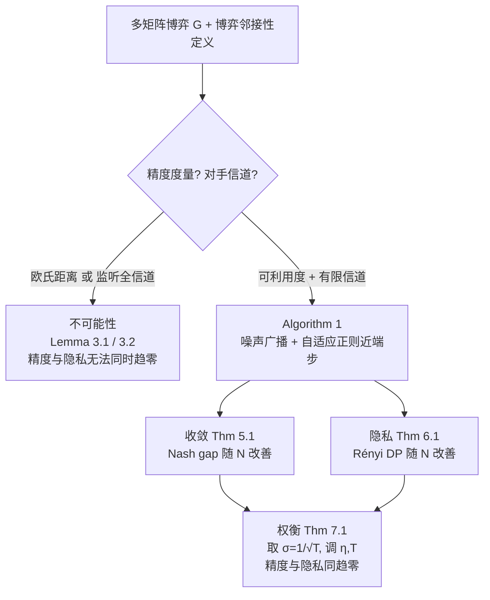

# Differentially Private Equilibrium Finding in Polymatrix Games

**会议**: ICLR 2026  
**OpenReview**: [https://openreview.net/forum?id=7qNbWQTV26](https://openreview.net/forum?id=7qNbWQTV26)  
**代码**: 待确认  
**领域**: 学习理论 / 差分隐私 / 博弈论  
**关键词**: 差分隐私, 多矩阵博弈, 纳什均衡, 粗相关均衡, 分布式优化, 不可能性界  

## 一句话总结
本文首次证明在多矩阵博弈中**分布式找均衡同时满足高精度与低差分隐私预算**这件事的边界——在"对手监听所有信道"或"用欧氏距离衡量精度"两种情形下根本不可能，但若把精度换成可利用度（exploitability）且对手只能监听有限信道，作者给出的自适应正则化算法能让 Nash gap 与隐私预算**随玩家数增多同时趋于零**。

## 研究背景与动机

**领域现状**：多矩阵博弈（polymatrix game）用一张图刻画局部交互——节点是玩家、边是两两博弈，玩家在每条边上用同一个策略、效用是各边收益之和。这种模型能覆盖安全博弈、金融市场、去中心化双边交易网络等场景，是少数"既丰富又可计算"的多智能体模型。

**现有痛点**：在上述场景里，玩家的效用矩阵往往编码了私密信息（保留价、私有估值），需要在向均衡演化的过程中保密。当没有可信中心服务器时，只能用分布式算法——玩家本地计算、与邻居交换信息，而监听信道的对手可能反推出效用函数。已有的差分隐私（DP）均衡计算工作存在两类硬伤：要么**精度与隐私预算无法同时压低**（Ye 2021、Wang 2022），要么只给了**弱化的隐私**，对手仍能推断部分私密信息（Wang & Başar 2024 等）。

**核心矛盾**：DP 的本质是"加噪声让相邻输入不可区分"，但博弈求均衡又要求迭代逐步逼近真实最优——噪声越大越私密、却离均衡越远。到底这对矛盾是算法没设计好，还是存在本质下界？此前没人把这个边界刻画清楚。

**本文目标**：(1) 给出 DP 均衡计算的**不可能性界**，划清可行区域；(2) 在可行区域内设计一个**精度与隐私随玩家数 N 双双变好**的分布式算法。

**核心 idea**：**① 精度度量的选择是关键**——欧氏距离到均衡集太苛刻，换成可利用度（单方偏离的收益增量）这个更弱、却更贴近实际的指标，才有出路；**② 自适应正则化**——给每个玩家施加一个与其度数成反比、与度数调和均值成正比的权重衰减 $\tau_i$，低度数玩家梯度对单条效用矩阵更敏感、就多加正则把相邻博弈的轨迹"抹平"，从而在不牺牲收敛的前提下换取隐私。

## 方法详解

### 整体框架
本文是"先划红线、再在红线内建算法"的两段式理论工作。前半部分用**博弈邻接性（game adjacency）**定义 DP：两个多矩阵博弈若仅在单条边的效用矩阵上不同，则互为相邻；算法若 DP，对手就无法从观测区分原博弈和任何相邻博弈，也就推不出任何玩家的效用矩阵。基于此先证两条不可能性引理，再提出 Algorithm 1——一个带噪声广播 + 自适应正则近端梯度步的分布式 CCE 求解器，并给出收敛、隐私、以及二者权衡的三组定理。

### 关键设计

**1. 博弈邻接性 + Rényi DP：把"保护效用矩阵"翻译成可证明的隐私语言。** 沿用 Huang et al. (2015) 的相邻概念，定义两个多矩阵博弈相邻（$G\sim G'$）当且仅当它们仅在某单条边 $(i,j)$ 的效用矩阵 $U_{i,j}$ 上不同。算法运行 $t$ 步会产生执行轨迹，对手通过信道观测到 $o\in O^t$；$(\epsilon,\delta)$-DP 要求对任意相邻博弈与任意观测集合 $S$，$P_G(R_G(\theta)\in S)\le e^{\epsilon}P_{G'}(R_{G'}(\theta)\in S)+\delta$。论文实际采用更易组合的 Rényi DP：$D_\alpha(\mu_G^{(t)},\mu_{G'}^{(t)})\le\epsilon$，并用 Mironov (2017) 的转换引理回到 $(\epsilon,\delta)$-DP。这套语言让"对手无法确定任一玩家效用矩阵"成为可量化的命题。

**2. 两条不可能性界：用零和构造把红线画死。** 作者用零和多矩阵博弈（$U_{i,j}=-U_{j,i}$，其 CCE 坍缩为 NE）证明两件坏事。**(i) 全信道监听不可行**——Lemma 3.1 构造了一对 $N\ge12$ 的相邻零和博弈，使任何同时满足精度 $\zeta$ 与隐私 $\epsilon$ 的算法都有 $\zeta\ge\min\{\frac{3\exp(-2\epsilon)}{112},\frac{1}{112}\}$，即一旦 $\zeta\le\frac{1}{112}$ 就必有 $\epsilon\ge\log\frac32$，与 $N$ 无关；证明思路是若每个玩家都收敛得很准，对手就能从观测算出近似均衡并区分两个博弈，再用鸽笼原理保证存在某玩家在两博弈中都达标。**(ii) 欧氏距离度量不可行**——Lemma 3.2 表明即便对手只看单个玩家信道，用欧氏距离当精度也不行，$\zeta\ge\min\{\frac38\exp(-4\epsilon),\frac1{16}\}$；关键观察是二人零和博弈里行玩家策略从 $(0.51,0.49)$ 微调到 $(0.49,0.51)$ 会让列玩家最佳响应从 $(0,1)$ 翻到 $(1,0)$，这种均衡的剧烈跳变会沿图传播开来。这两条界直接告诉算法设计者：**只能在"有限信道 + 可利用度"这一象限里找正面结果**。

**3. 自适应正则化的近端梯度步：算法的灵魂。** Algorithm 1 中每个玩家 $i$ 每步采样高斯噪声 $n_i^{(t)}\sim N(0,\sigma^2 I)$，把 $\pi_i^{(t)}+n_i^{(t)}$ 广播给邻居，收到邻居含噪策略后做一步带权重衰减的投影梯度：
$$\pi_i^{(t+1)}\leftarrow\arg\min_{\pi_i\in\Delta_{A_i}}\langle\pi_i,g_i^{(t)}\rangle+\tau_i\|\pi_i\|^2+\frac1\eta\|\pi_i-\pi_i^{(t)}\|^2,$$
等价于 $\pi_i^{(t+1)}\leftarrow\mathrm{Proj}_{\Delta_{A_i}}\big(\frac{\pi_i^{(t)}-\eta g_i^{(t)}}{1+\eta\tau_i}\big)$。**精髓在 $\tau_i$ 的取法**：$\tau_i=\frac{(\bar N)^{5/9}}{|N(i)|\log N}$，其中 $\bar N$ 是各玩家度数的调和均值。它与度数 $|N(i)|$ 成反比——低度数玩家的梯度对单条效用矩阵的扰动更敏感，就多加正则把相邻博弈下的轨迹差异压住；高度数玩家则靠效用函数的"聚合平均"天然稀释单边扰动。另一处巧思是梯度步从 $\pi_i^{(t)}$（去噪前）而非 $\pi_i^{(t)}$（去噪后）出发，避免相邻博弈观测随迭代越走越散，代价是引入噪声带来的额外逼近误差。

**4. 稀疏/稠密双情形的统一隐私分析与权衡。** Theorem 6.1 把单信道 Rényi DP 界拆成两项取较小：$\clubsuit=16A^3(\log N)^2(\bar N)^{4/9}+\frac{4A}{\bar N}$（稠密图主导，$N\ge\bar N^p$ 时关于 $N$ 次线性）与 $\spadesuit=\frac{2A}{N}\sum_i\mathbb 1(T>\min\{\mathrm{dist}(i,v_1),\mathrm{dist}(i,v_2)\})$（稀疏图主导，多数玩家离被改的边 $(v_1,v_2)$ 很远、$T$ 步内感知不到变化）。配合 Theorem 5.1 的收敛界 $\propto\frac1{\eta T}+\frac{A\sigma^2}{2\eta}+\dots$，Theorem 7.1 取 $\sigma=\frac1{\sqrt T}$ 并精心选 $\eta,T$：稠密图下精度与隐私同为 $O\big(\frac{(\log N)^{2/3}}{N^{4p/27}}\big)$，稀疏图下同为 $O\big(\frac{1}{(\log N)^{1/3}}\big)$——**两者都随 $N\to\infty$ 趋于零**，这正是此前所有工作做不到的核心突破。

## 实验关键数据

实验在附录 E，对比对象是把 Huang et al. (2015) 单目标优化算法改写到博弈设定得到的 baseline，指标为可利用度（exploitability），二者在**相同 DP 预算**下比较。

### 主实验（稠密 Erdős–Rényi 图）

| 设置 | 玩家数 $2^7\to2^{11}$ | 本文方法 | Baseline |
|------|------|---------|----------|
| $A=5$, $p\in\{0.1,0.3,0.5\}$ | 可利用度随 N 变化 | **持续更低，且随 N 下降** | 不随 N 下降 |
| $A=10$ | 同上 | **持续更低** | 平台/不降 |

可利用度量级约 $2.2\times10^{-1}\sim2.8\times10^{-1}$，本文方法曲线随玩家数增多单调走低。

### 补充实验（聚簇拓扑图）

| 设置 | 拓扑 | 结论 |
|------|------|------|
| $\lfloor1/p\rfloor$ 个簇 | 簇内全连接、跨簇以 $\frac{10p}{N}$ 概率连边 | 本文方法在相同隐私预算下可利用度更低，且随 N 改善（Figure 4） |

### 关键发现
- **同隐私预算下本文方法可利用度一致更低**，验证自适应正则化确实换来了更优的精度-隐私权衡。
- **可利用度随玩家数增多而下降**，与理论 Theorem 7.1 完全吻合；baseline 则不随 N 改善，印证了"随 N 同趋零"是本文独有的性质。

## 亮点与洞察
- **把"度量选择"上升为一等公民**：论文最深刻的洞见是欧氏距离 vs 可利用度的差异——前者对均衡的微小跳变极度敏感（故不可能性成立），后者只关心偏离收益（故有可行算法）。这提醒做隐私-博弈交叉时，"想保证什么精度"本身就是设计变量。
- **不可能性界当作设计护栏**：先用零和构造把红线画死，再把算法死死限制在"有限信道 + 可利用度"象限，理论与算法形成闭环，逻辑非常干净。
- **正则化强度随图结构自适应**：$\tau_i\propto1/|N(i)|$ 巧妙利用了多矩阵博弈"高度数玩家梯度被聚合平均稀释"的结构性质，让稀疏图（靠距离传播慢）和稠密图（靠聚合稀释）用同一个算法统一处理。
- **"越多人越安全也越准"反直觉但自洽**：一般直觉是玩家越多协调越难，本文却证明 $N$ 增大时精度和隐私同时改善——根源在于扰动被更多玩家"稀释/隔离"。

## 局限与展望
- **隐私分析假设网络可靠**：多信道时隐私预算按访问信道数线性叠加（Rényi 组合规则），隐含"通信网络大体可靠"的假设；若对手能自适应选择监听哪些信道，界可能更松。
- **常数较大、量级偏理论**：不可能性界里的 $\frac1{112}$、$\frac1{16}$ 等常数偏小，正面结果的 $N^{4p/27}$ 指数也很小，意味着"趋零"在实际玩家规模下可能不明显，实验里可利用度也只是从 0.28 降到 0.22 量级。
- **实验规模与场景有限**：仅在合成的 ER 图与聚簇图上验证，缺少真实安全博弈/金融网络数据；baseline 也只有改写自 Huang (2015) 一个。
- **局限于 CCE/NE 的可利用度**：换成更强的均衡概念（如相关均衡 CE）或更强对手模型时，结论是否成立未知。

## 相关工作与启发
- **DP 分布式优化的博弈化**：本文建立在 Huang et al. (2015) 的相邻分布式优化问题之上，把单目标优化的邻接/DP 框架迁移到博弈，是"优化 → 博弈"迁移的范例。
- **多矩阵博弈与 CCE-NE 坍缩**：用了 Cai et al. (2016) 的零和多矩阵博弈结构（CCE 坍缩为 NE）来构造硬例，是经典博弈论结果在隐私下界证明里的妙用。
- **与无悔学习的联系**：非隐私设定下算法退化为带欧氏正则的 Online Mirror Descent（Hazan 2016），收敛率 $O(\frac1{\eta T}+\eta)$；隐私设定的额外误差项是噪声引入的代价。这个"隐私 = 无悔学习 + 自适应噪声/正则"的视角，对其他在线博弈隐私化任务有借鉴意义。
- **启发**：度数自适应正则化的思想，可推广到任意"敏感度随局部连接度变化"的分布式隐私学习问题——谁更脆弱就给谁更多保护。

## 评分
- 新颖性: ⭐⭐⭐⭐⭐ 首次刻画 DP 多矩阵博弈均衡计算的不可能性边界，并给出首个精度与隐私随 N 同趋零的算法，问题与结论都新。
- 实验充分度: ⭐⭐⭐ 实验仅作理论佐证，合成图、单一 baseline、量级改善有限；但本质是理论论文，实验非主战场。
- 写作质量: ⭐⭐⭐⭐ "先划红线再建算法"的结构清晰，Figure 1 把三类结论可视化得很到位；公式密集但动机交代充分。
- 价值: ⭐⭐⭐⭐ 为隐私-博弈交叉划清了可行区域，自适应正则化与度量选择的洞见对后续工作有指导意义，但落地仍偏远。

<!-- RELATED:START -->

## 相关论文

- [\[ICLR 2026\] Online Learning and Equilibrium Computation with Ranking Feedback](online_learning_and_equilibrium_computation_with_ranking_feedback.md)
- [\[ICLR 2026\] Computing Equilibrium beyond Unilateral Deviation](computing_equilibrium_beyond_unilateral_deviation.md)
- [\[ICLR 2026\] Toward Practical Equilibrium Propagation: Brain-Inspired Recurrent Neural Network with Feedback Regulation and Residual Connections](toward_practical_equilibrium_propagation_brain-inspired_recurrent_neural_network.md)
- [\[NeurIPS 2025\] Efficient Kernelized Learning in Polyhedral Games Beyond Full-Information: From Colonel Blotto to Congestion Games](../../NeurIPS2025/learning_theory/efficient_kernelized_learning_in_polyhedral_games_beyond_full-information_from_c.md)
- [\[NeurIPS 2025\] Optimism Without Regularization: Constant Regret in Zero-Sum Games](../../NeurIPS2025/learning_theory/optimism_without_regularization_constant_regret_in_zero-sum_games.md)

<!-- RELATED:END -->
