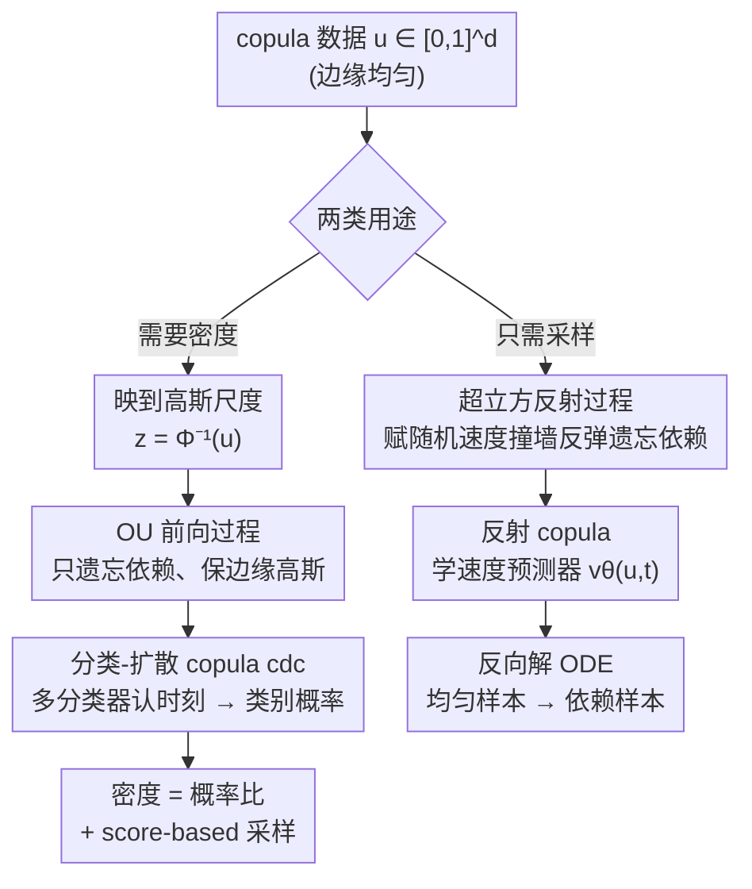

# Diffusion and Flow-based Copulas: Forgetting and Remembering Dependencies

**会议**: ICLR2026  
**OpenReview**: [https://openreview.net/forum?id=YrX77XRgku](https://openreview.net/forum?id=YrX77XRgku)
**代码**: https://github.com/Huk-David/Diffusion-and-Flow-based-Copulas  
**领域**: 概率生成模型 / Copula / 扩散与流  
**关键词**: Copula、扩散过程、流模型、依赖结构建模、密度估计

## 一句话总结
这篇论文把扩散和流的思想搬到 copula（联结函数）建模上：设计两个"只遗忘变量间依赖、却不动单维边缘分布"的前向随机过程，再训练模型去"记住"被遗忘的依赖，从而首次让 copula 能扩展到 $d>1000$ 的高维、多模态依赖结构（如图像），在科学数据和图像上的依赖建模全面超过经典与现有深度 copula。

## 研究背景与动机
**领域现状**：建模一组连续随机变量的联合分布时，有一个非常优雅的拆分：先各自建好每个变量的一维边缘分布，再用一个 copula 专门刻画变量之间的依赖。Sklar 定理保证这种拆分唯一存在——任何联合 CDF 都能写成 $P(x_1,\dots,x_d)=C(P^1(x_1),\dots,P^d(x_d))$，其中 $C$ 是定义在单位超立方 $[0,1]^d$ 上、边缘均匀的 copula。copula 把"边缘行为"和"依赖结构"彻底解耦，因此在天气预报、水文、风险管理、因果推断、不确定性量化等需要保证边缘校准（如极端事件）的领域是首选工具。

**现有痛点**：但主流 copula 模型的表达力受限于强假设和糟糕的扩展性。高斯 copula 只能刻画对角对称依赖；vine copula 会丢掉部分依赖结构，且模型空间随维度指数膨胀；现有的深度 copula（基于 GAN 或矩匹配网络）有 mode collapse，难以在多模态、高维数据上采样。最新的 ratio copula（Huk et al., 2025）虽然把 copula 密度等价成"依赖数据 vs 独立数据"的二分类器、表达力很强，但它**只能估计密度**，采样要靠昂贵的 MCMC，复杂度随维度按 $O(d^{4/3})$ 增长，根本撑不起高维多模态场景。

**核心矛盾**：现有 copula 要么表达力不够（参数族假设太硬），要么能算密度却采不了样、或能采样却算不了密度，而且都无法在高维下既保持边缘均匀又捕捉复杂依赖。

**本文目标**：拆成两个具体子问题——(Q1) 如何设计一个**只遗忘依赖、保持边缘分布不变**的随机过程？(Q2) 能否通过"记住"这些被遗忘的依赖，反推出 copula 的密度和样本？

**切入角度**：作者注意到 copula 数据天然有"边缘均匀"这一刚性约束，而扩散/流模型恰好擅长在"从数据分布逐步退化到简单先验、再反向生成"的范式里做密度估计和采样。如果能设计一个前向过程，让它**专门破坏依赖、却不碰边缘均匀性**，那么前向终点就是"独立 copula"，而学会反演这个过程就等于学会了真实依赖结构。

**核心 idea**：用"遗忘依赖（前向过程）+ 记住依赖（学习反演）"替代传统 copula 的参数族假设，把扩散和流的可扩展采样能力引入依赖建模——前向过程在理论上**始终是合法 copula**，反演模型在最优时**可证明恢复真实 copula**。

## 方法详解

### 整体框架
论文给出一个统一框架并落地为两个互补实例。框架的两步是：第一步设计一个**前向过程**，让变量间依赖随时间 $t$ 单调衰减到独立、但每一维的边缘分布始终不变（因此每个时刻都是合法 copula，构成"从依赖 copula 到独立 copula 的连续谱"）；第二步训练一个模型去"记住"被这个过程遗忘掉的依赖，从而在 $t=0$ 处恢复真实 copula，用于密度评估或采样。

两个实例针对 copula 的两类主要用途各有侧重：

- **分类-扩散 copula（cdc）**：面向**密度估计**。它先把 copula 数据 $u$ 映到高斯尺度 $z=\Phi^{-1}(u)$，在 $z$ 上跑一个 Ornstein–Uhlenbeck（OU）过程逐步遗忘依赖，再训练一个多分类器去判断"当前样本对应哪个扩散时刻"，用类别概率直接读出 copula 密度，同时也支持基于 score 的扩散采样。
- **反射 copula（reflection）**：面向**高效采样**。它直接在 $[0,1]^d$ 超立方上操作，给样本赋随机速度让它们在立方体内"撞墙反弹"来遗忘依赖，再学一个速度预测器，反向解 ODE 从均匀样本生成依赖样本。

### 关键设计

**1. 前向遗忘过程之一——高斯尺度上的 OU 过程：让依赖衰减但边缘恒为标准高斯**

cdc 的关键在于把过程建在高斯尺度 $z$ 上而非 copula 尺度。由于 $u$ 边缘均匀，经概率积分变换后 $z=\Phi^{-1}(u)$ 边缘恰为标准高斯。作者在 $z$ 上施加一个**各维独立**的 OU 过程：

$$\mathrm{d}z_t = -z_t\,\mathrm{d}t + \sqrt{2}\,\mathrm{d}B_t,$$

它的平稳分布正是标准 $d$ 维高斯——也就是说每一维的边缘**永远是标准高斯**，满足"不动边缘"的要求。命题 2 进一步证明：把 $z_t$ 映回 copula 尺度 $u_t=\Phi(z_t)$ 后，(i) 各维边缘**始终均匀** $u_t^i\sim U(0,1)$，(ii) 其 copula $c_t$ 在 KL 散度下以 $O(e^{-2t})$ 的速率收敛到独立 copula。选 OU 而非别的过程，是因为它解析可解、收敛快、易学习，且收敛速率已知——这让后面离散化时刻 $T_1,\dots,T_k$ 可以按收敛速率挑选，使各时刻间依赖变化"等比例"。作者还给出加相关矩阵 $\Sigma$ 的变体 $\mathrm{d}z_t=-z_t\,\mathrm{d}t+\sqrt{2}\Sigma^{1/2}\,\mathrm{d}B_t$（对角为 1），让极限分布更贴近数据、改善复杂分布的建模。

**2. 分类-扩散 copula：用"认扩散时刻"的多分类器直接读出密度**

这是 cdc 的核心创新，它把"算密度"这件难事转化成一个分类问题。作者把前向过程离散成 $k$ 个时刻 $T_1=0,\dots,T_k=\infty$，定义分类器 $c_{dc}(z)$ 输出一个 $k$ 维概率向量，第 $s$ 个分量是"样本 $z$ 来自时刻 $T_s$"的后验概率 $P(t=T_s\mid z)$。命题 3 给出关键等式：真实 copula 密度等于"最依赖时刻"与"最独立时刻"两个类别概率之比

$$c(u) = P\big(t=T_1\mid z=\bar\Phi^{-1}(u)\big)\big/\,P\big(t=T_k\mid z=\bar\Phi^{-1}(u)\big),$$

于是**一次前向调用**就能拿到密度，不需要像普通扩散模型那样做昂贵的数值积分。这是把 Huk et al. (2025) 的二分类 ratio copula 推广到"多时刻分类"——从"依赖 vs 独立"的二分对立，升级成"连续衰减依赖"的多分类谱，正是这个升级让模型能接上扩散采样、扩展到高维。命题 4 还证明 copula 的 score $\nabla_u\log c_s(u)$ 也能仅用类别概率的梯度表示（带权重 $w(u)$ 修正高斯尺度到 copula 尺度的雅可比），从而可以用 Langevin dynamics 做 score-based 采样。在数据支撑于低维流形的常见假设下，扩散采样随维度扩展远比 ratio copula 的环境维 MCMC 高效。

**3. 反射前向过程：在超立方内"撞墙反弹"直接遗忘依赖**

反射 copula 不绕道高斯尺度，而是直接在 $[0,1]^d$ 上设计遗忘过程。它给每个 copula 样本 $u_0$ 配一个随机速度 $v_0\sim N(0,I_d)$，让样本沿直线运动并在超立方边界**反射**。具体地，定义一维反射算子 $R(x,y)$：当 $\lfloor x\rfloor$ 为偶数时位置取 $x-\lfloor x\rfloor$、速度不变；为奇数时位置取 $1-x+\lfloor x\rfloor$、速度翻转——这恰好实现"碰到墙就弹回来"。过程按 $(u_t^i,v_t^i)=R(u_0^i+t\cdot v_0^i,\,v_0^i)$ 逐维演化，唯一的随机性来自初速度 $v_0$，给定 $v_0$ 后轨迹确定。命题 7 证明：$u_t$ 在分布上收敛到独立 copula，且任意 $t>0$ 时 $u_t$ 仍是边缘均匀的合法 copula。这样就在"依赖 copula"和"独立 copula"之间造出一条随时间逐渐减依赖的随机插值路径，而且全程不出超立方、边缘天然均匀。

**4. 反射 copula：学平均速度，反向解 ODE 来采样**

既然过程的随机性只来自速度，学会"平均速度"就等于学会系统的平均行为。作者借助 Holderrieth et al. (2024) 的结果（命题 8）建立速度与概率路径的联系：令 $v^*(u,t)=\mathbb{E}[v_t\mid u_t=u]$ 为期望速度，则从大时刻 $T$ 的均匀样本 $u_T\sim c_T$ 出发、**反向**沿 ODE

$$\frac{\mathrm{d}}{\mathrm{d}t}u_t = v^*(u,t)$$

积分到 $t=0$，终点就服从真实 copula $c(u)$。由于 $T\to\infty$ 时 $u_T\sim U[0,1]^d$，实际就用均匀样本初始化、数值反解 ODE 来生成依赖样本。期望速度 $v^*$ 没有闭式，模型用一个速度预测器 $v_\theta(u,t)$ 去逼近：在足够丰富的模型类下，最小化预测速度与采样速度的均方误差 $\mathbb{E}\|v_\theta(u_t,t)-v_t\|^2$ 即可恢复期望速度。这套设计是首次把"边缘保持的流"用在 $[0,1]^d$ 上的生成式 copula。

### 损失函数 / 训练策略
cdc 的训练用**混合损失**兼顾密度和采样质量：对每个时刻的分类用交叉熵、对 score 用均方误差。定理 5 证明这个混合损失在最优时恰好恢复真实类别概率（即 $\arg\min$ 集合等于真实参数集 $\Theta^*$），形式为

$$L_{cdc}(\theta)=\alpha\sum_{s=1}^k \mathbb{E}_{z\sim\tilde p_{T_s}}\big[-\log c_{dc}^{(s)}(z;\theta)\big]+\sum_{s=1}^k \mathbb{E}_{z_{T_1},\epsilon}\big\|\hat\epsilon_s(c_{dc}(\cdots;\theta))-\epsilon\big\|^2,$$

权重 $\alpha>0$ 取值使两项量级相当。反射 copula 的训练目标就是上面那个速度匹配的 MSE。两者都只在最优处保证恢复真 copula，所以作者在附录用统计检验、秩诊断和校准指标验证样本的边缘均匀性。

## 实验关键数据

### 主实验
对比对象是专门学依赖结构的模型：经典的高斯 copula、vine copula，以及 SOTA 深度 copula——IGC（Janke et al., 2021）和 Ratio copula（Huk et al., 2025）。指标用 copula 对数似然 LL（越高越好，测密度拟合）、Wasserstein-2（W2，越低越好）、Kendall's tau 矩阵的 Frobenius 范数（Frob，测成对依赖）、图像用 FID。所有指标跑 10 次取标准差。

科学数据集上的依赖建模（节选）：

| 数据集 | 指标 | 本文 cdc | 本文 reflection | 之前最好基线 |
|--------|------|----------|-----------------|--------------|
| Magic ($d{=}10$) | LL ↑ | **18.65** | — | 6.76 (Ratio) |
| Magic | W2 ↓ | 1.33 | **1.34** | 1.44 (Vine) |
| Dry Bean ($d{=}16$) | LL ↑ | **50.21** | — | 48.21 (Ratio) |
| Dry Bean | W2 ↓ | **1.12** | 1.35 | 1.57 (Gaussian) |
| Robocup ($d{=}20$) | LL ↑ | **3.40** | — | 2.30 (Ratio) |
| Robocup | W2 ↓ | 3.87 | **3.84** | 3.93 (Ratio) |

cdc 在 LL 上大幅领先（Magic 上 18.65 vs 次好 6.76），W2 上 cdc 与 reflection 互有最优，Frob 上与高斯 copula 相当（高斯 copula 因与 Kendall's tau 有闭式关系，在该指标上占便宜）。

高维图像依赖（边缘平凡、依赖复杂，节选）：

| 数据集 | 指标 | 本文 cdc | 本文 reflection | 之前最好基线 |
|--------|------|----------|-----------------|--------------|
| digits ($d{=}64$) | LL ↑ | **13.80** | — | 13.29 (Ratio) |
| MNIST ($d{=}784$) | LL ↑ | **346.70** | — | 334.42 (Ratio) |
| MNIST | FID ↓ | 7.38 | **9.13** | 66.56 (Ratio) |
| Cifar 灰度 ($d{=}1024$) | FID ↓ | 80.51 | **42.14** | 100.04 (Vine) |

cdc 在所有数据集拿到最高 LL；FID 上 reflection 的样本更平滑（cdc 因采样有随机性而稍带噪点）。vine copula 在 Cifar 上无论怎么调超参都算不出 LL（NaN）。这是 copula 首次扩展到 $d>1000$ 的高维多模态依赖。

### 消融实验

| 配置 | 关键发现 |
|------|---------|
| 混合损失权重 $\alpha$（附录 B.4） | $\alpha$ 调到两项 loss 量级相当时密度与样本质量同时最好 |
| 前向收敛速率（附录 B.3） | OU 的 $O(e^{-2t})$ 速率用于按比例选时刻 $T_1,\dots,T_k$ |
| 边缘均匀诊断（附录 B.5） | 统计检验/秩诊断/校准指标验证两个模型样本边缘确实均匀 |

### 关键发现
- cdc 的优势在密度（LL），reflection 的优势在采样平滑度（FID）——两者正好对应"密度估计"与"高效采样"两类 copula 用途，互补而非重复。
- cdc 采样的随机性（Alg. 1）虽让 FID 稍逊，却是维持边缘均匀的有益特性，是有意的 trade-off。
- 经典 copula 在 $d\geq 784$ 时几乎失效（vine 在 Cifar 直接 NaN），凸显"前向过程+学习反演"范式在高维下的扩展性。

## 亮点与洞察
- **把"算密度"变成"做分类"**：cdc 用多分类器认扩散时刻、再取类别概率比直接读密度，一次前向就出结果，绕开了普通扩散模型算似然要数值积分的痛点——这是把 ratio copula 从二分类升级到多分类谱的关键收益。
- **"只遗忘依赖、不动边缘"的过程设计很巧**：OU 过程的平稳分布恰是标准高斯、反射过程天然困在超立方内，两者都让边缘均匀性"免费"成立，这是 copula 建模最硬的约束，作者用过程结构而非额外约束项满足它。
- **一套框架两个互补实例**：同一"遗忘+记住"原理，既能做密度估计（cdc）又能做快速采样（reflection），思路可迁移到任何"有刚性边缘约束、需建模依赖"的任务（如时空气候场、多智能体轨迹）。
- **反射过程的确定性轨迹**：给定初速度后轨迹完全确定，随机性集中在一处，使得"学期望速度=学系统平均行为"这一论证干净利落。

## 局限与展望
- **只在最优处保证恢复真 copula**：模型只在最优参数下才证明是合法 copula，实际训练得到的参数化不保证边缘均匀和密度归一化——如何设计架构让任意参数都保持这些性质是开放问题。
- **依赖采样器质量**：扩散/流模型如何采样才能最忠实地反映模型真实分布，本身是活跃研究领域，直接影响本文样本质量。
- **极端依赖与离散变量**：当前过程对极端尾部依赖未必最优，作者指出可换不同的边缘保持过程/速度分布来获得更好归纳偏置；且方法要求连续边缘，扩展到离散变量（离散 copula）是未来方向。
- 自评：图像实验只用灰度、且声明"不与图像生成模型竞争"，高维结论主要建立在 LL 上，视觉 FID 与专门的图像生成模型不可直接比较。

## 相关工作与启发
- **vs Ratio copula（Huk et al., 2025）**：ratio copula 把 copula 密度等价成"依赖 vs 独立"的二分类器，但只能估密度、采样要 $O(d^{4/3})$ 的 MCMC。本文 cdc 把它推广到"多扩散时刻"的多分类，从而接上扩散 score-based 采样、在高维下高效——是直接的扩展与超越。
- **vs 深度 copula（IGC / 矩匹配网络，Hofert 2021 / Janke 2021）**：这些只能出样本、不能算密度，且有 mode collapse。本文 cdc 密度采样兼得，reflection 采样更平滑无 mode collapse。
- **vs 归一化流 copula（Kamthe et al., 2021）**：同样在最优时得到合法 copula，但缺少本文命题 2/7/9 那种"前向过程全程保持合法 copula 状态"的遗忘-记住机制保证。
- **vs 参数族深度 copula（Archimedean/Archimax，Ng 2021/2022）**：那些精确匹配某参数族、对尾部外推稳健，但只能刻画对角/对称依赖；本文面向更一般的高维复杂依赖。
- **启发**：扩散/流社区常用高斯过程，但据作者所知没人利用过它们"逐维边缘保持"的性质——本文指出这正是 copula 建模的天然契合点，反过来也给扩散研究提供了"边缘约束生成"的新视角。

## 评分
- 新颖性: ⭐⭐⭐⭐⭐ 首次把扩散/流的"遗忘-记住"范式用于 copula，并配可证明的过程合法性与最优恢复定理。
- 实验充分度: ⭐⭐⭐⭐ 科学数据+高维图像、4 类基线、4 种指标、10 次重复；但图像仅灰度、缺更多真实高维科学场。
- 写作质量: ⭐⭐⭐⭐⭐ 用两个研究问题 Q1/Q2 串起理论与方法，命题/定理清晰，框架统一。
- 价值: ⭐⭐⭐⭐⭐ 让 copula 首次扩展到 $d>1000$，对天气/气候/风险等强边缘校准领域有实际意义。

<!-- RELATED:START -->

## 相关论文

- [\[ICLR 2026\] DeepWeightFlow: Re-Basined Flow Matching for Generating Neural Network Weights](deepweightflow_re-basined_flow_matching_for_generating_neural_network_weights.md)
- [\[ICLR 2026\] A Unification of Discrete, Gaussian, and Simplicial Diffusion](a_unification_of_discrete_gaussian_and_simplicial_diffusion.md)
- [\[ICLR 2026\] Understanding the Dynamics of Forgetting and Generalization in Continual Learning via the Neural Tangent Kernel](understanding_the_dynamics_of_forgetting_and_generalization_in_continual_learnin.md)
- [\[ICLR 2026\] Quotient-Space Diffusion Models](quotient-space_diffusion_models.md)
- [\[ICLR 2026\] Information Estimation with Discrete Diffusion](information_estimation_with_discrete_diffusion.md)

<!-- RELATED:END -->
