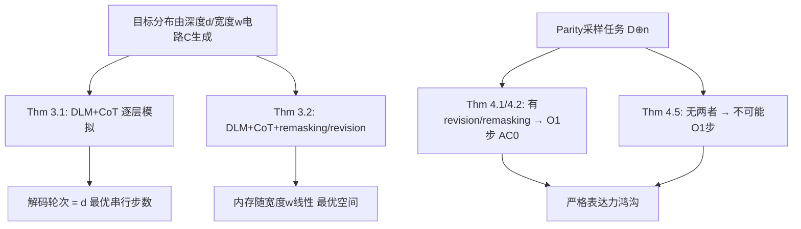

# Diffusion Language Models are Provably Optimal Parallel Samplers

**会议**: ICLR 2026  
**OpenReview**: [https://openreview.net/forum?id=5bkAbueJwM](https://openreview.net/forum?id=5bkAbueJwM)  
**代码**: 无（纯理论）  
**领域**: learning theory  
**关键词**: 扩散语言模型, 并行采样, 电路复杂度, Chain-of-Thought, remasking, revision, 表达力下界  

## 一句话总结
本文用电路复杂度的语言为"扩散语言模型（DLM）为什么能更快"建立了严格理论：证明 DLM 配上多项式长度 CoT 能用**最优的串行步数**（等于电路深度而非规模）模拟任意并行采样算法，且在加入 remasking 或 revision 后还能同时做到**最优的空间复杂度**，并给出一个 parity 采样任务证明 revision/remasking 让 DLM 的表达力**严格更强**。

## 研究背景与动机
**领域现状**：扩散语言模型（DLM）通过对掩码序列迭代去噪、并行解码多个位置，被寄望成为自回归（AR）模型的更快替代品——AR 即便跑在大规模并行硬件上也必须逐 token 串行生成。近年 LLaDA、Mercury 等工作把 DLM 规模化，性能逼近 AR 且生成更快，引发广泛关注。

**现有痛点**：DLM 的"快"目前更多停留在经验观察，缺乏理论支撑。相比之下，AR 模型在 CoT 下的能力（Li et al. 2024 证明 AR+CoT 能模拟任意布尔电路）已被研究透彻，而 DLM 的基本极限——它到底省下多少串行计算、并行解码需要多少空间/内存——几乎无人刻画。

**核心矛盾**：DLM 的并行优势是真实的算法优势，还是只是看起来快？尤其是 remasking（把已揭示 token 重新变回 mask 再采）和 revision（允许已揭示 token 直接改成别的 token）这些 DLM 独有的推理机制，到底带来了本质能力提升，还是可有可无的工程 trick？这些都没有理论答案。

**本文目标**：用电路深度/宽度作为"并行时间/空间"的抽象，刻画 DLM 作为并行采样器的表达力上下界，并厘清 remasking/revision 的作用。

**核心 idea**：**把 DLM 当作并行采样器，用电路复杂度做标尺**——电路深度 $d$ = 采样所需的最少串行步数，电路宽度 $w$ = 所需的最少内存比特。证明 DLM+CoT 能把任意深度-$d$ 电路用恰好 $d$ 个解码轮次实现（最优时间），加 remasking/revision 后内存只随宽度线性增长（最优空间），并用 parity 任务构造一个 DLM 有无 revision 的**严格表达力鸿沟**。

## 方法详解

### 整体框架
论文不设计新模型，而是把 DLM 的推理过程（预测器 $p(\cdot|x_t)$、解掩码策略 $F$、可选 remasking $G$）全部建模成布尔电路，再在电路复杂度框架里证明三件事：时间最优（Thm 3.1）、空间最优（Thm 3.2）、表达力严格分层（第 4 节）。证明主线是"DLM ⇄ 电路"的双向模拟——既能用 DLM 模拟任意电路，也能把 DLM 的生成过程压回电路从而导出下界。

### 关键设计

**1. 电路复杂度作为采样器的统一标尺：深度记时间、宽度记空间。** 论文把一个随机映射建模成接受输入 $\chi\in\{0,1\}^n$ 和随机比特 $R\sim U_r$ 的分层布尔电路 $C(\chi,R)$，并定义深度 $d=\max_v l(v)$、宽度 $w=\max_\ell|\{v:l(v)=\ell\}|$。其中深度被解释为"完成该计算的最少串行步数"，宽度被解释为"所需的最少内存比特"。DLM 这一侧，二元词表 $\{a,b\}$ 加 mask $M$ 用 2-bit 编码（$a\to00,b\to01,M\to10$），预测器拆成 $L$ 个位置电路 $C_i:\{0,1\}^{2L}\times\{0,1\}^{r_i}\to\{00,01,10\}$，且约束"只能把 mask 解开、不同位置的随机比特独立"以严格对应 $p(x_0|x_t)=\prod_i p_i(x_0^i|x_t)$ 的条件独立结构。这把"采样速度"问题翻译成了"用什么深度/宽度的电路能实现该分布"，使 DLM 与 AR 在同一坐标系里可比。

**2. 逐层模拟实现时间最优（Theorem 3.1）：解码轮数 = 电路深度，而非规模。** 给定一个有 $N$ 个顶点、深度 $d$ 的电路 $C$，构造一个长度 $L=N$ 的 DLM，让它在第 $i$ 个解码轮次恰好算完电路第 $i$ 层：维护中间序列 $x_i^j=u_j$（若顶点 $j$ 在已算层内）否则为 $M$，于是第 $i$ 轮把第 $i$ 层的所有顶点输出一次性并行揭示，$d$ 轮后整条序列 $x_d=u_1\cdots u_N$ 算完，输出取末 $m$ 位。关键在于 $F$ 和预测器 $p$ 都只需常数深度电路即可识别"现在算到第几层"并填入对应值。这条结论的分量在于对比：Li et al. (2024) 证明 AR+CoT 模拟电路所需串行步数（即 CoT 长度）随电路**规模 $N$（总节点数）线性增长**，而 DLM 只需 $d$（**深度**）步。对于宽而浅的计算，$d\ll N$，DLM 的串行步数可远小于 AR——这正是"并行优势"的严格来源。

**3. remasking/revision 实现空间最优（Theorem 3.2）。** 朴素的逐层模拟里，DLM 把每个中间顶点都永久写进序列、不能覆盖，导致工作内存（footprint）随电路**规模**膨胀而非宽度。论文证明：一旦允许 remasking（$G$ 把已揭示位置重新置 $M$）或 revision（放松"已揭示 token 必须固定"，允许 $p_i(x_t^i|x_t)<1$），就能在算完一层、把结果传给下一层后，把不再需要的旧顶点回收/覆盖，从而让占用的内存只随电路**宽度 $w$ 线性增长**——达到信息论意义下的最优空间。这给出了一个清晰的理论判断：这两个机制不是工程花招，而是把 DLM 从"时间最优"推到"时间+空间双最优"的关键。

**4. parity 采样给出严格表达力鸿沟（Theorems 4.1/4.2 vs 4.5）。** 论文用"从偶校验串里均匀采样"这一分布 $D^{\oplus}_n$（在 $\{0,1\}^n$ 中所有 parity 为偶的串上均匀）作为分离工具。正面：带 revision 的 DLM（Thm 4.1）和带 remasking 的 DLM（Thm 4.2）都能用 $O(1)$ 步、且预测器与 $F$ 仅为 $\mathrm{AC}^0$ 电路，采出 $D^{\oplus}_n$——remasking 版的巧思是分两阶段，先在配对位置上采出各对的 parity，再把每个 2-bit block 在保持 parity 约束下均匀展开（如把 $M0$ 块通过"重掩码再改写"等概率变成 $00$ 或 $11$）。反面（Thm 4.5）：不带 remasking/revision 的标准 DLM，即便预测器和 $F$ 都允许是 $\mathrm{AC}^0$，也**无法**在 $O(1)$ 步内采 $D^{\oplus}_n$。证明用到 Håstad 的 parity-against-$\mathrm{AC}^0$ 平均情形下界（任何 $\mathrm{AC}^0$ 电路算 PARITY 的正确率 $<1/2+2^{-c_d\cdot n/(\log S)^{d-1}}$）并扩展到概率电路，再用一个归约：把 $\ell$ 步常数轮生成层层"剥离"得到 0 步采样的矛盾。直觉上：标准 DLM 只能改 mask 位、当只剩一个 mask 时必须一次算出全体 parity，而 parity $\notin\mathrm{AC}^0$。这就把"DLM 有无 revision/remasking"坐实成了一道**严格能力鸿沟**，而非性能差异。

## 实验关键数据
本文为纯理论工作，无实证实验。下表汇总核心定理结论。

### 主结论汇总

| 定理 | 模型配置 | 结论 | 最优性含义 |
|------|----------|------|-----------|
| Thm 3.1 | DLM + CoT | 深度-$d$、$N$ 顶点电路可由 $L=N$ 的 DLM 用 **$d$ 个解码轮次**模拟 | 串行步数最优（=深度，非规模） |
| Thm 3.2 | DLM + CoT + (remasking 或 revision) | 任意电路可被模拟，内存随**宽度 $w$ 线性**增长 | 空间最优 |
| Thm 4.1 | DLM + revision，$L=n$ | $O(1)$ 步采 $D^{\oplus}_n$，电路在 $\mathrm{AC}^0$ | 表达力上界（正面） |
| Thm 4.2 | DLM + remasking，$L=n$ | $O(1)$ 步采 $D^{\oplus}_n$，电路在 $\mathrm{AC}^0$ | 表达力上界（正面） |
| Thm 4.5 | 标准 DLM（无两者），$L=n$ | **无法** $O(1)$ 步采 $D^{\oplus}_n$（即便 $p,F\in\mathrm{AC}^0$） | 表达力下界（反面） |

### AR vs DLM 串行代价对比

| 模型 | CoT 下模拟电路所需串行步数 | 随什么增长 |
|------|---------------------------|-----------|
| 自回归 AR（Li et al. 2024） | $\Theta(N)$ | 电路**规模**（总节点数） |
| 扩散 DLM（本文 Thm 3.1） | $d$ | 电路**深度** |

### 关键发现
- DLM 的并行优势在宽而浅的计算上最显著：$d\ll N$ 时串行步数远少于 AR。
- remasking 与 revision 不是工程 trick，而是同时解锁"空间最优"和"更强表达力"的本质机制。
- Thm 4.5 证明中的关键约束：合法 DLM 预测器必须满足 $p(x|x_t)=\prod_i p_i(\cdot)$ 的位置独立性，因此单步内无法采出有相关性的分布——这正是标准 DLM 无法一步采 parity 的根因。
- 构造里反复用到的基础原语 $\mathrm{ShiftR}$（把序列整体右移一位、首位填常数 $1$）可在 $\mathrm{NC}^0$（常数深度、多项式个 2-入度门）内实现，是逐层模拟中"把上一层结果搬到下一层"的廉价积木。
- 一个微妙之处（论文 Remark）：Thm 4.1/4.2 的构造确实能压成一个采 $D^{\oplus}_n$ 的 $\mathrm{AC}^0$ 电路，但它**不是合法 DLM**——因为它在单步内引入了跨位置相关性，违反 $p=\prod_i p_i$，所以并不与 Thm 4.5 矛盾。

## 亮点与洞察
- **把"快"翻译成"深度 vs 规模"**：用电路深度作为串行步数的下界标尺，第一次把 DLM 相对 AR 的优势刻画成"步数随深度增长 vs 随规模增长"，给经验观察提供了干净的理论解释。
- **正反两面夹出严格鸿沟**：不止给出 DLM 能做什么的上界，还用 Håstad parity 下界证明标准 DLM 做不到什么，把 revision/remasking 的价值从"性能更好"升级为"能力严格更强"，论证更硬。
- **复杂度类对照清晰**：把 DLM 的不同推理机制映射到 $\mathrm{NC}^0\subseteq\mathrm{AC}^0\subseteq\mathrm{TC}^0$ 这条经典阶梯上，使"哪种机制本质上更强"有了可引用的标准答案。
- **对设计的直接指导**：结论明确建议——设计包含 revision 的前向过程、收集含 revision/remasking 的训练数据，是 DLM 比无此机制版本更有潜力的关键设计要点。

## 局限与展望
- **纯理论、无实证**：所有结论建立在电路复杂度抽象上，预测器被理想化为可实现任意 $\mathrm{AC}^0/$常数深度电路，真实 Transformer 化的 DLM 能否逼近这些构造、训练能否学到这些策略，论文未验证。
- **二元词表与可分离任务**：主证明默认二元词表 $\{a,b\}$（更大词表靠标准编码归约），parity 也是精心挑选的可分离任务，距离自然语言生成的真实分布仍有距离。
- **存在性而非可学习性**：定理证明的是"存在这样的 DLM 能做到"，不等于现有训练范式会自动学出最优的 remasking/revision 策略——如何把理论潜力变成可训练目标是开放问题。
- **下界条件偏强**：Thm 4.5 把预测器和 $F$ 限定为 $\mathrm{AC}^0$，更强的预测器（如 $\mathrm{TC}^0$ 含 MAJORITY 门、对应 Transformer 中的注意力求和）下的分离结论尚未刻画。
- **展望**：探索更丰富的 remasking 策略和更灵活的前向过程，把"理论上更强"落到"训练得出来更强"。

## 相关工作与启发
- **DLM 谱系**：从连续域扩散（DDPM, Sohl-Dickstein）到离散域 D3PM（吸收态 mask），再到 LLaDA、Mercury、Song et al. 2025 等规模化工作。本文为这条线提供了缺失的理论底座。
- **解码顺序/remasking/revision**：Kim et al. 2025 指出解码顺序显著影响性能，Nie et al. 2025 提出 remasking，Song et al. 2025 提出 revision——本文首次从复杂度角度厘清三者的本质差别。
- **CoT 与电路复杂度**：Li et al. 2024 证明 AR+CoT 可模拟任意布尔电路（步数随规模），本文是其在扩散范式下的对照与超越；电路视角分析神经网络表达力延续 Merrill & Sabharwal 等传统。
- **经典下界工具**：表达力分离的硬核来自 Håstad (2014) 的 parity-against-$\mathrm{AC}^0$ 平均情形下界与 Furst–Saxe–Sipser 的 parity $\notin\mathrm{AC}^0$，本文把它们巧妙嫁接到 DLM 的多 token 并行解码场景。
- **启发**：把"采样器的算法优势"统一到电路深度/宽度坐标系，是评估各类生成范式（AR、DLM、未来更复杂的 forward process）的可迁移方法论；下次要论证某机制"本质有用"，构造一个可分离任务 + 经典电路下界是很硬的范式。
- **方法论迁移**：这套"建模成电路 → 上界用构造、下界用经典复杂度结果"的双向证明套路，可直接用于分析其它非自回归生成器（如 block diffusion、any-order AR）的并行表达力。

## 评分
- **新颖性**: ⭐⭐⭐⭐⭐ 首次用电路复杂度严格刻画 DLM 作为并行采样器的时间/空间最优性，并给出 revision/remasking 的严格表达力分离，视角和结论都很新。
- **实验充分度**: ⭐⭐⭐ 纯理论工作，定理完整自洽、正反两面闭合，但无任何实证验证，理论与真实可训练 DLM 之间有 gap。
- **写作质量**: ⭐⭐⭐⭐ 框架清晰、定理陈述与直觉解释配合好，电路建模严谨；符号偏重、对非复杂度背景读者门槛较高。
- **价值**: ⭐⭐⭐⭐⭐ 为"DLM 为何更快、revision 为何重要"提供了硬理论依据，对 DLM 前向过程与训练数据设计有直接指导意义。

<!-- RELATED:START -->

## 相关论文

- [\[ICLR 2026\] Quotient-Space Diffusion Models](quotient-space_diffusion_models.md)
- [\[ICLR 2026\] Automata Learning and Identification of the Support of Language Models](automata_learning_and_identification_of_the_support_of_language_models.md)
- [\[ICLR 2026\] Polynomial Convergence of Riemannian Diffusion Models](polynomial_convergence_of_riemannian_diffusion_models.md)
- [\[ICLR 2026\] On the Interpolation Effect of Score Smoothing in Diffusion Models](on_the_interpolation_effect_of_score_smoothing_in_diffusion_models.md)
- [\[ICLR 2026\] Unveiling the Basin-like Loss Landscape in Large Language Models](unveiling_the_basin-like_loss_landscape_in_large_language_models.md)

<!-- RELATED:END -->
