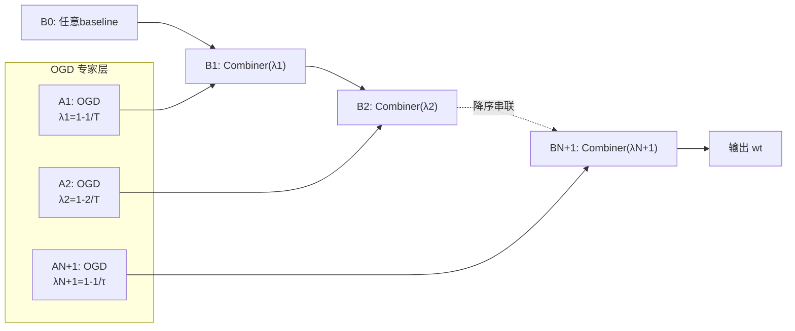

# Discounted Online Convex Optimization: Uniform Regret Across a Continuous Interval

**会议**: ICLR 2026  
**OpenReview**: [https://openreview.net/forum?id=65iFtHZ8Cu](https://openreview.net/forum?id=65iFtHZ8Cu)  
**代码**: 待确认  
**领域**: learning_theory  
**关键词**: 在线凸优化, 折扣遗憾, 自适应遗憾, Discounted-Normal-Predictor, 未知折扣因子  

## 一句话总结
针对在线凸优化中折扣因子 $\lambda$ 未知的开放问题，本文证明 Smoothed OGD（SOGD）能在一个连续区间内对**所有** $\lambda$ **同时**取得 $O(\sqrt{\log T/(1-\lambda)})$ 的统一折扣遗憾界，无需事先知道真实折扣因子。

## 研究背景与动机
- **领域现状**：在线凸优化（OCO）是在线学习的核心框架，标准评价指标是静态遗憾。但在非平稳环境里，近期数据比久远历史更重要，于是 $\lambda$-折扣遗憾 $\text{D-Regret}(T,\lambda)=\sum_t \lambda^{T-t}f_t(w_t)-\min_w\sum_t \lambda^{T-t}f_t(w)$ 被提出，用指数权重温和地"遗忘"过去。当 $\lambda$ 给定时，常步长 OGD 即可取得 $O(1/\sqrt{1-\lambda})$ 的折扣遗憾。
- **现有痛点**：折扣因子 $\lambda$ 在现实里往往**不可预知**。在跨期经济模型等场景中，$\lambda$ 反映的是主体内在偏好（由市场行为经验决定），是真实存在的"客观参数"而非可调超参。Zhang et al. (2024) 给出了已知 $\lambda$ 下的折扣遗憾界，并明确把"如何适应未知 $\lambda$"留作开放问题。
- **核心矛盾**：直觉上可套用经典的 meta-expert 框架——为多个候选 $\lambda$ 各跑一个 OGD 专家，再用 meta 算法（Hedge / Fixed-Share）追踪最优者。但这套框架要求**所有专家和 meta 算法在统一的性能度量下运行**；而折扣场景里，每个专家对应不同 $\lambda$，本质上是在**不同的折扣遗憾度量**下评估，传统 meta-expert 框架无法把它们组合起来。
- **本文目标**：设计一个折扣 OCO 算法，对连续区间 $\lambda\in[1-1/\tau,\,1-1/T]$ 内所有折扣因子同时给出近最优折扣遗憾保证，且**不依赖** $\lambda$ 的取值。
- **核心 idea**：**复用 Smoothed OGD（SOGD）+ 重新分析 DNP-cu**——构造一组不同步长的 OGD 专家覆盖各候选 $\lambda$，用带保守更新的 Discounted-Normal-Predictor（DNP-cu）作为 meta 算法**逐对顺序聚合**；关键突破在于证明 DNP-cu 能聚合**两个折扣因子不同**的专家，从而绕开统一度量的限制。

## 方法详解

### 整体框架
方法把"适应未知折扣因子"分三步落地：①将连续的 $\lambda$ 区间几何离散成 $N+1$ 个候选值，每个候选值配一个最优步长的 OGD 专家 $A_i$；②用 DNP-cu 构造的二元聚合器 Combiner，把相邻折扣因子的专家两两组合；③将这些 Combiner 按折扣因子**降序**串成一条链 $B_1,\dots,B_{N+1}$ 顺序聚合，输出最后一级 $B_{N+1}$ 的决策，再借一个技术引理从离散集合推广到连续区间。

### 关键设计

**1. 常步长 OGD 给出与 T 无关的折扣遗憾基石**：先把单个折扣因子的情况夯实。本文证明（Theorem 1）常步长 OGD $w_{t+1}=\Pi_W[w_t-\eta\nabla f_t(w_t)]$ 取步长 $\eta=D\sqrt{2(1-\lambda)}/G$ 时，$\lambda$-折扣遗憾不超过 $DG\sqrt{2}/\sqrt{1-\lambda}$，即 $O(1/\sqrt{1-\lambda})$。这个界与 Zhang et al. (2024) 的 $O(1/\sqrt{1-\lambda^2})$ 同阶（因 $1-\lambda<1-\lambda^2<2(1-\lambda)$），但更关键的是**步长与界都与总轮数 $T$ 无关**，因而该界对时间一致成立——这正是后续把单专家拼成区间自适应算法的前提。在近静态区 $\lambda\in[1-1/T,1]$ 则改用 $\eta=D/(G\sqrt{T})$ 得 $O(\sqrt{T})$ 界。

**2. 重新分析 DNP-cu，让它支持"跨折扣因子"聚合**：这是全文最硬的技术贡献。DNP-cu（Algorithm 2）维护折扣偏差 $x_{t+1}=\rho x_t+b_t$，用置信函数 $g(x)=\Pi_{[0,1]}[\tilde g(x)]$（其中 $\tilde g(x)=\sqrt{n/8}\,Z\cdot\text{erf}(x/\sqrt{8n})e^{x^2/16n}$）输出预测，并在置信度低或预测错时才用当前 $b_t$ 更新偏差。以往分析（Zhang et al. 2022a）只覆盖标准 payoff。本文 Theorem 2 把它推广到折扣 payoff，给出两条核心不等式：当 meta 折扣因子取 $\rho$ 时，对**任意** $\eta\ge\rho$ 有 $\sum_t \eta^{T-t}g(x_t)b_t\ge -Z/(2(1-\eta))$；当 $\eta=\rho$ 时 $\sum_t \rho^{T-t}g(x_t)b_t\ge \sum_t\rho^{T-t}b_t - Z/(2(1-\rho)) - U(n)-1$。前者意味着一个以 $\rho$ 运行的 DNP-cu，竟能同时为**另一个不同的折扣因子 $\eta$**（只要 $\eta\ge\rho$）提供 payoff 保证——这正是打破"统一度量"枷锁的关键。

**3. Combiner：用 DNP-cu 把两个不同折扣因子的专家凸组合**：基于 Theorem 2，Combiner（Algorithm 3）把两个 OGD 专家 $A_1,A_2$（折扣因子 $\lambda_1\ge\lambda_2$）的决策做凸组合 $w_t=(1-\omega_t)w_{t,1}+\omega_t w_{t,2}$，权重 $\omega_t$ 由一个 $\rho=\lambda_2$ 的 DNP-cu 给出，喂给它的"比特"是归一化损失差 $\ell_t=(f_t(w_{t,1})-f_t(w_{t,2}))/GD\in[-1,1]$。由 $f_t$ 的凸性可得 $f_t(w_t)\le(1-\omega_t)f_t(w_{t,1})+\omega_t f_t(w_{t,2})$，再分别用 (13)、(14) 上界两侧折扣遗憾：相对 $A_1$（用 $\eta=\lambda_1\ge\rho$）得 $\le GDZ/(2(1-\lambda_1))$，相对 $A_2$ 得 $\le GD(Z/(2(1-\lambda_2))+U(n)+1)$。取 $Z=1/T$ 即得极小的 meta 遗憾，于是 $\lambda\in\{\lambda_1,\lambda_2\}$ 时都拿到最优 $O(1/\sqrt{1-\lambda})$。

**4. SOGD 串联 + 连续区间推广**：把候选折扣因子离散成几何集合 $S=\{1-2^{i-1}/T\}_{i=1}^{N+1}$（$N=\lceil\log_2(T/\tau)\rceil$），每个 $\lambda_i$ 配步长 $\eta_i=\frac{D}{G}\sqrt{2^i/T}$ 的 OGD 专家 $A_i$。SOGD（Algorithm 4）从任意 baseline $B_0$ 出发，依次用 Combiner 把 $B_{i-1}$ 与 $A_i$ 组合成 $B_i$（折扣因子设为 $\lambda_i$），**必须按折扣因子降序串联**（这是遗憾分析能层层传递的关键），每轮顺序跑一遍输出 $B_{N+1}$。最终 Theorem 3 证明：对所有 $\lambda\in[1-1/\tau,1-1/T]$ 同时成立 $\text{D-Regret}(T,\lambda)\le \frac{2GD}{\sqrt{1-\lambda}}(4\sqrt{\log T}+\sqrt{2})+\frac{GD(N+1)}{(1-\lambda)T}+2GD$，即统一的 $O(\sqrt{\log T/(1-\lambda)})$ 界。相比已知 $\lambda$ 的 $O(1/\sqrt{1-\lambda})$，只多出 $O(\sqrt{\log T})$ 因子——这是自适应所必须付出的代价（与自适应遗憾里普遍存在的 $\log T$ 项同源）。

## 实验关键数据

### 主实验
在 LIBSVM 的 ijcnn1 数据集（特征维 $d=22$）上做在线分类，$T=10000$，绝对损失，重复 5 次，用不同折扣因子（0.5～0.999）的折扣累积损失评估。对比对象：调优步长的 OGD（Theorem 1）、强自适应算法 SAOL / SCB、以及未调优的 OGD 变体。

| 折扣因子 $\lambda$ | SOGD（未知 $\lambda$） | OGD（按 $\lambda$ 调优 $\eta$） | 结论 |
|---|---|---|---|
| 0.999 | 与调优 OGD 相当 | 基准 | 损失累积曲线几乎重合 |
| 0.998 | 与调优 OGD 相当 | 基准 | 损失累积曲线几乎重合 |
| 0.996 | 稳态损失相当（初期略高后快速收敛） | 初期略低 | SOGD 快速追平 |

关键点：SOGD **无需预知 $\lambda$**，却能逼近"为该 $\lambda$ 专门调优过步长的 OGD"，而 SAOL / SCB 等强自适应基线及未调优 OGD 表现更差。

### 消融实验（参数敏感性）

| 参数 $Z$ | $\lambda=0.999/0.998/0.996$ 表现 | 结论 |
|---|---|---|
| $1/(10T)$ | 强 | 四种取值表现接近 |
| $1/T$ | 强 | 理论推荐值 |
| $10/T$ | 强 | 仍稳健 |
| $100/T$ | 强 | 在合理范围内不敏感 |

### 关键发现
- 在合理范围内 SOGD 对 meta 参数 $Z$ **不敏感**，四个取值都给出相近的强表现，与理论分析一致。
- SOGD 用"一套算法"覆盖了原本需要"逐个 $\lambda$ 调参"的 OGD 才能达到的性能，验证了对未知折扣因子的自适应价值。
- 强自适应基线 SAOL / SCB 虽也对所有区间给保证，但在折扣累积损失指标上不及 SOGD，说明"自适应区间"与"自适应折扣因子"并非简单等价，后者需要专门的跨度量聚合设计。
- 未调优 OGD（固定 $\eta_1=D/2G$）在不同 $\lambda$ 下表现波动明显，凸显了步长—折扣因子匹配的重要性，也反衬出 SOGD 自动匹配的优势。

## 亮点与洞察
- **解决一个被明确留下的开放问题**：把"折扣 OCO 能否适应未知 $\lambda$"从 Zhang et al. (2024) 的 open question 变成肯定回答。
- **绕开 meta-expert 框架的根本限制**：洞察到折扣场景下"度量随专家变化"是症结，转而用 DNP-cu 的"跨折扣因子 payoff 保证"（$\eta\ge\rho$）实现跨度量聚合，思路新颖。
- **统一区间界**：单一算法对连续区间内**所有** $\lambda$ 同时成立 $O(\sqrt{\log T/(1-\lambda)})$，且 $\sqrt{\log T}$ 这一额外代价被论证为自适应的内在必需。
- **技术补全价值**：连续区间统一折扣遗憾的想法虽在 Kapralov & Panigrahy (2010) 的 PEA 设定中出现过，但那里只给了证明梗概；本文在 OCO 设定下补全完整论证并修正其表述中的漏洞与不准确处。

## 局限与展望
- **折扣因子假设固定**：当前框架假设 $\lambda$ 为常数；现实中常见时变折扣因子，扩展到时变情形是重要但更难的方向。
- **未利用曲率**：对强凸 / exp-concave 等良性结构，经典 OCO 可得更紧的界，但能否借此改进折扣遗憾仍是开放问题。
- **额外 $\log T$ 代价**：相比已知 $\lambda$ 多出 $O(\sqrt{\log T})$，虽被证为自适应必需，但是否对所有 setting 都不可避免仍待进一步刻画。
- **实验规模有限**：仅在单个数据集（ijcnn1）的在线分类任务上验证，缺乏更广泛非平稳真实场景的实证。
- **计算开销**：需维护 $N+1=O(\log(T/\tau))$ 个 OGD 专家与同等数量的 Combiner 串联，每轮顺序更新，计算/存储随区间宽度对数增长，超大规模在线部署时的效率仍有优化空间。

## 相关工作与启发
- **折扣在线学习**：源自 PEA 的折扣遗憾（Freund & Hsu 2008 的折扣 Hedge，$O(\sqrt{\ln N/(1-\lambda)})$）；OCO 侧有 Zhang et al. (2024) 的自适应 OGD/FTRL、Jacobsen & Cutkosky (2024) 的折扣 VAW、Ahn et al. (2024) 的折扣→动态遗憾转化等，但均不适应未知 $\lambda$。
- **自适应遗憾**：折扣遗憾与强自适应遗憾在"定义关注时间窗"上异曲同工（小 $\lambda$ ≈ 短区间），Jun et al. (2017) 的 $O(\sqrt{\tau\log T})$ 强自适应界启发了本文"对所有区间/因子同时保证"的目标与 $\log T$ 代价认知。
- **DNP 谱系**：从 Kapralov & Panigrahy (2010/2011) 的 DNP 与保守更新，到 Daniely & Mansour (2019) 支持切换代价，再到 Zhang et al. (2022a) 的 SOGD；本文沿这条线把 DNP-cu 推到折扣 payoff 与跨因子聚合，是对该工具链的实质性延伸。
- **启发**：当多个子学习器运行在"不同评价度量"下而传统 meta 框架失效时，寻找一个其保证对一族度量同时成立的聚合器（如 DNP-cu 的 $\eta\ge\rho$ 性质），是打破统一度量假设的可迁移范式。

## 评分
- 新颖性: ⭐⭐⭐⭐⭐ 解决明确开放问题，提出跨折扣因子聚合的全新分析视角，绕开 meta-expert 框架的根本限制
- 实验充分度: ⭐⭐⭐ 作为理论论文实验恰当（验证逼近调优 OGD + 参数稳健性），但仅单数据集单任务，规模偏小
- 写作质量: ⭐⭐⭐⭐ 动机—挑战—解法逻辑清晰，图 1/2 把框架失效与本文流程讲得直观，定理表述严谨
- 价值: ⭐⭐⭐⭐ 为非平稳环境下折扣因子内在客观的实际场景提供了即插即用的自适应算法，理论贡献扎实且工具可迁移

<!-- RELATED:START -->

## 相关论文

- [\[ICLR 2026\] Online Inventory Optimization in Non-Stationary Environment](online_inventory_optimization_in_non-stationary_environment.md)
- [\[AAAI 2026\] A Switching Framework for Online Interval Scheduling with Predictions](../../AAAI2026/learning_theory/a_switching_framework_for_online_interval_scheduling_with_pr.md)
- [\[ICML 2026\] On Regret Bounds of Thompson Sampling for Bayesian Optimization](../../ICML2026/learning_theory/on_regret_bounds_of_thompson_sampling_for_bayesian_optimization.md)
- [\[ICLR 2026\] Online Conformal Prediction with Adversarial Semi-bandit Feedback via Regret Minimization](online_conformal_prediction_with_adversarial_semi-bandit_feedback_via_regret_min.md)
- [\[ICLR 2026\] Stable Coresets: Unleashing the Power of Uniform Sampling](stable_coresets_unleashing_the_power_of_uniform_sampling.md)

<!-- RELATED:END -->
