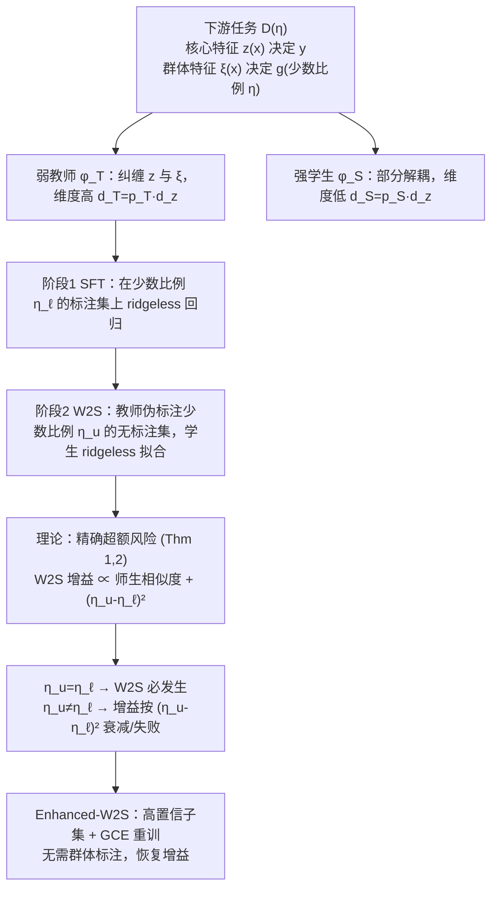

# Does Weak-to-strong Generalization Happen under Spurious Correlations?

**会议**: ICLR 2026  
**OpenReview**: [https://openreview.net/forum?id=5hfa2itwGz](https://openreview.net/forum?id=5hfa2itwGz)  
**代码**: 待确认  
**领域**: learning theory / weak-to-strong generalization  
**关键词**: weak-to-strong generalization, superalignment, spurious correlations, group imbalance, ridgeless regression, proportional asymptotics  

## 一句话总结
本文在带虚假相关的下游任务上首次给出弱到强（W2S）泛化的精确理论刻画：当弱教师标注数据与无标注数据的少数群体比例相等（$\eta_u=\eta_\ell$）时 W2S 必然发生，比例不等时 W2S 增益按 $(\eta_u-\eta_\ell)^2$ 衰减甚至失败；据此提出"高置信子集 + 广义交叉熵重训"这一无需群体标注的简单补救算法，在 10 组教师-学生对上稳定提升 W2S。

## 研究背景与动机

**领域现状**：超对齐（superalignment）的核心问题是——超人智能能否从更弱的人类监督中学习？Burns et al. (2024) 提出的弱到强（weak-to-strong, W2S）泛化给出了乐观答案：用弱教师生成的伪标签微调一个强预训练学生，学生往往能反超教师。此后 W2S 的机制被大量经验与理论工作研究（邻域扩张、数据重叠密度、师生分歧、良性过拟合、低内在维度微调等）。

**现有痛点**：几乎所有 W2S 理论都假设下游数据是"干净"的。但真实场景恰恰相反——弱教师和无标注数据都常常带有系统性偏差，即与人口学/采集因素绑定的**虚假相关**（spurious correlations）。医学标签偏向特定患者群体或成像设备、法律数据集偏向特定司法辖区、自动驾驶传感器数据偏向特定天气，这些专业下游任务往往无法干预采集过程、也拿不到额外的平衡数据。

**核心矛盾**：W2S 被提出的动机场景（在标注稀缺且不完美的专业任务上微调宽泛预训练的学生）正是虚假相关最严重的场景，但学界对"虚假相关下 W2S 还成不成立、何时成功、何时失败、怎么改进"几乎没有理论理解。

**本文目标**：建立 W2S 在虚假相关下的统一理论与算法研究，回答两个问题——「何时」（when，理论刻画）与「如何」（how，失败时的补救）。

**核心 idea**：**(1) 精确理论刻画**——在无逼近误差的 ridgeless 回归设定下，把问题推到比例渐近极限，精确算出教师/学生的泛化误差，揭示 W2S 增益由师生相似度与两端少数群体比例差 $(\eta_u-\eta_\ell)^2$ 共同决定；**(2) 理论驱动的算法补救**——在 W2S 微调后，用学生自身的高置信子集 + 广义交叉熵损失重训学生，无需任何群体标注即可在比例失配时恢复 W2S 增益。

## 方法详解

### 整体框架

文章分两条线。理论线：把"虚假相关下的 W2S"建模成一个带核心特征 $z(x)$ 与群体特征 $\xi(x)$ 的回归问题，弱教师/强学生的区别在于对群体特征的表示效率与解耦程度，再在比例渐近极限下给出教师（SFT 后）与学生（W2S 微调后）的精确超额风险表达式，从而判定 W2S 何时发生。算法线：根据理论"比例失配 → W2S 衰减"的结论，提出 Enhanced-W2S——选高置信子集 + GCE 重训，把失配场景下被破坏的增益拉回来。

### 关键设计

**1. 核心/群体特征分解的回归建模：把"虚假相关"写成可解析的几何结构。** 下游回归任务由分布 $D(\eta)$ 刻画，少数群体比例 $\Pr[g=1]=\eta\in[0,\tfrac12]$。每个输入被分解成两类特征：**核心特征** $z(x)\sim\mathcal{N}(0_{d_z},I_{d_z})$ 在群体间不变、决定标签 $y=z(x)^\top\beta^*+\epsilon$，但语义丰富因而高维难学；**群体特征** $\xi(x)\mid g\sim\mathcal{N}(g\mu_\xi,\sigma_\xi^2 I_p)$ 决定样本属于哪个群体、低维易表示（$p\ll d_z$）。这个分解的妙处在于：虚假相关被显式编码为"群体特征 $\xi$ 与标签 $y$ 的伪关联"，而群体间的可分性由 $\|\mu_\xi\|_2^2/\sigma_\xi^2$ 直接控制——后面"群体分得越开 W2S 越容易失败"的结论就由它量化。作者用经典的"牛 vs 骆驼"（牧场背景 vs 沙漠背景）类比让 $z$ 对应前景、$\xi$ 对应背景是否典型。

**2. 弱教师 vs 强学生：用"群体特征的表示效率与解耦度"定义强弱。** 微调在核范畴（kernel regime）下建模为在高维预训练表示 $\varphi_T,\varphi_S$ 上学一个过参数化线性层。强弱的本质区别在于对群体特征的处理：弱教师 $\varphi_T(x)=U_T\,\big(z(x)\otimes w(x)\big)$，其中 $w(x)=[1;T^\top\xi(x)]\in\mathbb{R}^{p_T}$ 把 $\xi$ 投到 $p_T-1$ 维，**重度纠缠**核心与群体特征；强学生 $\varphi_S(x)=U_S\,\big(z(x)\otimes\psi(x)\big)$，$\psi(x)=[1;S^\top\xi(x)]\in\mathbb{R}^{p_S}$，$p_S\le p_T$，把 $\xi$ 投到更低维 $p_S\ll p$，**部分解耦**核心与群体特征。两者都前置了 $z(x)$，故都有零逼近误差——这保证 W2S 之所以发生纯粹来自**估计误差差异**（学生更样本高效），而非表达能力差异。师生相似度由 $\Xi=T^\top S\in\mathbb{R}^{(p_T-1)\times(p_S-1)}$ 度量，$\|\Xi\|_F^2\to0$ 表示两者群体特征正交，$\|\Xi\|_F^2\to p_S-1$ 表示高度对齐。

**3. 比例渐近极限下的精确风险刻画：把"W2S 何时发生"算到底。** 令 $d_z,n,N\to\infty$ 且 $d_z/n\to\gamma_z$、$d_z/N\to\nu_z$（实践中无标注数据廉价，$\nu_z\ll\gamma_z$）。教师 SFT 后超额风险（Thm 1）：

$$
\mathbb{E}[\mathrm{ER}_{\eta_t}(f_T)]\to\sigma_y^2\gamma_z\Big(\underbrace{p_T}_{\text{标签噪声}}+\underbrace{\tfrac{\|(\eta_t-\eta_\ell)\mu_T\|_2^2}{\sigma_\xi^2}}_{\text{虚假相关}}\Big)
$$

学生 W2S 后（Thm 2）：

$$
\mathbb{E}[\mathrm{ER}_{\eta_t}(f_S)]\to\sigma_y^2\gamma_z\Big(\underbrace{p_{T\wedge S}}_{\le p_T}+\tfrac{\|(\eta_u-\eta_\ell)\mu_T+(\eta_t-\eta_u)\Xi\mu_S\|_2^2}{\sigma_\xi^2}+\Theta(\nu_z)\Big)
$$

其中 $p_{T\wedge S}=1+\|\Xi\|_F^2\in[1,p_S]$ 是学生从教师学到的**有效群体特征维度**——师生越不相似 $p_{T\wedge S}$ 越小、W2S 方差缩减越大。这两个公式直接给出判据：**(a)** 当 $\eta_u=\eta_\ell$ 且 $\nu_z$ 小，W2S 必发生（既有 $p_T-p_{T\wedge S}\ge0$ 的方差缩减，又有处理虚假相关的增益 $V_T^{(1)}-V_S^{(1)}\ge0$）；**(b)** 一般情形最优 $\eta_u^\star$ 有闭式解，当 $\|\Xi\mu_S\|\ll\|\mu_T\|$ 时 $\eta_u^\star\approx\eta_\ell$；**(c)** W2S 增益随师生相似度 $\|\Xi\|_F^2$ 下降而增大；**(d)** 当 $\eta_u\ne\eta_\ell$，即便 $\nu_z\ll1,\|\Xi\|_F^2=0$，只要群体分得足够开（如 $\|\mu_T\|_2^2/\sigma_\xi^2>12.5(p_T-1)$）W2S 也会失败，且 $V_S^{(1)}$ 正比于 $(\eta_u-\eta_\ell)^2$ 增长。

**4. Enhanced-W2S：高置信选择 + GCE 重训，无群体标注地修复失配。** 既然理论说"比例失配会破坏 W2S"，作者在 W2S 微调后追加一步重训，针对两个重要失配场景（$\eta_\ell=\eta_o,\eta_u=0.5$ 与 $\eta_\ell=0.5,\eta_u=\eta_o$）。两个组件：**(i) 高置信子集选择**——按学生预测熵从低到高取比例 $p\in(0,1]$ 的样本，这些样本所有相关特征都清晰表达，能防止学生过度依赖单一（可能虚假的）特征；对 $\eta_\ell=\eta_o,\eta_u=0.5$ 还有额外好处：高置信子集会过滤掉较大比例的少数样本，等效地降低重训时的 $\eta_u$，与理论"$\eta_\ell=\eta_o$ 时减小 $\eta_u$ 提升增益"一致。**(ii) 广义交叉熵（GCE）损失**——

$$
L_{\mathrm{GCE}}(x_i,\hat y_i;q)=\frac{1-p_{\hat y_i}(x_i)^q}{q},\quad q\in(0,1]
$$

不同于 CE 对高置信但错误的伪标签施加过强惩罚，GCE 缓解了来自弱教师的伪标签噪声。整个算法**无需任何群体标注**。

## 实验关键数据

### 主实验：Enhanced-W2S 相对 vanilla W2S 的提升

在 4 个虚假相关基准（Waterbirds / BFFHQ / ImageNet-9 / BG-COCO）、10 组教师-学生对（来自 ResNet18、CLIP ViT-B/32、ConvNeXt-L、DINOv2 ViT-L/14、MAE ViT-B/16）上，报告平均准确率相对提升（%）：

| 数据集 | $\eta_\ell,\eta_u$ | 代表性最大提升 | 典型范围 |
|---|---|---|---|
| Waterbirds | $0.5\to\eta_o$ | DINOv2/MAE +16.68 | +0.77 ~ +16.68 |
| Waterbirds | $\eta_o\to0.5$ | ResNet18/MAE +14.54 | +1.32 ~ +14.54 |
| BFFHQ | $0.5\to\eta_o$ | DINOv2/ResNet18 +8.42 | +2.75 ~ +8.42 |
| BG-COCO | $0.5\to\eta_o$ | DINOv2/MAE +24.01 | +2.05 ~ +24.01 |
| ImageNet-9 | $0.5\to\eta_o$ | DINOv2/MAE +24.11 | +4.22 ~ +24.11 |
| ImageNet-9 | $\eta_o\to0.5$ | Clipb32/ResNet18 +23.24 | +1.81 ~ +23.24 |

每个数值是对所有 $N,n$ 组合的均值；只报告那些"师生强弱关系在不同 $(\eta_\ell,\eta_u)$ 下保持稳定"的模型对。绝大多数条目为正，少数失配极端情形（如 BG-COCO 某对 $-3.52$）出现负值，但整体一致、显著优于 vanilla W2S。

### 理论验证：合成 + 真实双重佐证

- **合成高斯实验**（$d_z=2048$）：图 2/图 3 中理论曲线（实线）与经验点（圆圈）几乎重合，证实 $\|\Xi\|_F^2$ 小时 W2S 增益在 $\eta_u\approx\eta_\ell$ 处最大、增益随 $\nu_z$ 增大而减小、随 $\|\Xi\|_F^2$ 增大而减小、$\|\mu_S\|_2^2$ 增大时 $\eta_u^\star$ 偏离 $\eta_\ell$。
- **真实分类**（图 4）：固定 $\eta_\ell=0.5$ 时增加无标注数据少数比例可提升 W2S；固定 $\eta_\ell=\eta_o$ 时在 $\eta_u=\eta_o$ 处增益恒正、随 $\eta_u$ 向 0.5 移动反而下降。整体上 W2S 增益随 $|\eta_u-\eta_\ell|$ 增大而恶化，与回归理论自然外推到分类一致。

### 关键发现

1. **比例匹配 = W2S 的充分保证**：只要 $\eta_u=\eta_\ell$（且无标注样本充足、$\nu_z$ 小），W2S 必然发生，与师生是否存在虚假相关无关。
2. **比例失配 = 二次衰减**：$\eta_u\ne\eta_\ell$ 时增益按 $(\eta_u-\eta_\ell)^2$ 衰减，群体越可分越容易直接失败。
3. **师生越不像，W2S 越强**：增益随相似度 $\|\Xi\|_F^2$ 单调下降，呼应了"学生表示与教师互补才有信息增量"的直觉。

## 亮点与洞察

- **把"虚假相关下 W2S 何时发生"从经验观察提升为精确公式**：$(\eta_u-\eta_\ell)^2$ 这个简洁的衰减律是全文最有冲击力的结论，它把一个看似复杂的对齐问题归结为两端少数群体比例差。
- **理论直接催生可落地算法**：Enhanced-W2S 不是另起炉灶，而是把"减小 $\eta_u$ 提升增益"的理论直接翻译成"高置信选择隐式降 $\eta_u$"，理论与算法形成闭环。
- **无群体标注是真正的实用性优势**：现实专业任务恰恰拿不到群体标注，该方法只用学生自身置信度即可工作。
- **零逼近误差设定干净地隔离了 W2S 的来源**：通过让师生都前置 $z(x)$，作者证明 W2S 纯由估计效率差异驱动，让"师生相似度 → 增益"的因果链清晰可证。

## 局限与展望

- **理论建立在 ridgeless 线性回归 + 核范畴 + 比例渐近极限上**：虽然作者论证 ridge 推广不改变核心洞察、有限样本可经边缘涨落分析补足，但与真实深度微调（特征也在更新、非线性）仍有差距。
- **实验冻结骨干、只微调分类头**：把预训练特征当作固定的 $\varphi_T,\varphi_S$，没有验证全参数微调下结论是否成立。
- **特征分解假设较强**：$z\perp\xi$、$\xi$ 低维高斯、群体特征可被低维投影捕获等假设在真实数据上未必严格成立。
- **少数比例 $\eta$ 需可观测/可控**：理论假设 $\eta_\ell$ 已知、$\eta_u$ 可由实践者控制，现实中无标注数据的群体比例往往未知。
- **均为视觉基准**：尽管动机是 LLM 超对齐，实验全在视觉模型上，向语言模型 W2S 的迁移仍待验证。

## 相关工作与启发

- **W2S 起源**：Burns et al. (2024) 首次提出 W2S 并将其与超对齐（Leike & Sutskever, 2023）关联；本文延续 Dong et al. (2025) 的低内在维度 + 师生相似度框架，并在无虚假相关时精确复现其结果。
- **W2S 理论谱系**：邻域扩张（Lang et al.）、数据重叠密度（Shin et al.）、师生分歧（Charikar et al.）、良性过拟合（Wu & Sahai）、知识蒸馏视角（Ildiz et al.）等——本文填补了"分布偏移尤其虚假相关下"的理论空白。
- **蒸馏中的群体鲁棒性**：已有工作发现知识蒸馏会损害少数群体性能，并提出自适应混合、DRO、末层移植、梯度重加权等补救；本文的不同在于 (a) W2S 是弱监督强、与经典蒸馏本质不同，(b) 显式考虑师生少数比例失配，(c) 补救不需群体标注。
- **启发**：$(\eta_u-\eta_\ell)^2$ 衰减律给数据收集实践一个明确指引——为 W2S 采集无标注数据时，应尽量让无标注数据的群体比例匹配弱教师训练数据的群体比例；当无法匹配时，高置信 + GCE 重训是低成本的兜底方案。

## 评分
- **新颖性**: ⭐⭐⭐⭐⭐ 首次给出虚假相关下 W2S 的统一理论刻画，$(\eta_u-\eta_\ell)^2$ 衰减律是干净而深刻的新结论，理论直接驱动算法。
- **实验充分度**: ⭐⭐⭐⭐ 合成精确验证 + 4 基准 × 10 师生对的真实实验，覆盖面广；扣分在于全为视觉、仅微调分类头，未触及全参数与 LLM。
- **写作质量**: ⭐⭐⭐⭐ 理论叙述严谨、动机清晰、图表与定理对应到位；符号密度高，纯实践读者门槛较大。
- **价值**: ⭐⭐⭐⭐ 给超对齐/W2S 在真实带偏数据下的可行性提供了理论边界与实用补救，对数据采集与弱监督流程有直接指导意义。

<!-- RELATED:START -->

## 相关论文

- [\[ICLR 2026\] Strong Correlations Induce Cause Only Predictions in Transformer Training](strong_correlations_induce_cause_only_predictions_in_transformer_training.md)
- [\[ICLR 2026\] Metric $k$-Clustering using only Weak Comparison Oracles](metric_k-clustering_using_only_weak_comparison_oracles.md)
- [\[ICLR 2026\] The Softmax Bottleneck Does Not Limit the Probabilities of the Most Likely Tokens](the_softmax_bottleneck_does_not_limit_the_probabilities_of_the_most_likely_token.md)
- [\[ICLR 2026\] Does the Data Processing Inequality Reflect Practice? On the Utility of Low-Level Tasks](does_the_data_processing_inequality_reflect_practice_on_the_utility_of_low-level.md)
- [\[ICLR 2026\] Quantitative Bounds for Length Generalization in Transformers](quantitative_bounds_for_length_generalization_in_transformers.md)

<!-- RELATED:END -->
