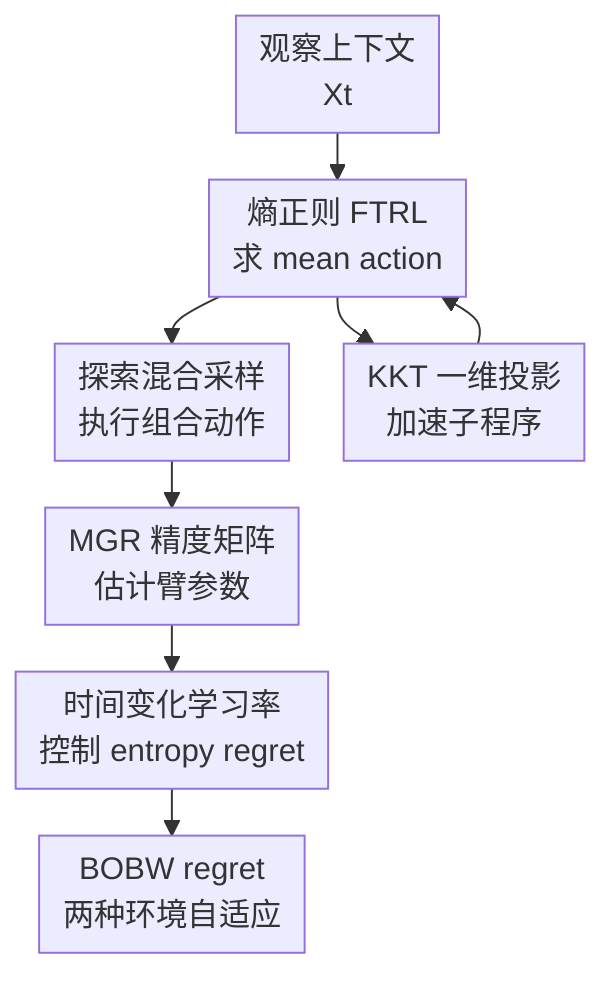

# Efficient Best-of-Both-Worlds Algorithms for Contextual Combinatorial Semi-Bandits

**会议**: ICLR 2026  
**OpenReview**: [https://openreview.net/forum?id=OW2vWSdBgW](https://openreview.net/forum?id=OW2vWSdBgW)  
**代码**: 无  
**领域**: 学习理论 / 在线学习 / Bandit  
**关键词**: 上下文组合半老虎机、best-of-both-worlds、FTRL、后悔界、Bregman 投影  

## 一句话总结
本文提出首个面向上下文组合半老虎机的 best-of-both-worlds 算法，用熵正则 FTRL 加矩阵几何重采样同时获得对抗环境下的 $\tilde O(\sqrt T)$ regret 和污染随机环境下的 $\tilde O(\ln T)$ regret，并用 KKT 条件把每轮高维投影加速成一维二分求根。

## 研究背景与动机

**领域现状**：组合半老虎机（combinatorial semi-bandits）描述的是每轮从 $K$ 个基础臂里选一个组合动作，例如推荐系统一次展示最多 $m$ 个商品或广告。与 full-bandit 只能看到总损失不同，semi-bandit 反馈会暴露被选中臂各自的损失，因此在 $m$-set 问题上可以把 minimax regret 从 full-bandit 的 $\tilde O(m\sqrt{KT})$ 改善到 $\tilde O(\sqrt{mKT})$。加入上下文后，每轮还会观察用户特征 $X_t$，每个基础臂的损失由线性模型 $\langle X_t,\theta_{t,k}\rangle$ 给出。

**现有痛点**：这个方向长期有两条线。一条线假设环境随机稳定，能得到很强的对数 regret；另一条线允许 adversarial loss，能在最坏情形下保证 $\tilde O(\sqrt T)$，但通常牺牲随机情形下的快收敛。best-of-both-worlds（BOBW）想要同一个算法在不知道环境类型的前提下同时适配两种世界，不过已有 BOBW 结果要么没有组合结构，要么没有上下文，要么需要枚举指数级策略空间，要么依赖已知上下文协方差或昂贵采样子程序。

**核心矛盾**：上下文组合半老虎机同时带来三层难点。第一，动作空间是组合动作，原始动作数量随 $m$ 指数增长；第二，上下文损失估计涉及未知协方差矩阵，不能直接把普通组合半老虎机的分析搬过来；第三，FTRL/OSMD 虽然理论上干净，但每轮要在组合动作凸包上做 $K$ 维 Bregman 投影，规模一大就变成实际部署瓶颈。

**本文目标**：作者要解决的是一个理论和计算一起卡住的问题：在一般上下文组合半老虎机中，设计一个不预先知道环境是 adversarial 还是 stochastic 的算法；在 adversarial regime 下维持 $\tilde O(\sqrt T)$ regret；在 stochastic 或 corrupted stochastic regime 下退化为对数级 regret；同时让核心投影子程序接近 FTPL 这类快速方法的每轮复杂度。

**切入角度**：本文选择以负 Shannon entropy 正则的 Follow-the-Regularized-Leader（FTRL）为主线，因为 FTRL 的稳定性分析适合做 BOBW regret 证明。上下文部分不直接求逆未知协方差，而是借用 Matrix-Geometric-Resampling（MGR）近似 precision matrix；计算部分则重新审视 m-set 投影的 KKT 条件，发现高维凸优化实际只差一个全局拉格朗日乘子，可以用一维 root finding 求出来。

**核心 idea**：用“时间变化学习率的熵正则 FTRL + 带偏差可控的 MGR 损失估计 + KKT 一维投影求解”把上下文组合半老虎机里的统计适配性和每轮计算效率同时做出来。

## 方法详解

### 整体框架

本文的方法可以分成两层。第一层是面向上下文组合半老虎机的理论算法：每轮看到上下文后，在组合动作凸包 $\mathrm{conv}(\mathcal A)$ 上运行熵正则 FTRL，得到一个 mean action，再从真实组合动作集合 $\mathcal A$ 中采样执行，并用 semi-bandit 反馈更新每个基础臂的参数估计。第二层是通用数值子程序：当 FTRL/OSMD 需要解 Bregman 投影时，利用 KKT 条件把 $K$ 维投影变成一维标量 $\lambda$ 的求根，从而把每轮更新压到近似 $\tilde O(K)$。

在交互协议里，基础臂数为 $K$，每轮最多选 $m$ 个臂，动作集合 $\mathcal A\subseteq\{A\in\{0,1\}^K:\sum_k A_k\le m\}$。环境先选择每个臂的线性损失系数 $\theta_{t,k}\in\mathbb R^d$，再抽取上下文 $X_t\sim D$；学习器观察 $X_t$ 后选组合动作 $A_t$，只看到被选中臂的损失 $\ell_t(X_t,k)=\langle X_t,\theta_{t,k}\rangle$，总损失是 $\sum_k \ell_t(X_t,k)(A_t)_k$。目标是和 hindsight 最优上下文相关动作 $u^\star(x)$ 比 pseudo-regret。

论文假设 $\mathbb E[XX^\top]=\Sigma\succ0$，$\|X\|_2\le1$，$\|\theta_{t,k}\|_2\le1$，且损失位于 $[-1,1]$。在 adversarial regime 中，$\theta_{t,k}$ 可随时间任意变化；在 stochastic regime 中，每个臂有固定未知参数 $\theta_k$ 加零均值噪声；corrupted stochastic regime 则允许 $\theta_{t,k}$ 围绕固定 $\theta_k$ 有总量为 $C$ 的污染。

### 关键设计

**1. 熵正则 FTRL：把组合动作压到 mean-action 多面体上学习**

直接在组合动作集合 $\mathcal A$ 上做指数权重会遇到指数级动作数量，因为一个 $m$-set 动作本质上是 $K$ 个基础臂的组合。本文转而在凸包 $\mathrm{conv}(\mathcal A)$ 上维护 mean action $\bar A_t(X_t)$，它的维度只有 $K$，再找一个分布 $p_t(\cdot|X_t)$ 使得 $\mathbb E_{a\sim p_t}[a]=\bar A_t(X_t)$。这一步保留了组合动作的可采样性，也让 FTRL 的正则化分析能在 $K$ 维 mean-action 空间里进行。

具体地，算法在第 $t$ 轮解

$$
\bar A_t(X_t)\in\arg\min_{a\in\mathrm{conv}(\mathcal A)}\sum_{s=1}^{t-1}\sum_{k=1}^K \langle X_t,\tilde\theta_{s,k}\rangle a_k+\psi_t(a),
$$

其中 Shannon entropy 写作 $H(a)=-\sum_k a_k\ln a_k$，正则项为 $\psi_t(a)=-H(a)/\eta_t$。负熵鼓励分布保持一定扩散，避免过早集中到少数臂；而 FTRL 的累计估计损失项又会逐渐推向低损失组合。这个张力正是 BOBW 分析需要的：对抗环境下靠稳定性控制 worst-case regret，随机环境下靠 entropy 与次优动作概率的自界（self-bounding）把 regret 压成对数级。

**2. 探索混合与 MGR 估计：在未知协方差下估计每个臂的上下文损失参数**

上下文 semi-bandit 的难点不只是选组合动作，还要从只观察被选中臂的反馈中估计每个基础臂的线性参数。若知道条件协方差 $\Sigma_{t,k}=\mathbb E[(A_t)_kX_tX_t^\top|\mathcal F_{t-1}]$，可以构造无偏估计 $\hat\theta_{t,k}=\Sigma_{t,k}^{-1}X_t\ell_t(X_t,k)(A_t)_k$；但这既要求知道或精确计算协方差，又要做 $d\times d$ 逆矩阵，计算成本和信息需求都不现实。

本文采用 Matrix-Geometric-Resampling 思路：用额外的上下文样本和动作采样近似 precision matrix。算法混合两部分策略，先从 FTRL 得到的 $p_t$ 采样，再以权重 $\alpha_t\eta_t$ 混入探索集合 $\mathcal E$ 上的均匀分布：

$$
\pi_t(a|X_t)=(1-\alpha_t\eta_t)p_t(a|X_t)+\alpha_t\eta_t\mathbf 1[a\in\mathcal E]/|\mathcal E|.
$$

探索集合要求每个基础臂至少被某个探索动作覆盖，论文为简洁取 singleton 集合 $\mathcal E=\{A\in\{0,1\}^K:\sum_k A_k=1\}$，所以 $|\mathcal E|=K$。这会把每个臂的协方差特征值从零附近托起来，保证后续近似逆矩阵不会爆炸。MGR 子程序用 $M_t=\lceil4K\ln(t)/(\alpha_t\eta_t\lambda_{\min}(\Sigma))\rceil$ 次重采样构造 $\hat\Sigma^+_{t,k}$，再令 $\tilde\theta_{t,k}=\hat\Sigma^+_{t,k}X_t\ell_t(X_t,k)(A_t)_k$。估计器不完全无偏，但 Lemma 2.3 证明了偏差对每轮任意组合动作的额外 regret 至多 $m/t^2$，总和为对数/常数量级，足以嵌入 BOBW regret 证明。

**3. 时间变化学习率与 ghost context：把对抗界和随机界接到同一个证明里**

普通固定学习率能给 adversarial 的 $\tilde O(\sqrt T)$，但在 stochastic regime 下通常只得到次优的 $\sqrt T$ 级 regret。本文的学习率由 $\eta_t=1/\beta_t$ 控制，其中 $\beta_t$ 随历史 entropy 项自适应增长，形式上包含 $\sum_{s=1}^{t}H(\bar A_s(X_s))$。直观上，若算法在随机环境里逐渐识别出最优动作，mean action 的 entropy 会下降，学习率调度与 self-bounding 分析会把“还在探索次优动作”的次数控制在对数级；若环境是对抗的，entropy 项也能进入稳定性-惩罚分解，给出 $\sqrt T$ 级上界。

证明上，作者引入独立的 ghost context $X_0\sim D$，把原始上下文序列和参数估计之间缠在一起的随机性拆开。原始 regret 被 Lemma 2.2 分解为辅助固定上下文游戏的 regret 加上估计偏差项。随后 Lemma 2.4 对辅助游戏做 FTRL regret 分解，得到依赖 $\sum_t\mathbb E[H(\bar A_t(X_0))]$ 的上界；Lemma 2.5 再把 stochastic regime 中的 entropy 和次优动作采样概率联系起来。这样一来，原本在 mean-action 空间里不够强的 entropy 控制被“提升”到动作分布空间，才能适配多臂组合选择的 self-bounding 论证。

**4. KKT 一维投影：把 FTRL/OSMD 的计算瓶颈从高维凸优化变成二分求根**

理论算法每轮都要解 $\mathrm{conv}(\mathcal A)$ 上的投影。如果直接用通用凸优化器，在 $K$ 较大时会拖慢整个在线学习流程。本文专门分析 m-set 情形，也就是每轮恰好选 $m$ 个臂，约束为 $0\le a_k\le1$ 且 $\sum_k a_k=m$。对 separable regularizer $F(a)=\sum_k f(a_k)$，OSMD/FTRL 的投影子问题是

$$
\min_{a\in\mathrm{conv}(\mathcal A)}\eta\langle a,\hat\ell_t\rangle+D_F(a,\bar A_t).
$$

写出 KKT 条件后，所有坐标之间唯一的耦合来自总和约束的拉格朗日乘子 $\lambda$。令 $c_k=\eta\hat\ell_{t,k}-f'(\bar A_{t,k})$，每个坐标满足类似 $a_k=(f')^{-1}(-\lambda-c_k)$ 的关系，并通过截断/互补松弛落回 $[0,1]$。因此原来的 $K$ 维投影等价于解一个标量方程

$$
\sum_{k=1}^K (f')^{-1}(-\lambda-c_k)=m.
$$

Algorithm 3 用二分法搜索 $\lambda$，每次评估只需扫一遍 $K$ 个臂。Theorem 3.1 说明若 $f$ 严格凸可微且 $(f')^{-1}$ 是 Lipschitz 的，二分输出的 $a$ 满足 $\|a-a^\star\|_2\le\varepsilon$；Corollary 3.2 进一步允许 $(f')^{-1}$ 只能近似求得，只要 oracle 误差 $\tau\le\varepsilon/(2\sqrt K)$ 仍能保持同样精度。由于第 $t$ 轮搜索区间宽度高概率为 $O(t)$，当 $\eta=O(1/\sqrt T)$ 时，每轮复杂度约为 $O(K\ln(\sqrt{KT}))=\tilde O(K)$。

### 一个完整示例

可以把一个推荐场景想成 $K=100$ 个候选商品、每轮展示 $m=5$ 个。第 $t$ 轮用户上下文 $X_t$ 到来后，FTRL 先根据历史估计参数 $\tilde\theta_{s,k}$ 给出一个 100 维 mean action，例如一些商品坐标接近 $0.2$，一些接近 $0.01$，总和不超过 5。这个 mean action 不是最终展示列表，而是一个边际选择概率向量；算法再构造一个分布 $p_t$，使从组合动作里采样的 5 商品列表在期望上等于这个向量。

为了避免某些商品长期没有被探索，最终采样分布不是纯 $p_t$，而是混入少量 singleton 探索集合上的均匀分布。展示后，系统只看到这 5 个商品各自的点击/损失反馈。MGR 子程序用额外抽样近似每个商品的 precision matrix，把一次局部反馈转成对 $\theta_{t,k}$ 的估计。下一轮 FTRL 用这些估计更新 mean action。若环境稳定，次优商品组合会越来越少被采样，entropy 项下降，regret 变为对数级；若竞争对手或用户偏好不断变化，FTRL 的稳定性仍给出 $\sqrt T$ 级最坏情形保护。

### 损失函数 / 训练策略

这不是监督学习模型训练论文，而是在线学习算法与 regret 分析。核心“目标函数”是每轮 FTRL/OSMD 的正则化在线优化目标：累计估计损失加熵正则 $\psi_t(a)=-H(a)/\eta_t$。采样策略使用 $\pi_t=(1-\alpha_t\eta_t)p_t+\alpha_t\eta_t\mathrm{Unif}(\mathcal E)$，其中 $\eta_t=1/\beta_t$ 随历史 entropy 自适应变化，$\alpha_t$ 与 $K$、$\ln t$、$\lambda_{\min}(\Sigma)$ 相关，用来保证探索强度足够。

主理论结果是 Theorem 2.1。adversarial regime 下，Algorithm 1 的 regret 满足

$$
R_T=O\left(m\sqrt{K\ln(K/m)T\ln T\left(d+\frac{\ln T}{\lambda_{\min}(\Sigma)}\right)}\right).
$$

在 stochastic 和 corrupted stochastic regime 下，regret 满足

$$
R_T=O\left(\frac{K\ln T\,m^{3/2}\ln((K-m)T)\left(d+\frac{\ln T}{\lambda_{\min}(\Sigma)}\right)}{\Delta_{\min}}\right),
$$

其中 $\Delta_{\min}$ 是最小次优间隔，corruption budget $C$ 只作为加性项进入并被大 $O$ 记号吸收。这个结果的含义是：同一个算法不需要知道环境类型，对抗世界里只付 $\sqrt T$ 级 regret，干净或轻度污染的随机世界里则付对数级 regret。

## 实验关键数据

### 主实验

论文的“主实验”不是下游任务精度，而是数值投影子程序的每轮运行时间。设置为 m-set 大小 $m=5$，基础臂数 $K\in\{10,\ldots,100\}$，每种算法运行 $N=25$ 次，损失向量从 $[0,1]^K$ 均匀采样，误差容忍度 $\varepsilon=10^{-7}$。比较对象包括本文二分法、Zimmert et al. (2019) 代码里的启发式 Newton 方法，以及直接调用 MOSEK 解投影。

| 设置 | 正则器 | 比较对象 | 主要结果 | 结论 |
|------|--------|----------|----------|------|
| $m=5, K=10\ldots100$ | Tsallis entropy, $f(x)=-\sqrt{x}$ | Bisection vs Newton vs MOSEK | 本文方法随 $K$ 增长保持最低运行时间曲线 | KKT 一维化适合 Tsallis 类 BOBW 正则器 |
| $m=5, K=10\ldots100$ | Negative Shannon entropy, $f(x)=x\ln x$ | Bisection vs Newton vs MOSEK | 本文方法同样最快，且趋势稳定 | 负熵 FTRL 的投影也能直接受益 |
| $K=100$ | 两类正则器 | Bisection vs Newton | 本文二分法近 10 倍更快 | 大臂数下加速更明显 |
| 全部 $K$ 范围 | 两类正则器 | Bisection vs MOSEK | 本文方法约 5 倍更快 | 通用凸优化器不适合每轮在线调用 |

### 消融实验

论文没有传统深度学习式模块消融，而是通过理论对比和数值基线说明两个关键组件各自解决的问题：BOBW regret 由 Algorithm 1 的 FTRL/MGR/学习率设计给出，计算可用性由 Algorithm 3 的投影加速给出。

| 配置 | 关键指标 | 说明 |
|------|---------|------|
| Algorithm 1: 熵正则 FTRL + MGR + 时间变化学习率 | adversarial: $\tilde O(\sqrt T)$；stochastic/corrupted: $\tilde O(\ln T)$ | 本文完整理论算法，首次覆盖上下文组合半老虎机 BOBW |
| 固定学习率式上下文组合 semi-bandit 方法 | stochastic regime 只能得到次优 $\tilde O(\sqrt T)$ 级行为 | 论文指出 Zierahn et al. (2023) 类固定 schedule 难以得到对数随机界 |
| 直接扩展线性 contextual BOBW 到组合动作 | 动作空间随组合大小指数增长，优化不可行 | 说明只靠已有线性 bandit BOBW 不能处理组合动作 |
| 通用 FTRL/OSMD 投影 | 每轮需解 $K$ 维凸优化 | 理论强但计算慢 |
| Algorithm 3 KKT 二分投影 | 每轮 $\tilde O(K)$，$K=100$ 时比 Newton 近 10 倍快 | 保留 FTRL 投影精度，同时接近 FTPL 式速度 |

### 关键发现

- 这篇论文最重要的理论发现是：上下文组合半老虎机并不必须在“对抗鲁棒”和“随机快收敛”之间二选一。只要能把估计偏差、entropy 控制和 self-bounding 分析接起来，FTRL 也能给出 BOBW regret。
- MGR 估计虽然有偏，但偏差被压到每轮 $m/t^2$ 量级，因此不会破坏总体 regret 主项。这一点很关键，因为完全无偏估计往往需要不可用的协方差信息或昂贵矩阵求逆。
- 计算实验表明，KKT 二分不是只在理论复杂度上好看；在 $K\le100$ 的 Python 实现里已经能稳定超过 Newton 和 MOSEK。对于在线推荐/广告这类每轮都要快速响应的场景，这比单纯改 regret 常数更实际。
- 局限也很明确：实验主要验证投影 runtime，没有大规模真实推荐或广告任务上的端到端 regret 曲线；理论保证与数值加速之间的连接是充分但还不是完整系统 benchmark。

## 亮点与洞察

- 论文把“BOBW regret”和“投影计算效率”放进同一篇文章处理，这一点很务实。很多 bandit 理论论文给出漂亮 regret 后默认优化 oracle 可用，而本文意识到组合 FTRL 的瓶颈就卡在每轮投影。
- ghost context 的使用很巧妙：它把上下文随机性从参数估计随机性里拆出来，让原始 regret 可以转到一个固定上下文辅助游戏里分析。对于上下文 bandit 来说，这比直接追踪 $X_t$ 与历史估计的依赖关系干净得多。
- mean-action entropy 到动作分布空间的 lift 是理论上的关键转折。组合 semi-bandit 的 entropy 若只在 $K$ 维边际上看，不足以直接得到随机环境的对数 regret；把它和次优组合动作采样概率联系起来，才让 self-bounding 技术落地。
- KKT 一维化的启发可迁移到其他 separable 约束的在线优化问题。论文也指出 partition matroid 可以按 partition 分别求一个标量乘子，总工作量仍随 $K$ 线性增长。

## 局限与展望

- 作者承认负 Shannon entropy 会在 adversarial regret 中引入额外的 $\tilde O(\ln T)$ 因子。若能设计同时兼容 MGR 偏差控制和更锋利 adversarial 分析的正则器，理论界可能还能进一步收紧。
- regret 对组合大小 $m$ 的依赖仍有改进空间，论文提到其中的 $\sqrt m$ 缩放相对已知下界并非最优。对大列表推荐或大规模组合选择，$m$ 依赖会直接影响算法是否实用。
- 算法参数仍依赖 $\lambda_{\min}(\Sigma)$、$\Delta_{\min}$ 等问题量，虽然理论上清楚，但实际系统中估计这些量并不轻松。后续可以研究更参数自适应的版本。
- 实验只覆盖合成投影 runtime，缺少真实上下文分布、真实污染过程和端到端 regret 的验证。未来若能在推荐、广告或 slate ranking 模拟器里测试，会更能说明 BOBW 性质在工程系统里的价值。

## 相关工作与启发

- **vs Zierahn et al. (2023)**: 他们用 Matrix-Geometric-Resampling 处理上下文组合 semi-bandit，能得到 adversarial 风格的 regret，但不提供 best-of-both-worlds 保证，并且每轮采样子程序有额外开销。本文继承 MGR 的估计思想，同时用时间变化学习率和更细 entropy 分析补上 stochastic/corrupted stochastic 的对数 regret。
- **vs Kuroki et al. (2024)**: 他们研究 linear contextual bandit 的 BOBW FTRL 分析，本文把类似思想推进到组合动作，但必须处理组合动作空间指数增长和 mean-action entropy 不够强的问题。关键差异在于本文需要把 mean-action 空间 lift 到动作分布空间做 refined entropy bound。
- **vs Zimmert et al. (2019) / Ito (2021)**: 这些工作在无上下文组合 semi-bandit 中用 hybrid/Tsallis 类正则器得到 BOBW 结果。本文的难点是上下文估计引入 covariance/precision matrix 问题，已有 hybrid regularizer 分析对臂级偏差控制要求过高，因此作者选择负 Shannon entropy 和 MGR 更相容的路线。
- **vs FTPL / Neu & Bartok (2016)**: FTPL 类方法速度快，因为避免了完整 Bregman 投影，但理论 regret 往往不如 FTRL 方便。本文用 KKT 二分把 FTRL 投影也做快，试图同时拿到 FTRL 的理论优势和 FTPL 接近的 per-round efficiency。

## 评分

- 新颖性: ⭐⭐⭐⭐⭐ 首个针对上下文组合半老虎机给出 BOBW regret 的结果，并额外解决 FTRL/OSMD 投影计算瓶颈。
- 实验充分度: ⭐⭐⭐ 作为理论论文，投影 runtime 实验能支撑计算贡献，但缺少端到端在线学习模拟和真实任务验证。
- 写作质量: ⭐⭐⭐⭐ 问题设定、主定理和证明路线比较清楚，但公式排布密集，读者需要熟悉 FTRL、MGR 和 self-bounding 技术。
- 价值: ⭐⭐⭐⭐⭐ 对 online learning / bandit 理论很有价值，也给大规模组合推荐系统提供了一个兼顾 regret 保证与计算效率的算法模板。

<!-- RELATED:START -->

## 相关论文

- [\[ICLR 2026\] A Near-Optimal Best-of-Both-Worlds Algorithm for Federated Bandits](a_near-optimal_best-of-both-worlds_algorithm_for_federated_bandits.md)
- [\[ICLR 2026\] Combinatorial Rising Bandits](combinatorial_rising_bandits.md)
- [\[ICLR 2026\] Semi-Parametric Contextual Pricing with General Smoothness](semi-parametric_contextual_pricing_with_general_smoothness.md)
- [\[ICLR 2026\] Variance-Dependent Regret Lower Bounds for Contextual Bandits](variance-dependent_regret_lower_bounds_for_contextual_bandits.md)
- [\[ICLR 2026\] Queue Length Regret Bounds for Contextual Queueing Bandits](queue_length_regret_bounds_for_contextual_queueing_bandits.md)

<!-- RELATED:END -->
