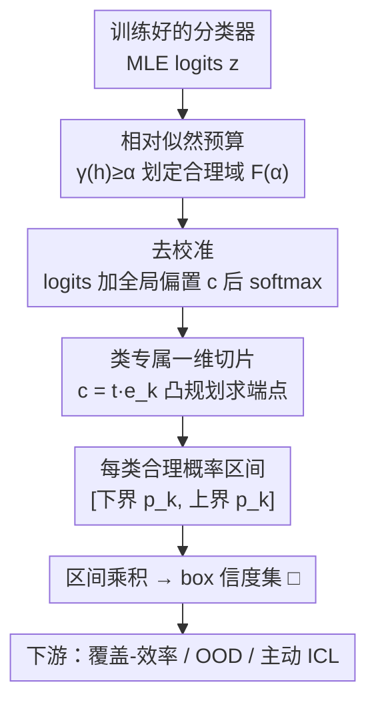

# Efficient Credal Prediction through Decalibration

**会议**: ICLR2026  
**OpenReview**: [https://openreview.net/forum?id=BqOmsYIe7M](https://openreview.net/forum?id=BqOmsYIe7M)  
**代码**: https://github.com/pwhofman/efficient-credal-prediction  
**领域**: 不确定性量化 / 信度集预测 / 概率方法  
**关键词**: credal set, 认知不确定性, 相对似然, 去校准, post-hoc

## 一句话总结
本文提出 **decalibration（去校准）**：从一个已训练好的单模型出发，仅靠对 logits 加一个全局偏置向量、在"相对似然预算"约束内反向扰动概率，就能为每个类别算出一段"合理概率区间"，从而无需重训/集成地构造出表达认知不确定性的信度集（credal set），并首次把信度预测用到了 TabPFN、CLIP 这类无法重训的大模型上。

## 研究背景与动机
**领域现状**：安全攸关场景里，模型不仅要预测得准，还要会"说自己不知道什么"。不确定性被拆成两类——偶然不确定性（aleatoric，数据本身的随机性，不可消除）和认知不确定性（epistemic，知识不足导致，可随数据增多而减少）。标准概率分类器只输出一个分布 $p(\cdot\mid x)$，能表达偶然不确定性，但无法表达"我对这个分布本身有多没把握"。信度集（credal set，即单纯形上的一个凸概率分布集合）正是为表达认知不确定性而生：它不输出单个分布，而输出一族"都说得通"的分布。

**现有痛点**：现有信度集的构造几乎都很贵。主流做法要么训练深度集成（CreWra、CreEns、CreNet）、要么跑贝叶斯后验采样（CreBNN）、要么用相对似然准则重训一批模型（CreRL）。这些 pipeline 动辄要训练 10 个模型，对基础模型、多模态系统这种"训一次都难"的架构根本不现实——而这些恰恰是最需要可靠不确定性的地方。

**核心矛盾**：信度集有三个理想性质——(i) 统计上有依据、(ii) 语义透明、(iii) 对大模型计算可行。L\u00f6hr et al. (2025) 的相对似然方法已经满足了 (i)(ii)：用似然比作为先验无关、数据驱动的"证据尺度"，并把它归一化得到嵌套、可解释的 α-cut。**真正没解决的是 (iii) 计算可行性**：构造 α-cut 还是要训一堆模型去命中规定的似然比，而且这些模型往往挤在 MLE 附近，除非 α≈1，对大模型完全不适用。

**本文目标**：在**保留相对似然语义**的前提下，把信度集的构造从"训练一堆模型"变成"对单模型输出做一次廉价探索"。

**切入角度**：作者借用了概率分类器**校准（calibration）**的思路并把它反过来用。校准是把概率"调得更对"（更贴近真实），那么——能不能反向操作，看一个类的概率最多能被推离 MLE 多远、还不至于"不合理"（相对似然掉到 α 以下）？这就是去校准。

**核心 idea**：用"给 logits 加全局偏置 + softmax"这一极简变换，在相对似然预算 α 内系统性地把单模型的概率往"次优但仍被数据支持"的方向推，推到的极值就构成每个类的合理概率区间，区间的乘积（box）就是信度集——全程不重训、不集成、只需 logits。

## 方法详解

### 整体框架
方法叫 **EffCre**（Efficient Credal prediction）。输入是一个训练好的概率分类器（其极大似然解 $h_{\mathrm{ML}}$）在训练集和查询点上输出的 logits，输出是查询点 $x_q$ 上的一个 box 信度集 $\square_{x,\alpha}$。整条 pipeline 不碰模型参数，只在输出空间做文章：先用相对似然给"什么样的概率才算合理"划一条线（预算 α），再对 logits 做受控扰动去试探每个类概率的上下界，最后把各类区间拼成信度集。

核心是把经典的"似然比球内的模型都合理"这一观点，从**参数空间的搜索**改写成**输出空间的 post-hoc 探索**。因为预算施加在训练似然上，任何被生成出来的概率向量都仍被数据支持到所选的证据等级。

### 关键设计

**1. 相对似然预算：用似然比给"合理"划线，而不是靠先验或启发式**

要让"合理概率"有统计依据，作者沿用相对似然。设 $L(h)$ 是假设 $h$ 在训练集上的经验似然，定义相对似然 $\gamma(h)=L(h)/\sup_{h'}L(h')\in[0,1]$：MLE 处 $\gamma=1$，拟合越差 $\gamma$ 越小，且 $-2\log\gamma(h)$ 正是经典的似然比统计量。给定阈值 $\alpha\in(0,1]$，所有"合理模型"构成 α-cut $C_\alpha=\{h:\gamma(h)\ge\alpha\}$，其在预测空间的像 $Q_{x,\alpha}$ 再取各类的逐类极值 $\underline{p}_k=\inf_{h\in C_\alpha}p_k$、$\overline{p}_k=\sup p_k$，就得到 box 信度集 $\square_{x,\alpha}=\{p:\underline{p}_k\le p_k\le\overline{p}_k\}$。它先验无关、数据驱动，且有清楚的语义："在不牺牲超过 α 比例训练似然的前提下可达的概率"。论文还证明了单调性（Prop. 2.1）：α 越大，集合越嵌套、区间越紧——这正好对应评测里的**覆盖-效率权衡**（coverage 是真实分布 $p^\star$ 落在集合里的概率；efficiency 用 $1-\tfrac1K\sum_k(\overline p_k-\underline p_k)$ 衡量，区间越窄越好），用户调 α 就能在两者间取点。

**2. 去校准：对 logits 加全局偏置，把概率推离 MLE 又不越界**

这是全文的发动机。要在不重训的情况下探索 α-cut，作者从 $h_{\mathrm{ML}}$ 出发，刻意把预测概率往"似然更低"的方向扭，但用预算 α 兜底不让它变得不合理。具体实例化为一个极简且富表达力的变换：给每个样本（训练和测试都一样）的 logits 加同一个全局偏置向量 $c\in\mathbb{R}^K$，再做 softmax：

$$p_j^{(n)}(c)=\frac{\exp(z_j^{(n)}+c_j)}{\sum_k\exp(z_k^{(n)}+c_k)},\qquad p_j(x;c)=\frac{\exp(z_j(x)+c_j)}{\sum_k\exp(z_k(x)+c_k)}.$$

记训练对数似然的变化 $\Delta\ell(c)=\sum_n[\log p^{(n)}_{y^{(n)}}(c)-\log p^{(n)}_{y^{(n)}}(0)]$，合理域就是 $F(\alpha)=\{c:\Delta\ell(c)\ge\log\alpha\}$。直观上 $c$ 在类间做"受控的几率倾斜"。这个选择的妙处全在于它带来的良好结构：不需要梯度、不动表示、模型无关，因此天然适用于推理-only、API 封闭、参数冻结的大模型。

**3. 凸性结构：让上界变成单个凸优化、合理域紧致可控**

作者证明（Prop. 3.1）$\Delta\ell(c)$ 是 $C^\infty$ 且**凹**的（Hessian 是负半定的协方差型矩阵 $-\sum_n[\mathrm{Diag}(p^{(n)})-p^{(n)}p^{(n)\top}]$），且沿 $\mathrm{span}\{1\}$ 平移不变（softmax 对 $c\mapsto c+t\mathbf 1$ 不变，给出可辨识超平面 $S=\{c:\mathbf 1^\top c=0\}$）。由此 $F(\alpha)$ 是凸集、在 $S$ 上紧致。测试目标 $\log p_k(x;c)$ 同样凹，于是**上界 $\overline p_k$ 是单个凸规划的最优值**、解在 $S$ 上唯一（模去常向量）。但下界 $\underline p_k$ 一般**非凸**——只能在 $F_S(\alpha)$ 的边界/极点上取到，且可能有多个全局极值，彻底探索会很贵，反而违背"高效"的初衷。这正是下一个设计要救的火。

**4. 类专属一维切片：把偏置限制成 $c=t\,e_k$，上下界都退化为标量凸规划**

为绕开下界非凸的难题，作者只允许沿单个坐标方向扰动，即 $c=t\,e_k$（只动第 $k$ 类的 logit）。此时问题降到一维：$\Delta\ell_k(t)=\Delta\ell(t\,e_k)$ 严格凹，可行集 $F_k(\alpha)=\{t:\Delta\ell_k(t)\ge\log\alpha\}$ 退化成一个区间 $[t_k^-,t_k^+]$；而 $t\mapsto p_k(x;t\,e_k)$ 在 $\mathbb{R}$ 上严格单调递增（Cor. 3.1）。于是**该类概率的上下界就直接是区间两端点的取值**：$\underline p_k=p_k(x;t_k^-e_k)$、$\overline p_k=p_k(x;t_k^+e_k)$，端点本身由两个标量凸规划（或对 $\Delta\ell_k(t)=\log\alpha$ 做二分）求得。这一步把原本需要边界探索的非凸难题，变成"解两个一维方程"，是 EffCre 比集成方法快几个数量级的根本原因。全文实验都用这个一维设定，保证上下界都凸、box 信度集干净可解。

### 损失函数 / 训练策略
方法本身**不涉及任何训练**——这是它的核心卖点。所有计算都是 post-hoc 的凸优化/二分求根，只需要模型在训练集和测试点上的 logits。唯一的"超参"是相对似然预算 $\alpha\in(0,1]$，用来在覆盖与效率之间取操作点。

## 实验关键数据

### 主实验
在覆盖-效率、OOD 检测、in-context learning、零样本分类四类任务上验证，对比当前 SOTA 信度预测基线（CreWra / CreEns / CreBNN / CreNet / CreRL）。

| 任务 | 数据/模型 | EffCre 表现 | 对比基线 |
|------|-----------|-------------|----------|
| 覆盖-效率 | CIFAR-10（+CIFAR-10H 真实分布） | 高覆盖区 Pareto 占优 CreRL；全程占优 CreBNN/CreWra/CreNet | 基线只能停在低覆盖或高覆盖单一区域 |
| 覆盖-效率 | ChaosNLI | 高覆盖区≈CreRL，低覆盖区≈CreEns，可遍历全区间 | 基线无法横跨两区 |
| OOD 检测 | ResNet18 / CIFAR-10 → SVHN等5个OOD集 | AUROC 略低于基线，但**训练时间从数小时降到≈0**（post-hoc） | 基线需训 10 个集成成员 |
| ICL | TabPFN / TabArena | 小集合常含真实分布；主动 ICL 优于随机采样 | 基线无法应用（需重训+原始训练数据） |
| 零样本 | CLIP/SigLIP/SigLIP-2 / CIFAR-10 | 达到高覆盖+高效率区 | 基线计算上不可行 |

最突出的结论：EffCre 在**覆盖-效率曲线上能横跨从低到高覆盖的整个区间**（用户随意指定操作点），而每个基线只能覆盖其中一段；同时把计算量降低**几个数量级**。

### 消融实验

| 配置 | 关键观察 | 说明 |
|------|---------|------|
| α 扫描（覆盖-效率） | α↑ → 覆盖↓、效率↑（嵌套收紧） | 验证 Prop. 2.1 的单调性，α 即操作旋钮 |
| α=0 验证 | 仍能生成足够稠密的集合 | 检验方法能否触达合理概率区间的边缘 |
| 一维 vs 全耦合偏置 | 全文用一维（上下界都凸）；全耦合下界非凸留作 open | 一维是高效性与可解性的关键取舍 |
| 不确定性度量 | 熵型 EU 与 zero-one EU 都用于主动 ICL | zero-one 度量在类似任务上被证明有效 |

### 关键发现
- **去校准 + 一维切片**是高效性的来源：避免了下界非凸的昂贵边界探索，把信度集构造降到解一维凸规划。
- 在 OOD 上 AUROC 略逊基线，但作者论点是"基线靠 10 个模型换来的微弱优势在大模型上根本付不起这个成本"——EffCre 几乎零额外训练。
- 首次让 **TabPFN（in-context 表格基础模型）和 CLIP 系列 VLM** 拥有了信度集，这些架构此前因无法重训/无训练数据而被信度预测完全拒之门外。
- 定性上，EffCre 能区分认知不确定性（如"船在船坞里"这种被 MLE 误分的反常上下文，各类都给宽区间）与偶然不确定性（如猫狗难辨的姿态，真实分布在两类间分摊）。

## 亮点与洞察
- **"校准的反向操作"这个视角很巧**：把成熟的概率校准技术反过来，得到一个零训练、模型无关的不确定性构造器——是什么都不用改、只在输出端加偏置，却拿到了原本要训一堆模型才有的认知不确定性表达。
- **凸性是被设计出来的，不是碰巧的**：选"全局偏置 + softmax"而非任意 post-hoc 映射，正是因为它让训练对数似然的变化凹、合理域凸；再用一维切片把下界也救成凸，整套方法的可解性是从变换族的选择一路推导出来的。
- **可迁移性强**：任何只能拿到 logits 的冻结/API 模型（LLM、多模态编码器）都能套用这套 post-hoc 信度预测，这对工业界封闭大模型的不确定性需求很实用。
- **credal spider plot**：为可视化 >3 类的区间型信度集提出的蛛网图，可叠加 MLE 预测与真实分布做直接对比，是一个顺手的工程产物。

## 局限与展望
- **只实现了一维（类专属）变体**：全耦合的多 logit 情形仍开放——上界还是凸的，但下界非凸，需要可靠的松弛/证书/近似方案，作者明确把它列为未来方向。
- **OOD 上略逊**：精度换来的是数量级的效率，但在不在乎训练成本的小模型场景里，集成基线的 AUROC 仍略高。
- **开放词表多模态模型带来新挑战**：CLIP 这类在推理时才定标签集的模型，不确定性应同时反映预测、标签选择和 prompt 选择三重来源——现有 credal 形式化和评测协议都还没覆盖这一层。
- **box 是外近似**：$\square_{x,\alpha}$ 保留了所有逐类极值但是 $Q_{x,\alpha}$ 的外近似，可能略微高估集合体积。

## 相关工作与启发
- **vs CreRL (L\u00f6hr et al., 2025)**：同样用相对似然语义，但 CreRL 仍要训练（带早停的）一批模型去命中似然比；EffCre 把这一搜索搬到单模型的 logit 输出空间做 post-hoc 探索，效率高几个数量级，且在高覆盖区 Pareto 占优。
- **vs 集成型（CreWra / CreEns / CreNet）**：它们靠聚合多个预测器或区间头网络构造信度集，需完整训练每个成员；EffCre 零额外训练、模型无关，能用到它们根本跑不动的大模型上。
- **vs 贝叶斯型（CreBNN）**：贝叶斯后验采样继承了先验敏感性和高计算负担；EffCre 先验无关、数据驱动，且实验中能 Pareto 占优 CreBNN。
- **vs 单前向 / 证据型 UQ（如 evidential Dirichlet head、距离特征）**：那些方法估的是普通不确定性、且证据型近来受质疑；EffCre 给的是有相对似然语义、可解释的**信度集**，填补了"高效信度预测"这一此前空白。

## 评分
- 新颖性: ⭐⭐⭐⭐⭐ 把校准反过来做去校准、用单模型 logit 偏置 + 相对似然预算构造信度集，思路新且自洽
- 实验充分度: ⭐⭐⭐⭐ 覆盖-效率/OOD/ICL/零样本四类任务 + TabPFN/CLIP 大模型展示，唯 OOD 精度略逊
- 写作质量: ⭐⭐⭐⭐⭐ 理论命题与直觉穿插清晰，凸性结构推导严谨
- 价值: ⭐⭐⭐⭐⭐ 首次让基础模型/VLM 拥有可负担的认知不确定性表达，实用价值高

<!-- RELATED:START -->

## 相关论文

- [\[ICML 2026\] Learning Credal Ensembles via Distributionally Robust Optimization](../../ICML2026/learning_theory/learning_credal_ensembles_via_distributionally_robust_optimization.md)
- [\[ICLR 2026\] Conformal Prediction for Long-Tailed Classification](conformal_prediction_for_long-tailed_classification.md)
- [\[ICLR 2026\] Distribution-informed Online Conformal Prediction](distribution-informed_online_conformal_prediction.md)
- [\[ICLR 2026\] Branch and Bound Search for Exact MAP Inference in Credal Networks](branch_and_bound_search_for_exact_map_inference_in_credal_networks.md)
- [\[ICLR 2026\] Multiple-Prediction-Powered Inference](multiple-prediction-powered_inference.md)

<!-- RELATED:END -->
