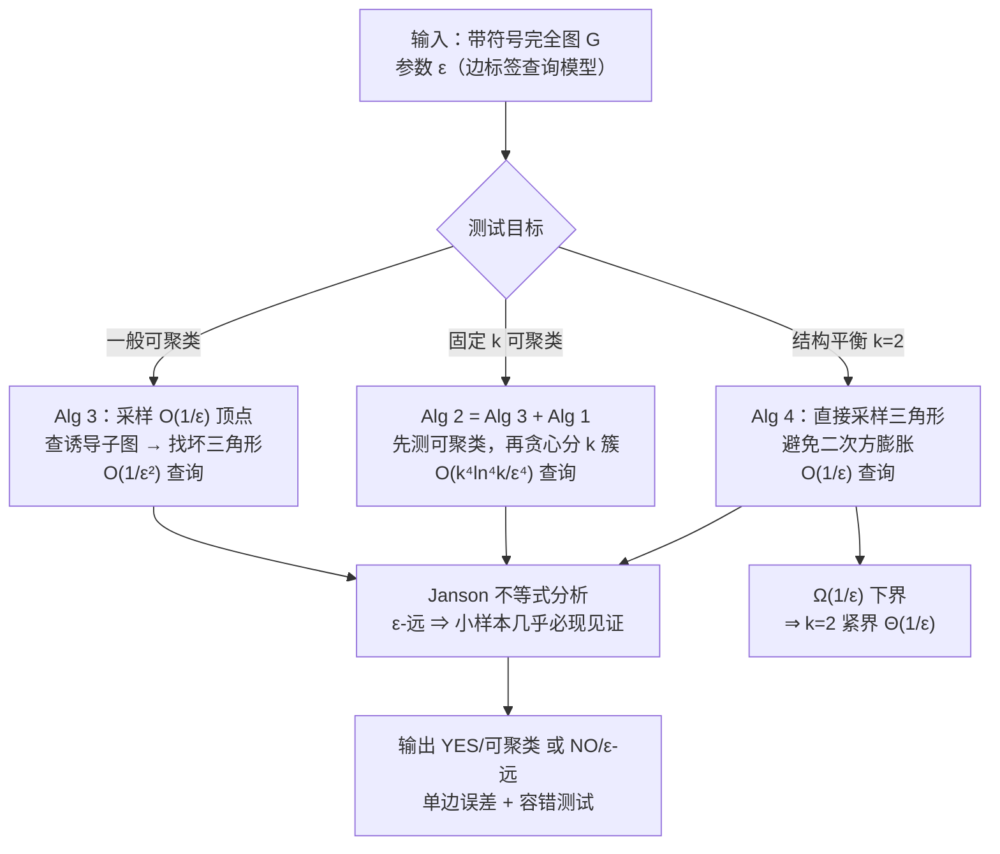

# Efficient Testing for Correlation Clustering: Improved Algorithms and Optimal Bounds

**会议**: ICLR 2026  
**OpenReview**: [https://openreview.net/forum?id=3AFchYEwRQ](https://openreview.net/forum?id=3AFchYEwRQ)  
**代码**: 匿名 GitHub（论文中提供，正式版待确认）  
**领域**: 学习理论 / 性质测试（Property Testing）/ 相关聚类  
**关键词**: 相关聚类, 性质测试, 亚线性算法, 结构平衡, Janson 不等式, 紧界  

## 一句话总结
本文用「采样小子图 + Janson 不等式」的新分析框架，把判定一张带符号完全图能否（近似）完美聚类的查询复杂度从 $\tilde{O}(1/\varepsilon^7)$ 一举降到 $O(1/\varepsilon^2)$，并首次给出固定 $k$ 聚类的 $O(1/\varepsilon^4)$ 测试器和结构平衡（$k=2$）的 $\Theta(1/\varepsilon)$ 紧界。

## 研究背景与动机
**领域现状**：相关聚类（correlation clustering）把数据集建模成带 $(+)/(-)$ 标签的完全图 $G=(V,E^+\cup E^-)$，最优聚类是让「跨簇正边 + 簇内负边」总数最小的划分。它在文档摘要、图像分割、社交网络社区发现里都有应用；$k=2$ 的特例正好对应社会学里的「结构平衡」（strong structural balance）——稳定的带符号网络能被划成两组，组内全是朋友、组间全是敌人。

**现有痛点**：绝大多数工作聚焦于「算出/逼近最优聚类」，但只要把划分写出来就得花 $\Omega(n)$ 时间。在海量网络场景下，我们往往只想知道「这张图离完美聚类有多远」这一个标量，而不必看清整张网络。这把问题推向了**性质测试**：用 $o(n)$ 次边标签查询，区分「图本质上可聚类」与「图离可聚类至少差 $\varepsilon\binom{n}{2}$ 条边」。

**核心矛盾**：此前最接近的亚线性结果（Adriaens & Apers 2023）需要 $\tilde{O}(1/\varepsilon^7)$ 次查询。其分析依赖图移除引理（graph removal lemma），常数是 $\varepsilon$ 的塔函数级别，松到几乎不可用——$\varepsilon=0.01$ 时约需 $10^{14}$ 次操作（>2.5 小时）。同时，固定 $k$ 的测试此前**完全没有**非平凡算法，所有这些上界也都**没有匹配的下界**，紧不紧没人知道。

**本文目标**：把测试相关聚类成本的查询复杂度做到尽可能小、理想情况下达到紧界，并补齐固定 $k$ 的空白。

**核心 idea**：作者发现**算法本身可以很简单**（均匀采样 $O(1/\varepsilon)$ 个顶点，看诱导子图里有没有"坏三角形"即可），真正的难点在分析。**关键武器是把随机图理论里的 Janson 不等式首次引入性质测试分析**——它能在"见证结构（witness）相互共享顶点、彼此不独立"时仍给出强尾界，从而绕开移除引理的塔函数常数，得到 $1/\text{poly}(\varepsilon)$ 的样本复杂度。

## 方法详解

### 整体框架
全文围绕三类测试任务，复用一个共同的"采样—见证"骨架：对一般可聚类性，采样 $O(1/\varepsilon)$ 个顶点查其诱导子图（$O(1/\varepsilon^2)$ 条边）找坏三角形；对固定 $k$，在前者基础上叠加一个"贪心分簇"子程序；对 $k=2$（结构平衡），换成**直接采样三角形**避免二次方膨胀，做到 $O(1/\varepsilon)$ 并配下界证明其最优。三者的正确性都靠 Janson 不等式来保证"图若 $\varepsilon$-远，小样本里几乎必现见证结构"。

### 关键设计

**1. 用 Janson 不等式替换移除引理，做一般可聚类性测试（Theorem 1）**：一张图可聚类当且仅当不含"坏三角形"（两条 $(+)$ 边、一条 $(-)$ 边）。算法就是均匀采 $O(1/\varepsilon)$ 个顶点、查其诱导子图（约 $O(1/\varepsilon^2)$ 条边）、检查有没有坏三角形——简单到几乎平凡。难点是证明"若 $G$ 是 $\varepsilon$-远，则小样本里以高概率出现坏三角形"。直接用 Fox 的彩色图移除引理只能给出 $\tilde{O}(\text{tower}(\log(1/\varepsilon)))$ 这种塔函数级上界；归约到 MAX-CSP 也只有 $\tilde{O}(1/\varepsilon^7)$ 的双边误差算法。作者改用 Janson 不等式 $\Pr[X=0]\le\exp\!\big(\min\{-\lambda+\Delta,\,-\tfrac{\lambda^2}{\lambda+2\Delta}\}\big)$，其中 $\lambda=\mathbb{E}[X]$ 是样本中见证（坏三角形/正路径连负边）的期望个数、$\Delta$ 度量见证间因共享顶点带来的相关性。当 $\Delta$ 相对 $\lambda$ 小时退化成 Chernoff 式 $e^{-\lambda}$，相关性高时给出 $e^{-\lambda^2/2\Delta}$ 的衰减。正因为能精细控住"重叠项 $\Delta$"，样本复杂度被压到 $O(1/\varepsilon^2)$，且算法是**单边误差**（可聚类一定答 YES），同时天然支持容错测试（$C\varepsilon^2$-接近也答 YES）。

**2. "测可聚类 + 贪心分簇"两段拼装做固定 $k$ 测试（Theorem 2）**：判定 $k$-可聚类比一般可聚类多了"簇数不超 $k$"这一约束。作者把它拆成两个单边算法跑两遍：先用 Alg 3 以更严的参数 $\delta=\varepsilon^2/(10^6 k^2\ln^2 k)$ 确认图足够接近可聚类；再用 Alg 1 在"已假设可聚类"前提下贪心地把采样顶点往 $k$ 个桶里塞——对每个采样点 $u$，逐个查它和现有簇代表的边，遇到第一条正边就并入该簇，若对所有簇都无正边就开新簇，一旦需要的簇数超过 $k$ 就答 NO。关键引理（Lemma 3.2）保证：若图只是 $\delta$-接近可聚类、采样规模 $s\le\frac{1}{10\sqrt\delta}$，则采样子图以 $\ge 99/100$ 概率"看不到任何被翻转的假边"——因为单条假边被采中的概率 $\le s^2/n^2$，对 $\le\delta\binom{n}{2}$ 条假边做并集界后总概率 $\le 1/100$。于是 Alg 1 在"近可聚类"图上和在"真可聚类"图上行为无法区分，正确性得以保留。整体查询 $O(k^4\ln^4 k/\varepsilon^4)$，常数 $k$ 时即 $O(1/\varepsilon^4)$，是该设定下第一个非平凡测试器。

**3. 直接采样三角形 + 下界，做结构平衡（$k=2$）的紧界（Theorem 3/4/5）**：$k=2$ 即结构平衡，稳定三角形只有"三正边"或"两负一正"两种。这里作者不再采顶点子图（会引入 $1/\varepsilon^2$ 的二次方膨胀），而是**直接采样三角形**来找"不平衡三角形"这一见证，把查询压到 $O(1/\varepsilon)$；而且容错保证更强——能区分 $\delta$-接近平衡（$\delta\approx O(\varepsilon)$，具体 $\delta\le\varepsilon/900$）与 $\varepsilon$-远，而前两个任务只能做到 $O(\varepsilon^2)$-接近。最后用 Yao 式构造证明 $\Omega(1/\varepsilon)$ 的下界（Theorem 5），且该下界对一般 $k$ 和固定 $k$ 都成立。上下界相遇，给出该问题家族**第一组紧界** $\Theta(1/\varepsilon)$。

## 实验关键数据

### 主实验表格（$\varepsilon=0.1$，合成图）

| 算法 | 准确率 | 查询复杂度（采样边数） | 单图运行时间 |
|------|--------|------------------------|--------------|
| 测一般 CC（Alg 3） | 1.0 | 10000 | 23.8 s |
| 测固定 $k$ CC（Alg 1） | 1.0 | 1610 | 22.5 s |
| 测结构平衡（Alg 4） | 1.0 | 60 | $1.3\times10^{-4}$ s |
| 结构平衡基线 Adriaens & Apers (2023) | 1.0 | 900 | 1.1 s |

> 结构平衡上，本文采样规模约为基线的 $1/15$，运行时间约快 $10^4$ 倍。准确率全为 1.0，与单边误差的理论一致。

### 消融 / 扩展性实验（Alg 3，$\varepsilon=0.1$，随 $n$ 扩展）

| 图规模 $n$ | 10000 | 20000 | 30000 | 40000 | 50000 |
|-----------|-------|-------|-------|-------|-------|
| 纯测试算法耗时 (s) | 0.011 | 0.013 | 0.015 | 0.17 | 0.20 |
| 总耗时（含采样，log） | 4.51 | 6.36 | 7.81 | 9.89 | 12.03 |

> 查询复杂度理论上不含 $n$，因此测试核心耗时几乎不随规模增长（$10^4\to5\times10^4$ 只从 0.011 涨到 0.20 s）；瓶颈反而在采样等外围流程的总耗时上。

### 关键发现
- **合成图**：用 7 种扰动方案（Pure / Uniform-noise / Hetero-noise / Cycle / Half-flip / Cluster-swap / Mixed-flip，共 140 个实例，$n=5000,k=5$）构造可控 ground-truth $\varepsilon$，所有测试器准确率达 1.0；$\varepsilon$ 从 0.05 扫到 0.5 时准确率始终 $>0.95$，而 Alg 4 在小 $\varepsilon$ 下效率优势尤其明显。
- **真实图**：在 SNAP 的 6 张真实网络（社交/金融/协作/通信，规模 500–10000，正边=有连接、负边=无连接）上，测试输出随 $\varepsilon$ 增大从"NO"平滑相变到"YES"；结构平衡的相变比一般 CC 更清晰，且相变点恰好落在用带符号 Laplacian 最小特征值估出的 $\varepsilon$ 下界之后，佐证了测试正确性。所有真实图实验耗时 $<0.1$ s，且观察到所有真实图的 $\varepsilon$-远都 $\le0.3$。

## 亮点与洞察
- **把"难点从设计搬到分析"讲得很透**：性质测试问题的算法常常本就简单（Goldreich & Trevisan），本文坦诚地说贡献主要在分析而非算法，并兑现了"换一个更锋利的分析工具就能砍掉 5 个数量级"的承诺。
- **首次把 Janson 不等式用进性质测试分析**，绕过移除引理的塔函数常数，给出比"图移除引理"更细粒度的子图测试分析路径，作者明确指出这套分析可能对其它性质测试问题有独立价值。
- **同时拿到上界改进、固定 $k$ 的首个结果、$k=2$ 的紧界（含下界）**，一篇论文把这个问题家族的理论图景基本补完整。

## 局限与展望
- **模型假设强**：工作建立在「带标签完全图 + 邻接矩阵查询」模型上。论文末尾自己指出，更贴近现实的是「只有部分边被标注的一般带标签图」，把结果推广到该设定是公开方向。
- **常数与外围开销**：理论常数为证明方便取得很大（实验里手动压到 $\le3$）；扩展性实验也显示，真正主导大规模耗时的是采样等外围流程而非测试核心，工程化仍有空间。
- **Addendum 的尴尬**：作者在 2026 年 4 月才发现 Goldreich & Ron (2011) 的 clique-collection 问题与本文本质等价，已隐含 $\tilde\Theta(1/\varepsilon)$ 紧界及非适应性测试的 $\Theta(1/\varepsilon^{4/3})$ 界——这削弱了"首次紧界"的部分新颖性，不过本文的 Janson 分析路线与之不同，仍具方法论价值。

## 相关工作与启发
- **亚线性相关聚类测试**：最接近的 Adriaens & Apers (2023) 用 $\tilde{O}(1/\varepsilon^7)$ 查询，并研究了更难的有界度图模型（$\tilde{O}(\sqrt n/\text{poly}(\varepsilon))$）；Chen et al. (2024) 给出量子版本。本文在邻接矩阵查询模型下把上界推进到 $O(1/\varepsilon^2)$ 并配下界。
- **流式与数据结构方向**：Bonchi et al. (2013) 给出支持簇成员查询的 $O(1/\varepsilon^2)$ 数据结构（$3\text{OPT}+\varepsilon n^2$）；Assadi et al. (2023)、Ashvinkumar et al. (2023) 在流模型下测试 CC/结构平衡成本。
- **求解（而非测试）相关聚类**：LP、pivot 类、agreement decomposition 等主流技术（Bansal、Ailon、Chawla、Cohen-Addad 等系列）都需 $\Omega(n)$ 时间写出解，与本文的 $o(n)$ 测试形成对照。
- **启发**：当某个性质测试问题被移除引理"卡"在塔函数常数上时，换用随机图理论里能处理"相关见证"的工具（Janson 不等式）可能是打破僵局的通用思路；这条经验对其它子图/三角形相关的测试问题或可迁移。

## 评分
- **新颖性**: ⭐⭐⭐⭐ — 首次把 Janson 不等式引入性质测试分析，指数级砍查询并补齐固定 $k$、紧界等空白；扣分在于 Addendum 暴露的与 Goldreich & Ron (2011) 的部分重叠。
- **实验充分度**: ⭐⭐⭐⭐ — 合成（7 方案 140 实例）+ 6 张真实图 + 扩展性，准确率与相变结构都对得上理论；但缺真实带标签符号网络、baseline 仅一个。
- **写作质量**: ⭐⭐⭐⭐ — 定理陈述清晰、对比表直观、坦诚标注"贡献在分析"和 Addendum，可读性好。
- **价值**: ⭐⭐⭐⭐ — 把相关聚类测试的理论上下界基本封口，且提供了一条可迁移的分析工具线，对性质测试社区有较强参考价值。

<!-- RELATED:START -->

## 相关论文

- [\[NeurIPS 2025\] Improved Approximation Algorithms for Chromatic and Pseudometric-Weighted Correlation Clustering](../../NeurIPS2025/learning_theory/improved_approximation_algorithms_for_chromatic_and_pseudometric-weighted_correl.md)
- [\[ICLR 2026\] Testing Fourier Sparsity via Implicit Sensing](testing_fourier_sparsity_via_implicit_sensing.md)
- [\[ICLR 2026\] Mean Estimation from Coarse Data: Characterizations and Efficient Algorithms](mean_estimation_from_coarse_data_characterizations_and_efficient_algorithms.md)
- [\[NeurIPS 2025\] Learning-Augmented Streaming Algorithms for Correlation Clustering](../../NeurIPS2025/learning_theory/learning-augmented_streaming_algorithms_for_correlation_clustering.md)
- [\[ICLR 2026\] Sublinear Spectral Clustering Oracle with Little Memory](sublinear_spectral_clustering_oracle_with_little_memory.md)

<!-- RELATED:END -->
