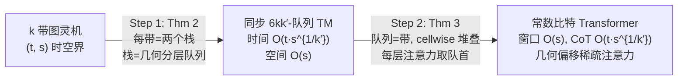

# Efficient Turing Machine Simulation with Transformers

**会议**: ICLR 2026  
**OpenReview**: [https://openreview.net/forum?id=bxVuILo1xx](https://openreview.net/forum?id=bxVuILo1xx)  
**代码**: 无（纯理论论文）  
**领域**: 学习理论 / Transformer 可表达性  
**关键词**: 图灵完备性, 链式思维, 常数比特 Transformer, 稀疏注意力, 多队列图灵机  

## 一句话总结
本文证明常数比特 Transformer 能在最优 $O(s(n))$ 上下文窗口下，仅用每步 $O(s(n)^c)$（$c$ 可任意小）的链式思维就模拟任意多带图灵机，把已有构造的 $\Omega(s(n))$ 每步开销几乎抹平，并指出固定几何偏移的稀疏注意力即足以支撑高效通用计算。

## 研究背景与动机

**领域现状**：近年一批工作证明了 Transformer 的图灵完备性——只要给足够长的上下文窗口和链式思维（CoT）步数，Transformer 就能模拟任意图灵机。其中 Li & Wang (2025) 更进一步证明：即便是**常数比特 Transformer**（参数个数与精度都与输入长度无关的常数），也是图灵完备的。这说明 Transformer 的推理能力在原理上是"通用"的。

**现有痛点**：图灵完备只解决了"能不能"，没解决"快不快"。已有所有常数/对数精度构造（见下表）在模拟一步图灵机时，都要付出可观的 CoT 开销。Li & Wang (2025) 虽然拿到了最优的 $O(s(n))$ 上下文窗口（恰好等于推理所需内存量），但模拟单步 TM 要消耗 $\Omega(s(n))$ 个 CoT 步，导致总 CoT 长度高达 $O(t(n)\cdot s(n))$。对很多问题这个 $s(n)$ 倍的拖慢是灾难性的——理论 CoT 长度远超实际观察到的推理步数。

| 来源 | 精度 | 维度 | 窗口 | 总 CoT |
|---|---|---|---|---|
| Pérez et al. (2021) | $O(\log t)$ | $O(1)$ | $n+t$ | $O(t)$ |
| Li et al. (2024) | $O(1)$ | $O(\log t)$ | $O(t\log t)$ | $O(t\log t)$ |
| Li & Wang (2025) | $O(1)$ | $O(1)$ | $s(n)$ | $O(t\cdot s)$ |
| **本文** | $O(1)$ | $O(1)$ | $s(n)$ | $O(t\cdot s^c)$ |

**核心矛盾**：要同时拿到三个"最优"——常数比特、最优 $O(s(n))$ 窗口、最优 CoT 步数，三者此前无法兼得；窗口压到最优就必然牺牲每步速度。

**本文目标**：在不牺牲常数比特与最优窗口的前提下，把每步拖慢从 $s(n)$ 降到 $s(n)^c$，其中 $c>0$ 可通过加大 Transformer 的"头—层乘积"（注意力头数 × 层数）做到任意小。

**核心 idea**（**多队列桥接 + 几何分层栈**）：Li & Wang (2025) 用单队列图灵机（Post 机）作为 TM 与 Transformer 之间的桥梁；本文把桥梁推广为**多队列图灵机**，并设计出一种用几何增长的分层队列高效模拟栈的方法，使每步摊还开销骤降，同时构造天然呈现"几何偏移稀疏注意力"模式。

## 方法详解

### 整体框架
证明分两步走，中间以**同步多队列图灵机**作桥。第一步（本文主要技术新意）把多带 TM 高效归约为同步多队列 TM；第二步沿用并推广 Li & Wang (2025) 的技术，把同步多队列 TM 编译成常数比特 Transformer。两步串起来即得主定理。

主定理（Theorem 1）：任意 $(t(n),s(n))$ 时空界的 $k$ 带 TM，可被一个头—层乘积为 $K$、上下文窗口 $s(n)+1$ 的常数比特 Transformer 模拟，每步 TM 仅需 $O(s(n)^{6k/K})$ 个 CoT 步，总 CoT 长度 $O(t(n)\cdot s(n)^{6k/K})$。令 $c=6k/K$，加大 $K$ 即可使 $c$ 任意小。

### 关键设计

**1. 几何分层队列模拟栈（Step 1 的核心，Theorem 2）**：把每条带拆成两个栈，再用 $k'$ 层、尺寸呈几何级数增长的队列来模拟一个栈——第 $i$ 层是大小 $2\lceil s^{1/k'}\rceil^i$ 的内容队列（拆成左右两个半队列）外加一个同尺寸缓冲队列。内容队列维持"一段真实符号 + 一段哑符号"的不变式，栈顶始终落在第 1 层真实与哑符号的边界处，更深的栈元素存到更高层。压栈时把新符号塞进第 1 层第一个哑格，若该层满了就把一半内容下移到第 2 层，满则再往上递归；弹栈则从第 1 层删最后一个真实符号，空了就从上层回灌。妙处在于**高层队列大得多但访问得稀疏得多**：一次基本压/弹只花 $O(s^{1/k'})$，第 $i-1$ 与第 $i$ 层之间的搬运虽花 $O(s^{i/k'})$ 但每 $O(s^{(i-1)/k'})$ 步才发生一次，摊还下来每步仅 $O(s^{1/k'})$。于是模拟 $t(n)$ 步只需 $O(t(n)\cdot s^{1/k'})$ 时间、总队列空间 $O(s)$。

**2. 同步模型下的三重改进**：本文坚持用更严格的**同步**多队列模型——每个队列每步都恰好弹出一个、压入一个元素，不允许"空转"。相比 Hühne (1993) 允许队列空转的宽松模型，本文同时做到：(i) 把结果推到更严格的同步模型，(ii) 把空间复杂度从 $t(n)^{1+1/k'}$ 压到 $s(n)$，(iii) 把时间拖慢从 $t(n)^{1/k'}$ 降到 $s(n)^{1/k'}$。同步性是后续 Transformer 编译能成立的关键前提——它保证每个队列尺寸在执行中固定不变，从而可被定长上下文窗口精确容纳。

**3. cellwise 堆叠 + 分组注意力把队列 TM 编进 Transformer（Step 2，Theorem 3）**：把每个队列看作一条向右无限、左端有界、带"前/后两个磁头"的带，队列内容即两磁头之间的带段；每步前磁头先读、两磁头同时右移一格、后磁头再写。$K$ 条带按 cellwise 堆叠——Transformer 上下文里第 $i$ 个 token 记录所有 $K$ 条带的第 $i$ 个格，后磁头指向的格对应最新 token。词表设为 $V=\Sigma^K\times Q$，让 token 同时携带 TM 状态。为实现转移函数 $\delta$，把 $K$ 个队列分成 $L$ 组、每组 $H=K/L$ 个；第 $\ell$ 个解码层用 $H$ 个注意力头分别从历史 token 里取出第 $\ell$ 组各队列的队首符号，当前状态从当前 token 取出，再用前馈网络实现 $\delta$。由于队列尺寸固定，窗口 $O(s_{\max})$ 即可装下全部内容，CoT 步数压到 $O(t(n))$。

**4. 几何偏移稀疏注意力是天然副产品**：上述构造中，每个 query 只注意到固定相对位置上的少数 token——偏移取几何级数 $\lceil s^{1/k'}\rceil, \lceil s^{1/k'}\rceil^2,\dots,\lceil s^{1/k'}\rceil^{k'}$（即每个 token 只看 $1,2,4,8,\dots,2^i$ 步之前）。这意味着每个 CoT token 可在 $O(1)$ 时间生成，模拟 TM 仅带来 $O(s^c)$ 的每步拖慢，而非全注意力的 $t(n)$ 开销。该模式与实证观察到的"注意力稀疏且空间聚集、多数头关注局部、少数头捕捉结构化长程连接"高度吻合，也呼应了 LogSparse Transformer、PowerAttention 等实践设计——从理论上佐证了"指数稀疏注意力可在保持通用计算能力的同时提升效率"。

## 实验关键数据

本文为**纯理论论文**，无实证实验，核心贡献为定理与构造性证明。关键量化结论以复杂度形式给出：

### 主结果对比

| 指标 | Li & Wang (2025) | 本文 |
|---|---|---|
| 精度 / 维度 | $O(1)$ / $O(1)$ | $O(1)$ / $O(1)$ |
| 上下文窗口 | $s(n)$（最优） | $s(n)$（最优） |
| 每步 CoT 开销 | $\Omega(s(n))$ | $O(s(n)^c)$，$c=6k/K$ 可任意小 |
| 总 CoT 长度 | $O(t(n)\cdot s(n))$ | $O(t(n)\cdot s(n)^c)$ |
| 单 token 生成时间 | 依赖全注意力 | $O(1)$（几何偏移稀疏） |

### 关键发现
- **可调权衡**：每步开销指数 $c=6k/K$ 随头—层乘积 $K$ 增大而趋零。取实际规模 $K=6\times10^3$、$k=2$，则对所有 $s(n)\le 2^{500}$，几何公比 $\lceil s^{6k/K}\rceil=2$——即在现实参数下偏移就退化为标准的 $1,2,4,8,\dots$ 二进制间隔，几乎覆盖一切实际可达的空间界。
- **Step 1 的三重改进**：同步模型 + 空间 $t^{1+1/k'}\!\to\! s$ + 时间 $t^{1/k'}\!\to\! s^{1/k'}$，是相对 Hühne (1993) 的核心技术增量；其中"空间从依赖运行时间 $t$ 改为只依赖空间界 $s$"是后续 Transformer 拿到最优窗口的前置条件。
- **两带即足够**：作者指出聚焦 $k=2$ 是自然的，因为 2 带 TM 仅以对数级拖慢就能模拟多带 TM，使主结论在最实用的设定下依然成立。
- **架构启示**：全注意力的二次时间复杂度并非 Transformer 表达力的本质瓶颈；稀疏几何偏移注意力即可保留计算通用性，这对"长上下文吞吐瓶颈"的普遍担忧给出了反例式的理论回应。

### 复杂度小结
- 第一步代价：$O(t(n)\cdot s(n)^{1/k'})$ 时间、$O(k\cdot s(n))$ 空间，$k'=K/(6k)$。
- 第二步代价：窗口 $O(s_{\max})$、CoT $O(t(n))$，头—层乘积恰好等于队列数 $K$。
- 复合后：窗口 $s(n)+1$、总 CoT $O(t(n)\cdot s(n)^{6k/K})$，与最优窗口同时达成。

## 亮点与洞察
- **把"图灵完备"从定性推进到定量**：以往工作回答"Transformer 能模拟 TM 吗"，本文回答"要多慢"，并几乎抹平了最关键的 $s(n)$ 每步开销，三个最优指标（常数比特 / 最优窗口 / 近最优 CoT）首次同时拿到。
- **多队列桥比单队列桥更强**：把 Li & Wang 的 Post 机桥推广到多队列，让"头—层乘积"这一架构资源直接转化为模拟效率，给出了一条清晰的"加资源换速度"的连续旋钮。
- **理论与实践的双向印证**：构造自发涌现的几何偏移稀疏注意力，恰好对上了 LogSparse、PowerAttention 等工程设计与注意力可视化中的"局部 + 稀疏长程"现象，为这类稀疏架构提供了"不损失通用性"的理论背书。
- **几何分层栈的摊还分析**很优雅——用"层越高越大但访问越稀"换来每步 $O(s^{1/k'})$ 摊还开销，是整篇证明的技术支点。

## 局限与展望
- **纯表达性结果，无可学习性保证**：作者明确指出本文只谈"存在这样的 Transformer"，标准训练流程能否真正学到这种几何偏移行为是开放问题，且尚无任何实证实验。
- **每步开销未到 $O(1)$**：$c$ 可任意小但不为零，能否把每步拖慢进一步压到常数仍未解决。
- **非标准位置编码依赖已知空间界**：构造用的相对 PE 随 $n$ 演化且假设空间界 $s(n)$ 预先已知；当空间界未知时如何设计能动态自适应的位置编码，是作者列出的未来方向。
- **模型假设较理想**：同步多队列、hardmax、cellwise 堆叠等假设虽合理但与真实 LLM 仍有距离。

## 相关工作与启发
- **图灵完备性谱系**：Pérez et al. (2021)、Bhattamishra et al. (2020)、Merrill & Sabharwal (2024)、Li & Wang (2025) 等逐步把精度/维度压到常数；本文是这条线上"效率"维度的最新进展。
- **形式语言表达力**：Hahn (2020)、Strobl et al. (2024) 综述从语言识别角度刻画 Transformer 能力上下界，与本文的"计算复杂度"视角互补。
- **多队列/多带机理论**：Hühne (1993)、Petersen (2013) 的队列—带模拟结果是 Step 1 的直接前身，本文在同步性、时间、空间三方面改进。
- **高效推理实践**：与缓解 overthinking 的长度惩罚 RL、变长 SFT、latent reasoning 等遥相呼应——本文从理论侧说明"短 CoT + 稀疏注意力"在原理上足够强，可为这些工程方向提供信心。
- **启发**：几何偏移稀疏注意力或许是一个被低估的架构方向，值得在真实 LLM 上验证其"高效 + 通用"的双重承诺。

## 评分
- **新颖性**: ⭐⭐⭐⭐⭐ 把图灵完备性从定性推进到接近最优的定量结果，多队列桥与几何分层栈都是实打实的新构造。
- **实验充分度**: ⭐⭐ 纯理论论文，无任何实证实验，作者亦自陈这是局限。
- **写作质量**: ⭐⭐⭐⭐ 复杂度对照表清晰、两步证明结构干净、摊还分析直观，理论叙述可读性强。
- **价值**: ⭐⭐⭐⭐ 既深化了对 Transformer 推理能力极限的理论理解，又为稀疏注意力架构提供了通用性背书，对理论与架构设计两端都有启发。

<!-- RELATED:START -->

## 相关论文

- [\[ICLR 2026\] Softmax Transformers are Turing-Complete](softmax_transformers_are_turing-complete.md)
- [\[ICLR 2026\] Transformers Are Inherently Succinct](transformers_are_inherently_succinct.md)
- [\[ICLR 2026\] Quantum Machine Learning Advantages Beyond Hardness of Evaluation](quantum_machine_learning_advantages_beyond_hardness_of_evaluation.md)
- [\[ICLR 2026\] Probability Distributions Computed by Autoregressive Transformers](probability_distributions_computed_by_autoregressive_transformers.md)
- [\[ICLR 2026\] Quantitative Bounds for Length Generalization in Transformers](quantitative_bounds_for_length_generalization_in_transformers.md)

<!-- RELATED:END -->
