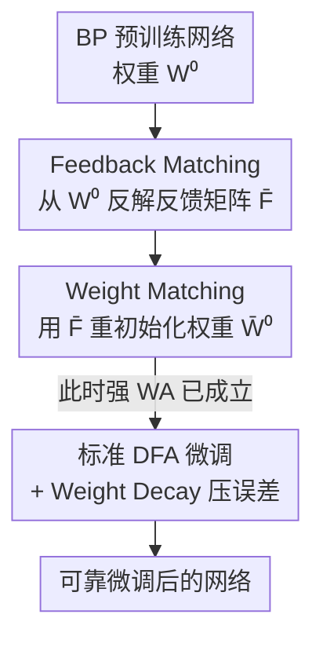

# Enabling Fine-Tuning of Direct Feedback Alignment via Feedback-Weight Matching

**会议**: ICLR 2026  
**OpenReview**: [https://openreview.net/forum?id=ASwAmbKJHr](https://openreview.net/forum?id=ASwAmbKJHr)  
**代码**: https://github.com/eai-lab/FeedbackWeightMatching  
**领域**: 学习理论 / 生物可信训练 / 无反向传播训练  
**关键词**: Direct Feedback Alignment, 微调, 权重对齐, 梯度对齐, 反向传播替代

## 一句话总结
本文提出 feedback-weight matching：先从反向传播预训练好的权重里重构出 DFA 的反馈矩阵、再用反馈矩阵反过来重新初始化权重，让 DFA 在微调一开始就处于"强权重对齐"状态，从而第一次让 DFA 能稳定可靠地微调全连接网络与 Transformer（图像分类比标准 DFA 高 7.97%，NLP 相关性从 0.10 升到 0.76）。

## 研究背景与动机

**领域现状**：Direct Feedback Alignment（DFA）是反向传播（BP）的一种生物更可信的替代训练机制。BP 要把输出层误差逐层、串行地往回传，存在"权重传输"（weight transport）和"反向锁定"（backward locking）两个问题；DFA 则用一组随机反馈矩阵 $F_l$ 把全局输出误差 $e=\hat y-y$ 直接传到每一层，各层梯度 $\delta W^{DFA}_l=-[(F_l e)\odot g'(a_l)]h_{l-1}^\top-\lambda_t W_l$ 可以并行计算，省去串行回传，训练更高效。

**现有痛点**：但 DFA 长期只被用来"从零训练"全连接网络，几乎没人用它做微调（fine-tuning，即把一个预训练好的网络适配到新任务）。已有研究指出，用 DFA 微调 BP 预训练的网络非常不稳定、性能远不如 BP 微调——甚至有工作发现"DFA→BP 的切换是稳的，但 BP→DFA 的切换会训崩、且大量 epoch 后也恢复不了"。这意味着 DFA 几乎用不上"预训练-微调"这个当今最实用的范式。

**核心矛盾**：DFA 学得好不好，取决于两个量——权重对齐（Weight Alignment, WA）和梯度对齐（Gradient Alignment, GA）。当满足强 WA，即 $W_l\propto F_l F_{l-1}^\top$ 时，DFA 的梯度方向会和 BP 的梯度方向对齐（强 GA），DFA 就能学得像 BP 一样好。从零训练时，随训练推进 DFA 会自然走向强 WA。但**预训练权重是 BP 学出来的、和随机反馈矩阵 $F_l$ 之间没有这种代数关系**，于是直接拿标准 DFA 去微调，强 WA 条件几乎不可能满足（本文 Prop 3.3），导致弱 GA、微调失败。

**本文目标**：让 DFA 在微调时也能进入强 WA→强 GA 的良性区间，从而第一次实现可靠的 DFA 微调。

**切入角度**：既然失败的根因是"反馈矩阵和预训练权重不匹配"，那就不要被动等对齐，而是**主动制造对齐**——让反馈矩阵和权重在微调开始前就满足 $W_l\approx F_l F_{l-1}^\top$。

**核心 idea**：用预训练权重重构反馈矩阵（feedback matching），再用反馈矩阵重新初始化权重（weight matching），把强 WA 直接"配"出来；再叠加 weight decay 进一步压低输出误差。

## 方法详解

### 整体框架
方法要解决的是"BP 预训练权重 + 随机反馈矩阵"两者代数上不匹配、导致 DFA 微调进不了强对齐区间的问题。整体流程是一条短而清晰的预处理流水线：拿到 BP 预训练网络后，**不直接微调**，而是先做两步配对——(1) 从预训练权重 $W^0_l$ 反解出一组反馈矩阵 $\bar F_l$（feedback matching），(2) 再用这组 $\bar F_l$ 把权重重新初始化成 $\bar W^0_l$（weight matching）——使得 $\bar W^0_l\propto \bar F_l\bar F_{l-1}^\top$ 在第 0 步就成立（强 WA）；然后才用**标准 DFA**从 $\bar W^0_l$ 开始微调，并配合 weight decay 进一步降低输出误差。整条管线只动初始化、不改 DFA 本身的更新规则，所以即插即用。

这里有一个贯穿全文的"诊断透镜"：WA 与 GA。WA 衡量权重和反馈矩阵之间的代数对齐（强 WA：$W_l\propto F_l F_{l-1}^\top$），GA 衡量 DFA 梯度与 BP 梯度的方向相似度（$\cos\angle(G^{DFA},G^{BP})$）。本文的所有设计都是围绕"在微调开局就把 WA 顶满、从而把 GA 也顶满"展开的。

### 关键设计

**1. 用 WA/GA 透镜诊断"DFA 为何微调失败"**

这是后续所有设计的出发点：本文第一次把 WA、GA 这套原本用于分析"从零训练"的工具搬到微调场景，给出了失败的代数证据。它针对的痛点是"大家只知道 DFA 微调不行、但说不清为什么"。论文证明（Prop 3.3）：从 BP 预训练权重 $W^0_l$ 出发、配任意随机反馈 $F_l$ 做标准 DFA，强 WA 条件 $W^t_{1<l<L}\propto F_l F_{l-1}^\top$、$W^t_L\propto F_{L-1}^\top$ **大概率不成立**。机理在于：从零训练时，对齐矩阵 $A^t_{l\ge2}$ 会随训练逐渐趋于单位阵的倍数（$A^t_{l\ge2}\propto I$），自然把网络推向强 WA；但微调是从一个"已经长好的" BP 权重出发，这个自发收敛过程不再成立，于是 WA 弱、GA 也弱，梯度方向偏离 BP，微调学不动。这一诊断把问题从"经验上不行"变成了"代数上为什么不行"，并直接指明解法应当作用在初始化上。

**2. Feedback Matching：从预训练权重里反解出反馈矩阵**

针对"随机反馈矩阵和预训练权重不匹配"这一根因，第一步不再随机生成反馈矩阵，而是让反馈矩阵去**拟合**预训练权重。具体地（Def 3.4 / Eq. 6），构造 $\bar F_l$ 使得

$$\bar F_l\bar F_{l-1}^\top\approx W^0_{1<l<L},\qquad \bar F_{L-1}^\top\equiv W^0_L.$$

也就是把中间层预训练权重 $W^0_l$ 分解成相邻两层反馈矩阵的乘积，可以用 SVD 这类传统矩阵分解、也可以直接优化一个重构目标来求解。这一步的意义是"把预训练知识搬进反馈矩阵"：反馈矩阵不再是与任务无关的随机量，而是携带了预训练权重的结构信息，为下一步制造强 WA 准备好原料。

**3. Weight Matching：用反馈矩阵反过来重新初始化权重**

光有匹配的反馈矩阵还不够，强 WA 是权重和反馈矩阵之间的关系，所以第二步（Def 3.5 / Eq. 7）反过来把预训练权重 $W^0_l$ 重新初始化为 $\bar W^0_l$，让它去匹配刚重构出的 $\bar F_l$。经过这步，微调一启动就有 $\bar W^t_{1<l<L}\propto\bar F_l\bar F_{l-1}^\top$、$\bar W^t_L\propto\bar F_{L-1}^\top$（Eq. 8），即**强 WA 在第 0 步就成立**，而不像标准 DFA 那样要靠运气慢慢对齐（且微调时根本对不上）。论文进一步证明（Prop 3.8）feedback-weight matching 不止经"强 WA→强 GA"间接生效，还能**直接**抬高 GA：在两层线性网络首层上 $\cos_{FWM}\angle(F_1,W^t_2)\ge\cos_{DFA}\angle(F_1,W^t_2)$。feedback matching 负责"保住预训练知识"，weight matching 负责"把这份知识摆成 DFA 学得动的姿势"，两步合起来才是完整的 feedback-weight matching。

**4. Weight Decay：在匹配基础上进一步压低输出误差**

最后一块拼图是 weight decay。以往只知道 weight decay 能缓解 DFA 的过拟合，本文第一次分析它在 DFA 微调里的作用，并证明它在 feedback-weight matching 之上还能**进一步降低网络输出误差**。对两层非线性网络（Prop 4.2），输出误差满足

$$\|e_{t+1}\|\le\Big(1-\tfrac{\eta\gamma}{4}-\eta\lambda_t\Big)\|e_t\|+\lambda_t\|y\|-\alpha_2 r_2,$$

并猜想可推广到 $L$ 层（Eq. 14，多出 $-\sum_{l=2}^{L}\alpha_l r_l$ 项）。其中 $r_l$（Lemma 4.1）刻画"重初始化后的权重比原预训练权重更接近收敛轨迹"，是非负的。关键在于：weight decay 本身会带来 $\lambda_t\|y\|-\eta\lambda_t\|e_t\|$ 这个**增大误差**的副作用，而正是 feedback-weight matching 带来的 $\sum_l\alpha_l r_l$ 项把这个副作用抵消掉，使 weight decay 净效果转为降低误差。换句话说，weight decay 之所以在 DFA 微调里成为"关键助推器"，前提是先做了 feedback-weight matching——两者是配套的。

### 损失函数 / 训练策略
方法不改 DFA 的损失与更新规则，只改初始化：feedback matching + weight matching 作为微调前的一次性预处理，之后用标准 DFA 的梯度 $\delta W^{DFA}_l$ 训练；weight decay 系数 $\lambda_t$ 作为关键超参与之配合。反馈矩阵的重构既可用 SVD，也可用优化目标求解。

## 实验关键数据

### 主实验
覆盖三类设置：4/6 层全连接网络的图像分类、BERT-Tiny/Small 的 NLP（GLUE）、ViT-Tiny/Small 的图像分类。对比对象是标准 DFA 微调（DFAfine）与 DFA 从零训练（DFAscratch）。

| 任务 | 模型 / 设置 | 指标 | 标准 DFA | 本文 DFAours |
|------|------------|------|---------|-------------|
| 图像分类 CIFAR-100→SVHN | 6 层全连接 | Acc | 74.70 | **82.67**（+7.97） |
| NLP STSB | BERT-Small | Pearson | 0.10 | **0.76** |
| NLP CoLA | BERT-Small | Matthews | 0.06 | **0.53** |
| NLP CoLA | BERT-Tiny | Matthews | 0.00 | **0.29** |
| NLP MRPC | BERT-Small | Acc | 70.9 | **92.5** |
| 图像分类 ImageNette | ViT-Small | Acc | 0.210 | **0.319** |
| 图像分类 STL-10 | ViT-Small | Acc | 0.111 | **0.247** |

图像分类上本文平均比标准 DFA 高 2.16%，且**网络越深优势越明显**：CIFAR-100→SVHN 从 4 层到 6 层，本文精度只掉 0.20%，而标准 DFA 掉 4.85%（差距约 24 倍），说明 feedback-weight matching 让 DFA 对深度更鲁棒。NLP 上在小样本数据集（CoLA、STSB、MRPC）增益最大，因为这些任务高度依赖预训练权重，而本文恰好把预训练知识保住了；标准 DFA 在 STSB/CoLA 上甚至完全学不动（相关性 ~0）。

### 消融 / 机理验证
本文没有传统模块消融表，而是用 WA/GA 曲线验证机理（Fig. 2）。

| 配置 | WA / GA | 训练-测试精度 | 说明 |
|------|---------|--------------|------|
| DFAours（feedback-weight matching） | 开局即强 WA、随后强 GA | 收敛更快更稳、精度最高 | 与理论分析一致 |
| DFAfine（标准 DFA） | WA/GA 显著偏低 | 几乎不从预训练权重提升 | BERT-Small 上基本不动 |
| DFAscratch | Transformer 上 WA/GA 更低 | — | 注意力操作干扰对齐 |

### 关键发现
- **强 WA→强 GA→好微调这条因果链被曲线证实**：本文方法一开始就把 WA 顶满，GA 随之上去，训练/测试精度比标准 DFA 提升最多约 0.27；标准 DFA 的 WA/GA 起步就低，即使个别情况慢慢升上来，开局的低对齐已经拖垮了微调。
- **Transformer 是更难的场景**：注意力里的 key/query/value 投影层无法直接做对齐，但只对其后的 dense 层做对齐就能显著改善 WA、GA 和整体性能——这是本文第一次把 DFA 微调成功用到 BERT/ViT 上（连从零训练 DFA 都极少能上 Transformer）。
- **越深越依赖匹配**：标准 DFA 随深度退化，本文方法几乎不退化，印证"强 WA 初始化"对深层网络尤其关键。

## 亮点与洞察
- **"主动制造对齐"而非"被动等待对齐"**：从零训练时强 WA 是自发涌现的，本文洞察到微调时这个自发过程失效，于是用一次代数构造（分解+重初始化）把强 WA 直接配出来——把一个"训练动力学现象"变成了"初始化操作"，非常巧妙且零额外训练开销。
- **双向匹配是精髓**：先用权重造反馈矩阵、再用反馈矩阵造权重，两步互为镜像，既保住预训练知识又满足 DFA 的对齐条件，单做任意一步都不够。
- **weight decay 的"配套"结论可迁移**：weight decay 单独用在 DFA 上会增误差，只有在匹配之后才净降误差——这提醒我们正则项的效果高度依赖初始化/几何结构，类似思路可用于分析其他无 BP 训练算法。
- 用 WA/GA 当统一诊断透镜，把"为什么失败、怎么修、修得对不对"串成一条可证可测的链条，方法论值得借鉴。

## 局限与展望
- **理论只到两层网络**：误差下降的严格证明（Prop 4.2）只在 $L=2$ 的两层网络上给出，$L$ 层是 Conjecture 4.3 的猜想；$r_l$ 依赖重构权重导致一般情形难以严格分析，作者自己也承认只能靠实验佐证。
- **只覆盖全连接 / Transformer 的 dense 层**：方法的对齐构造针对全连接层，注意力的投影层（key/query/value）无法直接对齐，CNN 等架构未涉及，DFA 在卷积上的老问题没有解决。
- **绝对性能仍不及 BP**：本文把 DFA 微调从"不可用"拉到了"可用"，但 ViT 上精度（如 ImageNette 0.319）距离 BP 微调仍有明显差距，定位更偏"让 DFA 微调成为可能"的概念验证。
- 反馈矩阵重构用 SVD 还是优化、两者代价与精度的权衡，正文着墨不多，可进一步研究。

## 相关工作与启发
- **vs 标准 DFA（Nøkland, 2016）**：标准 DFA 用与权重无关的随机反馈矩阵，从零训练时能自发对齐，但微调 BP 权重时对不齐而失败；本文用预训练权重反解反馈矩阵并重初始化权重，开局即强 WA，把 DFA 第一次带进微调范式。
- **vs FA + weight decay（Song et al., 2021）**：前者分析的是"从零训练 FA"时 weight decay 能降误差；本文第一次在"DFA 微调"场景分析 weight decay，并指出它必须与 feedback-weight matching 配套才能净降误差。
- **vs WA/GA 分析（Refinetti et al., 2021）**：他们提出 WA/GA 并分析从零训练的对齐动力学；本文把这套工具迁移到微调，证明微调下强 WA 不会自发出现，必须人为构造。

## 评分
- 新颖性: ⭐⭐⭐⭐⭐ 第一个让 DFA 可靠微调（含 Transformer）的方法，"反解反馈矩阵+反向重初始化"的双向匹配思路新颖。
- 实验充分度: ⭐⭐⭐⭐ 覆盖全连接/BERT/ViT 三类设置且有 WA/GA 机理曲线，但缺与 BP 微调的直接对照、绝对性能仍偏弱。
- 写作质量: ⭐⭐⭐⭐ 理论与动机讲得清楚，definition/proposition 体系完整；多步证明放附录、$L$ 层结论靠猜想，阅读门槛偏高。
- 价值: ⭐⭐⭐⭐ 为生物可信、无 BP、可并行的训练打开了"预训练-微调"这一实用范式，方向价值高于当前绝对性能。

<!-- RELATED:START -->

## 相关论文

- [\[ICLR 2026\] Online Learning and Equilibrium Computation with Ranking Feedback](online_learning_and_equilibrium_computation_with_ranking_feedback.md)
- [\[ICLR 2026\] Lipschitz Bandits with Stochastic Delayed Feedback](lipschitz_bandits_with_stochastic_delayed_feedback.md)
- [\[ICLR 2026\] Online Conformal Prediction with Adversarial Semi-bandit Feedback via Regret Minimization](online_conformal_prediction_with_adversarial_semi-bandit_feedback_via_regret_min.md)
- [\[ICML 2026\] Formalizing Learning from Language Feedback with Provable Guarantees](../../ICML2026/learning_theory/formalizing_learning_from_language_feedback_with_provable_guarantees.md)
- [\[ICLR 2026\] Toward Practical Equilibrium Propagation: Brain-Inspired Recurrent Neural Network with Feedback Regulation and Residual Connections](toward_practical_equilibrium_propagation_brain-inspired_recurrent_neural_network.md)

<!-- RELATED:END -->
