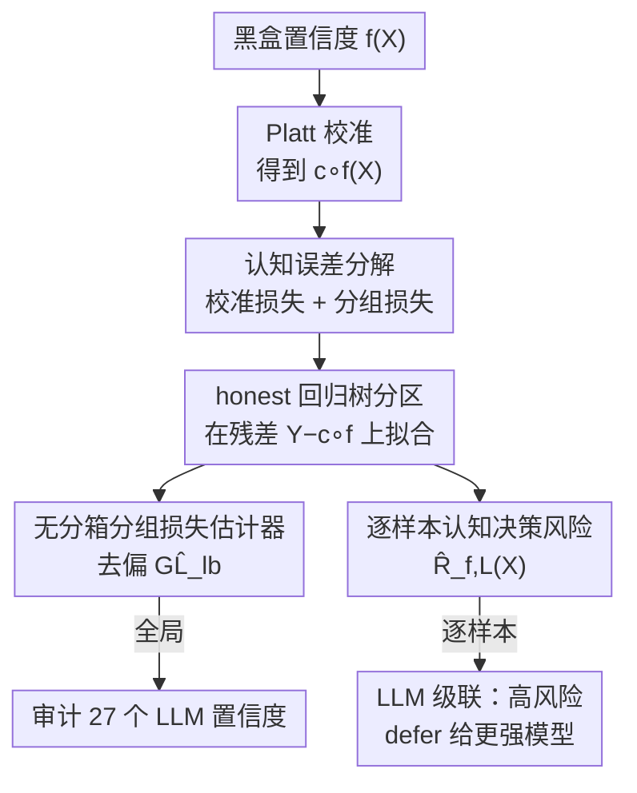

# Epistemic Uncertainty Quantification To Improve Decisions From Black-Box Models

**会议**: ICLR2026  
**OpenReview**: [https://openreview.net/forum?id=JfiwaTxhI8](https://openreview.net/forum?id=JfiwaTxhI8)  
**代码**: 待确认  
**领域**: 学习理论 / 不确定性量化  
**关键词**: 认知不确定性, 分组损失, 校准, 决策风险, LLM 级联

## 一句话总结
本文提出一组**无分箱、渐近一致、样本高效**的估计器，用来量化黑盒模型校准之外残留的认知不确定性——分组损失（grouping loss）和逐样本超额决策风险，并用它审计 27 个开源 LLM 的置信度可靠性、构造按认知风险触发 deferral 的 LLM 级联，在更低成本下拿到更高准确率。

## 研究背景与动机
**领域现状**：要让 AI 系统可信，必须区分两类不确定性——**偶然不确定性（aleatoric）**来自任务本身的随机性（信息不足时连最优预测器也无法确定，如"这个病人半年内会复发吗"），**认知不确定性（epistemic）**来自模型自身的无知（没用好已有信息）。区分两者很关键：偶然不确定性该如实报告，而认知不确定性指明了模型"还能在哪里改进"——全局改进靠补数据微调，局部改进靠把决策交给人类专家或更强（但更贵）的模型。

**现有痛点**：现有评估指标各抓一角且都不完整。准确率/AUC 只衡量预测信号，检测不出过/欠自信；**proper scoring rules**（Brier 分数、log loss）能选出认知误差最小的模型，但不能**量化**残留的认知误差；**校准（calibration）**虽能比对置信度与真实频率，却只是"平均意义上"的控制——一个模型可能整体校准良好，却在某些子群上过自信、在另一些子群上欠自信，两者在平均中相互抵消。

**核心矛盾**：对一个已校准的模型，残留的认知误差恰恰来自**误差的异质性**——模型把真实概率不同的输入归并到了同一个置信度水平。这部分被称为**分组损失（grouping loss）**，是校准指标系统性漏掉的那一块。但已有的分组损失估计器（Perez-Lebel et al., 2023）靠对置信度分箱再算箱内方差，分箱边界阻断了信息跨箱共享、且同一箱对应的输入在特征空间里可能是断开的子集，样本效率差。

**本文目标**：(1) 给出**无分箱**且渐近一致的分组损失估计器；(2) 给出**逐样本**的认知决策风险估计器（不只是平均到 level set）；(3) 把这套估计落到 LLM 置信度审计与级联决策上。

**核心 idea**：用一个**精心选择的分区（partition）**——具体是在校准后残差 $Y-c\circ f(X)$ 上拟合的 honest 回归树——来局部估计真实后验概率与校准分数之差，从而绕开分箱，直接估出分组损失和逐样本超额决策风险。

## 方法详解

### 整体框架
方法要解决的核心问题是：在只能观测到离散标签 $Y$、拿不到真实后验 $f^*(X)=P[Y=1\mid X]$ 的前提下，量化一个黑盒置信度 $f$ 在校准之外残留的认知误差。整体思路分两层——先建立"分解"把认知误差里校准漏掉的部分（分组损失）显式化，再用一个共享的"分区估计"机器把这部分以及逐样本决策风险估出来，最后把估计结果用于审计与级联。

整条 pipeline 是：拿到黑盒置信度 → Platt scaling 校准得到 $c\circ f$ → 在残差 $R=Y-c\circ f(X)$ 上拟合一棵 honest 回归树（叶子即分区）→ 用各叶子的去偏统计量算出分组损失估计 $\widehat{GL}_{lb}$ 与逐样本超额风险 $\widehat{R}_{f,L}(X)$ → 把全局估计用于跨模型审计、把逐样本估计用于级联 deferral。

### 关键设计

**1. 把认知误差拆开：分组损失才是校准漏掉的那块**

本文的出发点是一个分解定理（Theorem 1，源自 Kull & Flach, 2015）：对任意 proper scoring rule $\phi$，期望损失可拆为

$$\underbrace{E[d_\phi(f(X),Y)]}_{\text{期望损失}}=\underbrace{\underbrace{E[d_\phi(f(X),c\circ f(X))]}_{\text{校准损失 CL}}+\underbrace{E[d_\phi(c\circ f(X),f^*(X))]}_{\text{分组损失 GL}}}_{\text{认知损失 EL}}+\underbrace{E[d_\phi(f^*(X),Y)]}_{\text{偶然损失}}$$

其中 $c\circ f(X)=E[Y\mid f(X)]$ 是校准后的分数。这个式子点明：**认知损失 = 校准损失 + 分组损失**，校准指标只覆盖了认知误差的一部分。取 $\phi$ 为 Brier 分数时，分组损失就是一个方差项：

$$GL=E\big[(f^*(X)-c\circ f(X))^2\big]=E_p\big[\,V[f^*(X)\mid f(X)=p]\,\big]$$

即在模型的同一置信度水平集（level set）内，真实概率 $f^*(X)$ 的方差——它刻画了"模型把真实概率不同的输入归并到了一起"这一现象。这一节确立了后文要估的目标量：不是再做一次校准，而是把校准之后**仍然残留**的那块认知误差量化出来。

**2. 无分箱的分组损失估计器：用分区下界 + 去偏**

直接照搬 GL 定义需要分箱算箱内方差，样本效率低。本文换一条路：对输入空间的任意分区 $L=\{L_j\}$，令 $r^*_j=E[Y-c\circ f(X)\mid X\in L_j]$ 是各区域的残差均值，则分组损失被下界控制（Proposition 2）：

$$GL\ge\sum_{j=1}^{J}p_j\,r_j^{*2}\;\overset{\text{def}}{=}\;GL_{lb}(L)$$

$GL_{lb}(L)$ 是分区 $L$ 能"捕获"的那部分分组损失；区域越同质（残差 $f^*-c\circ f$ 在区域内越接近常数），下界越紧，等号在区域内 $f^*-c\circ f$ 恒定时成立。直觉上，好分区要把**过/欠自信程度相近**的点聚到一起——注意这些点可能跨越不同的置信度箱（同样的过自信程度可以出现在不同 $p$ 上），这正是无分箱方法的优势来源。

由于 $r_j^{*2}$ 用样本均值平方 $\hat r_j^2$ 估会有偏，本文给出**去偏估计器**（Proposition 3，eq. 6）：

$$\widehat{GL}_{lb}=\sum_{j=1}^{J}\hat p_j\Big(\hat r_j^2-\tfrac{1}{n_j}\hat v_j\Big)$$

其中 $\hat r_j,\hat v_j$ 分别是区域 $j$ 内残差的样本均值与样本方差，$\hat p_j=n_j/n$。$\hat r_j^2$ 项是 plug-in 估计，$-\hat v_j/n_j$ 是偏差修正。更重要的是它**渐近一致**（Proposition 4）：只要分区估计 $\hat r^{(n)}$ 在 $L_2$ 下弱普遍一致、且分区数满足 $J(n)/\sqrt{n}\to 0$，则 $\widehat{GL}_{lb}^{(n)}$ 在 $L_1$ 下弱普遍一致收敛到真实 GL。这把"下界估计"升级成了"渐近无偏地估到全部分组损失"。

**3. 逐样本认知决策风险估计器：从概率次优到决策次优**

光估概率层面的次优还不够——决策才是落地的东西。给定代价矩阵 $\Lambda\in\mathbb R^{2\times 2}$，决策论给出最优阈值 $t^*=\frac{\Lambda_{1,0}-\Lambda_{0,0}}{\Lambda_\Delta}$（$\Lambda_\Delta=\Lambda_{1,0}+\Lambda_{0,1}-\Lambda_{0,0}-\Lambda_{1,1}$）。**认知决策风险**定义为代价相对最优模型 $f^*$ 的超额，其 oracle 表达式很干净（Proposition 5）：

$$R_f(X)=\begin{cases}\Lambda_\Delta\,|f^*(X)-t^*| & \text{当 } \mathbf 1_{f^*(X)\ge t^*}\ne\mathbf 1_{f(X)\ge t}\\[2pt]0 & \text{否则}\end{cases}$$

也就是：只有当 $f$ 与 $f^*$ 的决策**不一致**时才有风险，且风险与 $f^*(X)$ 到阈值 $t^*$ 的距离成正比——越远的点被判错代价越大。由于 $f^*$ 未知，用分区估计 $\hat r(X)$ 对校准分数做局部修正来逼近（Proposition 6，eq. 8）：

$$\widehat R_{f,L}(X)=\begin{cases}\Lambda_\Delta\,|c\circ f(X)+\hat r(X)-t^*| & \text{当 } \mathbf 1_{c\circ f(X)+\hat r(X)\ge t^*}\ne\mathbf 1_{f(X)\ge t}\\[2pt]0 & \text{否则}\end{cases}$$

误差被 $|R_f(X)-\widehat R_{f,L}(X)|\le|\Lambda_\Delta|\,|r(X)-\hat r_j|$ 控制——所以树分区被构造成**最小化叶内残差方差**，正是为了收紧这个界。关键价值在于它是**逐样本**的（不是平均到 level set 或整体分布），这让它能为每个输入单独估"可能损失多少准确率"，直接服务于级联决策。这里区别于校准风险 $R^{CL}$：逐点校准风险不一定非负（校准可能改善也可能恶化单个预测，只在期望上保证降风险），所以本文直接瞄准总的逐点认知风险而非其分解。

**4. honest 回归树作为分区估计器**

设计 2 和 3 共用同一台机器：分区估计 $\hat r$。本文用 **honest 回归树**（Wager & Athey, 2017）——在校准后残差 $Y-c\circ f(X)$ 上拟合树，叶子定义分区，但拟合树结构与计算叶内估计用的是**不相交的两份数据**，从而消除叶估计的偏差。数据按 校准集 10% / 拟合集 40% / 评估集 50% 划分；校准用 Platt scaling；树用无限深度、每叶至少 15 样本。对表格数据直接用原特征空间；对处理图像/文本的神经网络，分区建在模型内部表示上（如最后一层隐藏激活，或 UMAP 低维嵌入）。相比 boosting，单棵 honest 树方差更低、更可解释，在有限样本下更适合"评估"用途。

### 损失函数 / 训练策略
本文不训练新模型，只在已有黑盒置信度之上做评估。流程超参在所有实验中固定以保证鲁棒性：决策树无限深度、每叶 ≥15 样本；划分 10%/40%/50%。一致性结果依赖 Györfi et al. (2002) 定理 4.1/4.2 的两个条件——分区区域最大直径趋零、且每区域样本数随总样本增长，这对树分区是合理的。

## 实验关键数据

### 主实验
**(a) 半合成数据验证估计器**（TabReD 的 Weather 数据集，>1600 万样本、含时序漂移，已知 $f^*$）：

| 估计器 | 是否收敛到真值 | 样本效率 | 真值 GL |
|--------|--------------|---------|---------|
| Perez-Lebel et al. (2023)（分箱） | 收敛较慢 | 较低 | 0.0041 |
| 本文 $\widehat{GL}_{lb}$（无分箱） | 从下方收敛到真值 | 更高（同样本捕获更多 GL） | 0.0041 |

**(b) LLM 级联**（ACSIncome，Llama 3 instruct 池）：

| 对比对象 | 准确率增益 | 成本 |
|---------|-----------|------|
| vs 池中最大模型 Llama 70B | +4% | ~30% of Llama 70B 成本 |
| vs 仅用校准风险 $R^{CL}$ 的级联 / 预测路由 | 任意成本下最高 +2% | 更低 |

### 消融与分析

| 配置 / 设置 | 关键发现 | 说明 |
|------------|---------|------|
| 27 个开源 LLM（1B–70B）× 5 个 ACS 任务 | 分组损失随模型增大而下降 | 越大的模型置信度越可靠 |
| base vs instruct | instruct ≤ base（分组损失更低或相等） | 指令微调减小了子群偏差 |
| 传统置信度阈值级联 | 在实验中无效 | LLM 校准差，靠阈值 defer 不可靠 |
| 决策风险估计器 vs Perez-Lebel (2025) | 与多种微调带来的平均代价下降相关性更强 | 更好地刻画"次优程度" |

### 关键发现
- **分组损失确实存在且可观**：即便校准之后，LLM 在特定人口子群上仍有系统性过/欠自信（如对"经验丰富的女研究生"低估高收入概率），这部分被校准指标完全漏掉。
- **逐样本风险是级联制胜的关键**：把 deferral 触发条件从"置信度阈值"换成"逐样本认知风险 $\widehat R$"，能在高风险样本上才升级到更强模型，从而以约 30% 成本超过最大模型 +4%。
- **本地性带来可解释审计**：树分区的叶子天然给出"哪些子群被系统性误判"的可读分组（图 1 直接给出年龄/学历/性别定义的子群），支持细粒度置信度审计。

## 亮点与洞察
- **把"校准漏掉什么"讲透并给出可估器**：分解定理点明校准只是认知误差的一部分，而分组损失是被系统性忽略的那块——本文不止指出问题，还给了渐近一致、样本高效的估计器，理论与落地都接住了。
- **无分箱 + honest 树这一招很通用**：在残差上拟合 honest 树、叶子当分区，既绕开分箱的样本浪费，又自带"把相近过/欠自信的点聚一起"的能力，可迁移到任何需要局部估计后验差的评估场景。
- **逐样本风险 → 决策**：从"概率次优"跨到"决策次优"，并把超额决策风险做成逐点量，是它能直接驱动 deferral 的根本原因——这套逻辑可迁移到医学 Net Benefit、模型路由等高风险决策。
- **审计结论本身有价值**：分组损失随规模下降、指令微调降低子群偏差，这两个趋势对理解"LLM 置信度可靠性如何随训练演化"很有参考意义。

## 局限与展望
- **二分类设定**：理论与估计器都建立在二分类 $(X,Y)\in\mathcal X\times\{0,1\}$ 上，多分类/回归的推广未展开。
- **依赖分区一致性假设**：渐近一致性建立在分区估计弱普遍一致 + $J(n)/\sqrt n\to 0$ 等条件上，实际有限样本下下界是否够紧、树超参（深度、每叶样本数）对结论的影响需谨慎（附录有探讨）。
- **置信度来源不在范围内**：本文只评估置信度、不研究 LLM 置信度的 elicitation；对非概率输出的模型，置信度本身的质量会传导到估计结果。
- **代价矩阵需指定**：决策风险依赖给定的代价矩阵 $\Lambda$ 与阈值，现实中代价往往难以精确给定。

## 相关工作与启发
- **vs MC-Dropout / Deep Ensembles**：贝叶斯式方法主要捕获"近似不确定性"（有限数据导致），且其认知不确定性定义只从学到的分布 $f$ 推出；本文走"外部锚定"路线，用真实标签 $Y$ 的实现来估认知误差，更贴近可验证的评估。
- **vs Perez-Lebel et al. (2023)**：他们用分箱算箱内方差得到分组损失下界；本文用无分箱的分区估计 + 去偏，样本效率更高、且能跨置信度箱聚合相近过/欠自信的点。
- **vs 置信度阈值 / 学习 deferral 的级联**：传统级联假设置信度可靠（LLM 上不成立），或需额外训练拒绝函数/路由；本文用逐样本认知决策风险作为统一、有原则的 deferral 判据，无需为打分函数额外设计。
- **vs Net Benefit / 医学决策**：医学里的期望决策风险最小化（Net Benefit）在平均意义上从校准分数优化阈值，不处理子群/个体层面的差异；本文的逐样本风险正好补上个体层面的可分辨性。

## 评分
- 新颖性: ⭐⭐⭐⭐ 把"校准漏掉的分组损失"做成无分箱、渐近一致、逐样本可估的量，理论贡献扎实。
- 实验充分度: ⭐⭐⭐⭐ 半合成验证一致性 + 27 个 LLM 审计 + 级联落地，覆盖面广；多分类等推广留白。
- 写作质量: ⭐⭐⭐⭐ 分解—估计—应用三段逻辑清晰，定义与命题给得完整。
- 价值: ⭐⭐⭐⭐ 给高风险场景的置信度审计与按需 deferral 提供了有原则、可量化的工具。

<!-- RELATED:START -->

## 相关论文

- [\[NeurIPS 2025\] Diffusion Transformers for Imputation: Statistical Efficiency and Uncertainty Quantification](../../NeurIPS2025/learning_theory/diffusion_transformers_for_imputation_statistical_efficiency_and_uncertainty_qua.md)
- [\[ICML 2026\] MMD-Balls as Credal Sets: A PAC-Bayesian Framework for Epistemic Uncertainty in Test-Time Adaptation](../../ICML2026/learning_theory/mmd-balls_as_credal_sets_a_pac-bayesian_framework_for_epistemic_uncertainty_in_t.md)
- [\[ICLR 2026\] Splat Regression Models](splat_regression_models.md)
- [\[ICLR 2026\] Expressive Power of Implicit Models: Rich Equilibria and Test-Time Scaling](expressive_power_of_implicit_models_rich_equilibria_and_test-time_scaling.md)
- [\[ICLR 2026\] Stop Guessing: Choosing the Optimization-Consistent Uncertainty Measurement for Evidential Deep Learning](stop_guessing_choosing_the_optimization-consistent_uncertainty_measurement_for_e.md)

<!-- RELATED:END -->
