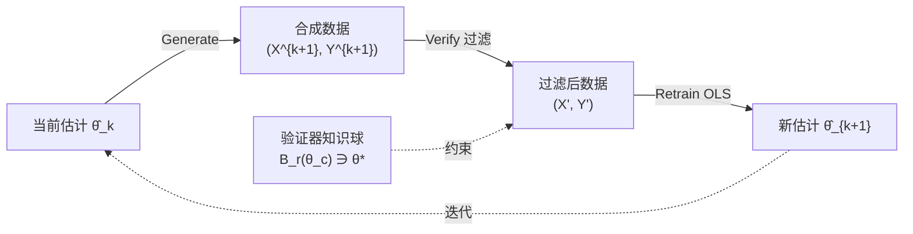

# Escaping Model Collapse via Synthetic Data Verification: Near-term Improvements and Long-term Convergence

**会议**: ICLR 2026  
**OpenReview**: [https://openreview.net/forum?id=yfk6c39omW](https://openreview.net/forum?id=yfk6c39omW)  
**代码**: [liuqiyuanhhh/Verified-Synthetic-Data](https://github.com/liuqiyuanhhh/Verified-Synthetic-Data)  
**领域**: learning theory  
**关键词**: 模型崩溃, 合成数据, 验证器过滤, 偏差-方差权衡, 迭代再训练

## 一句话总结
本文从线性回归这一经典理论设定出发，证明只要引入一个外部"验证器"对自生成的合成数据做过滤再训练，模型崩溃就能被避免——短期靠偏差-方差权衡获得提升，长期则因验证器构成压缩映射而收敛到验证器的"知识中心"$\theta_c$（而非真值），并在 VAE/LLM 上实证验证。

## 研究背景与动机
**领域现状**：合成数据被越来越多地用于训练前沿生成模型（CV、医疗、金融、LLM）。但 Shumailov 等人提出的"模型崩溃"现象表明，反复用自生成数据再训练会持续恶化性能，这与工业界用合成数据成功提升模型的经验形成鲜明矛盾。

**现有痛点**：理论分析（Dohmatob、Gerstgrasser 等）几乎都假设使用**未经过滤**的原始合成数据，把合成数据建模为纯粹的方差膨胀噪声源；少数研究过滤效果的工作又依赖**理想假设**——要么假设验证器完全可靠（Amin 等），要么假设误差是高度结构化的二值标签 i.i.d. 噪声（Feng 等）。

**核心矛盾**：现实中合成数据**很少以原始形态使用**，实践者普遍用语法检查器、LLM-as-a-judge、预训练判别器或人工标注来过滤低质量样本。这个"验证器/判别器"环节恰恰是经验成功与悲观理论之间差距的关键，却一直缺乏严谨刻画。

**本文目标**：在**不完美验证器**（存在偏差和方差）下，刻画 verifier-based synthetic retraining 的短期收益条件与长期收敛行为。

**核心 idea**：验证器虽然只提供 Yes/No 一比特反馈，但它把外部知识"注入"再训练过程，使迭代更新从"恒等映射"变成"压缩映射"——这正是从崩溃逆转为提升的根本机制。

## 方法详解

### 整体框架
本文不提算法而是建立理论框架。核心是 **Generate–Verify–Retrain** 三步循环：当前模型 $\hat\theta_k$ 生成合成数据 → 验证器按规则过滤掉不一致样本 → 在过滤后数据上重估得到 $\hat\theta_{k+1}$。分析锚定在线性回归 $y = x^\top\theta^\star + \xi$ 上，证明该循环诱导一个马尔可夫过程，并分别给出**单轮（Theorem 3.1）**和**长期（Theorem 4.1）**两个定理。

### 关键设计
**1. 验证器建模：用知识球 + 二值反馈刻画不完美验证器。** 验证器拥有关于真值的先验知识，建模为球 $B_r(\theta_c)=\{\theta:\|\theta-\theta_c\|\le r\}$，假设 $\theta^\star\in B_r(\theta_c)$。它**不暴露** $\theta_c$ 或 $r$，只对每个样本 $(x_i,y_i)$ 给出二值判断：若 $|y_i-x_i^\top\theta_c|\le r\|x_i\|+\sigma_c$ 则输出 Yes。其中 $\Delta=\|\theta^\star-\theta_c\|$ 是验证器的**偏差**，$r$ 是**选择性**（$r$ 越小越严格）。用二值反馈而非直接报 $\theta_c$ 的动机来自实践——RLHF 式的 accept/reject 判断噪声更低、成本更省，且验证器（人或更强模型）往往说不清自己的内部参数。

**2. 块结构协变量设计：对角化转移算子。** 为数学清晰，合成协变量 $X^k$ 沿固定标准正交基 $\{v_1,\dots,v_p\}$ 按块构造（每个方向重复若干行）。这一设计"对角化"了转移算子 $\hat\theta_k\mapsto\hat\theta_{k+1}$，消除任意设计带来的旋转变异性，使各正交方向的动力学解耦。作者强调该设计非唯一（标准基、各向同性随机方向均可得到相似定性结论），只是便于严格证明。

**3. 短期：偏差-方差权衡 (Theorem 3.1)。** 初始 OLS 估计 $\hat\theta_0$ 无偏但因 $n_0$ 小而高方差。过滤丢弃不一致样本**降低方差**，但不完美验证器又**注入系统偏差**。定理给出单轮 MSE 的精确分解：
$$\frac{1}{\sigma^2}\mathrm{MSE}(\hat\theta_1)=\sum_{j=1}^p\Big(\underbrace{\frac{m_{2,j}}{n_1}}_{\text{合成方差}}+\underbrace{\frac{m_{1,j}^2+m_{1,j}m_{3,j}+m_{2,j}^2}{\mu_j^2}}_{\text{验证误差}}\Big)+O(n_0^{-4/3})$$
其中 $m_{1,j},m_{3,j}$ 捕捉验证器中心与真值的方向偏差（$\theta_c=\theta^\star$ 时消失），$m_{2,j}<1$ 量化方差削减。当验证器足够准、合成样本 $n_1$ 足够大时，$\mathrm{MSE}(\hat\theta_1)$ **严格优于** baseline $\sum_j\mu_j^{-2}$。这与经典崩溃理论形成尖锐反差：验证把合成数据从"方差膨胀噪声"变成了"方差削减资源"。

**4. 长期：收敛到验证器知识中心 (Theorem 4.1)。** 迭代更新写作 $\hat\theta_{k+1}=T(\hat\theta_k)+\eta_{k+1}$，其中 $T(\cdot)$ 是验证器过滤决定的确定性映射，$\eta$ 是方差按 $\sim 1/n_k$ 衰减的次高斯噪声。关键证明 $T(\cdot)$ 是**压缩映射**：
$$\mathbb{E}\|\hat\theta_k-\theta_c\|^2\le\rho^{2k}\mathbb{E}\|\hat\theta_0-\theta_c\|^2+p\sigma^2\sum_{j=0}^{k-1}\frac{\rho^{2(k-j)-1}}{n_j},\quad 0<\rho<1$$
若 $n_k\to\infty$ 则 $\hat\theta_k\to\theta_c$。这导出三种长期相位：①**无偏验证器**（$\theta_c=\theta^\star$）持续提升直至收敛真值；②**轻微有偏**先升后停滞/回落（最具现实意义）；③**强偏**导致退化甚至崩溃。对比无验证器的旧工作——其更新退化为恒等映射，增大样本只能限界误差却无收敛。验证器选择性 $r$ 只影响收敛速度，不改变收敛点 $\theta_c$。

## 实验关键数据

### 主实验

| 设置 | 指标 | 关键结果 | 对照 | 说明 |
|--------|------|------|------|---|
| 线性回归（模拟） | MSE landscape | 小偏差区域过滤优于 baseline，大偏差区域退化 | 理论预测 vs 实证高度吻合 | 验证 Theorem 3.1 边界锐利性 |
| CVAE / MNIST | FID | 21.17（40 轮过滤再训练最佳） | 60K 真实数据上限 17.56 | 仅用 500 张真实图起步 |
| SmolLM2-135M / XSUM | ROUGE-1 | 过滤再训练早期单调提升 | 未过滤无显著增益 | 15 轮 generate-verify-retrain |

### 消融实验

| 配置 | 指标 | 说明 |
|------|------|------|
| 有偏验证器 $\Delta=1$（60 轮） | $\|\hat\theta_k-\theta_c\|^2$ | 收敛到 $\theta_c$ 而非 $\theta^\star$；$r$ 越小收敛越快 |
| 无偏验证器 $\Delta=0$ | $\|\hat\theta_k-\theta^\star\|^2$ | 过滤始终优于未过滤 baseline |
| 验证器质量（VAE，20K 合成/轮） | FID | 验证器训练数据越多 FID 改善越大；弱验证器早停滞或退化 |
| 保留比例 top 10% | FID | 由单轮分析指导，平衡质量与多样性 |

### 关键发现
- 验证器即使只给一比特反馈，也足以把外部知识注入再训练并扭转崩溃趋势。
- 短期提升与长期收敛是两个不同机制：前者是偏差-方差权衡，后者是压缩映射收敛。
- 即使验证器完美、单轮合成样本无穷，单步也无法收敛——必须靠迭代逐步对齐（验证误差项不随 $n_1$ 消失）。
- VAE 实验中强验证器（60K 真实图训练）带来快速早期 FID 改善后平台化，未验证再训练（虚线）则严重退化，与崩溃理论一致。
- LLM 实验中过滤再训练 ROUGE-1 早期单调上升，未过滤无明显增益——证明文本生成同样遵循该机制。
- 验证器选择性 $r$ 控制收敛**速度**但不改变收敛**点**，这把"短期 vs 长期"两套指标解耦开来。

## 亮点与洞察
- 把"验证器过滤"这一被理论界忽视的实践环节首次纳入模型崩溃的严谨分析，弥合了经验成功与悲观理论的鸿沟。
- 用"恒等映射 vs 压缩映射"这一极简对比，清晰点明验证器到底改变了什么——是它把发散/限界的动力学变成了有收敛点的动力学。
- "收敛到验证器知识中心而非真值"是一个有警示意味的负面结论：再强的合成数据流水线，其天花板也由验证器质量决定。
- 单轮 MSE 分解把"合成方差"与"验证误差"两项显式拆开，给出了"何时该过滤、过滤多严"的可操作判据。
- 把迭代再训练视作离散化随机微分方程（SDE），用超鞅与集中不等式建立收敛，方法论上为后续更复杂模型的分析提供模板。

## 局限与展望
- 理论锚定在线性回归 + 块结构正交协变量设计，虽作者论证可推广，但严格证明对其他设计未给出。
- 验证器建模为球形知识集 + 固定中心，现实验证器的偏差可能随数据分布变化、非静态。
- VAE 实验天花板（FID 21.17 vs 17.56）部分受限于初始仅 500 张真实图与 MLP 验证器缺乏多样性保持机制，验证器的"选择偏差"会过度拒绝难生成的模式。
- LLM 实验用 ROUGE-1 作 oracle 验证器属理想化，真实场景验证器本身也有偏差。
- 收敛点 $\theta_c$ 由验证器决定意味着：若想突破天花板，必须持续提升验证器质量或引入新鲜真实数据，单纯加合成数据无济于事。
- 未来可探索验证器随训练自适应更新、多验证器集成、以及非线性/深度模型下压缩映射性质是否仍成立。

## 相关工作与启发
- **vs 无过滤崩溃理论 (Dohmatob/Gerstgrasser/Shumailov)**：它们把合成数据当方差噪声、更新是恒等映射只能限界；本文证明验证使之成为方差削减资源并带来收敛。
- **vs 理想验证器 (Amin et al. 2025)**：本文允许验证器同时有偏差和方差，不假设完全可靠。
- **vs Feng et al. 2025（二值标签噪声分类）**：本文误差来自生成模型自身而非外生噪声，性能随偏差/选择性平滑变化，而非尖锐相变。
- **vs 奖励最大化框架 (preference matching, RLVR)**：虽都用外部反馈，但本文是过滤式知识注入而非奖励最大化，后者会收敛到最高奖励水平集并丧失多样性。
- **vs 数据累积/混合策略 (Gerstgrasser, Bertrand)**：累积数据或混合真实数据能稳定再训练但缺乏主动知识注入；本文的验证器过滤是正交且互补的第三类机制。

## 评分
- 新颖性: ⭐⭐⭐⭐⭐ 首个把不完美验证器过滤纳入模型崩溃严谨理论，"压缩映射→收敛知识中心"的洞察干净有力。
- 实验充分度: ⭐⭐⭐⭐ 线性回归/VAE/LLM 三层验证理论，覆盖面好；但 VAE/LLM 规模偏小，验证器设定较理想化。
- 写作质量: ⭐⭐⭐⭐⭐ 理论与直觉交替推进，定理含义解释透彻，恒等 vs 压缩映射的对比极具启发。
- 价值: ⭐⭐⭐⭐ 为"用合成数据训练时是否/如何过滤"提供了原则性指导，对合成数据流水线设计有实际意义。

<!-- RELATED:START -->

## 相关论文

- [\[ICLR 2026\] Preventing Model Collapse Under Overparametrization: Optimal Mixing Ratios for Interpolation Learning and Ridge Regression](preventing_model_collapse_under_overparametrization_optimal_mixing_ratios_for_in.md)
- [\[ICLR 2026\] High-dimensional Analysis of Synthetic Data Selection](high-dimensional_analysis_of_synthetic_data_selection.md)
- [\[ICML 2026\] When Sample Selection Bias Precipitates Model Collapse](../../ICML2026/learning_theory/when_sample_selection_bias_precipitates_model_collapse.md)
- [\[ICLR 2026\] Optimizing Data Augmentation through Bayesian Model Selection](optimizing_data_augmentation_through_bayesian_model_selection.md)
- [\[ICLR 2026\] Memorizing Long-tail Data Can Help Generalization Through Composition](memorizing_long-tail_data_can_help_generalization_through_composition.md)

<!-- RELATED:END -->
