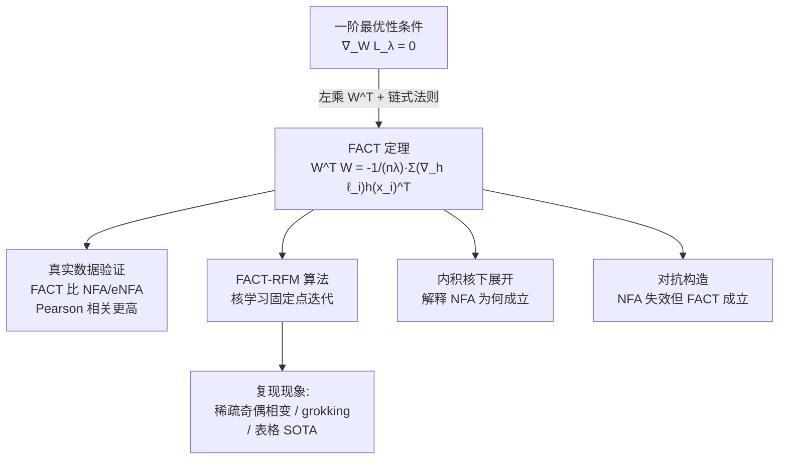

# FACT: a first-principles alternative to the Neural Feature Ansatz for how networks learn representations

**会议**: ICLR 2026  
**OpenReview**: [https://openreview.net/forum?id=j4964wtJMz](https://openreview.net/forum?id=j4964wtJMz)  
**代码**: 待确认  
**领域**: 深度学习理论 / 特征学习  
**关键词**: Neural Feature Ansatz, 特征学习, 一阶最优性, AGOP, Recursive Feature Machine, grokking  

## 一句话总结
本文用训练收敛时的一阶最优性条件推出 **FACT（Features at Convergence Theorem）**——一个权重衰减网络在收敛点必然满足的自洽公式 $W^\top W = -\frac{1}{n\lambda}\sum_i (\nabla_h \ell_i) h(x_i)^\top$，它替代了纯经验猜测的 Neural Feature Ansatz（NFA），不仅与收敛特征吻合更好，还能解释 NFA 为何通常成立、以及在哪些退化场景下会失效。

## 研究背景与动机
- **领域现状**：理解神经网络如何学习表征是深度学习理论的核心问题。Radhakrishnan 等人（2024）提出的 **Neural Feature Ansatz（NFA）** 是当前最具影响力的猜想，它断言训练后某权重层满足比例关系 $W^\top W \propto (\text{AGOP})^s$，其中 AGOP 是输入梯度外积的平均（Average Gradient Outer Product）。NFA 在全连接、卷积、Transformer 上都被经验验证，还被用于解释 grokking、阶梯函数学习、catapult spike，并衍生出在表格数据上达到 SOTA 的自适应核算法 RFM。
- **现有痛点**：NFA 是一个"受过教育的猜测"（educated guess），缺乏第一性原理支撑。因为它是经验拟合出来的，所以无法回答三个关键问题——为什么它**应该**成立？它在什么条件下会**失效**？又该如何**改进**它？
- **核心矛盾**：经验驱动的 NFA 文献与理论驱动的"一阶最优性"文献长期各说各话。后者早已证明网络收敛时的一阶最优条件能推出低秩偏置、稀疏偏置、神经坍缩等现象，却从未与 NFA 建立联系。
- **本文目标**：从第一性原理推出一个可证明在收敛时成立、且经验上与学到特征吻合更好的替代关系，并用它统一上述两条研究路线。
- **核心 idea**：**从损失对 $W$ 的一阶临界点条件（$\nabla_W L_\lambda = 0$）出发，左乘 $W^\top$ 并整理，直接得到 $W^\top W$ 的闭式表达式**——这就是 FACT。它不是猜的，而是从平稳性条件代数推导出来的恒等式。

## 方法详解

### 整体框架
FACT 的核心是一条"收敛时必然成立"的自洽公式。论文围绕它展开四件事：(1) 推导 FACT 定理并在真实数据上验证它比 NFA/eNFA 吻合更好；(2) 把 FACT 嵌入 Recursive Feature Machine（RFM）核学习算法，证明 FACT-RFM 能复现稀疏奇偶相变、模算术 grokking、表格数据 SOTA 等 NFA 已知现象；(3) 在内积核下代数展开 FACT，解释 NFA 为何通常成立；(4) 构造对抗数据集，证明存在 NFA 失效而 FACT 仍成立的退化场景。

### 关键设计

**1. Features at Convergence Theorem：从平稳性条件直接读出 $W^\top W$。** 设模型 $f(x;\theta)=g(Wh(x),x)$，唯一架构要求是模型仅通过矩阵乘法 $Wh(x)$ 依赖 $W$（几乎覆盖任意含权重矩阵的层）。在带权重衰减 $\lambda>0$ 的训练损失 $L_\lambda(\theta)=L(\theta)+\frac{\lambda}{2}\|\theta\|_F^2$ 的临界点处，有 $\nabla_W L_\lambda=\lambda W+\nabla_W L=0$。左乘 $W^\top$ 并展开链式法则即得
$$W^\top W = \text{FACT} := -\frac{1}{n\lambda}\sum_{i=1}^{n}(\nabla_h \ell_i)\,h(x_i)^\top,$$
其中 $\nabla_h \ell_i$ 是损失对该层输入的梯度。证明只有四行，本质是平稳性条件的简单改写——但正是这种"几乎平凡"让它成为 NFA 的坚实第一性原理对照物。与 NFA 用模型输出梯度外积 $\nabla_h f_i (\nabla_h f_i)^\top$ 不同，FACT 用的是**损失梯度与激活的外积**，且系数里显式出现了权重衰减 $\lambda$，这把"为什么需要 weight decay"也讲清楚了。

**2. 对称化与前向/后向两个版本，让右端与 $W^\top W$ 共享对称性。** 左端 $W^\top W$ 恒为半正定，而右端 FACT 只在临界点才保证半正定。利用 $W^\top W=(W^\top W)^\top=\sqrt{(W^\top W)(W^\top W)^\top}$ 这类恒等式，可在收敛时派生出 $W^\top W=\text{FACT}^\top$、$W^\top W=\sqrt{\text{FACT}\cdot\text{FACT}^\top}$ 等多个等价关系，从而把右端"修正"成半正定。论文还给出对偶的 **backward 版 bFACT**：$WW^\top=-\frac{1}{n\lambda}\sum_i (Wh(x_i))(\nabla_{Wh}\ell_i)^\top$，它刻画 $W$ 的**左**奇异向量，与 FACT 刻画右奇异向量互补。

**3. FACT-RFM：把固定点迭代的不动点对齐到 FACT 关系。** RFM 通过学习线性变换 $W$ 并对变换后数据套核 $K_W(x,x')=K(Wx,Wx')$ 来模仿神经网络的特征学习；原版 NFA-RFM 的更新是 $W_{t+1}\leftarrow(\text{AGOP}_t)^{s/2}$。本文把更新替换为 $W_{t+1}\leftarrow((\text{FACT}_t)(\text{FACT}_t)^\top)^{1/4}$，并给出一个与上一轮几何平均、提升稳定性的变体 $W_{t+1}\leftarrow((\text{FACT}_t)(W_t^\top W_t)^2(\text{FACT}_t)^\top)^{1/8}$。指数被精心选取，使迭代的**不动点恰好等于** Theorem 3.1 推出的 FACT 关系——这保证了算法收敛到的特征与理论预言一致。

**4. 内积核下的代数展开：揭示 NFA 是 FACT 的"相似度代理"。** 对内积核 $K_W(x,x')=k(x^\top M x')$（$M=W^\top W$），FACT 与 AGOP 都能写成 $\sum_{i,j}(\cdot)\,M x_i \alpha_i^\top \alpha_j x_j^\top M^\top$ 的统一结构，区别只在权重因子：NFA 用 $\tau(x_i,M,x_j)=\frac{1}{n}\sum_l k'(x_l^\top M x_i)k'(x_l^\top M x_j)$，FACT 用 $k'(x_i^\top M x_j)$。两者都可解读为数据点相似度。当 $k$ 非增（如 $k(t)=\exp(t)$、$k(t)=t^2$）时 $\text{FACT}\cdot M^\top$ 半正定，更新简化为优雅的几何平均 $M_{t+1}\leftarrow(\text{FACT}_t M_t)^{1/2}$，与 NFA 的 $M_t\leftarrow(\text{AGOP})^{1/2}$ 形式同构。于是"若 $\tau$ 与 $k'$ 对多数点对近似成正比，NFA 就近似 FACT"——这正是 NFA 通常成立的根因（实验在 mod 61 上拟合 $R^2=0.987$）。

## 实验关键数据

### 主实验：表格数据（UCI 120 个数据集）

| 方法 | 平均测试准确率 (%) |
|------|------|
| FACT-RFM（无几何平均） | **85.22** |
| FACT-RFM（几何平均） | 84.99 |
| NFA-RFM | 85.10 |
| Laplace 核回归（无特征学习） | 83.71 |

FACT-RFM 与 NFA-RFM 准确率基本持平，且都显著超过无特征学习的核回归基线。

### FACT 关系验证（MNIST / CIFAR-10）

| 设置 | 结论 |
|------|------|
| 5 隐层 ReLU MLP，MSE 损失，weight decay $10^{-4}$ | 收敛时 FACT 两端的 Pearson 相关性**普遍高于** NFA、eNFA |
| 跨各隐层，5 次独立运行平均 | FACT 在所有层都高度相关 |

### 现象复现与可分性

| 任务 | 结果 |
|------|------|
| 稀疏奇偶 $k=2,3,4$（$d=50$） | FACT-RFM 与 NFA-RFM 学到的低秩特征"惊人地相似"，都落在奇偶支撑集上 |
| 稀疏奇偶低数据 $n{=}25000,k{=}4$ | FACT-RFM 复现训练 MLP 时的**相变**现象 |
| 模算术 $(x+y)\bmod 61$，75 次迭代 | 两法均达 100% 测试准确率并出现 **grokking**，特征矩阵呈块循环结构 |
| 对抗两层网络（quadratic 激活，宽度 $m\ge7$） | **Theorem 6.1**：存在 $p_\epsilon,\tau_\epsilon,\lambda_\epsilon$ 使 $\text{corr}((\text{AGOP})^s,W^\top W)<\epsilon$，即 NFA 与真权重近乎无关，而 FACT 仍成立 |

### 关键发现
- FACT 在真实数据上比 NFA/eNFA 与 $W^\top W$ 吻合得更好，且**有证明**保证它在收敛时严格成立。
- FACT-RFM 在不损失性能的前提下复现了 NFA 已知的全部特征学习现象，说明第一性原理版本同样捕捉到了核心机制。
- 内积核下的展开把 NFA 的"相似度因子" $\tau$ 与 FACT 的 $k'$ 对应起来，给"NFA 为何成立"提供了可验证的解释。
- 对抗构造证明 NFA 可被任意打破而 FACT 不会，从理论上确立 FACT 是更可靠的替代。

## 亮点与洞察
- **把猜想升级为定理**：FACT 的最大价值在于它用四行代数把一个被广泛使用却"知其然不知其所以然"的经验关系，变成了带权重衰减网络在收敛时**必然满足**的恒等式。
- **统一两条研究路线**：NFA 文献（经验）与一阶最优性文献（理论）首次被同一个公式打通，FACT 同时是两者的产物。
- **可证伪 + 可证实**：既给出 NFA 通常成立的解释（内积核展开 + $R^2=0.987$ 拟合），又构造出 NFA 失效的反例（Theorem 6.1），论证闭环完整。
- **架构无关**：只要层"通过矩阵乘法依赖 $W$"即可应用，FACT 对全连接、卷积、Transformer 通用。

## 局限与展望
- **依赖收敛假设**：FACT 仅在损失临界点严格成立，对未充分训练或非临界点的网络只是近似；现实训练能否真正收敛到临界点存在差距。
- **需要非零权重衰减**：公式分母含 $\lambda$，$\lambda\to0$ 时退化，不能直接刻画无显式正则的训练。
- **解释 NFA 的部分限于内积核**：第 5 节的代数对应只在内积核下严格成立，一般核/深层非线性堆叠下 NFA 与 FACT 的关系仍待补全。
- **理论与算法之间的指数选取**：FACT-RFM 的 $1/4$、$1/8$ 指数是为对齐不动点而手工设定，缺乏更一般的最优性论证。
- **展望**：FACT 提供了一个研究特征学习失效模式的探针，未来可用它系统刻画哪些数据分布会让经验型 ansatz 崩溃，并指导设计更鲁棒的自适应核 / 特征学习算法。

## 相关工作与启发
- **Neural Feature Ansatz**（Radhakrishnan et al., 2024）：本文的直接对照对象与 RFM 算法来源。
- **Equivariant NFA**（Ziyin et al., 2025）：另一个基于噪声 SGD 动力学、对损失线性变换不变的替代，本文在实验中一并比较。
- **一阶最优性 / KKT 隐式偏置**（Soudry et al. 2018；Lyu & Li 2019；Gunasekar et al. 2017/2018；Woodworth et al. 2020）：FACT 正是把这条线的工具引入 NFA 问题。
- **grokking 与稀疏奇偶相变**（Nanda et al. 2023；Mallinar et al. 2025；Barak et al. 2022；Abbe et al. 2023）：本文用来检验 FACT-RFM 是否捕捉到真实特征学习现象。
- **启发**：当一个经验关系"屡试不爽"却没有理论根基时，回到优化的一阶必要条件往往能给出最朴素也最坚实的解释——FACT 是这一方法论的范例。

## 评分
- **新颖性**: ⭐⭐⭐⭐⭐ 用一阶最优性把广泛使用的 NFA 从猜想升级为可证明定理，并统一了两条独立研究路线，视角新颖且有方法论意义。
- **实验充分度**: ⭐⭐⭐⭐ 覆盖真实数据验证、表格 SOTA、稀疏奇偶相变、模算术 grokking、对抗反例，正反两面齐全；但深层 Transformer 等大规模架构上的直接验证略少。
- **写作质量**: ⭐⭐⭐⭐⭐ 推导简洁、动机清晰，"为何成立 / 何时失效"组织成完整论证闭环，理论与实验衔接自然。
- **价值**: ⭐⭐⭐⭐⭐ 为特征学习理论提供了坚实且可操作的第一性原理工具，对解释与改进自适应核 / 特征学习算法有长期参考价值。

<!-- RELATED:START -->

## 相关论文

- [\[ICLR 2026\] Scaling Laws and Spectra of Shallow Neural Networks in the Feature Learning Regime](scaling_laws_and_spectra_of_shallow_neural_networks_in_the_feature_learning_regi.md)
- [\[ICLR 2026\] Feature Compression is the Root Cause of Adversarial Fragility in Neural Networks](feature_compression_is_the_root_cause_of_adversarial_fragility_in_neural_network.md)
- [\[ICLR 2026\] Transfer Learning in Infinite Width Feature Learning Networks](transfer_learning_in_infinite_width_feature_learning_networks.md)
- [\[ICLR 2026\] Proper Velocity Neural Networks](proper_velocity_neural_networks.md)
- [\[ICLR 2026\] On the Convergence of Two-Layer Kolmogorov-Arnold Networks with First-Layer Training](on_the_convergence_of_two-layer_kolmogorov-arnold_networks_with_first-layer_trai.md)

<!-- RELATED:END -->
