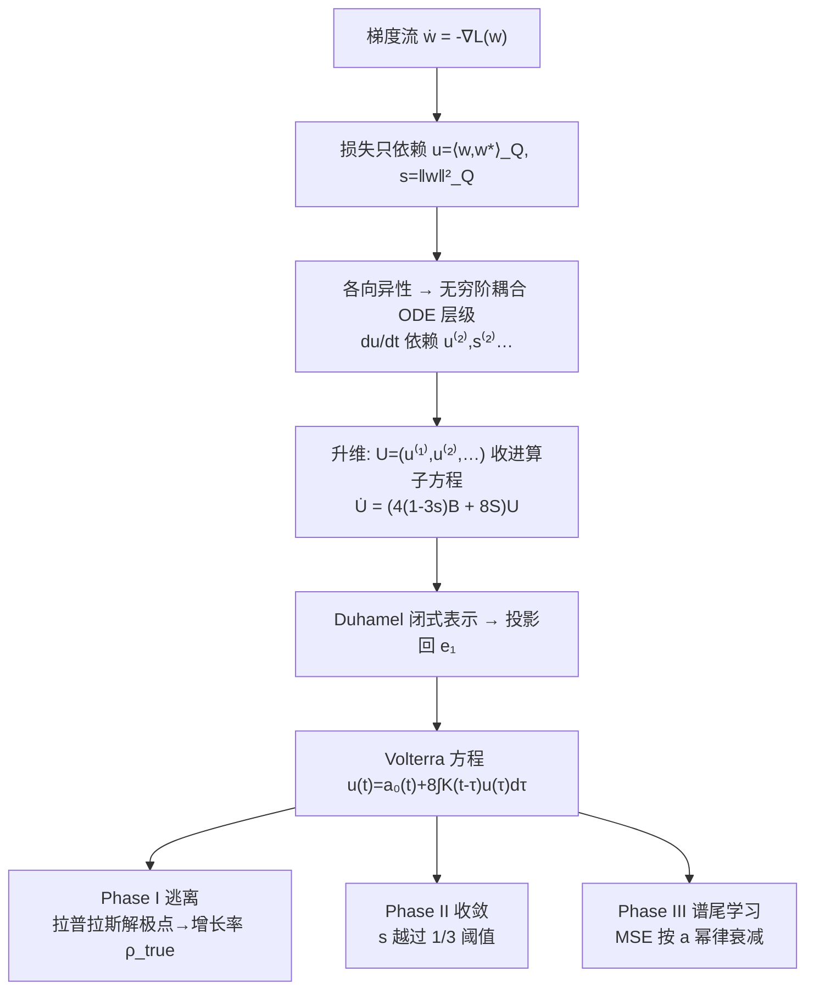

# Fast Escape, Slow Convergence: Learning Dynamics of Phase Retrieval under Power-Law Data

**会议**: ICLR 2026  
**OpenReview**: [https://openreview.net/forum?id=Ae4eZpkXBX](https://openreview.net/forum?id=Ae4eZpkXBX)  
**代码**: 待确认  
**领域**: learning theory / 学习动力学  
**关键词**: scaling laws, phase retrieval, anisotropic data, power-law spectrum, gradient flow, Volterra equation  

## 一句话总结
本文给出第一个对**各向异性（power-law 协方差）非线性回归**（phase retrieval）的严格学习动力学刻画：证明训练轨迹分成"快速逃离平庸—缓慢收敛—谱尾学习"三个阶段，并由谱衰减指数 $a$ 显式推出 MSE 的 scaling law。

## 研究背景与动机
- **领域现状**：Scaling laws（损失随数据/算力/时间按幂律下降）是现代深度学习的核心经验规律，但理论上只在**线性模型**（kernel ridge、随机特征、SGD）里被讲清楚，靠 source/capacity condition 框架已相当成熟。
- **现有痛点**：真正实用的是**非线性**特征映射，而非线性场景下的 scaling law 分析几乎全部假设**各向同性（isotropic）**输入。各向同性下 phase retrieval 的动力学会塌缩成一个二维 ODE，分析的核心难点只是"逃离平庸"（escape mediocrity）。一旦输入协方差是各向异性的幂律谱，这套二维闭合结构就失效。
- **核心矛盾**：各向异性把"有限维闭合"彻底打破——summary statistics $u(t)=\langle w,w^\star\rangle_Q$、$s(t)=\|w\|_Q^2$ 的导数会耦合到更高阶加权重叠 $u^{(k)},s^{(k)}$，形成一条**无穷阶耦合 ODE 层级**，无法像各向同性那样直接求解。
- **本文目标**：在 canonical 非线性模型 phase retrieval $y=\langle x,w^\star\rangle^2+\xi,\ x\sim\mathcal N(0,Q)$（$Q$ 特征值 $\lambda_i\propto i^{-a},\ a>1$）上，回答"输入谱如何支配有限时间收敛、能否从谱衰减预测学习曲线"。
- **核心 idea**：**用 Duhamel 公式把无穷层级写成闭式表示，再做分阶段近似把无穷维动力学降成可解的 Volterra 方程**，从而逐阶段提取停时与衰减率，最终读出 scaling law。

## 方法详解

### 整体框架
研究对象是 phase retrieval 的总体梯度流 $\dot w(t)=-\nabla_w L(w(t))$。作者先证明损失只依赖两个 summary statistics，从而看清地貌；但各向异性让这两个统计量的演化耦合进无穷阶高阶重叠。于是整套分析走"**先升维求解、再投影降维**"的路线：把无穷条耦合方程收进一个由右移算子 + 秩一扰动生成的算子方程，用 Duhamel 解出闭式，再投影回 $u(t)$ 得到单个 Volterra 积分方程，最后按三个物理阶段分别做近似并用拉普拉斯/留数计算读出增长率与衰减率。

### 关键设计

**1. 损失化简：把高维非凸问题压成两个标量观测量。** 作者先证明（Proposition 1）尽管 $w$ 是 $d$ 维、损失非凸，总体损失只通过两个 $Q$-加权统计量进入：$L(w)=3s^2+3s_\star^2-4u^2-2s_\star s$，其中 $s=\|w\|_Q^2,\ u=\langle w,w^\star\rangle_Q$。配合梯度/Hessian（Proposition 2）可证临界点只有 $\{0,\pm w^\star\}$ 和一族鞍点 $(u,s)=(0,s_\star/3)$，**没有 spurious local minima**，$\pm w^\star$ 是全局最优。这说明慢收敛不是被坏极小困住，而是几何上的平台：初始化时 $u(0)\approx d^{-1/2}\approx0$ 落在低相关区，梯度极小，迭代要很久才逃出去。

**2. 无穷阶层级与各向异性的本质困难。** 关键观察（Proposition 3）是：各向异性下 $u(t),s(t)$ 的导数必然牵涉更高阶加权重叠 $s^{(k)}=\|w\|_{Q^k}^2,\ u^{(k)}=\langle w,w^\star\rangle_{Q^k}$，给出 $\dot u^{(k)}=4(s_\star-3s)u^{(k+1)}+8u\,s_\star^{(k+1)}$ 这类递推——**第 $k$ 阶的变化率依赖第 $k{+}1$ 阶**，没有有限维闭合。各向异性梯度流本质上是各向同性流的 $Q$-预条件版本（$\dot z=-Q\nabla L_I(z)$），临界点相同但动力学被 $Q$ 大幅扭曲。这是整篇文章要攻克的结构性障碍。

**3. Duhamel 升维 + Volterra 降维：把无穷维变可解。** 这是方法的技术核心。作者把所有相关量收成向量 $U(t)=(u^{(1)},u^{(2)},\dots)^\top$，用右移算子 $B$（$(Bx)_k=x_{k+1}$）和秩一算子 $S$ 把整条层级压成紧凑算子方程 $\dot U=\big(4(1-3s)B+8S\big)U$——**整个无穷系统由"移位算子 + 秩一扰动"生成**。对其用 Duhamel 公式得到闭式解（Lemma 1），再把解投影回第一坐标 $e_1$，在 $s(t)\le\delta$ 的早期区间近似 $\Theta(t)\approx t$，就得到一个标量 Volterra 方程 $u(t)=a_0(t)+8\int_0^t K(t-\tau)u(\tau)\,d\tau$，其中核 $K(t)=\sum_i(w_i^\star)^2\lambda_i^2 e^{4\lambda_i t}$。对其做拉普拉斯变换 $\hat u(p)=\hat a_0(p)/(1-8\hat K(p))$，$u(t)$ 的增长由 $\hat u$ 最右极点支配，从而 $u(t)$ 以速率 $e^{\rho_{\text{true}}t}$ 增长，$\rho_{\text{true}}>4\lambda_1$ 是 $1=8\hat K(\rho)$ 的唯一正根（Lemma 2）。

**4. 三阶段分解与谱尾驱动的 scaling law。** 由经验轨迹（Figure 2）观察到三阶段，作者逐阶段给出严格停时（Theorem 1）：**Phase I 逃离平庸** $t\le T_1=O(\log d)$，$u$ 指数逃离零、但 MSE 几乎不动（只学了大特征值方向）；**Phase II 收敛** $T_1\le t<T_2$，$s$ 越过临界阈值 $1/3$ 并稳住、$u,s\to1$，其中 $T_2=T_1'+O(\varepsilon^{-2a/(a-1)}\log(1/\varepsilon))$，收敛比各向同性慢；**Phase III 谱尾学习** $t>T_2$，summary statistics 已稳定但 MSE 继续下降，由最小特征值方向支配。Theorem 2 给出 Phase III 的 MSE 显式渐近：定义 $x_d=(\beta_d\tau)^{1/a}$，则 $S_d(\tau)$ 在中段满足 $1-\Gamma(1-\tfrac1a)\tfrac{x_d}{d}+o(\cdot)$——**指数 $a$ 直接决定 log–log 曲线的斜率**，这正是 Figure 1 中观测到的 scaling law 来源。一句话总结结论：逃离可以更快（$a$ 大时 $u$ 增长更快），但低 MSE 收敛被谱尾拖慢，形成 escape–convergence 权衡。

## 实验关键数据

### 主实验（数值验证三阶段与指数）

| 现象 | 设定 | 观测结果 | 与理论 |
|------|------|----------|--------|
| MSE 学习曲线（Fig.1，online SGD） | 不同谱指数 $a$，相同初始化/噪声/步长 | $a>1$ 时收敛明显慢于各向同性的指数衰减；$a$ 越大衰减越慢 | 与谱尾 scaling law 一致 |
| $u(t),s(t)$ 演化（Fig.2，population GD） | $a=2,\ d=10^4,\ \eta=10^{-2},\ T=10^6$ | 清晰呈现 I→IIa→IIb→III 三阶段、平台后骤降 | 印证三阶段分解 |
| 相关 $u(t)$ 增长（Fig.3） | 不同 $a$，$d=1000,\ \eta=10^{-3}$ | $a$ 越大 $u$ 越快达到常数阶相关 | 印证 Remark 4（逃离更快） |

### 关键停时（理论刻画）

| 阶段 | 停时 | 含义 |
|------|------|------|
| Phase I（逃离平庸） | $T_1=O(\log d)$ | 受 $\log(1/\|u(0)\|)$ 控制，各向异性不消除 $\log d$ 障碍 |
| Phase IIa（过阈值） | $T_1'=T_1+O(1)$ | $s$ 越过 $1/3$ 并稳住 |
| Phase II（收敛） | $T_2=T_1'+O(\varepsilon^{-2a/(a-1)}\log(1/\varepsilon))$ | 比各向同性慢，精度 $\varepsilon$ 越高代价越大 |

### 关键发现
- **Escape–convergence 权衡**：$a$ 大 → 逃离更快但收敛更慢，定性翻转了各向同性下的直觉。
- **平台来自几何而非坏极小**：无 spurious local minima，平台源于低相关区梯度极小 + 谱尾难学。
- **MSE 在 $T_2$ 前几乎不降**（Proposition 4 给出 $\mathrm{MSE}(T_2)-\sigma_\star^2$ 上界），之后才由谱尾按 $a$ 决定的斜率衰减。

## 亮点与洞察
- **第一个各向异性非线性回归的严格 scaling law 刻画**，填补"线性各向异性已懂、非线性几乎只懂各向同性"的空白。
- **"升维求闭式、降维成 Volterra"的技术范式**很优雅：把"无穷阶耦合"这个看似无从下手的障碍，转成移位算子 + 秩一扰动的算子方程，再用经典 Duhamel/留数工具读出增长率，方法学上可迁移到其他 single-index/quadratic 模型。
- **把经验 scaling law 的"平台—骤降"结构机制化**：明确指出平台是大特征值方向先学完但 MSE 不动，骤降来自谱尾方向逐步被学到。

## 局限与展望
- **分析在总体（population）梯度流层面**，把标签噪声当常数项消掉，没有处理有限样本/一遍 SGD 的涨落，与真实 online 训练仍有差距（虽然 Fig.1 用 SGD 做了佐证）。
- **模型是单神经元 quadratic activation 的 phase retrieval**，是非线性的最小可解模型，离多层网络/真实特征学习还远；power-law 谱也是理想化假设。
- **未做预条件**：作者刻意分析无预条件梯度流以暴露各向异性效应，但实践中常用预条件方法，二者动力学差异值得后续刻画。
- 展望：把三阶段刻画推广到 multi-index、有限步长 SGD、以及谱尾与特征学习联合的设定。

## 相关工作与启发
- **Scaling law 理论**：kernel ridge / 随机特征 / SGD 的 source-capacity 框架（Caponnetto-De Vito、Cui et al.、Bahri et al.），以及 Wortsman & Loureiro (2025) 各向异性 power-law 下的 kernel ridge；本文把这条线推到**非线性**。
- **Phase retrieval 与 quadratic net**：spectral init、Wirtinger flow（Candès et al.）、quadratic 网络训练动力学（Sarao Mannelli et al.、Ben Arous et al. 2025 的一遍 SGD scaling law）；本文聚焦各向异性协方差对学习曲线的影响这一被忽视的方面。
- **非凸优化与特征学习**：multi-index/shallow net 的相变与计算-统计权衡多在各向同性下做；本文证明各向异性破坏有限维闭合、并用 Duhamel–Volterra 降维得到显式 scaling law。
- **启发**：对任何"summary statistics 不闭合"的动力学，"无穷层级 → 算子方程 → Duhamel 闭式 → 投影成 Volterra"是一条可复用的攻坚路径。

## 评分
- **新颖性**: ⭐⭐⭐⭐⭐ 第一个各向异性非线性回归的严格 scaling law，结构性观察（无穷层级 = 移位 + 秩一）和 Duhamel–Volterra 降维都很原创。
- **实验充分度**: ⭐⭐⭐⭐ 数值实验清晰印证三阶段、停时与指数，但作为理论文章实验主要起佐证作用，未触及真实数据/有限样本。
- **写作质量**: ⭐⭐⭐⭐ 三阶段叙事 + 证明大纲层次清楚，符号较重但 Remark 把直觉讲透。
- **价值**: ⭐⭐⭐⭐ 为理解 power-law 数据下非线性模型的 scaling law 提供首个可证机制，方法范式可迁移，对 scaling law 理论社区有实质推进。

<!-- RELATED:START -->

## 相关论文

- [\[ICLR 2026\] Theoretical Analysis of Contrastive Learning under Imbalanced Data: From Training Dynamics to a Pruning Solution](theoretical_analysis_of_contrastive_learning_under_imbalanced_data_from_training.md)
- [\[ICLR 2026\] Data-to-Energy Stochastic Dynamics](data-to-energy_stochastic_dynamics.md)
- [\[ICLR 2026\] Convergence Dynamics of Over-Parameterized Score Matching for a Single Gaussian](convergence_dynamics_of_over-parameterized_score_matching_for_a_single_gaussian.md)
- [\[ICLR 2026\] Escaping Model Collapse via Synthetic Data Verification: Near-term Improvements and Long-term Convergence](escaping_model_collapse_via_synthetic_data_verification_near-term_improvements_a.md)
- [\[ICLR 2026\] A Sharp KL Convergence Analysis for Diffusion Models under Minimal Assumptions](a_sharp_kl_convergence_analysis_for_diffusion_models_under_minimal_assumptions.md)

<!-- RELATED:END -->
